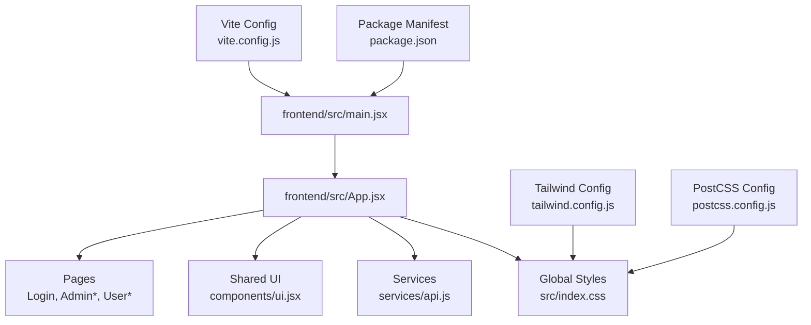
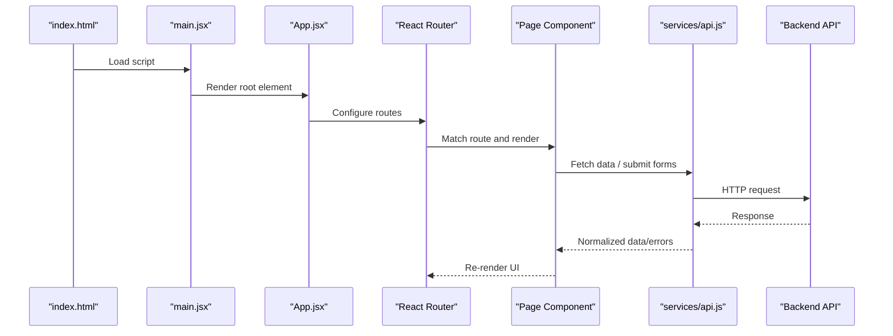
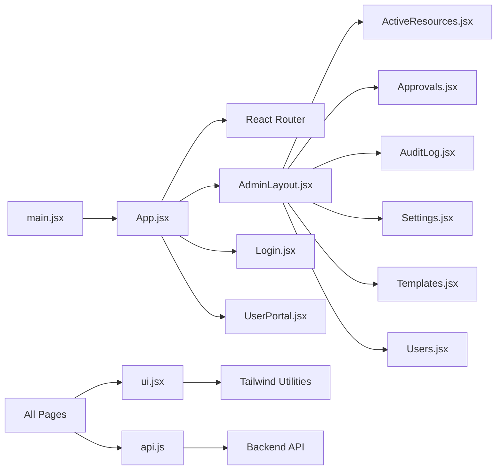
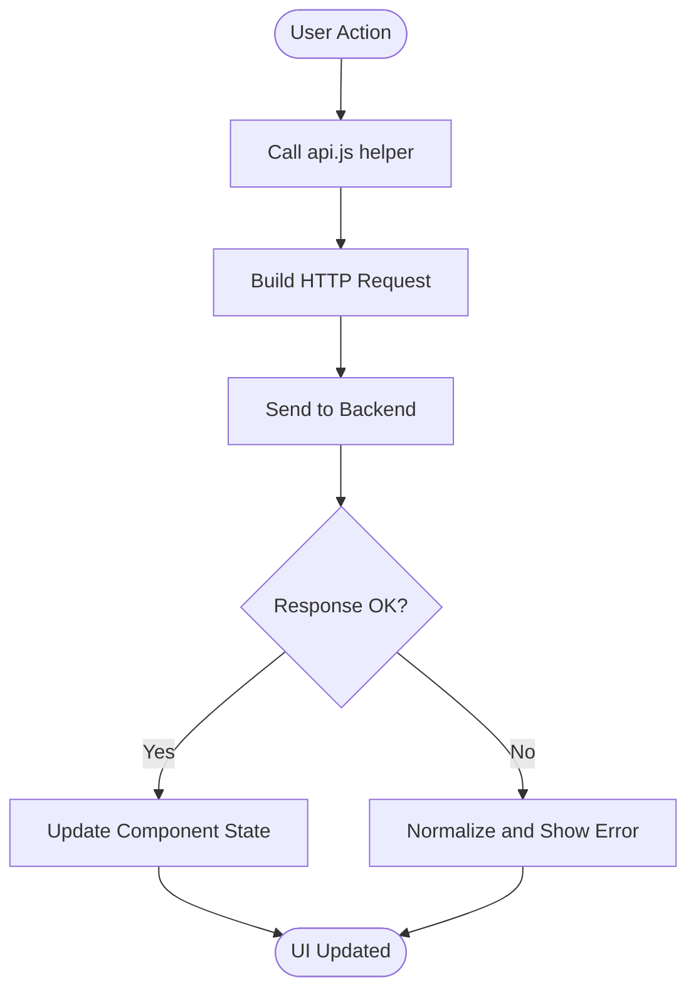

# Application Structure & Core Components

<cite>
**Referenced Files in This Document**
- [main.jsx](file://frontend/src/main.jsx)
- [App.jsx](file://frontend/src/App.jsx)
- [index.css](file://frontend/src/index.css)
- [tailwind.config.js](file://frontend/tailwind.config.js)
- [postcss.config.js](file://frontend/postcss.config.js)
- [vite.config.js](file://frontend/vite.config.js)
- [package.json](file://frontend/package.json)
- [api.js](file://frontend/src/services/api.js)
- [ui.jsx](file://frontend/src/components/ui.jsx)
- [Login.jsx](file://frontend/src/pages/Login.jsx)
- [AdminLayout.jsx](file://frontend/src/pages/admin/AdminLayout.jsx)
- [ActiveResources.jsx](file://frontend/src/pages/admin/ActiveResources.jsx)
- [Approvals.jsx](file://frontend/src/pages/admin/Approvals.jsx)
- [AuditLog.jsx](file://frontend/src/pages/admin/AuditLog.jsx)
- [Settings.jsx](file://frontend/src/pages/admin/Settings.jsx)
- [Templates.jsx](file://frontend/src/pages/admin/Templates.jsx)
- [Users.jsx](file://frontend/src/pages/admin/Users.jsx)
- [UserPortal.jsx](file://frontend/src/pages/user/UserPortal.jsx)
</cite>

## Table of Contents
1. [Introduction](#introduction)
2. [Project Structure](#project-structure)
3. [Core Components](#core-components)
4. [Architecture Overview](#architecture-overview)
5. [Detailed Component Analysis](#detailed-component-analysis)
6. [Dependency Analysis](#dependency-analysis)
7. [Performance Considerations](#performance-considerations)
8. [Troubleshooting Guide](#troubleshooting-guide)
9. [Conclusion](#conclusion)
10. [Appendices](#appendices)

## Introduction
This document explains the React frontend application structure and core components, focusing on:
- Bootstrap process in main.jsx
- Root App component architecture and routing setup
- Global styling configuration with Tailwind CSS
- Component hierarchy and composition patterns
- State management patterns and service initialization
- Error boundaries and performance optimization strategies
- CSS architecture using Tailwind utility classes and global styles

The goal is to provide a clear mental model for both new contributors and experienced developers to understand how the application initializes, routes, renders UI, and interacts with backend services.

## Project Structure
The frontend is organized by feature areas (pages), shared UI primitives (components), and cross-cutting concerns (services). The build toolchain uses Vite with PostCSS and Tailwind CSS.

**Diagram sources**
- [main.jsx:1-200](file://frontend/src/main.jsx#L1-L200)
- [App.jsx:1-200](file://frontend/src/App.jsx#L1-L200)
- [index.css:1-200](file://frontend/src/index.css#L1-L200)
- [tailwind.config.js:1-200](file://frontend/tailwind.config.js#L1-L200)
- [postcss.config.js:1-200](file://frontend/postcss.config.js#L1-L200)
- [vite.config.js:1-200](file://frontend/vite.config.js#L1-L200)
- [package.json:1-200](file://frontend/package.json#L1-L200)

**Section sources**
- [main.jsx:1-200](file://frontend/src/main.jsx#L1-L200)
- [App.jsx:1-200](file://frontend/src/App.jsx#L1-L200)
- [index.css:1-200](file://frontend/src/index.css#L1-L200)
- [tailwind.config.js:1-200](file://frontend/tailwind.config.js#L1-L200)
- [postcss.config.config.js:1-200](file://frontend/postcss.config.js#L1-L200)
- [vite.config.js:1-200](file://frontend/vite.config.js#L1-L200)
- [package.json:1-200](file://frontend/package.json#L1-L200)

## Core Components
- Bootstrap entrypoint: main.jsx mounts the React tree into the DOM and configures providers or root elements.
- Root app: App.jsx defines top-level layout, route configuration, and global state wiring.
- Shared UI: components/ui.jsx provides reusable primitives used across pages.
- Services: services/api.js centralizes HTTP client configuration and request/response handling.
- Pages: pages/* implement feature-specific views and compose UI primitives.

Key responsibilities:
- Initialization order: index.html -> main.jsx -> App.jsx -> Routes -> Page components
- Styling pipeline: Tailwind config + PostCSS -> index.css -> runtime utilities
- Service layer: api.js encapsulates base URL, headers, interceptors, and error normalization

**Section sources**
- [main.jsx:1-200](file://frontend/src/main.jsx#L1-L200)
- [App.jsx:1-200](file://frontend/src/App.jsx#L1-L200)
- [ui.jsx:1-200](file://frontend/src/components/ui.jsx#L1-L200)
- [api.js:1-200](file://frontend/src/services/api.js#L1-L200)

## Architecture Overview
High-level flow from bootstrap to rendering and data fetching:

**Diagram sources**
- [main.jsx:1-200](file://frontend/src/main.jsx#L1-L200)
- [App.jsx:1-200](file://frontend/src/App.jsx#L1-L200)
- [api.js:1-200](file://frontend/src/services/api.js#L1-L200)

## Detailed Component Analysis

### Bootstrap Process (main.jsx)
Responsibilities:
- Import React and ReactDOM
- Mount the root App component into the DOM container
- Optionally configure strict mode or providers
- Ensure single mount point and lifecycle control

Typical considerations:
- Avoid multiple mounts
- Keep provider setup minimal here; defer complex logic to App.jsx
- Use environment variables via Vite for base URLs and feature flags

**Section sources**
- [main.jsx:1-200](file://frontend/src/main.jsx#L1-L200)

### Root App Component and Routing (App.jsx)
Responsibilities:
- Define top-level layout shell (header, sidebar, content area)
- Configure routes for public and protected areas
- Integrate authentication guards and redirects
- Provide global context or state providers if needed
- Centralize error boundary wrapping

Routing patterns:
- Public routes: Login
- Protected admin routes: AdminLayout and sub-routes
- Protected user routes: UserPortal

State management patterns:
- Local component state for form inputs and UI toggles
- Context or lightweight stores for auth/session and settings
- Service layer for side effects and data fetching

Error boundaries:
- Wrap route segments or entire app to catch render errors
- Provide fallback UI and logging hooks

**Section sources**
- [App.jsx:1-200](file://frontend/src/App.jsx#L1-L200)

### Global Styling Configuration (index.css, tailwind.config.js, postcss.config.js)
Styling pipeline:
- Tailwind directives are included in index.css
- tailwind.config.js customizes theme, plugins, and content scanning
- postcss.config.js wires Tailwind and any additional processors

Best practices:
- Prefer utility-first classes for layout and spacing
- Extract repeated patterns into small components in ui.jsx
- Keep index.css minimal; avoid heavy custom CSS unless necessary

**Section sources**
- [index.css:1-200](file://frontend/src/index.css#L1-L200)
- [tailwind.config.js:1-200](file://frontend/tailwind.config.js#L1-L200)
- [postcss.config.js:1-200](file://frontend/postcss.config.js#L1-L200)

### Service Layer (services/api.js)
Responsibilities:
- Configure base URL and default headers
- Implement request/response interceptors
- Normalize errors and handle network failures
- Provide typed helpers for GET/POST/PUT/DELETE

Integration points:
- Used by page components to fetch resources and submit mutations
- Can integrate token refresh and retry logic

**Section sources**
- [api.js:1-200](file://frontend/src/services/api.js#L1-L200)

### Shared UI Primitives (components/ui.jsx)
Responsibilities:
- Provide consistent buttons, inputs, cards, modals, and feedback components
- Enforce design tokens via Tailwind classes
- Encapsulate common interactions (loading states, disabled states)

Composition pattern:
- Small, focused components composed into larger page layouts
- Props-driven customization over deep inheritance

**Section sources**
- [ui.jsx:1-200](file://frontend/src/components/ui.jsx#L1-L200)

### Pages and Layouts
- Login.jsx: Authentication entry point, integrates with api.js for login flows
- AdminLayout.jsx: Admin shell with navigation and protected route guard
- ActiveResources.jsx, Approvals.jsx, AuditLog.jsx, Settings.jsx, Templates.jsx, Users.jsx: Feature pages composing ui.jsx primitives and calling api.js
- UserPortal.jsx: User-facing portal with role-based access

Composition example:
- AdminLayout composes navigation and content area
- Feature pages compose ui.jsx primitives and manage local state

**Section sources**
- [Login.jsx:1-200](file://frontend/src/pages/Login.jsx#L1-L200)
- [AdminLayout.jsx:1-200](file://frontend/src/pages/admin/AdminLayout.jsx#L1-L200)
- [ActiveResources.jsx:1-200](file://frontend/src/pages/admin/ActiveResources.jsx#L1-L200)
- [Approvals.jsx:1-200](file://frontend/src/pages/admin/Approvals.jsx#L1-L200)
- [AuditLog.jsx:1-200](file://frontend/src/pages/admin/AuditLog.jsx#L1-L200)
- [Settings.jsx:1-200](file://frontend/src/pages/admin/Settings.jsx#L1-L200)
- [Templates.jsx:1-200](file://frontend/src/pages/admin/Templates.jsx#L1-L200)
- [Users.jsx:1-200](file://frontend/src/pages/admin/Users.jsx#L1-L200)
- [UserPortal.jsx:1-200](file://frontend/src/pages/user/UserPortal.jsx#L1-L200)

### Build and Tooling (vite.config.js, package.json)
- vite.config.js: Development server, proxy configuration, plugin setup
- package.json: Dependencies, scripts, and metadata

These files influence bundling, dev experience, and production builds.

**Section sources**
- [vite.config.js:1-200](file://frontend/vite.config.js#L1-L200)
- [package.json:1-200](file://frontend/package.json#L1-L200)

## Dependency Analysis
Component and module relationships:

**Diagram sources**
- [main.jsx:1-200](file://frontend/src/main.jsx#L1-L200)
- [App.jsx:1-200](file://frontend/src/App.jsx#L1-L200)
- [ui.jsx:1-200](file://frontend/src/components/ui.jsx#L1-L200)
- [api.js:1-200](file://frontend/src/services/api.js#L1-L200)
- [Login.jsx:1-200](file://frontend/src/pages/Login.jsx#L1-L200)
- [AdminLayout.jsx:1-200](file://frontend/src/pages/admin/AdminLayout.jsx#L1-L200)
- [ActiveResources.jsx:1-200](file://frontend/src/pages/admin/ActiveResources.jsx#L1-L200)
- [Approvals.jsx:1-200](file://frontend/src/pages/admin/Approvals.jsx#L1-L200)
- [AuditLog.jsx:1-200](file://frontend/src/pages/admin/AuditLog.jsx#L1-L200)
- [Settings.jsx:1-200](file://frontend/src/pages/admin/Settings.jsx#L1-L200)
- [Templates.jsx:1-200](file://frontend/src/pages/admin/Templates.jsx#L1-L200)
- [Users.jsx:1-200](file://frontend/src/pages/admin/Users.jsx#L1-L200)
- [UserPortal.jsx:1-200](file://frontend/src/pages/user/UserPortal.jsx#L1-L200)

**Section sources**
- [App.jsx:1-200](file://frontend/src/App.jsx#L1-L200)
- [api.js:1-200](file://frontend/src/services/api.js#L1-L200)
- [ui.jsx:1-200](file://frontend/src/components/ui.jsx#L1-L200)

## Performance Considerations
- Code splitting: Route-level lazy loading for large pages to reduce initial bundle size
- Memoization: Use memoization for expensive computations and stable props
- List rendering: Provide stable keys and avoid unnecessary re-renders
- Network efficiency: Debounce search inputs, cache responses where appropriate, and use pagination
- Styling: Prefer Tailwind utilities to minimize custom CSS and leverage purge in production
- Dev tools: Enable profiling during development to identify bottlenecks

[No sources needed since this section provides general guidance]

## Troubleshooting Guide
Common issues and resolutions:
- Blank screen after mount: Verify main.jsx mounts into the correct DOM node and that App.jsx does not throw during render
- Routing not working: Confirm route definitions and path prefixes; ensure protected routes redirect correctly
- API failures: Check api.js interceptors, base URL, and CORS; normalize error messages for user feedback
- Styling not applied: Ensure Tailwind directives exist in index.css and content paths include all page/component files
- Build errors: Validate vite.config.js and postcss.config.js configurations and dependencies in package.json

**Section sources**
- [main.jsx:1-200](file://frontend/src/main.jsx#L1-L200)
- [App.jsx:1-200](file://frontend/src/App.jsx#L1-L200)
- [api.js:1-200](file://frontend/src/services/api.js#L1-L200)
- [index.css:1-200](file://frontend/src/index.css#L1-L200)
- [tailwind.config.js:1-200](file://frontend/tailwind.config.js#L1-L200)
- [postcss.config.js:1-200](file://frontend/postcss.config.js#L1-L200)
- [vite.config.js:1-200](file://frontend/vite.config.js#L1-L200)
- [package.json:1-200](file://frontend/package.json#L1-L200)

## Conclusion
The frontend follows a clear separation of concerns:
- main.jsx bootstraps the app
- App.jsx orchestrates routing, layout, and global state
- Pages compose shared UI primitives and call the service layer
- Tailwind + PostCSS provide a consistent, maintainable styling system
Adopting code splitting, memoization, and robust error handling will further improve reliability and performance.

[No sources needed since this section summarizes without analyzing specific files]

## Appendices

### Example: Data Fetch Flow

**Diagram sources**
- [api.js:1-200](file://frontend/src/services/api.js#L1-L200)