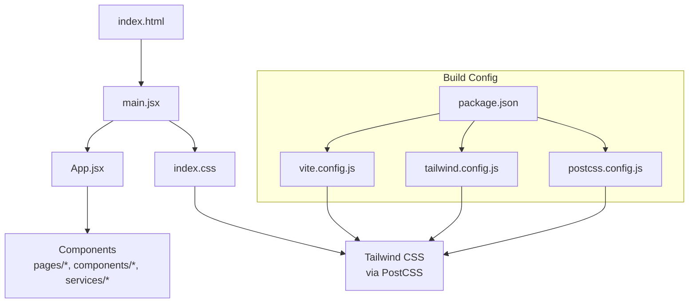
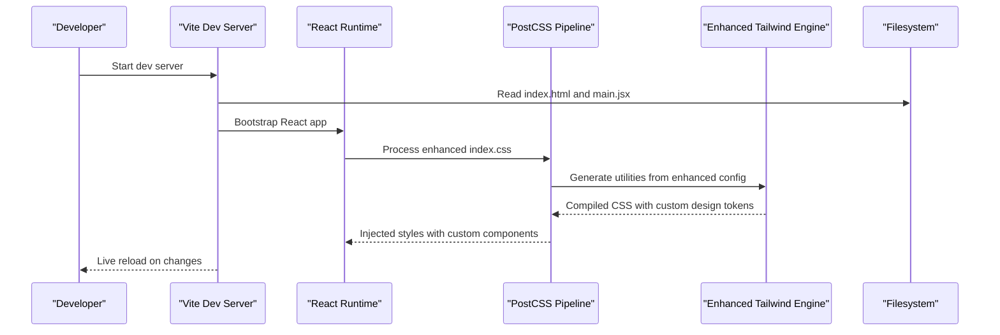
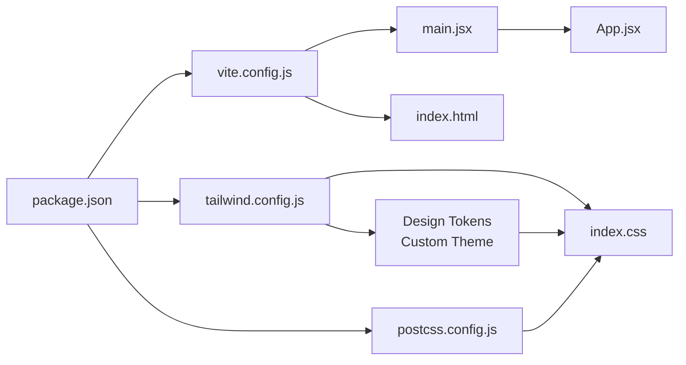

# Build System & Configuration

<cite>
**Referenced Files in This Document**
- [vite.config.js](file://frontend/vite.config.js)
- [tailwind.config.js](file://frontend/tailwind.config.js)
- [postcss.config.js](file://frontend/postcss.config.js)
- [package.json](file://frontend/package.json)
- [index.html](file://frontend/index.html)
- [main.jsx](file://frontend/main.jsx)
- [App.jsx](file://frontend/App.jsx)
- [index.css](file://frontend/index.css)
</cite>

## Update Summary
**Changes Made**
- Updated Tailwind CSS configuration section to reflect enhanced styling system with new theme extensions and custom utilities
- Enhanced index.css documentation to cover additional global styles and custom components
- Updated package dependencies section to include recent dependency updates and their impact on the build system
- Added guidance for working with the enhanced styling system and custom design tokens

## Table of Contents
1. [Introduction](#introduction)
2. [Project Structure](#project-structure)
3. [Core Components](#core-components)
4. [Architecture Overview](#architecture-overview)
5. [Detailed Component Analysis](#detailed-component-analysis)
6. [Dependency Analysis](#dependency-analysis)
7. [Performance Considerations](#performance-considerations)
8. [Troubleshooting Guide](#troubleshooting-guide)
9. [Conclusion](#conclusion)

## Introduction
This document explains the frontend build system and configuration for the application. It covers Vite build configuration (development server, production builds, asset optimization, plugins), Tailwind CSS setup (custom themes, responsive breakpoints, utility customization), PostCSS processing pipeline, package dependencies management, and build scripts. It also provides guidance for optimizing build performance, adding new dependencies, and configuring environment-specific builds.

## Project Structure
The frontend is a modern React application built with Vite and styled with Tailwind CSS. The key configuration files reside in the frontend directory:

- vite.config.js: Vite build and development server configuration
- tailwind.config.js: Tailwind CSS theme and plugin configuration with enhanced styling system
- postcss.config.js: PostCSS pipeline configuration used by Tailwind
- package.json: Dependencies and build scripts with updated styling packages
- index.html: Application entry HTML
- main.jsx: React app bootstrap
- App.jsx: Root component tree
- index.css: Global styles and Tailwind directives with enhanced custom components

[No sources needed since this diagram shows conceptual workflow, not actual code structure]

## Core Components
- Vite: Fast development server and optimized production bundler. Provides hot module replacement, dev server proxying, and production asset optimization.
- Tailwind CSS: Utility-first CSS framework configured via tailwind.config.js and processed through PostCSS with enhanced styling capabilities.
- PostCSS: CSS transformation pipeline used to process Tailwind directives and any additional CSS transformations.
- Package Management: npm/yarn scripts defined in package.json orchestrate development, building, and dependency installation with updated styling dependencies.

Key responsibilities:
- Development experience: fast reloads, source maps, proxy to backend APIs
- Production output: minified assets, code splitting, asset hashing, and optimal caching
- Styling pipeline: Tailwind directives compiled into optimized CSS with enhanced custom theme, breakpoints, and design tokens
- Dependency lifecycle: install, update, and run scripts consistently across environments with updated styling packages

**Section sources**
- [vite.config.js](file://frontend/vite.config.js)
- [tailwind.config.js](file://frontend/tailwind.config.js)
- [postcss.config.js](file://frontend/postcss.config.js)
- [package.json](file://frontend/package.json)

## Architecture Overview
The build architecture integrates Vite as the core bundler, Tailwind CSS for styling with enhanced configuration, and PostCSS for CSS transformations. The entry point is index.html which loads main.jsx; React renders App.jsx and the rest of the component tree. Tailwind utilities are generated from index.css directives and the enhanced Tailwind configuration with custom design tokens and extended utilities.

**Diagram sources**
- [index.html](file://frontend/index.html)
- [main.jsx](file://frontend/main.jsx)
- [index.css](file://frontend/index.css)
- [vite.config.js](file://frontend/vite.config.js)
- [postcss.config.js](file://frontend/postcss.config.js)
- [tailwind.config.js](file://frontend/tailwind.config.js)

## Detailed Component Analysis

### Vite Configuration
Vite configuration controls:
- Development server behavior (host, port, open browser, proxy rules)
- Build targets and output format
- Asset handling and optimization settings
- Plugin integrations (for example, React support, CSS processing, or other enhancements)
- Environment variables and mode-based overrides

Typical areas to review:
- dev.server options for local development and API proxying
- build options for production bundle size and caching strategy
- plugins array for feature extensions
- resolve.alias or publicDir if customizing paths or static assets

Optimization tips:
- Enable chunking and code splitting for large applications
- Use environment-specific configs when necessary
- Configure proxy to avoid CORS during development
- Keep dev server lightweight by disabling unnecessary features

**Section sources**
- [vite.config.js](file://frontend/vite.config.js)

### Tailwind CSS Configuration
**Updated** Enhanced with significant additions including custom design tokens, extended color palettes, typography configurations, and advanced utility classes.

Tailwind configuration now includes:
- Custom theme values with comprehensive design system tokens (colors, spacing, typography, shadows, animations)
- Enhanced responsive breakpoints aligned with modern UI requirements
- Advanced plugin usage and content scanning patterns for better performance
- Optimized purge/Content configuration to include only used classes
- Custom utilities and variants for consistent design patterns
- Extended font families and text styling options
- Custom animation definitions and transition effects

Best practices:
- Centralize design tokens in theme.extend for maintainable styling
- Define breakpoints aligned with your UI requirements and device targets
- Ensure content paths cover all template and component files for optimal CSS generation
- Leverage the enhanced theme system rather than writing custom CSS when possible
- Use the provided design tokens consistently across components

**Section sources**
- [tailwind.config.js](file://frontend/tailwind.config.js)

### PostCSS Processing Pipeline
PostCSS processes CSS using a chain of plugins. In this project, it primarily powers Tailwind's directive compilation and may include additional transformations such as autoprefixing or CSS modules depending on setup.

Key points:
- Plugins are declared in postcss.config.js
- Tailwind is typically included as a PostCSS plugin
- Order of plugins matters; Tailwind should be processed before other transforms like autoprefixer
- Enhanced configuration supports advanced CSS features and optimizations

**Section sources**
- [postcss.config.js](file://frontend/postcss.config.js)

### Package Dependencies and Scripts
**Updated** Recent dependency updates include enhanced styling packages, improved build tools, and updated development dependencies for better performance and compatibility.

Dependencies and scripts are managed in package.json:
- Dependencies include Vite, React toolchain, Tailwind CSS with enhanced configuration, and related packages
- Scripts define commands for development, building, linting, and testing
- Lockfiles ensure reproducible installs across environments
- Updated styling dependencies provide enhanced theming capabilities and performance improvements

Guidance:
- Add new dependencies via the package manager and update scripts accordingly
- Pin versions where stability is critical, especially for styling packages
- Separate devDependencies from runtime dependencies clearly
- Monitor styling package updates for security and performance improvements
- Test build performance after major dependency updates

**Section sources**
- [package.json](file://frontend/package.json)

### Entry Points and Styles
**Updated** Enhanced index.css now includes additional global styles, custom components, and design system foundations.

- index.html serves as the HTML shell loaded by Vite
- main.jsx bootstraps the React application
- App.jsx contains the root component tree
- index.css includes Tailwind directives, global styles, and enhanced custom components with design tokens

These files coordinate how the app is rendered and how styles are applied at runtime with the enhanced styling system.

**Section sources**
- [index.html](file://frontend/index.html)
- [main.jsx](file://frontend/main.jsx)
- [App.jsx](file://frontend/App.jsx)
- [index.css](file://frontend/index.css)

## Dependency Analysis
The following diagram illustrates the relationships between build configuration files and runtime entry points with the enhanced styling system.

**Diagram sources**
- [package.json](file://frontend/package.json)
- [vite.config.js](file://frontend/vite.config.js)
- [tailwind.config.js](file://frontend/tailwind.config.js)
- [postcss.config.js](file://frontend/postcss.config.js)
- [index.html](file://frontend/index.html)
- [main.jsx](file://frontend/main.jsx)
- [App.jsx](file://frontend/App.jsx)
- [index.css](file://frontend/index.css)

**Section sources**
- [package.json](file://frontend/package.json)
- [vite.config.js](file://frontend/vite.config.js)
- [tailwind.config.js](file://frontend/tailwind.config.js)
- [postcss.config.js](file://frontend/postcss.config.js)
- [index.html](file://frontend/index.html)
- [main.jsx](file://frontend/main.jsx)
- [App.jsx](file://frontend/App.jsx)
- [index.css](file://frontend/index.css)

## Performance Considerations
**Updated** Enhanced styling system considerations for optimal performance.

- Development server
  - Use HMR and keep the dev server focused on speed
  - Proxy API calls to avoid CORS overhead
  - Disable heavy plugins in dev if not needed
  - Monitor CSS generation performance with enhanced Tailwind configuration
- Production builds
  - Enable minification and tree-shaking
  - Split large libraries into separate chunks
  - Leverage asset hashing for long-term caching
  - Optimize CSS bundle size with enhanced PurgeCSS configuration
- Styling
  - Ensure Tailwind content paths are accurate to minimize unused CSS
  - Prefer extending Tailwind defaults and using provided design tokens rather than writing custom CSS
  - Leverage the enhanced theme system for consistent styling across components
  - Monitor CSS bundle size after adding custom utilities
- Dependencies
  - Audit and remove unused dependencies
  - Prefer lighter alternatives where feasible
  - Keep lockfiles updated and consistent across environments
  - Regularly update styling packages for security and performance improvements

[No sources needed since this section provides general guidance]

## Troubleshooting Guide
**Updated** Enhanced troubleshooting for the improved styling system.

Common issues and resolutions:
- Tailwind classes not applied
  - Verify content paths in Tailwind configuration include all component and page files
  - Confirm PostCSS pipeline includes Tailwind plugin
  - Check that enhanced theme extensions are properly configured
- Styles not updating in dev
  - Ensure PostCSS and Tailwind are installed and configured correctly
  - Restart the dev server after changing configuration files
  - Clear cache if experiencing persistent styling issues
- Build fails due to missing dependencies
  - Run the install command specified in package.json
  - Clear node_modules and reinstall if necessary
  - Verify styling package versions are compatible
- Dev server cannot reach backend APIs
  - Check proxy configuration in Vite dev server settings
  - Validate host/port and path mappings
- Enhanced styling system issues
  - Verify custom design tokens are properly defined in tailwind.config.js
  - Check that custom components in index.css don't conflict with Tailwind utilities
  - Ensure all content paths include files using new design tokens

**Section sources**
- [tailwind.config.js](file://frontend/tailwind.config.js)
- [postcss.config.js](file://frontend/postcss.config.js)
- [vite.config.js](file://frontend/vite.config.js)
- [package.json](file://frontend/package.json)
- [index.css](file://frontend/index.css)

## Conclusion
This build system combines Vite for fast development and optimized production builds, an enhanced Tailwind CSS setup with comprehensive design tokens and custom utilities for efficient styling, and PostCSS for CSS transformations. By carefully configuring each layer—Vite, the enhanced Tailwind configuration, PostCSS, and package scripts—you can achieve a fast developer experience, maintainable styles with consistent design tokens, and performant production assets. Follow the guidance above to optimize builds, add dependencies safely, configure environment-specific behaviors, and leverage the enhanced styling system effectively.