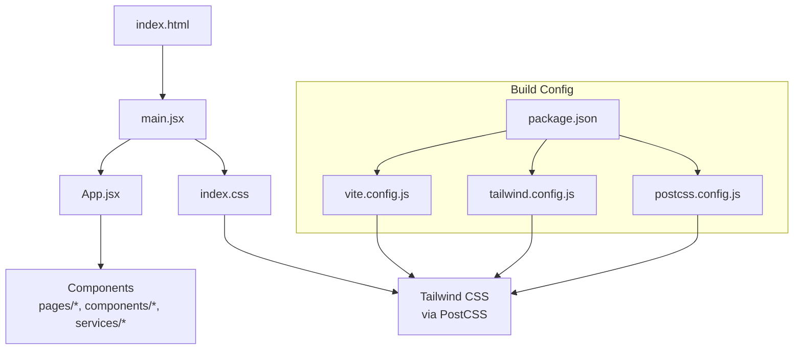
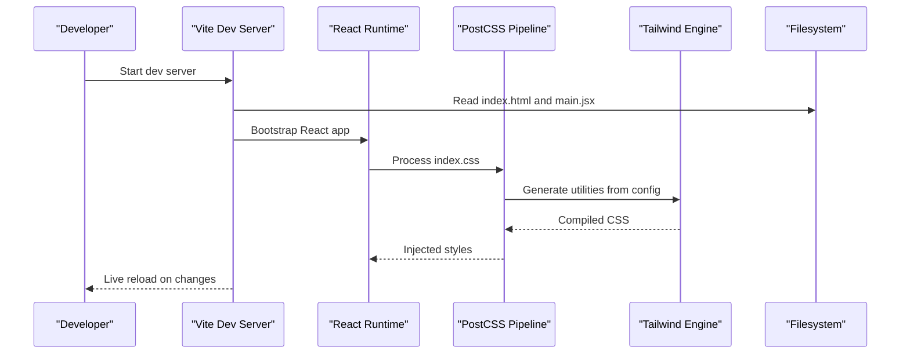
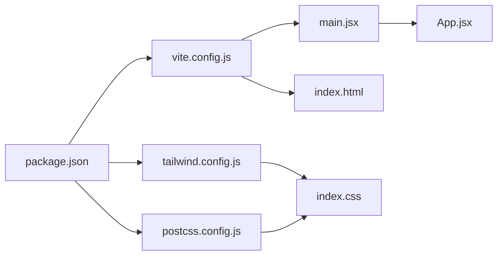

# Build System & Configuration

<cite>
**Referenced Files in This Document**
- [vite.config.js](file://frontend/vite.config.js)
- [tailwind.config.js](file://frontend/tailwind.config.js)
- [postcss.config.js](file://frontend/postcss.config.js)
- [package.json](file://frontend/package.json)
- [index.html](file://frontend/index.html)
- [main.jsx](file://frontend/main.jsx)
- [App.jsx](file://frontend/App.jsx)
- [index.css](file://frontend/index.css)
</cite>

## Table of Contents
1. [Introduction](#introduction)
2. [Project Structure](#project-structure)
3. [Core Components](#core-components)
4. [Architecture Overview](#architecture-overview)
5. [Detailed Component Analysis](#detailed-component-analysis)
6. [Dependency Analysis](#dependency-analysis)
7. [Performance Considerations](#performance-considerations)
8. [Troubleshooting Guide](#troubleshooting-guide)
9. [Conclusion](#conclusion)

## Introduction
This document explains the frontend build system and configuration for the application. It covers Vite build configuration (development server, production builds, asset optimization, plugins), Tailwind CSS setup (custom themes, responsive breakpoints, utility customization), PostCSS processing pipeline, package dependencies management, and build scripts. It also provides guidance for optimizing build performance, adding new dependencies, and configuring environment-specific builds.

## Project Structure
The frontend is a modern React application built with Vite and styled with Tailwind CSS. The key configuration files reside in the frontend directory:

- vite.config.js: Vite build and development server configuration
- tailwind.config.js: Tailwind CSS theme and plugin configuration
- postcss.config.js: PostCSS pipeline configuration used by Tailwind
- package.json: Dependencies and build scripts
- index.html: Application entry HTML
- main.jsx: React app bootstrap
- App.jsx: Root component tree
- index.css: Global styles and Tailwind directives

[No sources needed since this diagram shows conceptual workflow, not actual code structure]

## Core Components
- Vite: Fast development server and optimized production bundler. Provides hot module replacement, dev server proxying, and production asset optimization.
- Tailwind CSS: Utility-first CSS framework configured via tailwind.config.js and processed through PostCSS.
- PostCSS: CSS transformation pipeline used to process Tailwind directives and any additional CSS transformations.
- Package Management: npm/yarn scripts defined in package.json orchestrate development, building, and dependency installation.

Key responsibilities:
- Development experience: fast reloads, source maps, proxy to backend APIs
- Production output: minified assets, code splitting, asset hashing, and optimal caching
- Styling pipeline: Tailwind directives compiled into optimized CSS with custom theme and breakpoints
- Dependency lifecycle: install, update, and run scripts consistently across environments

**Section sources**
- [vite.config.js](file://frontend/vite.config.js)
- [tailwind.config.js](file://frontend/tailwind.config.js)
- [postcss.config.js](file://frontend/postcss.config.js)
- [package.json](file://frontend/package.json)

## Architecture Overview
The build architecture integrates Vite as the core bundler, Tailwind CSS for styling, and PostCSS for CSS transformations. The entry point is index.html which loads main.jsx; React renders App.jsx and the rest of the component tree. Tailwind utilities are generated from index.css directives and the Tailwind configuration.

**Diagram sources**
- [index.html](file://frontend/index.html)
- [main.jsx](file://frontend/main.jsx)
- [index.css](file://frontend/index.css)
- [vite.config.js](file://frontend/vite.config.js)
- [postcss.config.js](file://frontend/postcss.config.js)
- [tailwind.config.js](file://frontend/tailwind.config.js)

## Detailed Component Analysis

### Vite Configuration
Vite configuration controls:
- Development server behavior (host, port, open browser, proxy rules)
- Build targets and output format
- Asset handling and optimization settings
- Plugin integrations (for example, React support, CSS processing, or other enhancements)
- Environment variables and mode-based overrides

Typical areas to review:
- dev.server options for local development and API proxying
- build options for production bundle size and caching strategy
- plugins array for feature extensions
- resolve.alias or publicDir if customizing paths or static assets

Optimization tips:
- Enable chunking and code splitting for large applications
- Use environment-specific configs when necessary
- Configure proxy to avoid CORS during development
- Keep dev server lightweight by disabling unnecessary features

**Section sources**
- [vite.config.js](file://frontend/vite.config.js)

### Tailwind CSS Configuration
Tailwind configuration defines:
- Custom theme values (colors, spacing, typography, shadows, etc.)
- Responsive breakpoints and container settings
- Plugin usage and content scanning patterns
- Purge/Content configuration to include only used classes
- Custom utilities and variants

Best practices:
- Centralize design tokens in theme.extend
- Define breakpoints aligned with your UI requirements
- Ensure content paths cover all template and component files
- Avoid over-customization unless necessary; prefer extending defaults

**Section sources**
- [tailwind.config.js](file://frontend/tailwind.config.js)

### PostCSS Processing Pipeline
PostCSS processes CSS using a chain of plugins. In this project, it primarily powers Tailwind’s directive compilation and may include additional transformations such as autoprefixing or CSS modules depending on setup.

Key points:
- Plugins are declared in postcss.config.js
- Tailwind is typically included as a PostCSS plugin
- Order of plugins matters; Tailwind should be processed before other transforms like autoprefixer

**Section sources**
- [postcss.config.js](file://frontend/postcss.config.js)

### Package Dependencies and Scripts
Dependencies and scripts are managed in package.json:
- Dependencies include Vite, React toolchain, Tailwind CSS, and related packages
- Scripts define commands for development, building, linting, and testing
- Lockfiles ensure reproducible installs across environments

Guidance:
- Add new dependencies via the package manager and update scripts accordingly
- Pin versions where stability is critical
- Separate devDependencies from runtime dependencies clearly

**Section sources**
- [package.json](file://frontend/package.json)

### Entry Points and Styles
- index.html serves as the HTML shell loaded by Vite
- main.jsx bootstraps the React application
- App.jsx contains the root component tree
- index.css includes Tailwind directives and global styles

These files coordinate how the app is rendered and how styles are applied at runtime.

**Section sources**
- [index.html](file://frontend/index.html)
- [main.jsx](file://frontend/main.jsx)
- [App.jsx](file://frontend/App.jsx)
- [index.css](file://frontend/index.css)

## Dependency Analysis
The following diagram illustrates the relationships between build configuration files and runtime entry points.

**Diagram sources**
- [package.json](file://frontend/package.json)
- [vite.config.js](file://frontend/vite.config.js)
- [tailwind.config.js](file://frontend/tailwind.config.js)
- [postcss.config.js](file://frontend/postcss.config.js)
- [index.html](file://frontend/index.html)
- [main.jsx](file://frontend/main.jsx)
- [App.jsx](file://frontend/App.jsx)
- [index.css](file://frontend/index.css)

**Section sources**
- [package.json](file://frontend/package.json)
- [vite.config.js](file://frontend/vite.config.js)
- [tailwind.config.js](file://frontend/tailwind.config.js)
- [postcss.config.js](file://frontend/postcss.config.js)
- [index.html](file://frontend/index.html)
- [main.jsx](file://frontend/main.jsx)
- [App.jsx](file://frontend/App.jsx)
- [index.css](file://frontend/index.css)

## Performance Considerations
- Development server
  - Use HMR and keep the dev server focused on speed
  - Proxy API calls to avoid CORS overhead
  - Disable heavy plugins in dev if not needed
- Production builds
  - Enable minification and tree-shaking
  - Split large libraries into separate chunks
  - Leverage asset hashing for long-term caching
- Styling
  - Ensure Tailwind content paths are accurate to minimize unused CSS
  - Prefer extending Tailwind defaults rather than writing custom CSS when possible
- Dependencies
  - Audit and remove unused dependencies
  - Prefer lighter alternatives where feasible
  - Keep lockfiles updated and consistent across environments

[No sources needed since this section provides general guidance]

## Troubleshooting Guide
Common issues and resolutions:
- Tailwind classes not applied
  - Verify content paths in Tailwind configuration include all component and page files
  - Confirm PostCSS pipeline includes Tailwind plugin
- Styles not updating in dev
  - Ensure PostCSS and Tailwind are installed and configured correctly
  - Restart the dev server after changing configuration files
- Build fails due to missing dependencies
  - Run the install command specified in package.json
  - Clear node_modules and reinstall if necessary
- Dev server cannot reach backend APIs
  - Check proxy configuration in Vite dev server settings
  - Validate host/port and path mappings

**Section sources**
- [tailwind.config.js](file://frontend/tailwind.config.js)
- [postcss.config.js](file://frontend/postcss.config.js)
- [vite.config.js](file://frontend/vite.config.js)
- [package.json](file://frontend/package.json)

## Conclusion
This build system combines Vite for fast development and optimized production builds, Tailwind CSS for efficient styling, and PostCSS for CSS transformations. By carefully configuring each layer—Vite, Tailwind, PostCSS, and package scripts—you can achieve a fast developer experience, maintainable styles, and performant production assets. Follow the guidance above to optimize builds, add dependencies safely, and configure environment-specific behaviors.