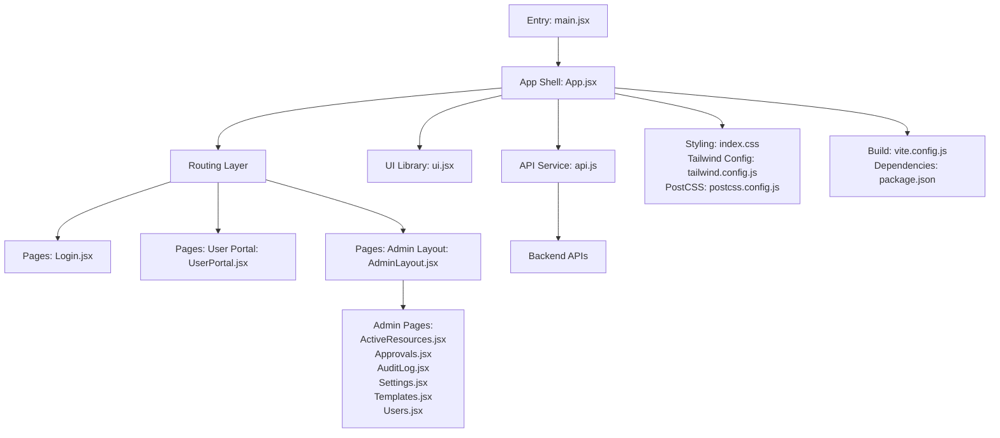
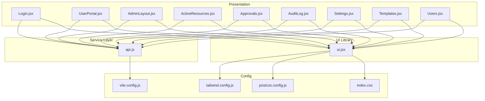
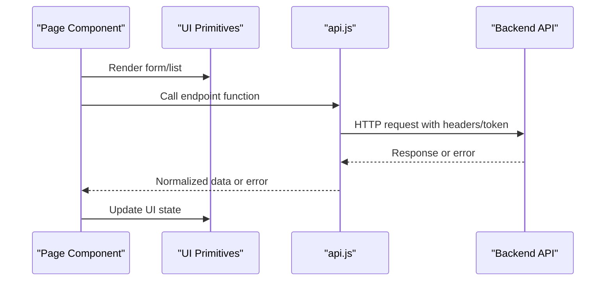
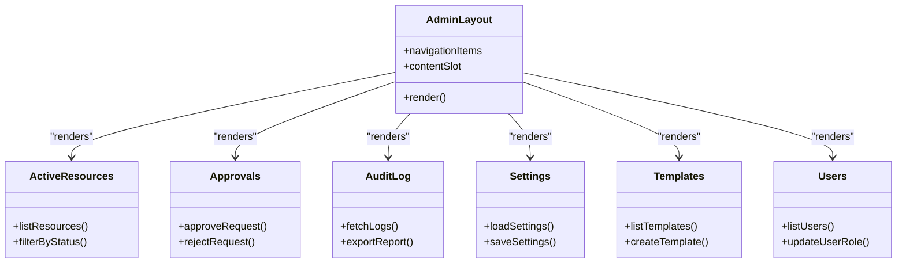
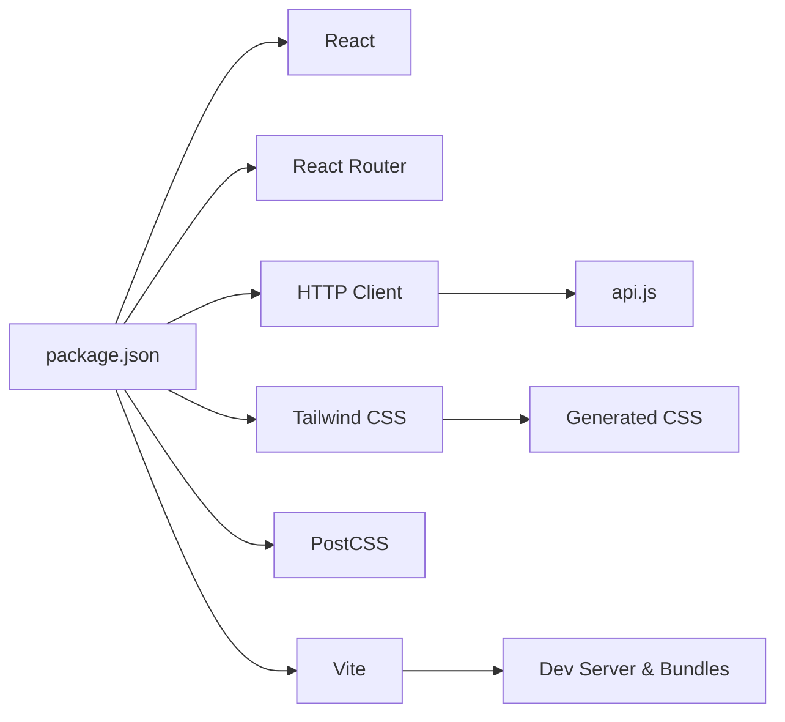

# Frontend Development

<cite>
**Referenced Files in This Document**
- [main.jsx](file://frontend/src/main.jsx)
- [App.jsx](file://frontend/src/App.jsx)
- [api.js](file://frontend/src/services/api.js)
- [ui.jsx](file://frontend/src/components/ui.jsx)
- [Login.jsx](file://frontend/src/pages/Login.jsx)
- [UserPortal.jsx](file://frontend/src/pages/user/UserPortal.jsx)
- [AdminLayout.jsx](file://frontend/src/pages/admin/AdminLayout.jsx)
- [ActiveResources.jsx](file://frontend/src/pages/admin/ActiveResources.jsx)
- [Approvals.jsx](file://frontend/src/pages/admin/Approvals.jsx)
- [AuditLog.jsx](file://frontend/src/pages/admin/AuditLog.jsx)
- [Settings.jsx](file://frontend/src/pages/admin/Settings.jsx)
- [Templates.jsx](file://frontend/src/pages/admin/Templates.jsx)
- [Users.jsx](file://frontend/src/pages/admin/Users.jsx)
- [index.css](file://frontend/src/index.css)
- [tailwind.config.js](file://frontend/tailwind.config.js)
- [postcss.config.js](file://frontend/postcss.config.js)
- [vite.config.js](file://frontend/vite.config.js)
- [package.json](file://frontend/package.json)
</cite>

## Table of Contents
1. [Introduction](#introduction)
2. [Project Structure](#project-structure)
3. [Core Components](#core-components)
4. [Architecture Overview](#architecture-overview)
5. [Detailed Component Analysis](#detailed-component-analysis)
6. [Dependency Analysis](#dependency-analysis)
7. [Performance Considerations](#performance-considerations)
8. [Troubleshooting Guide](#troubleshooting-guide)
9. [Conclusion](#conclusion)
10. [Appendices](#appendices)

## Introduction
This document provides comprehensive frontend development guidance for the React-based single-page application. It explains the component architecture, state management patterns, routing structure, UI component library built with Tailwind CSS, and the API service layer used to communicate with the backend. It also includes examples for user portal and admin pages, build configuration with Vite, styling approach, responsive design patterns, and guidelines for adding new pages, components, and integrating with existing services.

## Project Structure
The frontend is organized by feature areas:
- Entry point and app shell
- Pages grouped by role (user and admin)
- Shared UI components
- Centralized API service
- Styling and build configuration

**Diagram sources**
- [main.jsx](file://frontend/src/main.jsx)
- [App.jsx](file://frontend/src/App.jsx)
- [api.js](file://frontend/src/services/api.js)
- [ui.jsx](file://frontend/src/components/ui.jsx)
- [Login.jsx](file://frontend/src/pages/Login.jsx)
- [UserPortal.jsx](file://frontend/src/pages/user/UserPortal.jsx)
- [AdminLayout.jsx](file://frontend/src/pages/admin/AdminLayout.jsx)
- [ActiveResources.jsx](file://frontend/src/pages/admin/ActiveResources.jsx)
- [Approvals.jsx](file://frontend/src/pages/admin/Approvals.jsx)
- [AuditLog.jsx](file://frontend/src/pages/admin/AuditLog.jsx)
- [Settings.jsx](file://frontend/src/pages/admin/Settings.jsx)
- [Templates.jsx](file://frontend/src/pages/admin/Templates.jsx)
- [Users.jsx](file://frontend/src/pages/admin/Users.jsx)
- [index.css](file://frontend/src/index.css)
- [tailwind.config.js](file://frontend/tailwind.config.js)
- [postcss.config.js](file://frontend/postcss.config.js)
- [vite.config.js](file://frontend/vite.config.js)
- [package.json](file://frontend/package.json)

**Section sources**
- [main.jsx](file://frontend/src/main.jsx)
- [App.jsx](file://frontend/src/App.jsx)
- [package.json](file://frontend/package.json)

## Core Components
- Application entrypoint initializes the React tree and mounts it into the DOM.
- The app shell configures routes and composes page-level components.
- The UI library provides reusable primitives styled with Tailwind CSS.
- The API service centralizes HTTP calls, request/response handling, and error normalization.

Key responsibilities:
- Routing: Define protected and public routes for login, user portal, and admin sections.
- State management: Use local component state and context where appropriate; keep global state minimal and scoped to features.
- UI composition: Compose complex screens from small, reusable UI primitives.
- API integration: Encapsulate all network requests behind typed functions in the API service.

**Section sources**
- [main.jsx](file://frontend/src/main.jsx)
- [App.jsx](file://frontend/src/App.jsx)
- [ui.jsx](file://frontend/src/components/ui.jsx)
- [api.js](file://frontend/src/services/api.js)

## Architecture Overview
The frontend follows a layered architecture:
- Presentation layer: Page components and layout wrappers.
- UI layer: Reusable components and shared styles.
- Service layer: API client encapsulating HTTP communication.
- Configuration layer: Build and styling settings.

**Diagram sources**
- [Login.jsx](file://frontend/src/pages/Login.jsx)
- [UserPortal.jsx](file://frontend/src/pages/user/UserPortal.jsx)
- [AdminLayout.jsx](file://frontend/src/pages/admin/AdminLayout.jsx)
- [ActiveResources.jsx](file://frontend/src/pages/admin/ActiveResources.jsx)
- [Approvals.jsx](file://frontend/src/pages/admin/Approvals.jsx)
- [AuditLog.jsx](file://frontend/src/pages/admin/AuditLog.jsx)
- [Settings.jsx](file://frontend/src/pages/admin/Settings.jsx)
- [Templates.jsx](file://frontend/src/pages/admin/Templates.jsx)
- [Users.jsx](file://frontend/src/pages/admin/Users.jsx)
- [ui.jsx](file://frontend/src/components/ui.jsx)
- [api.js](file://frontend/src/services/api.js)
- [tailwind.config.js](file://frontend/tailwind.config.js)
- [postcss.config.js](file://frontend/postcss.config.js)
- [vite.config.js](file://frontend/vite.config.js)
- [index.css](file://frontend/src/index.css)

## Detailed Component Analysis

### Application Shell and Routing
- The app shell sets up route definitions and guards for authenticated access.
- Public routes include login.
- Protected routes include user portal and admin sections.
- Layouts wrap content to provide consistent navigation and headers.

Guidelines:
- Keep route definitions centralized in the app shell.
- Use route guards to enforce authentication and authorization.
- Prefer nested layouts for shared chrome (header, sidebar).

**Section sources**
- [App.jsx](file://frontend/src/App.jsx)

### API Service Layer
The API service centralizes HTTP communication:
- Base URL configuration and default headers.
- Request/response interceptors for token injection and error normalization.
- Typed endpoints for each domain (auth, users, templates, approvals, audit, settings, active resources).
- Error handling strategies and retry policies where applicable.

Best practices:
- Always use the API service instead of direct fetch calls.
- Normalize errors to a consistent shape for UI consumption.
- Separate concerns by domain-specific endpoint groups.

**Diagram sources**
- [api.js](file://frontend/src/services/api.js)

**Section sources**
- [api.js](file://frontend/src/services/api.js)

### UI Component Library
The UI library provides reusable primitives styled with Tailwind CSS:
- Buttons, inputs, cards, modals, tables, badges, and feedback components.
- Consistent design tokens via Tailwind classes and custom theme extensions.
- Composition-friendly props and accessible defaults.

Usage patterns:
- Compose complex screens from small primitives.
- Extend base components when variations are needed.
- Keep visual consistency across user and admin interfaces.

**Section sources**
- [ui.jsx](file://frontend/src/components/ui.jsx)
- [tailwind.config.js](file://frontend/tailwind.config.js)
- [postcss.config.js](file://frontend/postcss.config.js)
- [index.css](file://frontend/src/index.css)

### Login Page
- Handles user authentication flow and redirects upon success.
- Integrates with the API service for login endpoints.
- Displays validation and error messages using UI primitives.

**Section sources**
- [Login.jsx](file://frontend/src/pages/Login.jsx)
- [api.js](file://frontend/src/services/api.js)

### User Portal
- Provides user-facing features such as viewing and managing personal resources.
- Uses protected routes and integrates with relevant API endpoints.
- Leverages UI primitives for lists, forms, and status indicators.

**Section sources**
- [UserPortal.jsx](file://frontend/src/pages/user/UserPortal.jsx)
- [api.js](file://frontend/src/services/api.js)

### Admin Interface
- Admin layout provides navigation and shared controls.
- Dedicated pages for active resources, approvals, audit logs, settings, templates, and users.
- Each page encapsulates its own state and API interactions.

**Diagram sources**
- [AdminLayout.jsx](file://frontend/src/pages/admin/AdminLayout.jsx)
- [ActiveResources.jsx](file://frontend/src/pages/admin/ActiveResources.jsx)
- [Approvals.jsx](file://frontend/src/pages/admin/Approvals.jsx)
- [AuditLog.jsx](file://frontend/src/pages/admin/AuditLog.jsx)
- [Settings.jsx](file://frontend/src/pages/admin/Settings.jsx)
- [Templates.jsx](file://frontend/src/pages/admin/Templates.jsx)
- [Users.jsx](file://frontend/src/pages/admin/Users.jsx)

**Section sources**
- [AdminLayout.jsx](file://frontend/src/pages/admin/AdminLayout.jsx)
- [ActiveResources.jsx](file://frontend/src/pages/admin/ActiveResources.jsx)
- [Approvals.jsx](file://frontend/src/pages/admin/Approvals.jsx)
- [AuditLog.jsx](file://frontend/src/pages/admin/AuditLog.jsx)
- [Settings.jsx](file://frontend/src/pages/admin/Settings.jsx)
- [Templates.jsx](file://frontend/src/pages/admin/Templates.jsx)
- [Users.jsx](file://frontend/src/pages/admin/Users.jsx)

## Dependency Analysis
Frontend dependencies and their roles:
- React and React Router for UI and routing.
- Axios or Fetch wrapper for HTTP requests (as implemented in the API service).
- Tailwind CSS and PostCSS for styling pipeline.
- Vite for fast builds and dev server.

**Diagram sources**
- [package.json](file://frontend/package.json)
- [vite.config.js](file://frontend/vite.config.js)
- [tailwind.config.js](file://frontend/tailwind.config.js)
- [postcss.config.js](file://frontend/postcss.config.js)
- [api.js](file://frontend/src/services/api.js)

**Section sources**
- [package.json](file://frontend/package.json)
- [vite.config.js](file://frontend/vite.config.js)
- [tailwind.config.js](file://frontend/tailwind.config.js)
- [postcss.config.js](file://frontend/postcss.config.js)

## Performance Considerations
- Code splitting: Split routes and heavy components to reduce initial bundle size.
- Memoization: Use memoization for expensive computations and list rendering.
- Pagination and virtualization: For large datasets, implement pagination or virtual scrolling.
- Image optimization: Lazy-load images and use appropriate formats.
- Network efficiency: Cache responses where safe, debounce search inputs, and avoid unnecessary re-renders.

[No sources needed since this section provides general guidance]

## Troubleshooting Guide
Common issues and resolutions:
- Authentication failures: Verify token storage and header injection in the API service. Check backend CORS and session configuration.
- Route guards not working: Ensure guards run before rendering protected routes and that auth state is initialized early.
- Styling not applied: Confirm Tailwind directives are present in the stylesheet and PostCSS is configured correctly.
- Build errors: Validate environment variables and paths in Vite configuration. Clear caches if necessary.

Operational checks:
- Inspect network tab for failed requests and response payloads.
- Log normalized errors from the API service to understand failure modes.
- Validate Tailwind content paths to ensure generated CSS includes required classes.

**Section sources**
- [api.js](file://frontend/src/services/api.js)
- [tailwind.config.js](file://frontend/tailwind.config.js)
- [postcss.config.js](file://frontend/postcss.config.js)
- [vite.config.js](file://frontend/vite.config.js)

## Conclusion
This frontend application uses a clear separation of concerns with a robust routing setup, a cohesive UI library built on Tailwind CSS, and a centralized API service for backend communication. Following the provided patterns and guidelines will help maintain consistency, scalability, and performance as you add new features and pages.

[No sources needed since this section summarizes without analyzing specific files]

## Appendices

### Build Configuration with Vite
- Development server and hot module replacement are configured for rapid iteration.
- Environment variables can be injected via Vite’s env handling.
- Output bundles are optimized for production builds.

**Section sources**
- [vite.config.js](file://frontend/vite.config.js)
- [package.json](file://frontend/package.json)

### Styling Approach with Tailwind CSS
- Global styles are imported in the stylesheet.
- Tailwind directives and theme customization are defined in configuration files.
- PostCSS processes Tailwind and other plugins.

**Section sources**
- [index.css](file://frontend/src/index.css)
- [tailwind.config.js](file://frontend/tailwind.config.js)
- [postcss.config.js](file://frontend/postcss.config.js)

### Responsive Design Patterns
- Use Tailwind’s responsive prefixes to adapt layouts across breakpoints.
- Prefer flexible grids and spacing utilities for consistent alignment.
- Test key flows on mobile and tablet viewports.

**Section sources**
- [tailwind.config.js](file://frontend/tailwind.config.js)
- [index.css](file://frontend/src/index.css)

### Guidelines for Adding New Pages
- Create a new file under the appropriate folder (user or admin).
- Add a route in the app shell and protect it if required.
- Implement data fetching through the API service.
- Compose UI using primitives from the UI library.
- Follow existing naming conventions and folder structure.

**Section sources**
- [App.jsx](file://frontend/src/App.jsx)
- [api.js](file://frontend/src/services/api.js)
- [ui.jsx](file://frontend/src/components/ui.jsx)

### Guidelines for Adding New Components
- Place reusable components in the UI library.
- Keep props minimal and well-typed; prefer composition over deep nesting.
- Provide accessible defaults and keyboard support.
- Document usage patterns and constraints in comments.

**Section sources**
- [ui.jsx](file://frontend/src/components/ui.jsx)

### Integrating with Existing Services
- Add new endpoints to the API service with clear function names.
- Normalize errors and return consistent shapes for UI consumption.
- Update page components to call the new endpoints and handle loading/error states.

**Section sources**
- [api.js](file://frontend/src/services/api.js)