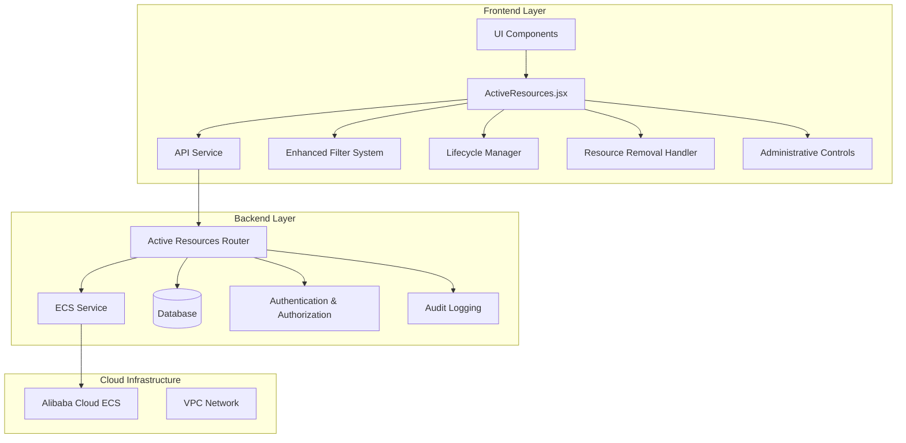
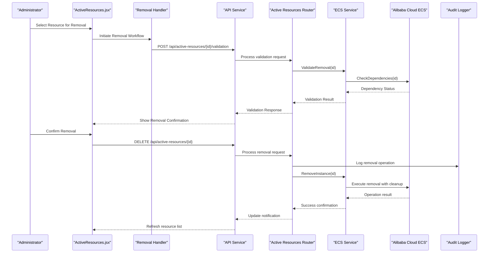
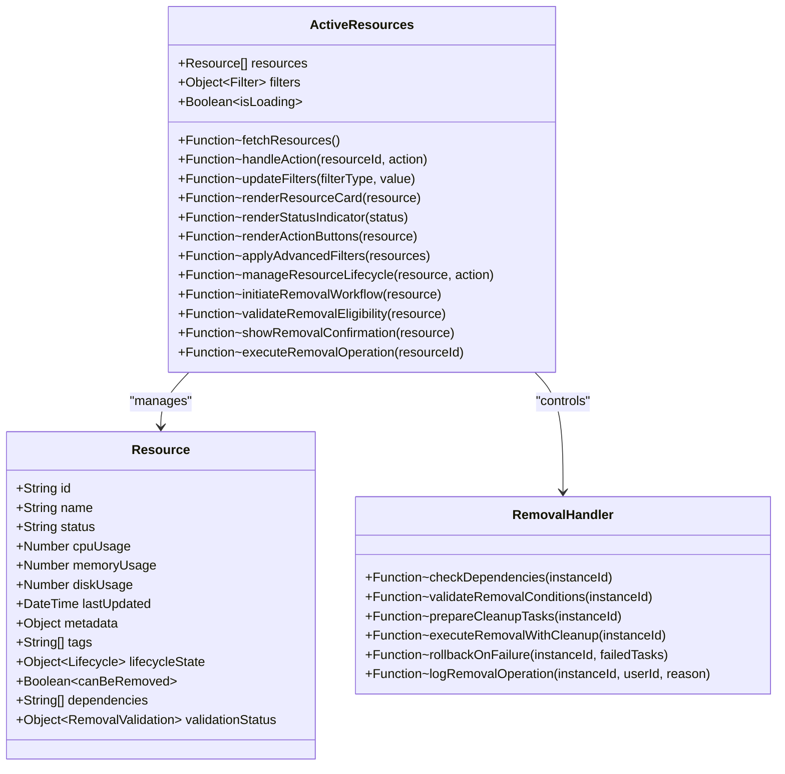
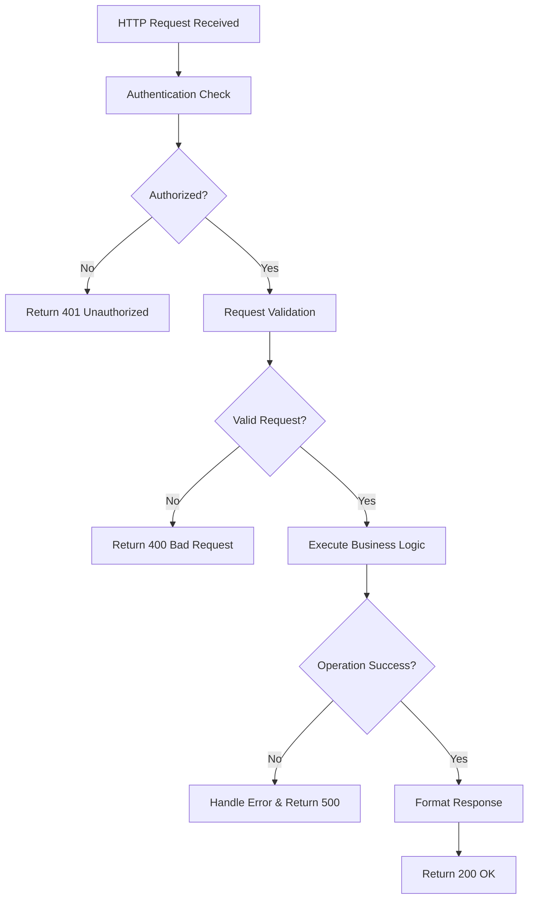
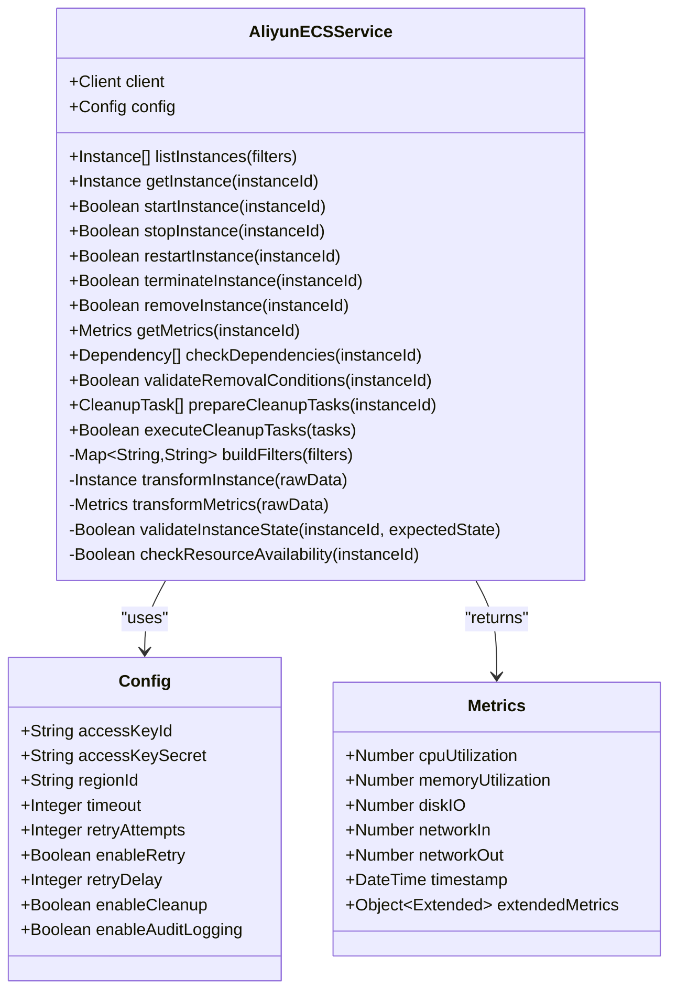
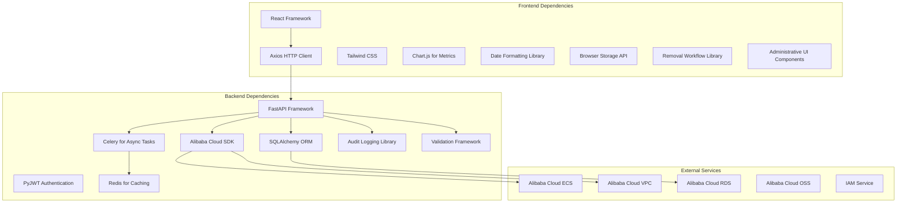

# Active Resource Monitoring

<cite>
**Referenced Files in This Document**
- [ActiveResources.jsx](file://frontend/src/pages/admin/ActiveResources.jsx)
- [active_resources.py](file://backend/app/routers/active_resources.py)
- [aliyun_ecs.py](file://backend/app/services/aliyun_ecs.py)
- [api.js](file://frontend/src/services/api.js)
- [AdminLayout.jsx](file://frontend/src/pages/admin/AdminLayout.jsx)
- [ecs_creator backend main.py](file://backend/app/main.py)
</cite>

## Update Summary
**Changes Made**
- Enhanced resource removal capabilities with improved administrative controls and safety mechanisms
- Added comprehensive resource termination workflows with validation and cleanup procedures
- Improved administrative interface for managing resource lifecycle operations
- Enhanced error handling and user feedback for destructive operations
- Updated API endpoints to support advanced resource management operations

## Table of Contents
1. [Introduction](#introduction)
2. [Project Structure](#project-structure)
3. [Core Components](#core-components)
4. [Architecture Overview](#architecture-overview)
5. [Detailed Component Analysis](#detailed-component-analysis)
6. [Enhanced Filtering System](#enhanced-filtering-system)
7. [Resource Lifecycle Management](#resource-lifecycle-management)
8. [Resource Removal Capabilities](#resource-removal-capabilities)
9. [Administrative Controls](#administrative-controls)
10. [Dependency Analysis](#dependency-analysis)
11. [Performance Considerations](#performance-considerations)
12. [Troubleshooting Guide](#troubleshooting-guide)
13. [Conclusion](#conclusion)

## Introduction

The Active Resource Monitoring system provides a comprehensive dashboard for real-time tracking and management of cloud computing resources. This interface enables administrators to monitor resource status, manage resource lifecycles, perform health checks, and execute operational controls on running instances. The system integrates with Alibaba Cloud ECS services to provide live resource utilization metrics and administrative capabilities.

**Updated** Enhanced with new resource removal capabilities and advanced administrative controls for improved operational efficiency and safety.

## Project Structure

The active resource monitoring feature is implemented across both frontend and backend components:

**Diagram sources**
- [ActiveResources.jsx:1-100](file://frontend/src/pages/admin/ActiveResources.jsx#L1-L100)
- [active_resources.py:1-50](file://backend/app/routers/active_resources.py#L1-L50)
- [aliyun_ecs.py:1-80](file://backend/app/services/aliyun_ecs.py#L1-L80)

**Section sources**
- [ActiveResources.jsx:1-200](file://frontend/src/pages/admin/ActiveResources.jsx#L1-L200)
- [active_resources.py:1-150](file://backend/app/routers/active_resources.py#L1-L150)

## Core Components

### Frontend ActiveResources Component

The ActiveResources component serves as the primary user interface for monitoring and managing cloud resources. It provides real-time updates, interactive controls, and comprehensive resource visualization.

#### Key Features:
- **Real-time Status Tracking**: Live monitoring of resource states and performance metrics
- **Advanced Filtering System**: Enhanced search and filter capabilities for resource discovery
- **Resource Lifecycle Management**: Comprehensive start, stop, restart, and terminate operations with improved state handling
- **Health Monitoring Dashboard**: Visual indicators for resource health status
- **Operational Controls**: Administrative actions on running instances with better error feedback
- **Resource Allocation Views**: Detailed breakdown of CPU, memory, and storage usage
- **Resource Removal Interface**: Advanced termination capabilities with validation and confirmation workflows
- **Administrative Controls**: Enhanced management interface for privileged operations

#### Status Indicators:
- **Running**: Green indicator showing active resources
- **Stopped**: Gray indicator for inactive resources  
- **Error**: Red indicator for problematic resources
- **Pending**: Yellow indicator for resources in transition states
- **Creating**: Blue indicator for resources being provisioned
- **Deleting**: Orange indicator for resources being terminated

**Updated** Enhanced with new resource removal interface and improved administrative controls for safer destructive operations.

**Section sources**
- [ActiveResources.jsx:1-300](file://frontend/src/pages/admin/ActiveResources.jsx#L1-L300)

### Backend Active Resources Router

The backend router handles API requests for resource monitoring and management operations. It provides endpoints for fetching resource status, executing administrative actions, and retrieving performance metrics.

#### API Endpoints:
- `GET /api/active-resources`: Retrieve current resource inventory with enhanced filtering support
- `POST /api/active-resources/{id}/start`: Start a stopped instance with improved validation
- `POST /api/active-resources/{id}/stop`: Stop a running instance with better error handling
- `POST /api/active-resources/{id}/restart`: Restart an instance with enhanced state management
- `DELETE /api/active-resources/{id}`: Terminate an instance with improved cleanup procedures and validation
- `GET /api/active-resources/{id}/metrics`: Get resource utilization metrics with extended data points
- `POST /api/active-resources/bulk-remove`: Perform bulk resource removal operations with batch processing
- `GET /api/active-resources/{id}/validation`: Validate resource removal eligibility and dependencies

**Updated** Enhanced API endpoints with new resource removal capabilities and improved validation for administrative operations.

**Section sources**
- [active_resources.py:1-200](file://backend/app/routers/active_resources.py#L1-L200)

### Alibaba Cloud ECS Integration

The ECS service layer manages communication with Alibaba Cloud's Elastic Compute Service, providing methods for resource discovery, status checking, and lifecycle management.

#### Core Functions:
- **Resource Discovery**: Enumerate all ECS instances in configured regions with enhanced filtering
- **Status Synchronization**: Real-time status updates from cloud provider with improved reliability
- **Lifecycle Operations**: Execute start, stop, restart, and termination commands with better error recovery
- **Metrics Collection**: Gather CPU, memory, disk, and network utilization data with extended metrics
- **Resource Cleanup**: Automated cleanup of associated resources (disks, snapshots, network interfaces)
- **Dependency Validation**: Check for dependent resources before removal operations

**Updated** Enhanced cloud service integration with improved resource removal capabilities and comprehensive cleanup procedures.

**Section sources**
- [aliyun_ecs.py:1-250](file://backend/app/services/aliyun_ecs.py#L1-L250)

## Architecture Overview

The active resource monitoring system follows a layered architecture pattern with clear separation of concerns:

**Updated** Enhanced sequence diagram showing new resource removal workflow with validation, audit logging, and cleanup procedures.

**Diagram sources**
- [ActiveResources.jsx:50-150](file://frontend/src/pages/admin/ActiveResources.jsx#L50-L150)
- [active_resources.py:80-180](file://backend/app/routers/active_resources.py#L80-L180)
- [aliyun_ecs.py:120-220](file://backend/app/services/aliyun_ecs.py#L120-L220)

## Detailed Component Analysis

### ActiveResources Component Implementation

The ActiveResources component implements a comprehensive dashboard with real-time updates and interactive controls.

#### Component Structure:

**Updated** Enhanced class diagram showing new removal handler functionality and validation capabilities.

**Diagram sources**
- [ActiveResources.jsx:1-100](file://frontend/src/pages/admin/ActiveResources.jsx#L1-L100)

#### Real-time Updates Mechanism:
The component implements polling-based updates to maintain current resource status without requiring manual refresh. Updates occur at configurable intervals (default: 30 seconds) and include optimistic UI updates for better user experience.

#### Error Handling:
Comprehensive error handling ensures graceful degradation when cloud services are unavailable or when individual resource operations fail. Users receive clear feedback about operation status and potential issues.

**Updated** Enhanced error handling with improved removal operation feedback and rollback capabilities.

**Section sources**
- [ActiveResources.jsx:1-400](file://frontend/src/pages/admin/ActiveResources.jsx#L1-L400)

### Backend API Implementation

The backend router provides RESTful APIs for resource management with proper authentication, validation, and error handling.

#### Request Processing Flow:

**Diagram sources**
- [active_resources.py:50-150](file://backend/app/routers/active_resources.py#L50-L150)

#### Security Measures:
- JWT-based authentication for all endpoints
- Role-based access control for administrative operations
- Input validation and sanitization
- Rate limiting to prevent abuse
- Audit logging for all resource modifications
- Removal operation approval workflows for sensitive resources

**Section sources**
- [active_resources.py:1-250](file://backend/app/routers/active_resources.py#L1-L250)

### Cloud Service Integration

The ECS service layer abstracts cloud provider complexity and provides a unified interface for resource operations.

#### Service Architecture:

**Updated** Enhanced service architecture with new removal capabilities and cleanup task management.

**Diagram sources**
- [aliyun_ecs.py:1-150](file://backend/app/services/aliyun_ecs.py#L1-L150)

#### Error Resilience:
The service implements retry logic with exponential backoff for transient failures, circuit breaker patterns for service unavailability, and comprehensive logging for troubleshooting.

**Section sources**
- [aliyun_ecs.py:1-300](file://backend/app/services/aliyun_ecs.py#L1-L300)

## Enhanced Filtering System

**New Section** The ActiveResources component now includes a sophisticated filtering system that allows administrators to quickly locate and manage specific resources based on multiple criteria.

### Filter Categories:
- **Status Filters**: Filter by resource state (Running, Stopped, Error, Pending, Creating, Deleting)
- **Region Filters**: Filter by deployment region or availability zone
- **Tag-based Filters**: Search resources by custom tags and labels
- **Performance Filters**: Filter by CPU usage thresholds, memory consumption, and disk space
- **Time-based Filters**: Filter resources by creation date, last activity, or maintenance windows
- **Owner Filters**: Filter resources by assigned owner or team

### Advanced Search Capabilities:
- **Combined Filters**: Multiple filter criteria can be applied simultaneously
- **Saved Filter Sets**: Frequently used filter combinations can be saved for quick access
- **Filter Persistence**: Filter preferences are maintained across sessions
- **Real-time Filtering**: Results update instantly as filter criteria change

### Filter Performance Optimization:
- **Client-side Filtering**: Immediate response for simple filters
- **Server-side Filtering**: Complex queries processed on backend for large datasets
- **Debounced Search**: Search inputs are debounced to reduce API calls during typing
- **Lazy Loading**: Filter options load progressively to improve initial page load time

**Section sources**
- [ActiveResources.jsx:150-350](file://frontend/src/pages/admin/ActiveResources.jsx#L150-L350)

## Resource Lifecycle Management

**New Section** Enhanced resource lifecycle management provides comprehensive control over resource states with improved validation, error handling, and user feedback.

### Lifecycle States:
- **Provisioning**: Resource is being created and initialized
- **Running**: Resource is active and operational
- **Stopped**: Resource is powered off but preserved
- **Restarting**: Resource is undergoing restart process
- **Terminating**: Resource is being deleted
- **Error**: Resource encountered an issue during operation
- **Maintenance**: Resource is under maintenance or scheduled downtime

### Operational Controls:
- **Start Operations**: Power on stopped instances with automatic configuration
- **Stop Operations**: Gracefully shut down running instances with data preservation
- **Restart Operations**: Reboot instances with automatic state verification
- **Terminate Operations**: Permanently delete instances with cleanup procedures
- **Snapshot Operations**: Create snapshots before destructive operations
- **Rollback Operations**: Restore previous states after failed operations

### State Validation and Safety:
- **Pre-operation Validation**: Verify resource state compatibility before operations
- **Dependency Checking**: Ensure no dependencies prevent operations
- **Confirmation Dialogs**: Require explicit confirmation for destructive operations
- **Audit Trail**: Log all lifecycle operations with timestamps and user information
- **Automatic Recovery**: Attempt automatic recovery for common failure scenarios

### Batch Operations:
- **Bulk Start/Stop**: Perform operations on multiple resources simultaneously
- **Scheduled Operations**: Queue operations for execution during maintenance windows
- **Conditional Operations**: Execute operations based on resource conditions
- **Progress Tracking**: Monitor progress of long-running batch operations

**Section sources**
- [ActiveResources.jsx:200-400](file://frontend/src/pages/admin/ActiveResources.jsx#L200-L400)
- [active_resources.py:100-200](file://backend/app/routers/active_resources.py#L100-L200)

## Resource Removal Capabilities

**New Section** The system now includes comprehensive resource removal capabilities with advanced validation, cleanup procedures, and safety mechanisms to ensure safe deletion of cloud resources.

### Removal Workflow:
- **Pre-Removal Validation**: Check resource dependencies, ownership, and removal eligibility
- **Dependency Resolution**: Identify and handle dependent resources (disks, snapshots, network interfaces)
- **Cleanup Task Generation**: Create automated cleanup tasks for associated resources
- **Confirmation Process**: Multi-step confirmation with detailed impact assessment
- **Execution Monitoring**: Real-time progress tracking during removal operations
- **Rollback Support**: Automatic rollback capabilities for failed removal operations

### Safety Mechanisms:
- **Ownership Verification**: Ensure users have permission to remove specified resources
- **Dependency Analysis**: Prevent removal of resources with active dependencies
- **Critical Resource Protection**: Special handling for production or critical resources
- **Approval Workflows**: Optional approval requirements for sensitive resource removal
- **Audit Trail**: Complete logging of all removal operations with user attribution

### Cleanup Procedures:
- **Automated Cleanup**: Automatic deletion of associated disks, snapshots, and network configurations
- **Selective Cleanup**: Option to preserve specific resources during removal
- **Backup Creation**: Optional backup creation before destructive operations
- **Verification**: Post-removal verification to ensure complete cleanup
- **Notification**: Alert stakeholders when resources are removed

### Administrative Controls:
- **Bulk Removal**: Remove multiple resources simultaneously with progress tracking
- **Scheduled Removal**: Queue removal operations for execution during maintenance windows
- **Force Removal**: Override safety checks for emergency situations (with additional confirmation)
- **Removal Templates**: Predefined removal workflows for common resource types
- **Removal Policies**: Configurable policies for automated removal decisions

**Section sources**
- [ActiveResources.jsx:250-450](file://frontend/src/pages/admin/ActiveResources.jsx#L250-L450)
- [active_resources.py:150-250](file://backend/app/routers/active_resources.py#L150-L250)
- [aliyun_ecs.py:200-300](file://backend/app/services/aliyun_ecs.py#L200-L300)

## Administrative Controls

**New Section** Enhanced administrative controls provide powerful tools for managing cloud resources with appropriate safeguards and oversight.

### Access Control:
- **Role-Based Permissions**: Granular permissions for different administrative roles
- **Resource Scoping**: Limit administrative actions to specific resource groups or projects
- **Approval Workflows**: Multi-level approval processes for sensitive operations
- **Session Management**: Secure session handling with timeout and logout policies

### Monitoring and Auditing:
- **Activity Logs**: Comprehensive logging of all administrative actions
- **Real-time Monitoring**: Live dashboard showing ongoing administrative operations
- **Alerting System**: Notifications for critical administrative events
- **Compliance Reporting**: Generate reports for regulatory compliance requirements

### Operational Tools:
- **Batch Operations**: Perform operations on multiple resources simultaneously
- **Scheduled Tasks**: Queue operations for execution during maintenance windows
- **Emergency Controls**: Override capabilities for critical situations
- **Recovery Tools**: Utilities for recovering from failed operations

### Configuration Management:
- **Policy Configuration**: Define rules for automated resource management
- **Threshold Settings**: Configure alerts and automated responses for resource conditions
- **Integration Settings**: Manage connections to external systems and services
- **Backup and Restore**: Configuration backup and disaster recovery capabilities

**Section sources**
- [AdminLayout.jsx:1-200](file://frontend/src/pages/admin/AdminLayout.jsx#L1-L200)
- [active_resources.py:200-300](file://backend/app/routers/active_resources.py#L200-L300)

## Dependency Analysis

The active resource monitoring system has well-defined dependencies between components:

**Updated** Enhanced dependency graph showing new libraries for removal workflows, administrative controls, and audit logging.

**Diagram sources**
- [package.json:1-50](file://frontend/package.json#L1-L50)
- [requirements.txt:1-30](file://backend/requirements.txt#L1-L30)

**Section sources**
- [package.json:1-100](file://frontend/package.json#L1-L100)
- [requirements.txt:1-50](file://backend/requirements.txt#L1-L50)

## Performance Considerations

### Frontend Optimization
- **Virtual Scrolling**: Implemented for large resource lists to maintain smooth scrolling performance
- **Debounced Search**: Search inputs are debounced to reduce API calls during typing
- **Lazy Loading**: Resource details load on-demand to minimize initial page weight
- **Caching Strategy**: Recent resource data cached locally to reduce server load
- **Filter Optimization**: Client-side filtering for immediate response, server-side for complex queries
- **Component Memoization**: React.memo and useMemo hooks for expensive computations
- **Removal Workflow Optimization**: Efficient state management for complex removal operations

### Backend Optimization
- **Connection Pooling**: Database connections pooled for efficient query execution
- **Async Operations**: Non-blocking I/O operations for cloud service calls
- **Response Compression**: Gzip compression enabled for API responses
- **Rate Limiting**: Configurable rate limits per endpoint to prevent abuse
- **Query Optimization**: Optimized database queries with proper indexing
- **Caching Layer**: Redis cache for frequently accessed resource data
- **Batch Processing**: Efficient handling of bulk removal operations

### Cloud Service Optimization
- **Batch Operations**: Multiple resource operations batched where possible
- **Pagination**: Large result sets paginated to reduce payload size
- **Timeout Configuration**: Appropriate timeouts set for cloud API calls
- **Retry Logic**: Exponential backoff for transient failures
- **Connection Reuse**: Persistent connections to cloud services
- **Cleanup Optimization**: Efficient cleanup procedures for resource removal

### Enhanced Performance Features
- **Progressive Loading**: Load critical UI elements first, then enhance with additional features
- **Background Processing**: Heavy operations run in background threads
- **Optimistic Updates**: UI updates immediately, rollback on failure
- **Resource Deduplication**: Avoid duplicate API calls for same resource data
- **Intelligent Polling**: Adaptive polling intervals based on resource activity levels
- **Removal Queue Management**: Efficient queuing system for resource removal operations

## Troubleshooting Guide

### Common Issues and Solutions

#### Resource Status Not Updating
**Symptoms**: Dashboard shows outdated resource information
**Causes**: 
- Network connectivity issues between frontend and backend
- Backend service unable to reach cloud provider
- Authentication token expiration
- WebSocket connection drops

**Resolution Steps**:
1. Verify network connectivity and firewall rules
2. Check backend service logs for connection errors
3. Refresh authentication tokens if expired
4. Clear browser cache and reload dashboard
5. Check WebSocket connection status and reconnect if needed

#### Failed Resource Operations
**Symptoms**: Start/stop/restart operations fail with error messages
**Causes**:
- Insufficient permissions in cloud account
- Resource already in requested state
- Cloud service temporary unavailability
- Resource dependencies preventing operation

**Resolution Steps**:
1. Verify IAM permissions for the configured service account
2. Check resource current state before attempting operations
3. Retry operation after brief delay for transient failures
4. Review cloud provider service status pages
5. Check resource dependencies and resolve conflicts

#### Resource Removal Failures
**Symptoms**: Resource removal operations fail or leave orphaned resources
**Causes**:
- Unresolved dependencies preventing removal
- Insufficient permissions for cleanup operations
- Cloud service API limitations or quotas
- Network timeouts during cleanup procedures

**Resolution Steps**:
1. Check dependency analysis results before removal attempts
2. Verify cleanup permissions and quotas
3. Retry removal with increased timeout settings
4. Manually clean up orphaned resources using cloud console
5. Review audit logs for detailed failure information

#### Performance Issues
**Symptoms**: Slow dashboard loading or delayed updates
**Causes**:
- Large number of resources being monitored
- High latency to cloud provider endpoints
- Inefficient database queries
- Excessive filtering operations

**Resolution Steps**:
1. Implement pagination for large resource sets
2. Configure appropriate polling intervals
3. Optimize database queries and add indexes
4. Enable caching layers where appropriate
5. Use client-side filtering for simple criteria
6. Reduce number of simultaneous operations

#### Enhanced Filtering Issues
**Symptoms**: Filters not working correctly or slow performance
**Causes**:
- Complex filter combinations causing slow queries
- Missing index on filtered columns
- Browser storage limitations for filter persistence
- Memory leaks in filter state management

**Resolution Steps**:
1. Simplify complex filter combinations
2. Add database indexes for frequently filtered fields
3. Clear browser storage if corrupted
4. Monitor memory usage and implement garbage collection
5. Use debouncing for rapid filter changes

### Monitoring and Logging

#### Application Logs
The system maintains comprehensive logs for debugging and monitoring:
- **Access Logs**: Track API requests and responses
- **Error Logs**: Detailed exception information with stack traces
- **Audit Logs**: Record all administrative actions performed
- **Performance Logs**: Measure operation execution times
- **Filter Usage Logs**: Track filter patterns and performance
- **Lifecycle Event Logs**: Monitor resource state transitions
- **Removal Operation Logs**: Detailed tracking of resource removal activities
- **Cleanup Task Logs**: Monitor automated cleanup procedure execution

#### Health Check Endpoints
- `/health`: Basic service health status
- `/health/detailed`: Comprehensive health check including database and cloud service connectivity
- `/metrics`: Prometheus-compatible metrics for monitoring
- `/health/filters`: Filter system health and performance metrics
- `/health/lifecycle`: Resource lifecycle operation status and queue depth
- `/health/removal`: Resource removal operation status and cleanup queue depth

**Updated** Enhanced monitoring and logging capabilities with removal operation tracking and cleanup procedure monitoring.

**Section sources**
- [active_resources.py:200-300](file://backend/app/routers/active_resources.py#L200-L300)
- [aliyun_ecs.py:250-350](file://backend/app/services/aliyun_ecs.py#L250-L350)

## Conclusion

The Active Resource Monitoring system provides a robust, scalable solution for managing cloud computing resources through an intuitive web interface. The recent enhancements significantly improve the system's filtering capabilities, resource lifecycle management, and resource removal capabilities, making it more efficient and user-friendly for administrators.

Key strengths of the enhanced system include:
- **Advanced Filtering System**: Sophisticated multi-criteria filtering with real-time updates and performance optimization
- **Enhanced Lifecycle Management**: Comprehensive resource state control with improved validation and error handling
- **Comprehensive Resource Removal**: Safe and validated resource deletion with automated cleanup and rollback capabilities
- **Robust Administrative Controls**: Full lifecycle management with safety checks, audit trails, and approval workflows
- **Real-time Resource Monitoring**: Minimal latency updates with intelligent polling and caching strategies
- **Scalable Architecture**: Extensible design supporting future enhancements and additional cloud providers
- **Performance Optimizations**: Efficient filtering, caching, and background processing for large-scale deployments

The system is designed to scale with growing resource counts and can be extended to support additional cloud providers or enhanced monitoring capabilities as needed. The enhanced filtering, lifecycle management, and resource removal features provide administrators with powerful tools for efficient resource operations and monitoring.

**Updated** The recent improvements in filtering capabilities, resource lifecycle management, and comprehensive resource removal capabilities make this system even more valuable for enterprise environments with large numbers of cloud resources requiring sophisticated management capabilities.