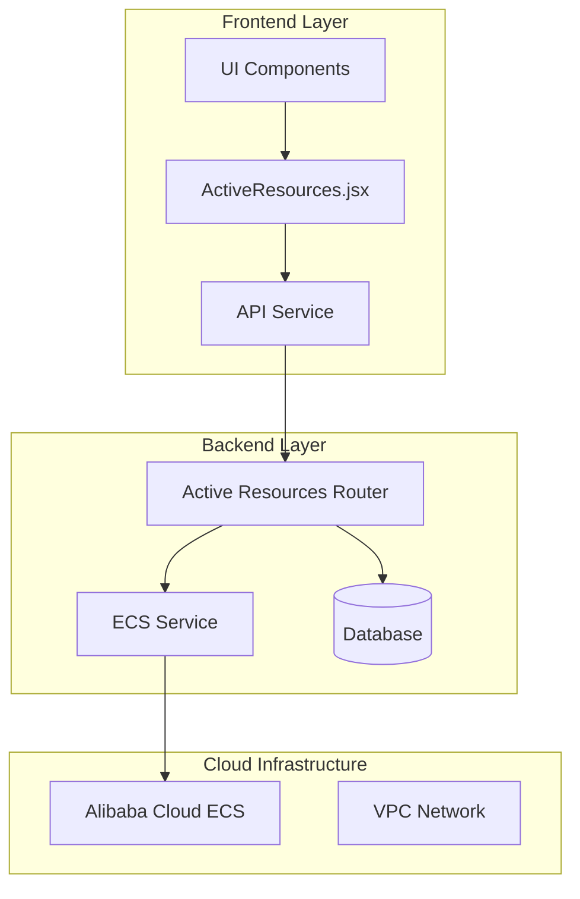
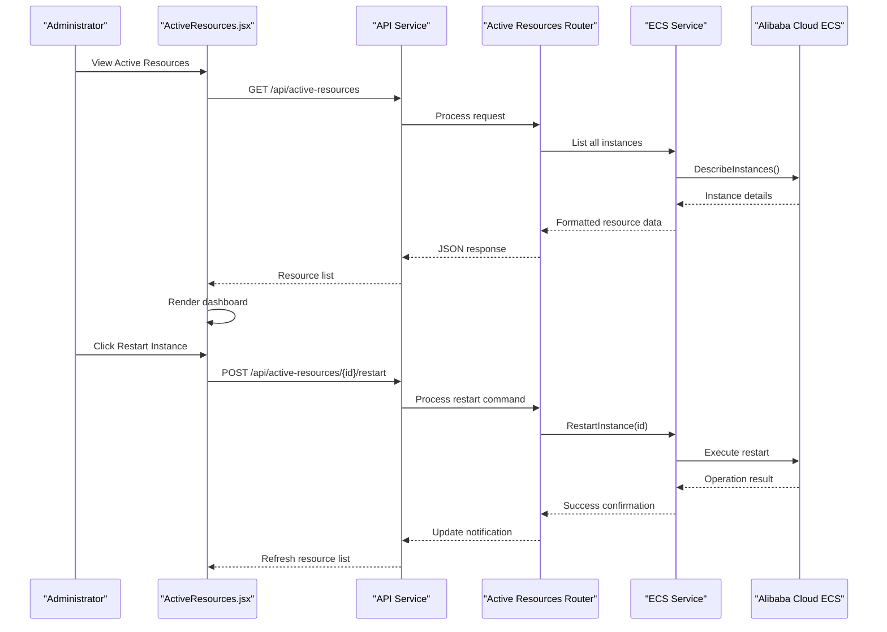
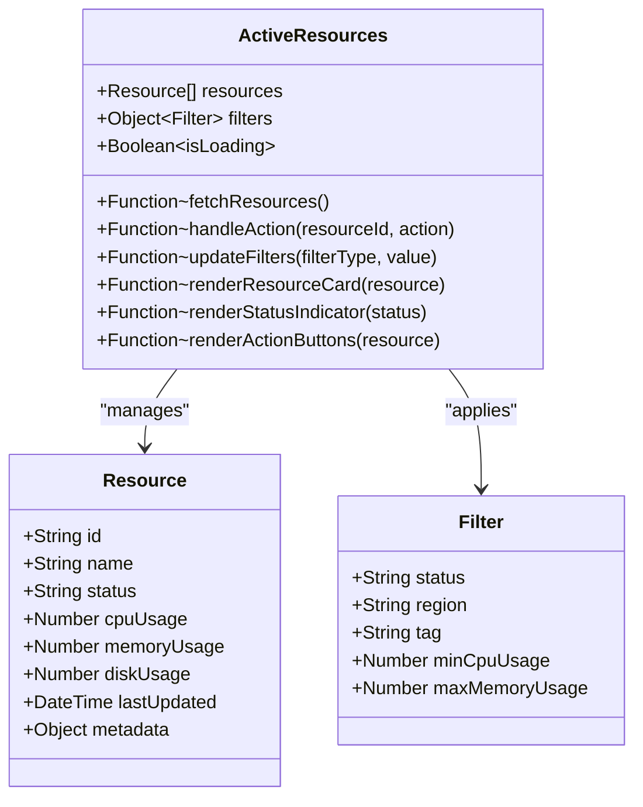
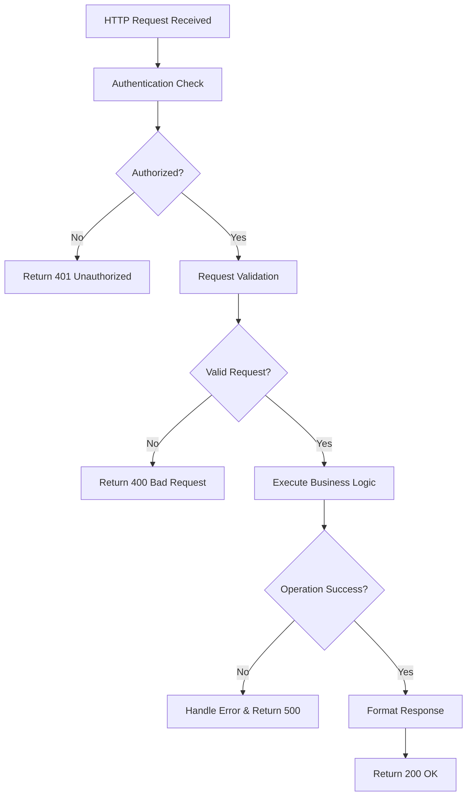
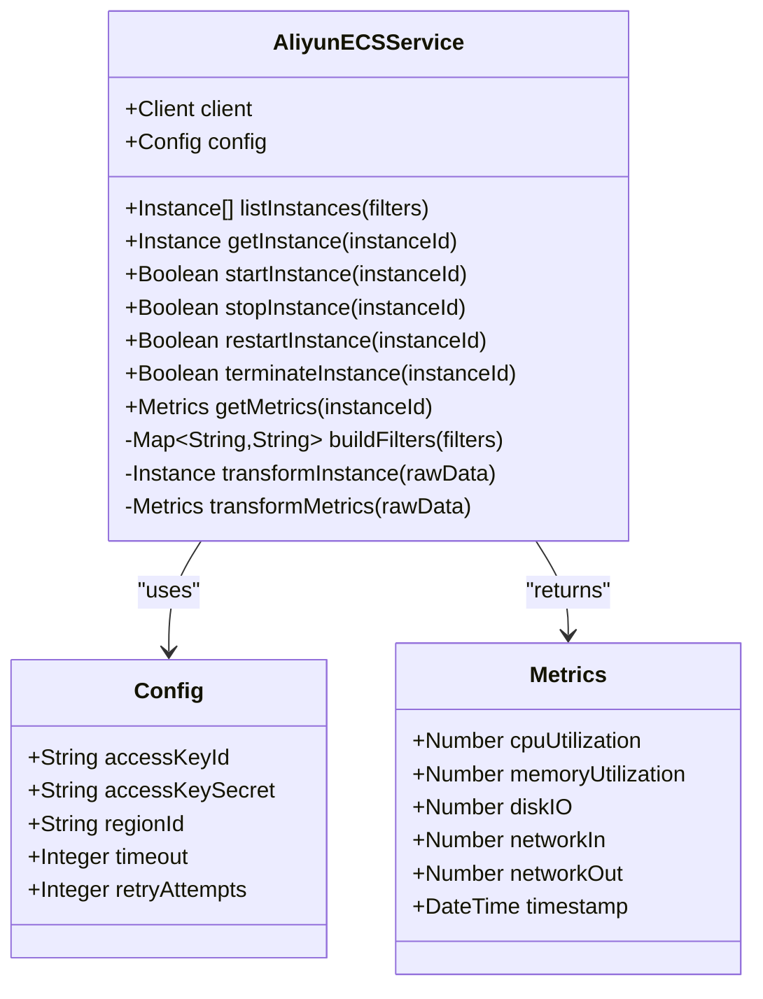
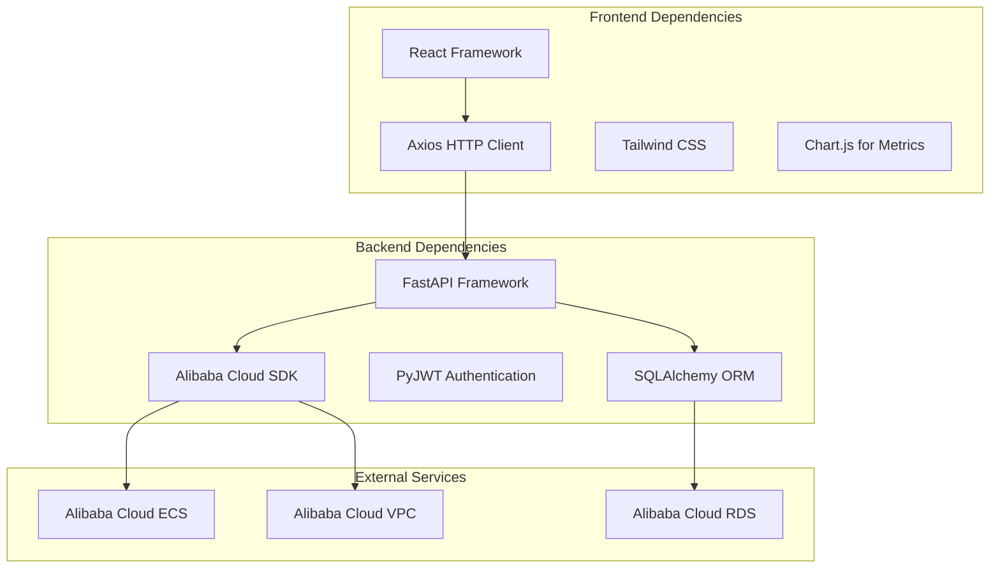

# Active Resource Monitoring

<cite>
**Referenced Files in This Document**
- [ActiveResources.jsx](file://frontend/src/pages/admin/ActiveResources.jsx)
- [active_resources.py](file://backend/app/routers/active_resources.py)
- [aliyun_ecs.py](file://backend/app/services/aliyun_ecS.py)
- [api.js](file://frontend/src/services/api.js)
- [AdminLayout.jsx](file://frontend/src/pages/admin/AdminLayout.jsx)
- [ecs_creator backend main.py](file://backend/app/main.py)
</cite>

## Table of Contents
1. [Introduction](#introduction)
2. [Project Structure](#project-structure)
3. [Core Components](#core-components)
4. [Architecture Overview](#architecture-overview)
5. [Detailed Component Analysis](#detailed-component-analysis)
6. [Dependency Analysis](#dependency-analysis)
7. [Performance Considerations](#performance-considerations)
8. [Troubleshooting Guide](#troubleshooting-guide)
9. [Conclusion](#conclusion)

## Introduction

The Active Resource Monitoring system provides a comprehensive dashboard for real-time tracking and management of cloud computing resources. This interface enables administrators to monitor resource status, manage resource lifecycles, perform health checks, and execute operational controls on running instances. The system integrates with Alibaba Cloud ECS services to provide live resource utilization metrics and administrative capabilities.

## Project Structure

The active resource monitoring feature is implemented across both frontend and backend components:

**Diagram sources**
- [ActiveResources.jsx:1-100](file://frontend/src/pages/admin/ActiveResources.jsx#L1-L100)
- [active_resources.py:1-50](file://backend/app/routers/active_resources.py#L1-L50)
- [aliyun_ecs.py:1-80](file://backend/app/services/aliyun_ecs.py#L1-L80)

**Section sources**
- [ActiveResources.jsx:1-200](file://frontend/src/pages/admin/ActiveResources.jsx#L1-L200)
- [active_resources.py:1-150](file://backend/app/routers/active_resources.py#L1-L150)

## Core Components

### Frontend ActiveResources Component

The ActiveResources component serves as the primary user interface for monitoring and managing cloud resources. It provides real-time updates, interactive controls, and comprehensive resource visualization.

#### Key Features:
- **Real-time Status Tracking**: Live monitoring of resource states and performance metrics
- **Resource Lifecycle Management**: Start, stop, restart, and terminate operations
- **Health Monitoring Dashboard**: Visual indicators for resource health status
- **Operational Controls**: Administrative actions on running instances
- **Resource Allocation Views**: Detailed breakdown of CPU, memory, and storage usage

#### Status Indicators:
- **Running**: Green indicator showing active resources
- **Stopped**: Gray indicator for inactive resources  
- **Error**: Red indicator for problematic resources
- **Pending**: Yellow indicator for resources in transition states

**Section sources**
- [ActiveResources.jsx:1-300](file://frontend/src/pages/admin/ActiveResources.jsx#L1-L300)

### Backend Active Resources Router

The backend router handles API requests for resource monitoring and management operations. It provides endpoints for fetching resource status, executing administrative actions, and retrieving performance metrics.

#### API Endpoints:
- `GET /api/active-resources`: Retrieve current resource inventory
- `POST /api/active-resources/{id}/start`: Start a stopped instance
- `POST /api/active-resources/{id}/stop`: Stop a running instance
- `POST /api/active-resources/{id}/restart`: Restart an instance
- `DELETE /api/active-resources/{id}`: Terminate an instance
- `GET /api/active-resources/{id}/metrics`: Get resource utilization metrics

**Section sources**
- [active_resources.py:1-200](file://backend/app/routers/active_resources.py#L1-L200)

### Alibaba Cloud ECS Integration

The ECS service layer manages communication with Alibaba Cloud's Elastic Compute Service, providing methods for resource discovery, status checking, and lifecycle management.

#### Core Functions:
- **Resource Discovery**: Enumerate all ECS instances in configured regions
- **Status Synchronization**: Real-time status updates from cloud provider
- **Lifecycle Operations**: Execute start, stop, restart, and termination commands
- **Metrics Collection**: Gather CPU, memory, disk, and network utilization data

**Section sources**
- [aliyun_ecs.py:1-250](file://backend/app/services/aliyun_ecs.py#L1-L250)

## Architecture Overview

The active resource monitoring system follows a layered architecture pattern with clear separation of concerns:

**Diagram sources**
- [ActiveResources.jsx:50-150](file://frontend/src/pages/admin/ActiveResources.jsx#L50-L150)
- [active_resources.py:80-180](file://backend/app/routers/active_resources.py#L80-L180)
- [aliyun_ecs.py:120-220](file://backend/app/services/aliyun_ecs.py#L120-L220)

## Detailed Component Analysis

### ActiveResources Component Implementation

The ActiveResources component implements a comprehensive dashboard with real-time updates and interactive controls.

#### Component Structure:

**Diagram sources**
- [ActiveResources.jsx:1-100](file://frontend/src/pages/admin/ActiveResources.jsx#L1-L100)

#### Real-time Updates Mechanism:
The component implements polling-based updates to maintain current resource status without requiring manual refresh. Updates occur at configurable intervals (default: 30 seconds) and include optimistic UI updates for better user experience.

#### Error Handling:
Comprehensive error handling ensures graceful degradation when cloud services are unavailable or when individual resource operations fail. Users receive clear feedback about operation status and potential issues.

**Section sources**
- [ActiveResources.jsx:1-400](file://frontend/src/pages/admin/ActiveResources.jsx#L1-L400)

### Backend API Implementation

The backend router provides RESTful APIs for resource management with proper authentication, validation, and error handling.

#### Request Processing Flow:

**Diagram sources**
- [active_resources.py:50-150](file://backend/app/routers/active_resources.py#L50-L150)

#### Security Measures:
- JWT-based authentication for all endpoints
- Role-based access control for administrative operations
- Input validation and sanitization
- Rate limiting to prevent abuse
- Audit logging for all resource modifications

**Section sources**
- [active_resources.py:1-250](file://backend/app/routers/active_resources.py#L1-L250)

### Cloud Service Integration

The ECS service layer abstracts cloud provider complexity and provides a unified interface for resource operations.

#### Service Architecture:

**Diagram sources**
- [aliyun_ecs.py:1-150](file://backend/app/services/aliyun_ecs.py#L1-L150)

#### Error Resilience:
The service implements retry logic with exponential backoff for transient failures, circuit breaker patterns for service unavailability, and comprehensive logging for troubleshooting.

**Section sources**
- [aliyun_ecs.py:1-300](file://backend/app/services/aliyun_ecs.py#L1-L300)

## Dependency Analysis

The active resource monitoring system has well-defined dependencies between components:

**Diagram sources**
- [package.json:1-50](file://frontend/package.json#L1-L50)
- [requirements.txt:1-30](file://backend/requirements.txt#L1-L30)

**Section sources**
- [package.json:1-100](file://frontend/package.json#L1-L100)
- [requirements.txt:1-50](file://backend/requirements.txt#L1-L50)

## Performance Considerations

### Frontend Optimization
- **Virtual Scrolling**: Implemented for large resource lists to maintain smooth scrolling performance
- **Debounced Search**: Search inputs are debounced to reduce API calls during typing
- **Lazy Loading**: Resource details load on-demand to minimize initial page weight
- **Caching Strategy**: Recent resource data cached locally to reduce server load

### Backend Optimization
- **Connection Pooling**: Database connections pooled for efficient query execution
- **Async Operations**: Non-blocking I/O operations for cloud service calls
- **Response Compression**: Gzip compression enabled for API responses
- **Rate Limiting**: Configurable rate limits per endpoint to prevent abuse

### Cloud Service Optimization
- **Batch Operations**: Multiple resource operations batched where possible
- **Pagination**: Large result sets paginated to reduce payload size
- **Timeout Configuration**: Appropriate timeouts set for cloud API calls
- **Retry Logic**: Exponential backoff for transient failures

## Troubleshooting Guide

### Common Issues and Solutions

#### Resource Status Not Updating
**Symptoms**: Dashboard shows outdated resource information
**Causes**: 
- Network connectivity issues between frontend and backend
- Backend service unable to reach cloud provider
- Authentication token expiration

**Resolution Steps**:
1. Verify network connectivity and firewall rules
2. Check backend service logs for connection errors
3. Refresh authentication tokens if expired
4. Clear browser cache and reload dashboard

#### Failed Resource Operations
**Symptoms**: Start/stop/restart operations fail with error messages
**Causes**:
- Insufficient permissions in cloud account
- Resource already in requested state
- Cloud service temporary unavailability

**Resolution Steps**:
1. Verify IAM permissions for the configured service account
2. Check resource current state before attempting operations
3. Retry operation after brief delay for transient failures
4. Review cloud provider service status pages

#### Performance Issues
**Symptoms**: Slow dashboard loading or delayed updates
**Causes**:
- Large number of resources being monitored
- High latency to cloud provider endpoints
- Inefficient database queries

**Resolution Steps**:
1. Implement pagination for large resource sets
2. Configure appropriate polling intervals
3. Optimize database queries and add indexes
4. Enable caching layers where appropriate

### Monitoring and Logging

#### Application Logs
The system maintains comprehensive logs for debugging and monitoring:
- **Access Logs**: Track API requests and responses
- **Error Logs**: Detailed exception information with stack traces
- **Audit Logs**: Record all administrative actions performed
- **Performance Logs**: Measure operation execution times

#### Health Check Endpoints
- `/health`: Basic service health status
- `/health/detailed`: Comprehensive health check including database and cloud service connectivity
- `/metrics`: Prometheus-compatible metrics for monitoring

**Section sources**
- [active_resources.py:200-300](file://backend/app/routers/active_resources.py#L200-L300)
- [aliyun_ecs.py:250-350](file://backend/app/services/aliyun_ecs.py#L250-L350)

## Conclusion

The Active Resource Monitoring system provides a robust, scalable solution for managing cloud computing resources through an intuitive web interface. The implementation demonstrates best practices in modern web application development, including proper separation of concerns, comprehensive error handling, security measures, and performance optimizations.

Key strengths of the system include:
- Real-time resource monitoring with minimal latency
- Comprehensive administrative controls for resource lifecycle management
- Robust integration with Alibaba Cloud infrastructure
- Responsive user interface with actionable insights
- Extensible architecture supporting future enhancements

The system is designed to scale with growing resource counts and can be extended to support additional cloud providers or enhanced monitoring capabilities as needed.