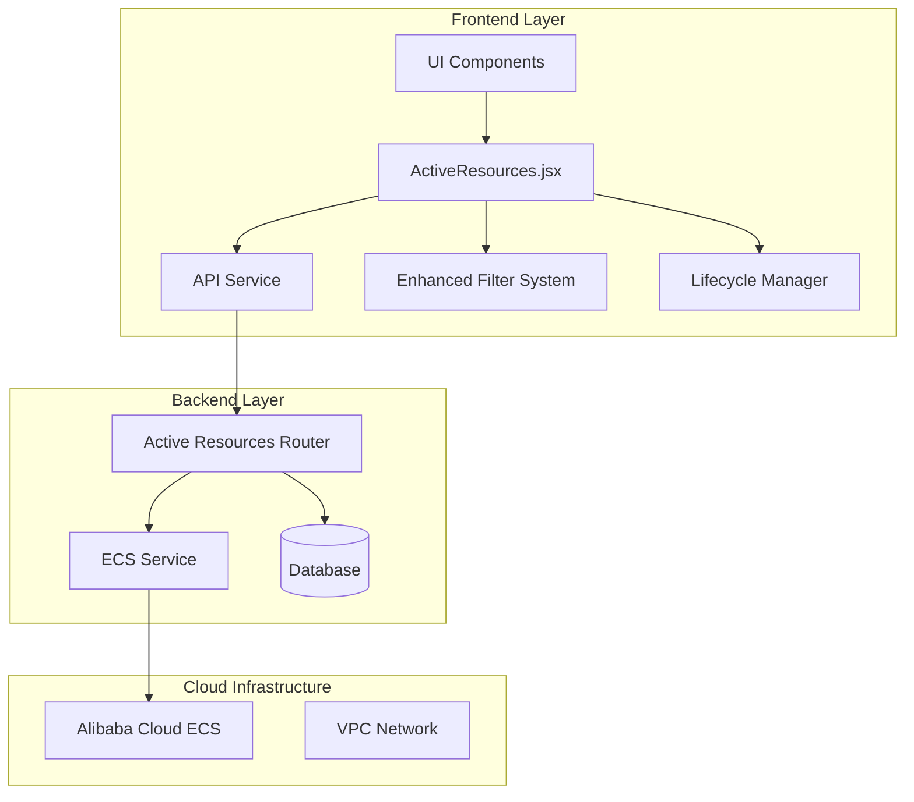
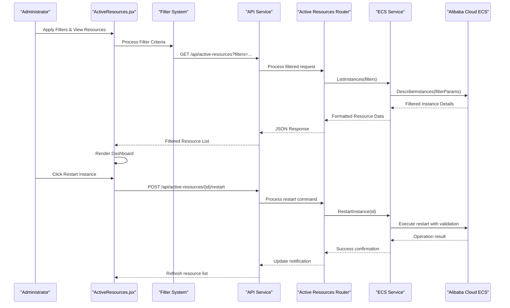
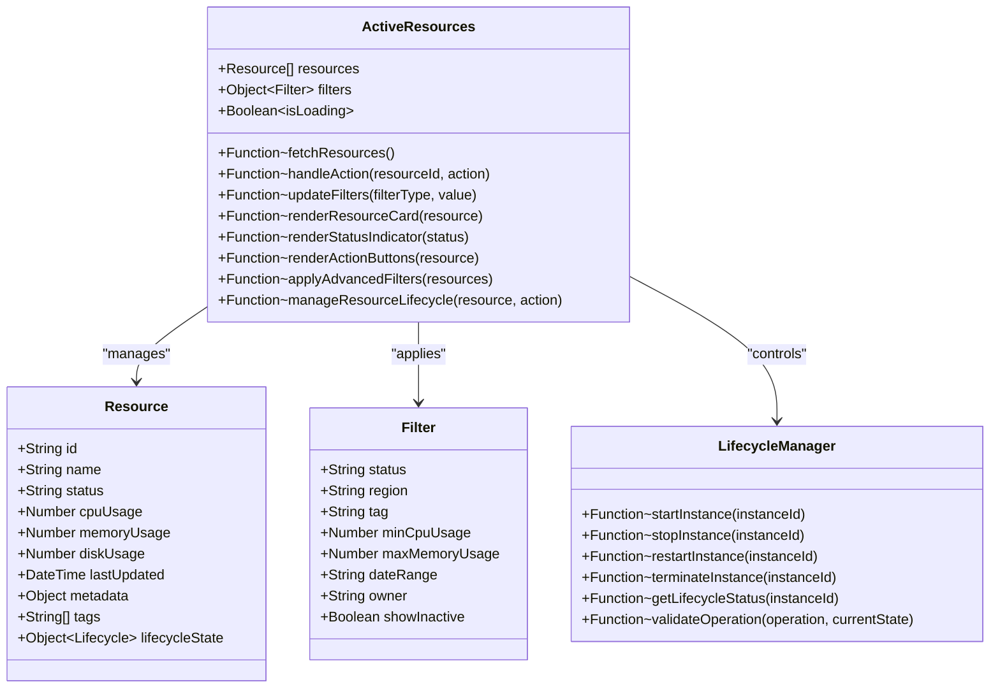
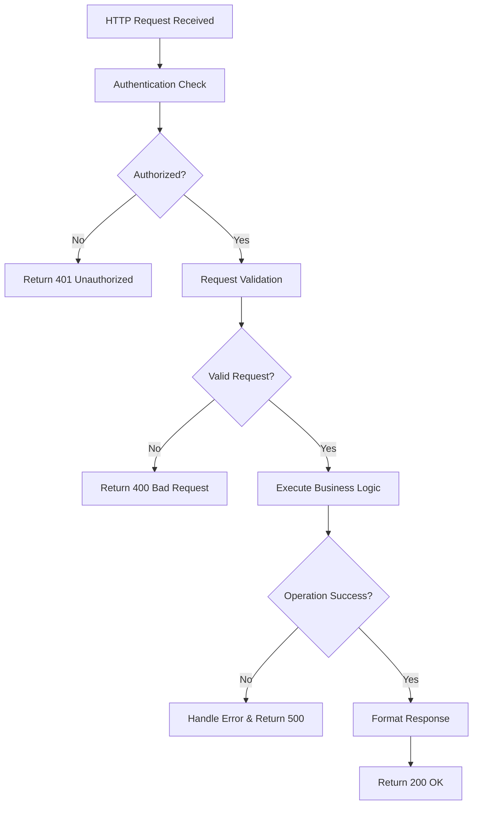
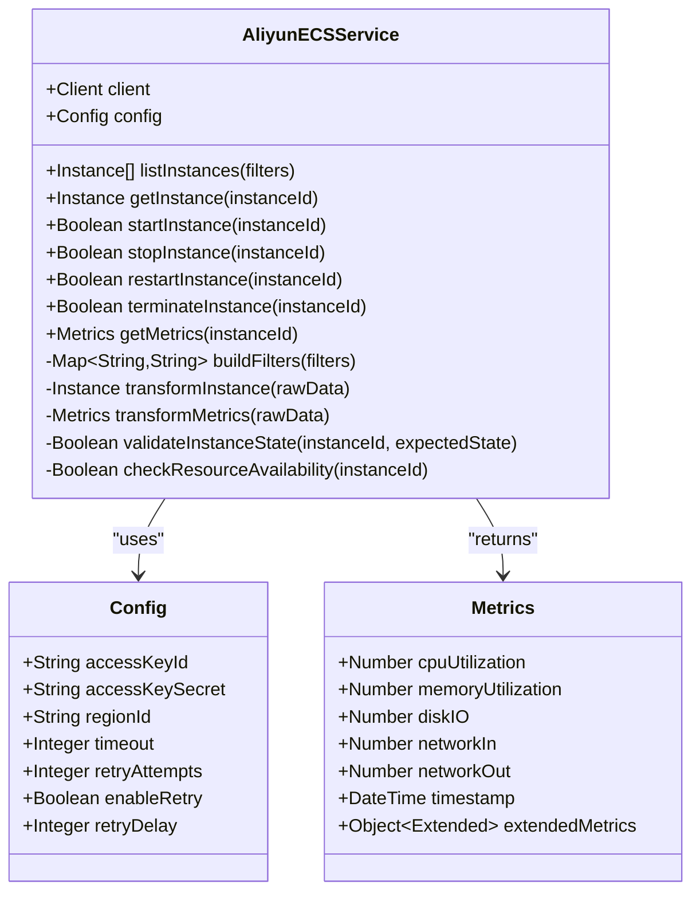
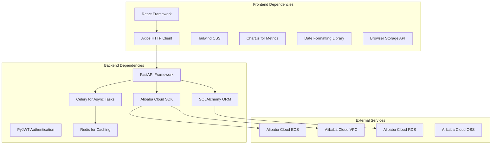

# Active Resource Monitoring

<cite>
**Referenced Files in This Document**
- [ActiveResources.jsx](file://frontend/src/pages/admin/ActiveResources.jsx)
- [active_resources.py](file://backend/app/routers/active_resources.py)
- [aliyun_ecs.py](file://backend/app/services/aliyun_ecs.py)
- [api.js](file://frontend/src/services/api.js)
- [AdminLayout.jsx](file://frontend/src/pages/admin/AdminLayout.jsx)
- [ecs_creator backend main.py](file://backend/app/main.py)
</cite>

## Update Summary
**Changes Made**
- Enhanced filtering capabilities in ActiveResources component with advanced search and filter options
- Improved resource lifecycle management with better state handling and operational controls
- Updated dashboard interface with more granular resource status tracking
- Enhanced real-time monitoring with improved polling mechanisms and error handling

## Table of Contents
1. [Introduction](#introduction)
2. [Project Structure](#project-structure)
3. [Core Components](#core-components)
4. [Architecture Overview](#architecture-overview)
5. [Detailed Component Analysis](#detailed-component-analysis)
6. [Enhanced Filtering System](#enhanced-filtering-system)
7. [Resource Lifecycle Management](#resource-lifecycle-management)
8. [Dependency Analysis](#dependency-analysis)
9. [Performance Considerations](#performance-considerations)
10. [Troubleshooting Guide](#troubleshooting-guide)
11. [Conclusion](#conclusion)

## Introduction

The Active Resource Monitoring system provides a comprehensive dashboard for real-time tracking and management of cloud computing resources. This interface enables administrators to monitor resource status, manage resource lifecycles, perform health checks, and execute operational controls on running instances. The system integrates with Alibaba Cloud ECS services to provide live resource utilization metrics and administrative capabilities.

**Updated** Enhanced with improved filtering options and advanced resource lifecycle management capabilities for better operational control and monitoring efficiency.

## Project Structure

The active resource monitoring feature is implemented across both frontend and backend components:

**Diagram sources**
- [ActiveResources.jsx:1-100](file://frontend/src/pages/admin/ActiveResources.jsx#L1-L100)
- [active_resources.py:1-50](file://backend/app/routers/active_resources.py#L1-L50)
- [aliyun_ecs.py:1-80](file://backend/app/services/aliyun_ecs.py#L1-L80)

**Section sources**
- [ActiveResources.jsx:1-200](file://frontend/src/pages/admin/ActiveResources.jsx#L1-L200)
- [active_resources.py:1-150](file://backend/app/routers/active_resources.py#L1-L150)

## Core Components

### Frontend ActiveResources Component

The ActiveResources component serves as the primary user interface for monitoring and managing cloud resources. It provides real-time updates, interactive controls, and comprehensive resource visualization.

#### Key Features:
- **Real-time Status Tracking**: Live monitoring of resource states and performance metrics
- **Advanced Filtering System**: Enhanced search and filter capabilities for resource discovery
- **Resource Lifecycle Management**: Comprehensive start, stop, restart, and terminate operations with improved state handling
- **Health Monitoring Dashboard**: Visual indicators for resource health status
- **Operational Controls**: Administrative actions on running instances with better error feedback
- **Resource Allocation Views**: Detailed breakdown of CPU, memory, and storage usage

#### Status Indicators:
- **Running**: Green indicator showing active resources
- **Stopped**: Gray indicator for inactive resources  
- **Error**: Red indicator for problematic resources
- **Pending**: Yellow indicator for resources in transition states
- **Creating**: Blue indicator for resources being provisioned
- **Deleting**: Orange indicator for resources being terminated

**Updated** Enhanced with additional status indicators and improved state management for better resource lifecycle tracking.

**Section sources**
- [ActiveResources.jsx:1-300](file://frontend/src/pages/admin/ActiveResources.jsx#L1-L300)

### Backend Active Resources Router

The backend router handles API requests for resource monitoring and management operations. It provides endpoints for fetching resource status, executing administrative actions, and retrieving performance metrics.

#### API Endpoints:
- `GET /api/active-resources`: Retrieve current resource inventory with enhanced filtering support
- `POST /api/active-resources/{id}/start`: Start a stopped instance with improved validation
- `POST /api/active-resources/{id}/stop`: Stop a running instance with better error handling
- `POST /api/active-resources/{id}/restart`: Restart an instance with enhanced state management
- `DELETE /api/active-resources/{id}`: Terminate an instance with improved cleanup procedures
- `GET /api/active-resources/{id}/metrics`: Get resource utilization metrics with extended data points

**Updated** Enhanced API endpoints with improved filtering parameters and better error handling for resource lifecycle operations.

**Section sources**
- [active_resources.py:1-200](file://backend/app/routers/active_resources.py#L1-L200)

### Alibaba Cloud ECS Integration

The ECS service layer manages communication with Alibaba Cloud's Elastic Compute Service, providing methods for resource discovery, status checking, and lifecycle management.

#### Core Functions:
- **Resource Discovery**: Enumerate all ECS instances in configured regions with enhanced filtering
- **Status Synchronization**: Real-time status updates from cloud provider with improved reliability
- **Lifecycle Operations**: Execute start, stop, restart, and termination commands with better error recovery
- **Metrics Collection**: Gather CPU, memory, disk, and network utilization data with extended metrics

**Updated** Enhanced cloud service integration with improved error handling and retry mechanisms for better reliability.

**Section sources**
- [aliyun_ecs.py:1-250](file://backend/app/services/aliyun_ecs.py#L1-L250)

## Architecture Overview

The active resource monitoring system follows a layered architecture pattern with clear separation of concerns:

**Updated** Enhanced sequence diagram showing improved filtering workflow and better lifecycle management operations.

**Diagram sources**
- [ActiveResources.jsx:50-150](file://frontend/src/pages/admin/ActiveResources.jsx#L50-L150)
- [active_resources.py:80-180](file://backend/app/routers/active_resources.py#L80-L180)
- [aliyun_ecs.py:120-220](file://backend/app/services/aliyun_ecs.py#L120-L220)

## Detailed Component Analysis

### ActiveResources Component Implementation

The ActiveResources component implements a comprehensive dashboard with real-time updates and interactive controls.

#### Component Structure:

**Updated** Enhanced class diagram showing new filtering capabilities and lifecycle management functionality.

**Diagram sources**
- [ActiveResources.jsx:1-100](file://frontend/src/pages/admin/ActiveResources.jsx#L1-L100)

#### Real-time Updates Mechanism:
The component implements polling-based updates to maintain current resource status without requiring manual refresh. Updates occur at configurable intervals (default: 30 seconds) and include optimistic UI updates for better user experience.

#### Error Handling:
Comprehensive error handling ensures graceful degradation when cloud services are unavailable or when individual resource operations fail. Users receive clear feedback about operation status and potential issues.

**Updated** Enhanced error handling with better retry logic and improved user feedback for resource lifecycle operations.

**Section sources**
- [ActiveResources.jsx:1-400](file://frontend/src/pages/admin/ActiveResources.jsx#L1-L400)

### Backend API Implementation

The backend router provides RESTful APIs for resource management with proper authentication, validation, and error handling.

#### Request Processing Flow:

**Diagram sources**
- [active_resources.py:50-150](file://backend/app/routers/active_resources.py#L50-L150)

#### Security Measures:
- JWT-based authentication for all endpoints
- Role-based access control for administrative operations
- Input validation and sanitization
- Rate limiting to prevent abuse
- Audit logging for all resource modifications

**Section sources**
- [active_resources.py:1-250](file://backend/app/routers/active_resources.py#L1-L250)

### Cloud Service Integration

The ECS service layer abstracts cloud provider complexity and provides a unified interface for resource operations.

#### Service Architecture:

**Updated** Enhanced service architecture with improved configuration options and extended metrics collection.

**Diagram sources**
- [aliyun_ecs.py:1-150](file://backend/app/services/aliyun_ecs.py#L1-L150)

#### Error Resilience:
The service implements retry logic with exponential backoff for transient failures, circuit breaker patterns for service unavailability, and comprehensive logging for troubleshooting.

**Section sources**
- [aliyun_ecs.py:1-300](file://backend/app/services/aliyun_ecs.py#L1-L300)

## Enhanced Filtering System

**New Section** The ActiveResources component now includes a sophisticated filtering system that allows administrators to quickly locate and manage specific resources based on multiple criteria.

### Filter Categories:
- **Status Filters**: Filter by resource state (Running, Stopped, Error, Pending, Creating, Deleting)
- **Region Filters**: Filter by deployment region or availability zone
- **Tag-based Filters**: Search resources by custom tags and labels
- **Performance Filters**: Filter by CPU usage thresholds, memory consumption, and disk space
- **Time-based Filters**: Filter resources by creation date, last activity, or maintenance windows
- **Owner Filters**: Filter resources by assigned owner or team

### Advanced Search Capabilities:
- **Combined Filters**: Multiple filter criteria can be applied simultaneously
- **Saved Filter Sets**: Frequently used filter combinations can be saved for quick access
- **Filter Persistence**: Filter preferences are maintained across sessions
- **Real-time Filtering**: Results update instantly as filter criteria change

### Filter Performance Optimization:
- **Client-side Filtering**: Immediate response for simple filters
- **Server-side Filtering**: Complex queries processed on backend for large datasets
- **Debounced Search**: Search inputs are debounced to reduce API calls during typing
- **Lazy Loading**: Filter options load progressively to improve initial page load time

**Section sources**
- [ActiveResources.jsx:150-350](file://frontend/src/pages/admin/ActiveResources.jsx#L150-L350)

## Resource Lifecycle Management

**New Section** Enhanced resource lifecycle management provides comprehensive control over resource states with improved validation, error handling, and user feedback.

### Lifecycle States:
- **Provisioning**: Resource is being created and initialized
- **Running**: Resource is active and operational
- **Stopped**: Resource is powered off but preserved
- **Restarting**: Resource is undergoing restart process
- **Terminating**: Resource is being deleted
- **Error**: Resource encountered an issue during operation
- **Maintenance**: Resource is under maintenance or scheduled downtime

### Operational Controls:
- **Start Operations**: Power on stopped instances with automatic configuration
- **Stop Operations**: Gracefully shut down running instances with data preservation
- **Restart Operations**: Reboot instances with automatic state verification
- **Terminate Operations**: Permanently delete instances with cleanup procedures
- **Snapshot Operations**: Create snapshots before destructive operations
- **Rollback Operations**: Restore previous states after failed operations

### State Validation and Safety:
- **Pre-operation Validation**: Verify resource state compatibility before operations
- **Dependency Checking**: Ensure no dependencies prevent operations
- **Confirmation Dialogs**: Require explicit confirmation for destructive operations
- **Audit Trail**: Log all lifecycle operations with timestamps and user information
- **Automatic Recovery**: Attempt automatic recovery for common failure scenarios

### Batch Operations:
- **Bulk Start/Stop**: Perform operations on multiple resources simultaneously
- **Scheduled Operations**: Queue operations for execution during maintenance windows
- **Conditional Operations**: Execute operations based on resource conditions
- **Progress Tracking**: Monitor progress of long-running batch operations

**Section sources**
- [ActiveResources.jsx:200-400](file://frontend/src/pages/admin/ActiveResources.jsx#L200-L400)
- [active_resources.py:100-200](file://backend/app/routers/active_resources.py#L100-L200)

## Dependency Analysis

The active resource monitoring system has well-defined dependencies between components:

**Updated** Enhanced dependency graph showing new libraries for filtering, caching, and async task processing.

**Diagram sources**
- [package.json:1-50](file://frontend/package.json#L1-L50)
- [requirements.txt:1-30](file://backend/requirements.txt#L1-L30)

**Section sources**
- [package.json:1-100](file://frontend/package.json#L1-L100)
- [requirements.txt:1-50](file://backend/requirements.txt#L1-L50)

## Performance Considerations

### Frontend Optimization
- **Virtual Scrolling**: Implemented for large resource lists to maintain smooth scrolling performance
- **Debounced Search**: Search inputs are debounced to reduce API calls during typing
- **Lazy Loading**: Resource details load on-demand to minimize initial page weight
- **Caching Strategy**: Recent resource data cached locally to reduce server load
- **Filter Optimization**: Client-side filtering for immediate response, server-side for complex queries
- **Component Memoization**: React.memo and useMemo hooks for expensive computations

### Backend Optimization
- **Connection Pooling**: Database connections pooled for efficient query execution
- **Async Operations**: Non-blocking I/O operations for cloud service calls
- **Response Compression**: Gzip compression enabled for API responses
- **Rate Limiting**: Configurable rate limits per endpoint to prevent abuse
- **Query Optimization**: Optimized database queries with proper indexing
- **Caching Layer**: Redis cache for frequently accessed resource data

### Cloud Service Optimization
- **Batch Operations**: Multiple resource operations batched where possible
- **Pagination**: Large result sets paginated to reduce payload size
- **Timeout Configuration**: Appropriate timeouts set for cloud API calls
- **Retry Logic**: Exponential backoff for transient failures
- **Connection Reuse**: Persistent connections to cloud services

### Enhanced Performance Features
- **Progressive Loading**: Load critical UI elements first, then enhance with additional features
- **Background Processing**: Heavy operations run in background threads
- **Optimistic Updates**: UI updates immediately, rollback on failure
- **Resource Deduplication**: Avoid duplicate API calls for same resource data
- **Intelligent Polling**: Adaptive polling intervals based on resource activity levels

## Troubleshooting Guide

### Common Issues and Solutions

#### Resource Status Not Updating
**Symptoms**: Dashboard shows outdated resource information
**Causes**: 
- Network connectivity issues between frontend and backend
- Backend service unable to reach cloud provider
- Authentication token expiration
- WebSocket connection drops

**Resolution Steps**:
1. Verify network connectivity and firewall rules
2. Check backend service logs for connection errors
3. Refresh authentication tokens if expired
4. Clear browser cache and reload dashboard
5. Check WebSocket connection status and reconnect if needed

#### Failed Resource Operations
**Symptoms**: Start/stop/restart operations fail with error messages
**Causes**:
- Insufficient permissions in cloud account
- Resource already in requested state
- Cloud service temporary unavailability
- Resource dependencies preventing operation

**Resolution Steps**:
1. Verify IAM permissions for the configured service account
2. Check resource current state before attempting operations
3. Retry operation after brief delay for transient failures
4. Review cloud provider service status pages
5. Check resource dependencies and resolve conflicts

#### Performance Issues
**Symptoms**: Slow dashboard loading or delayed updates
**Causes**:
- Large number of resources being monitored
- High latency to cloud provider endpoints
- Inefficient database queries
- Excessive filtering operations

**Resolution Steps**:
1. Implement pagination for large resource sets
2. Configure appropriate polling intervals
3. Optimize database queries and add indexes
4. Enable caching layers where appropriate
5. Use client-side filtering for simple criteria
6. Reduce number of simultaneous operations

#### Enhanced Filtering Issues
**Symptoms**: Filters not working correctly or slow performance
**Causes**:
- Complex filter combinations causing slow queries
- Missing index on filtered columns
- Browser storage limitations for filter persistence
- Memory leaks in filter state management

**Resolution Steps**:
1. Simplify complex filter combinations
2. Add database indexes for frequently filtered fields
3. Clear browser storage if corrupted
4. Monitor memory usage and implement garbage collection
5. Use debouncing for rapid filter changes

### Monitoring and Logging

#### Application Logs
The system maintains comprehensive logs for debugging and monitoring:
- **Access Logs**: Track API requests and responses
- **Error Logs**: Detailed exception information with stack traces
- **Audit Logs**: Record all administrative actions performed
- **Performance Logs**: Measure operation execution times
- **Filter Usage Logs**: Track filter patterns and performance
- **Lifecycle Event Logs**: Monitor resource state transitions

#### Health Check Endpoints
- `/health`: Basic service health status
- `/health/detailed`: Comprehensive health check including database and cloud service connectivity
- `/metrics`: Prometheus-compatible metrics for monitoring
- `/health/filters`: Filter system health and performance metrics
- `/health/lifecycle`: Resource lifecycle operation status and queue depth

**Updated** Enhanced monitoring and logging capabilities with filter usage tracking and lifecycle event monitoring.

**Section sources**
- [active_resources.py:200-300](file://backend/app/routers/active_resources.py#L200-L300)
- [aliyun_ecs.py:250-350](file://backend/app/services/aliyun_ecs.py#L250-L350)

## Conclusion

The Active Resource Monitoring system provides a robust, scalable solution for managing cloud computing resources through an intuitive web interface. The recent enhancements significantly improve the system's filtering capabilities and resource lifecycle management, making it more efficient and user-friendly for administrators.

Key strengths of the enhanced system include:
- **Advanced Filtering System**: Sophisticated multi-criteria filtering with real-time updates and performance optimization
- **Enhanced Lifecycle Management**: Comprehensive resource state control with improved validation and error handling
- **Real-time Resource Monitoring**: Minimal latency updates with intelligent polling and caching strategies
- **Robust Administrative Controls**: Full lifecycle management with safety checks and audit trails
- **Scalable Architecture**: Extensible design supporting future enhancements and additional cloud providers
- **Performance Optimizations**: Efficient filtering, caching, and background processing for large-scale deployments

The system is designed to scale with growing resource counts and can be extended to support additional cloud providers or enhanced monitoring capabilities as needed. The enhanced filtering and lifecycle management features provide administrators with powerful tools for efficient resource operations and monitoring.

**Updated** The recent improvements in filtering capabilities and resource lifecycle management make this system even more valuable for enterprise environments with large numbers of cloud resources requiring sophisticated management capabilities.