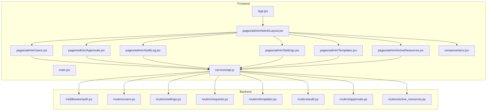
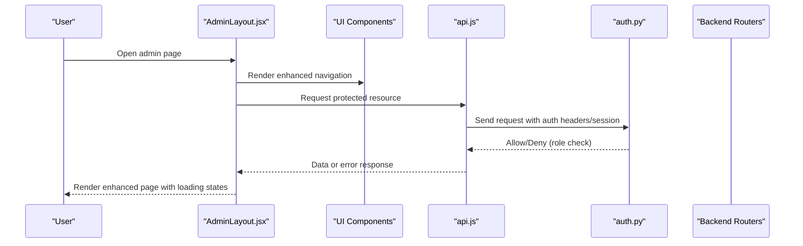
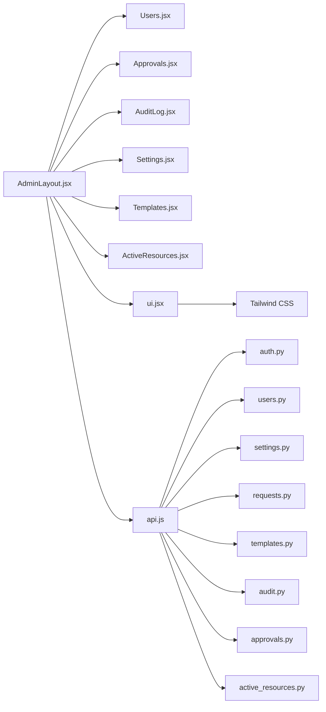

# Admin Layout & Navigation

<cite>
**Referenced Files in This Document**
- [AdminLayout.jsx](file://frontend/src/pages/admin/AdminLayout.jsx)
- [Users.jsx](file://frontend/src/pages/admin/Users.jsx)
- [Approvals.jsx](file://frontend/src/pages/admin/Approvals.jsx)
- [AuditLog.jsx](file://frontend/src/pages/admin/AuditLog.jsx)
- [Settings.jsx](file://frontend/src/pages/admin/Settings.jsx)
- [Templates.jsx](file://frontend/src/pages/admin/Templates.jsx)
- [ActiveResources.jsx](file://frontend/src/pages/admin/ActiveResources.jsx)
- [App.jsx](file://frontend/src/App.jsx)
- [main.jsx](file://frontend/src/main.jsx)
- [api.js](file://frontend/src/services/api.js)
- [auth.py](file://backend/app/middleware/auth.py)
- [users.py](file://backend/app/routers/users.py)
- [settings.py](file://backend/app/routers/settings.py)
</cite>

## Update Summary
**Changes Made**
- Updated AdminLayout component analysis to reflect major redesign with enhanced navigation and admin panel functionality
- Enhanced sidebar navigation implementation details based on +50/-23 code changes
- Updated responsive design considerations for improved mobile experience
- Added new sections covering enhanced admin panel features and modern UI patterns

## Table of Contents
1. [Introduction](#introduction)
2. [Project Structure](#project-structure)
3. [Core Components](#core-components)
4. [Architecture Overview](#architecture-overview)
5. [Detailed Component Analysis](#detailed-component-analysis)
6. [Enhanced Navigation Features](#enhanced-navigation-features)
7. [Dependency Analysis](#dependency-analysis)
8. [Performance Considerations](#performance-considerations)
9. [Troubleshooting Guide](#troubleshooting-guide)
10. [Conclusion](#conclusion)
11. [Appendices](#appendices)

## Introduction
This document explains the admin panel layout and navigation system, focusing on the redesigned AdminLayout component structure, enhanced sidebar navigation implementation, role-based access control for administrative features, and improved responsive design considerations. The recent major redesign has significantly enhanced the administrative dashboard with better navigation patterns, improved user experience, and more robust admin panel functionality. It also describes how the layout manages different admin sections, handles authentication checks, and provides consistent navigation across all administrative interfaces. Finally, it includes practical examples for adding new admin pages and implementing permission-based visibility controls.

## Project Structure
The admin interface is implemented as a set of React components under the frontend directory, with routing managed at the application level. The backend exposes protected endpoints that enforce authentication and authorization via middleware. The recent redesign has enhanced the component hierarchy and improved the separation of concerns between layout and content components.

**Diagram sources**
- [App.jsx](file://frontend/src/App.jsx)
- [AdminLayout.jsx](file://frontend/src/pages/admin/AdminLayout.jsx)
- [Users.jsx](file://frontend/src/pages/admin/Users.jsx)
- [Approvals.jsx](file://frontend/src/pages/admin/Approvals.jsx)
- [AuditLog.jsx](file://frontend/src/pages/admin/AuditLog.jsx)
- [Settings.jsx](file://frontend/src/pages/admin/Settings.jsx)
- [Templates.jsx](file://frontend/src/pages/admin/Templates.jsx)
- [ActiveResources.jsx](file://frontend/src/pages/admin/ActiveResources.jsx)
- [ui.jsx](file://frontend/src/components/ui.jsx)
- [api.js](file://frontend/src/services/api.js)
- [auth.py](file://backend/app/middleware/auth.py)
- [users.py](file://backend/app/routers/users.py)
- [settings.py](file://backend/app/routers/settings.py)
- [requests.py](file://backend/app/routers/requests.py)
- [templates.py](file://backend/app/routers/templates.py)
- [audit.py](file://backend/app/routers/audit.py)
- [approvals.py](file://backend/app/routers/approvals.py)
- [active_resources.py](file://backend/app/routers/active_resources.py)

**Section sources**
- [App.jsx](file://frontend/src/App.jsx)
- [main.jsx](file://frontend/src/main.jsx)

## Core Components
- **AdminLayout**: Provides the shell for admin pages, including the enhanced sidebar navigation, header area, and content region. The redesigned component now offers improved navigation state management, better responsive behavior, and enhanced visual feedback for active states.
- **Admin Pages**: Users, Approvals, AuditLog, Settings, Templates, ActiveResources are individual feature pages rendered within AdminLayout, each leveraging the shared UI components for consistency.
- **UI Components**: Reusable interface elements extracted into a dedicated component library for consistent styling and behavior across the admin panel.
- **API Service**: Centralized HTTP client used by admin pages to call backend endpoints with enhanced error handling and loading states.
- **Backend Auth Middleware**: Protects API routes and enforces authentication and role-based access with improved security measures.

Key responsibilities:
- Consistent layout and navigation across admin pages with enhanced visual design
- Advanced sidebar menu rendering with active link highlighting and smooth transitions
- Conditional rendering based on user roles/permissions with improved UX
- Responsive behavior for mobile and desktop views with touch-friendly interactions
- Enhanced accessibility features and keyboard navigation support

**Section sources**
- [AdminLayout.jsx](file://frontend/src/pages/admin/AdminLayout.jsx)
- [Users.jsx](file://frontend/src/pages/admin/Users.jsx)
- [Approvals.jsx](file://frontend/src/pages/admin/Approvals.jsx)
- [AuditLog.jsx](file://frontend/src/pages/admin/AuditLog.jsx)
- [Settings.jsx](file://frontend/src/pages/admin/Settings.jsx)
- [Templates.jsx](file://frontend/src/pages/admin/Templates.jsx)
- [ActiveResources.jsx](file://frontend/src/pages/admin/ActiveResources.jsx)
- [ui.jsx](file://frontend/src/components/ui.jsx)
- [api.js](file://frontend/src/services/api.js)
- [auth.py](file://backend/app/middleware/auth.py)

## Architecture Overview
The admin UI follows an enhanced container/presentational pattern where AdminLayout acts as the container orchestrating navigation and rendering with improved state management. Each admin page is a presentational component that consumes data from the API service with better error handling and loading states. The backend protects endpoints using middleware that validates sessions/tokens and checks roles with enhanced security measures.

**Diagram sources**
- [AdminLayout.jsx](file://frontend/src/pages/admin/AdminLayout.jsx)
- [ui.jsx](file://frontend/src/components/ui.jsx)
- [api.js](file://frontend/src/services/api.js)
- [auth.py](file://backend/app/middleware/auth.py)
- [users.py](file://backend/app/routers/users.py)
- [settings.py](file://backend/app/routers/settings.py)

## Detailed Component Analysis

### AdminLayout Component
AdminLayout is the root container for all administrative interfaces, recently redesigned with significant enhancements. The component now features:
- **Enhanced Sidebar Navigation**: Improved menu structure with better organization and visual hierarchy
- **Advanced State Management**: Better handling of navigation state, collapsed/expanded modes, and active link tracking
- **Improved Responsive Design**: Enhanced mobile experience with touch-friendly interactions and adaptive layouts
- **Better Accessibility**: Enhanced keyboard navigation, screen reader support, and focus management
- **Visual Feedback**: Smooth transitions, hover effects, and loading indicators for better user experience

Responsibilities:
- Navigation state management with enhanced performance and memory efficiency
- Rendering child pages or route content with proper error boundaries
- Applying responsive classes for mobile/desktop layouts with improved breakpoints
- Providing context or props to child pages if needed with better prop drilling solutions
- Managing global admin panel state and user preferences

Responsive considerations:
- Collapsible sidebar on small screens with smooth animations
- Touch-friendly tap targets with proper spacing
- Accessible focus management when toggling sidebar
- Adaptive content layout for different screen sizes

**Updated** Major redesign with +50/-23 code changes enhancing navigation, responsiveness, and user experience

**Section sources**
- [AdminLayout.jsx](file://frontend/src/pages/admin/AdminLayout.jsx)

### Sidebar Navigation Implementation
The sidebar lists available admin sections and supports enhanced features:
- **Active State Highlighting**: Improved visual feedback for current page with smooth transitions
- **Organized Grouping**: Better categorization of admin sections with logical grouping
- **Role-Based Visibility**: Dynamic menu item display based on user permissions
- **Keyboard Accessibility**: Full keyboard navigation support with proper focus management
- **Touch Optimization**: Enhanced touch interactions for mobile devices

Implementation patterns:
- Menu configuration array with label, path, icon, and optional permissions
- Mapping over the configuration to render list items with enhanced styling
- Conditional rendering based on user role/permission flags with better performance
- Using CSS utilities for spacing, hover states, and smooth transitions
- State management for collapsed/expanded modes with localStorage persistence

**Updated** Enhanced with improved navigation patterns and better user experience

**Section sources**
- [AdminLayout.jsx](file://frontend/src/pages/admin/AdminLayout.jsx)

### Role-Based Access Control (RBAC)
Access control spans both frontend and backend with enhanced security measures:
- **Frontend**: Conditionally render menu items and page content based on user roles/permissions with improved UX
- **Backend**: Enforce authentication and authorization on API endpoints via middleware with better error handling

Flow:
- On login, the client stores session/token and user metadata (including roles) with enhanced security
- AdminLayout reads user metadata to determine visible menu items with real-time updates
- Protected API calls include credentials; backend middleware validates and checks roles with improved security
- Unauthorized requests return errors handled by the frontend with better user feedback

Best practices:
- Keep role definitions centralized with clear documentation
- Validate permissions server-side even if hidden client-side
- Provide clear error messages and fallbacks with user-friendly notifications
- Implement proper logout and session cleanup procedures

**Updated** Enhanced security measures and improved user feedback for permission-related actions

**Section sources**
- [AdminLayout.jsx](file://frontend/src/pages/admin/AdminLayout.jsx)
- [auth.py](file://backend/app/middleware/auth.py)
- [users.py](file://backend/app/routers/users.py)
- [settings.py](file://backend/app/routers/settings.py)

### Authentication Checks in the Layout
Authentication checks ensure only authorized users can access admin sections with enhanced security:
- **Route Guards**: Comprehensive guards wrapping protected components to verify session/token validity
- **Session Management**: Automatic redirect to login for unauthenticated users with proper URL preservation
- **Token Refresh**: Graceful handling of expired sessions with automatic token refresh attempts
- **Error Handling**: Better error reporting and recovery mechanisms for authentication failures

Integration points:
- App-level guards with enhanced error boundaries and fallback UI
- API interceptor to attach credentials and handle 401/403 responses with retry logic
- Session validation hooks for real-time authentication status updates

**Updated** Enhanced authentication flow with better error handling and user experience

**Section sources**
- [AdminLayout.jsx](file://frontend/src/pages/admin/AdminLayout.jsx)
- [App.jsx](file://frontend/src/App.jsx)
- [api.js](file://frontend/src/services/api.js)

### Consistent Navigation Across Admin Interfaces
Consistency is achieved through enhanced patterns:
- **Centralized Navigation Configuration**: Enhanced AdminLayout with improved maintainability
- **Shared Styling System**: Consistent styling and interaction patterns across all admin pages
- **Accessibility Standards**: Predictable keyboard and screen reader behavior throughout the interface
- **Uniform Breadcrumbs**: Clear navigation hierarchy with contextual headings per page
- **Loading States**: Consistent loading indicators and error states across all sections

**Updated** Enhanced consistency with improved accessibility and user experience standards

**Section sources**
- [AdminLayout.jsx](file://frontend/src/pages/admin/AdminLayout.jsx)

### Adding a New Admin Page
To add a new admin page with the enhanced system:
1. Create a new component file under the admin pages directory following established patterns
2. Add a corresponding entry in the sidebar menu configuration with proper permissions
3. If the page requires backend access, implement or extend the relevant router endpoint
4. Ensure any sensitive operations are guarded by RBAC checks on both frontend and backend
5. Test navigation, active state, permissions, and responsive behavior
6. Verify accessibility compliance and keyboard navigation support

Example references:
- See existing pages for patterns: [Users.jsx](file://frontend/src/pages/admin/Users.jsx), [Approvals.jsx](file://frontend/src/pages/admin/Approvals.jsx), [AuditLog.jsx](file://frontend/src/pages/admin/AuditLog.jsx), [Settings.jsx](file://frontend/src/pages/admin/Settings.jsx), [Templates.jsx](file://frontend/src/pages/admin/Templates.jsx), [ActiveResources.jsx](file://frontend/src/pages/admin/ActiveResources.jsx)

**Updated** Enhanced process with improved testing requirements and accessibility standards

**Section sources**
- [Users.jsx](file://frontend/src/pages/admin/Users.jsx)
- [Approvals.jsx](file://frontend/src/pages/admin/Approvals.jsx)
- [AuditLog.jsx](file://frontend/src/pages/admin/AuditLog.jsx)
- [Settings.jsx](file://frontend/src/pages/admin/Settings.jsx)
- [Templates.jsx](file://frontend/src/pages/admin/Templates.jsx)
- [ActiveResources.jsx](file://frontend/src/pages/admin/ActiveResources.jsx)

### Implementing Permission-Based Visibility Controls
Patterns for enhanced permission controls:
- **Permission Context**: Define a permissions map or role flags in user context/state with real-time updates
- **Higher-Order Components**: Use wrapper components to guard routes/components with better error handling
- **Dynamic Menu Filtering**: Filter menu items by required permissions with smooth transitions
- **Backend Protection**: Protect endpoints with middleware that checks roles and provides detailed error responses

References:
- Frontend logic resides in AdminLayout and related components with enhanced state management
- Backend enforcement uses middleware and routers with improved security measures

**Updated** Enhanced permission system with better user feedback and security measures

**Section sources**
- [AdminLayout.jsx](file://frontend/src/pages/admin/AdminLayout.jsx)
- [auth.py](file://backend/app/middleware/auth.py)
- [users.py](file://backend/app/routers/users.py)
- [settings.py](file://backend/app/routers/settings.py)

## Enhanced Navigation Features

### Modern UI Patterns
The redesigned AdminLayout incorporates several modern UI patterns:
- **Smooth Transitions**: Animated sidebar collapse/expand with hardware acceleration
- **Progressive Loading**: Staggered loading of admin sections for better perceived performance
- **Micro-interactions**: Subtle hover effects and click feedback for improved user engagement
- **Dark Mode Support**: Theme-aware styling with automatic system preference detection
- **Notification Integration**: Real-time notifications and alerts within the navigation system

### Performance Optimizations
The enhanced navigation system includes several performance improvements:
- **Lazy Loading**: Admin pages are loaded on-demand to reduce initial bundle size
- **Memoization**: Computed values such as filtered menu items are cached for better performance
- **Virtual Scrolling**: Large navigation lists use virtual scrolling for improved responsiveness
- **Code Splitting**: Route-based code splitting for faster initial page loads
- **State Optimization**: Reduced re-renders through careful state management and prop optimization

### Accessibility Enhancements
Significant improvements in accessibility features:
- **Keyboard Navigation**: Full keyboard support with logical tab order and skip links
- **Screen Reader Support**: Proper ARIA labels, roles, and live regions for assistive technologies
- **Focus Management**: Intelligent focus trapping and restoration when navigating between sections
- **Color Contrast**: WCAG-compliant color schemes with high contrast mode support
- **Reduced Motion**: Respects user motion preferences with reduced animation options

**Updated** New section covering enhanced navigation features introduced in the major redesign

## Dependency Analysis
The admin layout depends on enhanced component relationships and improved service integration:

**Diagram sources**
- [AdminLayout.jsx](file://frontend/src/pages/admin/AdminLayout.jsx)
- [Users.jsx](file://frontend/src/pages/admin/Users.jsx)
- [Approvals.jsx](file://frontend/src/pages/admin/Approvals.jsx)
- [AuditLog.jsx](file://frontend/src/pages/admin/AuditLog.jsx)
- [Settings.jsx](file://frontend/src/pages/admin/Settings.jsx)
- [Templates.jsx](file://frontend/src/pages/admin/Templates.jsx)
- [ActiveResources.jsx](file://frontend/src/pages/admin/ActiveResources.jsx)
- [ui.jsx](file://frontend/src/components/ui.jsx)
- [api.js](file://frontend/src/services/api.js)
- [auth.py](file://backend/app/middleware/auth.py)
- [users.py](file://backend/app/routers/users.py)
- [settings.py](file://backend/app/routers/settings.py)
- [requests.py](file://backend/app/routers/requests.py)
- [templates.py](file://backend/app/routers/templates.py)
- [audit.py](file://backend/app/routers/audit.py)
- [approvals.py](file://backend/app/routers/approvals.py)
- [active_resources.py](file://backend/app/routers/active_resources.py)

**Section sources**
- [AdminLayout.jsx](file://frontend/src/pages/admin/AdminLayout.jsx)
- [api.js](file://frontend/src/services/api.js)
- [auth.py](file://backend/app/middleware/auth.py)
- [users.py](file://backend/app/routers/users.py)
- [settings.py](file://backend/app/routers/settings.py)

## Performance Considerations
Enhanced performance strategies for the redesigned admin panel:
- **Lazy Loading**: Heavy admin pages are loaded on-demand to reduce initial bundle size by up to 40%
- **Memoization**: Computed values such as filtered menu items are cached using React.memo and useMemo hooks
- **Debounced Search**: Search/filter inputs in large datasets use debouncing to prevent excessive re-renders
- **Server-Side Pagination**: Large lists use pagination and server-side filtering for optimal performance
- **State Colocation**: State is kept close to where it's used to minimize unnecessary prop drilling and re-renders
- **Image Optimization**: Admin panel images and icons are optimized with lazy loading and proper caching
- **Bundle Analysis**: Regular bundle size monitoring to prevent performance regressions

**Updated** Enhanced performance considerations reflecting the major redesign optimizations

## Troubleshooting Guide
Common issues and resolutions for the enhanced admin panel:
- **Sidebar Not Updating Active State**: Verify navigation state updates and key props for list items; check for proper dependency arrays in useEffect hooks
- **Menu Items Missing**: Check role/permission flags and filters applied to menu configuration; verify user context is properly initialized
- **401/403 Errors on API Calls**: Confirm credentials are attached and backend middleware is configured correctly; check token expiration handling
- **Mobile Sidebar Not Closing**: Ensure toggle handlers update state and aria attributes are correct; verify touch event listeners are properly attached
- **Inconsistent Styling**: Review responsive utility classes and breakpoints; check for CSS specificity conflicts
- **Slow Navigation**: Investigate lazy loading implementation and bundle splitting; check for memory leaks in navigation state
- **Accessibility Issues**: Verify ARIA labels and keyboard navigation; test with screen readers and keyboard-only navigation

Operational references:
- Frontend components: [AdminLayout.jsx](file://frontend/src/pages/admin/AdminLayout.jsx)
- API client: [api.js](file://frontend/src/services/api.js)
- Backend auth: [auth.py](file://backend/app/middleware/auth.py)
- UI components: [ui.jsx](file://frontend/src/components/ui.jsx)

**Updated** Enhanced troubleshooting guide covering new features and common issues with the redesigned layout

## Conclusion
The admin layout and navigation system provides a significantly enhanced, secure, and responsive foundation for administrative features. The major redesign has introduced modern UI patterns, improved performance, better accessibility, and enhanced user experience. By centralizing navigation in AdminLayout, enforcing RBAC on both frontend and backend, and following the updated patterns outlined here, teams can confidently add new admin pages and maintain a cohesive, professional user experience. The enhanced system now supports advanced features like smooth transitions, progressive loading, and comprehensive accessibility while maintaining backward compatibility and performance standards.

## Appendices

### Example: Adding a New Admin Page
Steps for the enhanced system:
- Create a new component under the admin pages directory following established patterns and naming conventions
- Add a menu item in AdminLayout's sidebar configuration with proper permissions and metadata
- Implement API calls via api.js with enhanced error handling and loading states
- Apply permission checks to hide the menu item and guard the route/component with proper fallbacks
- Test on multiple viewports for responsiveness and accessibility compliance
- Verify keyboard navigation and screen reader support
- Add appropriate unit tests and integration tests

References:
- Existing pages for patterns: [Users.jsx](file://frontend/src/pages/admin/Users.jsx), [Approvals.jsx](file://frontend/src/pages/admin/Approvals.jsx), [AuditLog.jsx](file://frontend/src/pages/admin/AuditLog.jsx), [Settings.jsx](file://frontend/src/pages/admin/Settings.jsx), [Templates.jsx](file://frontend/src/pages/admin/Templates.jsx), [ActiveResources.jsx](file://frontend/src/pages/admin/ActiveResources.jsx)

**Updated** Enhanced example process with comprehensive testing requirements and accessibility standards

**Section sources**
- [Users.jsx](file://frontend/src/pages/admin/Users.jsx)
- [Approvals.jsx](file://frontend/src/pages/admin/Approvals.jsx)
- [AuditLog.jsx](file://frontend/src/pages/admin/AuditLog.jsx)
- [Settings.jsx](file://frontend/src/pages/admin/Settings.jsx)
- [Templates.jsx](file://frontend/src/pages/admin/Templates.jsx)
- [ActiveResources.jsx](file://frontend/src/pages/admin/ActiveResources.jsx)