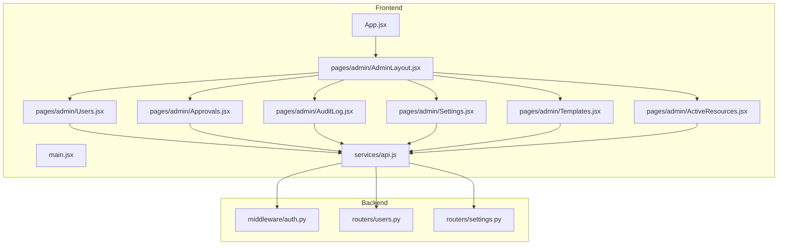
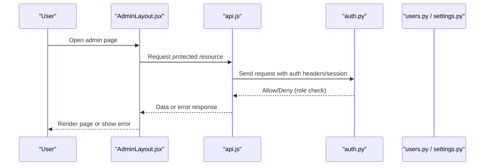
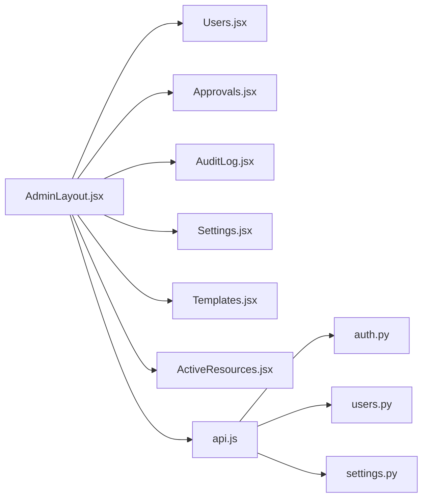

# Admin Layout & Navigation

<cite>
**Referenced Files in This Document**
- [AdminLayout.jsx](file://frontend/src/pages/admin/AdminLayout.jsx)
- [Users.jsx](file://frontend/src/pages/admin/Users.jsx)
- [Approvals.jsx](file://frontend/src/pages/admin/Approvals.jsx)
- [AuditLog.jsx](file://frontend/src/pages/admin/AuditLog.jsx)
- [Settings.jsx](file://frontend/src/pages/admin/Settings.jsx)
- [Templates.jsx](file://frontend/src/pages/admin/Templates.jsx)
- [ActiveResources.jsx](file://frontend/src/pages/admin/ActiveResources.jsx)
- [App.jsx](file://frontend/src/App.jsx)
- [main.jsx](file://frontend/src/main.jsx)
- [api.js](file://frontend/src/services/api.js)
- [auth.py](file://backend/app/middleware/auth.py)
- [users.py](file://backend/app/routers/users.py)
- [settings.py](file://backend/app/routers/settings.py)
</cite>

## Table of Contents
1. [Introduction](#introduction)
2. [Project Structure](#project-structure)
3. [Core Components](#core-components)
4. [Architecture Overview](#architecture-overview)
5. [Detailed Component Analysis](#detailed-component-analysis)
6. [Dependency Analysis](#dependency-analysis)
7. [Performance Considerations](#performance-considerations)
8. [Troubleshooting Guide](#troubleshooting-guide)
9. [Conclusion](#conclusion)
10. [Appendices](#appendices)

## Introduction
This document explains the admin panel layout and navigation system, focusing on the AdminLayout component structure, sidebar navigation implementation, role-based access control for administrative features, and responsive design considerations. It also describes how the layout manages different admin sections, handles authentication checks, and provides consistent navigation across all administrative interfaces. Finally, it includes practical examples for adding new admin pages and implementing permission-based visibility controls.

## Project Structure
The admin interface is implemented as a set of React components under the frontend directory, with routing managed at the application level. The backend exposes protected endpoints that enforce authentication and authorization via middleware.

**Diagram sources**
- [App.jsx](file://frontend/src/App.jsx)
- [AdminLayout.jsx](file://frontend/src/pages/admin/AdminLayout.jsx)
- [Users.jsx](file://frontend/src/pages/admin/Users.jsx)
- [Approvals.jsx](file://frontend/src/pages/admin/Approvals.jsx)
- [AuditLog.jsx](file://frontend/src/pages/admin/AuditLog.jsx)
- [Settings.jsx](file://frontend/src/pages/admin/Settings.jsx)
- [Templates.jsx](file://frontend/src/pages/admin/Templates.jsx)
- [ActiveResources.jsx](file://frontend/src/pages/admin/ActiveResources.jsx)
- [api.js](file://frontend/src/services/api.js)
- [auth.py](file://backend/app/middleware/auth.py)
- [users.py](file://backend/app/routers/users.py)
- [settings.py](file://backend/app/routers/settings.py)

**Section sources**
- [App.jsx](file://frontend/src/App.jsx)
- [main.jsx](file://frontend/src/main.jsx)

## Core Components
- AdminLayout: Provides the shell for admin pages, including the sidebar navigation, header area, and content region. It centralizes navigation state and renders child routes or page components consistently.
- Admin Pages: Users, Approvals, AuditLog, Settings, Templates, ActiveResources are individual feature pages rendered within AdminLayout.
- API Service: Centralized HTTP client used by admin pages to call backend endpoints.
- Backend Auth Middleware: Protects API routes and enforces authentication and role-based access.

Key responsibilities:
- Consistent layout and navigation across admin pages
- Sidebar menu rendering and active link highlighting
- Conditional rendering based on user roles/permissions
- Responsive behavior for mobile and desktop views

**Section sources**
- [AdminLayout.jsx](file://frontend/src/pages/admin/AdminLayout.jsx)
- [Users.jsx](file://frontend/src/pages/admin/Users.jsx)
- [Approvals.jsx](file://frontend/src/pages/admin/Approvals.jsx)
- [AuditLog.jsx](file://frontend/src/pages/admin/AuditLog.jsx)
- [Settings.jsx](file://frontend/src/pages/admin/Settings.jsx)
- [Templates.jsx](file://frontend/src/pages/admin/Templates.jsx)
- [ActiveResources.jsx](file://frontend/src/pages/admin/ActiveResources.jsx)
- [api.js](file://frontend/src/services/api.js)
- [auth.py](file://backend/app/middleware/auth.py)

## Architecture Overview
The admin UI follows a container/presentational pattern where AdminLayout acts as the container orchestrating navigation and rendering. Each admin page is a presentational component that consumes data from the API service. The backend protects endpoints using middleware that validates sessions/tokens and checks roles.

**Diagram sources**
- [AdminLayout.jsx](file://frontend/src/pages/admin/AdminLayout.jsx)
- [api.js](file://frontend/src/services/api.js)
- [auth.py](file://backend/app/middleware/auth.py)
- [users.py](file://backend/app/routers/users.py)
- [settings.py](file://backend/app/routers/settings.py)

## Detailed Component Analysis

### AdminLayout Component
AdminLayout is the root container for all administrative interfaces. It typically:
- Renders a persistent sidebar with links to admin sections
- Highlights the current active section
- Wraps page content in a consistent layout shell
- May include top-level actions like logout or profile access
- Can conditionally render menu items based on user roles/permissions

Responsibilities:
- Navigation state management (active link, collapsed/expanded sidebar)
- Rendering child pages or route content
- Applying responsive classes for mobile/desktop layouts
- Providing context or props to child pages if needed

Responsive considerations:
- Collapsible sidebar on small screens
- Touch-friendly tap targets
- Accessible focus management when toggling sidebar

**Section sources**
- [AdminLayout.jsx](file://frontend/src/pages/admin/AdminLayout.jsx)

### Sidebar Navigation Implementation
The sidebar lists available admin sections and supports:
- Active state highlighting for the current page
- Optional grouping or separators between sections
- Role-based visibility of specific menu items
- Keyboard accessibility and screen reader labels

Implementation patterns:
- Menu configuration array with label, path, and optional permissions
- Mapping over the configuration to render list items
- Conditional rendering based on user role/permission flags
- Using CSS utilities for spacing, hover states, and transitions

**Section sources**
- [AdminLayout.jsx](file://frontend/src/pages/admin/AdminLayout.jsx)

### Role-Based Access Control (RBAC)
Access control spans both frontend and backend:
- Frontend: Conditionally render menu items and page content based on user roles/permissions
- Backend: Enforce authentication and authorization on API endpoints via middleware

Flow:
- On login, the client stores session/token and user metadata (including roles)
- AdminLayout reads user metadata to determine visible menu items
- Protected API calls include credentials; backend middleware validates and checks roles
- Unauthorized requests return errors handled by the frontend (e.g., redirect to login or show message)

Best practices:
- Keep role definitions centralized
- Validate permissions server-side even if hidden client-side
- Provide clear error messages and fallbacks

**Section sources**
- [AdminLayout.jsx](file://frontend/src/pages/admin/AdminLayout.jsx)
- [auth.py](file://backend/app/middleware/auth.py)
- [users.py](file://backend/app/routers/users.py)
- [settings.py](file://backend/app/routers/settings.py)

### Authentication Checks in the Layout
Authentication checks ensure only authorized users can access admin sections:
- Guard routes or wrap protected components to verify session/token validity
- Redirect unauthenticated users to login
- Optionally refresh token or handle expired sessions gracefully

Integration points:
- App-level guards or layout-level guards depending on routing strategy
- API interceptor to attach credentials and handle 401/403 responses

**Section sources**
- [AdminLayout.jsx](file://frontend/src/pages/admin/AdminLayout.jsx)
- [App.jsx](file://frontend/src/App.jsx)
- [api.js](file://frontend/src/services/api.js)

### Consistent Navigation Across Admin Interfaces
Consistency is achieved by:
- Centralizing navigation configuration in AdminLayout
- Using shared styling and interaction patterns
- Ensuring predictable keyboard and screen reader behavior
- Maintaining uniform breadcrumbs or headings per page

**Section sources**
- [AdminLayout.jsx](file://frontend/src/pages/admin/AdminLayout.jsx)

### Adding a New Admin Page
To add a new admin page:
1. Create a new component file under the admin pages directory
2. Add a corresponding entry in the sidebar menu configuration
3. If the page requires backend access, implement or extend the relevant router endpoint
4. Ensure any sensitive operations are guarded by RBAC checks on both frontend and backend
5. Test navigation, active state, and permissions

Example references:
- See existing pages for patterns: [Users.jsx](file://frontend/src/pages/admin/Users.jsx), [Approvals.jsx](file://frontend/src/pages/admin/Approvals.jsx), [AuditLog.jsx](file://frontend/src/pages/admin/AuditLog.jsx), [Settings.jsx](file://frontend/src/pages/admin/Settings.jsx), [Templates.jsx](file://frontend/src/pages/admin/Templates.jsx), [ActiveResources.jsx](file://frontend/src/pages/admin/ActiveResources.jsx)

**Section sources**
- [Users.jsx](file://frontend/src/pages/admin/Users.jsx)
- [Approvals.jsx](file://frontend/src/pages/admin/Approvals.jsx)
- [AuditLog.jsx](file://frontend/src/pages/admin/AuditLog.jsx)
- [Settings.jsx](file://frontend/src/pages/admin/Settings.jsx)
- [Templates.jsx](file://frontend/src/pages/admin/Templates.jsx)
- [ActiveResources.jsx](file://frontend/src/pages/admin/ActiveResources.jsx)

### Implementing Permission-Based Visibility Controls
Patterns:
- Define a permissions map or role flags in user context/state
- Use a higher-order component or wrapper to guard routes/components
- In the sidebar, filter menu items by required permissions
- On the backend, protect endpoints with middleware that checks roles

References:
- Frontend logic resides in AdminLayout and related components
- Backend enforcement uses middleware and routers

**Section sources**
- [AdminLayout.jsx](file://frontend/src/pages/admin/AdminLayout.jsx)
- [auth.py](file://backend/app/middleware/auth.py)
- [users.py](file://backend/app/routers/users.py)
- [settings.py](file://backend/app/routers/settings.py)

## Dependency Analysis
The admin layout depends on:
- Child page components for each section
- API service for data fetching
- Routing configuration at the app level
- Backend middleware and routers for security

**Diagram sources**
- [AdminLayout.jsx](file://frontend/src/pages/admin/AdminLayout.jsx)
- [Users.jsx](file://frontend/src/pages/admin/Users.jsx)
- [Approvals.jsx](file://frontend/src/pages/admin/Approvals.jsx)
- [AuditLog.jsx](file://frontend/src/pages/admin/AuditLog.jsx)
- [Settings.jsx](file://frontend/src/pages/admin/Settings.jsx)
- [Templates.jsx](file://frontend/src/pages/admin/Templates.jsx)
- [ActiveResources.jsx](file://frontend/src/pages/admin/ActiveResources.jsx)
- [api.js](file://frontend/src/services/api.js)
- [auth.py](file://backend/app/middleware/auth.py)
- [users.py](file://backend/app/routers/users.py)
- [settings.py](file://backend/app/routers/settings.py)

**Section sources**
- [AdminLayout.jsx](file://frontend/src/pages/admin/AdminLayout.jsx)
- [api.js](file://frontend/src/services/api.js)
- [auth.py](file://backend/app/middleware/auth.py)
- [users.py](file://backend/app/routers/users.py)
- [settings.py](file://backend/app/routers/settings.py)

## Performance Considerations
- Lazy-load heavy admin pages to reduce initial bundle size
- Memoize computed values such as filtered menu items
- Debounce search/filter inputs in large datasets
- Prefer pagination and server-side filtering for large lists
- Minimize re-renders by keeping state close to where it’s used and avoiding unnecessary prop drilling

[No sources needed since this section provides general guidance]

## Troubleshooting Guide
Common issues and resolutions:
- Sidebar not updating active state: Verify navigation state updates and key props for list items
- Menu items missing: Check role/permission flags and filters applied to menu configuration
- 401/403 errors on API calls: Confirm credentials are attached and backend middleware is configured correctly
- Mobile sidebar not closing: Ensure toggle handlers update state and aria attributes are correct
- Inconsistent styling: Review responsive utility classes and breakpoints

Operational references:
- Frontend components: [AdminLayout.jsx](file://frontend/src/pages/admin/AdminLayout.jsx)
- API client: [api.js](file://frontend/src/services/api.js)
- Backend auth: [auth.py](file://backend/app/middleware/auth.py)

**Section sources**
- [AdminLayout.jsx](file://frontend/src/pages/admin/AdminLayout.jsx)
- [api.js](file://frontend/src/services/api.js)
- [auth.py](file://backend/app/middleware/auth.py)

## Conclusion
The admin layout and navigation system provides a consistent, secure, and responsive foundation for administrative features. By centralizing navigation in AdminLayout, enforcing RBAC on both frontend and backend, and following the patterns outlined here, teams can confidently add new admin pages and maintain a cohesive user experience.

[No sources needed since this section summarizes without analyzing specific files]

## Appendices

### Example: Adding a New Admin Page
Steps:
- Create a new component under the admin pages directory
- Add a menu item in AdminLayout’s sidebar configuration
- Implement API calls via api.js and handle loading/error states
- Apply permission checks to hide the menu item and guard the route/component
- Test on multiple viewports for responsiveness

References:
- Existing pages for patterns: [Users.jsx](file://frontend/src/pages/admin/Users.jsx), [Approvals.jsx](file://frontend/src/pages/admin/Approvals.jsx), [AuditLog.jsx](file://frontend/src/pages/admin/AuditLog.jsx), [Settings.jsx](file://frontend/src/pages/admin/Settings.jsx), [Templates.jsx](file://frontend/src/pages/admin/Templates.jsx), [ActiveResources.jsx](file://frontend/src/pages/admin/ActiveResources.jsx)

**Section sources**
- [Users.jsx](file://frontend/src/pages/admin/Users.jsx)
- [Approvals.jsx](file://frontend/src/pages/admin/Approvals.jsx)
- [AuditLog.jsx](file://frontend/src/pages/admin/AuditLog.jsx)
- [Settings.jsx](file://frontend/src/pages/admin/Settings.jsx)
- [Templates.jsx](file://frontend/src/pages/admin/Templates.jsx)
- [ActiveResources.jsx](file://frontend/src/pages/admin/ActiveResources.jsx)