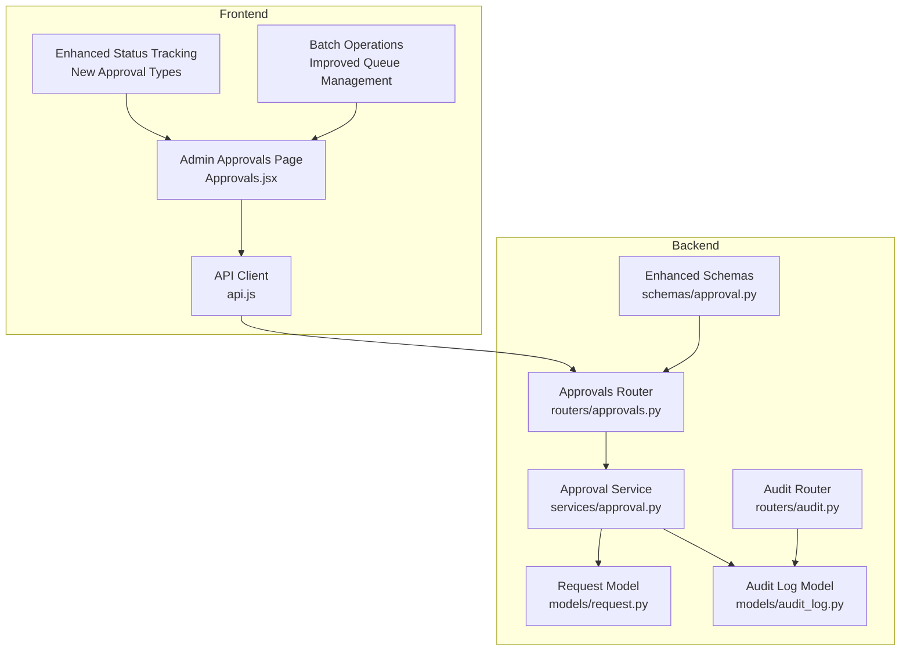
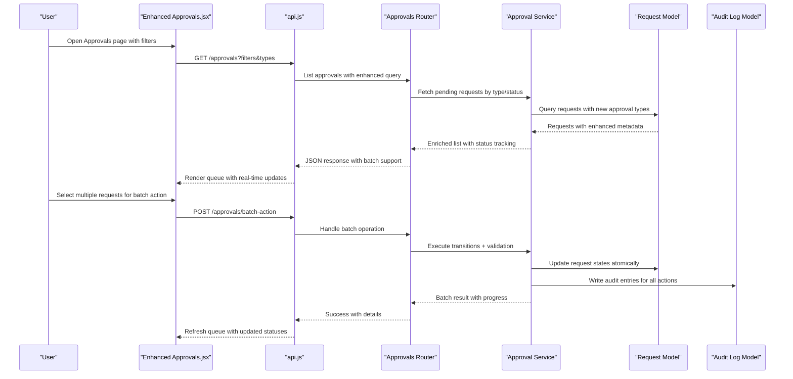
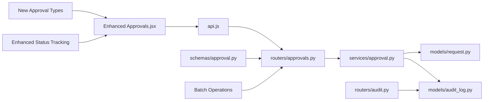

# Approval Workflow Management

<cite>
**Referenced Files in This Document**
- [Approvals.jsx](file://frontend/src/pages/admin/Approvals.jsx)
- [approvals.py](file://backend/app/routers/approvals.py)
- [approval_service.py](file://backend/app/services/approval.py)
- [approval_schema.py](file://backend/app/schemas/approval.py)
- [request_model.py](file://backend/app/models/request.py)
- [audit_log_model.py](file://backend/app/models/audit_log.py)
- [audit_router.py](file://backend/app/routers/audit.py)
- [api_client.js](file://frontend/src/services/api.js)
</cite>

## Update Summary
**Changes Made**
- Updated Approvals UI component documentation to reflect new approval types and enhanced status tracking
- Added documentation for improved batch operations functionality
- Enhanced queue management features with better filtering capabilities
- Updated workflow monitoring capabilities with real-time status updates
- Revised approval chain configuration examples based on new interface improvements

## Table of Contents
1. [Introduction](#introduction)
2. [Project Structure](#project-structure)
3. [Core Components](#core-components)
4. [Architecture Overview](#architecture-overview)
5. [Detailed Component Analysis](#detailed-component-analysis)
6. [Dependency Analysis](#dependency-analysis)
7. [Performance Considerations](#performance-considerations)
8. [Troubleshooting Guide](#troubleshooting-guide)
9. [Conclusion](#conclusion)
10. [Appendices](#appendices)

## Introduction
This document explains the approval workflow management interface and backend services that enable request review, approval/rejection workflows, escalation handling, and monitoring. It covers the Approvals component functionality, queue management, batch operations, notifications, audit logging, configuration of approval chains, complex scenarios, and performance monitoring guidance. The system has been significantly enhanced with new approval types, improved status tracking, and advanced batch operation capabilities.

## Project Structure
The approval workflow spans both frontend and backend layers:
- Frontend: Admin Approvals page for reviewing, approving, rejecting, escalating, and monitoring requests with enhanced UI capabilities.
- Backend: API routes, service logic, data schemas, and models for approvals, requests, and audit logs.

**Diagram sources**
- [Approvals.jsx](file://frontend/src/pages/admin/Approvals.jsx)
- [api_client.js](file://frontend/src/services/api.js)
- [approvals.py](file://backend/app/routers/approvals.py)
- [approval_service.py](file://backend/app/services/approval.py)
- [request_model.py](file://backend/app/models/request.py)
- [audit_log_model.py](file://backend/app/models/audit_log.py)
- [audit_router.py](file://backend/app/routers/audit.py)
- [approval_schema.py](file://backend/app/schemas/approval.py)

**Section sources**
- [Approvals.jsx](file://frontend/src/pages/admin/Approvals.jsx)
- [approvals.py](file://backend/app/routers/approvals.py)
- [approval_service.py](file://backend/app/services/approval.py)
- [approval_schema.py](file://backend/app/schemas/approval.py)
- [request_model.py](file://backend/app/models/request.py)
- [audit_log_model.py](file://backend/app/models/audit_log.py)
- [audit_router.py](file://backend/app/routers/audit.py)
- [api_client.js](file://frontend/src/services/api.js)

## Core Components
- **Enhanced Approvals UI (Admin)**: Displays pending requests with new approval types, supports advanced filtering, pagination, single/batch approve/reject, escalation, and real-time status updates.
- **Approvals API**: Endpoints to list, approve, reject, escalate, and monitor approvals; integrates with request and audit models with enhanced validation.
- **Approval Service**: Encapsulates business rules for transitions, chain evaluation, escalation, and side effects (notifications, audit) with improved error handling.
- **Data Models**: Request lifecycle states, approver assignments, and audit entries with extended status tracking.
- **Audit Logging**: Immutable records of decisions, escalations, and state changes with enhanced metadata.

Key responsibilities:
- **Advanced Queue Management**: Filter by status, priority, assignee, time in queue, and new approval type categories.
- **Enhanced Batch Operations**: Apply actions to multiple requests atomically with improved error handling and progress tracking.
- **Real-time Notifications**: Trigger alerts on new items, escalations, and final decisions with enhanced delivery mechanisms.
- **Comprehensive Audit Trail**: Record who did what and when with detailed context and correlation IDs.

**Updated** Enhanced with new approval types, improved status tracking, and advanced batch operation capabilities.

**Section sources**
- [Approvals.jsx](file://frontend/src/pages/admin/Approvals.jsx)
- [approvals.py](file://backend/app/routers/approvals.py)
- [approval_service.py](file://backend/app/services/approval.py)
- [approval_schema.py](file://backend/app/schemas/approval.py)
- [request_model.py](file://backend/app/models/request.py)
- [audit_log_model.py](file://backend/app/models/audit_log.py)
- [audit_router.py](file://backend/app/routers/audit.py)
- [api_client.js](file://frontend/src/services/api.js)

## Architecture Overview
End-to-end flow from UI to persistence and audit with enhanced processing:

**Diagram sources**
- [Approvals.jsx](file://frontend/src/pages/admin/Approvals.jsx)
- [api_client.js](file://frontend/src/services/api.js)
- [approvals.py](file://backend/app/routers/approvals.py)
- [approval_service.py](file://backend/app/services/approval.py)
- [request_model.py](file://backend/app/models/request.py)
- [audit_log_model.py](file://backend/app/models/audit_log.py)

## Detailed Component Analysis

### Enhanced Approvals UI (Admin)
Responsibilities:
- Display approval queue with advanced filters (status, priority, assignee, date range, approval types).
- Support single and batch actions (approve, reject, escalate) with progress indicators.
- Show request details and decision history via audit log integration with real-time updates.
- Provide refresh/polling or event-driven updates with enhanced user feedback.

Operational highlights:
- **New Approval Types**: Support for different request categories with specialized workflows.
- **Enhanced Status Tracking**: Visual indicators for SLA breaches, escalations, and approval stages.
- **Advanced Batch Operations**: Multi-select with confirmation dialogs and progress tracking.
- **Improved Queue Management**: Server-side filtering and pagination for large datasets.

**Updated** Significantly overhauled with new approval types, enhanced status tracking, and improved batch operation capabilities.

**Section sources**
- [Approvals.jsx](file://frontend/src/pages/admin/Approvals.jsx)
- [api_client.js](file://frontend/src/services/api.js)

### Approvals API (Router)
Responsibilities:
- Expose endpoints for listing approvals, performing actions (approve/reject/escalate), and retrieving audit trails.
- Validate inputs using Pydantic schemas with enhanced validation rules.
- Delegate business logic to the Approval Service with improved error handling.
- Return consistent error responses and status codes with detailed context.

Typical endpoints:
- List approvals with query parameters for filtering, pagination, and approval type selection.
- Action endpoint per request ID for approve/reject/escalate with enhanced validation.
- **New Bulk action endpoint** for batch operations with atomic transaction support.

**Updated** Enhanced with new bulk operation endpoints and improved validation.

**Section sources**
- [approvals.py](file://backend/app/routers/approvals.py)
- [approval_schema.py](file://backend/app/schemas/approval.py)

### Approval Service
Responsibilities:
- Implement approval chain evaluation and transitions with enhanced business rules.
- Enforce policy constraints (e.g., only current approver can act) with improved validation.
- Manage escalation rules (time-based or manual) with better threshold handling.
- Emit notifications and write audit entries with enhanced metadata.
- Coordinate database transactions for consistency with improved error recovery.

Key behaviors:
- Transition validation based on current state, user role, and approval type.
- Chain traversal for multi-level approvals with enhanced routing logic.
- Escalation triggers when thresholds are exceeded with automatic fallbacks.
- Idempotency guards for repeated actions with conflict resolution.

**Updated** Enhanced with improved business rule enforcement and better error handling.

**Section sources**
- [approval_service.py](file://backend/app/services/approval.py)
- [request_model.py](file://backend/app/models/request.py)
- [audit_log_model.py](file://backend/app/models/audit_log.py)

### Data Models
- **Enhanced Request model**: Tracks lifecycle states, assigned approvers, timestamps, metadata, chain steps, and new approval type classifications.
- **Audit log model**: Immutable record of decisions, escalations, and system events with actor identity, context, and correlation IDs.

Design notes:
- State machine semantics ensure valid transitions across all approval types.
- Indexes on frequently filtered fields (status, assignee, created_at, approval_type).
- Audit entries include comprehensive correlation IDs for full traceability.

**Updated** Extended with new approval type fields and enhanced metadata tracking.

**Section sources**
- [request_model.py](file://backend/app/models/request.py)
- [audit_log_model.py](file://backend/app/models/audit_log.py)

### Audit Logging
Responsibilities:
- Capture all approval-related events: creation, transitions, escalations, reassignments, and batch operations.
- Provide read-only access via an audit router for compliance and troubleshooting with enhanced search capabilities.

Access patterns:
- Append-only writes from service layer with transaction safety.
- Read endpoints with advanced filters (request ID, actor, event type, time window, approval type).

**Updated** Enhanced with batch operation tracking and improved search capabilities.

**Section sources**
- [audit_log_model.py](file://backend/app/models/audit_log.py)
- [audit_router.py](file://backend/app/routers/audit.py)

### Notification System Integration
Responsibilities:
- Send notifications on key events: new approvals, escalations, decisions, and batch completions.
- Integrate with external channels (email, chat, webhook) via pluggable adapters with retry logic.

Integration points:
- Service emits notification events after successful transitions and batch operations.
- Decoupled delivery via async tasks or message broker with enhanced reliability.

**Updated** Enhanced with batch completion notifications and improved delivery reliability.

**Section sources**
- [approval_service.py](file://backend/app/services/approval.py)

## Dependency Analysis
High-level dependencies between components with enhanced relationships:

**Diagram sources**
- [Approvals.jsx](file://frontend/src/pages/admin/Approvals.jsx)
- [api_client.js](file://frontend/src/services/api.js)
- [approvals.py](file://backend/app/routers/approvals.py)
- [approval_service.py](file://backend/app/services/approval.py)
- [request_model.py](file://backend/app/models/request.py)
- [audit_log_model.py](file://backend/app/models/audit_log.py)
- [audit_router.py](file://backend/app/routers/audit.py)
- [approval_schema.py](file://backend/app/schemas/approval.py)

**Section sources**
- [approvals.py](file://backend/app/routers/approvals.py)
- [approval_service.py](file://backend/app/services/approval.py)
- [request_model.py](file://backend/app/models/request.py)
- [audit_log_model.py](file://backend/app/models/audit_log.py)
- [audit_router.py](file://backend/app/routers/audit.py)
- [api_client.js](file://frontend/src/services/api.js)
- [Approvals.jsx](file://frontend/src/pages/admin/Approvals.jsx)
- [approval_schema.py](file://backend/app/schemas/approval.py)

## Performance Considerations
- Server-side pagination and filtering to reduce payload size with enhanced query optimization.
- Indexing on high-cardinality filter fields (status, assignee, created_at, approval_type).
- Avoid N+1 queries by eager loading related entities where needed with improved caching strategies.
- Use idempotent action endpoints to safely retry failed operations including batch operations.
- Cache hot lists (e.g., top-priority queue) with short TTLs and cache invalidation strategies.
- Offload notifications to background jobs to keep request latency low with retry policies.
- Monitor queue depth and processing times; set alerts for bottlenecks and batch operation performance.
- **New**: Optimize batch operations with chunked processing and progress tracking.

**Updated** Added considerations for batch operations and enhanced caching strategies.

## Troubleshooting Guide
Common issues and resolutions:
- Stale approvals: Ensure UI refreshes after actions; implement optimistic updates or polling with enhanced error handling.
- Permission errors: Verify current user is the assigned approver or has escalation rights with improved role validation.
- Duplicate actions: Confirm idempotency keys or guard against concurrent submissions including batch operations.
- Missing audit entries: Check service transaction boundaries and audit write paths with enhanced logging.
- Slow list queries: Review indexes and filter usage; avoid unindexed columns in WHERE clauses including new approval types.
- Notification failures: Inspect adapter logs and retry policies; verify credentials and endpoints with enhanced error reporting.
- **New**: Batch operation failures - check individual item status and partial success responses.
- **New**: Approval type mismatches - verify schema validation and type-specific business rules.

**Updated** Added troubleshooting guidance for new batch operations and approval types.

**Section sources**
- [approvals.py](file://backend/app/routers/approvals.py)
- [approval_service.py](file://backend/app/services/approval.py)
- [audit_router.py](file://backend/app/routers/audit.py)

## Conclusion
The approval workflow management interface provides a robust, auditable, and scalable approach to managing request approvals with significant enhancements. The separation of concerns across UI, API, service, and models enables clear extension points for complex chains, escalation policies, and notifications while maintaining strong auditability and performance characteristics. The recent overhaul introduces new approval types, enhanced status tracking, and improved batch operations that significantly improve the user experience and operational efficiency.

**Updated** Enhanced conclusion reflecting the significant improvements in approval types, status tracking, and batch operations.

## Appendices

### Configuring Approval Chains
- Define chain steps with roles and conditions supporting new approval types.
- Configure escalation rules (time-based thresholds and fallback approvers) with enhanced routing.
- Map users to roles and assignees dynamically at runtime with improved assignment logic.
- **New**: Configure approval type-specific workflows and conditional branching.

**Updated** Added configuration guidance for new approval types and enhanced routing.

### Handling Complex Scenarios
- Parallel approvals: Require all approvers to agree before proceeding with enhanced coordination.
- Conditional branching: Route to different approvers based on request attributes and approval types.
- Re-entry and rollback: Allow re-submission and preserve full audit trail with improved state management.
- **New**: Batch approval scenarios with mixed approval types and partial success handling.

**Updated** Added guidance for handling batch operations and mixed approval type scenarios.

### Monitoring Workflow Performance
- Track metrics: queue depth, average wait time, approval rate, escalation rate, and batch operation success rates.
- Set dashboards for SLA adherence and bottleneck detection with enhanced visualization.
- Alert on anomalies such as sudden spikes in pending items, long waits, and batch operation failures.
- **New**: Monitor approval type distribution and type-specific performance metrics.

**Updated** Added monitoring guidance for batch operations and approval type analytics.

### New Approval Types and Status Tracking
- **Enhanced Status Tracking**: Real-time status updates with visual indicators for approval stages.
- **New Approval Types**: Support for different request categories with specialized workflows.
- **Improved Queue Management**: Advanced filtering by approval type, status, and priority combinations.
- **Batch Operation Enhancements**: Multi-select with progress tracking and detailed success/failure reporting.

**New Section** Documentation for the significant interface overhaul and new capabilities.