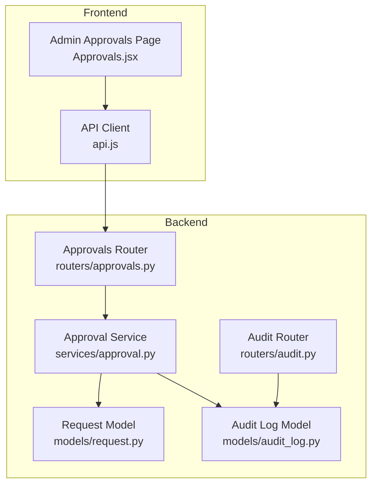
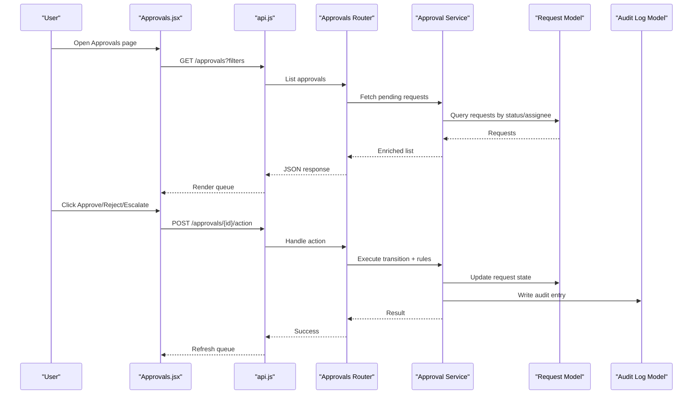
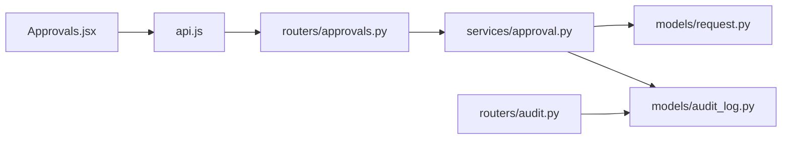

# Approval Workflow Management

<cite>
**Referenced Files in This Document**
- [Approvals.jsx](file://frontend/src/pages/admin/Approvals.jsx)
- [approvals.py](file://backend/app/routers/approvals.py)
- [approval_service.py](file://backend/app/services/approval.py)
- [approval_schema.py](file://backend/app/schemas/approval.py)
- [request_model.py](file://backend/app/models/request.py)
- [audit_log_model.py](file://backend/app/models/audit_log.py)
- [audit_router.py](file://backend/app/routers/audit.py)
- [api_client.js](file://frontend/src/services/api.js)
</cite>

## Table of Contents
1. [Introduction](#introduction)
2. [Project Structure](#project-structure)
3. [Core Components](#core-components)
4. [Architecture Overview](#architecture-overview)
5. [Detailed Component Analysis](#detailed-component-analysis)
6. [Dependency Analysis](#dependency-analysis)
7. [Performance Considerations](#performance-considerations)
8. [Troubleshooting Guide](#troubleshooting-guide)
9. [Conclusion](#conclusion)
10. [Appendices](#appendices)

## Introduction
This document explains the approval workflow management interface and backend services that enable request review, approval/rejection workflows, escalation handling, and monitoring. It covers the Approvals component functionality, queue management, batch operations, notifications, audit logging, configuration of approval chains, complex scenarios, and performance monitoring guidance.

## Project Structure
The approval workflow spans both frontend and backend layers:
- Frontend: Admin Approvals page for reviewing, approving, rejecting, escalating, and monitoring requests.
- Backend: API routes, service logic, data schemas, and models for approvals, requests, and audit logs.

**Diagram sources**
- [Approvals.jsx](file://frontend/src/pages/admin/Approvals.jsx)
- [api_client.js](file://frontend/src/services/api.js)
- [approvals.py](file://backend/app/routers/approvals.py)
- [approval_service.py](file://backend/app/services/approval.py)
- [request_model.py](file://backend/app/models/request.py)
- [audit_log_model.py](file://backend/app/models/audit_log.py)
- [audit_router.py](file://backend/app/routers/audit.py)

**Section sources**
- [Approvals.jsx](file://frontend/src/pages/admin/Approvals.jsx)
- [approvals.py](file://backend/app/routers/approvals.py)
- [approval_service.py](file://backend/app/services/approval.py)
- [approval_schema.py](file://backend/app/schemas/approval.py)
- [request_model.py](file://backend/app/models/request.py)
- [audit_log_model.py](file://backend/app/models/audit_log.py)
- [audit_router.py](file://backend/app/routers/audit.py)
- [api_client.js](file://frontend/src/services/api.js)

## Core Components
- Approvals UI (Admin): Displays pending requests, supports filtering, pagination, single/batch approve/reject, escalation, and real-time updates.
- Approvals API: Endpoints to list, approve, reject, escalate, and monitor approvals; integrates with request and audit models.
- Approval Service: Encapsulates business rules for transitions, chain evaluation, escalation, and side effects (notifications, audit).
- Data Models: Request lifecycle states, approver assignments, and audit entries.
- Audit Logging: Immutable records of decisions, escalations, and state changes.

Key responsibilities:
- Queue management: Filter by status, priority, assignee, time in queue.
- Batch operations: Apply actions to multiple requests atomically where supported.
- Notifications: Trigger alerts on new items, escalations, and final decisions.
- Audit trail: Record who did what and when.

**Section sources**
- [Approvals.jsx](file://frontend/src/pages/admin/Approvals.jsx)
- [approvals.py](file://backend/app/routers/approvals.py)
- [approval_service.py](file://backend/app/services/approval.py)
- [approval_schema.py](file://backend/app/schemas/approval.py)
- [request_model.py](file://backend/app/models/request.py)
- [audit_log_model.py](file://backend/app/models/audit_log.py)
- [audit_router.py](file://backend/app/routers/audit.py)
- [api_client.js](file://frontend/src/services/api.js)

## Architecture Overview
End-to-end flow from UI to persistence and audit:

**Diagram sources**
- [Approvals.jsx](file://frontend/src/pages/admin/Approvals.jsx)
- [api_client.js](file://frontend/src/services/api.js)
- [approvals.py](file://backend/app/routers/approvals.py)
- [approval_service.py](file://backend/app/services/approval.py)
- [request_model.py](file://backend/app/models/request.py)
- [audit_log_model.py](file://backend/app/models/audit_log.py)

## Detailed Component Analysis

### Approvals UI (Admin)
Responsibilities:
- Display approval queue with filters (status, priority, assignee, date range).
- Support single and batch actions (approve, reject, escalate).
- Show request details and decision history via audit log integration.
- Provide refresh/polling or event-driven updates.

Operational highlights:
- Pagination and server-side filtering to handle large queues.
- Confirmation dialogs for destructive actions.
- Visual indicators for SLA breaches and escalations.

**Section sources**
- [Approvals.jsx](file://frontend/src/pages/admin/Approvals.jsx)
- [api_client.js](file://frontend/src/services/api.js)

### Approvals API (Router)
Responsibilities:
- Expose endpoints for listing approvals, performing actions (approve/reject/escalate), and retrieving audit trails.
- Validate inputs using Pydantic schemas.
- Delegate business logic to the Approval Service.
- Return consistent error responses and status codes.

Typical endpoints:
- List approvals with query parameters for filtering and pagination.
- Action endpoint per request ID for approve/reject/escalate.
- Optional bulk action endpoint for batch operations.

**Section sources**
- [approvals.py](file://backend/app/routers/approvals.py)
- [approval_schema.py](file://backend/app/schemas/approval.py)

### Approval Service
Responsibilities:
- Implement approval chain evaluation and transitions.
- Enforce policy constraints (e.g., only current approver can act).
- Manage escalation rules (time-based or manual).
- Emit notifications and write audit entries.
- Coordinate database transactions for consistency.

Key behaviors:
- Transition validation based on current state and user role.
- Chain traversal for multi-level approvals.
- Escalation triggers when thresholds are exceeded.
- Idempotency guards for repeated actions.

**Section sources**
- [approval_service.py](file://backend/app/services/approval.py)
- [request_model.py](file://backend/app/models/request.py)
- [audit_log_model.py](file://backend/app/models/audit_log.py)

### Data Models
- Request model: Tracks lifecycle states, assigned approvers, timestamps, metadata, and chain steps.
- Audit log model: Immutable record of decisions, escalations, and system events with actor identity and context.

Design notes:
- State machine semantics ensure valid transitions.
- Indexes on frequently filtered fields (status, assignee, created_at).
- Audit entries include correlation IDs for traceability.

**Section sources**
- [request_model.py](file://backend/app/models/request.py)
- [audit_log_model.py](file://backend/app/models/audit_log.py)

### Audit Logging
Responsibilities:
- Capture all approval-related events: creation, transitions, escalations, reassignments.
- Provide read-only access via an audit router for compliance and troubleshooting.

Access patterns:
- Append-only writes from service layer.
- Read endpoints with filters (request ID, actor, event type, time window).

**Section sources**
- [audit_log_model.py](file://backend/app/models/audit_log.py)
- [audit_router.py](file://backend/app/routers/audit.py)

### Notification System Integration
Responsibilities:
- Send notifications on key events: new approvals, escalations, decisions.
- Integrate with external channels (email, chat, webhook) via pluggable adapters.

Integration points:
- Service emits notification events after successful transitions.
- Decoupled delivery via async tasks or message broker (if configured).

**Section sources**
- [approval_service.py](file://backend/app/services/approval.py)

## Dependency Analysis
High-level dependencies between components:

**Diagram sources**
- [Approvals.jsx](file://frontend/src/pages/admin/Approvals.jsx)
- [api_client.js](file://frontend/src/services/api.js)
- [approvals.py](file://backend/app/routers/approvals.py)
- [approval_service.py](file://backend/app/services/approval.py)
- [request_model.py](file://backend/app/models/request.py)
- [audit_log_model.py](file://backend/app/models/audit_log.py)
- [audit_router.py](file://backend/app/routers/audit.py)

**Section sources**
- [approvals.py](file://backend/app/routers/approvals.py)
- [approval_service.py](file://backend/app/services/approval.py)
- [request_model.py](file://backend/app/models/request.py)
- [audit_log_model.py](file://backend/app/models/audit_log.py)
- [audit_router.py](file://backend/app/routers/audit.py)
- [api_client.js](file://frontend/src/services/api.js)
- [Approvals.jsx](file://frontend/src/pages/admin/Approvals.jsx)

## Performance Considerations
- Server-side pagination and filtering to reduce payload size.
- Indexing on high-cardinality filter fields (status, assignee, created_at).
- Avoid N+1 queries by eager loading related entities where needed.
- Use idempotent action endpoints to safely retry failed operations.
- Cache hot lists (e.g., top-priority queue) with short TTLs if appropriate.
- Offload notifications to background jobs to keep request latency low.
- Monitor queue depth and processing times; set alerts for bottlenecks.

[No sources needed since this section provides general guidance]

## Troubleshooting Guide
Common issues and resolutions:
- Stale approvals: Ensure UI refreshes after actions; implement optimistic updates or polling.
- Permission errors: Verify current user is the assigned approver or has escalation rights.
- Duplicate actions: Confirm idempotency keys or guard against concurrent submissions.
- Missing audit entries: Check service transaction boundaries and audit write paths.
- Slow list queries: Review indexes and filter usage; avoid unindexed columns in WHERE clauses.
- Notification failures: Inspect adapter logs and retry policies; verify credentials and endpoints.

**Section sources**
- [approvals.py](file://backend/app/routers/approvals.py)
- [approval_service.py](file://backend/app/services/approval.py)
- [audit_router.py](file://backend/app/routers/audit.py)

## Conclusion
The approval workflow management interface provides a robust, auditable, and scalable approach to managing request approvals. The separation of concerns across UI, API, service, and models enables clear extension points for complex chains, escalation policies, and notifications while maintaining strong auditability and performance characteristics.

[No sources needed since this section summarizes without analyzing specific files]

## Appendices

### Configuring Approval Chains
- Define chain steps with roles and conditions.
- Configure escalation rules (time-based thresholds and fallback approvers).
- Map users to roles and assignees dynamically at runtime.

[No sources needed since this section provides general guidance]

### Handling Complex Scenarios
- Parallel approvals: Require all approvers to agree before proceeding.
- Conditional branching: Route to different approvers based on request attributes.
- Re-entry and rollback: Allow re-submission and preserve full audit trail.

[No sources needed since this section provides general guidance]

### Monitoring Workflow Performance
- Track metrics: queue depth, average wait time, approval rate, escalation rate.
- Set dashboards for SLA adherence and bottleneck detection.
- Alert on anomalies such as sudden spikes in pending items or long waits.

[No sources needed since this section provides general guidance]