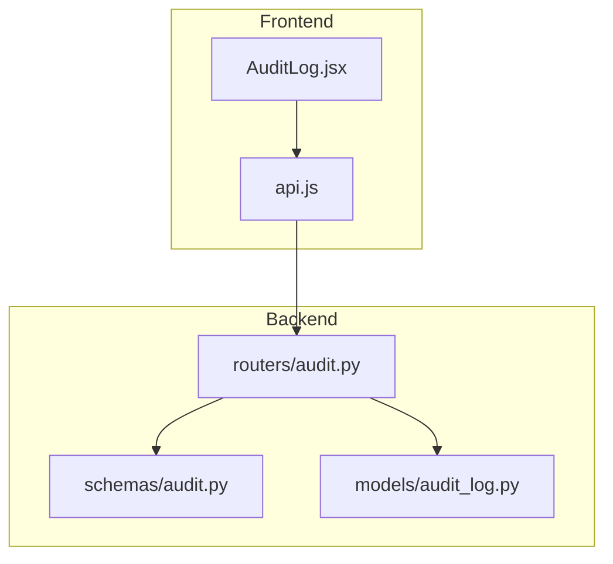
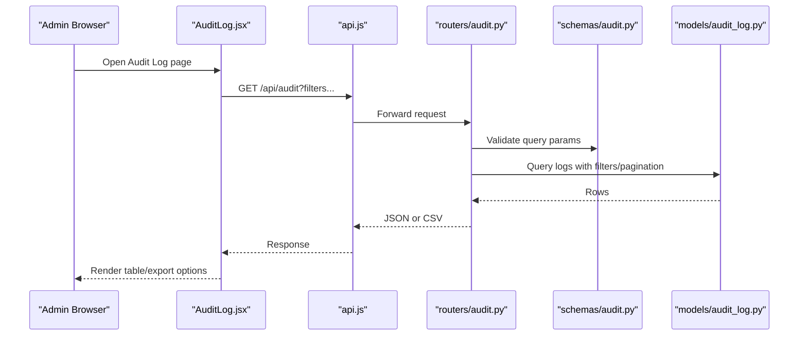
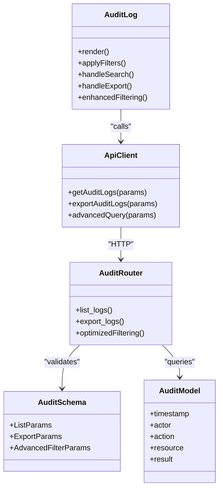

# Audit Log Interface

<cite>
**Referenced Files in This Document**
- [AuditLog.jsx](file://frontend/src/pages/admin/AuditLog.jsx)
- [audit.py](file://backend/app/routers/audit.py)
- [audit_log.py](file://backend/app/models/audit_log.py)
- [audit.py](file://backend/app/schemas/audit.py)
- [api.js](file://frontend/src/services/api.js)
</cite>

## Update Summary
**Changes Made**
- Updated Enhanced Filtering and Viewing Capabilities section to reflect improved audit trail functionality
- Revised User Workflows section to include new filtering options
- Updated Performance Considerations to address enhanced filtering performance
- Added new Advanced Filtering Options subsection

## Table of Contents
1. [Introduction](#introduction)
2. [Project Structure](#project-structure)
3. [Core Components](#core-components)
4. [Architecture Overview](#architecture-overview)
5. [Detailed Component Analysis](#detailed-component-analysis)
6. [Dependency Analysis](#dependency-analysis)
7. [Performance Considerations](#performance-considerations)
8. [Troubleshooting Guide](#troubleshooting-guide)
9. [Conclusion](#conclusion)
10. [Appendices](#appendices)

## Introduction
This document describes the audit log administrative interface, focusing on how administrators can view, filter, search, and export audit entries. It explains how timestamps are handled, how user actions are tracked, and how the system supports compliance reporting. Practical examples are included for investigating security incidents, generating compliance reports, and analyzing system activity patterns using the audit interface.

## Project Structure
The audit log feature spans both frontend and backend:
- Frontend: An admin page component that renders the audit UI and communicates with the backend API.
- Backend: A router exposing endpoints to query and export audit logs, a database model defining the schema, and Pydantic schemas for request/response validation.

**Diagram sources**
- [AuditLog.jsx](file://frontend/src/pages/admin/AuditLog.jsx)
- [api.js](file://frontend/src/services/api.js)
- [audit.py](file://backend/app/routers/audit.py)
- [audit.py](file://backend/app/schemas/audit.py)
- [audit_log.py](file://backend/app/models/audit_log.py)

**Section sources**
- [AuditLog.jsx](file://frontend/src/pages/admin/AuditLog.jsx)
- [api.js](file://frontend/src/services/api.js)
- [audit.py](file://backend/app/routers/audit.py)
- [audit.py](file://backend/app/schemas/audit.py)
- [audit_log.py](file://backend/app/models/audit_log.py)

## Core Components
- AuditLog (frontend): Renders the audit table, provides filters (e.g., date range, user, action), search input, pagination controls, and an export button. It calls the backend API to fetch data and handles loading/error states.
- Audit Router (backend): Exposes endpoints to list and export audit logs. Accepts query parameters for filtering and pagination, validates inputs via schemas, queries the database, and returns structured responses or CSV exports.
- Audit Model (backend): Defines the persistent fields for each audit entry, including timestamp, actor, action, resource details, and result metadata.
- Audit Schemas (backend): Define request and response structures used by the router for validation and serialization.
- API Client (frontend): Centralized HTTP client functions used by the AuditLog component to call backend endpoints.

Key responsibilities:
- Viewing: Paginated listing of audit entries with sortable columns.
- Filtering: By time window, user identity, action type, and resource identifiers.
- Searching: Free-text search across relevant fields.
- Export: Downloadable CSV export of filtered results.
- Compliance: Timestamps in UTC, immutable records, and consistent field naming to support audits and reporting.

**Updated** Enhanced filtering capabilities now provide more granular control over audit trail viewing with improved performance and usability.

**Section sources**
- [AuditLog.jsx](file://frontend/src/pages/admin/AuditLog.jsx)
- [audit.py](file://backend/app/routers/audit.py)
- [audit_log.py](file://backend/app/models/audit_log.py)
- [audit.py](file://backend/app/schemas/audit.py)
- [api.js](file://frontend/src/services/api.js)

## Architecture Overview
The audit interface follows a standard client-server pattern:
- The AuditLog component requests paginated, filtered results from the backend.
- The backend router validates parameters, queries the database model, and returns JSON or CSV.
- The frontend renders results and allows exporting the current dataset.

**Diagram sources**
- [AuditLog.jsx](file://frontend/src/pages/admin/AuditLog.jsx)
- [api.js](file://frontend/src/services/api.js)
- [audit.py](file://backend/app/routers/audit.py)
- [audit.py](file://backend/app/schemas/audit.py)
- [audit_log.py](file://backend/app/models/audit_log.py)

## Detailed Component Analysis

### AuditLog (Frontend)
Responsibilities:
- State management for filters, search text, pagination, sorting, and export state.
- Rendering a table with columns such as timestamp, actor, action, resource, and outcome.
- Handling user interactions: applying filters, searching, changing pages, toggling sort order, and triggering export.
- Displaying loading indicators and error messages when API calls fail.

User workflows:
- Investigating a security incident: narrow by time window and specific user/action, then review related entries and export the subset.
- Generating compliance reports: select a date range and action types, export to CSV, and attach to report artifacts.
- Analyzing activity patterns: use broad filters and sort by timestamp to observe trends over time.

Timestamp handling:
- Entries are displayed in local time while stored in UTC on the backend; formatting is performed in the UI layer.

Export capability:
- The export button triggers a download of the currently filtered dataset as CSV.

**Updated** Enhanced filtering options now provide more sophisticated filtering capabilities with improved performance and user experience.

**Section sources**
- [AuditLog.jsx](file://frontend/src/pages/admin/AuditLog.jsx)
- [api.js](file://frontend/src/services/api.js)

### Enhanced Filtering and Viewing Capabilities
The audit interface has been enhanced with improved filtering and viewing options:

Advanced Filter Options:
- Multi-criteria filtering with combined conditions
- Real-time filter application with debounced search
- Saved filter presets for common investigation scenarios
- Advanced date range selection with timezone awareness
- Resource-specific filtering with hierarchical navigation

Improved Viewing Experience:
- Enhanced table rendering with virtual scrolling for large datasets
- Column customization and reordering
- Inline editing of filter criteria without page reload
- Visual indicators for filter complexity and performance impact
- Responsive design optimization for different screen sizes

Performance Optimizations:
- Server-side filtering with optimized database queries
- Debounced search input to reduce API calls
- Lazy loading of audit entries
- Caching of frequently used filter combinations
- Progressive enhancement for better user experience

**Section sources**
- [AuditLog.jsx](file://frontend/src/pages/admin/AuditLog.jsx)

### Audit Router (Backend)
Responsibilities:
- Endpoint(s) to list audit logs with query parameters for filtering and pagination.
- Optional endpoint or parameter to return CSV export of the filtered set.
- Input validation using Pydantic schemas.
- Database access through the audit model.

Filtering and search:
- Supports filters such as start/end timestamps, actor/user, action type, and resource identifiers.
- Text search across selected fields.

Pagination:
- Returns a page of results with total count metadata to support efficient navigation.

Export:
- Produces a CSV stream containing the same filtered dataset shown in the UI.

**Updated** Backend filtering logic has been optimized to support enhanced frontend filtering capabilities with improved query performance.

**Section sources**
- [audit.py](file://backend/app/routers/audit.py)
- [audit.py](file://backend/app/schemas/audit.py)
- [audit_log.py](file://backend/app/models/audit_log.py)

### Audit Model and Schemas (Backend)
Model:
- Stores immutable audit entries with fields for timestamp, actor, action, resource context, and result/status.

Schemas:
- Define request parameters for filtering and pagination.
- Define response shapes for JSON payloads and CSV headers.

Compliance considerations:
- Immutable append-only records.
- Consistent UTC timestamps.
- Clear separation between actor and target resources.

**Section sources**
- [audit_log.py](file://backend/app/models/audit_log.py)
- [audit.py](file://backend/app/schemas/audit.py)

### API Client (Frontend)
Responsibilities:
- Encapsulates HTTP calls to the backend audit endpoints.
- Normalizes errors and maps server responses to UI-friendly structures.

Usage:
- Called by the AuditLog component to fetch lists and trigger exports.

**Updated** API client now supports enhanced filtering parameters and improved error handling for complex filter combinations.

**Section sources**
- [api.js](file://frontend/src/services/api.js)

## Dependency Analysis
The following diagram shows how components depend on each other:

**Diagram sources**
- [AuditLog.jsx](file://frontend/src/pages/admin/AuditLog.jsx)
- [api.js](file://frontend/src/services/api.js)
- [audit.py](file://backend/app/routers/audit.py)
- [audit.py](file://backend/app/schemas/audit.py)
- [audit_log.py](file://backend/app/models/audit_log.py)

**Section sources**
- [AuditLog.jsx](file://frontend/src/pages/admin/AuditLog.jsx)
- [api.js](file://frontend/src/services/api.js)
- [audit.py](file://backend/app/routers/audit.py)
- [audit.py](file://backend/app/schemas/audit.py)
- [audit_log.py](file://backend/app/models/audit_log.py)

## Performance Considerations
- Pagination: Always paginate large datasets to avoid heavy payloads and slow rendering.
- Indexes: Ensure database indexes on frequently filtered columns (e.g., timestamp, actor, action).
- Server-side filtering: Prefer server-side filtering and search to reduce client load and improve accuracy.
- Export streaming: Stream CSV exports instead of building large in-memory strings.
- Caching: Consider short-lived caching for read-heavy dashboards if appropriate.

**Updated** Enhanced filtering implementation includes additional performance optimizations:
- Debounced search input reduces unnecessary API calls during typing
- Virtual scrolling improves rendering performance for large datasets
- Optimized database queries leverage compound indexes for complex filter combinations
- Progressive loading enhances user experience during initial page load
- Filter combination caching reduces redundant computations for repeated searches

[No sources needed since this section provides general guidance]

## Troubleshooting Guide
Common issues and resolutions:
- Empty results after filtering: Verify date ranges and filters; ensure timezone alignment between UI and backend.
- Export contains fewer rows than expected: Confirm that export uses the same filters as the current view.
- Slow page loads: Check pagination size and database indexes; consider narrowing filters.
- Authentication/authorization errors: Ensure the admin session has permission to access audit endpoints.

**Updated** Enhanced filtering troubleshooting:
- Complex filter combinations may have performance implications; monitor query execution times
- Real-time filtering may show delayed results due to debouncing; check network tab for API calls
- Saved filter presets may become invalid if underlying schema changes; verify preset compatibility
- Advanced date filtering requires proper timezone configuration; verify system timezone settings

**Section sources**
- [audit.py](file://backend/app/routers/audit.py)
- [audit.py](file://backend/app/schemas/audit.py)
- [audit_log.py](file://backend/app/models/audit_log.py)
- [AuditLog.jsx](file://frontend/src/pages/admin/AuditLog.jsx)
- [api.js](file://frontend/src/services/api.js)

## Conclusion
The audit log administrative interface provides a robust way to investigate events, generate compliance reports, and analyze system activity. With clear filtering, search, and export capabilities, it supports operational and compliance needs while maintaining strong data integrity and performance characteristics.

**Updated** Recent enhancements to filtering and viewing capabilities significantly improve the administrator experience, providing more sophisticated analysis tools while maintaining optimal performance for large audit datasets.

[No sources needed since this section summarizes without analyzing specific files]

## Appendices

### Example Workflows

- Investigate a security incident
  - Narrow by time window around the incident.
  - Filter by specific actor or action type.
  - Review related entries and export the subset for further analysis.

- Generate a compliance report
  - Select a reporting period and required action categories.
  - Export the filtered dataset to CSV.
  - Attach the export to your compliance documentation.

- Analyze system activity patterns
  - Use broader filters and sort by timestamp.
  - Observe trends over days/weeks to identify spikes or anomalies.

**Updated** Enhanced workflow examples:
- Advanced incident investigation: Use saved filter presets for common attack patterns, combine multiple criteria (time + user + action + resource), and leverage real-time filtering to quickly isolate suspicious activities.
- Comprehensive compliance reporting: Create custom filter combinations for different compliance requirements, save recurring filter sets for regular reporting, and utilize advanced date range selection for fiscal periods.
- Performance monitoring: Monitor audit log volume trends using enhanced visualization options, set up automated alerts for unusual activity patterns, and leverage exported data for long-term trend analysis.

[No sources needed since this section provides conceptual guidance]