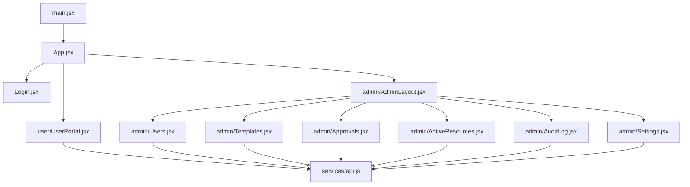
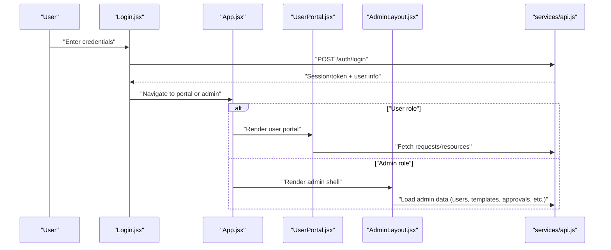
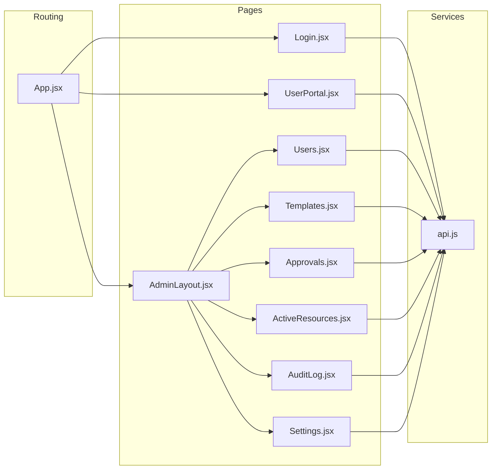

# Page Components & Routing

<cite>
**Referenced Files in This Document**
- [App.jsx](file://frontend/src/App.jsx)
- [main.jsx](file://frontend/src/main.jsx)
- [Login.jsx](file://frontend/src/pages/Login.jsx)
- [UserPortal.jsx](file://frontend/src/pages/user/UserPortal.jsx)
- [AdminLayout.jsx](file://frontend/src/pages/admin/AdminLayout.jsx)
- [Users.jsx](file://frontend/src/pages/admin/Users.jsx)
- [Templates.jsx](file://frontend/src/pages/admin/Templates.jsx)
- [Approvals.jsx](file://frontend/src/pages/admin/Approvals.jsx)
- [ActiveResources.jsx](file://frontend/src/pages/admin/ActiveResources.jsx)
- [AuditLog.jsx](file://frontend/src/pages/admin/AuditLog.jsx)
- [Settings.jsx](file://frontend/src/pages/admin/Settings.jsx)
- [api.js](file://frontend/src/services/api.js)
</cite>

## Table of Contents
1. [Introduction](#introduction)
2. [Project Structure](#project-structure)
3. [Core Components](#core-components)
4. [Architecture Overview](#architecture-overview)
5. [Detailed Component Analysis](#detailed-component-analysis)
6. [Dependency Analysis](#dependency-analysis)
7. [Performance Considerations](#performance-considerations)
8. [Troubleshooting Guide](#troubleshooting-guide)
9. [Conclusion](#conclusion)

## Introduction
This document describes the frontend page components and routing structure for the ECS Request System. It covers:
- User portal interface for resource management
- Admin panel layout and navigation
- Administrative pages: user management, template administration, approval workflows, active resource monitoring, audit logging, and system settings
- Examples of page component architecture, data fetching patterns, state management within pages, and navigation between sections
- Role-based access control implementation and conditional rendering based on user permissions

The goal is to provide a clear mental model of how pages are organized, how they fetch data, and how access control gates admin features.

## Project Structure
The frontend is a React application with a feature-oriented folder layout:
- Entry points: main.jsx bootstraps the app; App.jsx defines routes and global guards
- Pages:
  - Login: authentication entry point
  - user: UserPortal for end users to manage resources
  - admin: AdminLayout plus administrative pages (Users, Templates, Approvals, ActiveResources, AuditLog, Settings)
- Services: api.js centralizes HTTP calls to the backend

**Diagram sources**
- [main.jsx](file://frontend/src/main.jsx)
- [App.jsx](file://frontend/src/App.jsx)
- [Login.jsx](file://frontend/src/pages/Login.jsx)
- [UserPortal.jsx](file://frontend/src/pages/user/UserPortal.jsx)
- [AdminLayout.jsx](file://frontend/src/pages/admin/AdminLayout.jsx)
- [Users.jsx](file://frontend/src/pages/admin/Users.jsx)
- [Templates.jsx](file://frontend/src/pages/admin/Templates.jsx)
- [Approvals.jsx](file://frontend/src/pages/admin/Approvals.jsx)
- [ActiveResources.jsx](file://frontend/src/pages/admin/ActiveResources.jsx)
- [AuditLog.jsx](file://frontend/src/pages/admin/AuditLog.jsx)
- [Settings.jsx](file://frontend/src/pages/admin/Settings.jsx)
- [api.js](file://frontend/src/services/api.js)

**Section sources**
- [main.jsx](file://frontend/src/main.jsx)
- [App.jsx](file://frontend/src/App.jsx)

## Core Components
- Application bootstrap and routing root
  - main.jsx initializes the React application and mounts it into the DOM
  - App.jsx configures routes, applies role-based guards, and renders either the user portal or the admin panel depending on the current route and user context
- Authentication entry
  - Login.jsx handles sign-in flows and redirects to the appropriate portal after successful authentication
- User portal
  - UserPortal.jsx provides resource request and management capabilities for non-admin users
- Admin shell
  - AdminLayout.jsx provides the admin shell with navigation and guards for admin-only routes
  - Individual admin pages implement their own data fetching and state management while relying on shared services

Key responsibilities:
- Centralized API client usage via api.js
- Conditional rendering based on roles and authentication state
- Consistent navigation patterns across user and admin areas

**Section sources**
- [App.jsx](file://frontend/src/App.jsx)
- [Login.jsx](file://frontend/src/pages/Login.jsx)
- [UserPortal.jsx](file://frontend/src/pages/user/UserPortal.jsx)
- [AdminLayout.jsx](file://frontend/src/pages/admin/AdminLayout.jsx)

## Architecture Overview
High-level flow from login to authenticated views and admin navigation:

**Diagram sources**
- [Login.jsx](file://frontend/src/pages/Login.jsx)
- [App.jsx](file://frontend/src/App.jsx)
- [UserPortal.jsx](file://frontend/src/pages/user/UserPortal.jsx)
- [AdminLayout.jsx](file://frontend/src/pages/admin/AdminLayout.jsx)
- [api.js](file://frontend/src/services/api.js)

## Detailed Component Analysis

### App.jsx — Routing Root and Guards
Responsibilities:
- Define top-level routes for login, user portal, and admin area
- Apply role-based guards to restrict access to admin routes
- Persist and read authentication state to determine default landing page

Navigation patterns:
- Redirects after login based on user role
- Protected admin routes that require an admin role

Access control:
- Guards check user role before rendering admin pages
- Unauthenticated users are redirected to login

State management:
- Uses local state or context to track authentication and role
- Persists session information to avoid repeated logins

Data fetching:
- Minimal; mostly delegates to child components and services

Error handling:
- Redirects on unauthorized access
- Displays generic errors when auth checks fail

**Section sources**
- [App.jsx](file://frontend/src/App.jsx)

### Login.jsx — Authentication Entry
Responsibilities:
- Collect credentials and submit to the backend via api.js
- On success, store session and navigate to the appropriate portal
- On failure, show validation or server errors

Data fetching pattern:
- POST to authentication endpoint
- Handle response and set local auth state

State management:
- Local form state and error messages
- Navigation state after successful login

Conditional rendering:
- Shows loading indicators during submission
- Renders error banners for invalid credentials

**Section sources**
- [Login.jsx](file://frontend/src/pages/Login.jsx)
- [api.js](file://frontend/src/services/api.js)

### AdminLayout.jsx — Admin Shell and Navigation
Responsibilities:
- Provide consistent header/sidebar navigation for admin pages
- Enforce admin-only access at the layout level
- Render nested admin routes

Navigation patterns:
- Links to Users, Templates, Approvals, Active Resources, Audit Log, and Settings
- Highlights the active section

Access control:
- Guards prevent non-admin users from accessing any admin subpage
- Redirects unauthorized users back to the user portal or login

State management:
- Tracks active route for highlighting
- May hold small UI state (e.g., collapsed sidebar)

Data fetching:
- Delegates to individual admin pages

**Section sources**
- [AdminLayout.jsx](file://frontend/src/pages/admin/AdminLayout.jsx)

### Users.jsx — User Management
Responsibilities:
- List, create, update, and delete users
- Display user details and actions based on permissions

Data fetching patterns:
- GET list of users
- POST/PATCH/DELETE for mutations
- Error handling for network and validation failures

State management:
- Local state for list, filters, and editing forms
- Optimistic updates where appropriate

Access control:
- Only visible under admin routes guarded by AdminLayout

Examples of behavior:
- Search/filter users
- Toggle roles or status
- Bulk actions if supported

**Section sources**
- [Users.jsx](file://frontend/src/pages/admin/Users.jsx)
- [api.js](file://frontend/src/services/api.js)

### Templates.jsx — Template Administration
Responsibilities:
- Manage resource templates used for provisioning
- CRUD operations for templates

Data fetching patterns:
- GET templates
- POST/PATCH/DELETE for changes
- Validation feedback for required fields

State management:
- Form state for creating/editing templates
- Loading and error states

Access control:
- Admin-only view

**Section sources**
- [Templates.jsx](file://frontend/src/pages/admin/Templates.jsx)
- [api.js](file://frontend/src/services/api.js)

### Approvals.jsx — Approval Workflows
Responsibilities:
- View pending requests and approve/reject them
- Show request details and history

Data fetching patterns:
- GET pending approvals
- PATCH/POST to approve or reject
- Refresh lists after actions

State management:
- Pending items list
- Modal or inline confirmation for actions
- Success/error notifications

Access control:
- Admin-only view

**Section sources**
- [Approvals.jsx](file://frontend/src/pages/admin/Approvals.jsx)
- [api.js](file://frontend/src/services/api.js)

### ActiveResources.jsx — Active Resource Monitoring
Responsibilities:
- Monitor currently active resources
- Provide refresh and filtering options

Data fetching patterns:
- Polling or manual refresh to keep data current
- GET active resources

State management:
- Local cache of active resources
- Loading and error states

Access control:
- Admin-only view

**Section sources**
- [ActiveResources.jsx](file://frontend/src/pages/admin/ActiveResources.jsx)
- [api.js](file://frontend/src/services/api.js)

### AuditLog.jsx — Audit Logging
Responsibilities:
- Browse audit events with filters (time range, actor, action)
- Paginate and export if supported

Data fetching patterns:
- GET audit logs with query parameters
- Pagination support

State management:
- Filters and pagination state
- Loading and error states

Access control:
- Admin-only view

**Section sources**
- [AuditLog.jsx](file://frontend/src/pages/admin/AuditLog.jsx)
- [api.js](file://frontend/src/services/api.js)

### Settings.jsx — System Settings
Responsibilities:
- View and update system configuration
- Save changes with validation feedback

Data fetching patterns:
- GET current settings
- PATCH/PUT to update settings

State management:
- Form state bound to settings
- Dirty tracking and save confirmation

Access control:
- Admin-only view

**Section sources**
- [Settings.jsx](file://frontend/src/pages/admin/Settings.jsx)
- [api.js](file://frontend/src/services/api.js)

### UserPortal.jsx — User Portal for Resource Management
Responsibilities:
- Allow users to request resources using available templates
- Track personal requests and statuses
- Provide basic self-service actions

Data fetching patterns:
- GET templates for selection
- POST new requests
- GET user’s requests and status

State management:
- Local form state for requests
- Status indicators and error messages

Access control:
- Visible only to non-admin users
- Redirects admin users away from this portal

**Section sources**
- [UserPortal.jsx](file://frontend/src/pages/user/UserPortal.jsx)
- [api.js](file://frontend/src/services/api.js)

### api.js — Centralized API Client
Responsibilities:
- Encapsulate HTTP calls to the backend
- Attach authentication headers
- Normalize responses and handle common errors

Patterns:
- Typed functions per domain (auth, users, templates, approvals, active resources, audit, settings)
- Centralized error handling and retry strategies if implemented

Integration points:
- Used by all pages for data fetching and mutations

**Section sources**
- [api.js](file://frontend/src/services/api.js)

## Dependency Analysis
Page-to-service dependencies and navigation relationships:

**Diagram sources**
- [App.jsx](file://frontend/src/App.jsx)
- [Login.jsx](file://frontend/src/pages/Login.jsx)
- [UserPortal.jsx](file://frontend/src/pages/user/UserPortal.jsx)
- [AdminLayout.jsx](file://frontend/src/pages/admin/AdminLayout.jsx)
- [Users.jsx](file://frontend/src/pages/admin/Users.jsx)
- [Templates.jsx](file://frontend/src/pages/admin/Templates.jsx)
- [Approvals.jsx](file://frontend/src/pages/admin/Approvals.jsx)
- [ActiveResources.jsx](file://frontend/src/pages/admin/ActiveResources.jsx)
- [AuditLog.jsx](file://frontend/src/pages/admin/AuditLog.jsx)
- [Settings.jsx](file://frontend/src/pages/admin/Settings.jsx)
- [api.js](file://frontend/src/services/api.js)

**Section sources**
- [App.jsx](file://frontend/src/App.jsx)
- [api.js](file://frontend/src/services/api.js)

## Performance Considerations
- Prefer lazy-loading admin pages to reduce initial bundle size
- Implement pagination and server-side filtering for large datasets (audit logs, active resources)
- Debounce search inputs and filter changes
- Use optimistic UI updates for low-risk actions (approvals) with rollback on failure
- Cache frequently accessed read-only data (templates) locally with stale-while-revalidate patterns
- Avoid unnecessary re-renders by memoizing expensive computations and stable references

[No sources needed since this section provides general guidance]

## Troubleshooting Guide
Common issues and resolutions:
- Unauthorized redirects: Ensure authentication state is persisted and guards are correctly checking roles
- Network errors: Verify api.js error handling and token attachment; check backend availability
- Stale data: Refresh mechanisms should be explicit; consider polling intervals for active resources
- Form validation: Validate both client-side and server-side; display actionable error messages
- Navigation loops: Confirm route guards do not redirect unauthenticated users to protected routes without first authenticating

**Section sources**
- [App.jsx](file://frontend/src/App.jsx)
- [api.js](file://frontend/src/services/api.js)

## Conclusion
The frontend organizes user and admin experiences through dedicated pages and a shared API client. Role-based guards in the routing layer ensure that only authorized users can access admin functionality. Each page encapsulates its own data fetching and state management, promoting modularity and maintainability. Following the patterns outlined here will help extend the system with new pages and features consistently.

[No sources needed since this section summarizes without analyzing specific files]