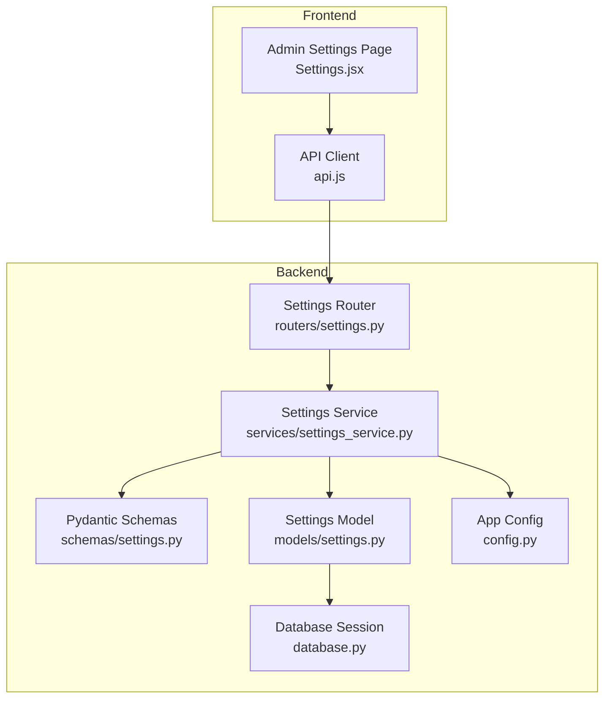
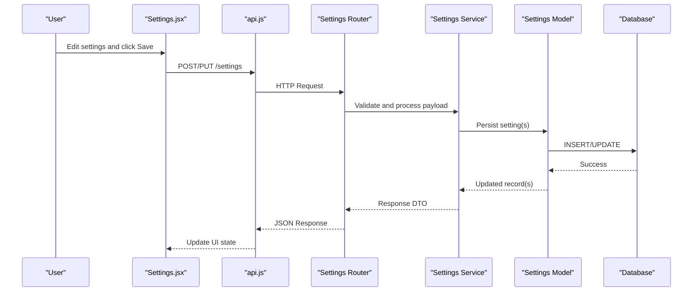
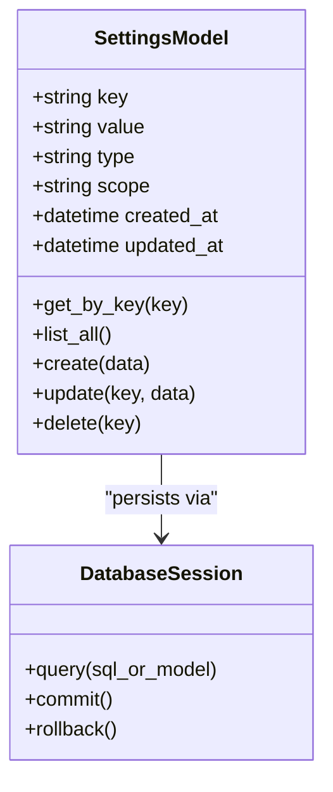
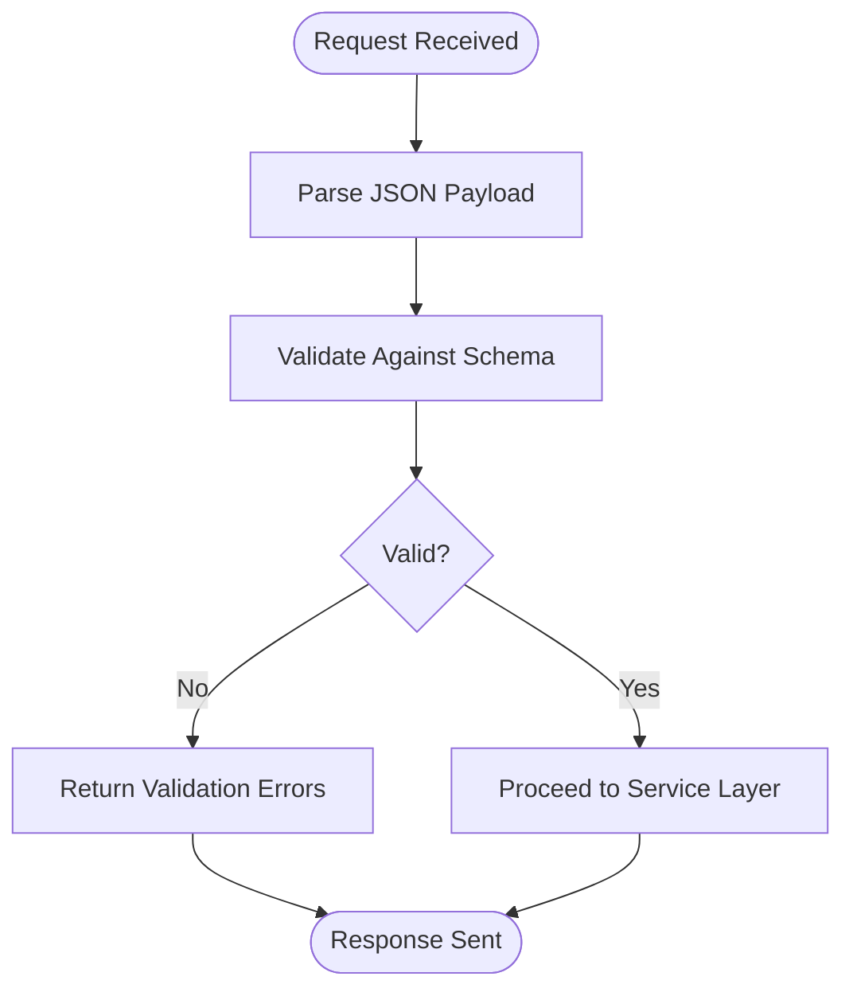
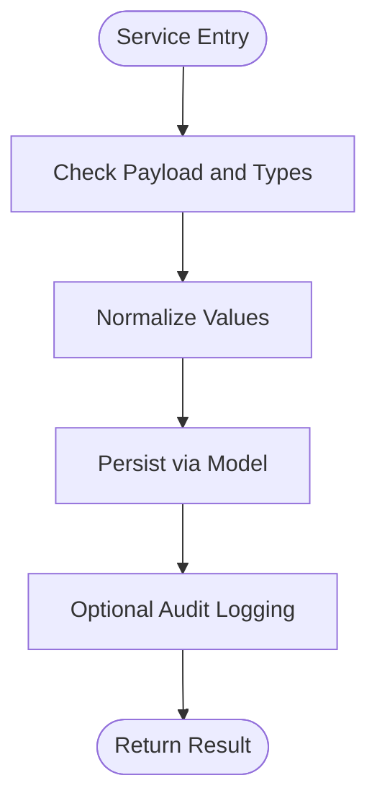
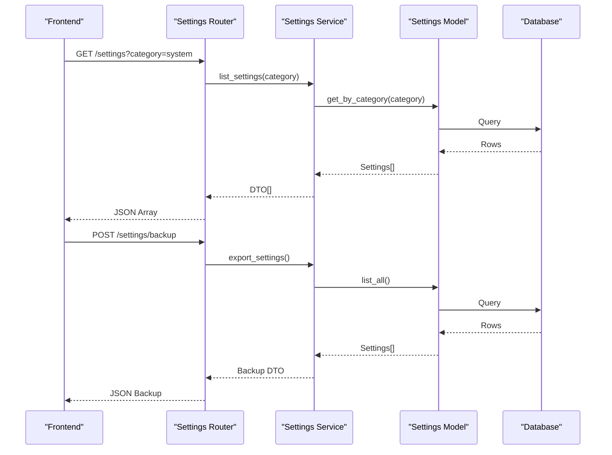
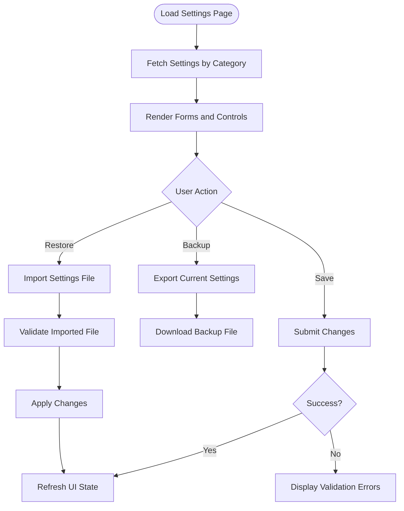
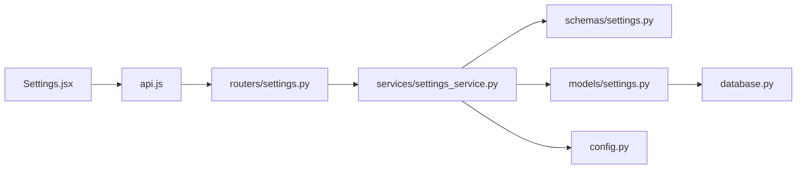

# System Settings Management

<cite>
**Referenced Files in This Document**
- [backend/app/models/settings.py](file://backend/app/models/settings.py)
- [backend/app/routers/settings.py](file://backend/app/routers/settings.py)
- [backend/app/schemas/settings.py](file://backend/app/schemas/settings.py)
- [backend/app/services/settings_service.py](file://backend/app/services/settings_service.py)
- [frontend/src/pages/admin/Settings.jsx](file://frontend/src/pages/admin/Settings.jsx)
- [frontend/src/services/api.js](file://frontend/src/services/api.js)
- [backend/app/config.py](file://backend/app/config.py)
- [backend/app/database.py](file://backend/app/database.py)
</cite>

## Table of Contents
1. [Introduction](#introduction)
2. [Project Structure](#project-structure)
3. [Core Components](#core-components)
4. [Architecture Overview](#architecture-overview)
5. [Detailed Component Analysis](#detailed-component-analysis)
6. [Dependency Analysis](#dependency-analysis)
7. [Performance Considerations](#performance-considerations)
8. [Troubleshooting Guide](#troubleshooting-guide)
9. [Conclusion](#conclusion)
10. [Appendices](#appendices)

## Introduction
This document explains the system settings management interface and its backend implementation. It covers application configuration, system preferences, integration settings, and environment management. You will learn about settings categories, validation rules, backup and restore capabilities, and how configuration changes are managed across environments. The guide includes examples for configuring system parameters, managing integrations, and maintaining consistent configuration across development, staging, and production.

## Project Structure
The settings feature spans both frontend and backend layers:
- Frontend: Admin Settings page and API client utilities
- Backend: Models, schemas, services, and routers that implement CRUD operations, validation, persistence, and auditability

**Diagram sources**
- [frontend/src/pages/admin/Settings.jsx](file://frontend/src/pages/admin/Settings.jsx)
- [frontend/src/services/api.js](file://frontend/src/services/api.js)
- [backend/app/routers/settings.py](file://backend/app/routers/settings.py)
- [backend/app/services/settings_service.py](file://backend/app/services/settings_service.py)
- [backend/app/schemas/settings.py](file://backend/app/schemas/settings.py)
- [backend/app/models/settings.py](file://backend/app/models/settings.py)
- [backend/app/database.py](file://backend/app/database.py)
- [backend/app/config.py](file://backend/app/config.py)

**Section sources**
- [frontend/src/pages/admin/Settings.jsx](file://frontend/src/pages/admin/Settings.jsx)
- [frontend/src/services/api.js](file://frontend/src/services/api.js)
- [backend/app/routers/settings.py](file://backend/app/routers/settings.py)
- [backend/app/services/settings_service.py](file://backend/app/services/settings_service.py)
- [backend/app/schemas/settings.py](file://backend/app/schemas/settings.py)
- [backend/app/models/settings.py](file://backend/app/models/settings.py)
- [backend/app/database.py](file://backend/app/database.py)
- [backend/app/config.py](file://backend/app/config.py)

## Core Components
- Settings Model: Represents persistent settings records with keys, values, types, and metadata such as scope and last updated timestamps.
- Pydantic Schemas: Define request/response structures and validation rules for settings endpoints.
- Settings Service: Encapsulates business logic including validation, serialization, backup/restore helpers, and change tracking.
- Settings Router: Exposes HTTP endpoints for listing, creating, updating, deleting, backing up, and restoring settings.
- Database Layer: Provides session management and ORM interactions for settings persistence.
- App Config: Loads environment-specific configuration used by services and routers.
- Frontend Settings Page: Renders settings categories, forms, validation feedback, and actions (save, backup, restore).
- API Client: Centralizes HTTP calls to the backend settings endpoints.

Key responsibilities:
- Validation: Enforce key uniqueness, value type constraints, and required fields via schemas.
- Persistence: Create, update, delete, and query settings through the model and database layer.
- Backup/Restore: Export current settings to a structured payload and import them back, ensuring idempotency and conflict handling.
- Change Management: Track updates and maintain an audit trail where applicable.

**Section sources**
- [backend/app/models/settings.py](file://backend/app/models/settings.py)
- [backend/app/schemas/settings.py](file://backend/app/schemas/settings.py)
- [backend/app/services/settings_service.py](file://backend/app/services/settings_service.py)
- [backend/app/routers/settings.py](file://backend/app/routers/settings.py)
- [backend/app/database.py](file://backend/app/database.py)
- [backend/app/config.py](file://backend/app/config.py)
- [frontend/src/pages/admin/Settings.jsx](file://frontend/src/pages/admin/Settings.jsx)
- [frontend/src/services/api.js](file://frontend/src/services/api.js)

## Architecture Overview
The settings management follows a layered architecture:
- Presentation Layer (Frontend): User-facing UI for editing settings and triggering actions.
- API Layer (Router): Validates requests, delegates to service, returns standardized responses.
- Service Layer: Implements business rules, orchestrates schema/model conversions, and handles backup/restore workflows.
- Data Layer (Model + DB): Persists settings and provides queries.
- Configuration Layer: Supplies runtime configuration from environment variables or config files.

**Diagram sources**
- [frontend/src/pages/admin/Settings.jsx](file://frontend/src/pages/admin/Settings.jsx)
- [frontend/src/services/api.js](file://frontend/src/services/api.js)
- [backend/app/routers/settings.py](file://backend/app/routers/settings.py)
- [backend/app/services/settings_service.py](file://backend/app/services/settings_service.py)
- [backend/app/models/settings.py](file://backend/app/models/settings.py)
- [backend/app/database.py](file://backend/app/database.py)

## Detailed Component Analysis

### Settings Model
- Purpose: Defines the persistent representation of settings, including key-value pairs, data typing, and metadata like scope and timestamps.
- Relationships: Linked to the database session for CRUD operations.
- Complexity: O(1) per operation; bulk operations depend on batch size.

**Diagram sources**
- [backend/app/models/settings.py](file://backend/app/models/settings.py)
- [backend/app/database.py](file://backend/app/database.py)

**Section sources**
- [backend/app/models/settings.py](file://backend/app/models/settings.py)
- [backend/app/database.py](file://backend/app/database.py)

### Pydantic Schemas
- Purpose: Define input/output contracts for settings endpoints, including field types, constraints, and default values.
- Validation Rules:
  - Key must be unique and non-empty.
  - Value must match declared type (e.g., string, integer, boolean).
  - Required fields enforced at request time.
- Serialization: Converts between internal models and API payloads.

**Diagram sources**
- [backend/app/schemas/settings.py](file://backend/app/schemas/settings.py)

**Section sources**
- [backend/app/schemas/settings.py](file://backend/app/schemas/settings.py)

### Settings Service
- Purpose: Orchestrates business logic for settings operations, including validation, conversion, backup/restore, and change tracking.
- Key Features:
  - Type coercion and normalization before persistence.
  - Conflict resolution during restore (e.g., skip existing, overwrite, or merge strategies).
  - Audit hooks to log changes when enabled.
- Performance: Batch operations minimize round-trips; caching can be added if needed.

**Diagram sources**
- [backend/app/services/settings_service.py](file://backend/app/services/settings_service.py)

**Section sources**
- [backend/app/services/settings_service.py](file://backend/app/services/settings_service.py)

### Settings Router
- Purpose: Exposes REST endpoints for settings management.
- Endpoints:
  - List settings (with optional filtering by category or scope).
  - Get a single setting by key.
  - Create or update a setting.
  - Delete a setting.
  - Backup settings (export).
  - Restore settings (import).
- Security: Integrates with authentication middleware where applicable.

**Diagram sources**
- [backend/app/routers/settings.py](file://backend/app/routers/settings.py)
- [backend/app/services/settings_service.py](file://backend/app/services/settings_service.py)
- [backend/app/models/settings.py](file://backend/app/models/settings.py)
- [backend/app/database.py](file://backend/app/database.py)

**Section sources**
- [backend/app/routers/settings.py](file://backend/app/routers/settings.py)

### Frontend Settings Page
- Purpose: Provides a user interface for viewing and editing settings grouped by categories.
- Features:
  - Category tabs (Application, System Preferences, Integrations, Environment).
  - Inline validation feedback and error messages.
  - Actions: Save, Backup, Restore.
  - Confirmation dialogs for destructive operations.
- Integration: Uses api.js to call backend endpoints and updates local state upon success.

**Diagram sources**
- [frontend/src/pages/admin/Settings.jsx](file://frontend/src/pages/admin/Settings.jsx)
- [frontend/src/services/api.js](file://frontend/src/services/api.js)

**Section sources**
- [frontend/src/pages/admin/Settings.jsx](file://frontend/src/pages/admin/Settings.jsx)
- [frontend/src/services/api.js](file://frontend/src/services/api.js)

### Application Configuration
- Purpose: Loads environment-specific configuration values used by services and routers.
- Usage:
  - Feature flags and toggles.
  - Defaults for settings not present in the database.
  - External service credentials and endpoints.

**Section sources**
- [backend/app/config.py](file://backend/app/config.py)

## Dependency Analysis
The settings subsystem has clear separation of concerns:
- Frontend depends on the API client.
- Router depends on the service and schemas.
- Service depends on schemas, models, and configuration.
- Model depends on the database session.

**Diagram sources**
- [frontend/src/pages/admin/Settings.jsx](file://frontend/src/pages/admin/Settings.jsx)
- [frontend/src/services/api.js](file://frontend/src/services/api.js)
- [backend/app/routers/settings.py](file://backend/app/routers/settings.py)
- [backend/app/services/settings_service.py](file://backend/app/services/settings_service.py)
- [backend/app/schemas/settings.py](file://backend/app/schemas/settings.py)
- [backend/app/models/settings.py](file://backend/app/models/settings.py)
- [backend/app/database.py](file://backend/app/database.py)
- [backend/app/config.py](file://backend/app/config.py)

**Section sources**
- [frontend/src/pages/admin/Settings.jsx](file://frontend/src/pages/admin/Settings.jsx)
- [frontend/src/services/api.js](file://frontend/src/services/api.js)
- [backend/app/routers/settings.py](file://backend/app/routers/settings.py)
- [backend/app/services/settings_service.py](file://backend/app/services/settings_service.py)
- [backend/app/schemas/settings.py](file://backend/app/schemas/settings.py)
- [backend/app/models/settings.py](file://backend/app/models/settings.py)
- [backend/app/database.py](file://backend/app/database.py)
- [backend/app/config.py](file://backend/app/config.py)

## Performance Considerations
- Minimize network calls by batching updates where possible.
- Use pagination or filtering for large settings lists.
- Cache frequently accessed settings on the server side if appropriate.
- Avoid unnecessary re-renders in the frontend by updating only changed fields.

[No sources needed since this section provides general guidance]

## Troubleshooting Guide
Common issues and resolutions:
- Validation errors: Ensure keys are unique and values match expected types. Review schema constraints and error messages returned by the API.
- Permission denied: Verify authentication and authorization middleware is configured correctly.
- Backup/restore failures: Confirm file format matches expected structure; handle conflicts using provided strategies (skip, overwrite, merge).
- Configuration drift: Compare exported backups across environments to identify differences and reconcile manually or via automated pipelines.

**Section sources**
- [backend/app/schemas/settings.py](file://backend/app/schemas/settings.py)
- [backend/app/routers/settings.py](file://backend/app/routers/settings.py)
- [backend/app/services/settings_service.py](file://backend/app/services/settings_service.py)

## Conclusion
The system settings management interface provides a robust, validated, and auditable way to manage application configuration, system preferences, integrations, and environment settings. With clear separation of concerns, strong validation, and backup/restore capabilities, it supports consistent configuration across environments and simplifies operational maintenance.

[No sources needed since this section summarizes without analyzing specific files]

## Appendices

### Settings Categories and Examples
- Application Configuration:
  - Example: Set feature flags, enable/disable modules, configure UI behavior.
- System Preferences:
  - Example: Default language, timezone, pagination limits, theme selection.
- Integration Settings:
  - Example: Configure external service endpoints, credentials, and timeouts.
- Environment Management:
  - Example: Toggle debug mode, set logging levels, define environment-specific defaults.

[No sources needed since this section provides conceptual examples]

### Configuration Change Management Best Practices
- Always validate changes before applying.
- Use backups prior to bulk updates.
- Maintain versioned configuration exports for traceability.
- Prefer incremental updates over full restores when possible.

[No sources needed since this section provides general guidance]