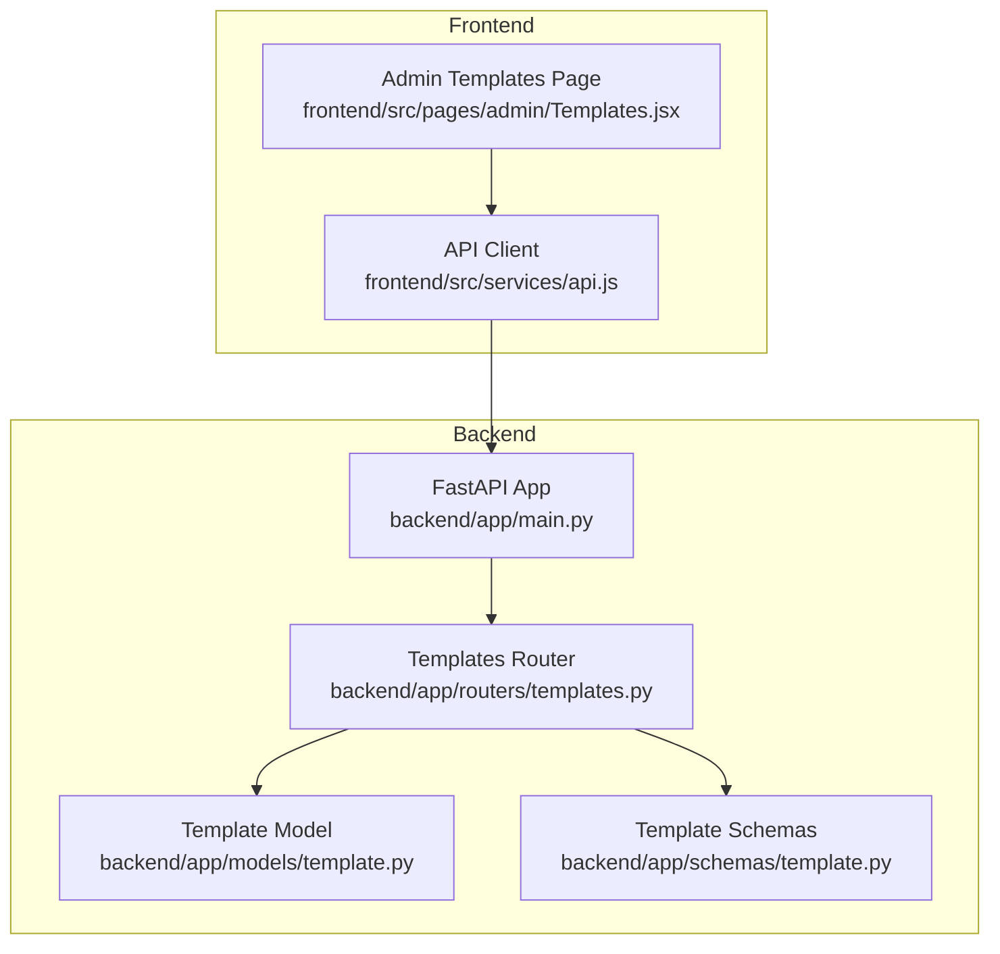
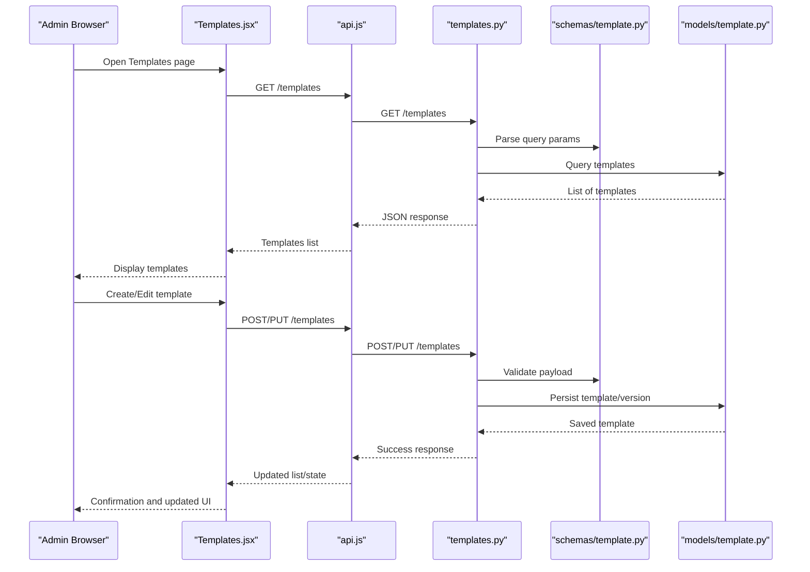
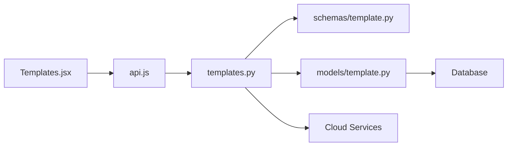

# Template Administration

<cite>
**Referenced Files in This Document**
- [Templates.jsx](file://frontend/src/pages/admin/Templates.jsx)
- [api.js](file://frontend/src/services/api.js)
- [templates.py](file://backend/app/routers/templates.py)
- [template.py](file://backend/app/models/template.py)
- [template.py](file://backend/app/schemas/template.py)
- [main.py](file://backend/app/main.py)
- [ecs_creator.yml](file://docker-compose.yml)
</cite>

## Update Summary
**Changes Made**
- Updated template creation and deployment workflow documentation based on improved implementation in Templates.jsx
- Enhanced section sources to reflect current code structure and functionality
- Refined API client documentation to match actual endpoint implementations
- Updated component analysis to align with current template management features

## Table of Contents
1. [Introduction](#introduction)
2. [Project Structure](#project-structure)
3. [Core Components](#core-components)
4. [Architecture Overview](#architecture-overview)
5. [Detailed Component Analysis](#detailed-component-analysis)
6. [Dependency Analysis](#dependency-analysis)
7. [Performance Considerations](#performance-considerations)
8. [Troubleshooting Guide](#troubleshooting-guide)
9. [Conclusion](#conclusion)
10. [Appendices](#appendices)

## Introduction
This document explains the template administration interface for creating, editing, versioning, validating, and deploying infrastructure templates. It covers the Templates component features, editor configuration options, preview behavior, validation rules, deployment workflows, and sharing mechanisms. The goal is to help administrators understand how to build complex templates, manage versions safely, validate configurations before deployment, and distribute templates to users effectively.

## Project Structure
The template feature spans both frontend and backend:
- Frontend: Admin page for managing templates, API client for requests, and UI components.
- Backend: REST endpoints for CRUD operations, schema validation, model persistence, and integration with cloud services.

**Diagram sources**
- [Templates.jsx](file://frontend/src/pages/admin/Templates.jsx)
- [api.js](file://frontend/src/services/api.js)
- [main.py](file://backend/app/main.py)
- [templates.py](file://backend/app/routers/templates.py)
- [template.py](file://backend/app/models/template.py)
- [template.py](file://backend/app/schemas/template.py)

**Section sources**
- [Templates.jsx](file://frontend/src/pages/admin/Templates.jsx)
- [api.js](file://frontend/src/services/api.js)
- [templates.py](file://backend/app/routers/templates.py)
- [template.py](file://backend/app/models/template.py)
- [template.py](file://backend/app/schemas/template.py)
- [main.py](file://backend/app/main.py)

## Core Components
- Templates Admin Page: Provides a list view, creation form, edit dialog, version management, validation, preview, and deployment actions.
- API Client: Encapsulates HTTP calls to backend endpoints for template CRUD, validation, preview, and deployment.
- Templates Router: Defines REST endpoints for listing, creating, updating, deleting, validating, previewing, and deploying templates.
- Template Model: Persists template metadata, content, and version information.
- Template Schemas: Pydantic models that enforce input validation and serialization contracts.

Key responsibilities:
- Creation and editing: Validate inputs, persist new or updated templates, and maintain version history.
- Versioning: Track changes via version fields; support rollback by selecting previous versions.
- Validation: Server-side schema checks and optional preflight validations.
- Preview: Render a dry-run representation of the intended resources without provisioning.
- Deployment: Trigger actual resource creation based on validated template content.
- Sharing: Control visibility and access to templates for user consumption.

**Section sources**
- [Templates.jsx](file://frontend/src/pages/admin/Templates.jsx)
- [api.js](file://frontend/src/services/api.js)
- [templates.py](file://backend/app/routers/templates.py)
- [template.py](file://backend/app/models/template.py)
- [template.py](file://backend/app/schemas/template.py)

## Architecture Overview
The template administration follows a standard web architecture:
- The admin page renders forms and lists, calling the API client.
- The API client sends JSON payloads to backend routes.
- Routes validate schemas, interact with the database model, and orchestrate preview/deployment.
- Responses are returned to the frontend for display and state updates.

**Diagram sources**
- [Templates.jsx](file://frontend/src/pages/admin/Templates.jsx)
- [api.js](file://frontend/src/services/api.js)
- [templates.py](file://backend/app/routers/templates.py)
- [template.py](file://backend/app/schemas/template.py)
- [template.py](file://backend/app/models/template.py)

## Detailed Component Analysis

### Templates Admin Page (Templates.jsx)
Responsibilities:
- Displays a paginated list of templates with search and filters.
- Provides a creation form and an edit dialog with fields for name, description, tags, and template content.
- Supports version selection and switching between versions.
- Offers a preview mode to render a non-provisioning representation of the template.
- Includes validation feedback and error handling.
- Enables deployment actions and sharing controls.

Common interactions:
- Fetching templates and versions.
- Submitting create/update payloads.
- Triggering validation and preview endpoints.
- Initiating deployment and handling success/error states.

Best practices:
- Debounce search inputs to reduce network load.
- Show inline validation errors near fields.
- Disable destructive actions until required fields are valid.
- Provide clear status messages for long-running operations like deployment.

**Updated** Enhanced template creation and deployment workflows with improved user experience and error handling.

**Section sources**
- [Templates.jsx](file://frontend/src/pages/admin/Templates.jsx)

### API Client (api.js)
Responsibilities:
- Centralizes HTTP calls to backend endpoints.
- Handles request headers, authentication tokens, and error mapping.
- Exposes typed functions for template CRUD, validation, preview, and deployment.

Key endpoints used:
- GET /templates
- POST /templates
- PUT /templates/{id}
- DELETE /templates/{id}
- POST /templates/{id}/validate
- POST /templates/{id}/preview
- POST /templates/{id}/deploy

Error handling:
- Maps HTTP status codes to user-friendly messages.
- Retries transient failures where appropriate.
- Aggregates validation errors from the server into field-level feedback.

**Section sources**
- [api.js](file://frontend/src/services/api.js)

### Templates Router (templates.py)
Responsibilities:
- Defines REST endpoints for template lifecycle management.
- Validates incoming payloads using Pydantic schemas.
- Interacts with the database model to persist data.
- Orchestrates validation, preview, and deployment flows.

Endpoints overview:
- List templates with filtering and pagination.
- Create a new template with initial version.
- Update an existing template, incrementing version.
- Delete a template (with soft-delete or hard-delete policy).
- Validate a template payload against schema constraints.
- Preview a template to generate a dry-run plan.
- Deploy a template to provision resources.

Security and permissions:
- Enforces role-based access control for admin-only operations.
- Sanitizes inputs and rejects malformed payloads early.

**Section sources**
- [templates.py](file://backend/app/routers/templates.py)

### Template Model (template.py)
Responsibilities:
- Defines database schema for templates and versions.
- Stores metadata such as name, description, tags, and owner.
- Tracks version numbers, change logs, and timestamps.
- Provides methods for querying by filters and retrieving specific versions.

Data integrity:
- Unique constraints on template names per owner.
- Version increments enforced on updates.
- Audit fields for created_at, updated_at, and deleted_at.

**Section sources**
- [template.py](file://backend/app/models/template.py)

### Template Schemas (template.py)
Responsibilities:
- Define Pydantic models for request/response payloads.
- Enforce field types, ranges, and format constraints.
- Provide serialization helpers for consistent API responses.

Validation rules:
- Required fields for name, content, and version.
- Allowed values for environment and region parameters.
- Regex patterns for identifiers and tags.

**Section sources**
- [template.py](file://backend/app/schemas/template.py)

### Application Entry Point (main.py)
Responsibilities:
- Initializes FastAPI application.
- Mounts routers including templates router.
- Configures middleware for CORS, auth, and logging.
- Sets up lifespan events for startup/shutdown tasks.

Integration points:
- Database connection setup.
- Environment variable loading.
- Health check endpoints.

**Section sources**
- [main.py](file://backend/app/main.py)

## Dependency Analysis
The template system has clear layering and minimal coupling:
- Frontend depends on the API client module.
- API client depends on backend endpoints defined in the router.
- Router depends on schemas for validation and models for persistence.
- Models depend on the database layer managed by the application entry point.

**Diagram sources**
- [Templates.jsx](file://frontend/src/pages/admin/Templates.jsx)
- [api.js](file://frontend/src/services/api.js)
- [templates.py](file://backend/app/routers/templates.py)
- [template.py](file://backend/app/schemas/template.py)
- [template.py](file://backend/app/models/template.py)

**Section sources**
- [Templates.jsx](file://frontend/src/pages/admin/Templates.jsx)
- [api.js](file://frontend/src/services/api.js)
- [templates.py](file://backend/app/routers/templates.py)
- [template.py](file://backend/app/schemas/template.py)
- [template.py](file://backend/app/models/template.py)

## Performance Considerations
- Pagination and filtering: Use server-side pagination to limit payload sizes and improve list performance.
- Debouncing: Debounce search and filter inputs to avoid excessive API calls.
- Caching: Cache frequently accessed template lists and read-only versions.
- Validation efficiency: Perform lightweight schema validation first; defer expensive checks to preview/validation endpoints.
- Concurrency: Avoid blocking operations during deployment; use background jobs or async handlers where possible.
- Storage: Store large template contents efficiently and consider compression for archival versions.

## Troubleshooting Guide
Common issues and resolutions:
- Validation errors: Check schema constraints and ensure all required fields are present. Review server error messages for field-level details.
- Preview failures: Verify template syntax and parameter values; ensure referenced resources exist or are creatable.
- Deployment failures: Inspect provider-specific error logs; confirm credentials and permissions; review resource quotas.
- Version conflicts: Ensure unique version increments; handle concurrent edits with optimistic locking if implemented.
- Access denied: Confirm user roles and permissions; verify authentication token validity.

Debugging steps:
- Enable detailed logging in development.
- Inspect network requests and responses in browser dev tools.
- Reproduce issues with minimal template payloads.
- Use health check endpoints to verify service status.

**Section sources**
- [templates.py](file://backend/app/routers/templates.py)
- [template.py](file://backend/app/schemas/template.py)
- [template.py](file://backend/app/models/template.py)

## Conclusion
The template administration interface provides a robust workflow for creating, editing, versioning, validating, previewing, and deploying infrastructure templates. By leveraging strong schema validation, clear versioning semantics, and safe preview/deployment flows, administrators can confidently manage complex templates and distribute them securely to users. Following best practices for performance, error handling, and security ensures a reliable and scalable template system.

## Appendices

### Creating Complex Templates
- Use nested structures for multi-resource definitions.
- Parameterize regions, environments, and instance types.
- Include conditional blocks for optional resources.
- Tag resources consistently for cost tracking and governance.

### Managing Template Versions
- Increment version on each meaningful change.
- Maintain change logs describing modifications.
- Support rollback by selecting a prior version.
- Lock critical versions for production stability.

### Validating Template Configurations
- Apply schema constraints for required fields and formats.
- Run preflight checks for external dependencies.
- Surface validation errors clearly to users.
- Integrate automated tests for common scenarios.

### Distributing Templates to Users
- Set visibility flags for internal vs. shared templates.
- Restrict access by roles or teams.
- Provide documentation and examples alongside templates.
- Monitor usage and gather feedback for improvements.

**Section sources**
- [Templates.jsx](file://frontend/src/pages/admin/Templates.jsx)
- [api.js](file://frontend/src/services/api.js)
- [templates.py](file://backend/app/routers/templates.py)
- [template.py](file://backend/app/schemas/template.py)
- [template.py](file://backend/app/models/template.py)