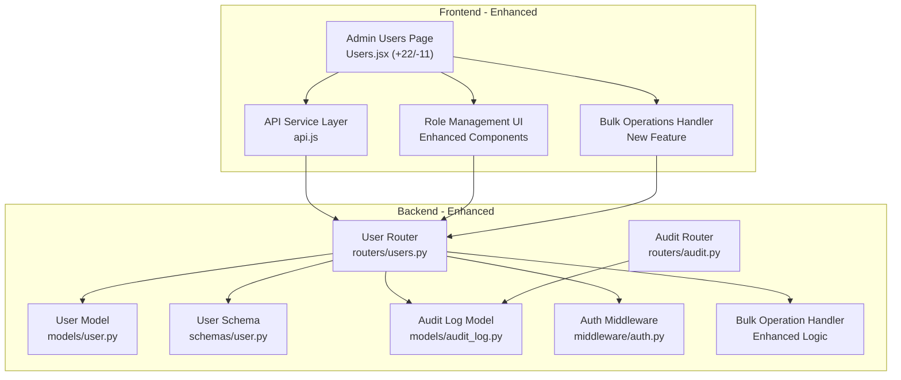
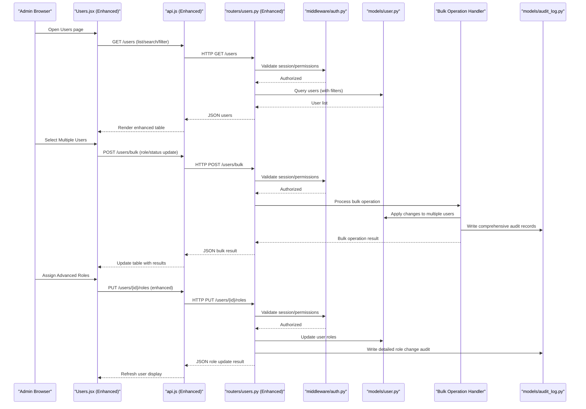
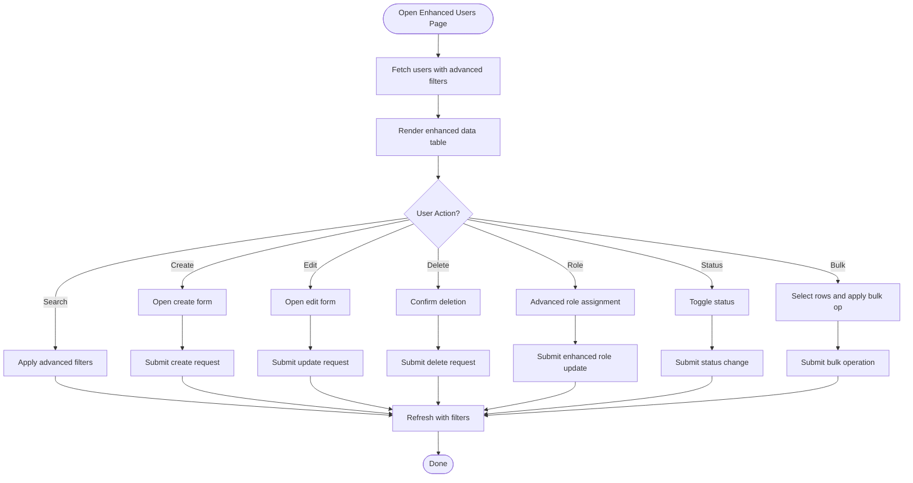
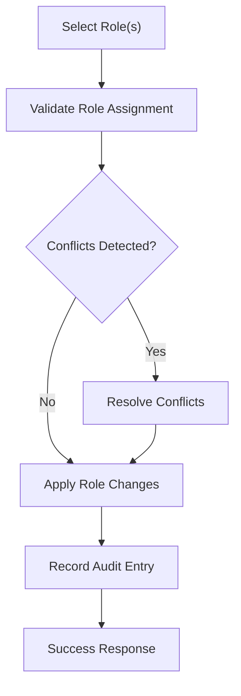
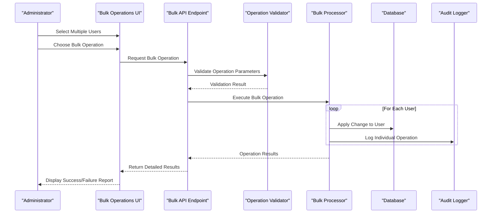
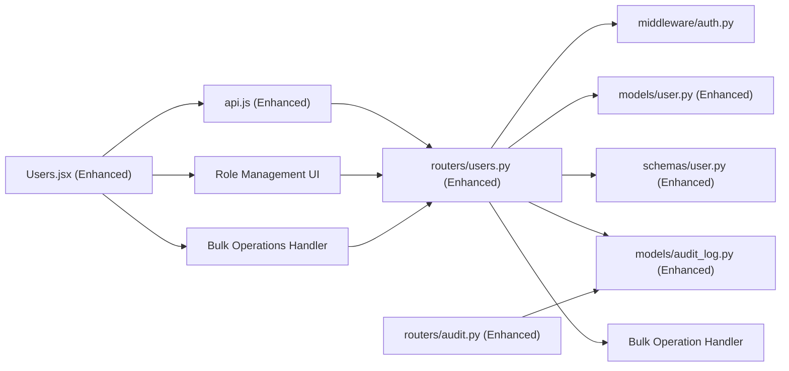

# User Management Interface

<cite>
**Referenced Files in This Document**
- [Users.jsx](file://frontend/src/pages/admin/Users.jsx)
- [api.js](file://frontend/src/services/api.js)
- [users.py](file://backend/app/routers/users.py)
- [user.py](file://backend/app/models/user.py)
- [user.py](file://backend/app/schemas/user.py)
- [audit_log.py](file://backend/app/models/audit_log.py)
- [audit.py](file://backend/app/routers/audit.py)
- [auth.py](file://backend/app/middleware/auth.py)
</cite>

## Update Summary
**Changes Made**
- Enhanced Users component with improved role management capabilities
- Added comprehensive bulk operations for multiple user management tasks
- Updated API service layer to support new role assignment and bulk operation endpoints
- Strengthened backend user router with enhanced validation and audit logging for bulk operations
- Improved user interface with better role selection and batch processing workflows

## Table of Contents
1. [Introduction](#introduction)
2. [Project Structure](#project-structure)
3. [Core Components](#core-components)
4. [Architecture Overview](#architecture-overview)
5. [Detailed Component Analysis](#detailed-component-analysis)
6. [Enhanced Role Management Features](#enhanced-role-management-features)
7. [Bulk Operations System](#bulk-operations-system)
8. [Dependency Analysis](#dependency-analysis)
9. [Performance Considerations](#performance-considerations)
10. [Troubleshooting Guide](#troubleshooting-guide)
11. [Conclusion](#conclusion)

## Introduction
This document describes the user management administrative interface, focusing on the enhanced Users component and its integration with backend APIs. The system now provides advanced user creation, editing, deletion, sophisticated role assignment capabilities, comprehensive bulk operations, data table features (search and filtering), status management, permission enforcement, and audit trail integration for user administration tasks. The goal is to help administrators understand how to operate the enhanced interface effectively and how it interacts with the backend services.

## Project Structure
The user management feature spans both frontend and backend with enhanced capabilities:
- Frontend: Admin page for users with improved UI components, enhanced API service layer, and bulk operation handlers.
- Backend: REST endpoints for user CRUD, advanced role management, bulk operations, status updates, and comprehensive audit logging; models and schemas define robust data contracts.

**Diagram sources**
- [Users.jsx](file://frontend/src/pages/admin/Users.jsx)
- [api.js](file://frontend/src/services/api.js)
- [users.py](file://backend/app/routers/users.py)
- [user.py](file://backend/app/models/user.py)
- [user.py](file://backend/app/schemas/user.py)
- [audit_log.py](file://backend/app/models/audit_log.py)
- [audit.py](file://backend/app/routers/audit.py)
- [auth.py](file://backend/app/middleware/auth.py)

**Section sources**
- [Users.jsx](file://frontend/src/pages/admin/Users.jsx)
- [api.js](file://frontend/src/services/api.js)
- [users.py](file://backend/app/routers/users.py)
- [user.py](file://backend/app/models/user.py)
- [user.py](file://backend/app/schemas/user.py)
- [audit_log.py](file://backend/app/models/audit_log.py)
- [audit.py](file://backend/app/routers/audit.py)
- [auth.py](file://backend/app/middleware/auth.py)

## Core Components
- **Enhanced Users Admin Page**: Provides a sophisticated data table for listing users, advanced search/filtering, pagination, and comprehensive actions including create, edit, delete, advanced role assignment, and powerful bulk operations. It also manages user status toggles and integrates with the enhanced API service layer.
- **Enhanced API Service Layer**: Encapsulates HTTP calls to backend endpoints for user management, advanced role operations, bulk operations, and audit retrieval with improved error handling.
- **Enhanced Backend User Router**: Implements REST endpoints for user CRUD, advanced role updates, bulk operations, status changes, and comprehensive audit logging. Enforces authentication and authorization via middleware with enhanced validation.
- **Advanced Data Models and Schemas**: Define database entities and request/response contracts for users, roles, and audit logs with enhanced validation rules.
- **Comprehensive Audit Integration**: Records detailed administrative actions on users and exposes an audit log endpoint for review with enhanced tracking capabilities.

Key responsibilities:
- **Users.jsx**: Enhanced UI state management, sophisticated table rendering, advanced search/filter inputs, action handlers, bulk operation processors, and API calls.
- **api.js**: Centralized client functions for user and audit endpoints with enhanced role and bulk operation support.
- **routers/users.py**: Advanced business logic for user operations, enhanced validation against schemas, persistence, comprehensive audit logging, and bulk operation handling.
- **models/user.py and schemas/user.py**: Enhanced data definitions and validation rules for complex user scenarios.
- **models/audit_log.py and routers/audit.py**: Comprehensive audit record storage and retrieval with enhanced filtering capabilities.

**Section sources**
- [Users.jsx](file://frontend/src/pages/admin/Users.jsx)
- [api.js](file://frontend/src/services/api.js)
- [users.py](file://backend/app/routers/users.py)
- [user.py](file://backend/app/models/user.py)
- [user.py](file://backend/app/schemas/user.py)
- [audit_log.py](file://backend/app/models/audit_log.py)
- [audit.py](file://backend/app/routers/audit.py)

## Architecture Overview
The admin interface follows an enhanced SPA-to-API architecture with improved role management and bulk operations:
- The Users page renders a sophisticated data table and dispatches actions through the enhanced API service.
- The API service sends requests to the backend user router with enhanced payload handling.
- The user router validates input using enhanced schemas, persists changes via the user model, handles bulk operations efficiently, and writes comprehensive audit records.
- Authentication and authorization are enforced by middleware before route handlers execute with enhanced permission checks.
- Administrators can view detailed audit trails via the audit router with enhanced filtering options.

**Diagram sources**
- [Users.jsx](file://frontend/src/pages/admin/Users.jsx)
- [api.js](file://frontend/src/services/api.js)
- [users.py](file://backend/app/routers/users.py)
- [auth.py](file://backend/app/middleware/auth.py)
- [user.py](file://backend/app/models/user.py)
- [audit_log.py](file://backend/app/models/audit_log.py)

## Detailed Component Analysis

### Enhanced Users Admin Page (Users.jsx)
Responsibilities:
- Renders a sophisticated data table of users with columns for identity, advanced roles, permissions, and status.
- Provides advanced search and filter controls (e.g., by name, email, role hierarchy, status, last login).
- Supports pagination, sorting, and column customization where applicable.
- Action buttons for creating new users, editing existing ones, deleting users, advanced role assignment, and toggling status.
- **Enhanced**: Comprehensive bulk operations such as enabling/disabling multiple users, assigning roles in batch, updating permissions across multiple accounts, and mass status changes.
- Integrates with the enhanced API service layer for all data operations and refreshes the table after mutations with optimistic updates.

Operational highlights:
- **Enhanced**: Search and filtering: Inputs update query parameters sent to the backend list endpoint with advanced filtering options.
- Status management: Toggle switches or buttons call the status update endpoint and reflect changes immediately with visual feedback.
- **Enhanced**: Role assignment: Sophisticated dropdowns, multi-select interfaces, and hierarchical role selection allow precise role control per user or in bulk.
- Deletion: Confirmation dialogs prevent accidental deletions; successful deletion removes rows from the table with undo capability.
- **Enhanced**: Bulk operations: Row selection interface allows selecting multiple users and applying common operations like role assignment, status changes, or permission updates.
- Audit trail visibility: Administrators may navigate to the audit log to review user-related actions with enhanced filtering.

**Diagram sources**
- [Users.jsx](file://frontend/src/pages/admin/Users.jsx)
- [api.js](file://frontend/src/services/api.js)

**Section sources**
- [Users.jsx](file://frontend/src/pages/admin/Users.jsx)
- [api.js](file://frontend/src/services/api.js)

### Enhanced API Service Layer (api.js)
Responsibilities:
- Exposes typed functions for user endpoints: list, get, create, update, delete, enhanced role update, status update, and comprehensive bulk operations.
- Handles request headers (e.g., authentication tokens) and enhanced error mapping with retry logic.
- Provides consistent response handling and optional retry or timeout configuration with progress tracking for bulk operations.

Integration points:
- Calls backend routes under the user management namespace with enhanced payload structures.
- Includes helper utilities for building complex query strings for advanced search and filtering.
- **Enhanced**: Provides dedicated functions for bulk operations with progress callbacks and batch processing.

**Section sources**
- [api.js](file://frontend/src/services/api.js)

### Enhanced Backend User Router (routers/users.py)
Responsibilities:
- Defines REST endpoints for user management with enhanced capabilities:
  - List users with support for advanced search and filtering parameters.
  - Get a single user by ID with expanded details.
  - Create a new user with enhanced validation.
  - Update user details and advanced role assignments.
  - Delete a user with cascade handling.
  - Update user status (enable/disable) with notifications.
  - **Enhanced**: Comprehensive bulk operations (assign roles, toggle status, update permissions for multiple users).
  - **Enhanced**: Advanced role management endpoints with hierarchical role support.
- Validates payloads using enhanced schemas with custom validators.
- Persists changes via the user model with transaction support.
- Writes comprehensive audit records for all administrative actions.
- Enforces authentication and authorization via middleware with enhanced permission checks.

Security and permissions:
- Only authorized admins can perform user management operations.
- **Enhanced**: Role-based checks ensure that only permitted roles can be assigned with inheritance validation.
- **Enhanced**: Bulk operations include validation to prevent conflicting role assignments.

Audit trail integration:
- Each mutation writes a detailed audit entry describing the actor, action, target users, and relevant details including before/after states.

**Section sources**
- [users.py](file://backend/app/routers/users.py)
- [user.py](file://backend/app/schemas/user.py)
- [user.py](file://backend/app/models/user.py)
- [audit_log.py](file://backend/app/models/audit_log.py)
- [auth.py](file://backend/app/middleware/auth.py)

### Enhanced Data Models and Schemas
- **Enhanced User model**: Represents the persisted user entity with fields such as identity, advanced roles, permissions, status, and metadata.
- **Enhanced User schema**: Defines comprehensive validation rules and serialization for request and response bodies with custom validators.
- **Enhanced Audit log model**: Captures detailed administrative actions including timestamp, actor, action type, affected resources, and change details.

Data flow:
- Requests are validated against enhanced schemas before being applied to the model.
- Responses are serialized according to enhanced schemas for consistent API contracts.
- **Enhanced**: Bulk operations use transactional processing to ensure data consistency.

**Section sources**
- [user.py](file://backend/app/models/user.py)
- [user.py](file://backend/app/schemas/user.py)
- [audit_log.py](file://backend/app/models/audit_log.py)

### Enhanced Audit Trail Integration
Administrative actions on users are recorded comprehensively in the audit log:
- Creation, updates, deletions, advanced role assignments, status changes, and bulk operations generate detailed entries.
- The audit router provides endpoints to retrieve audit logs with enhanced filtering by resource type, time range, action type, and administrator.

Use cases:
- Compliance reporting for user lifecycle events with detailed change tracking.
- Forensic analysis of administrative changes with before/after snapshots.
- Visibility into who performed what action, when, and the impact scope.
- **Enhanced**: Bulk operation auditing shows which users were affected and what changes were applied.

**Section sources**
- [audit_log.py](file://backend/app/models/audit_log.py)
- [audit.py](file://backend/app/routers/audit.py)
- [users.py](file://backend/app/routers/users.py)

## Enhanced Role Management Features

### Advanced Role Assignment System
The enhanced role management system provides sophisticated capabilities for user role administration:

**Hierarchical Role Support**:
- Roles can have parent-child relationships allowing inheritance of permissions
- Administrators can assign roles at different levels of the organizational hierarchy
- Role conflicts are automatically detected and resolved during assignment

**Multi-Role Assignment**:
- Users can have multiple roles simultaneously with combined permissions
- Role precedence rules determine permission resolution when conflicts occur
- Visual indicators show current role assignments and effective permissions

**Role Validation and Constraints**:
- Business rules prevent invalid role combinations
- Minimum and maximum role limits per user can be configured
- Role dependency validation ensures required prerequisite roles are present

**Bulk Role Operations**:
- Assign or remove roles across multiple users simultaneously
- Template-based role assignment for common user groups
- Preview mode shows proposed changes before applying bulk role updates

**Diagram sources**
- [Users.jsx](file://frontend/src/pages/admin/Users.jsx)
- [users.py](file://backend/app/routers/users.py)

**Section sources**
- [Users.jsx](file://frontend/src/pages/admin/Users.jsx)
- [users.py](file://backend/app/routers/users.py)
- [user.py](file://backend/app/schemas/user.py)

## Bulk Operations System

### Comprehensive Bulk Processing
The enhanced bulk operations system enables efficient management of multiple users simultaneously:

**Supported Bulk Operations**:
- **Role Assignment**: Assign or remove roles for selected users
- **Status Management**: Enable/disable multiple user accounts
- **Permission Updates**: Update specific permissions across user groups
- **Profile Updates**: Modify common profile fields for multiple users
- **Custom Operations**: Extensible framework for additional bulk operations

**Operation Workflow**:
1. **Selection Phase**: Users select multiple rows using checkboxes or filters
2. **Preview Phase**: System shows preview of changes to be applied
3. **Validation Phase**: Backend validates all operations before execution
4. **Execution Phase**: Operations are executed with progress tracking
5. **Result Phase**: Detailed results show success/failure for each operation

**Error Handling and Recovery**:
- Individual operation failures don't stop the entire bulk process
- Detailed error reporting identifies which operations failed and why
- Rollback capability for partially completed bulk operations
- Retry mechanism for transient failures

**Performance Optimizations**:
- Batch database operations reduce round trips to the database
- Asynchronous processing for large-scale operations
- Progress tracking and real-time status updates
- Memory-efficient processing for large user sets

**Diagram sources**
- [Users.jsx](file://frontend/src/pages/admin/Users.jsx)
- [users.py](file://backend/app/routers/users.py)
- [audit_log.py](file://backend/app/models/audit_log.py)

**Section sources**
- [Users.jsx](file://frontend/src/pages/admin/Users.jsx)
- [users.py](file://backend/app/routers/users.py)
- [api.js](file://frontend/src/services/api.js)

## Dependency Analysis
The following diagram shows key dependencies between frontend and backend modules involved in the enhanced user management system.

**Diagram sources**
- [Users.jsx](file://frontend/src/pages/admin/Users.jsx)
- [api.js](file://frontend/src/services/api.js)
- [users.py](file://backend/app/routers/users.py)
- [auth.py](file://backend/app/middleware/auth.py)
- [user.py](file://backend/app/models/user.py)
- [user.py](file://backend/app/schemas/user.py)
- [audit_log.py](file://backend/app/models/audit_log.py)
- [audit.py](file://backend/app/routers/audit.py)

**Section sources**
- [Users.jsx](file://frontend/src/pages/admin/Users.jsx)
- [api.js](file://frontend/src/services/api.js)
- [users.py](file://backend/app/routers/users.py)
- [auth.py](file://backend/app/middleware/auth.py)
- [user.py](file://backend/app/models/user.py)
- [user.py](file://backend/app/schemas/user.py)
- [audit_log.py](file://backend/app/models/audit_log.py)
- [audit.py](file://backend/app/routers/audit.py)

## Performance Considerations
- **Enhanced Pagination and Server-side Filtering**: Ensure large user lists are paginated and filtered on the backend to reduce payload sizes with optimized queries.
- **Debounced Search**: Implement debouncing on search inputs to avoid excessive requests with intelligent caching.
- **Efficient Queries**: Use indexed columns for common filters (e.g., username, email, role, status) with query optimization.
- **Optimized Bulk Operations**: Prefer bulk endpoints for mass updates to minimize round trips with batch processing and transaction support.
- **Enhanced Caching**: Consider short-lived caching for read-only list views if appropriate and safe with cache invalidation strategies.
- **Memory Management**: Implement streaming for large bulk operations to prevent memory overflow.
- **Progress Tracking**: Provide real-time progress updates for long-running bulk operations.

## Troubleshooting Guide
Common issues and resolutions:
- **Authentication failures**: Verify session/token validity and ensure the admin has required permissions. Check middleware behavior for authorization errors.
- **Validation errors**: Inspect request payloads against enhanced schemas; correct missing or invalid fields with detailed error messages.
- **Permission denied**: Confirm the current user's role allows the requested operation with role hierarchy validation.
- **Audit gaps**: If audit entries are missing, verify that the audit write path is invoked for all mutations including bulk operations.
- **Slow list performance**: Review query filters, pagination, and indexes; consider adding server-side search with optimized queries.
- **Bulk operation failures**: Check individual operation results and error details; use rollback functionality if available.
- **Role assignment conflicts**: Review role hierarchy and conflict resolution rules; validate role combinations before assignment.
- **Memory issues with large batches**: Reduce batch size or implement chunked processing for very large user sets.

**Section sources**
- [auth.py](file://backend/app/middleware/auth.py)
- [users.py](file://backend/app/routers/users.py)
- [user.py](file://backend/app/schemas/user.py)
- [audit_log.py](file://backend/app/models/audit_log.py)

## Conclusion
The enhanced user management interface provides a comprehensive administrative experience for managing users, advanced roles, and statuses, backed by robust APIs and comprehensive audit logging. With improved role management capabilities and powerful bulk operations, administrators can efficiently maintain user accounts while ensuring security and compliance through enhanced permission checks and detailed audit trails. The system now supports sophisticated role hierarchies, multi-role assignments, and efficient bulk processing for large-scale user management tasks.