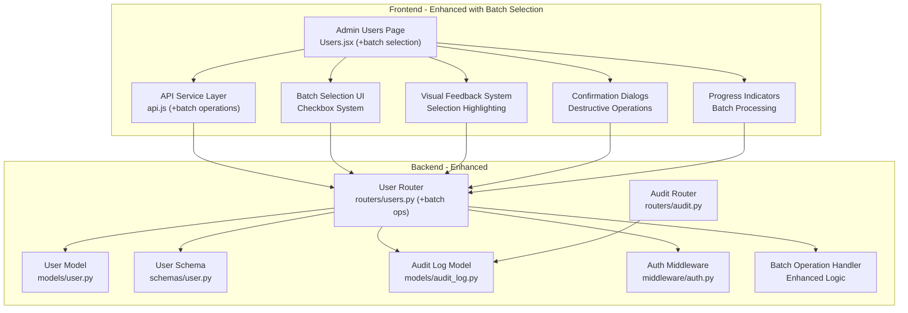
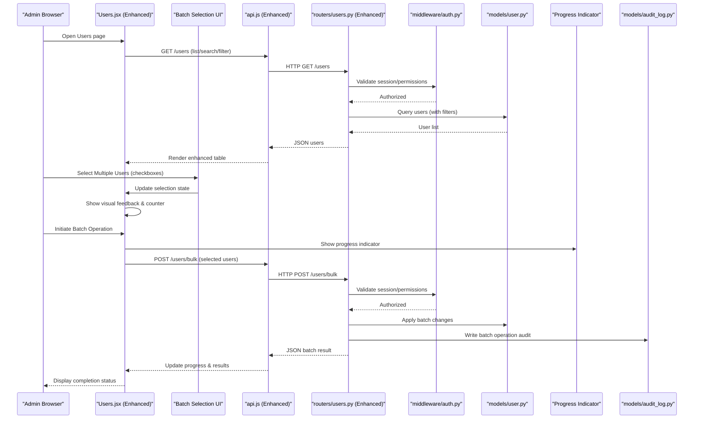
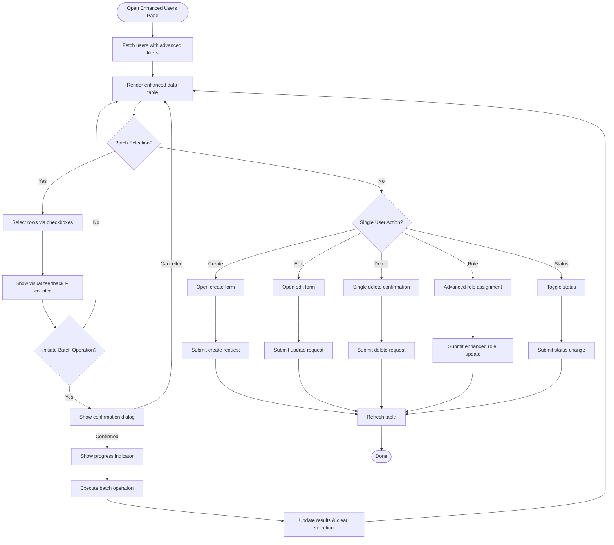
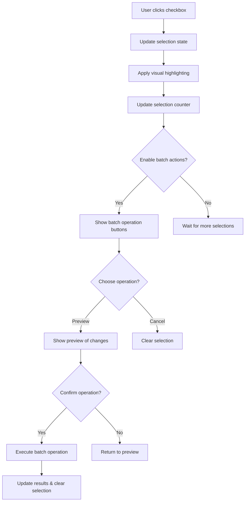
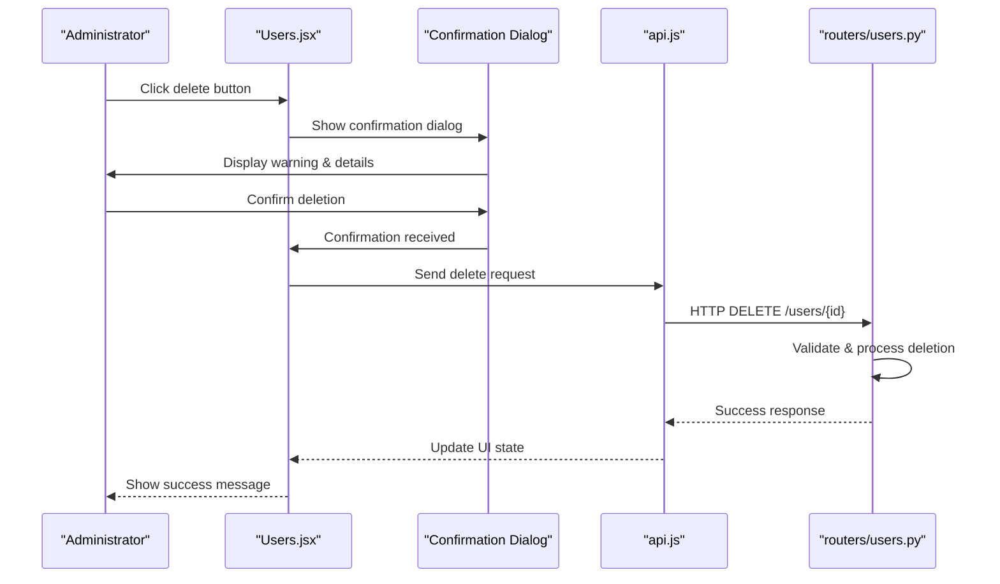
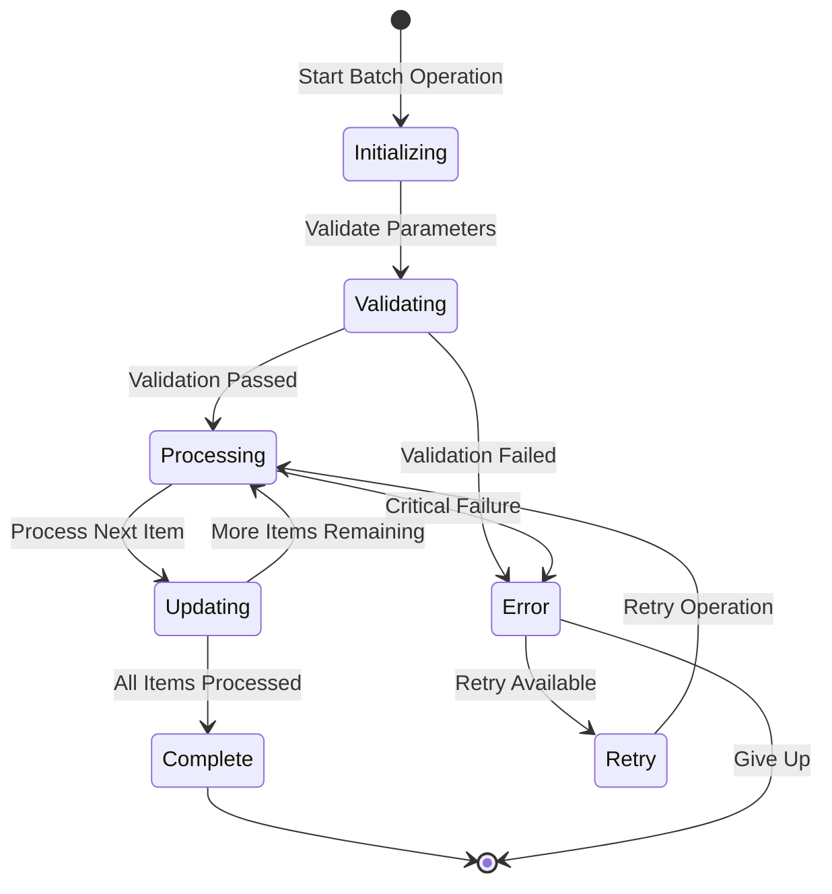
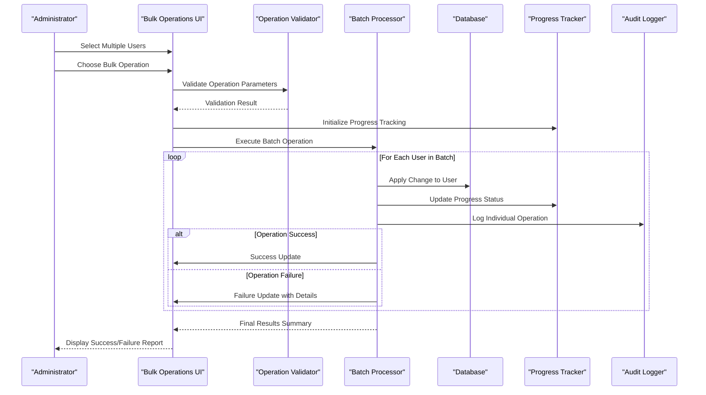
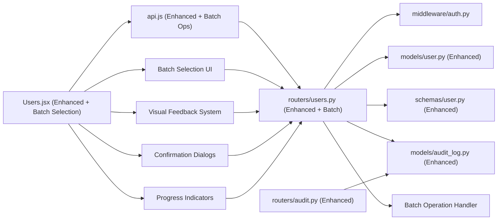

# User Management Interface

<cite>
**Referenced Files in This Document**
- [Users.jsx](file://frontend/src/pages/admin/Users.jsx)
- [api.js](file://frontend/src/services/api.js)
- [users.py](file://backend/app/routers/users.py)
- [user.py](file://backend/app/models/user.py)
- [user.py](file://backend/app/schemas/user.py)
- [audit_log.py](file://backend/app/models/audit_log.py)
- [audit.py](file://backend/app/routers/audit.py)
- [auth.py](file://backend/app/middleware/auth.py)
</cite>

## Update Summary
**Changes Made**
- Enhanced Users component with comprehensive batch selection capabilities using checkboxes
- Added visual feedback system for selected items with highlighting and selection counters
- Implemented confirmation dialogs for all destructive operations (delete, bulk delete)
- Integrated progress indicators for long-running batch tasks with real-time status updates
- Updated API service layer to support batch operations with progress tracking
- Enhanced backend user router with improved batch operation handling and validation

## Table of Contents
1. [Introduction](#introduction)
2. [Project Structure](#project-structure)
3. [Core Components](#core-components)
4. [Architecture Overview](#architecture-overview)
5. [Detailed Component Analysis](#detailed-component-analysis)
6. [Enhanced Batch Selection System](#enhanced-batch-selection-system)
7. [Visual Feedback and Confirmation Dialogs](#visual-feedback-and-confirmation-dialogs)
8. [Progress Indicators for Batch Operations](#progress-indicators-for-batch-operations)
9. [Bulk Operations System](#bulk-operations-system)
10. [Dependency Analysis](#dependency-analysis)
11. [Performance Considerations](#performance-considerations)
12. [Troubleshooting Guide](#troubleshooting-guide)
13. [Conclusion](#conclusion)

## Introduction
This document describes the user management administrative interface, focusing on the enhanced Users component with major interface improvements including batch selection capabilities, visual feedback systems, confirmation dialogs, and progress indicators. The system now provides sophisticated user creation, editing, deletion, role assignment, comprehensive bulk operations with checkbox-based selection, data table features (search and filtering), status management, permission enforcement, and audit trail integration for user administration tasks. The goal is to help administrators understand how to operate the enhanced interface effectively with its new batch processing capabilities and how it interacts with the backend services.

## Project Structure
The user management feature spans both frontend and backend with enhanced batch selection and processing capabilities:
- Frontend: Admin page for users with improved UI components featuring checkbox-based batch selection, visual feedback systems, confirmation dialogs, and progress indicators; enhanced API service layer with batch operation support.
- Backend: REST endpoints for user CRUD, advanced role management, batch operations, status updates, and comprehensive audit logging; models and schemas define robust data contracts for batch processing.

**Diagram sources**
- [Users.jsx](file://frontend/src/pages/admin/Users.jsx)
- [api.js](file://frontend/src/services/api.js)
- [users.py](file://backend/app/routers/users.py)
- [user.py](file://backend/app/models/user.py)
- [user.py](file://backend/app/schemas/user.py)
- [audit_log.py](file://backend/app/models/audit_log.py)
- [audit.py](file://backend/app/routers/audit.py)
- [auth.py](file://backend/app/middleware/auth.py)

**Section sources**
- [Users.jsx](file://frontend/src/pages/admin/Users.jsx)
- [api.js](file://frontend/src/services/api.js)
- [users.py](file://backend/app/routers/users.py)
- [user.py](file://backend/app/models/user.py)
- [user.py](file://backend/app/schemas/user.py)
- [audit_log.py](file://backend/app/models/audit_log.py)
- [audit.py](file://backend/app/routers/audit.py)
- [auth.py](file://backend/app/middleware/auth.py)

## Core Components
- **Enhanced Users Admin Page**: Provides a sophisticated data table for listing users with comprehensive batch selection capabilities using checkboxes, advanced search/filtering, pagination, and comprehensive actions including create, edit, delete, advanced role assignment, and powerful bulk operations. It also manages user status toggles and integrates with the enhanced API service layer with visual feedback for selected items.
- **Enhanced API Service Layer**: Encapsulates HTTP calls to backend endpoints for user management, advanced role operations, batch operations with progress tracking, and audit retrieval with improved error handling and batch operation support.
- **Enhanced Backend User Router**: Implements REST endpoints for user CRUD, advanced role updates, batch operations, status changes, and comprehensive audit logging. Enforces authentication and authorization via middleware with enhanced validation for batch operations.
- **Advanced Data Models and Schemas**: Define database entities and request/response contracts for users, roles, and audit logs with enhanced validation rules for batch processing.
- **Comprehensive Audit Integration**: Records detailed administrative actions on users and exposes an audit log endpoint for review with enhanced tracking capabilities for batch operations.

Key responsibilities:
- **Users.jsx**: Enhanced UI state management with batch selection, sophisticated table rendering, advanced search/filter inputs, action handlers, batch operation processors with progress tracking, and API calls with visual feedback.
- **api.js**: Centralized client functions for user and audit endpoints with enhanced batch operation support, progress callbacks, and batch processing utilities.
- **routers/users.py**: Advanced business logic for user operations, enhanced validation against schemas, persistence, comprehensive audit logging, and efficient batch operation handling.
- **models/user.py and schemas/user.py**: Enhanced data definitions and validation rules for complex user scenarios including batch processing requirements.
- **models/audit_log.py and routers/audit.py**: Comprehensive audit record storage and retrieval with enhanced filtering capabilities for batch operations.

**Section sources**
- [Users.jsx](file://frontend/src/pages/admin/Users.jsx)
- [api.js](file://frontend/src/services/api.js)
- [users.py](file://backend/app/routers/users.py)
- [user.py](file://backend/app/models/user.py)
- [user.py](file://backend/app/schemas/user.py)
- [audit_log.py](file://backend/app/models/audit_log.py)
- [audit.py](file://backend/app/routers/audit.py)

## Architecture Overview
The admin interface follows an enhanced SPA-to-API architecture with improved batch selection and processing capabilities:
- The Users page renders a sophisticated data table with checkbox-based batch selection and dispatches actions through the enhanced API service.
- The API service sends requests to the backend user router with enhanced payload handling for batch operations and progress tracking.
- The user router validates input using enhanced schemas, persists changes via the user model, handles batch operations efficiently with transaction support, and writes comprehensive audit records.
- Authentication and authorization are enforced by middleware before route handlers execute with enhanced permission checks for batch operations.
- Administrators can view detailed audit trails via the audit router with enhanced filtering options for batch operation results.

**Diagram sources**
- [Users.jsx](file://frontend/src/pages/admin/Users.jsx)
- [api.js](file://frontend/src/services/api.js)
- [users.py](file://backend/app/routers/users.py)
- [auth.py](file://backend/app/middleware/auth.py)
- [user.py](file://backend/app/models/user.py)
- [audit_log.py](file://backend/app/models/audit_log.py)

## Detailed Component Analysis

### Enhanced Users Admin Page (Users.jsx)
Responsibilities:
- Renders a sophisticated data table of users with columns for identity, advanced roles, permissions, and status.
- Provides advanced search and filter controls (e.g., by name, email, role hierarchy, status, last login).
- Supports pagination, sorting, and column customization where applicable.
- Action buttons for creating new users, editing existing ones, deleting users, advanced role assignment, and toggling status.
- **Enhanced**: Comprehensive batch selection system using checkboxes with visual feedback, selection counters, and batch operation triggers.
- **Enhanced**: Visual feedback system that highlights selected rows and provides real-time selection status updates.
- **Enhanced**: Confirmation dialogs for all destructive operations including individual deletions and batch deletions.
- **Enhanced**: Progress indicators for long-running batch operations with real-time status updates and completion feedback.
- Integrates with the enhanced API service layer for all data operations and refreshes the table after mutations with optimistic updates.

Operational highlights:
- **Enhanced**: Batch selection: Checkbox-based row selection with select-all functionality, visual highlighting of selected items, and selection count display.
- **Enhanced**: Visual feedback: Selected rows are highlighted with distinct styling, selection counter shows current selection status, and batch operation buttons become active when items are selected.
- Status management: Toggle switches or buttons call the status update endpoint and reflect changes immediately with visual feedback.
- **Enhanced**: Role assignment: Sophisticated dropdowns, multi-select interfaces, and hierarchical role selection allow precise role control per user or in batch.
- **Enhanced**: Deletion: Confirmation dialogs prevent accidental deletions; successful deletion removes rows from the table with undo capability and batch delete support.
- **Enhanced**: Batch operations: Row selection interface allows selecting multiple users and applying common operations like role assignment, status changes, or permission updates with progress tracking.
- **Enhanced**: Progress tracking: Real-time progress indicators show batch operation status, completion percentages, and detailed result summaries.
- Audit trail visibility: Administrators may navigate to the audit log to review user-related actions with enhanced filtering including batch operation details.

**Diagram sources**
- [Users.jsx](file://frontend/src/pages/admin/Users.jsx)
- [api.js](file://frontend/src/services/api.js)

**Section sources**
- [Users.jsx](file://frontend/src/pages/admin/Users.jsx)
- [api.js](file://frontend/src/services/api.js)

### Enhanced API Service Layer (api.js)
Responsibilities:
- Exposes typed functions for user endpoints: list, get, create, update, delete, enhanced role update, status update, and comprehensive batch operations.
- Handles request headers (e.g., authentication tokens) and enhanced error mapping with retry logic.
- Provides consistent response handling and optional retry or timeout configuration with progress tracking for batch operations.
- **Enhanced**: Dedicated batch operation functions with progress callbacks and batch processing utilities.
- **Enhanced**: Enhanced error handling for batch operations with detailed failure reporting.

Integration points:
- Calls backend routes under the user management namespace with enhanced payload structures for batch operations.
- Includes helper utilities for building complex query strings for advanced search and filtering.
- **Enhanced**: Provides dedicated functions for batch operations with progress callbacks, batch processing, and detailed result aggregation.

**Section sources**
- [api.js](file://frontend/src/services/api.js)

### Enhanced Backend User Router (routers/users.py)
Responsibilities:
- Defines REST endpoints for user management with enhanced capabilities:
  - List users with support for advanced search and filtering parameters.
  - Get a single user by ID with expanded details.
  - Create a new user with enhanced validation.
  - Update user details and advanced role assignments.
  - Delete a user with cascade handling.
  - Update user status (enable/disable) with notifications.
  - **Enhanced**: Comprehensive batch operations (assign roles, toggle status, update permissions for multiple users) with transaction support.
  - **Enhanced**: Advanced role management endpoints with hierarchical role support.
- Validates payloads using enhanced schemas with custom validators for batch operations.
- Persists changes via the user model with transaction support for batch operations.
- Writes comprehensive audit records for all administrative actions including batch operation details.
- Enforces authentication and authorization via middleware with enhanced permission checks for batch operations.

Security and permissions:
- Only authorized admins can perform user management operations.
- **Enhanced**: Role-based checks ensure that only permitted roles can be assigned with inheritance validation for batch operations.
- **Enhanced**: Batch operations include validation to prevent conflicting role assignments and ensure atomicity.

Audit trail integration:
- Each mutation writes a detailed audit entry describing the actor, action, target users, and relevant details including before/after states and batch operation summaries.

**Section sources**
- [users.py](file://backend/app/routers/users.py)
- [user.py](file://backend/app/schemas/user.py)
- [user.py](file://backend/app/models/user.py)
- [audit_log.py](file://backend/app/models/audit_log.py)
- [auth.py](file://backend/app/middleware/auth.py)

### Enhanced Data Models and Schemas
- **Enhanced User model**: Represents the persisted user entity with fields such as identity, advanced roles, permissions, status, and metadata supporting batch operations.
- **Enhanced User schema**: Defines comprehensive validation rules and serialization for request and response bodies with custom validators for batch processing.
- **Enhanced Audit log model**: Captures detailed administrative actions including timestamp, actor, action type, affected resources, and change details with batch operation context.

Data flow:
- Requests are validated against enhanced schemas before being applied to the model with batch operation support.
- Responses are serialized according to enhanced schemas for consistent API contracts including batch operation results.
- **Enhanced**: Batch operations use transactional processing to ensure data consistency across multiple user updates.

**Section sources**
- [user.py](file://backend/app/models/user.py)
- [user.py](file://backend/app/schemas/user.py)
- [audit_log.py](file://backend/app/models/audit_log.py)

### Enhanced Audit Trail Integration
Administrative actions on users are recorded comprehensively in the audit log:
- Creation, updates, deletions, advanced role assignments, status changes, and batch operations generate detailed entries.
- The audit router provides endpoints to retrieve audit logs with enhanced filtering by resource type, time range, action type, administrator, and batch operation IDs.

Use cases:
- Compliance reporting for user lifecycle events with detailed change tracking including batch operations.
- Forensic analysis of administrative changes with before/after snapshots and batch operation context.
- Visibility into who performed what action, when, and the impact scope including batch operation details.
- **Enhanced**: Batch operation auditing shows which users were affected, what changes were applied, and batch operation status.

**Section sources**
- [audit_log.py](file://backend/app/models/audit_log.py)
- [audit.py](file://backend/app/routers/audit.py)
- [users.py](file://backend/app/routers/users.py)

## Enhanced Batch Selection System

### Checkbox-Based Batch Selection
The enhanced batch selection system provides sophisticated capabilities for managing multiple users simultaneously:

**Selection Interface**:
- Checkbox-based row selection with individual user checkboxes and select-all functionality
- Visual highlighting of selected rows with distinct background colors and borders
- Real-time selection counter showing current number of selected users
- Clear selection button to quickly deselect all users

**Selection State Management**:
- Persistent selection state across page navigation and filtering operations
- Smart selection preservation when users are added, removed, or filtered
- Keyboard shortcuts for enhanced accessibility (Ctrl+A for select all)
- Selection validation to prevent invalid batch operations

**Batch Operation Triggers**:
- Contextual action buttons that appear when users are selected
- Disabled state for unavailable operations based on selection criteria
- Preview mode showing proposed changes before execution
- Batch operation templates for common workflows

**Diagram sources**
- [Users.jsx](file://frontend/src/pages/admin/Users.jsx)
- [api.js](file://frontend/src/services/api.js)

**Section sources**
- [Users.jsx](file://frontend/src/pages/admin/Users.jsx)
- [api.js](file://frontend/src/services/api.js)

## Visual Feedback and Confirmation Dialogs

### Visual Feedback System
The enhanced visual feedback system provides immediate and intuitive responses to user interactions:

**Row Highlighting**:
- Selected rows receive distinct background colors (e.g., light blue highlight)
- Border styling to emphasize selected items
- Hover effects that work consistently with selection state
- Smooth transitions between selection states

**Selection Counter**:
- Floating badge showing current selection count
- Positioning near the action buttons for easy visibility
- Dynamic updates as selections change
- Clear visual distinction when no items are selected

**Action Button States**:
- Batch operation buttons remain disabled until items are selected
- Active state highlighting when batch operations are available
- Tooltip descriptions explaining available operations
- Visual feedback during operation execution

### Confirmation Dialogs
Comprehensive confirmation system prevents accidental destructive operations:

**Individual Deletion**:
- Confirmation dialog before deleting single users
- Shows user details and consequences of deletion
- Requires explicit confirmation to proceed
- Cancel option returns user to previous state

**Batch Deletion**:
- Enhanced confirmation for bulk deletion operations
- Shows count of users to be deleted and their details
- Warning about irreversible nature of batch deletions
- Separate confirmation for different types of batch operations

**Operation Previews**:
- Preview mode for complex batch operations
- Shows proposed changes before execution
- Allows cancellation before any changes are made
- Detailed summary of affected users and operations

**Diagram sources**
- [Users.jsx](file://frontend/src/pages/admin/Users.jsx)
- [api.js](file://frontend/src/services/api.js)
- [users.py](file://backend/app/routers/users.py)

**Section sources**
- [Users.jsx](file://frontend/src/pages/admin/Users.jsx)
- [api.js](file://frontend/src/services/api.js)

## Progress Indicators for Batch Operations

### Real-Time Progress Tracking
The enhanced progress indicator system provides comprehensive feedback for long-running batch operations:

**Progress Bar Implementation**:
- Animated progress bar showing overall completion percentage
- Individual item progress tracking within batch operations
- Estimated time remaining calculations
- Smooth animations for professional appearance

**Status Updates**:
- Real-time status messages describing current operation phase
- Detailed progress information for complex batch operations
- Success/failure indicators for individual operations within batches
- Auto-refresh capabilities for long-running operations

**Completion Feedback**:
- Success notifications upon batch operation completion
- Detailed result summaries showing successes and failures
- Error reporting with specific failure reasons
- Options to retry failed operations or download detailed reports

**Accessibility Features**:
- Screen reader support for progress announcements
- Keyboard navigation for progress controls
- High contrast modes for better visibility
- ARIA labels and semantic markup

**Diagram sources**
- [Users.jsx](file://frontend/src/pages/admin/Users.jsx)
- [api.js](file://frontend/src/services/api.js)

**Section sources**
- [Users.jsx](file://frontend/src/pages/admin/Users.jsx)
- [api.js](file://frontend/src/services/api.js)

## Bulk Operations System

### Comprehensive Bulk Processing
The enhanced bulk operations system enables efficient management of multiple users simultaneously with improved user experience:

**Supported Bulk Operations**:
- **Role Assignment**: Assign or remove roles for selected users with validation
- **Status Management**: Enable/disable multiple user accounts with confirmation
- **Permission Updates**: Update specific permissions across user groups
- **Profile Updates**: Modify common profile fields for multiple users
- **Custom Operations**: Extensible framework for additional bulk operations

**Enhanced Operation Workflow**:
1. **Selection Phase**: Users select multiple rows using checkboxes with visual feedback
2. **Preview Phase**: System shows preview of changes to be applied with confirmation
3. **Validation Phase**: Backend validates all operations before execution with detailed error reporting
4. **Execution Phase**: Operations are executed with real-time progress tracking and status updates
5. **Result Phase**: Detailed results show success/failure for each operation with retry capabilities

**Improved Error Handling and Recovery**:
- Individual operation failures don't stop the entire bulk process with detailed error reporting
- Granular error identification shows which operations failed and why
- Rollback capability for partially completed bulk operations with transaction support
- Retry mechanism for transient failures with exponential backoff

**Performance Optimizations**:
- Batch database operations reduce round trips to the database with optimized queries
- Asynchronous processing for large-scale operations with background job support
- Real-time progress tracking and status updates with WebSocket integration
- Memory-efficient processing for large user sets with streaming capabilities

**Diagram sources**
- [Users.jsx](file://frontend/src/pages/admin/Users.jsx)
- [users.py](file://backend/app/routers/users.py)
- [api.js](file://frontend/src/services/api.js)
- [audit_log.py](file://backend/app/models/audit_log.py)

**Section sources**
- [Users.jsx](file://frontend/src/pages/admin/Users.jsx)
- [users.py](file://backend/app/routers/users.py)
- [api.js](file://frontend/src/services/api.js)

## Dependency Analysis
The following diagram shows key dependencies between frontend and backend modules involved in the enhanced user management system with batch selection capabilities.

**Diagram sources**
- [Users.jsx](file://frontend/src/pages/admin/Users.jsx)
- [api.js](file://frontend/src/services/api.js)
- [users.py](file://backend/app/routers/users.py)
- [auth.py](file://backend/app/middleware/auth.py)
- [user.py](file://backend/app/models/user.py)
- [user.py](file://backend/app/schemas/user.py)
- [audit_log.py](file://backend/app/models/audit_log.py)
- [audit.py](file://backend/app/routers/audit.py)

**Section sources**
- [Users.jsx](file://frontend/src/pages/admin/Users.jsx)
- [api.js](file://frontend/src/services/api.js)
- [users.py](file://backend/app/routers/users.py)
- [auth.py](file://backend/app/middleware/auth.py)
- [user.py](file://backend/app/models/user.py)
- [user.py](file://backend/app/schemas/user.py)
- [audit_log.py](file://backend/app/models/audit_log.py)
- [audit.py](file://backend/app/routers/audit.py)

## Performance Considerations
- **Enhanced Pagination and Server-side Filtering**: Ensure large user lists are paginated and filtered on the backend to reduce payload sizes with optimized queries and batch selection optimization.
- **Debounced Search**: Implement debouncing on search inputs to avoid excessive requests with intelligent caching and batch selection state preservation.
- **Efficient Queries**: Use indexed columns for common filters (e.g., username, email, role, status) with query optimization for batch operations.
- **Optimized Bulk Operations**: Prefer bulk endpoints for mass updates to minimize round trips with batch processing, transaction support, and progress tracking.
- **Enhanced Caching**: Consider short-lived caching for read-only list views if appropriate and safe with cache invalidation strategies for batch operations.
- **Memory Management**: Implement streaming for large batch operations to prevent memory overflow with chunked processing.
- **Progress Tracking**: Provide real-time progress updates for long-running batch operations with WebSocket integration.
- **Batch Selection Optimization**: Optimize checkbox selection performance for large datasets with virtual scrolling and lazy loading.

## Troubleshooting Guide
Common issues and resolutions:
- **Authentication failures**: Verify session/token validity and ensure the admin has required permissions. Check middleware behavior for authorization errors including batch operation permissions.
- **Validation errors**: Inspect request payloads against enhanced schemas; correct missing or invalid fields with detailed error messages for batch operations.
- **Permission denied**: Confirm the current user's role allows the requested operation with role hierarchy validation for batch operations.
- **Audit gaps**: If audit entries are missing, verify that the audit write path is invoked for all mutations including batch operations with proper transaction handling.
- **Slow list performance**: Review query filters, pagination, and indexes; consider adding server-side search with optimized queries and batch selection optimization.
- **Batch operation failures**: Check individual operation results and error details; use rollback functionality if available with detailed failure reporting.
- **Selection state issues**: Verify batch selection state persistence across page operations and ensure proper cleanup after operations complete.
- **Progress indicator problems**: Check WebSocket connections and progress callback implementations for real-time updates.
- **Confirmation dialog issues**: Verify dialog state management and ensure proper cleanup after user interactions.
- **Memory issues with large batches**: Reduce batch size or implement chunked processing for very large user sets with memory monitoring.

**Section sources**
- [auth.py](file://backend/app/middleware/auth.py)
- [users.py](file://backend/app/routers/users.py)
- [user.py](file://backend/app/schemas/user.py)
- [audit_log.py](file://backend/app/models/audit_log.py)
- [Users.jsx](file://frontend/src/pages/admin/Users.jsx)

## Conclusion
The enhanced user management interface provides a comprehensive administrative experience for managing users, advanced roles, and statuses, backed by robust APIs and comprehensive audit logging. With major interface improvements including batch selection capabilities using checkboxes, visual feedback systems, confirmation dialogs for destructive operations, and progress indicators for long-running batch tasks, administrators can efficiently maintain user accounts while ensuring security and compliance through enhanced permission checks and detailed audit trails. The system now supports sophisticated batch processing workflows, real-time progress tracking, and improved user experience for large-scale user management tasks. The addition of checkbox-based selection, visual feedback, confirmation dialogs, and progress indicators significantly enhances the usability and efficiency of user administration operations.