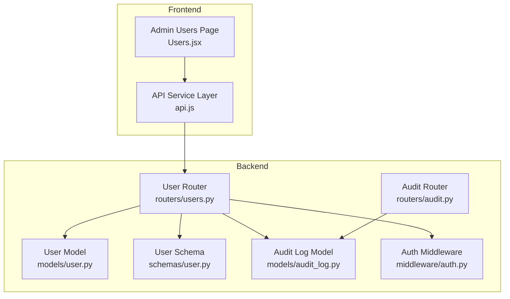
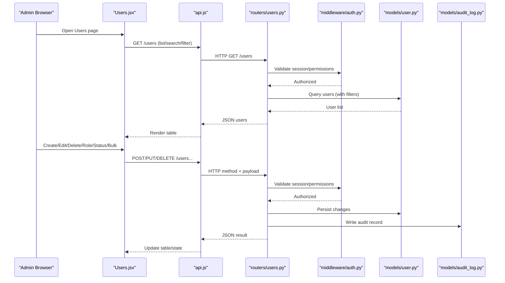
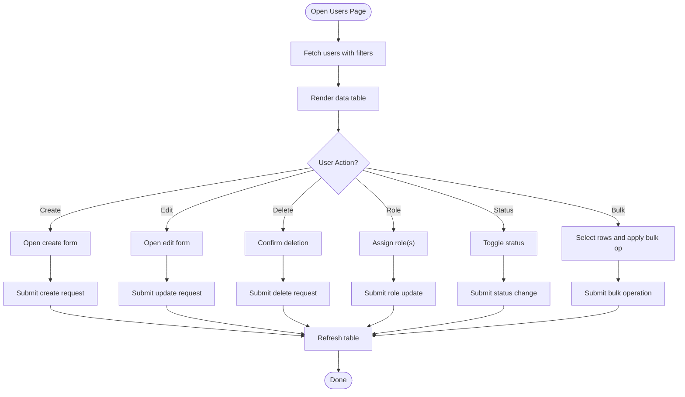
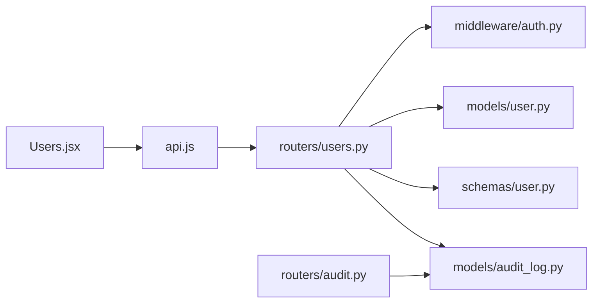

# User Management Interface

<cite>
**Referenced Files in This Document**
- [Users.jsx](file://frontend/src/pages/admin/Users.jsx)
- [api.js](file://frontend/src/services/api.js)
- [users.py](file://backend/app/routers/users.py)
- [user.py](file://backend/app/models/user.py)
- [user.py](file://backend/app/schemas/user.py)
- [audit_log.py](file://backend/app/models/audit_log.py)
- [audit.py](file://backend/app/routers/audit.py)
- [auth.py](file://backend/app/middleware/auth.py)
</cite>

## Table of Contents
1. [Introduction](#introduction)
2. [Project Structure](#project-structure)
3. [Core Components](#core-components)
4. [Architecture Overview](#architecture-overview)
5. [Detailed Component Analysis](#detailed-component-analysis)
6. [Dependency Analysis](#dependency-analysis)
7. [Performance Considerations](#performance-considerations)
8. [Troubleshooting Guide](#troubleshooting-guide)
9. [Conclusion](#conclusion)

## Introduction
This document describes the user management administrative interface, focusing on the Users component and its integration with backend APIs. It covers user creation, editing, deletion, role assignment, bulk operations, data table features (search and filtering), status management, permission enforcement, and audit trail integration for user administration tasks. The goal is to help administrators understand how to operate the interface effectively and how it interacts with the backend services.

## Project Structure
The user management feature spans both frontend and backend:
- Frontend: Admin page for users, UI components, and API service layer.
- Backend: REST endpoints for user CRUD, roles, status, and audit logging; models and schemas define data contracts.

**Diagram sources**
- [Users.jsx](file://frontend/src/pages/admin/Users.jsx)
- [api.js](file://frontend/src/services/api.js)
- [users.py](file://backend/app/routers/users.py)
- [user.py](file://backend/app/models/user.py)
- [user.py](file://backend/app/schemas/user.py)
- [audit_log.py](file://backend/app/models/audit_log.py)
- [audit.py](file://backend/app/routers/audit.py)
- [auth.py](file://backend/app/middleware/auth.py)

**Section sources**
- [Users.jsx](file://frontend/src/pages/admin/Users.jsx)
- [api.js](file://frontend/src/services/api.js)
- [users.py](file://backend/app/routers/users.py)
- [user.py](file://backend/app/models/user.py)
- [user.py](file://backend/app/schemas/user.py)
- [audit_log.py](file://backend/app/models/audit_log.py)
- [audit.py](file://backend/app/routers/audit.py)
- [auth.py](file://backend/app/middleware/auth.py)

## Core Components
- Users Admin Page: Provides a data table for listing users, search/filtering, pagination, and actions such as create, edit, delete, role assignment, and bulk operations. It also manages user status toggles and integrates with the API service layer.
- API Service Layer: Encapsulates HTTP calls to backend endpoints for user management and audit retrieval.
- Backend User Router: Implements REST endpoints for user CRUD, role updates, status changes, and bulk operations. Enforces authentication and authorization via middleware.
- Data Models and Schemas: Define database entities and request/response contracts for users and audit logs.
- Audit Integration: Records administrative actions on users and exposes an audit log endpoint for review.

Key responsibilities:
- Users.jsx: UI state, table rendering, search/filter inputs, action handlers, and API calls.
- api.js: Centralized client functions for user and audit endpoints.
- routers/users.py: Business logic for user operations, validation against schemas, persistence, and audit logging.
- models/user.py and schemas/user.py: Data definitions and validation rules.
- models/audit_log.py and routers/audit.py: Audit record storage and retrieval.

**Section sources**
- [Users.jsx](file://frontend/src/pages/admin/Users.jsx)
- [api.js](file://frontend/src/services/api.js)
- [users.py](file://backend/app/routers/users.py)
- [user.py](file://backend/app/models/user.py)
- [user.py](file://backend/app/schemas/user.py)
- [audit_log.py](file://backend/app/models/audit_log.py)
- [audit.py](file://backend/app/routers/audit.py)

## Architecture Overview
The admin interface follows a typical SPA-to-API architecture:
- The Users page renders a data table and dispatches actions through the API service.
- The API service sends requests to the backend user router.
- The user router validates input using schemas, persists changes via the user model, and writes audit records.
- Authentication and authorization are enforced by middleware before route handlers execute.
- Administrators can view audit trails via the audit router.

**Diagram sources**
- [Users.jsx](file://frontend/src/pages/admin/Users.jsx)
- [api.js](file://frontend/src/services/api.js)
- [users.py](file://backend/app/routers/users.py)
- [auth.py](file://backend/app/middleware/auth.py)
- [user.py](file://backend/app/models/user.py)
- [audit_log.py](file://backend/app/models/audit_log.py)

## Detailed Component Analysis

### Users Admin Page (Users.jsx)
Responsibilities:
- Renders a data table of users with columns for identity, roles, and status.
- Provides search and filter controls (e.g., by name, email, role, status).
- Supports pagination and sorting where applicable.
- Action buttons for creating new users, editing existing ones, deleting users, assigning roles, and toggling status.
- Bulk operations such as enabling/disabling multiple users or assigning roles in batch.
- Integrates with the API service layer for all data operations and refreshes the table after mutations.

Operational highlights:
- Search and filtering: Inputs update query parameters sent to the backend list endpoint.
- Status management: Toggle switches or buttons call the status update endpoint and reflect changes immediately.
- Role assignment: Dropdowns or modals allow selecting roles per user or in bulk.
- Deletion: Confirmation dialogs prevent accidental deletions; successful deletion removes rows from the table.
- Audit trail visibility: Administrators may navigate to the audit log to review user-related actions.

**Diagram sources**
- [Users.jsx](file://frontend/src/pages/admin/Users.jsx)
- [api.js](file://frontend/src/services/api.js)

**Section sources**
- [Users.jsx](file://frontend/src/pages/admin/Users.jsx)
- [api.js](file://frontend/src/services/api.js)

### API Service Layer (api.js)
Responsibilities:
- Exposes typed functions for user endpoints: list, get, create, update, delete, role update, status update, and bulk operations.
- Handles request headers (e.g., authentication tokens) and error mapping.
- Provides consistent response handling and optional retry or timeout configuration.

Integration points:
- Calls backend routes under the user management namespace.
- May include helper utilities for building query strings for search and filtering.

**Section sources**
- [api.js](file://frontend/src/services/api.js)

### Backend User Router (routers/users.py)
Responsibilities:
- Defines REST endpoints for user management:
  - List users with support for search and filtering parameters.
  - Get a single user by ID.
  - Create a new user.
  - Update user details and roles.
  - Delete a user.
  - Update user status (enable/disable).
  - Bulk operations (e.g., assign roles or toggle status for multiple users).
- Validates payloads using schemas.
- Persists changes via the user model.
- Writes audit records for administrative actions.
- Enforces authentication and authorization via middleware.

Security and permissions:
- Only authorized admins can perform user management operations.
- Role-based checks ensure that only permitted roles can be assigned.

Audit trail integration:
- Each mutation writes an audit entry describing the actor, action, target user, and relevant details.

**Section sources**
- [users.py](file://backend/app/routers/users.py)
- [user.py](file://backend/app/schemas/user.py)
- [user.py](file://backend/app/models/user.py)
- [audit_log.py](file://backend/app/models/audit_log.py)
- [auth.py](file://backend/app/middleware/auth.py)

### Data Models and Schemas
- User model: Represents the persisted user entity with fields such as identity, roles, and status.
- User schema: Defines validation rules and serialization for request and response bodies.
- Audit log model: Captures administrative actions including timestamp, actor, action type, and affected resources.

Data flow:
- Requests are validated against schemas before being applied to the model.
- Responses are serialized according to schemas for consistent API contracts.

**Section sources**
- [user.py](file://backend/app/models/user.py)
- [user.py](file://backend/app/schemas/user.py)
- [audit_log.py](file://backend/app/models/audit_log.py)

### Audit Trail Integration
Administrative actions on users are recorded in the audit log:
- Creation, updates, deletions, role assignments, and status changes generate entries.
- The audit router provides endpoints to retrieve audit logs, optionally filtered by resource type or time range.

Use cases:
- Compliance reporting for user lifecycle events.
- Forensic analysis of administrative changes.
- Visibility into who performed what action and when.

**Section sources**
- [audit_log.py](file://backend/app/models/audit_log.py)
- [audit.py](file://backend/app/routers/audit.py)
- [users.py](file://backend/app/routers/users.py)

## Dependency Analysis
The following diagram shows key dependencies between frontend and backend modules involved in user management.

**Diagram sources**
- [Users.jsx](file://frontend/src/pages/admin/Users.jsx)
- [api.js](file://frontend/src/services/api.js)
- [users.py](file://backend/app/routers/users.py)
- [auth.py](file://backend/app/middleware/auth.py)
- [user.py](file://backend/app/models/user.py)
- [user.py](file://backend/app/schemas/user.py)
- [audit_log.py](file://backend/app/models/audit_log.py)
- [audit.py](file://backend/app/routers/audit.py)

**Section sources**
- [Users.jsx](file://frontend/src/pages/admin/Users.jsx)
- [api.js](file://frontend/src/services/api.js)
- [users.py](file://backend/app/routers/users.py)
- [auth.py](file://backend/app/middleware/auth.py)
- [user.py](file://backend/app/models/user.py)
- [user.py](file://backend/app/schemas/user.py)
- [audit_log.py](file://backend/app/models/audit_log.py)
- [audit.py](file://backend/app/routers/audit.py)

## Performance Considerations
- Pagination and server-side filtering: Ensure large user lists are paginated and filtered on the backend to reduce payload sizes.
- Debounced search: Implement debouncing on search inputs to avoid excessive requests.
- Efficient queries: Use indexed columns for common filters (e.g., username, email, role, status).
- Batch operations: Prefer bulk endpoints for mass updates to minimize round trips.
- Caching: Consider short-lived caching for read-only list views if appropriate and safe.

[No sources needed since this section provides general guidance]

## Troubleshooting Guide
Common issues and resolutions:
- Authentication failures: Verify session/token validity and ensure the admin has required permissions. Check middleware behavior for authorization errors.
- Validation errors: Inspect request payloads against schemas; correct missing or invalid fields.
- Permission denied: Confirm the current user’s role allows the requested operation.
- Audit gaps: If audit entries are missing, verify that the audit write path is invoked for all mutations.
- Slow list performance: Review query filters, pagination, and indexes; consider adding server-side search.

**Section sources**
- [auth.py](file://backend/app/middleware/auth.py)
- [users.py](file://backend/app/routers/users.py)
- [user.py](file://backend/app/schemas/user.py)
- [audit_log.py](file://backend/app/models/audit_log.py)

## Conclusion
The user management interface provides a comprehensive administrative experience for managing users, roles, and statuses, backed by robust APIs and audit logging. By leveraging search, filtering, and bulk operations, administrators can efficiently maintain user accounts while ensuring security and compliance through permission checks and detailed audit trails.

[No sources needed since this section summarizes without analyzing specific files]