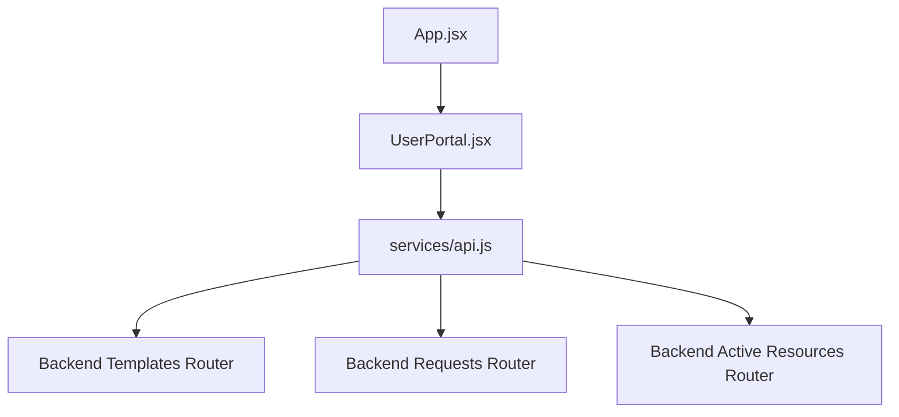
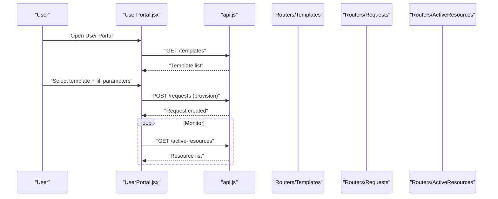
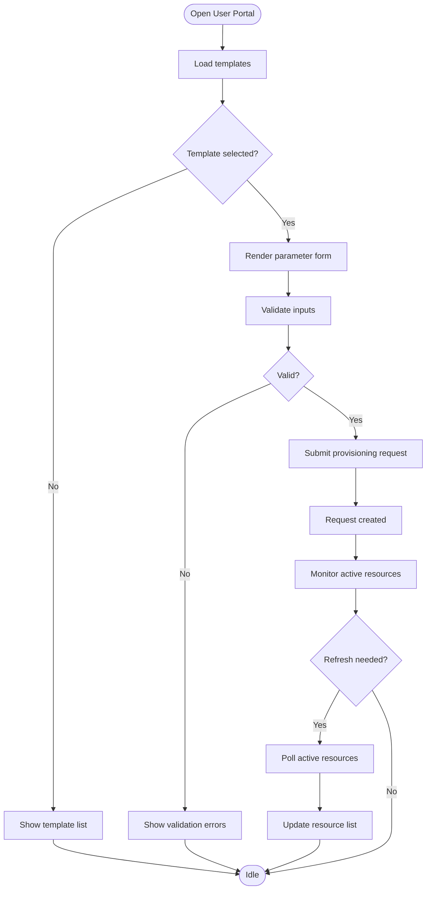
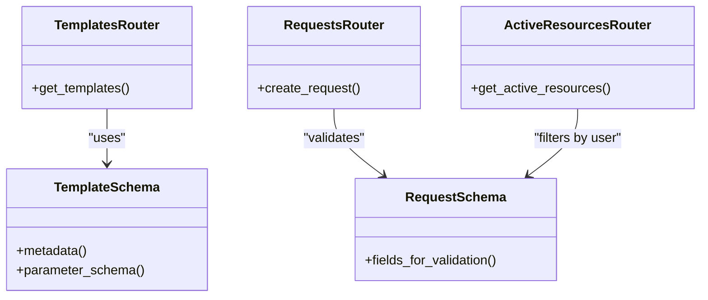
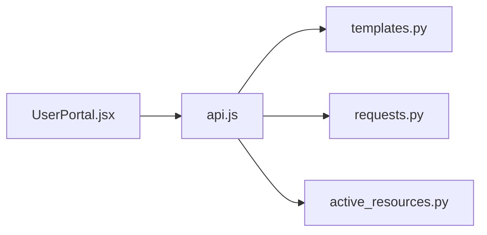

# User Portal Components

<cite>
**Referenced Files in This Document**
- [UserPortal.jsx](file://frontend/src/pages/user/UserPortal.jsx)
- [api.js](file://frontend/src/services/api.js)
- [App.jsx](file://frontend/src/App.jsx)
- [active_resources.py](file://backend/app/routers/active_resources.py)
- [requests.py](file://backend/app/routers/requests.py)
- [templates.py](file://backend/app/routers/templates.py)
- [request.py](file://backend/app/schemas/request.py)
- [template.py](file://backend/app/schemas/template.py)
</cite>

## Table of Contents
1. [Introduction](#introduction)
2. [Project Structure](#project-structure)
3. [Core Components](#core-components)
4. [Architecture Overview](#architecture-overview)
5. [Detailed Component Analysis](#detailed-component-analysis)
6. [Dependency Analysis](#dependency-analysis)
7. [Performance Considerations](#performance-considerations)
8. [Troubleshooting Guide](#troubleshooting-guide)
9. [Conclusion](#conclusion)

## Introduction
This document explains the user-facing portal components that enable self-service provisioning and monitoring of ECS instances. It focuses on the main UserPortal component, its resource management features, template selection and usage, request submission workflows, and active resource monitoring from a user perspective. It also covers component structure, state management patterns, API integration for user-specific operations, and end-to-end user experience flows.

## Project Structure
The user portal is implemented as a React application with a clear separation between UI components and API services:
- The primary user interface entry point for the portal is a page-level component that orchestrates templates, requests, and active resources.
- A dedicated service module encapsulates HTTP calls to backend endpoints for templates, requests, and active resources.
- The frontend routes into the user portal from the application root.

**Diagram sources**
- [App.jsx](file://frontend/src/App.jsx)
- [UserPortal.jsx](file://frontend/src/pages/user/UserPortal.jsx)
- [api.js](file://frontend/src/services/api.js)
- [templates.py](file://backend/app/routers/templates.py)
- [requests.py](file://backend/app/routers/requests.py)
- [active_resources.py](file://backend/app/routers/active_resources.py)

**Section sources**
- [App.jsx](file://frontend/src/App.jsx)
- [UserPortal.jsx](file://frontend/src/pages/user/UserPortal.jsx)
- [api.js](file://frontend/src/services/api.js)

## Core Components
- UserPortal (page-level component): Orchestrates the user experience by managing local state for selected templates, form inputs, request history, and active resources. It renders subviews or panels for template selection, request submission, and resource monitoring.
- API Service: Provides typed methods for fetching templates, submitting provisioning requests, and polling active resources. It centralizes error handling and request/response transformations.

Key responsibilities:
- Template selection and parameterization
- Request submission with validation feedback
- Active resource listing and refresh controls
- Error and loading states presentation

**Section sources**
- [UserPortal.jsx](file://frontend/src/pages/user/UserPortal.jsx)
- [api.js](file://frontend/src/services/api.js)

## Architecture Overview
The user portal follows a unidirectional data flow:
- User interactions update local state in the UserPortal component.
- State changes trigger API calls via the service layer.
- Responses update local state and re-render relevant UI sections.
- Polling or manual refresh triggers periodic updates for active resources.

**Diagram sources**
- [UserPortal.jsx](file://frontend/src/pages/user/UserPortal.jsx)
- [api.js](file://frontend/src/services/api.js)
- [templates.py](file://backend/app/routers/templates.py)
- [requests.py](file://backend/app/routers/requests.py)
- [active_resources.py](file://backend/app/routers/active_resources.py)

## Detailed Component Analysis

### UserPortal Component
Responsibilities:
- Load available templates and render a selection interface.
- Collect user parameters based on the chosen template schema.
- Submit provisioning requests and display status and history.
- Display active resources with refresh controls and contextual actions.
- Manage loading, success, and error states across views.

State management patterns:
- Local state holds current view, selected template, form values, request history, and active resources.
- Effects manage side effects such as initial data loads and periodic polling for active resources.
- Event handlers validate inputs before invoking API calls and update state upon completion.

User experience flows:
- Template selection: Users browse templates, choose one, and see required fields.
- Provisioning: Users submit a request; they receive immediate feedback and can track progress.
- Monitoring: Users view their active resources, refresh the list, and access details.

**Diagram sources**
- [UserPortal.jsx](file://frontend/src/pages/user/UserPortal.jsx)
- [api.js](file://frontend/src/services/api.js)

**Section sources**
- [UserPortal.jsx](file://frontend/src/pages/user/UserPortal.jsx)
- [api.js](file://frontend/src/services/api.js)

### API Integration Layer
The service module provides functions for:
- Fetching templates
- Submitting provisioning requests
- Retrieving active resources

It centralizes:
- Base URL configuration
- Headers and authentication token handling
- Error normalization and retry strategies where applicable

Typical method signatures (described conceptually):
- getTemplates(): returns a list of templates with metadata and parameter schemas
- createRequest(payload): submits a provisioning request and returns request metadata
- getActiveResources(): returns the current user’s active resources

Error handling:
- Network failures are surfaced to the UI with user-friendly messages
- Validation errors from the backend are mapped to field-level feedback when possible

**Section sources**
- [api.js](file://frontend/src/services/api.js)

### Backend Routers and Schemas Supporting the Portal
- Templates router: Exposes endpoints to retrieve available templates and their parameter schemas.
- Requests router: Accepts provisioning requests, associates them with the authenticated user, and persists them.
- Active resources router: Returns the current user’s active resources for monitoring.
- Request and template schemas: Define the shape of payloads and responses used by the frontend.

**Diagram sources**
- [templates.py](file://backend/app/routers/templates.py)
- [requests.py](file://backend/app/routers/requests.py)
- [active_resources.py](file://backend/app/routers/active_resources.py)
- [request.py](file://backend/app/schemas/request.py)
- [template.py](file://backend/app/schemas/template.py)

**Section sources**
- [templates.py](file://backend/app/routers/templates.py)
- [requests.py](file://backend/app/routers/requests.py)
- [active_resources.py](file://backend/app/routers/active_resources.py)
- [request.py](file://backend/app/schemas/request.py)
- [template.py](file://backend/app/schemas/template.py)

## Dependency Analysis
Frontend dependencies:
- UserPortal depends on the API service for all network operations.
- The API service depends on backend routers for templates, requests, and active resources.

**Diagram sources**
- [UserPortal.jsx](file://frontend/src/pages/user/UserPortal.jsx)
- [api.js](file://frontend/src/services/api.js)
- [templates.py](file://backend/app/routers/templates.py)
- [requests.py](file://backend/app/routers/requests.py)
- [active_resources.py](file://backend/app/routers/active_resources.py)

**Section sources**
- [UserPortal.jsx](file://frontend/src/pages/user/UserPortal.jsx)
- [api.js](file://frontend/src/services/api.js)
- [templates.py](file://backend/app/routers/templates.py)
- [requests.py](file://backend/app/routers/requests.py)
- [active_resources.py](file://backend/app/routers/active_resources.py)

## Performance Considerations
- Debounce or throttle active resource polling to avoid excessive requests.
- Cache template lists locally until invalidated by server events or explicit refresh.
- Paginate or limit active resource results if the dataset grows large.
- Use optimistic UI updates for non-critical actions to improve perceived responsiveness.

[No sources needed since this section provides general guidance]

## Troubleshooting Guide
Common issues and resolutions:
- Authentication failures: Ensure tokens are present and valid; verify headers are set by the API service.
- Template load errors: Check network connectivity and backend availability; inspect error messages returned by the templates endpoint.
- Request submission failures: Validate input against the template schema; review backend validation errors and map them to UI fields.
- Stale active resources: Trigger a manual refresh; confirm polling intervals and error retries.

Operational checks:
- Verify base URL configuration in the API service.
- Confirm CORS settings if running dev servers separately.
- Inspect browser network tab for request/response payloads and status codes.

**Section sources**
- [api.js](file://frontend/src/services/api.js)
- [UserPortal.jsx](file://frontend/src/pages/user/UserPortal.jsx)

## Conclusion
The UserPortal component provides a cohesive self-service experience for selecting templates, submitting provisioning requests, and monitoring active resources. Its architecture separates concerns between UI orchestration and API integration, enabling clear state management and predictable user flows. By leveraging well-defined backend routers and schemas, the portal ensures consistent validation, reliable persistence, and accurate resource visibility for end users.