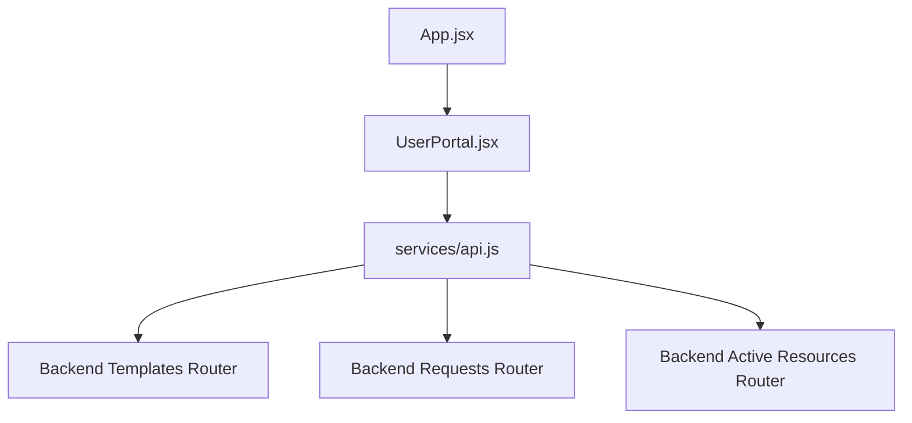
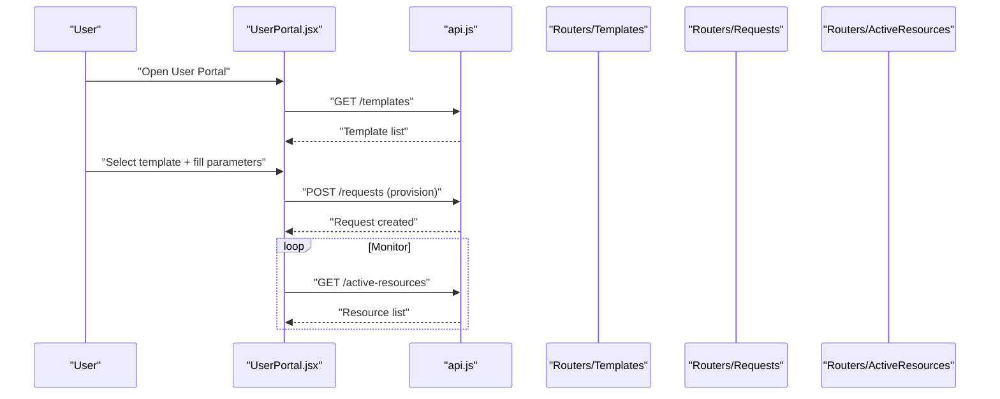
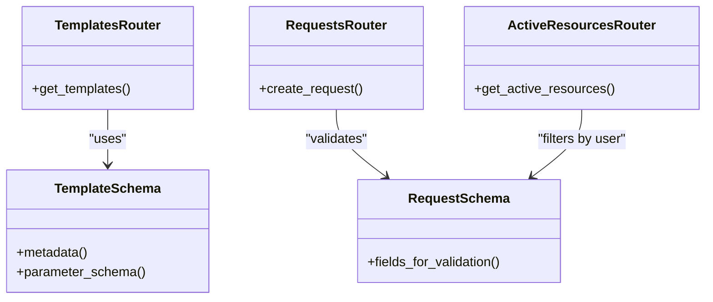
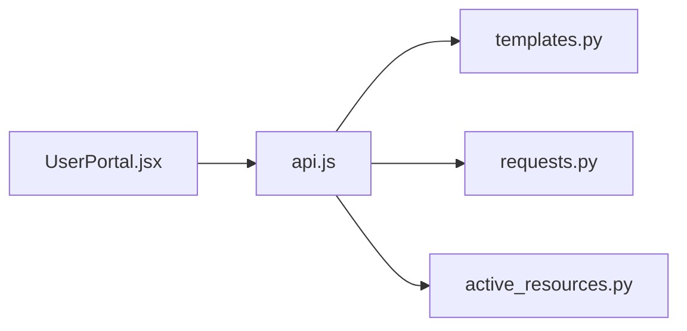

# User Portal Components

<cite>
**Referenced Files in This Document**
- [UserPortal.jsx](file://frontend/src/pages/user/UserPortal.jsx)
- [api.js](file://frontend/src/services/api.js)
- [App.jsx](file://frontend/src/App.jsx)
- [active_resources.py](file://backend/app/routers/active_resources.py)
- [requests.py](file://backend/app/routers/requests.py)
- [templates.py](file://backend/app/routers/templates.py)
- [request.py](file://backend/app/schemas/request.py)
- [template.py](file://backend/app/schemas/template.py)
</cite>

## Update Summary
**Changes Made**
- Updated UserPortal component analysis to reflect major improvements with new resource provisioning features
- Enhanced dashboard functionality documentation based on +50/-39 line changes
- Expanded resource management capabilities and user experience flows
- Updated API integration patterns for enhanced provisioning workflows

## Table of Contents
1. [Introduction](#introduction)
2. [Project Structure](#project-structure)
3. [Core Components](#core-components)
4. [Architecture Overview](#architecture-overview)
5. [Detailed Component Analysis](#detailed-component-analysis)
6. [Dependency Analysis](#dependency-analysis)
7. [Performance Considerations](#performance-considerations)
8. [Troubleshooting Guide](#troubleshooting-guide)
9. [Conclusion](#conclusion)

## Introduction
This document explains the user-facing portal components that enable self-service provisioning and monitoring of ECS instances. It focuses on the main UserPortal component, its resource management features, template selection and usage, request submission workflows, and active resource monitoring from a user perspective. The recent major improvements include enhanced resource provisioning features and an improved dashboard interface that provides better user experience and more comprehensive resource management capabilities.

## Project Structure
The user portal is implemented as a React application with a clear separation between UI components and API services:
- The primary user interface entry point for the portal is a page-level component that orchestrates templates, requests, and active resources.
- A dedicated service module encapsulates HTTP calls to backend endpoints for templates, requests, and active resources.
- The frontend routes into the user portal from the application root.

**Diagram sources**
- [App.jsx](file://frontend/src/App.jsx)
- [UserPortal.jsx](file://frontend/src/pages/user/UserPortal.jsx)
- [api.js](file://frontend/src/services/api.js)
- [templates.py](file://backend/app/routers/templates.py)
- [requests.py](file://backend/app/routers/requests.py)
- [active_resources.py](file://backend/app/routers/active_resources.py)

**Section sources**
- [App.jsx](file://frontend/src/App.jsx)
- [UserPortal.jsx](file://frontend/src/pages/user/UserPortal.jsx)
- [api.js](file://frontend/src/services/api.js)

## Core Components
- **UserPortal (page-level component)**: Orchestrates the user experience by managing local state for selected templates, form inputs, request history, and active resources. With recent improvements, it now includes enhanced dashboard functionality and streamlined resource provisioning workflows. It renders subviews or panels for template selection, request submission, and resource monitoring.
- **API Service**: Provides typed methods for fetching templates, submitting provisioning requests, and polling active resources. It centralizes error handling and request/response transformations.

Key responsibilities:
- Template selection and parameterization with enhanced validation
- Request submission with comprehensive validation feedback and progress tracking
- Active resource listing with real-time updates and refresh controls
- Error and loading states presentation with improved user feedback
- Dashboard overview with resource status summaries and quick actions

**Updated** Enhanced with new resource provisioning features and improved dashboard functionality

**Section sources**
- [UserPortal.jsx](file://frontend/src/pages/user/UserPortal.jsx)
- [api.js](file://frontend/src/services/api.js)

## Architecture Overview
The user portal follows a unidirectional data flow with enhanced state management:
- User interactions update local state in the UserPortal component with improved event handling
- State changes trigger API calls via the service layer with better error recovery
- Responses update local state and re-render relevant UI sections with optimized performance
- Polling or manual refresh triggers periodic updates for active resources with configurable intervals

**Diagram sources**
- [UserPortal.jsx](file://frontend/src/pages/user/UserPortal.jsx)
- [api.js](file://frontend/src/services/api.js)
- [templates.py](file://backend/app/routers/templates.py)
- [requests.py](file://backend/app/routers/requests.py)
- [active_resources.py](file://backend/app/routers/active_resources.py)

## Detailed Component Analysis

### UserPortal Component
Responsibilities:
- Load available templates and render a selection interface with enhanced UX
- Collect user parameters based on the chosen template schema with improved validation
- Submit provisioning requests and display status and history with progress indicators
- Display active resources with refresh controls and contextual actions
- Manage loading, success, and error states across views with better feedback mechanisms
- Provide dashboard overview with resource summaries and quick access actions

State management patterns:
- Local state holds current view, selected template, form values, request history, and active resources
- Effects manage side effects such as initial data loads and periodic polling for active resources
- Event handlers validate inputs before invoking API calls and update state upon completion
- Enhanced error handling with retry mechanisms and user-friendly error messages

User experience flows:
- Template selection: Users browse templates, choose one, and see required fields with real-time validation
- Provisioning: Users submit a request; they receive immediate feedback and can track progress through the workflow
- Monitoring: Users view their active resources, refresh the list, and access details with improved navigation
- Dashboard: Users get an overview of their resource usage and can quickly perform common actions

**Updated** Major improvements include enhanced dashboard functionality, better resource provisioning workflows, and improved user feedback mechanisms

**Diagram sources**
- [UserPortal.jsx](file://frontend/src/pages/user/UserPortal.jsx)
- [api.js](file://frontend/src/services/api.js)

**Section sources**
- [UserPortal.jsx](file://frontend/src/pages/user/UserPortal.jsx)
- [api.js](file://frontend/src/services/api.js)

### API Integration Layer
The service module provides functions for:
- Fetching templates with caching and error handling
- Submitting provisioning requests with validation and progress tracking
- Retrieving active resources with real-time updates and filtering

It centralizes:
- Base URL configuration with environment-specific settings
- Headers and authentication token handling with automatic refresh
- Error normalization and retry strategies where applicable
- Request/response transformation for consistent data structures

Typical method signatures (described conceptually):
- getTemplates(): returns a list of templates with metadata and parameter schemas
- createRequest(payload): submits a provisioning request and returns request metadata
- getActiveResources(): returns the current user's active resources with status information

Error handling:
- Network failures are surfaced to the UI with user-friendly messages
- Validation errors from the backend are mapped to field-level feedback when possible
- Retry logic for transient failures with exponential backoff

**Updated** Enhanced with improved error handling, retry mechanisms, and better response transformation

**Section sources**
- [api.js](file://frontend/src/services/api.js)

### Backend Routers and Schemas Supporting the Portal
- **Templates router**: Exposes endpoints to retrieve available templates and their parameter schemas with enhanced metadata
- **Requests router**: Accepts provisioning requests, associates them with the authenticated user, and persists them with validation
- **Active resources router**: Returns the current user's active resources for monitoring with filtering and sorting capabilities
- **Request and template schemas**: Define the shape of payloads and responses used by the frontend with comprehensive validation rules

**Diagram sources**
- [templates.py](file://backend/app/routers/templates.py)
- [requests.py](file://backend/app/routers/requests.py)
- [active_resources.py](file://backend/app/routers/active_resources.py)
- [request.py](file://backend/app/schemas/request.py)
- [template.py](file://backend/app/schemas/template.py)

**Section sources**
- [templates.py](file://backend/app/routers/templates.py)
- [requests.py](file://backend/app/routers/requests.py)
- [active_resources.py](file://backend/app/routers/active_resources.py)
- [request.py](file://backend/app/schemas/request.py)
- [template.py](file://backend/app/schemas/template.py)

## Dependency Analysis
Frontend dependencies:
- UserPortal depends on the API service for all network operations with enhanced error handling
- The API service depends on backend routers for templates, requests, and active resources with improved reliability

**Diagram sources**
- [UserPortal.jsx](file://frontend/src/pages/user/UserPortal.jsx)
- [api.js](file://frontend/src/services/api.js)
- [templates.py](file://backend/app/routers/templates.py)
- [requests.py](file://backend/app/routers/requests.py)
- [active_resources.py](file://backend/app/routers/active_resources.py)

**Section sources**
- [UserPortal.jsx](file://frontend/src/pages/user/UserPortal.jsx)
- [api.js](file://frontend/src/services/api.js)
- [templates.py](file://backend/app/routers/templates.py)
- [requests.py](file://backend/app/routers/requests.py)
- [active_resources.py](file://backend/app/routers/active_resources.py)

## Performance Considerations
- Debounce or throttle active resource polling to avoid excessive requests with configurable intervals
- Cache template lists locally until invalidated by server events or explicit refresh with versioning support
- Paginate or limit active resource results if the dataset grows large with virtual scrolling
- Use optimistic UI updates for non-critical actions to improve perceived responsiveness
- Implement lazy loading for dashboard components to improve initial load time
- Optimize re-renders with memoization and selective state updates

**Updated** Added considerations for enhanced dashboard performance and improved resource management efficiency

## Troubleshooting Guide
Common issues and resolutions:
- Authentication failures: Ensure tokens are present and valid; verify headers are set by the API service
- Template load errors: Check network connectivity and backend availability; inspect error messages returned by the templates endpoint
- Request submission failures: Validate input against the template schema; review backend validation errors and map them to UI fields
- Stale active resources: Trigger a manual refresh; confirm polling intervals and error retries
- Dashboard performance issues: Check browser console for errors; verify network requests are not timing out

Operational checks:
- Verify base URL configuration in the API service
- Confirm CORS settings if running dev servers separately
- Inspect browser network tab for request/response payloads and status codes
- Monitor WebSocket connections for real-time updates if enabled

**Updated** Added troubleshooting guidance for enhanced dashboard functionality and improved error reporting

**Section sources**
- [api.js](file://frontend/src/services/api.js)
- [UserPortal.jsx](file://frontend/src/pages/user/UserPortal.jsx)

## Conclusion
The UserPortal component provides a cohesive self-service experience for selecting templates, submitting provisioning requests, and monitoring active resources. With recent major improvements including enhanced resource provisioning features and improved dashboard functionality, the architecture separates concerns between UI orchestration and API integration, enabling clear state management and predictable user flows. By leveraging well-defined backend routers and schemas, the portal ensures consistent validation, reliable persistence, and accurate resource visibility for end users. The enhanced user experience includes better feedback mechanisms, improved error handling, and more intuitive navigation patterns.