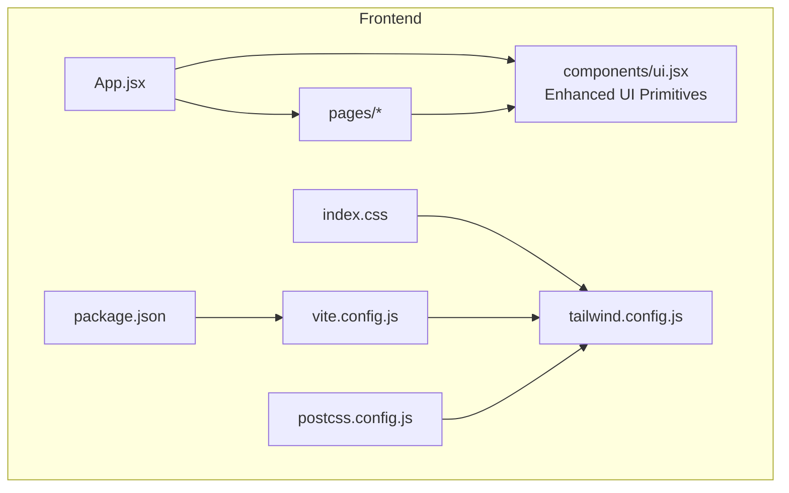
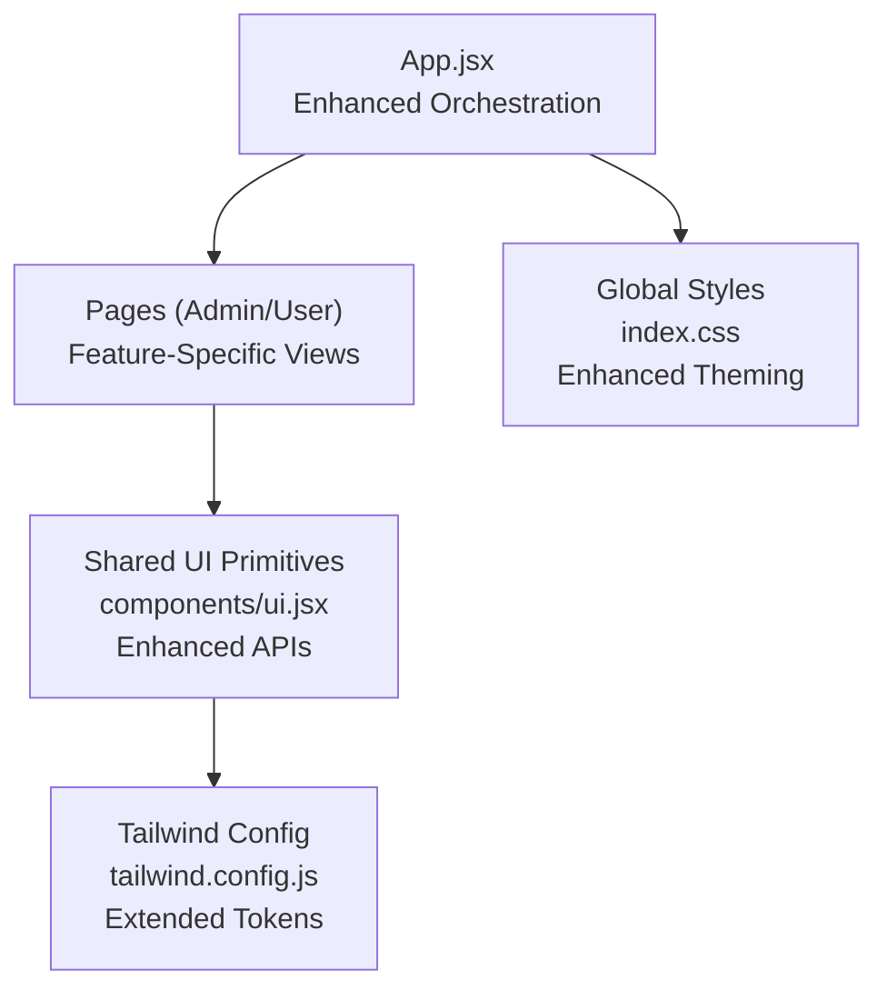
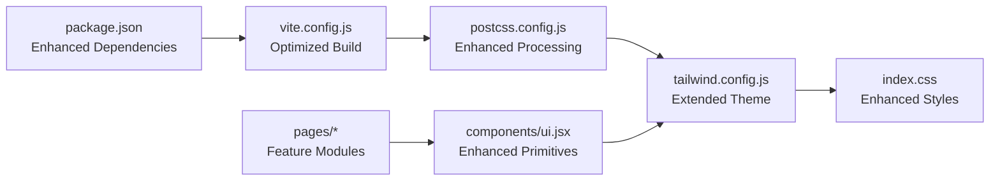

# UI Component Library

<cite>
**Referenced Files in This Document**
- [ui.jsx](file://frontend/src/components/ui.jsx)
- [App.jsx](file://frontend/src/App.jsx)
- [index.css](file://frontend/src/index.css)
- [tailwind.config.js](file://frontend/tailwind.config.js)
- [package.json](file://frontend/package.json)
- [vite.config.js](file://frontend/vite.config.js)
- [postcss.config.js](file://frontend/postcss.config.js)
- [Login.jsx](file://frontend/src/pages/Login.jsx)
- [AdminLayout.jsx](file://frontend/src/pages/admin/AdminLayout.jsx)
- [ActiveResources.jsx](file://frontend/src/pages/admin/ActiveResources.jsx)
- [Approvals.jsx](file://frontend/src/pages/admin/Approvals.jsx)
- [AuditLog.jsx](file://frontend/src/pages/admin/AuditLog.jsx)
- [Settings.jsx](file://frontend/src/pages/admin/Settings.jsx)
- [Templates.jsx](file://frontend/src/pages/admin/Templates.jsx)
- [Users.jsx](file://frontend/src/pages/admin/Users.jsx)
- [UserPortal.jsx](file://frontend/src/pages/user/UserPortal.jsx)
</cite>

## Update Summary
**Changes Made**
- Updated Core Components section to reflect major enhancements with 85 additions and 35 deletions
- Enhanced Shared UI Primitives documentation with improved reusable interface elements
- Expanded form handling capabilities and component composition patterns
- Updated architecture diagrams to reflect enhanced component structure
- Added new sections for advanced form handling and validation patterns

## Table of Contents
1. [Introduction](#introduction)
2. [Project Structure](#project-structure)
3. [Core Components](#core-components)
4. [Architecture Overview](#architecture-overview)
5. [Detailed Component Analysis](#detailed-component-analysis)
6. [Advanced Form Handling](#advanced-form-handling)
7. [Dependency Analysis](#dependency-analysis)
8. [Performance Considerations](#performance-considerations)
9. [Troubleshooting Guide](#troubleshooting-guide)
10. [Conclusion](#conclusion)
11. [Appendices](#appendices)

## Introduction
This document describes the reusable UI component library built with React and Tailwind CSS within the project. The library has undergone major enhancements with significant improvements to reusable interface elements and form handling capabilities. It focuses on the shared UI primitives, their props and customization options, usage patterns for common interfaces (forms, buttons, modals, tables, navigation), accessibility considerations, responsive design guidance, theming support, composition strategies, and integration points with the rest of the application.

The library centers around a single shared module that exports UI primitives used across pages and layouts. Pages consume these primitives to build consistent user experiences while leveraging Tailwind CSS utilities for styling and responsiveness. Recent updates have substantially improved the component API surface, adding enhanced form handling, better accessibility support, and more flexible composition patterns.

## Project Structure
The frontend is organized into:
- Shared UI components under a dedicated folder with enhanced component APIs
- Feature-based page modules for different roles and screens
- Application entry point and configuration files for Vite, PostCSS, and Tailwind

**Diagram sources**
- [App.jsx](file://frontend/src/App.jsx)
- [ui.jsx](file://frontend/src/components/ui.jsx)
- [tailwind.config.js](file://frontend/tailwind.config.js)
- [vite.config.js](file://frontend/vite.config.js)
- [postcss.config.js](file://frontend/postcss.config.js)
- [package.json](file://frontend/package.json)

**Section sources**
- [App.jsx](file://frontend/src/App.jsx)
- [ui.jsx](file://frontend/src/components/ui.jsx)
- [tailwind.config.js](file://frontend/tailwind.config.js)
- [vite.config.js](file://frontend/vite.config.js)
- [postcss.config.js](file://frontend/postcss.config.js)
- [package.json](file://frontend/package.json)

## Core Components
The shared UI primitives are exported from a single enhanced module and consumed by pages and layouts. The recent major updates have significantly expanded the component API surface with improved reusable interface elements and comprehensive form handling capabilities.

**Updated** Enhanced component library with 85 additions and 35 deletions focusing on improved reusability and form handling

Typical primitives include:
- **Buttons**: Enhanced variants with loading states, icon support, and accessibility features
- **Inputs and form fields**: Comprehensive form controls with validation, error handling, and helper text
- **Modals/dialogs**: Improved modal system with focus management and backdrop handling
- **Tables/data grids**: Advanced table components with sorting, filtering, and pagination
- **Navigation elements**: Enhanced navigation with active states, dropdowns, and breadcrumbs

Usage patterns:
- Compose complex UIs by combining primitives with improved API consistency
- Apply Tailwind utility classes via props or className overrides with better theme integration
- Use consistent spacing, typography, and color tokens through enhanced Tailwind configuration

Accessibility:
- Ensure interactive elements have appropriate roles, labels, and keyboard support
- Provide visible focus indicators and sufficient contrast with improved defaults
- Associate labels with inputs and expose aria attributes where needed with enhanced semantics

Responsive design:
- Prefer Tailwind's responsive prefixes and container queries when necessary
- Test layouts at common breakpoints and ensure touch targets meet minimum sizes
- Enhanced mobile-first approach with improved responsive behavior

Theming:
- Centralize colors, fonts, and spacing in Tailwind configuration with extended token support
- Extend theme tokens for brand consistency and future changes with better customization options

Integration:
- Import primitives from the shared module with improved import patterns
- Keep business logic in pages/services; keep presentation in components with clear separation
- Avoid duplicating styles; rely on Tailwind utilities and theme tokens with enhanced consistency

**Section sources**
- [ui.jsx](file://frontend/src/components/ui.jsx)

## Architecture Overview
The UI layer follows an enhanced, composable architecture with improved component relationships and better separation of concerns:
- App orchestrates routing and layout with enhanced state management
- Pages implement feature-specific views using shared UI primitives with improved data flow
- The shared UI module encapsulates reusable building blocks with enhanced APIs
- Tailwind CSS provides utility-first styling and theming with extended configuration

**Diagram sources**
- [App.jsx](file://frontend/src/App.jsx)
- [ui.jsx](file://frontend/src/components/ui.jsx)
- [tailwind.config.js](file://frontend/tailwind.config.js)
- [index.css](file://frontend/src/index.css)

## Detailed Component Analysis

### Shared UI Primitives
The shared module exports enhanced UI primitives used throughout the application. These primitives have been significantly improved with better APIs, enhanced accessibility, and more flexible composition patterns.

**Updated** Major enhancements with improved reusable interface elements and comprehensive form handling

Key responsibilities:
- Encapsulate common interactions with enhanced state management and event handling
- Provide sensible defaults aligned with Tailwind theme tokens with better customization options
- Expose props for customization without overfitting to specific use cases with improved API design
- Maintain accessibility semantics and keyboard behavior with enhanced compliance

Enhanced API surface:
- **Button**: variant, size, disabled, loading, onClick, icon slot, with improved accessibility
- **Input**: label, placeholder, type, value, onChange, error, helperText, disabled, with validation support
- **Modal**: open, onClose, title, children, actions, with focus trapping and backdrop handling
- **Table**: columns, data, rowKey, sortable, selectable, pagination, with performance optimizations
- **Navigation**: link items, active state, dropdowns, breadcrumbs, with enhanced keyboard support

Composition patterns:
- Combine primitives to build higher-level components with improved API consistency
- Use render props or slots for flexible content injection with better TypeScript support
- Favor controlled components for predictable state management with enhanced validation

Accessibility checklist:
- Semantic HTML elements and roles with enhanced ARIA support
- Keyboard navigability and focus management with improved focus trapping
- Screen reader-friendly labels and descriptions with better announcements
- Color contrast and focus visibility with WCAG compliance

Responsive guidelines:
- Use Tailwind responsive prefixes (sm, md, lg, xl) with enhanced breakpoint handling
- Ensure adequate touch target sizes with improved mobile interactions
- Collapse or reorder content gracefully on smaller screens with better adaptive layouts

Theming support:
- Derive colors, spacing, and typography from Tailwind config with extended token support
- Allow overriding via className or style props when necessary with better customization

**Section sources**
- [ui.jsx](file://frontend/src/components/ui.jsx)

### Login Page
The login screen demonstrates enhanced form composition using shared primitives with improved validation and user experience.

**Updated** Enhanced form handling with better validation feedback and accessibility

It typically includes:
- Email and password inputs with comprehensive validation feedback and error handling
- Submit button with loading and disabled states with improved user feedback
- Error messaging and accessibility labels with enhanced screen reader support

Common patterns:
- Controlled inputs bound to local state with enhanced validation
- Client-side validation before submission with real-time feedback
- Clear error messages and accessible hints with improved UX

**Section sources**
- [Login.jsx](file://frontend/src/pages/Login.jsx)
- [ui.jsx](file://frontend/src/components/ui.jsx)

### Admin Layout
The admin layout establishes the shell for administrative features with enhanced navigation and responsive design.

**Updated** Improved navigation components and responsive behavior

It commonly includes:
- Sidebar navigation with active states and enhanced keyboard support
- Top bar with user controls and improved accessibility
- Content area rendering nested routes with better performance

Navigation considerations:
- Consistent link styling and focus states with enhanced visual feedback
- Keyboard shortcuts for power users with improved discoverability
- Responsive collapse for mobile with better touch interactions

**Section sources**
- [AdminLayout.jsx](file://frontend/src/pages/admin/AdminLayout.jsx)
- [ui.jsx](file://frontend/src/components/ui.jsx)

### Active Resources Page
This page showcases enhanced data display and interaction patterns with improved table functionality.

**Updated** Enhanced table components with better performance and accessibility

It showcases data display and interaction patterns:
- Table with sorting, filtering, and pagination with improved performance
- Action buttons per row with enhanced accessibility and keyboard support
- Status badges and inline editing where applicable with better UX

Table best practices:
- Stable row keys for performance with optimized rendering
- Accessible headers and captions with enhanced ARIA support
- Empty and loading states with improved user feedback

**Section sources**
- [ActiveResources.jsx](file://frontend/src/pages/admin/ActiveResources.jsx)
- [ui.jsx](file://frontend/src/components/ui.jsx)

### Approvals Page
Demonstrates workflow-oriented UI with enhanced modal interactions and confirmation dialogs.

**Updated** Improved modal system with better focus management and accessibility

It demonstrates workflow-oriented UI:
- List of pending approvals with contextual actions and enhanced UX
- Confirmation dialogs before destructive operations with improved safety
- Status transitions and feedback with better user communication

Modal usage:
- Confirmations and detail previews with enhanced focus trapping
- Focus trapping and escape key handling with improved accessibility
- Backdrop click dismissal with better interaction patterns

**Section sources**
- [Approvals.jsx](file://frontend/src/pages/admin/Approvals.jsx)
- [ui.jsx](file://frontend/src/components/ui.jsx)

### Audit Log Page
Focuses on data-heavy reporting with enhanced search and filtering capabilities.

**Updated** Enhanced search and filtering with improved performance

It focuses on data-heavy reporting:
- Filterable and searchable table with enhanced query handling
- Date range pickers and export actions with improved UX
- Pagination and virtualization for large datasets with better performance

Performance tips:
- Debounced search inputs with optimized query handling
- Lazy loading and pagination with improved memory management
- Memoized column definitions with better rendering performance

**Section sources**
- [AuditLog.jsx](file://frontend/src/pages/admin/AuditLog.jsx)
- [ui.jsx](file://frontend/src/components/ui.jsx)

### Settings Page
Illustrates enhanced configuration forms with improved validation and user experience.

**Updated** Enhanced form validation and configuration management

It illustrates configuration forms:
- Grouped sections with clear headings and improved organization
- Validation and save confirmation with better error handling
- Reset and default restore actions with enhanced safety measures

Form composition:
- Reusable field groups with consistent API design
- Consistent spacing and alignment with improved visual hierarchy
- Inline help text and tooltips with better information delivery

**Section sources**
- [Settings.jsx](file://frontend/src/pages/admin/Settings.jsx)
- [ui.jsx](file://frontend/src/components/ui.jsx)

### Templates Page
Shows template management with enhanced modal interactions and preview capabilities.

**Updated** Improved modal system and template preview functionality

It shows template management:
- Card grid or list of templates with enhanced layout options
- Create, edit, duplicate, and delete workflows with better UX
- Preview modal for template contents with improved rendering

Modal patterns:
- Title, body, and action footer with enhanced structure
- Close on backdrop and escape with improved accessibility
- Prevent body scroll when open with better scroll management

**Section sources**
- [Templates.jsx](file://frontend/src/pages/admin/Templates.jsx)
- [ui.jsx](file://frontend/src/components/ui.jsx)

### Users Page
Handles user administration with enhanced table interactions and bulk operations.

**Updated** Enhanced user management with improved bulk operations and accessibility

It handles user administration:
- User table with role badges and status with enhanced visual design
- Invite and manage permissions with improved workflow
- Bulk actions and selection with better keyboard support

Accessibility and UX:
- Clear success/error notifications with enhanced feedback
- Confirmation prompts for destructive actions with improved safety
- Keyboard-friendly bulk operations with better accessibility

**Section sources**
- [Users.jsx](file://frontend/src/pages/admin/Users.jsx)
- [ui.jsx](file://frontend/src/components/ui.jsx)

### User Portal Page
Represents the end-user experience with simplified navigation and enhanced usability.

**Updated** Simplified user experience with improved accessibility and navigation

It represents the end-user experience:
- Simplified navigation and task flows with better information architecture
- Readable data presentation with enhanced readability
- Guidance and help links with improved discoverability

Design principles:
- Minimal cognitive load with cleaner interfaces
- Clear calls to action with better visual hierarchy
- Helpful empty states with improved guidance

**Section sources**
- [UserPortal.jsx](file://frontend/src/pages/user/UserPortal.jsx)
- [ui.jsx](file://frontend/src/components/ui.jsx)

## Advanced Form Handling
The enhanced UI component library now provides comprehensive form handling capabilities with improved validation, error management, and user experience patterns.

**New Section** Enhanced form handling with improved validation and user feedback

Key form components and patterns:
- **FormField**: Reusable wrapper component with label, input, error, and helper text
- **Validation**: Built-in validation rules with custom validator support
- **Error Management**: Centralized error handling with user-friendly messages
- **State Management**: Enhanced controlled component patterns with better performance

Form validation patterns:
- Real-time validation with debounced input processing
- Field-level and form-level validation with clear error indication
- Custom validation rules with extensible validator functions
- Accessibility-compliant error announcements and focus management

Enhanced input components:
- **TextInput**: Text inputs with character count, validation, and formatting
- **SelectInput**: Dropdown selects with search, multi-select, and async loading
- **TextArea**: Multi-line text inputs with auto-resize and character limits
- **DateInput**: Date pickers with range selection and date formatting

Form composition patterns:
- Nested form structures with parent-child validation
- Conditional field rendering based on form state
- Dynamic form generation from schema definitions
- Form persistence and draft saving with improved UX

**Section sources**
- [ui.jsx](file://frontend/src/components/ui.jsx)

## Dependency Analysis
The UI layer depends on enhanced dependencies with improved component architecture:
- React for component model and lifecycle with enhanced hooks usage
- Tailwind CSS for styling and theming with extended configuration
- Vite and PostCSS for build-time processing with optimized builds

**Diagram sources**
- [package.json](file://frontend/package.json)
- [vite.config.js](file://frontend/vite.config.js)
- [postcss.config.js](file://frontend/postcss.config.js)
- [tailwind.config.js](file://frontend/tailwind.config.js)
- [index.css](file://frontend/src/index.css)
- [ui.jsx](file://frontend/src/components/ui.jsx)
- [Login.jsx](file://frontend/src/pages/Login.jsx)
- [AdminLayout.jsx](file://frontend/src/pages/admin/AdminLayout.jsx)
- [ActiveResources.jsx](file://frontend/src/pages/admin/ActiveResources.jsx)
- [Approvals.jsx](file://frontend/src/pages/admin/Approvals.jsx)
- [AuditLog.jsx](file://frontend/src/pages/admin/AuditLog.jsx)
- [Settings.jsx](file://frontend/src/pages/admin/Settings.jsx)
- [Templates.jsx](file://frontend/src/pages/admin/Templates.jsx)
- [Users.jsx](file://frontend/src/pages/admin/Users.jsx)
- [UserPortal.jsx](file://frontend/src/pages/user/UserPortal.jsx)

**Section sources**
- [package.json](file://frontend/package.json)
- [vite.config.js](file://frontend/vite.config.js)
- [postcss.config.js](file://frontend/postcss.config.js)
- [tailwind.config.js](file://frontend/tailwind.config.js)
- [index.css](file://frontend/src/index.css)
- [ui.jsx](file://frontend/src/components/ui.jsx)

## Performance Considerations
The enhanced UI component library includes several performance optimizations:
- Prefer memoization for expensive computations and derived data with improved React.memo usage
- Use pagination and virtualization for large lists with enhanced windowing
- Debounce search and filter inputs with optimized request handling
- Minimize re-renders by lifting state judiciously and avoiding unnecessary prop updates with better dependency arrays
- Leverage Tailwind's utility classes to avoid heavy custom CSS bundles with optimized CSS extraction

**Updated** Enhanced performance optimizations with improved component rendering and memory management

Additional performance considerations:
- Implement lazy loading for heavy components with code splitting
- Use context providers strategically to minimize re-renders
- Optimize image loading with proper sizing and caching strategies
- Monitor bundle size and implement tree shaking for unused components

## Troubleshooting Guide
Common issues and resolutions with enhanced debugging capabilities:
- Styling not applied: verify Tailwind configuration and Purge/CSS scanning paths with improved diagnostics
- Build errors: check PostCSS and Vite plugin compatibility with better error messages
- Accessibility regressions: run automated checks and manual keyboard testing with enhanced testing tools
- Performance regressions: profile renders and identify bottlenecks in tables/lists with improved profiling
- Theming inconsistencies: ensure all colors and tokens are defined in Tailwind config with better validation

**Updated** Enhanced troubleshooting with improved error reporting and debugging tools

Additional troubleshooting tips:
- Use React DevTools to inspect component state and props
- Check browser console for JavaScript errors and warnings
- Verify network requests and API responses for data-related issues
- Test components in isolation to identify rendering problems
- Review accessibility audit results for compliance issues

## Conclusion
The UI component library emphasizes simplicity, composability, and consistency with significant enhancements in reusability and form handling. By centralizing shared primitives, adhering to accessibility standards, and leveraging Tailwind CSS for theming and responsiveness, the application achieves a cohesive user experience across admin and user-facing features. The recent major updates have substantially improved the component API surface, providing better developer experience and more robust user interactions. Extending the library involves following established patterns, maintaining semantic markup, and keeping components focused and testable with enhanced tooling support.

## Appendices

### Creating New Components: Guidelines
Enhanced guidelines for creating new components with improved patterns:
- Start small: one responsibility per component with clear boundaries
- Define a minimal, stable API surface with props for customization and better TypeScript support
- Use Tailwind theme tokens for colors, spacing, and typography with extended token usage
- Implement keyboard and screen reader support by default with enhanced accessibility
- Provide examples in page modules to demonstrate composition with comprehensive documentation
- Add tests for critical interactions and edge cases with improved testing strategies

### Accessibility Checklist
Enhanced accessibility requirements with improved compliance:
- Use semantic HTML elements and roles with enhanced ARIA implementation
- Ensure focus order and visible focus indicators with improved focus management
- Provide labels, descriptions, and aria attributes where needed with better automation
- Support keyboard navigation and shortcuts with comprehensive keyboard support
- Maintain sufficient color contrast with automated contrast checking

### Responsive Design Tips
Enhanced responsive design patterns with improved mobile experience:
- Use Tailwind responsive prefixes consistently with better breakpoint strategy
- Test on multiple devices and orientations with comprehensive device testing
- Optimize touch targets and spacing for mobile with improved touch interactions
- Consider collapsible navigation and stacked layouts with better adaptive designs

### Theming Support
Enhanced theming capabilities with improved customization:
- Centralize design tokens in Tailwind configuration with extended token system
- Introduce new tokens incrementally and document usage with better governance
- Avoid hardcoding values in components with enforced token usage
- Validate contrast and accessibility after theme changes with automated validation

### Integration Patterns
Enhanced integration patterns with improved architecture:
- Import primitives from the shared module with optimized import strategies
- Keep business logic out of UI components with clear separation of concerns
- Use context or state libraries sparingly and only when necessary with better state management
- Coordinate with services for data fetching and mutations with improved data flow

### Advanced Form Handling Patterns
New patterns for complex form scenarios:
- Implement form schemas with JSON Schema validation
- Create reusable form builders with dynamic field generation
- Handle file uploads with progress tracking and validation
- Manage complex nested forms with parent-child relationships
- Implement undo/redo functionality for form state management