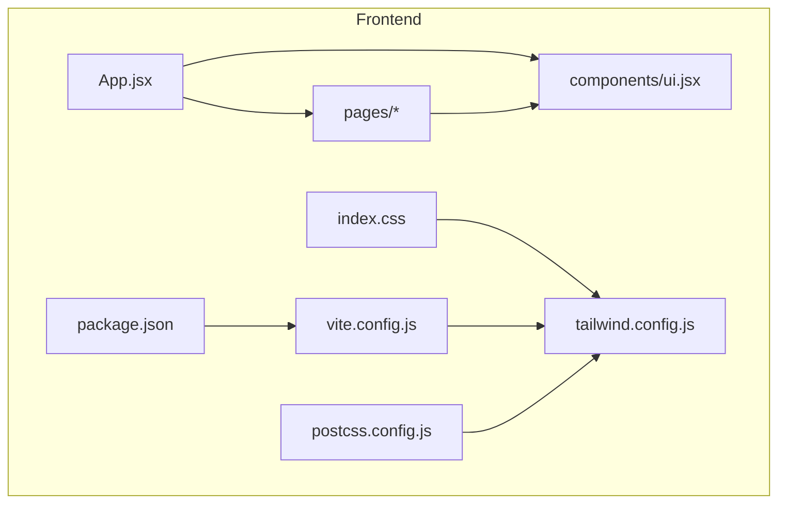
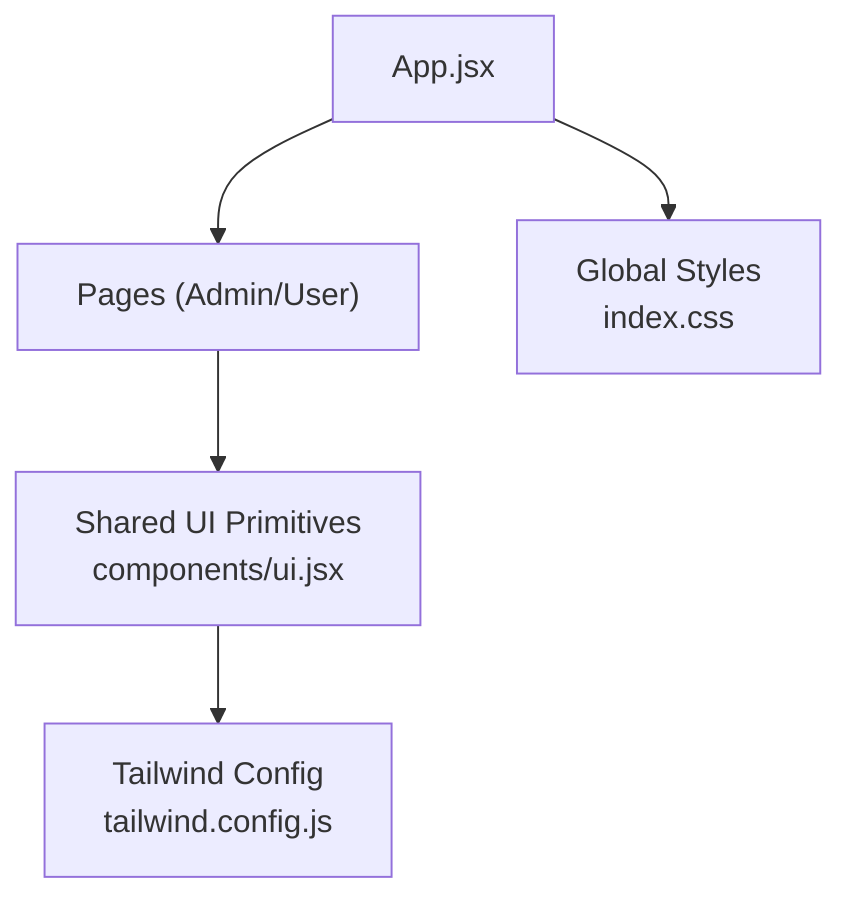
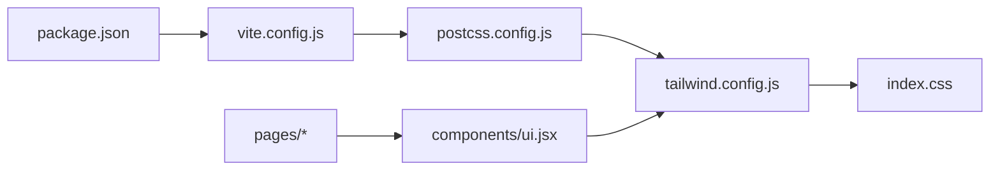

# UI Component Library

<cite>
**Referenced Files in This Document**
- [ui.jsx](file://frontend/src/components/ui.jsx)
- [App.jsx](file://frontend/src/App.jsx)
- [index.css](file://frontend/src/index.css)
- [tailwind.config.js](file://frontend/tailwind.config.js)
- [package.json](file://frontend/package.json)
- [vite.config.js](file://frontend/vite.config.js)
- [postcss.config.js](file://frontend/postcss.config.js)
- [Login.jsx](file://frontend/src/pages/Login.jsx)
- [AdminLayout.jsx](file://frontend/src/pages/admin/AdminLayout.jsx)
- [ActiveResources.jsx](file://frontend/src/pages/admin/ActiveResources.jsx)
- [Approvals.jsx](file://frontend/src/pages/admin/Approvals.jsx)
- [AuditLog.jsx](file://frontend/src/pages/admin/AuditLog.jsx)
- [Settings.jsx](file://frontend/src/pages/admin/Settings.jsx)
- [Templates.jsx](file://frontend/src/pages/admin/Templates.jsx)
- [Users.jsx](file://frontend/src/pages/admin/Users.jsx)
- [UserPortal.jsx](file://frontend/src/pages/user/UserPortal.jsx)
</cite>

## Table of Contents
1. [Introduction](#introduction)
2. [Project Structure](#project-structure)
3. [Core Components](#core-components)
4. [Architecture Overview](#architecture-overview)
5. [Detailed Component Analysis](#detailed-component-analysis)
6. [Dependency Analysis](#dependency-analysis)
7. [Performance Considerations](#performance-considerations)
8. [Troubleshooting Guide](#troubleshooting-guide)
9. [Conclusion](#conclusion)
10. [Appendices](#appendices)

## Introduction
This document describes the reusable UI component library built with React and Tailwind CSS within the project. It focuses on the shared UI primitives, their props and customization options, usage patterns for common interfaces (forms, buttons, modals, tables, navigation), accessibility considerations, responsive design guidance, theming support, composition strategies, and integration points with the rest of the application.

The library centers around a single shared module that exports UI primitives used across pages and layouts. Pages consume these primitives to build consistent user experiences while leveraging Tailwind CSS utilities for styling and responsiveness.

## Project Structure
The frontend is organized into:
- Shared UI components under a dedicated folder
- Feature-based page modules for different roles and screens
- Application entry point and configuration files for Vite, PostCSS, and Tailwind

**Diagram sources**
- [App.jsx](file://frontend/src/App.jsx)
- [ui.jsx](file://frontend/src/components/ui.jsx)
- [tailwind.config.js](file://frontend/tailwind.config.js)
- [vite.config.js](file://frontend/vite.config.js)
- [postcss.config.js](file://frontend/postcss.config.js)
- [package.json](file://frontend/package.json)

**Section sources**
- [App.jsx](file://frontend/src/App.jsx)
- [ui.jsx](file://frontend/src/components/ui.jsx)
- [tailwind.config.js](file://frontend/tailwind.config.js)
- [vite.config.js](file://frontend/vite.config.js)
- [postcss.config.js](file://frontend/postcss.config.js)
- [package.json](file://frontend/package.json)

## Core Components
The shared UI primitives are exported from a single module and consumed by pages and layouts. Typical primitives include:
- Buttons
- Inputs and form fields
- Modals/dialogs
- Tables/data grids
- Navigation elements (links, tabs, breadcrumbs)

Usage patterns:
- Compose complex UIs by combining primitives
- Apply Tailwind utility classes via props or className overrides
- Use consistent spacing, typography, and color tokens through Tailwind configuration

Accessibility:
- Ensure interactive elements have appropriate roles, labels, and keyboard support
- Provide visible focus indicators and sufficient contrast
- Associate labels with inputs and expose aria attributes where needed

Responsive design:
- Prefer Tailwind’s responsive prefixes and container queries when necessary
- Test layouts at common breakpoints and ensure touch targets meet minimum sizes

Theming:
- Centralize colors, fonts, and spacing in Tailwind configuration
- Extend theme tokens for brand consistency and future changes

Integration:
- Import primitives from the shared module
- Keep business logic in pages/services; keep presentation in components
- Avoid duplicating styles; rely on Tailwind utilities and theme tokens

[No sources needed since this section provides general guidance]

## Architecture Overview
The UI layer follows a simple, composable architecture:
- App orchestrates routing and layout
- Pages implement feature-specific views using shared UI primitives
- The shared UI module encapsulates reusable building blocks
- Tailwind CSS provides utility-first styling and theming

**Diagram sources**
- [App.jsx](file://frontend/src/App.jsx)
- [ui.jsx](file://frontend/src/components/ui.jsx)
- [tailwind.config.js](file://frontend/tailwind.config.js)
- [index.css](file://frontend/src/index.css)

## Detailed Component Analysis

### Shared UI Primitives
The shared module exports UI primitives used throughout the application. These primitives should be designed as small, focused, and composable units.

Key responsibilities:
- Encapsulate common interactions (e.g., button states, input validation feedback)
- Provide sensible defaults aligned with Tailwind theme tokens
- Expose props for customization without overfitting to specific use cases
- Maintain accessibility semantics and keyboard behavior

Recommended API surface:
- Button: variant, size, disabled, loading, onClick, icon slot
- Input: label, placeholder, type, value, onChange, error, helperText, disabled
- Modal: open, onClose, title, children, actions
- Table: columns, data, rowKey, sortable, selectable, pagination
- Navigation: link items, active state, dropdowns, breadcrumbs

Composition patterns:
- Combine primitives to build higher-level components (e.g., FormField = Label + Input + HelperText)
- Use render props or slots for flexible content injection
- Favor controlled components for predictable state management

Accessibility checklist:
- Semantic HTML elements and roles
- Keyboard navigability and focus management
- Screen reader-friendly labels and descriptions
- Color contrast and focus visibility

Responsive guidelines:
- Use Tailwind responsive prefixes (sm, md, lg, xl)
- Ensure adequate touch target sizes
- Collapse or reorder content gracefully on smaller screens

Theming support:
- Derive colors, spacing, and typography from Tailwind config
- Allow overriding via className or style props when necessary

**Section sources**
- [ui.jsx](file://frontend/src/components/ui.jsx)

### Login Page
The login screen demonstrates form composition using shared primitives. It typically includes:
- Email and password inputs with validation feedback
- Submit button with loading and disabled states
- Error messaging and accessibility labels

Common patterns:
- Controlled inputs bound to local state
- Client-side validation before submission
- Clear error messages and accessible hints

**Section sources**
- [Login.jsx](file://frontend/src/pages/Login.jsx)
- [ui.jsx](file://frontend/src/components/ui.jsx)

### Admin Layout
The admin layout establishes the shell for administrative features. It commonly includes:
- Sidebar navigation with active states
- Top bar with user controls
- Content area rendering nested routes

Navigation considerations:
- Consistent link styling and focus states
- Keyboard shortcuts for power users
- Responsive collapse for mobile

**Section sources**
- [AdminLayout.jsx](file://frontend/src/pages/admin/AdminLayout.jsx)
- [ui.jsx](file://frontend/src/components/ui.jsx)

### Active Resources Page
This page showcases data display and interaction patterns:
- Table with sorting, filtering, and pagination
- Action buttons per row (e.g., view details, delete)
- Status badges and inline editing where applicable

Table best practices:
- Stable row keys for performance
- Accessible headers and captions
- Empty and loading states

**Section sources**
- [ActiveResources.jsx](file://frontend/src/pages/admin/ActiveResources.jsx)
- [ui.jsx](file://frontend/src/components/ui.jsx)

### Approvals Page
Demonstrates workflow-oriented UI:
- List of pending approvals with contextual actions
- Confirmation dialogs before destructive operations
- Status transitions and feedback

Modal usage:
- Confirmations and detail previews
- Focus trapping and escape key handling
- Backdrop click dismissal

**Section sources**
- [Approvals.jsx](file://frontend/src/pages/admin/Approvals.jsx)
- [ui.jsx](file://frontend/src/components/ui.jsx)

### Audit Log Page
Focuses on data-heavy reporting:
- Filterable and searchable table
- Date range pickers and export actions
- Pagination and virtualization for large datasets

Performance tips:
- Debounced search inputs
- Lazy loading and pagination
- Memoized column definitions

**Section sources**
- [AuditLog.jsx](file://frontend/src/pages/admin/AuditLog.jsx)
- [ui.jsx](file://frontend/src/components/ui.jsx)

### Settings Page
Illustrates configuration forms:
- Grouped sections with clear headings
- Validation and save confirmation
- Reset and default restore actions

Form composition:
- Reusable field groups
- Consistent spacing and alignment
- Inline help text and tooltips

**Section sources**
- [Settings.jsx](file://frontend/src/pages/admin/Settings.jsx)
- [ui.jsx](file://frontend/src/components/ui.jsx)

### Templates Page
Shows template management:
- Card grid or list of templates
- Create, edit, duplicate, and delete workflows
- Preview modal for template contents

Modal patterns:
- Title, body, and action footer
- Close on backdrop and escape
- Prevent body scroll when open

**Section sources**
- [Templates.jsx](file://frontend/src/pages/admin/Templates.jsx)
- [ui.jsx](file://frontend/src/components/ui.jsx)

### Users Page
Handles user administration:
- User table with role badges and status
- Invite and manage permissions
- Bulk actions and selection

Accessibility and UX:
- Clear success/error notifications
- Confirmation prompts for destructive actions
- Keyboard-friendly bulk operations

**Section sources**
- [Users.jsx](file://frontend/src/pages/admin/Users.jsx)
- [ui.jsx](file://frontend/src/components/ui.jsx)

### User Portal Page
Represents the end-user experience:
- Simplified navigation and task flows
- Readable data presentation
- Guidance and help links

Design principles:
- Minimal cognitive load
- Clear calls to action
- Helpful empty states

**Section sources**
- [UserPortal.jsx](file://frontend/src/pages/user/UserPortal.jsx)
- [ui.jsx](file://frontend/src/components/ui.jsx)

## Dependency Analysis
The UI layer depends on:
- React for component model and lifecycle
- Tailwind CSS for styling and theming
- Vite and PostCSS for build-time processing

**Diagram sources**
- [package.json](file://frontend/package.json)
- [vite.config.js](file://frontend/vite.config.js)
- [postcss.config.js](file://frontend/postcss.config.js)
- [tailwind.config.js](file://frontend/tailwind.config.js)
- [index.css](file://frontend/src/index.css)
- [ui.jsx](file://frontend/src/components/ui.jsx)
- [Login.jsx](file://frontend/src/pages/Login.jsx)
- [AdminLayout.jsx](file://frontend/src/pages/admin/AdminLayout.jsx)
- [ActiveResources.jsx](file://frontend/src/pages/admin/ActiveResources.jsx)
- [Approvals.jsx](file://frontend/src/pages/admin/Approvals.jsx)
- [AuditLog.jsx](file://frontend/src/pages/admin/AuditLog.jsx)
- [Settings.jsx](file://frontend/src/pages/admin/Settings.jsx)
- [Templates.jsx](file://frontend/src/pages/admin/Templates.jsx)
- [Users.jsx](file://frontend/src/pages/admin/Users.jsx)
- [UserPortal.jsx](file://frontend/src/pages/user/UserPortal.jsx)

**Section sources**
- [package.json](file://frontend/package.json)
- [vite.config.js](file://frontend/vite.config.js)
- [postcss.config.js](file://frontend/postcss.config.js)
- [tailwind.config.js](file://frontend/tailwind.config.js)
- [index.css](file://frontend/src/index.css)
- [ui.jsx](file://frontend/src/components/ui.jsx)

## Performance Considerations
- Prefer memoization for expensive computations and derived data
- Use pagination and virtualization for large lists
- Debounce search and filter inputs
- Minimize re-renders by lifting state judiciously and avoiding unnecessary prop updates
- Leverage Tailwind’s utility classes to avoid heavy custom CSS bundles

[No sources needed since this section provides general guidance]

## Troubleshooting Guide
Common issues and resolutions:
- Styling not applied: verify Tailwind configuration and Purge/CSS scanning paths
- Build errors: check PostCSS and Vite plugin compatibility
- Accessibility regressions: run automated checks and manual keyboard testing
- Performance regressions: profile renders and identify bottlenecks in tables/lists
- Theming inconsistencies: ensure all colors and tokens are defined in Tailwind config

[No sources needed since this section provides general guidance]

## Conclusion
The UI component library emphasizes simplicity, composability, and consistency. By centralizing shared primitives, adhering to accessibility standards, and leveraging Tailwind CSS for theming and responsiveness, the application achieves a cohesive user experience across admin and user-facing features. Extending the library involves following established patterns, maintaining semantic markup, and keeping components focused and testable.

[No sources needed since this section summarizes without analyzing specific files]

## Appendices

### Creating New Components: Guidelines
- Start small: one responsibility per component
- Define a minimal, stable API surface with props for customization
- Use Tailwind theme tokens for colors, spacing, and typography
- Implement keyboard and screen reader support by default
- Provide examples in page modules to demonstrate composition
- Add tests for critical interactions and edge cases

### Accessibility Checklist
- Use semantic HTML elements and roles
- Ensure focus order and visible focus indicators
- Provide labels, descriptions, and aria attributes where needed
- Support keyboard navigation and shortcuts
- Maintain sufficient color contrast

### Responsive Design Tips
- Use Tailwind responsive prefixes consistently
- Test on multiple devices and orientations
- Optimize touch targets and spacing for mobile
- Consider collapsible navigation and stacked layouts

### Theming Support
- Centralize design tokens in Tailwind configuration
- Introduce new tokens incrementally and document usage
- Avoid hardcoding values in components
- Validate contrast and accessibility after theme changes

### Integration Patterns
- Import primitives from the shared module
- Keep business logic out of UI components
- Use context or state libraries sparingly and only when necessary
- Coordinate with services for data fetching and mutations

[No sources needed since this section provides general guidance]