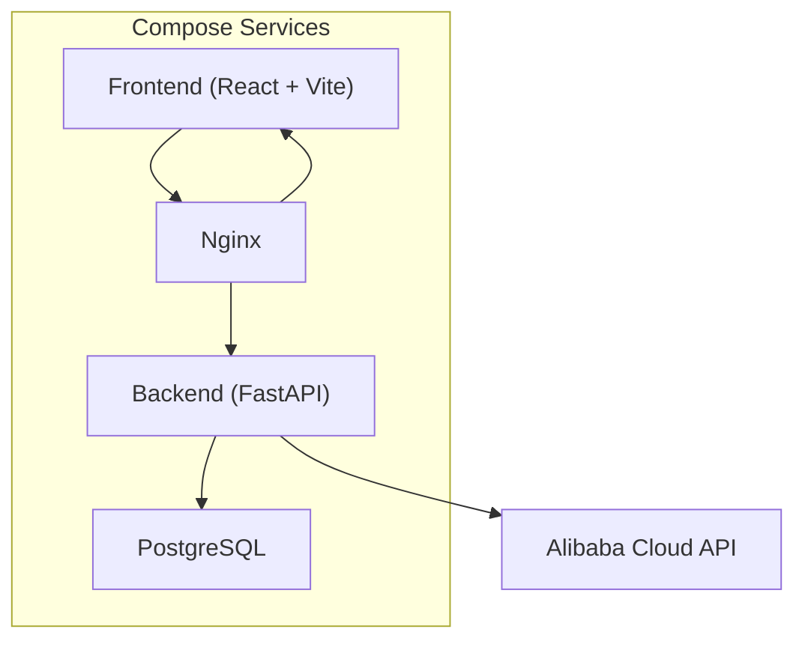
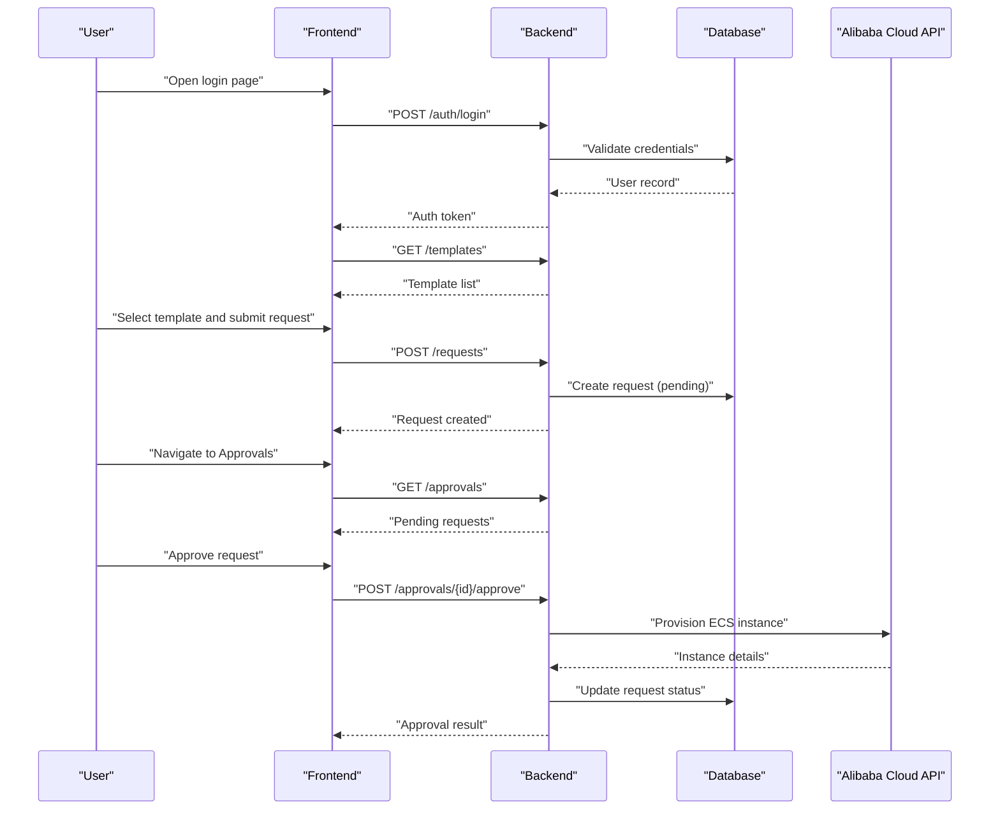

# Getting Started

<cite>
**Referenced Files in This Document**
- [README.md](file://README.md)
- [docker-compose.yml](file://docker-compose.yml)
- [backend/requirements.txt](file://backend/requirements.txt)
- [backend/Dockerfile](file://backend/Dockerfile)
- [backend/entrypoint.sh](file://backend/entrypoint.sh)
- [backend/app/config.py](file://backend/app/config.py)
- [backend/app/database.py](file://backend/app/database.py)
- [backend/alembic.ini](file://backend/alembic.ini)
- [backend/alembic/env.py](file://backend/alembic/env.py)
- [backend/alembic/versions/0001_initial_schema.py](file://backend/alembic/versions/0001_initial_schema.py)
- [frontend/package.json](file://frontend/package.json)
- [frontend/Dockerfile](file://frontend/Dockerfile)
- [nginx/nginx.conf](file://nginx/nginx.conf)
</cite>

## Table of Contents
1. [Introduction](#introduction)
2. [Project Structure](#project-structure)
3. [Prerequisites](#prerequisites)
4. [Installation and Setup](#installation-and-setup)
5. [Environment Configuration](#environment-configuration)
6. [Database Setup](#database-setup)
7. [Initial User Creation](#initial-user-creation)
8. [Basic Usage Patterns](#basic-usage-patterns)
9. [Troubleshooting Guide](#troubleshooting-guide)
10. [Conclusion](#conclusion)

## Introduction
ECS Creator is a cloud infrastructure management platform for Alibaba Cloud ECS instances. It provides a web-based portal for users to request, provision, and manage ECS resources through reusable templates, with an approval workflow and audit trail for governance. Administrators can configure settings, manage users, review approvals, and monitor active resources.

The system consists of:
- A Python backend (FastAPI) exposing REST APIs, managing database state, and integrating with Alibaba Cloud services.
- A React frontend served via Nginx for the user and admin portals.
- Docker Compose orchestration for local development and production-like deployments.

This guide helps you set up the platform locally or in production, configure environment variables, initialize the database, create your first user, and perform common tasks such as logging in, creating an ECS instance from a template, and understanding the approval process.

## Project Structure
At a high level, the repository includes:
- Backend application code, configuration, migrations, and Docker setup.
- Frontend application code, build configuration, and Docker setup.
- Nginx reverse proxy configuration.
- Docker Compose file to run all services together.

[No sources needed since this diagram shows conceptual workflow, not actual code structure]

## Prerequisites
Before installing ECS Creator, ensure you have the following:
- Python 3.x installed on your machine if you plan to run the backend locally outside Docker.
- Node.js and npm installed for building the frontend locally if needed.
- Docker and Docker Compose installed and running.
- An Alibaba Cloud account with appropriate permissions to manage ECS instances and related resources.
- Basic familiarity with environment variables and containerized applications.

If you are using Docker Compose for both local development and production deployment, you do not need to install Python or Node.js locally; Docker will handle dependencies.

## Installation and Setup

### Local Development with Docker Compose
1. Clone the repository to your machine.
2. Ensure Docker and Docker Compose are installed and running.
3. Prepare environment variables by copying the provided example configuration into a .env file at the repository root. See Environment Configuration for details.
4. Start all services:
   - Run docker compose up --build to build images and start services.
   - The backend will apply database migrations automatically via its entrypoint script.
5. Access the application:
   - Open your browser and navigate to http://localhost.
   - Log in using the initial admin credentials configured in your environment.

Notes:
- The backend image runs Alembic migrations during startup based on the entrypoint script.
- The frontend is built and served by Nginx within the container.

### Production Deployment with Docker Compose
1. Prepare a secure environment file (.env) with production values for secrets, database connection strings, and Alibaba Cloud credentials.
2. Build and deploy:
   - Use docker compose up -d --build to run services in detached mode.
3. Configure Nginx:
   - Update nginx/nginx.conf to bind to your domain and enable HTTPS if required.
4. Verify health:
   - Check service logs with docker compose logs.
   - Confirm the frontend loads and the backend responds to health checks.

[No sources needed since this section provides general guidance]

## Environment Configuration
Create a .env file at the repository root and define the following keys. Replace placeholder values with your actual configuration.

- Application
  - APP_NAME: Display name for the application.
  - APP_ENV: Environment identifier (e.g., development, production).
  - SECRET_KEY: Secret key used for signing sessions and tokens.
  - ALLOWED_HOSTS: Comma-separated list of allowed hostnames.

- Database
  - DATABASE_URL: PostgreSQL connection string (e.g., postgresql+asyncpg://user:password@db:5432/dbname).
  - DB_USER, DB_PASSWORD, DB_HOST, DB_PORT, DB_NAME: Individual components if preferred.

- Authentication and Sessions
  - SESSION_SECRET: Separate secret for session encryption.
  - JWT_SECRET: Secret for token signing if applicable.

- Alibaba Cloud Integration
  - ALIBABA_CLOUD_ACCESS_KEY_ID: Your Alibaba Cloud access key ID.
  - ALIBABA_CLOUD_ACCESS_KEY_SECRET: Your Alibaba Cloud access key secret.
  - ALIBABA_CLOUD_REGION: Region identifier (e.g., cn-hangzhou).
  - ALIBABA_CLOUD_VPC_ID: Default VPC ID for resource provisioning.
  - ALIBABA_CLOUD_SECURITY_GROUP_ID: Security group for ECS instances.
  - ALIBABA_CLOUD_IMAGE_ID: Base image ID for ECS instances.
  - ALIBABA_CLOUD_INSTANCE_TYPE: Default instance type.

- Frontend and Proxy
  - FRONTEND_URL: URL where the frontend is accessible.
  - BACKEND_URL: Internal URL for the backend service.
  - NGINX_SERVER_NAME: Domain name for Nginx server block.

- Logging and Debugging
  - LOG_LEVEL: Logging verbosity (e.g., INFO, DEBUG).
  - DEBUG: Enable debug mode (development only).

Tips:
- Keep secrets out of version control; use Docker secrets or a vault solution in production.
- Validate that the database user has permission to create tables and run migrations.
- Ensure the Alibaba Cloud credentials have sufficient permissions for ECS, VPC, and security groups.

**Section sources**
- [backend/app/config.py](file://backend/app/config.py)
- [backend/app/database.py](file://backend/app/database.py)
- [backend/alembic.ini](file://backend/alembic.ini)
- [backend/alembic/env.py](file://backend/alembic/env.py)
- [nginx/nginx.conf](file://nginx/nginx.conf)

## Database Setup
ECS Creator uses PostgreSQL and manages schema changes with Alembic.

- Connection:
  - Provide DATABASE_URL in your environment so the backend can connect to the database service defined in docker-compose.yml.
- Migrations:
  - The backend entrypoint script applies pending migrations on startup.
  - Initial schema is defined in the Alembic migration files.

Steps:
1. Ensure the database service is running and reachable from the backend container.
2. Start the application with docker compose up --build.
3. Observe the backend logs for successful migration execution.
4. If you need to reset the database, stop services, remove volumes, and restart.

Common issues:
- Migration failures due to incorrect DATABASE_URL or missing privileges.
- Port conflicts if running multiple instances.

**Section sources**
- [backend/entrypoint.sh](file://backend/entrypoint.sh)
- [backend/alembic.ini](file://backend/alembic.ini)
- [backend/alembic/env.py](file://backend/alembic/env.py)
- [backend/alembic/versions/0001_initial_schema.py](file://backend/alembic/versions/0001_initial_schema.py)
- [backend/app/database.py](file://backend/app/database.py)

## Initial User Creation
After the database is initialized, create your first administrator user.

Options:
- Use the backend’s user management endpoints to register and promote a user to admin.
- Alternatively, use the admin UI once the application is running to create users and assign roles.

Recommended steps:
1. Start the application and confirm the frontend is accessible.
2. Register a new user via the registration flow or API.
3. Promote the user to admin using the admin endpoints or UI.
4. Log in with the admin account to configure templates and settings.

Security note:
- Change default passwords immediately after creation.
- Restrict access to admin endpoints to trusted networks or authenticated users.

[No sources needed since this section provides general guidance]

## Basic Usage Patterns

### Login
- Navigate to the login page.
- Enter your username and password.
- Upon successful authentication, you will be redirected to the user portal or admin dashboard depending on your role.

### Create Your First ECS Instance Using Templates
- Go to the Templates page and select a predefined template that matches your requirements (instance type, image, network, etc.).
- Submit a request to provision an ECS instance based on the chosen template.
- The request enters the approval workflow.

### Approval Workflow
- Requests are created in a pending state.
- Admins review requests in the Approvals page.
- Once approved, the backend provisions the ECS instance via Alibaba Cloud APIs.
- You can track the status and view details in Active Resources.

### Audit and Settings
- Review actions and changes in the Audit Log.
- Adjust system settings and template defaults in Settings.

[No sources needed since this diagram shows conceptual workflow, not actual code structure]

## Troubleshooting Guide

- Cannot connect to the database:
  - Verify DATABASE_URL and credentials.
  - Ensure the database service is running and reachable from the backend container.
  - Check backend logs for connection errors.

- Migrations fail on startup:
  - Confirm the database user has CREATE TABLE privileges.
  - Inspect Alembic logs and migration files for errors.
  - Reset the database volume and restart if necessary.

- Frontend cannot reach the backend:
  - Ensure NGINX routes are correct and BACKEND_URL is set properly.
  - Check CORS and allowed hosts configuration.
  - Verify ports are not conflicting.

- Alibaba Cloud integration errors:
  - Validate ALIBABA_CLOUD_* environment variables.
  - Ensure the region, VPC, security group, and image IDs exist and are accessible.
  - Confirm the credentials have sufficient permissions.

- Session or authentication issues:
  - Ensure SECRET_KEY and SESSION_SECRET are set and consistent across containers.
  - Clear browser cookies and retry login.

- Logs and debugging:
  - Use docker compose logs to inspect service output.
  - Increase LOG_LEVEL to DEBUG for more verbose output in development.

**Section sources**
- [backend/app/config.py](file://backend/app/config.py)
- [backend/app/database.py](file://backend/app/database.py)
- [backend/entrypoint.sh](file://backend/entrypoint.sh)
- [nginx/nginx.conf](file://nginx/nginx.conf)

## Conclusion
You now have the essentials to install, configure, and operate ECS Creator for managing Alibaba Cloud ECS instances. Start with local development using Docker Compose, then adapt the configuration for production. Leverage templates to standardize provisioning, enforce approvals for governance, and use audit logs for visibility. For advanced customization, explore the backend routers, services, and frontend pages referenced in the project structure.