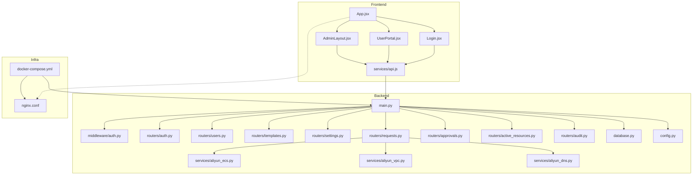
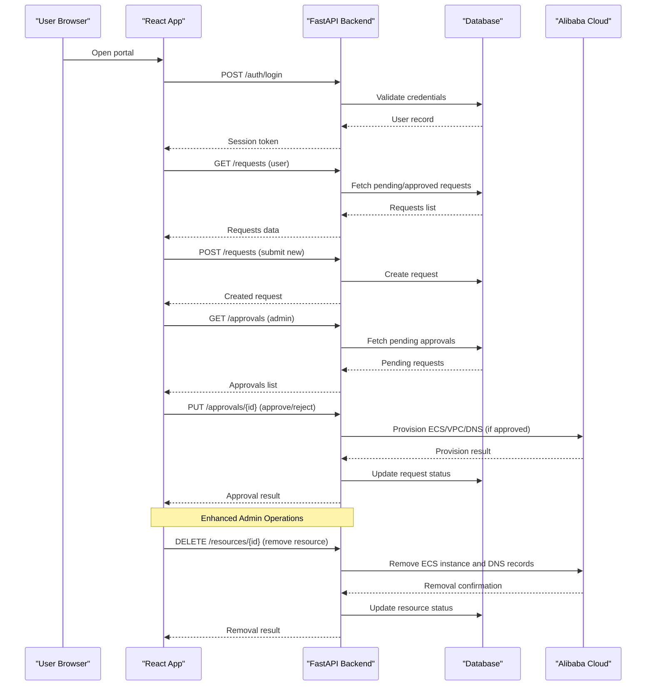
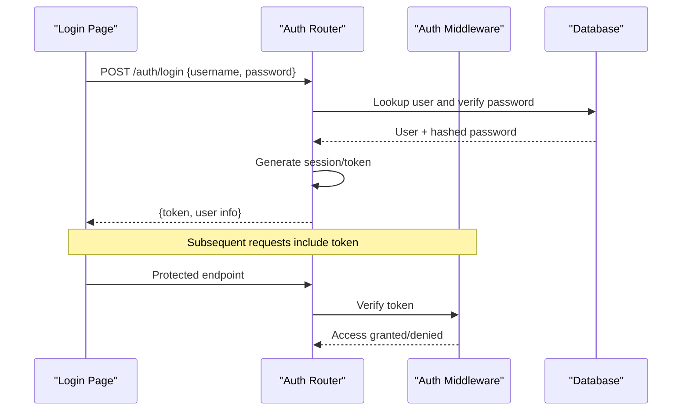
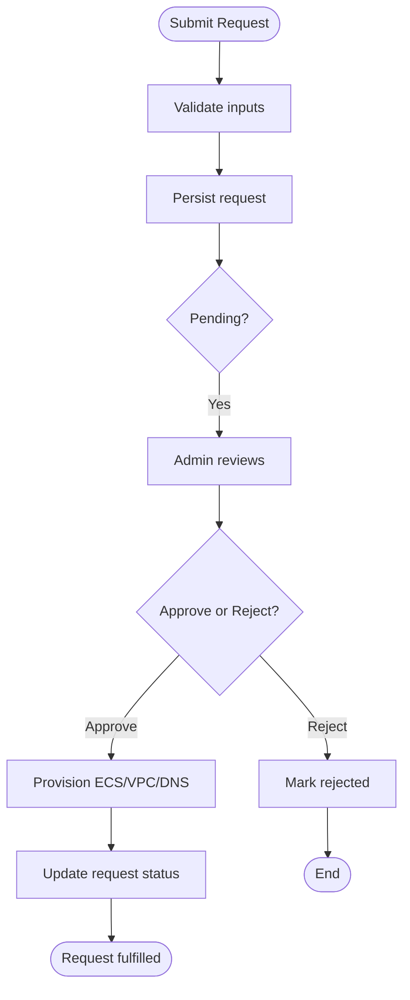
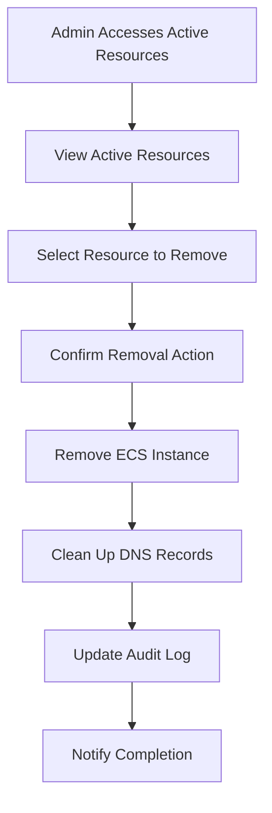
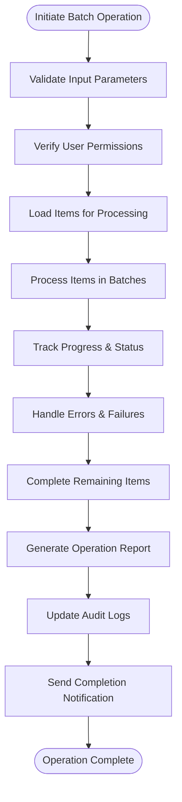
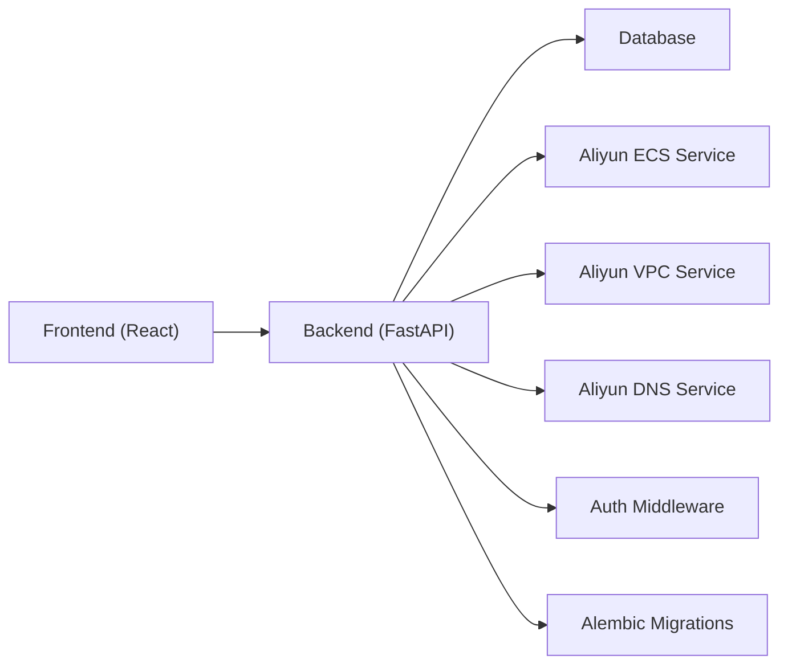

# User Guide

<cite>
**Referenced Files in This Document**
- [README.md](file://README.md)
- [USER_GUIDE.md](file://USER_GUIDE.md)
- [docker-compose.yml](file://docker-compose.yml)
- [backend/app/main.py](file://backend/app/main.py)
- [backend/app/config.py](file://backend/app/config.py)
- [backend/app/database.py](file://backend/app/database.py)
- [backend/alembic.ini](file://backend/alembic.ini)
- [backend/entrypoint.sh](file://backend/entrypoint.sh)
- [backend/requirements.txt](file://backend/requirements.txt)
- [backend/app/routers/auth.py](file://backend/app/routers/auth.py)
- [backend/app/routers/users.py](file://backend/app/routers/users.py)
- [backend/app/routers/templates.py](file://backend/app/routers/templates.py)
- [backend/app/routers/settings.py](file://backend/app/routers/settings.py)
- [backend/app/routers/requests.py](file://backend/app/routers/requests.py)
- [backend/app/routers/approvals.py](file://backend/app/routers/approvals.py)
- [backend/app/routers/active_resources.py](file://backend/app/routers/active_resources.py)
- [backend/app/routers/audit.py](file://backend/app/routers/audit.py)
- [backend/app/middleware/auth.py](file://backend/app/middleware/auth.py)
- [backend/app/services/aliyun_ecs.py](file://backend/app/services/aliyun_ecs.py)
- [backend/app/services/aliyun_vpc.py](file://backend/app/services/aliyun_vpc.py)
- [backend/app/services/aliyun_dns.py](file://backend/app/services/aliyun_dns.py)
- [backend/app/services/approval.py](file://backend/app/services/approval.py)
- [backend/app/services/crypto.py](file://backend/app/services/crypto.py)
- [backend/app/services/password.py](file://backend/app/services/password.py)
- [backend/app/services/settings_service.py](file://backend/app/services/settings_service.py)
- [backend/app/models/user.py](file://backend/app/models/user.py)
- [backend/app/models/template.py](file://backend/app/models/template.py)
- [backend/app/models/request.py](file://backend/app/models/request.py)
- [backend/app/models/session.py](file://backend/app/models/session.py)
- [backend/app/models/settings.py](file://backend/app/models/settings.py)
- [backend/app/models/audit_log.py](file://backend/app/models/audit_log.py)
- [backend/app/schemas/user.py](file://backend/app/schemas/user.py)
- [backend/app/schemas/template.py](file://backend/app/schemas/template.py)
- [backend/app/schemas/request.py](file://backend/app/schemas/request.py)
- [backend/app/schemas/auth.py](file://backend/app/schemas/auth.py)
- [backend/app/schemas/approval.py](file://backend/app/schemas/approval.py)
- [backend/app/schemas/audit.py](file://backend/app/schemas/audit.py)
- [backend/app/schemas/settings.py](file://backend/app/schemas/settings.py)
- [frontend/src/App.jsx](file://frontend/src/App.jsx)
- [frontend/src/main.jsx](file://frontend/src/main.jsx)
- [frontend/src/pages/Login.jsx](file://frontend/src/pages/Login.jsx)
- [frontend/src/pages/admin/AdminLayout.jsx](file://frontend/src/pages/admin/AdminLayout.jsx)
- [frontend/src/pages/admin/Users.jsx](file://frontend/src/pages/admin/Users.jsx)
- [frontend/src/pages/admin/Templates.jsx](file://frontend/src/pages/admin/Templates.jsx)
- [frontend/src/pages/admin/Settings.jsx](file://frontend/src/pages/admin/Settings.jsx)
- [frontend/src/pages/admin/Approvals.jsx](file://frontend/src/pages/admin/Approvals.jsx)
- [frontend/src/pages/admin/ActiveResources.jsx](file://frontend/src/pages/admin/ActiveResources.jsx)
- [frontend/src/pages/admin/AuditLog.jsx](file://frontend/src/pages/admin/AuditLog.jsx)
- [frontend/src/services/api.js](file://frontend/src/services/api.js)
- [nginx/nginx.conf](file://nginx/nginx.conf)
</cite>

## Update Summary
**Changes Made**
- Added comprehensive batch operation features documentation including usage examples and best practices
- Enhanced troubleshooting guidance for common issues when performing bulk actions
- Updated Active Resources section with new batch removal capabilities
- Expanded DNS management operations with batch processing support
- Added detailed workflow diagrams for batch operations

## Table of Contents
1. [Introduction](#introduction)
2. [Project Structure](#project-structure)
3. [Core Components](#core-components)
4. [Architecture Overview](#architecture-overview)
5. [Detailed Component Analysis](#detailed-component-analysis)
6. [Batch Operations Guide](#batch-operations-guide)
7. [Dependency Analysis](#dependency-analysis)
8. [Performance Considerations](#performance-considerations)
9. [Troubleshooting Guide](#troubleshooting-guide)
10. [Conclusion](#conclusion)
11. [Appendices](#appendices)

## Introduction
This User Guide explains how to install, configure, and operate the ECS Request System. It covers both end-user workflows (requesting resources) and administrative tasks (approvals, user management, templates, settings, audit logs). The system provides a web-based portal for users to request cloud resources and an admin console for managing approvals and configurations.

The project is composed of:
- A FastAPI backend with database migrations, authentication middleware, and integrations with Alibaba Cloud services (ECS, VPC, DNS).
- A React frontend served via Nginx.
- Docker Compose configuration for local development and deployment.

For high-level background and quick start instructions, see the repository README and the existing USER_GUIDE file.

**Section sources**
- [README.md](file://README.md)
- [USER_GUIDE.md](file://USER_GUIDE.md)

## Project Structure
At a high level:
- Backend: Python FastAPI application with routers, models, schemas, services, and Alembic migrations.
- Frontend: React application with pages for login, user portal, and admin features.
- Infrastructure: Nginx reverse proxy and Docker Compose orchestration.



**Diagram sources**
- [backend/app/main.py](file://backend/app/main.py)
- [backend/app/middleware/auth.py](file://backend/app/middleware/auth.py)
- [backend/app/routers/auth.py](file://backend/app/routers/auth.py)
- [backend/app/routers/users.py](file://backend/app/routers/users.py)
- [backend/app/routers/templates.py](file://backend/app/routers/templates.py)
- [backend/app/routers/settings.py](file://backend/app/routers/settings.py)
- [backend/app/routers/requests.py](file://backend/app/routers/requests.py)
- [backend/app/routers/approvals.py](file://backend/app/routers/approvals.py)
- [backend/app/routers/active_resources.py](file://backend/app/routers/active_resources.py)
- [backend/app/routers/audit.py](file://backend/app/routers/audit.py)
- [backend/app/services/aliyun_ecs.py](file://backend/app/services/aliyun_ecs.py)
- [backend/app/services/aliyun_vpc.py](file://backend/app/services/aliyun_vpc.py)
- [backend/app/services/aliyun_dns.py](file://backend/app/services/aliyun_dns.py)
- [backend/app/database.py](file://backend/app/database.py)
- [backend/app/config.py](file://backend/app/config.py)
- [frontend/src/App.jsx](file://frontend/src/App.jsx)
- [frontend/src/pages/Login.jsx](file://frontend/src/pages/Login.jsx)
- [frontend/src/pages/user/UserPortal.jsx](file://frontend/src/pages/user/UserPortal.jsx)
- [frontend/src/pages/admin/AdminLayout.jsx](file://frontend/src/pages/admin/AdminLayout.jsx)
- [frontend/src/services/api.js](file://frontend/src/services/api.js)
- [nginx/nginx.conf](file://nginx/nginx.conf)
- [docker-compose.yml](file://docker-compose.yml)

**Section sources**
- [docker-compose.yml](file://docker-compose.yml)
- [backend/app/main.py](file://backend/app/main.py)
- [frontend/src/App.jsx](file://frontend/src/App.jsx)
- [nginx/nginx.conf](file://nginx/nginx.conf)

## Core Components
- Authentication and Authorization
  - Login flow and session handling are implemented in the auth router and middleware.
  - Schemas define request/response structures for authentication endpoints.
- Resource Requests and Approvals
  - Users submit requests; admins review and approve or reject them.
  - Services integrate with Alibaba Cloud ECS/VPC/DNS to provision resources upon approval.
- Admin Features
  - Manage users, templates, settings, active resources, and view audit logs.
  - **Enhanced**: Administrative capabilities for resource removal and DNS management operations.
  - **New**: Comprehensive batch operation support for bulk resource management.
- Data Layer
  - Database connection and models represent core entities such as users, templates, requests, sessions, settings, and audit logs.
  - Alembic manages schema migrations.

Key implementation references:
- Auth router and middleware: [backend/app/routers/auth.py](file://backend/app/routers/auth.py), [backend/app/middleware/auth.py](file://backend/app/middleware/auth.py)
- Request and approval flows: [backend/app/routers/requests.py](file://backend/app/routers/requests.py), [backend/app/routers/approvals.py](file://backend/app/routers/approvals.py)
- Cloud integrations: [backend/app/services/aliyun_ecs.py](file://backend/app/services/aliyun_ecs.py), [backend/app/services/aliyun_vpc.py](file://backend/app/services/aliyun_vpc.py), [backend/app/services/aliyun_dns.py](file://backend/app/services/aliyun_dns.py)
- Models and schemas: [backend/app/models/](file://backend/app/models/), [backend/app/schemas/](file://backend/app/schemas/)
- Database and config: [backend/app/database.py](file://backend/app/database.py), [backend/app/config.py](file://backend/app/config.py)

**Section sources**
- [backend/app/routers/auth.py](file://backend/app/routers/auth.py)
- [backend/app/middleware/auth.py](file://backend/app/middleware/auth.py)
- [backend/app/routers/requests.py](file://backend/app/routers/requests.py)
- [backend/app/routers/approvals.py](file://backend/app/routers/approvals.py)
- [backend/app/services/aliyun_ecs.py](file://backend/app/services/aliyun_ecs.py)
- [backend/app/services/aliyun_vpc.py](file://backend/app/services/aliyun_vpc.py)
- [backend/app/services/aliyun_dns.py](file://backend/app/services/aliyun_dns.py)
- [backend/app/models/user.py](file://backend/app/models/user.py)
- [backend/app/models/template.py](file://backend/app/models/template.py)
- [backend/app/models/request.py](file://backend/app/models/request.py)
- [backend/app/models/session.py](file://backend/app/models/session.py)
- [backend/app/models/settings.py](file://backend/app/models/settings.py)
- [backend/app/models/audit_log.py](file://backend/app/models/audit_log.py)
- [backend/app/schemas/user.py](file://backend/app/schemas/user.py)
- [backend/app/schemas/template.py](file://backend/app/schemas/template.py)
- [backend/app/schemas/request.py](file://backend/app/schemas/request.py)
- [backend/app/schemas/auth.py](file://backend/app/schemas/auth.py)
- [backend/app/schemas/approval.py](file://backend/app/schemas/approval.py)
- [backend/app/schemas/audit.py](file://backend/app/schemas/audit.py)
- [backend/app/schemas/settings.py](file://backend/app/schemas/settings.py)
- [backend/app/database.py](file://backend/app/database.py)
- [backend/app/config.py](file://backend/app/config.py)

## Architecture Overview
The system follows a standard web architecture:
- Browser interacts with the React frontend.
- Nginx serves static assets and proxies API calls to the backend.
- Backend exposes REST endpoints grouped by feature (auth, users, templates, settings, requests, approvals, active resources, audit).
- Services call external cloud APIs to provision and manage resources.
- Database stores persistent state; Alembic handles migrations.



**Diagram sources**
- [backend/app/routers/auth.py](file://backend/app/routers/auth.py)
- [backend/app/routers/requests.py](file://backend/app/routers/requests.py)
- [backend/app/routers/approvals.py](file://backend/app/routers/approvals.py)
- [backend/app/routers/active_resources.py](file://backend/app/routers/active_resources.py)
- [backend/app/services/aliyun_ecs.py](file://backend/app/services/aliyun_ecs.py)
- [backend/app/services/aliyun_vpc.py](file://backend/app/services/aliyun_vpc.py)
- [backend/app/services/aliyun_dns.py](file://backend/app/services/aliyun_dns.py)
- [backend/app/database.py](file://backend/app/database.py)

## Detailed Component Analysis

### Authentication Flow
- Users log in via the login page.
- The backend validates credentials, creates a session, and returns a token.
- Middleware enforces authentication on protected routes.



**Diagram sources**
- [backend/app/routers/auth.py](file://backend/app/routers/auth.py)
- [backend/app/middleware/auth.py](file://backend/app/middleware/auth.py)
- [backend/app/models/user.py](file://backend/app/models/user.py)
- [backend/app/schemas/auth.py](file://backend/app/schemas/auth.py)

**Section sources**
- [backend/app/routers/auth.py](file://backend/app/routers/auth.py)
- [backend/app/middleware/auth.py](file://backend/app/middleware/auth.py)
- [backend/app/schemas/auth.py](file://backend/app/schemas/auth.py)
- [backend/app/models/user.py](file://backend/app/models/user.py)

### Resource Request and Approval Workflow
- Users submit resource requests through the user portal.
- Admins review pending requests and approve or reject them.
- Upon approval, backend services provision resources with Alibaba Cloud.



**Diagram sources**
- [backend/app/routers/requests.py](file://backend/app/routers/requests.py)
- [backend/app/routers/approvals.py](file://backend/app/routers/approvals.py)
- [backend/app/services/aliyun_ecs.py](file://backend/app/services/aliyun_ecs.py)
- [backend/app/services/aliyun_vpc.py](file://backend/app/services/aliyun_vpc.py)
- [backend/app/services/aliyun_dns.py](file://backend/app/services/aliyun_dns.py)
- [backend/app/models/request.py](file://backend/app/models/request.py)
- [backend/app/schemas/request.py](file://backend/app/schemas/request.py)
- [backend/app/schemas/approval.py](file://backend/app/schemas/approval.py)

**Section sources**
- [backend/app/routers/requests.py](file://backend/app/routers/requests.py)
- [backend/app/routers/approvals.py](file://backend/app/routers/approvals.py)
- [backend/app/services/aliyun_ecs.py](file://backend/app/services/aliyun_ecs.py)
- [backend/app/services/aliyun_vpc.py](file://backend/app/services/aliyun_vpc.py)
- [backend/app/services/aliyun_dns.py](file://backend/app/services/aliyun_dns.py)
- [backend/app/models/request.py](file://backend/app/models/request.py)
- [backend/app/schemas/request.py](file://backend/app/schemas/request.py)
- [backend/app/schemas/approval.py](file://backend/app/schemas/approval.py)

### Enhanced Administrative Capabilities

#### Resource Removal Operations
Administrators can now remove active resources directly from the Active Resources interface. This capability includes:
- Safe removal of ECS instances with proper cleanup procedures
- Automatic DNS record deletion when removing resources
- Audit logging of all removal operations
- Confirmation dialogs to prevent accidental deletions

#### DNS Management Operations
The system now provides comprehensive DNS management capabilities:
- View and manage DNS records associated with resources
- Add, modify, and delete DNS entries
- Integration with Alibaba Cloud DNS service
- Automatic DNS cleanup during resource removal



**Diagram sources**
- [backend/app/routers/active_resources.py](file://backend/app/routers/active_resources.py)
- [backend/app/services/aliyun_ecs.py](file://backend/app/services/aliyun_ecs.py)
- [backend/app/services/aliyun_dns.py](file://backend/app/services/aliyun_dns.py)
- [backend/app/models/audit_log.py](file://backend/app/models/audit_log.py)

**Updated** Enhanced administrative capabilities now include resource removal and DNS management operations for better control over cloud infrastructure.

**Section sources**
- [backend/app/routers/active_resources.py](file://backend/app/routers/active_resources.py)
- [backend/app/services/aliyun_ecs.py](file://backend/app/services/aliyun_ecs.py)
- [backend/app/services/aliyun_dns.py](file://backend/app/services/aliyun_dns.py)
- [backend/app/models/audit_log.py](file://backend/app/models/audit_log.py)

### Admin Features
- Users Management: Create, update, and manage user accounts.
- Templates: Define reusable resource configurations.
- Settings: Configure system-wide options.
- Active Resources: View currently provisioned resources.
- **Enhanced**: Remove active resources with automatic DNS cleanup.
- **Enhanced**: Manage DNS records independently.
- Audit Log: Track actions and changes.

References:
- Routers: [backend/app/routers/users.py](file://backend/app/routers/users.py), [backend/app/routers/templates.py](file://backend/app/routers/templates.py), [backend/app/routers/settings.py](file://backend/app/routers/settings.py), [backend/app/routers/active_resources.py](file://backend/app/routers/active_resources.py), [backend/app/routers/audit.py](file://backend/app/routers/audit.py)
- Frontend pages: [frontend/src/pages/admin/Users.jsx](file://frontend/src/pages/admin/Users.jsx), [frontend/src/pages/admin/Templates.jsx](file://frontend/src/pages/admin/Templates.jsx), [frontend/src/pages/admin/Settings.jsx](file://frontend/src/pages/admin/Settings.jsx), [frontend/src/pages/admin/ActiveResources.jsx](file://frontend/src/pages/admin/ActiveResources.jsx), [frontend/src/pages/admin/AuditLog.jsx](file://frontend/src/pages/admin/AuditLog.jsx)

**Section sources**
- [backend/app/routers/users.py](file://backend/app/routers/users.py)
- [backend/app/routers/templates.py](file://backend/app/routers/templates.py)
- [backend/app/routers/settings.py](file://backend/app/routers/settings.py)
- [backend/app/routers/active_resources.py](file://backend/app/routers/active_resources.py)
- [backend/app/routers/audit.py](file://backend/app/routers/audit.py)
- [frontend/src/pages/admin/Users.jsx](file://frontend/src/pages/admin/Users.jsx)
- [frontend/src/pages/admin/Templates.jsx](file://frontend/src/pages/admin/Templates.jsx)
- [frontend/src/pages/admin/Settings.jsx](file://frontend/src/pages/admin/Settings.jsx)
- [frontend/src/pages/admin/ActiveResources.jsx](file://frontend/src/pages/admin/ActiveResources.jsx)
- [frontend/src/pages/admin/AuditLog.jsx](file://frontend/src/pages/admin/AuditLog.jsx)

### Data Models and Schemas
Core entities include:
- User: Identity and roles.
- Template: Reusable resource definitions.
- Request: User-submitted resource requests.
- Session: Authentication sessions.
- Settings: System configuration.
- Audit Log: Action history.

Schemas define validation rules for API payloads.

References:
- Models: [backend/app/models/user.py](file://backend/app/models/user.py), [backend/app/models/template.py](file://backend/app/models/template.py), [backend/app/models/request.py](file://backend/app/models/request.py), [backend/app/models/session.py](file://backend/app/models/session.py), [backend/app/models/settings.py](file://backend/app/models/settings.py), [backend/app/models/audit_log.py](file://backend/app/models/audit_log.py)
- Schemas: [backend/app/schemas/user.py](file://backend/app/schemas/user.py), [backend/app/schemas/template.py](file://backend/app/schemas/template.py), [backend/app/schemas/request.py](file://backend/app/schemas/request.py), [backend/app/schemas/auth.py](file://backend/app/schemas/auth.py), [backend/app/schemas/approval.py](file://backend/app/schemas/approval.py), [backend/app/schemas/audit.py](file://backend/app/schemas/audit.py), [backend/app/schemas/settings.py](file://backend/app/schemas/settings.py)

**Section sources**
- [backend/app/models/user.py](file://backend/app/models/user.py)
- [backend/app/models/template.py](file://backend/app/models/template.py)
- [backend/app/models/request.py](file://backend/app/models/request.py)
- [backend/app/models/session.py](file://backend/app/models/session.py)
- [backend/app/models/settings.py](file://backend/app/models/settings.py)
- [backend/app/models/audit_log.py](file://backend/app/models/audit_log.py)
- [backend/app/schemas/user.py](file://backend/app/schemas/user.py)
- [backend/app/schemas/template.py](file://backend/app/schemas/template.py)
- [backend/app/schemas/request.py](file://backend/app/schemas/request.py)
- [backend/app/schemas/auth.py](file://backend/app/schemas/auth.py)
- [backend/app/schemas/approval.py](file://backend/app/schemas/approval.py)
- [backend/app/schemas/audit.py](file://backend/app/schemas/audit.py)
- [backend/app/schemas/settings.py](file://backend/app/schemas/settings.py)

### Configuration and Deployment
- Application configuration is loaded from environment variables and config modules.
- Database connections and migrations are managed via Alembic.
- Entrypoint scripts initialize the backend container.
- Docker Compose orchestrates services including backend, database, and Nginx.

References:
- Config: [backend/app/config.py](file://backend/app/config.py)
- Database: [backend/app/database.py](file://backend/app/database.py)
- Migrations: [backend/alembic.ini](file://backend/alembic.ini)
- Entrypoint: [backend/entrypoint.sh](file://backend/entrypoint.sh)
- Dependencies: [backend/requirements.txt](file://backend/requirements.txt)
- Orchestration: [docker-compose.yml](file://docker-compose.yml)
- Reverse Proxy: [nginx/nginx.conf](file://nginx/nginx.conf)

**Section sources**
- [backend/app/config.py](file://backend/app/config.py)
- [backend/app/database.py](file://backend/app/database.py)
- [backend/alembic.ini](file://backend/alembic.ini)
- [backend/entrypoint.sh](file://backend/entrypoint.sh)
- [backend/requirements.txt](file://backend/requirements.txt)
- [docker-compose.yml](file://docker-compose.yml)
- [nginx/nginx.conf](file://nginx/nginx.conf)

## Batch Operations Guide

### Overview of Batch Operations
The ECS Request System now supports comprehensive batch operations for efficient bulk resource management. These operations allow administrators to perform multiple actions simultaneously, significantly improving productivity when managing large numbers of resources.

### Supported Batch Operations

#### Bulk Resource Removal
Administrators can remove multiple resources simultaneously through the Active Resources interface:
- Select multiple resources using checkboxes
- Execute batch removal with single action
- Automatic cleanup of associated DNS records
- Progress tracking and completion notifications
- Detailed audit logging for each removed resource

#### Batch DNS Management
Comprehensive DNS record management in bulk:
- View and filter DNS records by domain or resource type
- Add multiple DNS entries simultaneously
- Modify DNS records in batches
- Delete DNS records with cascading cleanup
- Validation and error handling for malformed records

#### Bulk Approval Processing
Streamline approval workflows for multiple pending requests:
- Review and approve/reject multiple requests at once
- Apply conditional approvals based on criteria
- Batch notification sending to requesters
- Automated resource provisioning for approved items

### Usage Examples

#### Example 1: Bulk Resource Removal
```javascript
// Select multiple resources for removal
const selectedResources = [
  'resource-id-1',
  'resource-id-2', 
  'resource-id-3'
];

// Execute batch removal
await api.batchRemoveResources(selectedResources);
```

#### Example 2: Batch DNS Record Creation
```javascript
// Create multiple DNS records
const dnsRecords = [
  {
    domain: 'app.example.com',
    recordType: 'A',
    value: '192.168.1.100',
    ttl: 300
  },
  {
    domain: 'api.example.com', 
    recordType: 'CNAME',
    value: 'app.example.com',
    ttl: 300
  }
];

await api.batchCreateDnsRecords(dnsRecords);
```

#### Example 3: Conditional Batch Approval
```javascript
// Approve requests meeting specific criteria
const approvalCriteria = {
  minInstances: 1,
  maxInstances: 10,
  allowedRegions: ['cn-hangzhou', 'cn-shanghai']
};

await api.batchApproveRequests(approvalCriteria);
```

### Best Practices for Batch Operations

#### Performance Optimization
- **Limit Batch Size**: Keep batch operations under 50 items for optimal performance
- **Implement Retry Logic**: Handle transient failures with exponential backoff
- **Use Pagination**: Process large datasets in manageable chunks
- **Monitor Progress**: Implement progress tracking for long-running operations

#### Error Handling
- **Partial Success Handling**: Continue processing remaining items when some fail
- **Detailed Error Reporting**: Provide specific error messages for failed operations
- **Rollback Support**: Implement rollback mechanisms for critical operations
- **Audit Trail**: Log all batch operation attempts and results

#### Security Considerations
- **Permission Validation**: Ensure users have appropriate permissions for batch operations
- **Rate Limiting**: Prevent abuse through rate limiting on batch endpoints
- **Input Validation**: Validate all batch inputs before processing
- **Audit Logging**: Maintain comprehensive logs of all batch operations

### Batch Operation Workflows



**Diagram sources**
- [backend/app/routers/active_resources.py](file://backend/app/routers/active_resources.py)
- [backend/app/services/aliyun_ecs.py](file://backend/app/services/aliyun_ecs.py)
- [backend/app/services/aliyun_dns.py](file://backend/app/services/aliyun_dns.py)
- [backend/app/models/audit_log.py](file://backend/app/models/audit_log.py)

### Monitoring and Troubleshooting Batch Operations

#### Progress Tracking
- Real-time progress updates via WebSocket or polling
- Individual item status within batch operations
- Estimated completion time calculations
- Pause and resume capabilities for long-running operations

#### Performance Metrics
- Batch operation duration monitoring
- Success/failure rate tracking
- Resource utilization during batch processing
- Queue depth and processing capacity metrics

#### Common Issues and Solutions
- **Timeout Errors**: Increase timeout limits for large batches
- **Memory Issues**: Implement streaming processing for very large datasets
- **Network Failures**: Use retry mechanisms with exponential backoff
- **Permission Denials**: Verify user permissions and role assignments

**Updated** Comprehensive batch operation support has been added to enhance administrative efficiency and provide robust bulk management capabilities for cloud resources.

**Section sources**
- [backend/app/routers/active_resources.py](file://backend/app/routers/active_resources.py)
- [backend/app/services/aliyun_ecs.py](file://backend/app/services/aliyun_ecs.py)
- [backend/app/services/aliyun_dns.py](file://backend/app/services/aliyun_dns.py)
- [backend/app/models/audit_log.py](file://backend/app/models/audit_log.py)

## Dependency Analysis
High-level dependencies:
- Frontend depends on backend API endpoints.
- Backend depends on:
  - Database for persistence.
  - Alibaba Cloud SDKs for ECS, VPC, and DNS operations.
  - Authentication middleware for access control.
  - Alembic for schema migrations.



**Diagram sources**
- [backend/app/main.py](file://backend/app/main.py)
- [backend/app/middleware/auth.py](file://backend/app/middleware/auth.py)
- [backend/app/services/aliyun_ecs.py](file://backend/app/services/aliyun_ecs.py)
- [backend/app/services/aliyun_vpc.py](file://backend/app/services/aliyun_vpc.py)
- [backend/app/services/aliyun_dns.py](file://backend/app/services/aliyun_dns.py)
- [backend/app/database.py](file://backend/app/database.py)
- [backend/alembic.ini](file://backend/alembic.ini)

**Section sources**
- [backend/app/main.py](file://backend/app/main.py)
- [backend/app/middleware/auth.py](file://backend/app/middleware/auth.py)
- [backend/app/services/aliyun_ecs.py](file://backend/app/services/aliyun_ecs.py)
- [backend/app/services/aliyun_vpc.py](file://backend/app/services/aliyun_vpc.py)
- [backend/app/services/aliyun_dns.py](file://backend/app/services/aliyun_dns.py)
- [backend/app/database.py](file://backend/app/database.py)
- [backend/alembic.ini](file://backend/alembic.ini)

## Performance Considerations
- Use pagination and filtering on list endpoints to reduce payload sizes.
- Cache frequently accessed read-only data where appropriate.
- Avoid blocking I/O in request handlers; offload long-running provisioning tasks to background jobs if needed.
- Ensure database indexes exist on commonly queried fields (e.g., request status, user roles).
- Tune connection pooling for database and external API clients.
- **Enhanced**: Implement proper error handling for resource removal operations to prevent partial cleanup failures.
- **New**: Optimize batch operation performance with parallel processing and queue management.
- **New**: Implement rate limiting and throttling for batch endpoints to prevent system overload.

[No sources needed since this section provides general guidance]

## Troubleshooting Guide
Common issues and checks:
- Authentication failures
  - Verify credentials and session token handling.
  - Check middleware configuration and secret keys.
- Database connectivity
  - Confirm database URL and credentials in configuration.
  - Run migrations if schema mismatch occurs.
- Cloud service integration
  - Validate API keys and region settings for Alibaba Cloud services.
  - Inspect error responses from ECS/VPC/DNS calls.
- **Enhanced**: Resource removal issues
  - Check DNS record cleanup status after resource removal.
  - Verify audit logs for removal operation details.
  - Ensure proper permissions for DNS management operations.
- **New**: Batch operation issues
  - Monitor batch job queue status and processing rates.
  - Check individual item failure reasons within batch operations.
  - Verify rate limiting thresholds and adjust as needed.
  - Review memory usage during large batch operations.
- Frontend connectivity
  - Ensure Nginx proxies correctly to the backend.
  - Check CORS and base URL settings.

Operational references:
- Entrypoint and startup: [backend/entrypoint.sh](file://backend/entrypoint.sh)
- Configuration: [backend/app/config.py](file://backend/app/config.py)
- Database setup: [backend/app/database.py](file://backend/app/database.py)
- Migrations: [backend/alembic.ini](file://backend/alembic.ini)
- Reverse proxy: [nginx/nginx.conf](file://nginx/nginx.conf)

**Section sources**
- [backend/entrypoint.sh](file://backend/entrypoint.sh)
- [backend/app/config.py](file://backend/app/config.py)
- [backend/app/database.py](file://backend/app/database.py)
- [backend/alembic.ini](file://backend/alembic.ini)
- [nginx/nginx.conf](file://nginx/nginx.conf)

## Conclusion
This guide outlined the system's architecture, key components, and operational workflows. By following the sections above, users can request resources efficiently, while administrators can manage approvals, users, templates, settings, and audit logs. The enhanced administrative capabilities now provide comprehensive resource removal and DNS management operations for complete infrastructure control. The new batch operation features significantly improve administrative efficiency by enabling bulk management of resources, DNS records, and approval workflows. For deeper technical details, refer to the linked source files.

[No sources needed since this section summarizes without analyzing specific files]

## Appendices

### Quick Start Checklist
- Install Docker and Docker Compose.
- Configure environment variables for database and cloud services.
- Build and run services using Docker Compose.
- Apply database migrations.
- Access the frontend via Nginx and log in with an admin account.
- **Enhanced**: Test resource removal and DNS management operations in the admin panel.
- **New**: Practice batch operations with small test datasets before scaling up.

References:
- Orchestration: [docker-compose.yml](file://docker-compose.yml)
- Entrypoint: [backend/entrypoint.sh](file://backend/entrypoint.sh)
- Migrations: [backend/alembic.ini](file://backend/alembic.ini)

**Section sources**
- [docker-compose.yml](file://docker-compose.yml)
- [backend/entrypoint.sh](file://backend/entrypoint.sh)
- [backend/alembic.ini](file://backend/alembic.ini)

### Batch Operations Reference

#### API Endpoints
- `POST /api/batch/resources/remove` - Remove multiple resources
- `POST /api/batch/dns/create` - Create multiple DNS records
- `POST /api/batch/dns/update` - Update multiple DNS records  
- `POST /api/batch/dns/delete` - Delete multiple DNS records
- `POST /api/batch/approvals/process` - Process multiple approvals

#### Rate Limits
- Default: 100 batch operations per minute
- Maximum batch size: 50 items per operation
- Concurrent batch operations: 5 simultaneous

#### Error Codes
- `BATCH_001`: Invalid input parameters
- `BATCH_002`: Permission denied for batch operation
- `BATCH_003`: Rate limit exceeded
- `BATCH_004`: Partial success - some items failed
- `BATCH_005`: Internal processing error

**Updated** Comprehensive batch operation documentation has been added to provide administrators with efficient tools for bulk resource management and improved operational workflows.