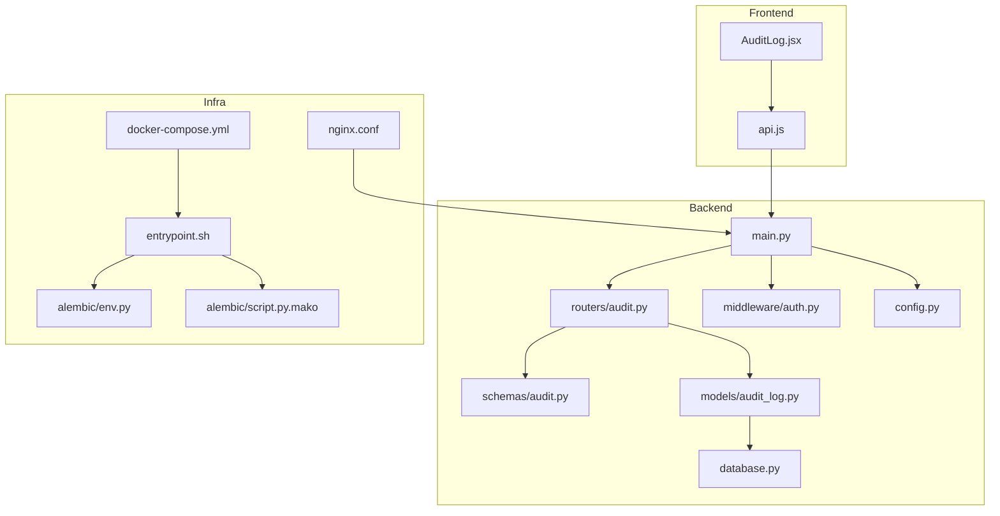
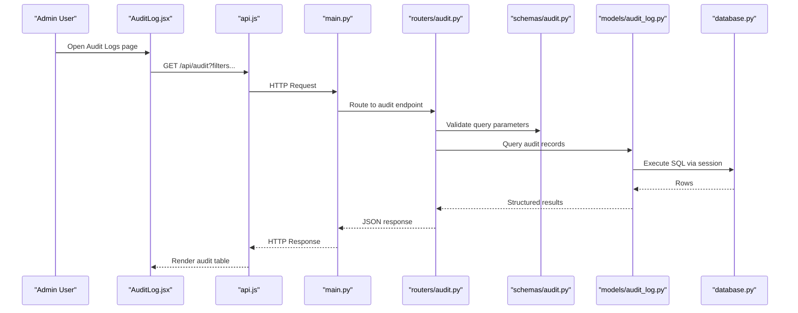
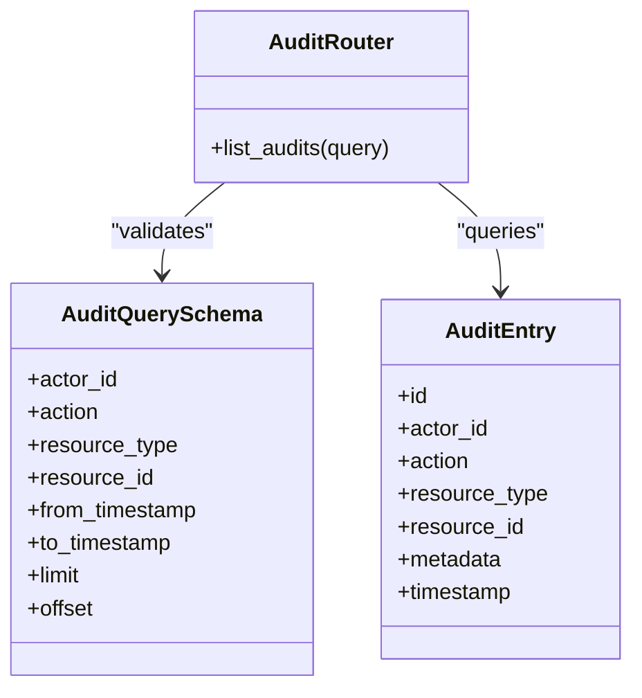
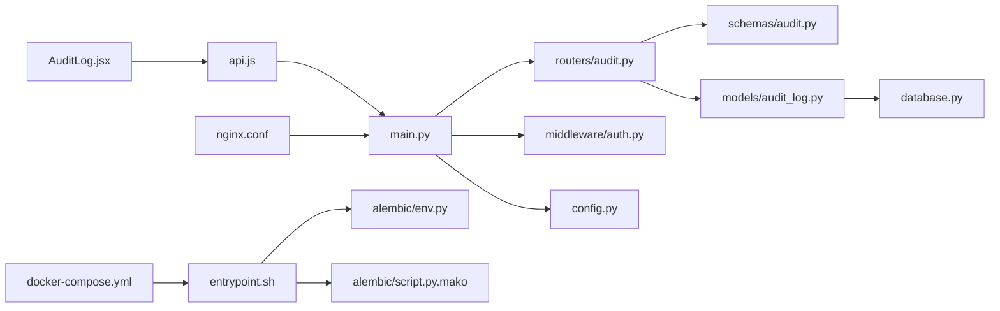

# Monitoring & Maintenance

<cite>
**Referenced Files in This Document**
- [backend/app/main.py](file://backend/app/main.py)
- [backend/app/database.py](file://backend/app/database.py)
- [backend/app/models/audit_log.py](file://backend/app/models/audit_log.py)
- [backend/app/routers/audit.py](file://backend/app/routers/audit.py)
- [backend/app/schemas/audit.py](file://backend/app/schemas/audit.py)
- [backend/app/middleware/auth.py](file://backend/app/middleware/auth.py)
- [backend/app/config.py](file://backend/app/config.py)
- [backend/alembic/env.py](file://backend/alembic/env.py)
- [backend/alembic/script.py.mako](file://backend/alembic/script.py.mako)
- [backend/entrypoint.sh](file://backend/entrypoint.sh)
- [nginx/nginx.conf](file://nginx/nginx.conf)
- [docker-compose.yml](file://docker-compose.yml)
- [frontend/src/pages/admin/AuditLog.jsx](file://frontend/src/pages/admin/AuditLog.jsx)
- [frontend/src/services/api.js](file://frontend/src/services/api.js)
</cite>

## Table of Contents
1. [Introduction](#introduction)
2. [Project Structure](#project-structure)
3. [Core Components](#core-components)
4. [Architecture Overview](#architecture-overview)
5. [Detailed Component Analysis](#detailed-component-analysis)
6. [Dependency Analysis](#dependency-analysis)
7. [Performance Considerations](#performance-considerations)
8. [Troubleshooting Guide](#troubleshooting-guide)
9. [Conclusion](#conclusion)
10. [Appendices](#appendices)

## Introduction
This document provides comprehensive monitoring and maintenance guidance for the ECS Creator platform. It focuses on:
- Audit logging for user activities, system events, and compliance reporting
- Performance monitoring strategies, health checks, and metrics collection
- Log aggregation, analysis, and alerting setup for production
- Database maintenance, backups, and disaster recovery
- System updates, dependency management, and security patching
- Troubleshooting common operational issues and performance optimization techniques

The content is grounded in the repository’s backend audit features, database configuration, migration tooling, container orchestration, and frontend audit UI.

## Project Structure
The ECS Creator platform is a full-stack application with:
- Backend API (FastAPI-based) providing audit endpoints, models, schemas, middleware, and database integration
- Frontend admin pages for auditing and administration
- Nginx reverse proxy configuration
- Docker Compose orchestration for local and staging environments
- Alembic migrations for schema evolution

**Diagram sources**
- [backend/app/main.py](file://backend/app/main.py)
- [backend/app/routers/audit.py](file://backend/app/routers/audit.py)
- [backend/app/schemas/audit.py](file://backend/app/schemas/audit.py)
- [backend/app/models/audit_log.py](file://backend/app/models/audit_log.py)
- [backend/app/database.py](file://backend/app/database.py)
- [backend/app/middleware/auth.py](file://backend/app/middleware/auth.py)
- [backend/app/config.py](file://backend/app/config.py)
- [nginx/nginx.conf](file://nginx/nginx.conf)
- [docker-compose.yml](file://docker-compose.yml)
- [backend/entrypoint.sh](file://backend/entrypoint.sh)
- [backend/alembic/env.py](file://backend/alembic/env.py)
- [backend/alembic/script.py.mako](file://backend/alembic/script.py.mako)
- [frontend/src/pages/admin/AuditLog.jsx](file://frontend/src/pages/admin/AuditLog.jsx)
- [frontend/src/services/api.js](file://frontend/src/services/api.js)

**Section sources**
- [backend/app/main.py](file://backend/app/main.py)
- [backend/app/routers/audit.py](file://backend/app/routers/audit.py)
- [backend/app/schemas/audit.py](file://backend/app/schemas/audit.py)
- [backend/app/models/audit_log.py](file://backend/app/models/audit_log.py)
- [backend/app/database.py](file://backend/app/database.py)
- [backend/app/middleware/auth.py](file://backend/app/middleware/auth.py)
- [backend/app/config.py](file://backend/app/config.py)
- [nginx/nginx.conf](file://nginx/nginx.conf)
- [docker-compose.yml](file://docker-compose.yml)
- [backend/entrypoint.sh](file://backend/entrypoint.sh)
- [backend/alembic/env.py](file://backend/alembic/env.py)
- [backend/alembic/script.py.mako](file://backend/alembic/script.py.mako)
- [frontend/src/pages/admin/AuditLog.jsx](file://frontend/src/pages/admin/AuditLog.jsx)
- [frontend/src/services/api.js](file://frontend/src/services/api.js)

## Core Components
- Audit Logging
  - Data model for audit entries
  - Schemas for request/response validation
  - API router exposing audit queries
  - Admin UI to browse audit logs
- Database Integration
  - Engine/session configuration
  - Migration environment and script templates
- Application Bootstrap
  - Central app initialization and routing
  - Configuration loading
  - Authentication middleware
- Infrastructure
  - Reverse proxy configuration
  - Container orchestration and entrypoint scripts

Key responsibilities:
- Persist structured audit records for compliance and forensics
- Provide queryable endpoints for audit data
- Ensure consistent database schema via migrations
- Expose application configuration and runtime behavior

**Section sources**
- [backend/app/models/audit_log.py](file://backend/app/models/audit_log.py)
- [backend/app/schemas/audit.py](file://backend/app/schemas/audit.py)
- [backend/app/routers/audit.py](file://backend/app/routers/audit.py)
- [backend/app/database.py](file://backend/app/database.py)
- [backend/alembic/env.py](file://backend/alembic/env.py)
- [backend/alembic/script.py.mako](file://backend/alembic/script.py.mako)
- [backend/app/main.py](file://backend/app/main.py)
- [backend/app/config.py](file://backend/app/config.py)
- [backend/app/middleware/auth.py](file://backend/app/middleware/auth.py)
- [frontend/src/pages/admin/AuditLog.jsx](file://frontend/src/pages/admin/AuditLog.jsx)
- [frontend/src/services/api.js](file://frontend/src/services/api.js)

## Architecture Overview
The audit pipeline spans from user actions to persistent storage and administrative visibility:

**Diagram sources**
- [frontend/src/pages/admin/AuditLog.jsx](file://frontend/src/pages/admin/AuditLog.jsx)
- [frontend/src/services/api.js](file://frontend/src/services/api.js)
- [backend/app/main.py](file://backend/app/main.py)
- [backend/app/routers/audit.py](file://backend/app/routers/audit.py)
- [backend/app/schemas/audit.py](file://backend/app/schemas/audit.py)
- [backend/app/models/audit_log.py](file://backend/app/models/audit_log.py)
- [backend/app/database.py](file://backend/app/database.py)

## Detailed Component Analysis

### Audit Logging System
Purpose:
- Capture user activities and system events for compliance and troubleshooting
- Provide efficient querying and filtering capabilities
- Support export or downstream log aggregation

Implementation highlights:
- Data model defines fields for actor, action, resource, metadata, timestamp, and related context
- Schemas enforce input/output contracts for audit queries and responses
- Router exposes endpoints to list and filter audit entries
- Admin UI presents searchable tables and filters

Operational considerations:
- Indexing strategy should cover frequent filter columns (e.g., actor, action, timestamp)
- Pagination and server-side filtering are essential for large datasets
- Retention policies must align with compliance requirements

**Diagram sources**
- [backend/app/models/audit_log.py](file://backend/app/models/audit_log.py)
- [backend/app/schemas/audit.py](file://backend/app/schemas/audit.py)
- [backend/app/routers/audit.py](file://backend/app/routers/audit.py)

**Section sources**
- [backend/app/models/audit_log.py](file://backend/app/models/audit_log.py)
- [backend/app/schemas/audit.py](file://backend/app/schemas/audit.py)
- [backend/app/routers/audit.py](file://backend/app/routers/audit.py)
- [frontend/src/pages/admin/AuditLog.jsx](file://frontend/src/pages/admin/AuditLog.jsx)
- [frontend/src/services/api.js](file://frontend/src/services/api.js)

### Health Check Endpoints and Metrics Collection
Current state:
- No explicit health check endpoints are defined in the referenced files
- The application bootstrap file exists and can be extended to expose health and readiness probes

Recommendations:
- Add a lightweight /health endpoint returning service status and dependencies (e.g., database connectivity)
- Add a /ready endpoint that verifies all critical subsystems are initialized
- Integrate metrics collection (e.g., request latency, error rates, queue depth) and expose a /metrics endpoint if using Prometheus-compatible libraries
- Configure liveness/readiness probes in container orchestration based on these endpoints

**Section sources**
- [backend/app/main.py](file://backend/app/main.py)

### Log Aggregation, Analysis, and Alerting
Strategy:
- Centralize logs from containers and services into a unified collector
- Use structured logging formats to enable powerful querying and dashboards
- Implement retention policies aligned with compliance needs
- Set up alerts for critical patterns (e.g., repeated failures, high error rates, unusual audit activity)

Suggested components:
- Log collectors (e.g., sidecar agents) shipping to a centralized store
- Indexing and search layer for fast retrieval
- Visualization dashboards for operational insights
- Alerting rules tied to thresholds and anomaly detection

[No sources needed since this section provides general guidance]

### Database Maintenance Procedures
Tasks:
- Regular vacuum and analyze operations to maintain query performance
- Monitor index usage and rebuild fragmented indexes
- Track long-running transactions and lock contention
- Periodically review and optimize slow queries identified by logs

Migration management:
- Use Alembic to manage schema changes consistently across environments
- Ensure migrations are idempotent and reversible where possible
- Test migrations against representative data volumes before deployment

**Section sources**
- [backend/alembic/env.py](file://backend/alembic/env.py)
- [backend/alembic/script.py.mako](file://backend/alembic/script.py.mako)

### Backup Strategies and Disaster Recovery
Backup approach:
- Schedule regular logical or physical backups depending on data size and RPO/RTO targets
- Include both database dumps and application configuration snapshots
- Store backups securely with encryption at rest and in transit
- Verify backup integrity regularly through restore drills

Disaster recovery planning:
- Define clear RPO and RTO objectives
- Document step-by-step recovery procedures
- Maintain runbooks for failover scenarios
- Practice recovery drills periodically

[No sources needed since this section provides general guidance]

### System Updates, Dependency Management, and Security Patching
System updates:
- Pin versions in requirements and package manifests
- Use container images with minimal base layers and regular updates
- Apply OS-level security patches promptly

Dependency management:
- Automate vulnerability scanning for dependencies
- Review and approve dependency updates in CI pipelines
- Maintain changelogs and rollback plans

Security patching:
- Subscribe to security advisories for core libraries
- Prioritize critical and high-severity fixes
- Validate patches in staging before production rollout

**Section sources**
- [backend/requirements.txt](file://backend/requirements.txt)
- [frontend/package.json](file://frontend/package.json)

### Security and Compliance Controls
Controls:
- Enforce authentication and authorization for audit access
- Redact sensitive information in audit metadata
- Ensure tamper-evident audit trails with immutable storage options
- Align retention and access controls with regulatory requirements

**Section sources**
- [backend/app/middleware/auth.py](file://backend/app/middleware/auth.py)
- [backend/app/models/audit_log.py](file://backend/app/models/audit_log.py)

## Dependency Analysis
High-level dependencies among key modules:

**Diagram sources**
- [frontend/src/pages/admin/AuditLog.jsx](file://frontend/src/pages/admin/AuditLog.jsx)
- [frontend/src/services/api.js](file://frontend/src/services/api.js)
- [backend/app/main.py](file://backend/app/main.py)
- [backend/app/routers/audit.py](file://backend/app/routers/audit.py)
- [backend/app/schemas/audit.py](file://backend/app/schemas/audit.py)
- [backend/app/models/audit_log.py](file://backend/app/models/audit_log.py)
- [backend/app/database.py](file://backend/app/database.py)
- [backend/app/middleware/auth.py](file://backend/app/middleware/auth.py)
- [backend/app/config.py](file://backend/app/config.py)
- [nginx/nginx.conf](file://nginx/nginx.conf)
- [docker-compose.yml](file://docker-compose.yml)
- [backend/entrypoint.sh](file://backend/entrypoint.sh)
- [backend/alembic/env.py](file://backend/alembic/env.py)
- [backend/alembic/script.py.mako](file://backend/alembic/script.py.mako)

**Section sources**
- [backend/app/main.py](file://backend/app/main.py)
- [backend/app/routers/audit.py](file://backend/app/routers/audit.py)
- [backend/app/schemas/audit.py](file://backend/app/schemas/audit.py)
- [backend/app/models/audit_log.py](file://backend/app/models/audit_log.py)
- [backend/app/database.py](file://backend/app/database.py)
- [backend/app/middleware/auth.py](file://backend/app/middleware/auth.py)
- [backend/app/config.py](file://backend/app/config.py)
- [nginx/nginx.conf](file://nginx/nginx.conf)
- [docker-compose.yml](file://docker-compose.yml)
- [backend/entrypoint.sh](file://backend/entrypoint.sh)
- [backend/alembic/env.py](file://backend/alembic/env.py)
- [backend/alembic/script.py.mako](file://backend/alembic/script.py.mako)
- [frontend/src/pages/admin/AuditLog.jsx](file://frontend/src/pages/admin/AuditLog.jsx)
- [frontend/src/services/api.js](file://frontend/src/services/api.js)

## Performance Considerations
- Database indexing:
  - Add indexes on frequently filtered audit columns (e.g., actor, action, timestamps)
  - Monitor index usage and remove unused indexes
- Query optimization:
  - Use pagination and server-side filtering for large result sets
  - Avoid SELECT *; fetch only required fields
- Connection pooling:
  - Tune pool sizes based on workload and database capacity
- Caching:
  - Cache read-heavy, low-churn audit summaries if appropriate
- Observability:
  - Instrument request latency and error rates
  - Profile slow queries and refactor hot paths

[No sources needed since this section provides general guidance]

## Troubleshooting Guide
Common issues and resolutions:
- Audit logs not appearing:
  - Verify write permissions and database connectivity
  - Confirm audit middleware is enabled and requests pass through it
  - Check application logs for exceptions during persistence
- Slow audit queries:
  - Inspect execution plans for missing indexes
  - Reduce result set size with filters and pagination
  - Analyze lock contention and long-running transactions
- Health and readiness:
  - If no health endpoints exist, add them and configure probes
  - Validate dependency checks (e.g., database reachability)
- Deployment and migrations:
  - Ensure Alembic environment is configured correctly
  - Roll back failed migrations safely and re-run after fixing issues

**Section sources**
- [backend/app/routers/audit.py](file://backend/app/routers/audit.py)
- [backend/app/models/audit_log.py](file://backend/app/models/audit_log.py)
- [backend/app/database.py](file://backend/app/database.py)
- [backend/alembic/env.py](file://backend/alembic/env.py)
- [backend/alembic/script.py.mako](file://backend/alembic/script.py.mako)

## Conclusion
The ECS Creator platform includes robust audit logging capabilities backed by a well-structured data model and API surface. To achieve production-grade monitoring and maintenance:
- Extend the application with health and metrics endpoints
- Centralize logs and implement alerting
- Harden database maintenance and backup processes
- Automate dependency updates and security patching
- Continuously monitor performance and tune queries and indexes

These practices will ensure reliability, compliance, and operational efficiency.

## Appendices

### Operational Runbook Checklist
- Daily:
  - Verify health endpoints and probe statuses
  - Review error rates and audit anomalies
  - Check disk space and log rotation
- Weekly:
  - Validate backup integrity
  - Review slow query logs and index usage
  - Scan dependencies for vulnerabilities
- Monthly:
  - Perform disaster recovery drill
  - Update base images and OS packages
  - Review retention policies and compliance reports

[No sources needed since this section provides general guidance]