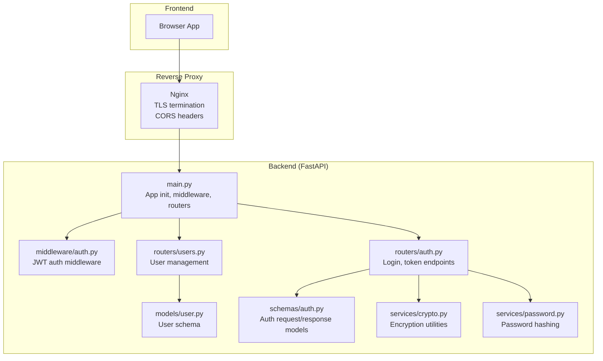
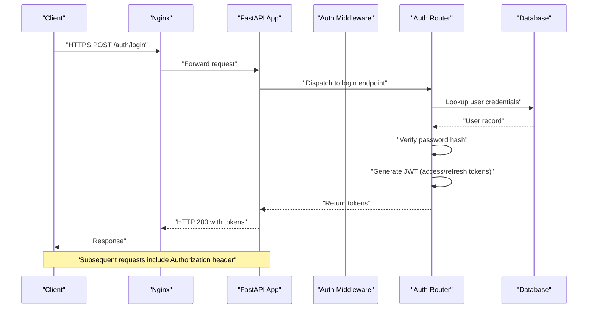
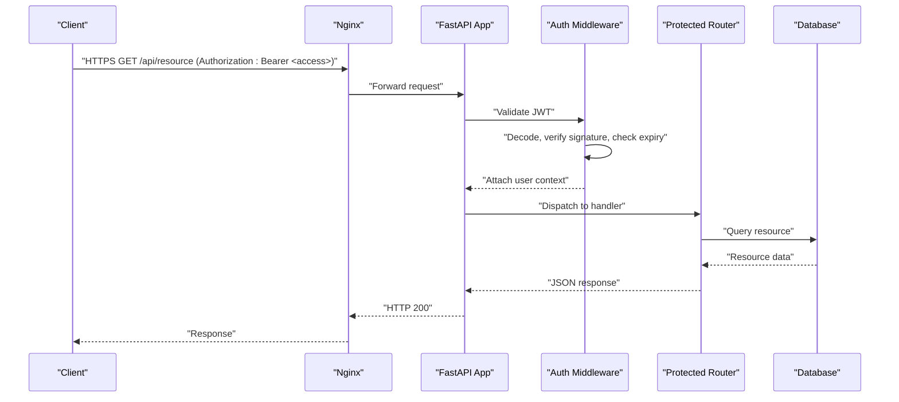
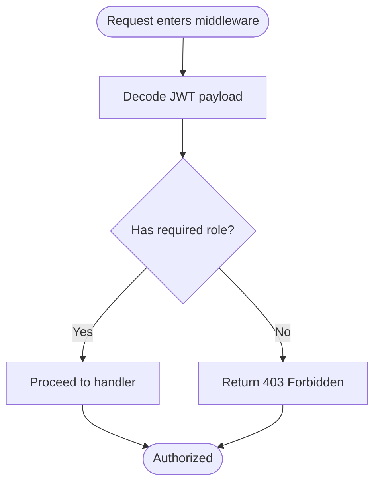
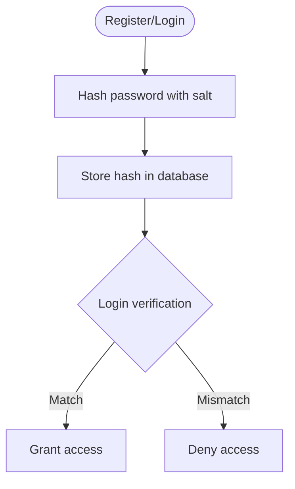
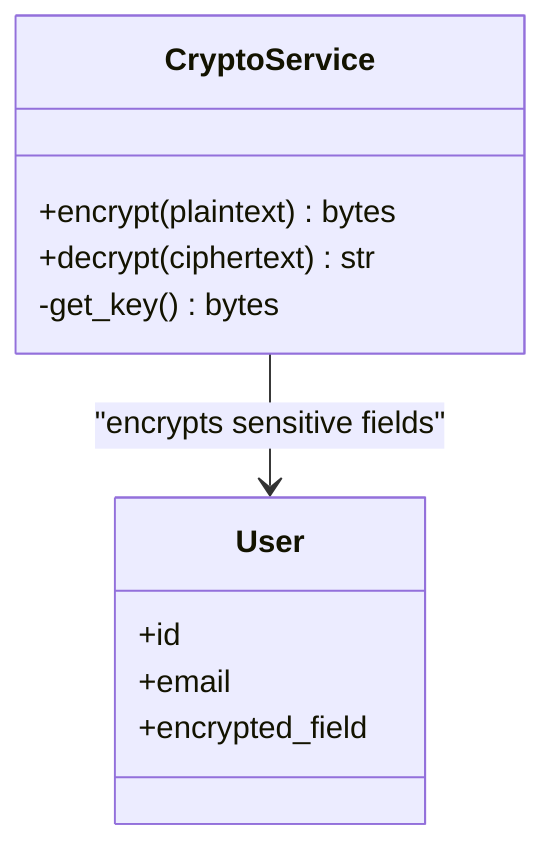
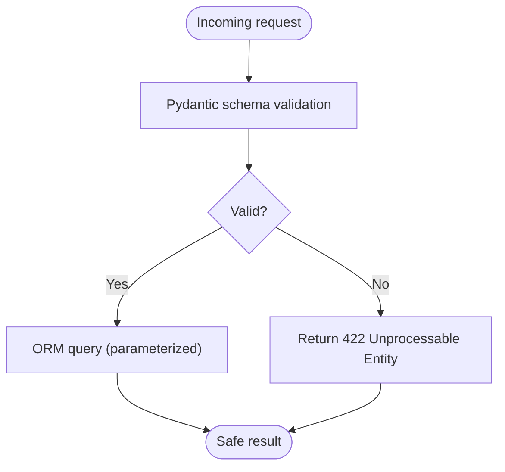
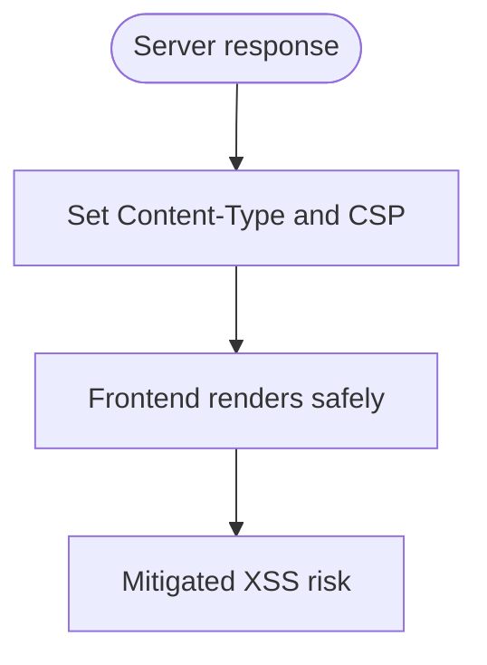
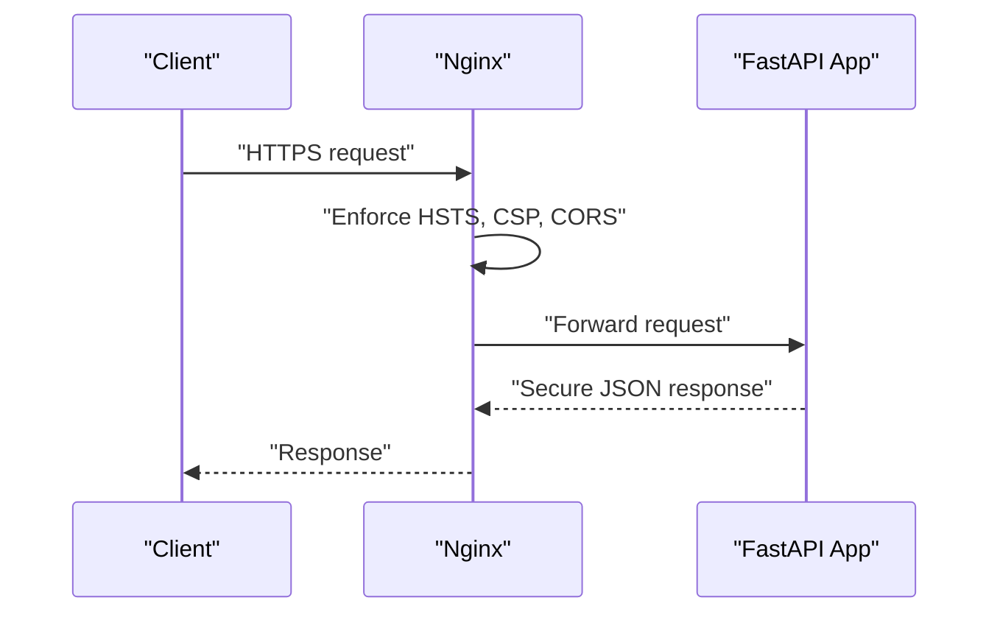
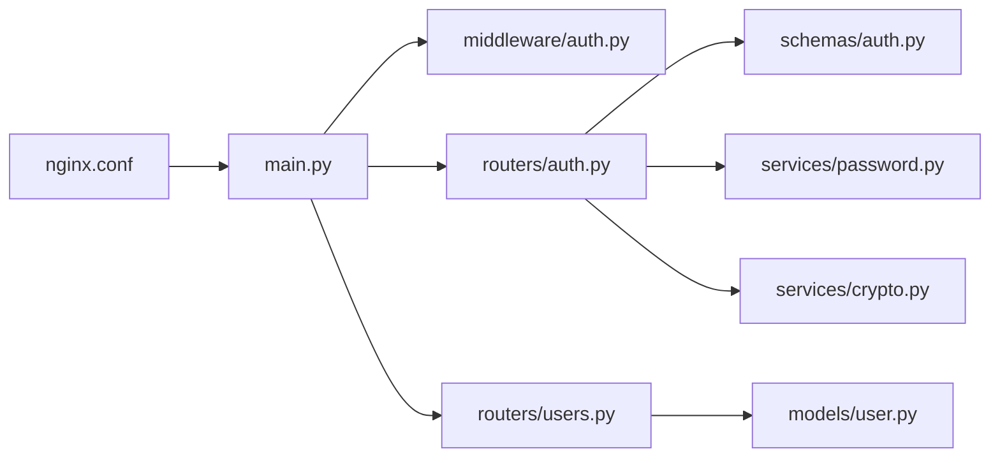

# Security & Authentication

<cite>
**Referenced Files in This Document**
- [backend/app/main.py](file://backend/app/main.py)
- [backend/app/middleware/auth.py](file://backend/app/middleware/auth.py)
- [backend/app/routers/auth.py](file://backend/app/routers/auth.py)
- [backend/app/routers/users.py](file://backend/app/routers/users.py)
- [backend/app/models/user.py](file://backend/app/models/user.py)
- [backend/app/schemas/auth.py](file://backend/app/schemas/auth.py)
- [backend/app/services/crypto.py](file://backend/app/services/crypto.py)
- [backend/app/services/password.py](file://backend/app/services/password.py)
- [backend/app/config.py](file://backend/app/config.py)
- [nginx/nginx.conf](file://nginx/nginx.conf)
</cite>

## Table of Contents
1. [Introduction](#introduction)
2. [Project Structure](#project-structure)
3. [Core Components](#core-components)
4. [Architecture Overview](#architecture-overview)
5. [Detailed Component Analysis](#detailed-component-analysis)
6. [Dependency Analysis](#dependency-analysis)
7. [Performance Considerations](#performance-considerations)
8. [Troubleshooting Guide](#troubleshooting-guide)
9. [Conclusion](#conclusion)
10. [Appendices](#appendices)

## Introduction
This document provides comprehensive security documentation for the ECS Creator platform, focusing on authentication and authorization mechanisms, secure data handling, input validation, API security, and operational guidance for enterprise deployments. It explains how JWT-based authentication is implemented, how roles are enforced, how passwords are hashed, and what measures protect against common vulnerabilities such as SQL injection and cross-site scripting (XSS). It also outlines best practices for CORS configuration, secure communication protocols, and procedures for security audits and vulnerability assessments.

## Project Structure
The backend implements a FastAPI application with modular routers, Pydantic schemas, SQLAlchemy models, and middleware for authentication. The frontend communicates with the backend via HTTP(S), while Nginx serves as a reverse proxy to enforce TLS and route traffic securely.

**Diagram sources**
- [backend/app/main.py](file://backend/app/main.py)
- [backend/app/middleware/auth.py](file://backend/app/middleware/auth.py)
- [backend/app/routers/auth.py](file://backend/app/routers/auth.py)
- [backend/app/routers/users.py](file://backend/app/routers/users.py)
- [backend/app/models/user.py](file://backend/app/models/user.py)
- [backend/app/schemas/auth.py](file://backend/app/schemas/auth.py)
- [backend/app/services/crypto.py](file://backend/app/services/crypto.py)
- [backend/app/services/password.py](file://backend/app/services/password.py)
- [nginx/nginx.conf](file://nginx/nginx.conf)

**Section sources**
- [backend/app/main.py](file://backend/app/main.py)
- [nginx/nginx.conf](file://nginx/nginx.conf)

## Core Components
- JWT-based authentication: Token issuance upon successful login, validation via middleware, and refresh flow for extending sessions without re-authentication.
- Role-based access control (RBAC): Enforced at router level using decorators or middleware checks that inspect user roles from the JWT payload.
- Password hashing: Secure password storage using industry-standard algorithms configured through service modules.
- Encryption utilities: Symmetric encryption helpers for sensitive data fields where necessary.
- Input validation: Pydantic schemas validate and sanitize incoming requests; database interactions use parameterized queries to prevent SQL injection.
- XSS protection: Server-side output encoding and strict content-type enforcement; frontend rendering libraries handle escaping by default.
- API security: HTTPS-only endpoints, CORS policy defined at the reverse proxy and/or application layer, rate limiting considerations, and robust error responses.

**Section sources**
- [backend/app/middleware/auth.py](file://backend/app/middleware/auth.py)
- [backend/app/routers/auth.py](file://backend/app/routers/auth.py)
- [backend/app/routers/users.py](file://backend/app/routers/users.py)
- [backend/app/schemas/auth.py](file://backend/app/schemas/auth.py)
- [backend/app/services/password.py](file://backend/app/services/password.py)
- [backend/app/services/crypto.py](file://backend/app/services/crypto.py)

## Architecture Overview
The system follows a layered architecture:
- Client tier: Browser-based UI.
- Edge tier: Nginx terminates TLS, enforces CORS, and forwards requests to the backend.
- Application tier: FastAPI app initializes middleware and routes, validates inputs, authenticates users, and authorizes actions based on roles.
- Data tier: Database accessed via SQLAlchemy with parameterized queries.

**Diagram sources**
- [backend/app/routers/auth.py](file://backend/app/routers/auth.py)
- [backend/app/middleware/auth.py](file://backend/app/middleware/auth.py)
- [nginx/nginx.conf](file://nginx/nginx.conf)

## Detailed Component Analysis

### JWT Authentication Flow
- Login: Validates credentials, issues short-lived access tokens and longer-lived refresh tokens.
- Access token usage: Each protected request includes an Authorization header; middleware decodes and validates the token, attaching user context to the request.
- Refresh flow: Clients exchange a valid refresh token for a new access token without requiring re-login.

**Diagram sources**
- [backend/app/middleware/auth.py](file://backend/app/middleware/auth.py)
- [backend/app/routers/auth.py](file://backend/app/routers/auth.py)

**Section sources**
- [backend/app/middleware/auth.py](file://backend/app/middleware/auth.py)
- [backend/app/routers/auth.py](file://backend/app/routers/auth.py)

### Role-Based Access Control (RBAC)
- Roles are embedded in the JWT payload and validated by middleware or router-level guards.
- Admin endpoints require admin role; user endpoints allow standard users.
- Deny-by-default strategy ensures only explicitly permitted roles can access sensitive operations.

**Diagram sources**
- [backend/app/middleware/auth.py](file://backend/app/middleware/auth.py)
- [backend/app/routers/users.py](file://backend/app/routers/users.py)

**Section sources**
- [backend/app/middleware/auth.py](file://backend/app/middleware/auth.py)
- [backend/app/routers/users.py](file://backend/app/routers/users.py)

### Password Hashing and Storage
- Passwords are hashed using a strong algorithm configured in the password service module.
- Salting is handled automatically by the hashing library.
- Verification compares provided plaintext against stored hashes during login.

**Diagram sources**
- [backend/app/services/password.py](file://backend/app/services/password.py)
- [backend/app/models/user.py](file://backend/app/models/user.py)

**Section sources**
- [backend/app/services/password.py](file://backend/app/services/password.py)
- [backend/app/models/user.py](file://backend/app/models/user.py)

### Encryption Utilities
- Symmetric encryption helpers are provided for encrypting sensitive fields when needed.
- Keys should be managed via environment variables or a secrets manager.
- Use authenticated encryption modes to ensure integrity and confidentiality.

**Diagram sources**
- [backend/app/services/crypto.py](file://backend/app/services/crypto.py)
- [backend/app/models/user.py](file://backend/app/models/user.py)

**Section sources**
- [backend/app/services/crypto.py](file://backend/app/services/crypto.py)
- [backend/app/models/user.py](file://backend/app/models/user.py)

### Input Validation and SQL Injection Prevention
- All API inputs are validated using Pydantic schemas to enforce types, formats, and constraints.
- Database queries use parameterized statements via SQLAlchemy ORM to prevent SQL injection.
- Error responses avoid leaking internal details.

**Diagram sources**
- [backend/app/schemas/auth.py](file://backend/app/schemas/auth.py)
- [backend/app/routers/auth.py](file://backend/app/routers/auth.py)

**Section sources**
- [backend/app/schemas/auth.py](file://backend/app/schemas/auth.py)
- [backend/app/routers/auth.py](file://backend/app/routers/auth.py)

### XSS Protection Measures
- Server-side responses set appropriate Content-Type headers to prevent MIME sniffing.
- Frontend rendering libraries escape HTML by default; avoid dangerously setting innerHTML.
- Implement Content-Security-Policy via Nginx to restrict script execution sources.

[No sources needed since this section provides general guidance]

### API Security Best Practices
- Enforce HTTPS everywhere; terminate TLS at Nginx.
- Configure CORS strictly to allow only trusted origins and methods.
- Use short-lived access tokens and refresh tokens to limit exposure.
- Rate-limit sensitive endpoints and implement account lockout policies.
- Log authentication events and errors for auditability.

**Diagram sources**
- [nginx/nginx.conf](file://nginx/nginx.conf)
- [backend/app/main.py](file://backend/app/main.py)

**Section sources**
- [nginx/nginx.conf](file://nginx/nginx.conf)
- [backend/app/main.py](file://backend/app/main.py)

## Dependency Analysis
The following diagram shows key dependencies among security-related components:

**Diagram sources**
- [backend/app/main.py](file://backend/app/main.py)
- [backend/app/middleware/auth.py](file://backend/app/middleware/auth.py)
- [backend/app/routers/auth.py](file://backend/app/routers/auth.py)
- [backend/app/routers/users.py](file://backend/app/routers/users.py)
- [backend/app/schemas/auth.py](file://backend/app/schemas/auth.py)
- [backend/app/services/password.py](file://backend/app/services/password.py)
- [backend/app/services/crypto.py](file://backend/app/services/crypto.py)
- [backend/app/models/user.py](file://backend/app/models/user.py)
- [nginx/nginx.conf](file://nginx/nginx.conf)

**Section sources**
- [backend/app/main.py](file://backend/app/main.py)
- [backend/app/middleware/auth.py](file://backend/app/middleware/auth.py)
- [backend/app/routers/auth.py](file://backend/app/routers/auth.py)
- [backend/app/routers/users.py](file://backend/app/routers/users.py)
- [backend/app/schemas/auth.py](file://backend/app/schemas/auth.py)
- [backend/app/services/password.py](file://backend/app/services/password.py)
- [backend/app/services/crypto.py](file://backend/app/services/crypto.py)
- [backend/app/models/user.py](file://backend/app/models/user.py)
- [nginx/nginx.conf](file://nginx/nginx.conf)

## Performance Considerations
- Keep JWT payloads minimal to reduce overhead; store additional user attributes server-side if needed.
- Cache frequently accessed user profiles behind a short-lived cache to minimize database hits.
- Use efficient hashing parameters tuned for your deployment’s CPU budget.
- Offload TLS termination to Nginx and enable HTTP/2 for improved throughput.

[No sources needed since this section provides general guidance]

## Troubleshooting Guide
- Authentication failures:
  - Verify JWT secret configuration and expiration settings.
  - Check middleware decoding logic and error responses.
- Authorization denials:
  - Ensure roles are correctly included in the JWT and checked by middleware/guards.
- CORS errors:
  - Confirm allowed origins, methods, and headers in both Nginx and application layers.
- HTTPS issues:
  - Validate certificate paths and Nginx TLS configuration.

**Section sources**
- [backend/app/middleware/auth.py](file://backend/app/middleware/auth.py)
- [backend/app/routers/auth.py](file://backend/app/routers/auth.py)
- [nginx/nginx.conf](file://nginx/nginx.conf)

## Conclusion
The ECS Creator platform employs a robust security posture centered on JWT-based authentication, RBAC enforcement, secure password hashing, and encrypted storage for sensitive data. Input validation and parameterized queries mitigate injection risks, while Nginx enforces secure transport and strict CORS policies. Following the audit guidelines and compliance recommendations in the appendices will help maintain a resilient and compliant deployment.

## Appendices

### Security Audit Guidelines
- Review JWT configuration:
  - Secret rotation schedule and storage.
  - Token lifetimes and refresh token handling.
- Validate RBAC coverage:
  - Confirm all sensitive endpoints are guarded.
  - Test privilege escalation scenarios.
- Inspect cryptographic implementations:
  - Ensure correct algorithms and key lengths.
  - Verify key management processes.
- Assess input validation:
  - Confirm all endpoints use Pydantic schemas.
  - Test boundary conditions and malformed inputs.
- Evaluate logging and monitoring:
  - Ensure authentication events are logged securely.
  - Verify log retention and access controls.

[No sources needed since this section provides general guidance]

### Vulnerability Assessment Procedures
- Static analysis:
  - Run linters and SAST tools on backend and frontend code.
- Dynamic testing:
  - Perform authenticated and unauthenticated scans.
  - Focus on authentication, authorization, and data handling endpoints.
- Penetration testing:
  - Simulate token theft, replay attacks, and session hijacking attempts.
  - Validate CORS misconfigurations and CSP effectiveness.

[No sources needed since this section provides general guidance]

### Compliance Considerations for Enterprise Deployments
- Data protection:
  - Encrypt sensitive fields at rest and in transit.
  - Implement least-privilege access and audit trails.
- Policy enforcement:
  - Enforce MFA for administrative accounts.
  - Centralize logging and integrate with SIEM.
- Governance:
  - Maintain configuration baselines and change control processes.
  - Conduct periodic reviews and remediation tracking.

[No sources needed since this section provides general guidance]