# API Routing & Request Processing

<cite>
**Referenced Files in This Document**
- [main.py](file://backend/app/main.py)
- [auth.py](file://backend/app/middleware/auth.py)
- [users.py](file://backend/app/routers/users.py)
- [templates.py](file://backend/app/routers/templates.py)
- [requests.py](file://backend/app/routers/requests.py)
- [approvals.py](file://backend/app/routers/approvals.py)
- [active_resources.py](file://backend/app/routers/active_resources.py)
- [audit.py](file://backend/app/routers/audit.py)
- [settings.py](file://backend/app/routers/settings.py)
- [user.py](file://backend/app/schemas/user.py)
- [template.py](file://backend/app/schemas/template.py)
- [request.py](file://backend/app/schemas/request.py)
- [approval.py](file://backend/app/schemas/approval.py)
- [audit.py](file://backend/app/schemas/audit.py)
- [settings.py](file://backend/app/schemas/settings.py)
- [auth.py](file://backend/app/schemas/auth.py)
- [database.py](file://backend/app/database.py)
- [config.py](file://backend/app/config.py)
</cite>

## Table of Contents
1. [Introduction](#introduction)
2. [Project Structure](#project-structure)
3. [Core Components](#core-components)
4. [Architecture Overview](#architecture-overview)
5. [Detailed Component Analysis](#detailed-component-analysis)
6. [Dependency Analysis](#dependency-analysis)
7. [Performance Considerations](#performance-considerations)
8. [Troubleshooting Guide](#troubleshooting-guide)
9. [Conclusion](#conclusion)
10. [Appendices](#appendices)

## Introduction
This document explains the FastAPI routing system and request processing pipeline for the ECS Creator backend. It covers route organization patterns, dependency injection in routers, and the end-to-end lifecycle of requests and responses. It also documents all API endpoint groups (users, templates, requests, approvals, active resources, audit logs, and settings), validation using Pydantic schemas, response formatting, and error handling strategies. Finally, it provides guidance on implementing new endpoints, adding authentication guards, organizing complex route hierarchies, API versioning, documentation generation, and performance monitoring at the routing level.

## Project Structure
The backend follows a feature-based layout:
- Routers define HTTP endpoints grouped by domain.
- Schemas define request/response models with Pydantic.
- Middleware implements cross-cutting concerns such as authentication.
- Services encapsulate business logic and external integrations.
- Database and configuration modules provide shared infrastructure.

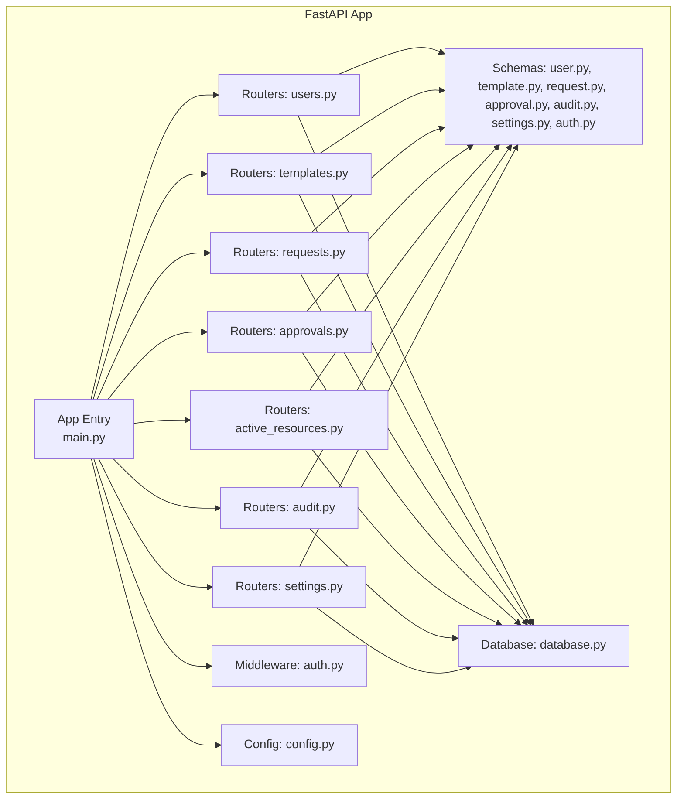

**Diagram sources**
- [main.py](file://backend/app/main.py)
- [auth.py](file://backend/app/middleware/auth.py)
- [users.py](file://backend/app/routers/users.py)
- [templates.py](file://backend/app/routers/templates.py)
- [requests.py](file://backend/app/routers/requests.py)
- [approvals.py](file://backend/app/routers/approvals.py)
- [active_resources.py](file://backend/app/routers/active_resources.py)
- [audit.py](file://backend/app/routers/audit.py)
- [settings.py](file://backend/app/routers/settings.py)
- [user.py](file://backend/app/schemas/user.py)
- [template.py](file://backend/app/schemas/template.py)
- [request.py](file://backend/app/schemas/request.py)
- [approval.py](file://backend/app/schemas/approval.py)
- [audit.py](file://backend/app/schemas/audit.py)
- [settings.py](file://backend/app/schemas/settings.py)
- [auth.py](file://backend/app/schemas/auth.py)
- [database.py](file://backend/app/database.py)
- [config.py](file://backend/app/config.py)

**Section sources**
- [main.py](file://backend/app/main.py)
- [config.py](file://backend/app/config.py)
- [database.py](file://backend/app/database.py)

## Core Components
- Application entry point initializes middleware, mounts routers, and configures app-level settings.
- Authentication middleware validates tokens and injects current user context into requests.
- Routers group endpoints by domain and use dependency injection to access services and database sessions.
- Pydantic schemas enforce input validation and describe OpenAPI documentation.
- Database module provides session management and connection configuration.

Key responsibilities:
- Route organization: Each router file corresponds to a domain area and is mounted under a consistent path prefix.
- Dependency injection: Use FastAPI’s Depends() to inject authenticated user, database sessions, and service instances.
- Lifecycle management: Middleware runs before route handlers; responses are serialized via Pydantic models.

**Section sources**
- [main.py](file://backend/app/main.py)
- [auth.py](file://backend/app/middleware/auth.py)
- [database.py](file://backend/app/database.py)
- [config.py](file://backend/app/config.py)

## Architecture Overview
The request flow passes through middleware, then into the appropriate router handler, which uses injected dependencies to perform business logic and return structured responses.

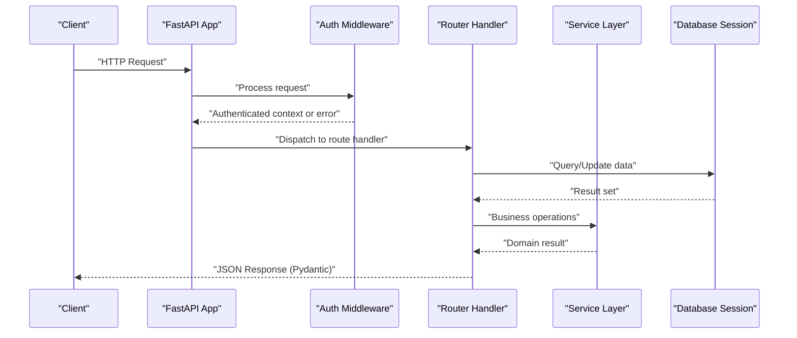

**Diagram sources**
- [main.py](file://backend/app/main.py)
- [auth.py](file://backend/app/middleware/auth.py)
- [users.py](file://backend/app/routers/users.py)
- [requests.py](file://backend/app/routers/requests.py)
- [database.py](file://backend/app/database.py)

## Detailed Component Analysis

### Users API
Endpoints typically include listing, retrieving, creating, updating, and deleting users. Validation is enforced via Pydantic schemas.

- Route organization: Grouped under /api/v1/users.
- Dependency injection: Current user from auth middleware, database session, and optional services.
- Validation: User create/update payloads validated against schema models.
- Responses: Structured JSON responses conforming to response schemas.

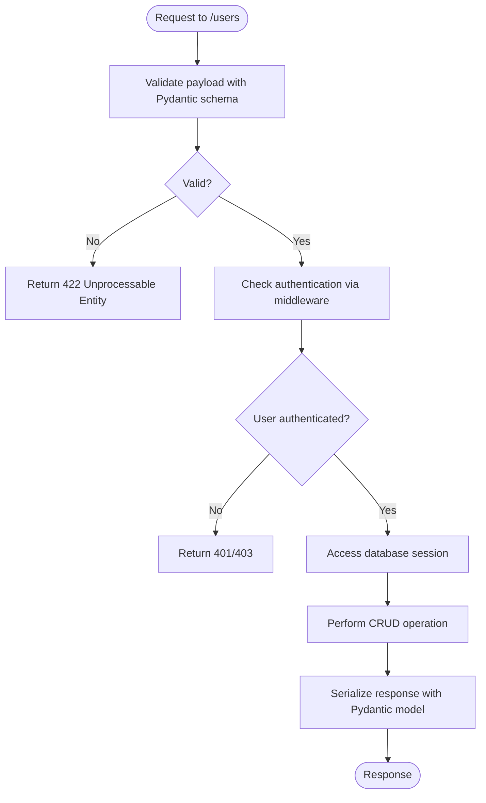

**Diagram sources**
- [users.py](file://backend/app/routers/users.py)
- [user.py](file://backend/app/schemas/user.py)
- [auth.py](file://backend/app/middleware/auth.py)
- [database.py](file://backend/app/database.py)

**Section sources**
- [users.py](file://backend/app/routers/users.py)
- [user.py](file://backend/app/schemas/user.py)

### Templates API
Endpoints manage template definitions used for resource provisioning.

- Route organization: Grouped under /api/v1/templates.
- Validation: Template creation/update payloads validated against schema models.
- Dependencies: Database session and optional template service.

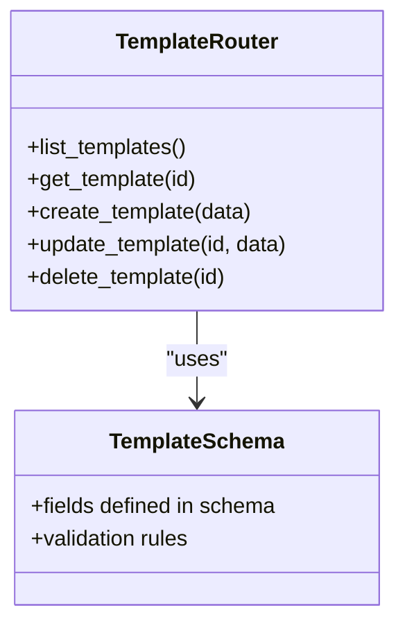

**Diagram sources**
- [templates.py](file://backend/app/routers/templates.py)
- [template.py](file://backend/app/schemas/template.py)

**Section sources**
- [templates.py](file://backend/app/routers/templates.py)
- [template.py](file://backend/app/schemas/template.py)

### Requests API
Endpoints handle resource request submissions and status tracking.

- Route organization: Grouped under /api/v1/requests.
- Validation: Request payloads validated against schema models.
- Dependencies: Database session and request service.

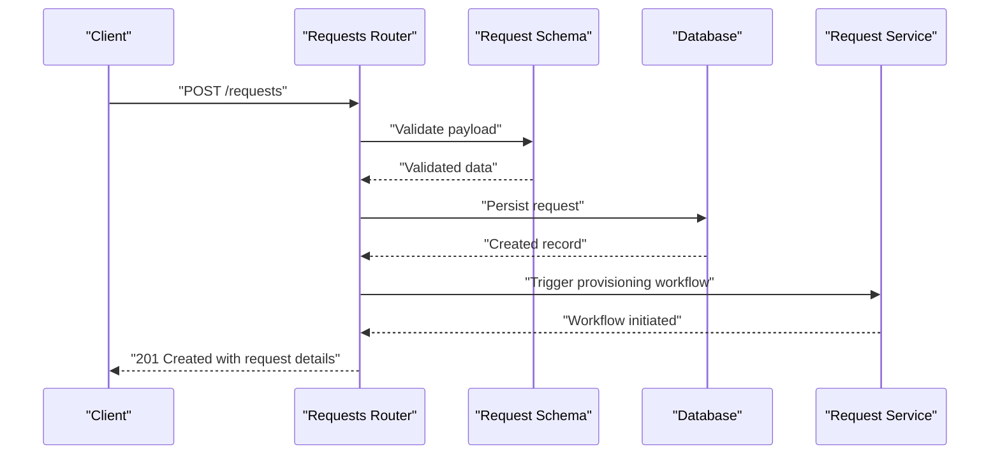

**Diagram sources**
- [requests.py](file://backend/app/routers/requests.py)
- [request.py](file://backend/app/schemas/request.py)
- [database.py](file://backend/app/database.py)

**Section sources**
- [requests.py](file://backend/app/routers/requests.py)
- [request.py](file://backend/app/schemas/request.py)

### Approvals API
Endpoints support approval workflows for requests.

- Route organization: Grouped under /api/v1/approvals.
- Validation: Approval actions validated against schema models.
- Dependencies: Database session and approval service.

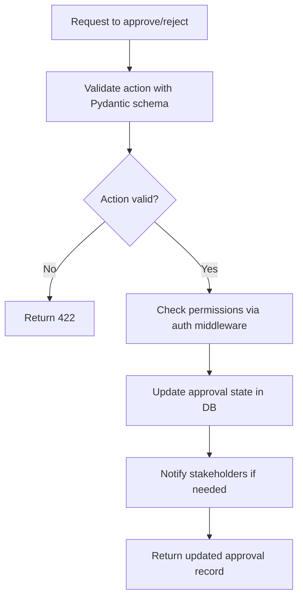

**Diagram sources**
- [approvals.py](file://backend/app/routers/approvals.py)
- [approval.py](file://backend/app/schemas/approval.py)
- [auth.py](file://backend/app/middleware/auth.py)
- [database.py](file://backend/app/database.py)

**Section sources**
- [approvals.py](file://backend/app/routers/approvals.py)
- [approval.py](file://backend/app/schemas/approval.py)

### Active Resources API
Endpoints list and manage currently active cloud resources.

- Route organization: Grouped under /api/v1/active-resources.
- Dependencies: Database session and cloud service integrations.

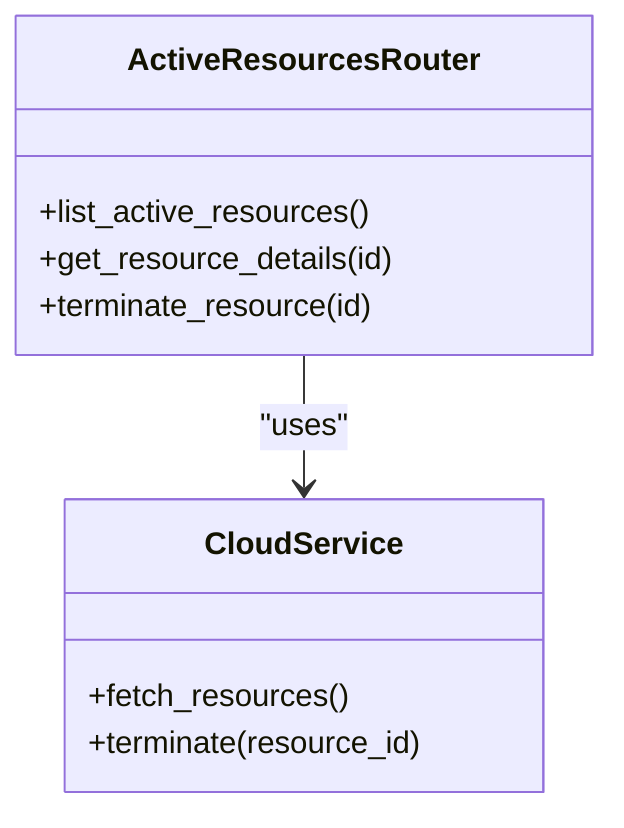

**Diagram sources**
- [active_resources.py](file://backend/app/routers/active_resources.py)

**Section sources**
- [active_resources.py](file://backend/app/routers/active_resources.py)

### Audit Logs API
Endpoints expose audit trail entries for compliance and debugging.

- Route organization: Grouped under /api/v1/audit.
- Validation: Query parameters validated against schema models.
- Dependencies: Database session.

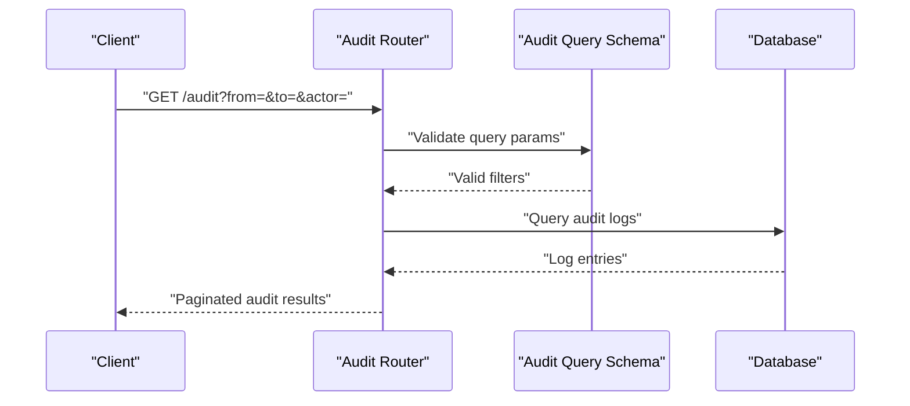

**Diagram sources**
- [audit.py](file://backend/app/routers/audit.py)
- [audit.py](file://backend/app/schemas/audit.py)
- [database.py](file://backend/app/database.py)

**Section sources**
- [audit.py](file://backend/app/routers/audit.py)
- [audit.py](file://backend/app/schemas/audit.py)

### Settings API
Endpoints manage application settings and configurations.

- Route organization: Grouped under /api/v1/settings.
- Validation: Settings update payloads validated against schema models.
- Dependencies: Database session and settings service.

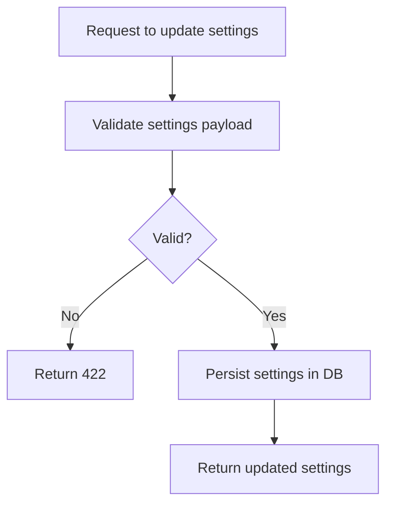

**Diagram sources**
- [settings.py](file://backend/app/routers/settings.py)
- [settings.py](file://backend/app/schemas/settings.py)
- [database.py](file://backend/app/database.py)

**Section sources**
- [settings.py](file://backend/app/routers/settings.py)
- [settings.py](file://backend/app/schemas/settings.py)

### Authentication Middleware
Authentication middleware validates tokens and injects the current user into the request context.

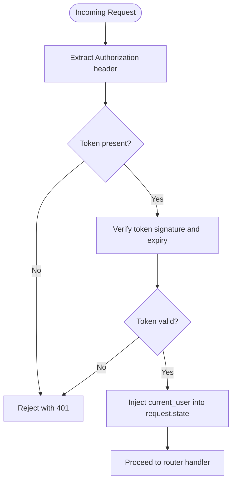

**Diagram sources**
- [auth.py](file://backend/app/middleware/auth.py)

**Section sources**
- [auth.py](file://backend/app/middleware/auth.py)

## Dependency Analysis
Routers depend on:
- Pydantic schemas for validation and OpenAPI docs.
- Database session for persistence.
- Optional services for business logic and external integrations.
- Authentication middleware for security.

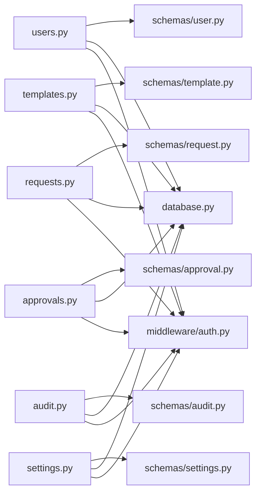

**Diagram sources**
- [users.py](file://backend/app/routers/users.py)
- [templates.py](file://backend/app/routers/templates.py)
- [requests.py](file://backend/app/routers/requests.py)
- [approvals.py](file://backend/app/routers/approvals.py)
- [active_resources.py](file://backend/app/routers/active_resources.py)
- [audit.py](file://backend/app/routers/audit.py)
- [settings.py](file://backend/app/routers/settings.py)
- [user.py](file://backend/app/schemas/user.py)
- [template.py](file://backend/app/schemas/template.py)
- [request.py](file://backend/app/schemas/request.py)
- [approval.py](file://backend/app/schemas/approval.py)
- [audit.py](file://backend/app/schemas/audit.py)
- [settings.py](file://backend/app/schemas/settings.py)
- [auth.py](file://backend/app/middleware/auth.py)
- [database.py](file://backend/app/database.py)

**Section sources**
- [main.py](file://backend/app/main.py)
- [auth.py](file://backend/app/middleware/auth.py)
- [database.py](file://backend/app/database.py)

## Performance Considerations
- Use efficient queries and pagination in routers to reduce payload sizes.
- Cache frequently accessed read-only data where appropriate.
- Avoid heavy computations inside route handlers; delegate to services.
- Leverage FastAPI’s async capabilities for I/O-bound operations.
- Monitor response times and add logging around critical routes.

[No sources needed since this section provides general guidance]

## Troubleshooting Guide
Common issues and resolutions:
- Validation errors: Ensure request payloads match Pydantic schemas; check field types and constraints.
- Authentication failures: Verify token presence, format, and expiration; inspect middleware behavior.
- Database errors: Confirm connection configuration and transaction handling; review error propagation.
- Missing endpoints: Ensure routers are mounted correctly and prefixes are consistent.

**Section sources**
- [auth.py](file://backend/app/middleware/auth.py)
- [database.py](file://backend/app/database.py)
- [main.py](file://backend/app/main.py)

## Conclusion
The FastAPI routing system is organized by domain, leveraging dependency injection and Pydantic schemas for robust validation and clear API contracts. Authentication middleware secures endpoints, while consistent response formatting improves client integration. Following the patterns documented here will help you implement new endpoints, extend route hierarchies, and maintain high-quality APIs.

[No sources needed since this section summarizes without analyzing specific files]

## Appendices

### Implementing New Endpoints
- Create or extend a router file under the appropriate domain.
- Define request/response Pydantic schemas in the corresponding schemas module.
- Use Depends() to inject database sessions, services, and authenticated user context.
- Mount the router in the application entry point with a consistent path prefix.

**Section sources**
- [main.py](file://backend/app/main.py)
- [users.py](file://backend/app/routers/users.py)
- [user.py](file://backend/app/schemas/user.py)

### Adding Authentication Guards
- Wrap route handlers with Depends(auth_middleware_dependency) or apply middleware globally.
- Ensure the middleware extracts and verifies tokens, then injects current_user into request.state.
- Handle unauthorized and forbidden responses consistently across routers.

**Section sources**
- [auth.py](file://backend/app/middleware/auth.py)
- [users.py](file://backend/app/routers/users.py)

### Organizing Complex Route Hierarchies
- Use nested routers for subdomains (e.g., /api/v1/admin/users).
- Maintain consistent naming and structure across routers and schemas.
- Centralize common dependencies and utilities to reduce duplication.

**Section sources**
- [main.py](file://backend/app/main.py)
- [users.py](file://backend/app/routers/users.py)
- [templates.py](file://backend/app/routers/templates.py)

### API Versioning
- Prefix routes with /api/v1 to support future versions.
- Keep backward compatibility when evolving schemas and behaviors.
- Document version changes and deprecation timelines.

**Section sources**
- [main.py](file://backend/app/main.py)

### Documentation Generation
- FastAPI automatically generates OpenAPI specs based on route signatures and Pydantic schemas.
- Provide descriptive docstrings and examples in route handlers to enrich generated docs.
- Serve interactive docs (Swagger UI and ReDoc) during development.

**Section sources**
- [main.py](file://backend/app/main.py)
- [user.py](file://backend/app/schemas/user.py)

### Performance Monitoring at the Routing Level
- Add timing metrics around route handlers for key endpoints.
- Log request IDs and correlation traces for distributed debugging.
- Integrate with observability tools to capture latency and error rates.

**Section sources**
- [main.py](file://backend/app/main.py)
- [auth.py](file://backend/app/middleware/auth.py)