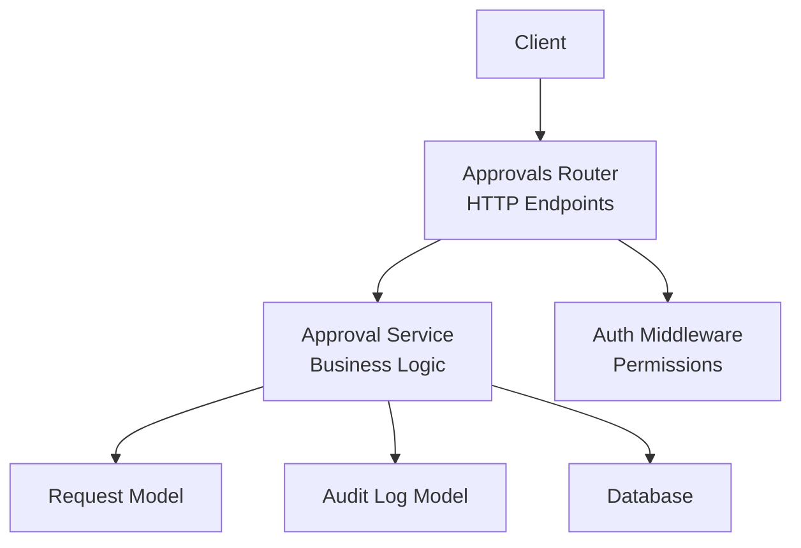
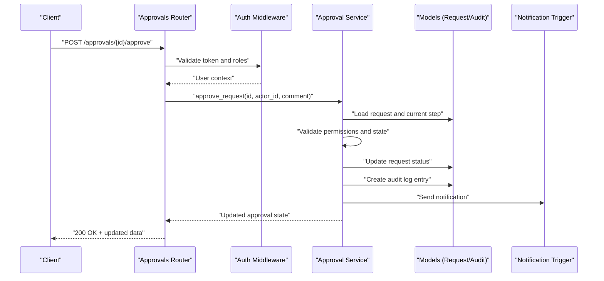
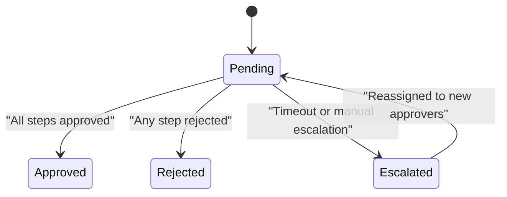
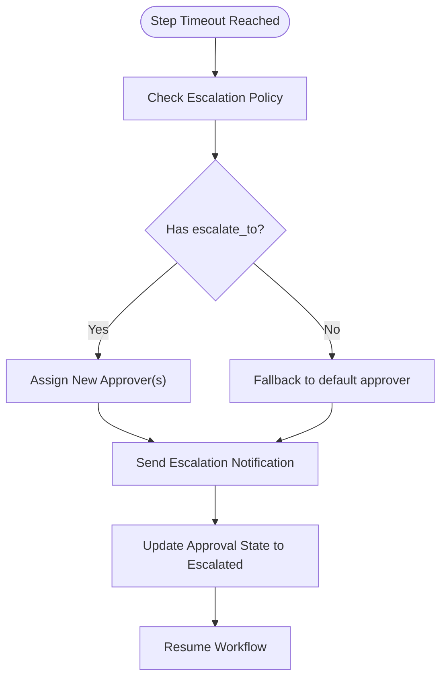
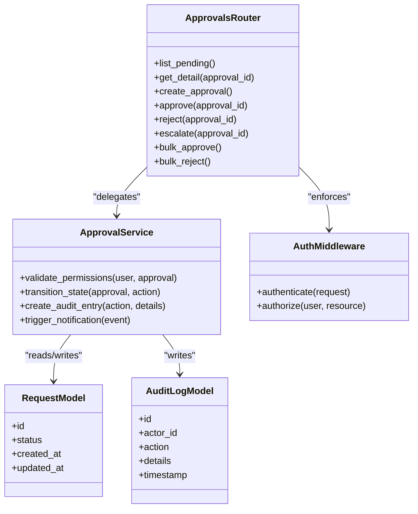

# Approval System API

<cite>
**Referenced Files in This Document**
- [backend/app/routers/approvals.py](file://backend/app/routers/approvals.py)
- [backend/app/schemas/approval.py](file://backend/app/schemas/approval.py)
- [backend/app/services/approval.py](file://backend/app/services/approval.py)
- [backend/app/models/request.py](file://backend/app/models/request.py)
- [backend/app/models/audit_log.py](file://backend/app/models/audit_log.py)
- [backend/app/middleware/auth.py](file://backend/app/middleware/auth.py)
- [backend/app/main.py](file://backend/app/main.py)
</cite>

## Table of Contents
1. [Introduction](#introduction)
2. [Project Structure](#project-structure)
3. [Core Components](#core-components)
4. [Architecture Overview](#architecture-overview)
5. [Detailed Component Analysis](#detailed-component-analysis)
6. [Dependency Analysis](#dependency-analysis)
7. [Performance Considerations](#performance-considerations)
8. [Troubleshooting Guide](#troubleshooting-guide)
9. [Conclusion](#conclusion)

## Introduction
This document provides detailed API documentation for the approval workflow management endpoints. It covers HTTP methods, URL patterns, request/response schemas, and operational behaviors for managing approval chains, processing approvals/rejections, and tracking approval status. It also explains integration with request workflows, user permissions, state transitions, audit logging, escalation handling, notification triggers, and bulk operations.

## Project Structure
The approval system is implemented as a FastAPI backend with:
- Routers defining HTTP endpoints
- Schemas defining request/response models
- Services implementing business logic
- Models representing database entities
- Middleware enforcing authentication and authorization

**Diagram sources**
- [backend/app/routers/approvals.py](file://backend/app/routers/approvals.py)
- [backend/app/services/approval.py](file://backend/app/services/approval.py)
- [backend/app/models/request.py](file://backend/app/models/request.py)
- [backend/app/models/audit_log.py](file://backend/app/models/audit_log.py)
- [backend/app/middleware/auth.py](file://backend/app/middleware/auth.py)

**Section sources**
- [backend/app/main.py](file://backend/app/main.py)
- [backend/app/routers/approvals.py](file://backend/app/routers/approvals.py)

## Core Components
- Approvals Router: Exposes HTTP endpoints for listing, creating, updating, approving, rejecting, escalating, and bulk operations on approvals.
- Approval Service: Encapsulates business rules for approval chain progression, validation, state transitions, notifications, and audit logging.
- Schemas: Pydantic models that define request and response structures for all approval-related endpoints.
- Models: Database representations for requests and audit logs used by the service layer.
- Auth Middleware: Enforces authentication and role-based permissions for approval actions.

Key responsibilities:
- Validate inputs and enforce permissions before executing approval actions.
- Manage multi-level approval chains and determine next approvers.
- Record every action to the audit log for traceability.
- Trigger notifications upon state changes or escalations.
- Support bulk operations for efficiency.

**Section sources**
- [backend/app/routers/approvals.py](file://backend/app/routers/approvals.py)
- [backend/app/schemas/approval.py](file://backend/app/schemas/approval.py)
- [backend/app/services/approval.py](file://backend/app/services/approval.py)
- [backend/app/models/request.py](file://backend/app/models/request.py)
- [backend/app/models/audit_log.py](file://backend/app/models/audit_log.py)
- [backend/app/middleware/auth.py](file://backend/app/middleware/auth.py)

## Architecture Overview
The approval API follows a layered architecture:
- HTTP Layer (Routers): Validates requests, applies middleware, delegates to services.
- Business Layer (Services): Implements approval logic, orchestrates state transitions, writes audit entries, and triggers notifications.
- Data Layer (Models): Persists requests and audit logs.

**Diagram sources**
- [backend/app/routers/approvals.py](file://backend/app/routers/approvals.py)
- [backend/app/middleware/auth.py](file://backend/app/middleware/auth.py)
- [backend/app/services/approval.py](file://backend/app/services/approval.py)
- [backend/app/models/request.py](file://backend/app/models/request.py)
- [backend/app/models/audit_log.py](file://backend/app/models/audit_log.py)

## Detailed Component Analysis

### Endpoints Reference
Base path: /api/v1/approvals (adjust if your router prefix differs). All endpoints require authentication via middleware.

- List pending approvals
  - Method: GET
  - Path: /approvals/pending
  - Query params:
    - requester_id: optional filter by requester
    - status: optional filter by current step status
  - Response: Array of approval summaries including id, request_id, current_step, approver_ids, created_at, updated_at

- Get approval detail
  - Method: GET
  - Path: /approvals/{approval_id}
  - Response: Full approval object with chain steps, history, and metadata

- Create approval chain
  - Method: POST
  - Path: /approvals
  - Request body fields:
    - request_id: string
    - approver_ids: array of strings
    - escalation_policy: object with timeout_minutes and escalate_to
    - notify_on: array of events (e.g., created, approved, rejected, escalated)
  - Response: Created approval with initial step

- Approve an approval
  - Method: POST
  - Path: /approvals/{approval_id}/approve
  - Request body fields:
    - actor_id: string
    - comment: optional string
  - Response: Updated approval state and next step info

- Reject an approval
  - Method: POST
  - Path: /approvals/{approval_id}/reject
  - Request body fields:
    - actor_id: string
    - reason: string
  - Response: Updated approval state with rejection details

- Escalate an approval
  - Method: POST
  - Path: /approvals/{approval_id}/escalate
  - Request body fields:
    - actor_id: string
    - reason: string
    - new_approver_ids: optional array of strings
  - Response: Updated approval state with escalation details

- Bulk approve
  - Method: POST
  - Path: /approvals/bulk/approve
  - Request body fields:
    - ids: array of strings
    - actor_id: string
    - comment: optional string
  - Response: Summary of successes and failures per id

- Bulk reject
  - Method: POST
  - Path: /approvals/bulk/reject
  - Request body fields:
    - ids: array of strings
    - actor_id: string
    - reason: string
  - Response: Summary of successes and failures per id

Notes:
- Permission checks are enforced at the router/service boundary. Only users with appropriate roles can approve/reject/escalate.
- Audit entries are created for each action.

**Section sources**
- [backend/app/routers/approvals.py](file://backend/app/routers/approvals.py)
- [backend/app/schemas/approval.py](file://backend/app/schemas/approval.py)
- [backend/app/services/approval.py](file://backend/app/services/approval.py)

### Request and Approval State Transitions
State machine overview:
- Pending: Initial state after creation; awaiting first approver.
- Approved: All required steps approved.
- Rejected: Any step rejected.
- Escalated: Step escalated due to timeout or manual escalation.

Transitions:
- Pending -> Approved: When all steps are approved.
- Pending -> Rejected: On any rejection.
- Pending -> Escalated: On timeout or manual escalation.
- Escalated -> Pending: After reassignment to new approvers.

**Diagram sources**
- [backend/app/services/approval.py](file://backend/app/services/approval.py)
- [backend/app/models/request.py](file://backend/app/models/request.py)

**Section sources**
- [backend/app/services/approval.py](file://backend/app/services/approval.py)
- [backend/app/models/request.py](file://backend/app/models/request.py)

### Multi-Level Approval Workflows
- Chain definition: An approval chain consists of ordered steps with one or more approvers per step.
- Progression: Each step must be completed before moving to the next.
- Parallel approvers: Multiple approvers within a step can be configured to require unanimous or majority approval.
- Example scenario:
  - Step 1: Manager approves
  - Step 2: Director approves
  - Step 3: Finance reviews
- Integration with request workflows:
  - Requests create corresponding approval chains when they require approvals.
  - The service updates request status based on approval outcomes.

**Section sources**
- [backend/app/services/approval.py](file://backend/app/services/approval.py)
- [backend/app/models/request.py](file://backend/app/models/request.py)

### Escalation Handling
- Automatic escalation: If an approver does not act within the configured timeout, the system escalates to a predefined escalate_to user or group.
- Manual escalation: Approvers can escalate with a reason and optionally assign new approvers.
- Notification triggers: Notifications are sent on escalation events.

**Diagram sources**
- [backend/app/services/approval.py](file://backend/app/services/approval.py)

**Section sources**
- [backend/app/services/approval.py](file://backend/app/services/approval.py)

### Notification Triggers
- Events: created, approved, rejected, escalated.
- Configuration: notify_on field in the approval creation payload determines which events trigger notifications.
- Delivery: Notifications are triggered by the service layer and can integrate with email, messaging, or webhook systems.

**Section sources**
- [backend/app/schemas/approval.py](file://backend/app/schemas/approval.py)
- [backend/app/services/approval.py](file://backend/app/services/approval.py)

### Integration with Request Workflows
- Creation: When a request requires approvals, the service creates an approval chain linked to the request.
- Status synchronization: Approval outcomes update the request status accordingly.
- Permissions: Access to approvals is restricted based on user roles and ownership.

**Section sources**
- [backend/app/services/approval.py](file://backend/app/services/approval.py)
- [backend/app/models/request.py](file://backend/app/models/request.py)

### User Permissions
- Roles: Admin, Approver, Requester.
- Rules:
  - Requesters can view their own approvals.
  - Approvers can approve/reject/escalate assigned steps.
  - Admins can manage all approvals and override states.
- Enforcement: Auth middleware validates tokens and roles before allowing actions.

**Section sources**
- [backend/app/middleware/auth.py](file://backend/app/middleware/auth.py)
- [backend/app/routers/approvals.py](file://backend/app/routers/approvals.py)

### Audit Logging
- Every action (create, approve, reject, escalate) generates an audit log entry.
- Entries include actor_id, action type, timestamp, and relevant details.
- Audit logs support querying and reporting for compliance.

**Section sources**
- [backend/app/models/audit_log.py](file://backend/app/models/audit_log.py)
- [backend/app/services/approval.py](file://backend/app/services/approval.py)

### Bulk Approval Operations
- Bulk approve: Accepts an array of approval ids and performs approvals atomically where possible.
- Bulk reject: Accepts an array of approval ids and performs rejections atomically where possible.
- Responses include per-id success/failure summaries for error handling.

**Section sources**
- [backend/app/routers/approvals.py](file://backend/app/routers/approvals.py)
- [backend/app/services/approval.py](file://backend/app/services/approval.py)

## Dependency Analysis
The approval system components interact as follows:

**Diagram sources**
- [backend/app/routers/approvals.py](file://backend/app/routers/approvals.py)
- [backend/app/services/approval.py](file://backend/app/services/approval.py)
- [backend/app/models/request.py](file://backend/app/models/request.py)
- [backend/app/models/audit_log.py](file://backend/app/models/audit_log.py)
- [backend/app/middleware/auth.py](file://backend/app/middleware/auth.py)

**Section sources**
- [backend/app/routers/approvals.py](file://backend/app/routers/approvals.py)
- [backend/app/services/approval.py](file://backend/app/services/approval.py)
- [backend/app/models/request.py](file://backend/app/models/request.py)
- [backend/app/models/audit_log.py](file://backend/app/models/audit_log.py)
- [backend/app/middleware/auth.py](file://backend/app/middleware/auth.py)

## Performance Considerations
- Batch operations: Use bulk endpoints to reduce round trips and improve throughput.
- Indexing: Ensure database indexes on frequently queried fields like approval_id, requester_id, and status.
- Concurrency: Implement optimistic locking or transaction isolation to prevent race conditions during concurrent approvals.
- Pagination: For large lists, implement pagination to reduce payload sizes.
- Caching: Cache read-heavy data such as approver assignments and policies where appropriate.

[No sources needed since this section provides general guidance]

## Troubleshooting Guide
Common issues and resolutions:
- Unauthorized access: Verify user roles and token validity; ensure middleware is enabled.
- Invalid state transition: Confirm current approval state allows the requested action.
- Missing approver assignment: Check escalation policy and fallback configurations.
- Audit log gaps: Ensure service writes audit entries for all actions.
- Notification failures: Inspect notification triggers and external integrations.

**Section sources**
- [backend/app/middleware/auth.py](file://backend/app/middleware/auth.py)
- [backend/app/services/approval.py](file://backend/app/services/approval.py)
- [backend/app/models/audit_log.py](file://backend/app/models/audit_log.py)

## Conclusion
The Approval System API provides robust endpoints for managing multi-level approval workflows, enforcing permissions, tracking state transitions, and maintaining comprehensive audit logs. With built-in escalation handling, notification triggers, and bulk operations, it supports scalable and compliant approval processes integrated seamlessly with request workflows.