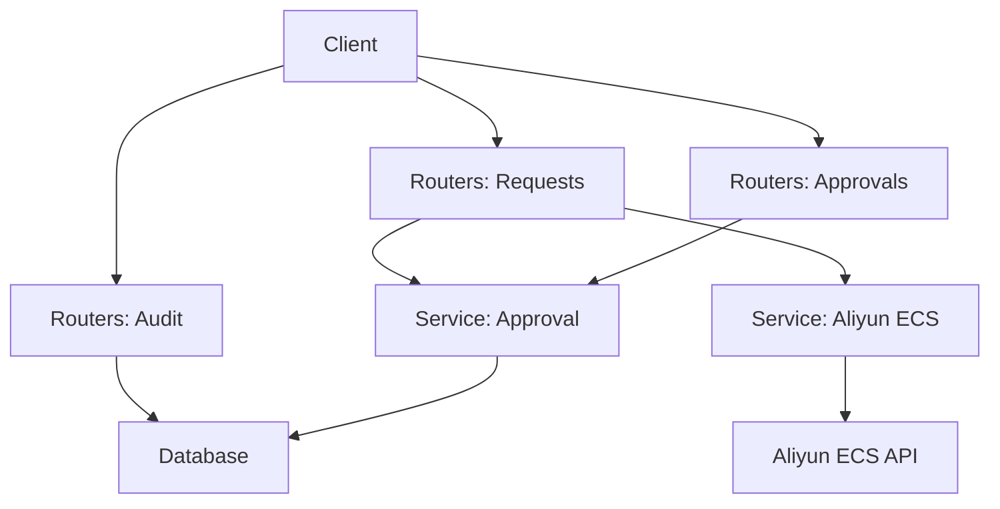
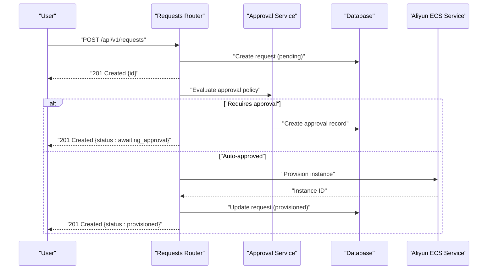
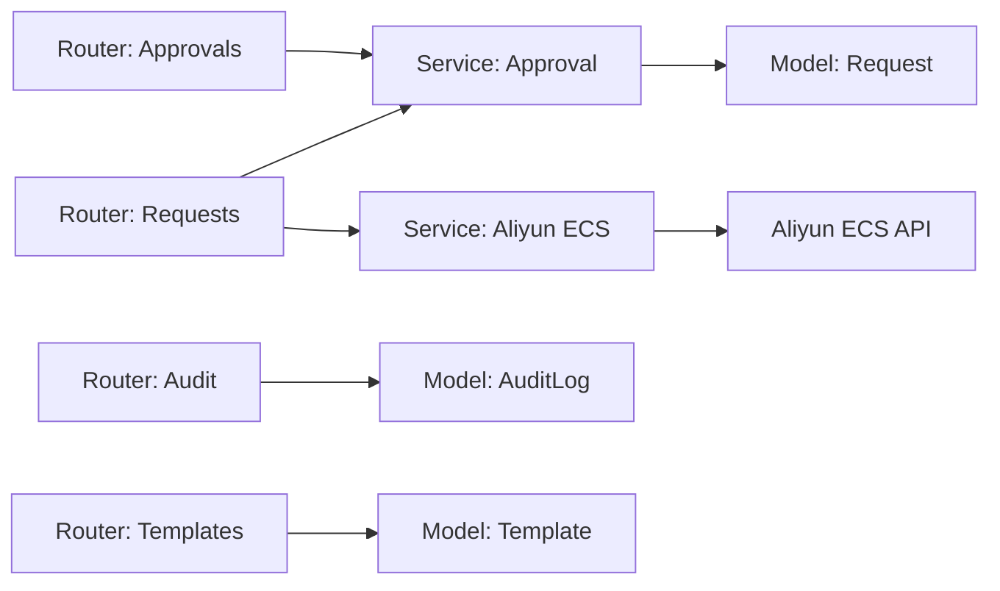

# Request Workflow API

<cite>
**Referenced Files in This Document**
- [main.py](file://backend/app/main.py)
- [requests.py](file://backend/app/routers/requests.py)
- [approvals.py](file://backend/app/routers/approvals.py)
- [audit.py](file://backend/app/routers/audit.py)
- [request.py](file://backend/app/models/request.py)
- [approval.py](file://backend/app/services/approval.py)
- [aliyun_ecs.py](file://backend/app/services/aliyun_ecs.py)
- [request_schema.py](file://backend/app/schemas/request.py)
- [approval_schema.py](file://backend/app/schemas/approval.py)
- [audit_schema.py](file://backend/app/schemas/audit.py)
- [auth_middleware.py](file://backend/app/middleware/auth.py)
</cite>

## Table of Contents
1. [Introduction](#introduction)
2. [Project Structure](#project-structure)
3. [Core Components](#core-components)
4. [Architecture Overview](#architecture-overview)
5. [Detailed Component Analysis](#detailed-component-analysis)
6. [Dependency Analysis](#dependency-analysis)
7. [Performance Considerations](#performance-considerations)
8. [Troubleshooting Guide](#troubleshooting-guide)
9. [Conclusion](#conclusion)

## Introduction
This document provides comprehensive API documentation for the resource request workflow endpoints used to submit, track, and manage ECS instance provisioning requests. It covers HTTP methods, URL patterns, request/response schemas, validation rules, error states, approval integration, real-time status updates, and audit trail generation. The goal is to enable both developers and operators to integrate with and operate the system effectively.

## Project Structure
The backend implements a FastAPI application with modular routers for requests, approvals, audit logs, templates, users, settings, and active resources. Schemas define request/response models, services encapsulate business logic (including Aliyun ECS/VPC integrations), and middleware handles authentication.

[No sources needed since this diagram shows conceptual structure]

## Core Components
- Request submission and lifecycle management via the requests router.
- Approval orchestration via the approvals router and approval service.
- Audit logging via the audit router and audit log model.
- Data models and schemas for requests, approvals, and audit entries.
- Authentication middleware protecting sensitive endpoints.

Key responsibilities:
- Validate incoming payloads against schemas.
- Persist requests and transitions to the database.
- Enforce approval workflows before provisioning.
- Integrate with Aliyun ECS to provision instances.
- Record audit events for compliance and traceability.

**Section sources**
- [main.py](file://backend/app/main.py)
- [requests.py](file://backend/app/routers/requests.py)
- [approvals.py](file://backend/app/routers/approvals.py)
- [audit.py](file://backend/app/routers/audit.py)
- [request.py](file://backend/app/models/request.py)
- [approval.py](file://backend/app/services/approval.py)
- [aliyun_ecs.py](file://backend/app/services/aliyun_ecs.py)
- [request_schema.py](file://backend/app/schemas/request.py)
- [approval_schema.py](file://backend/app/schemas/approval.py)
- [audit_schema.py](file://backend/app/schemas/audit.py)
- [auth_middleware.py](file://backend/app/middleware/auth.py)

## Architecture Overview
The request workflow follows these phases:
- Submission: Clients submit a request with template selection and parameters.
- Validation: Payloads are validated against schemas; required fields and constraints are enforced.
- Approval: If configured, requests enter an approval queue; approvers can approve or reject.
- Provisioning: Upon approval, the system provisions ECS instances via the cloud provider.
- Status Updates: Clients poll or subscribe to status changes; transitions are persisted and audited.
- Cancellation: Users may cancel pending requests; cancellations are audited.

**Diagram sources**
- [requests.py](file://backend/app/routers/requests.py)
- [approval.py](file://backend/app/services/approval.py)
- [aliyun_ecs.py](file://backend/app/services/aliyun_ecs.py)
- [request.py](file://backend/app/models/request.py)

## Detailed Component Analysis

### Requests Endpoints
Purpose: Submit, list, retrieve, update, and cancel resource requests.

- POST /api/v1/requests
  - Description: Submit a new ECS provisioning request.
  - Authentication: Required (see Middleware).
  - Request body: See Request Schema.
  - Response: 201 Created with request details including id and initial status.
  - Errors: 400 Bad Request (validation), 401 Unauthorized, 403 Forbidden, 409 Conflict (duplicate or invalid state), 500 Internal Server Error.

- GET /api/v1/requests
  - Description: List requests with optional filters (e.g., status, user, template).
  - Query params: status, user_id, template_id, page, limit.
  - Response: 200 OK with paginated list.

- GET /api/v1/requests/{request_id}
  - Description: Retrieve a specific request by ID.
  - Path param: request_id (UUID).
  - Response: 200 OK with request details.
  - Errors: 404 Not Found.

- PATCH /api/v1/requests/{request_id}
  - Description: Update mutable fields (e.g., notes, priority) if allowed by state.
  - Request body: Partial update schema.
  - Response: 200 OK with updated request.
  - Errors: 400 Bad Request, 403 Forbidden, 404 Not Found, 409 Conflict.

- DELETE /api/v1/requests/{request_id}
  - Description: Cancel a pending request.
  - Response: 200 OK with cancellation confirmation.
  - Errors: 403 Forbidden, 404 Not Found, 409 Conflict (cannot cancel in current state).

Request Schema
- Fields:
  - template_id: string (required)
  - parameters: object (required)
  - tags: array of strings (optional)
  - notes: string (optional)
  - priority: enum ["low","normal","high"] (default "normal")
- Validation:
  - template_id must reference an existing template.
  - parameters must conform to selected template’s schema.
  - priority must be one of allowed values.
  - tags must be unique strings.

Response Schema
- Fields:
  - id: string (UUID)
  - status: enum ["pending","awaiting_approval","approved","provisioning","provisioned","failed","cancelled"]
  - template_id: string
  - parameters: object
  - created_by: string (user id)
  - created_at: datetime
  - updated_at: datetime
  - last_error: string (nullable)
  - instance_id: string (nullable)

Example: Submitting a request with template selection
- Method: POST
- URL: /api/v1/requests
- Headers: Authorization: Bearer <token>, Content-Type: application/json
- Body:
  - template_id: "<template_uuid>"
  - parameters: {"region": "cn-hangzhou", "instance_type": "ecs.g6.large", "disk_size_gb": 100}
  - tags: ["dev","test"]
  - notes: "Initial test instance"
  - priority: "normal"
- Response: 201 Created with {id, status: "awaiting_approval" or "provisioned"}

Status Monitoring
- Poll GET /api/v1/requests/{request_id} periodically or use server-sent events if supported.
- Status transitions are recorded and visible in audit logs.

Cancellation Workflow
- Method: DELETE /api/v1/requests/{request_id}
- Allowed only when status is "pending" or "awaiting_approval".
- On success, status becomes "cancelled" and an audit entry is created.

**Section sources**
- [requests.py](file://backend/app/routers/requests.py)
- [request_schema.py](file://backend/app/schemas/request.py)
- [request.py](file://backend/app/models/request.py)

### Approvals Endpoints
Purpose: Manage approval decisions for requests requiring human review.

- GET /api/v1/approvals
  - Description: List pending approvals with filters (e.g., requester, template).
  - Query params: status, requester_id, template_id, page, limit.
  - Response: 200 OK with paginated list.

- POST /api/v1/approvals/{approval_id}/approve
  - Description: Approve a pending approval.
  - Response: 200 OK with updated approval and request status transition to "approved".

- POST /api/v1/approvals/{approval_id}/reject
  - Description: Reject a pending approval.
  - Response: 200 OK with updated approval and request status transition to "cancelled" or "rejected".

- GET /api/v1/approvals/{approval_id}
  - Description: Get approval details.
  - Response: 200 OK with approval data.

Approval Schema
- Fields:
  - id: string (UUID)
  - request_id: string (UUID)
  - status: enum ["pending","approved","rejected"]
  - approved_by: string (user id, nullable)
  - comment: string (nullable)
  - created_at: datetime
  - updated_at: datetime

Integration Notes
- Approval decisions trigger downstream actions:
  - Approve: Transition request to "approved" and start provisioning.
  - Reject: Transition request to "rejected" or "cancelled" and notify the requester.

**Section sources**
- [approvals.py](file://backend/app/routers/approvals.py)
- [approval_schema.py](file://backend/app/schemas/approval.py)
- [approval.py](file://backend/app/services/approval.py)

### Audit Log Endpoints
Purpose: Provide an immutable audit trail for all significant actions.

- GET /api/v1/audit
  - Description: List audit entries with filters (e.g., entity_type, entity_id, actor).
  - Query params: entity_type, entity_id, actor_id, from_time, to_time, page, limit.
  - Response: 200 OK with paginated list.

- GET /api/v1/audit/{entry_id}
  - Description: Retrieve a specific audit entry.
  - Response: 200 OK with entry details.

Audit Entry Schema
- Fields:
  - id: string (UUID)
  - actor_id: string (user id)
  - action: string (e.g., "request.created","approval.approved","request.cancelled")
  - entity_type: string (e.g., "request","approval")
  - entity_id: string (UUID)
  - metadata: object (nullable)
  - timestamp: datetime

Real-Time Status Updates
- For long-running operations (e.g., provisioning), clients should:
  - Poll GET /api/v1/requests/{request_id} at intervals.
  - Optionally consume audit events via SSE/WebSocket if enabled.
  - Observe status transitions: "provisioning" -> "provisioned" or "failed".

**Section sources**
- [audit.py](file://backend/app/routers/audit.py)
- [audit_schema.py](file://backend/app/schemas/audit.py)

### Templates Integration
Purpose: Select a template during request submission to constrain parameters.

- GET /api/v1/templates
  - Description: List available templates.
  - Response: 200 OK with template definitions.

- GET /api/v1/templates/{template_id}
  - Description: Retrieve a specific template definition.
  - Response: 200 OK with template schema and defaults.

Template Schema
- Fields:
  - id: string (UUID)
  - name: string
  - description: string
  - parameters_schema: object (JSON schema)
  - defaults: object
  - tags: array of strings

Validation Flow
- When submitting a request:
  - Fetch template by template_id.
  - Validate parameters against template.parameters_schema.
  - Apply defaults for missing fields.
  - Persist request with validated payload.

**Section sources**
- [templates.py](file://backend/app/routers/templates.py)
- [template_schema.py](file://backend/app/schemas/template.py)

### Authentication and Authorization
- Middleware enforces token-based authentication on protected routes.
- Role-based access control restricts admin-only endpoints (e.g., approvals, audit).
- Unauthorized or forbidden responses include standard error codes.

**Section sources**
- [auth_middleware.py](file://backend/app/middleware/auth.py)

## Dependency Analysis
The following diagram illustrates key dependencies among routers, services, models, and external APIs.

**Diagram sources**
- [requests.py](file://backend/app/routers/requests.py)
- [approvals.py](file://backend/app/routers/approvals.py)
- [audit.py](file://backend/app/routers/audit.py)
- [approval.py](file://backend/app/services/approval.py)
- [aliyun_ecs.py](file://backend/app/services/aliyun_ecs.py)
- [request.py](file://backend/app/models/request.py)
- [audit.py](file://backend/app/models/audit_log.py)
- [template.py](file://backend/app/models/template.py)

**Section sources**
- [requests.py](file://backend/app/routers/requests.py)
- [approvals.py](file://backend/app/routers/approvals.py)
- [audit.py](file://backend/app/routers/audit.py)
- [approval.py](file://backend/app/services/approval.py)
- [aliyun_ecs.py](file://backend/app/services/aliyun_ecs.py)
- [request.py](file://backend/app/models/request.py)
- [audit.py](file://backend/app/models/audit_log.py)
- [template.py](file://backend/app/models/template.py)

## Performance Considerations
- Pagination: Use page and limit query parameters for list endpoints to reduce payload size.
- Indexing: Ensure database indexes on frequently filtered fields (e.g., status, created_by, template_id).
- Idempotency: Implement client-side retries with idempotency keys for POST submissions.
- Backoff: Exponential backoff for polling status updates to avoid thundering herds.
- Caching: Cache template definitions and read-only metadata where appropriate.
- Concurrency: Limit concurrent provisioning tasks per tenant to prevent resource exhaustion.

[No sources needed since this section provides general guidance]

## Troubleshooting Guide
Common errors and resolutions:
- 400 Bad Request: Invalid or missing fields; validate against schemas and template parameters.
- 401 Unauthorized: Missing or invalid token; ensure proper Authorization header.
- 403 Forbidden: Insufficient permissions; verify user roles for approvals and audit access.
- 404 Not Found: Invalid IDs; confirm request_id or approval_id exist.
- 409 Conflict: Duplicate or invalid state transitions; check current status before updates.
- 500 Internal Server Error: Unexpected failures; inspect audit logs and service logs for stack traces.

Operational checks:
- Verify Aliyun ECS credentials and network connectivity.
- Confirm template existence and parameter schema compatibility.
- Review audit trail for recent actions and transitions.

**Section sources**
- [audit.py](file://backend/app/routers/audit.py)
- [audit_schema.py](file://backend/app/schemas/audit.py)
- [approval.py](file://backend/app/services/approval.py)
- [aliyun_ecs.py](file://backend/app/services/aliyun_ecs.py)

## Conclusion
The Request Workflow API provides a robust framework for managing ECS instance provisioning through structured submission, validation, approval, provisioning, and auditing. By adhering to the documented schemas, status transitions, and best practices, clients can reliably integrate with the system and maintain full visibility into request lifecycles.