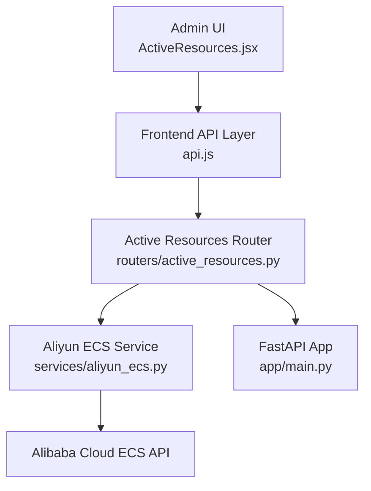
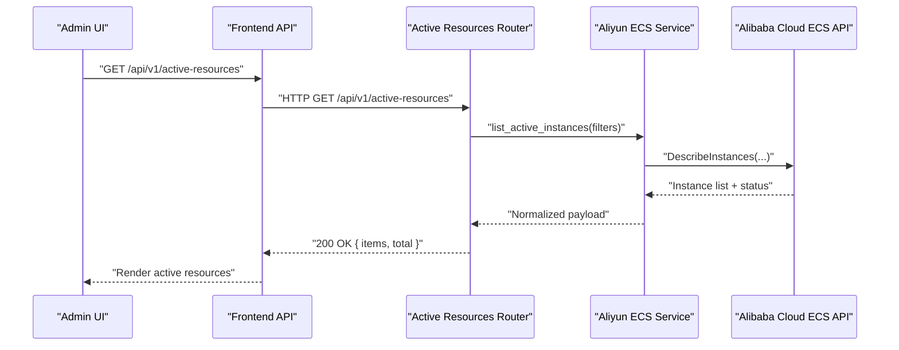
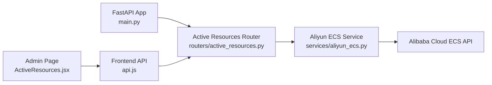

# Resource Monitoring API

<cite>
**Referenced Files in This Document**
- [active_resources.py](file://backend/app/routers/active_resources.py)
- [aliyun_ecs.py](file://backend/app/services/aliyun_ecs.py)
- [main.py](file://backend/app/main.py)
- [ActiveResources.jsx](file://frontend/src/pages/admin/ActiveResources.jsx)
- [api.js](file://frontend/src/services/api.js)
</cite>

## Table of Contents
1. [Introduction](#introduction)
2. [Project Structure](#project-structure)
3. [Core Components](#core-components)
4. [Architecture Overview](#architecture-overview)
5. [Detailed Component Analysis](#detailed-component-analysis)
6. [Dependency Analysis](#dependency-analysis)
7. [Performance Considerations](#performance-considerations)
8. [Troubleshooting Guide](#troubleshooting-guide)
9. [Conclusion](#conclusion)

## Introduction
This document provides comprehensive API documentation for the active resource monitoring endpoints that query, filter, and manage currently running ECS instances. It covers HTTP methods, URL patterns, request/response schemas, examples for status checking and health monitoring, batch operations, integration with Alibaba Cloud APIs, real-time synchronization behavior, performance considerations, caching strategies, and resource cleanup operations.

## Project Structure
The backend exposes REST endpoints under a dedicated router for active resources. The service layer integrates with Alibaba Cloud ECS to fetch instance metadata and status. The frontend admin page consumes these endpoints to display live resource information.

**Diagram sources**
- [active_resources.py](file://backend/app/routers/active_resources.py)
- [aliyun_ecs.py](file://backend/app/services/aliyun_ecs.py)
- [main.py](file://backend/app/main.py)
- [ActiveResources.jsx](file://frontend/src/pages/admin/ActiveResources.jsx)
- [api.js](file://frontend/src/services/api.js)

**Section sources**
- [main.py](file://backend/app/main.py)
- [active_resources.py](file://backend/app/routers/active_resources.py)
- [aliyun_ecs.py](file://backend/app/services/aliyun_ecs.py)
- [ActiveResources.jsx](file://frontend/src/pages/admin/ActiveResources.jsx)
- [api.js](file://frontend/src/services/api.js)

## Core Components
- Active Resources Router: Defines endpoints for listing, filtering, and managing active ECS instances.
- Aliyun ECS Service: Encapsulates calls to Alibaba Cloud ECS APIs to retrieve instance details and statuses.
- Frontend Admin Page: Displays active resources and triggers polling or manual refresh actions.
- Frontend API Helper: Provides typed client functions used by the admin page.

Key responsibilities:
- Route registration and request validation.
- Query parameter parsing and response serialization.
- Integration with Alibaba Cloud SDK for real-time data retrieval.
- Error mapping and consistent error responses.

**Section sources**
- [active_resources.py](file://backend/app/routers/active_resources.py)
- [aliyun_ecs.py](file://backend/app/services/aliyun_ecs.py)
- [ActiveResources.jsx](file://frontend/src/pages/admin/ActiveResources.jsx)
- [api.js](file://frontend/src/services/api.js)

## Architecture Overview
The active resource monitoring flow is as follows:
- The admin UI requests active resources via the frontend API helper.
- The FastAPI router validates inputs and delegates to the Aliyun ECS service.
- The service calls Alibaba Cloud ECS APIs to obtain current instance states.
- Responses are normalized and returned to the UI.

**Diagram sources**
- [active_resources.py](file://backend/app/routers/active_resources.py)
- [aliyun_ecs.py](file://backend/app/services/aliyun_ecs.py)
- [ActiveResources.jsx](file://frontend/src/pages/admin/ActiveResources.jsx)
- [api.js](file://frontend/src/services/api.js)

## Detailed Component Analysis

### Active Resources Endpoints
Base path: /api/v1/active-resources

- List active instances
  - Method: GET
  - Path: /api/v1/active-resources
  - Query parameters:
    - region_id: string (optional)
    - instance_ids: string (comma-separated, optional)
    - status: string (optional; e.g., Running)
    - tag_key: string (optional)
    - tag_value: string (optional)
    - page: integer (optional; default 1)
    - page_size: integer (optional; default 20)
  - Response schema:
    - items: array of instance objects
      - id: string
      - name: string
      - status: string
      - instance_type: string
      - vpc_id: string
      - private_ip: string
      - public_ip: string (nullable)
      - tags: map<string,string>
      - created_at: string (ISO 8601)
      - updated_at: string (ISO 8601)
    - total: integer
    - page: integer
    - page_size: integer
  - Example usage:
    - GET /api/v1/active-resources?region_id=cn-hangzhou&status=Running&page_size=50

- Health check endpoint
  - Method: GET
  - Path: /api/v1/active-resources/health
  - Response schema:
    - status: string ("ok" or "degraded")
    - last_sync_at: string (ISO 8601)
    - source: string ("alibaba_cloud")
  - Example usage:
    - GET /api/v1/active-resources/health

- Batch stop instances
  - Method: POST
  - Path: /api/v1/active-resources/batch-stop
  - Request body:
    - instance_ids: array<string> (required)
    - force_stop: boolean (optional; default false)
  - Response schema:
    - task_id: string
    - status: string ("accepted" | "failed")
    - message: string
  - Example usage:
    - POST /api/v1/active-resources/batch-stop
      Body: { "instance_ids": ["i-xxx","i-yyy"], "force_stop": false }

Notes:
- All endpoints return standard HTTP status codes and structured JSON bodies.
- Errors follow a consistent shape: { code: string, message: string }.

**Section sources**
- [active_resources.py](file://backend/app/routers/active_resources.py)

### Aliyun ECS Service Integration
Responsibilities:
- Build and sign Alibaba Cloud ECS API requests.
- Paginate results when necessary.
- Normalize cloud responses into internal schema.
- Map errors to application-level exceptions.

Integration points:
- Region selection and credential management are handled via configuration consumed by the service.
- Real-time synchronization occurs on each request unless otherwise specified by caller logic.

Error handling:
- Network failures and rate limits are translated into user-friendly messages.
- Invalid parameters result in validation errors before calling the cloud provider.

**Section sources**
- [aliyun_ecs.py](file://backend/app/services/aliyun_ecs.py)

### Frontend Integration
- Admin page polls or manually refreshes the active resources list.
- Uses typed helpers to call endpoints and render results.
- Displays health status and supports batch operations through confirmation dialogs.

**Section sources**
- [ActiveResources.jsx](file://frontend/src/pages/admin/ActiveResources.jsx)
- [api.js](file://frontend/src/services/api.js)

## Dependency Analysis
The following diagram shows how components depend on each other at runtime.

**Diagram sources**
- [main.py](file://backend/app/main.py)
- [active_resources.py](file://backend/app/routers/active_resources.py)
- [aliyun_ecs.py](file://backend/app/services/aliyun_ecs.py)
- [ActiveResources.jsx](file://frontend/src/pages/admin/ActiveResources.jsx)
- [api.js](file://frontend/src/services/api.js)

**Section sources**
- [main.py](file://backend/app/main.py)
- [active_resources.py](file://backend/app/routers/active_resources.py)
- [aliyun_ecs.py](file://backend/app/services/aliyun_ecs.py)
- [ActiveResources.jsx](file://frontend/src/pages/admin/ActiveResources.jsx)
- [api.js](file://frontend/src/services/api.js)

## Performance Considerations
- Pagination: Use page and page_size to limit payloads and reduce network overhead.
- Filtering: Prefer server-side filters (region_id, status, tags) to minimize data transfer.
- Caching strategy:
  - Short-lived cache (e.g., 10–30 seconds) for read-heavy scenarios to reduce Alibaba Cloud API calls.
  - Cache invalidation on write operations (batch stop).
- Concurrency:
  - Avoid excessive concurrent requests from clients; implement debounce or throttling on the frontend.
- Rate limiting:
  - Respect Alibaba Cloud API quotas; consider backoff and retry policies in the service layer.
- Connection reuse:
  - Ensure HTTP clients reuse connections to Alibaba Cloud endpoints.

[No sources needed since this section provides general guidance]

## Troubleshooting Guide
Common issues and resolutions:
- Authentication failures:
  - Verify credentials and region settings in configuration.
  - Check access permissions for ECS DescribeInstances and StopInstances.
- Rate limit errors:
  - Implement exponential backoff and jitter on retries.
  - Reduce request frequency or increase cache TTL.
- Empty results:
  - Validate query parameters such as region_id and status.
  - Confirm that instances exist in the selected region and match filters.
- Batch operation failures:
  - Inspect task_id and message in the response.
  - Retry failed IDs individually after transient errors.

Operational checks:
- Use the health endpoint to verify connectivity and last sync time.
- Monitor logs around the service layer for detailed stack traces.

**Section sources**
- [active_resources.py](file://backend/app/routers/active_resources.py)
- [aliyun_ecs.py](file://backend/app/services/aliyun_ecs.py)

## Conclusion
The active resource monitoring API provides a robust interface to inspect and manage running ECS instances. By combining server-side filtering, pagination, and optional short-term caching, it balances real-time accuracy with performance. Proper error handling and health checks ensure operational visibility, while clear request/response schemas simplify integration across clients.