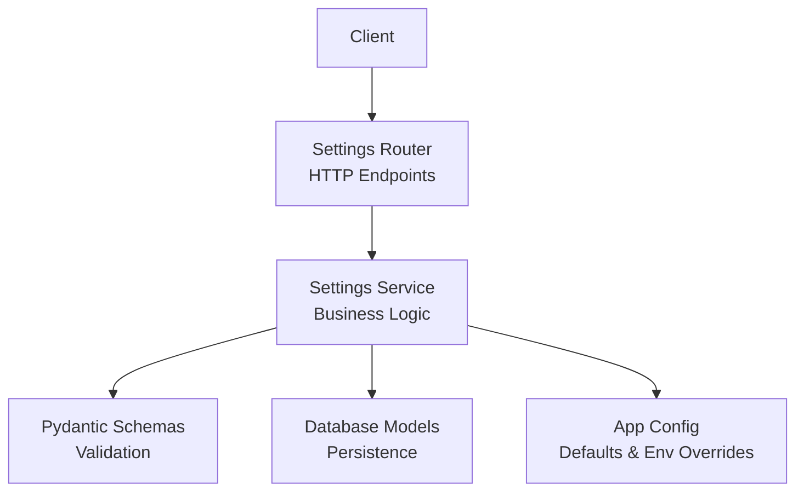
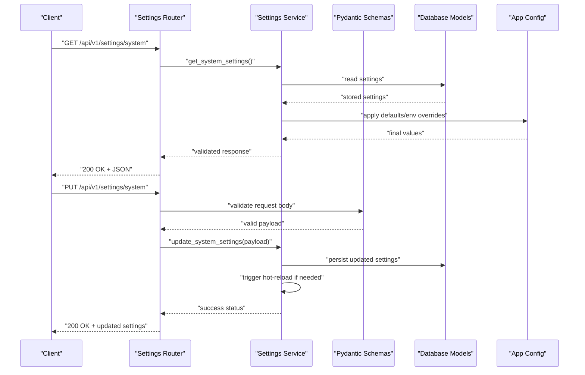
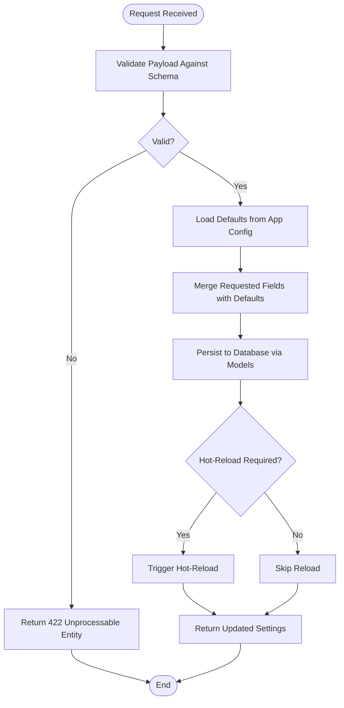
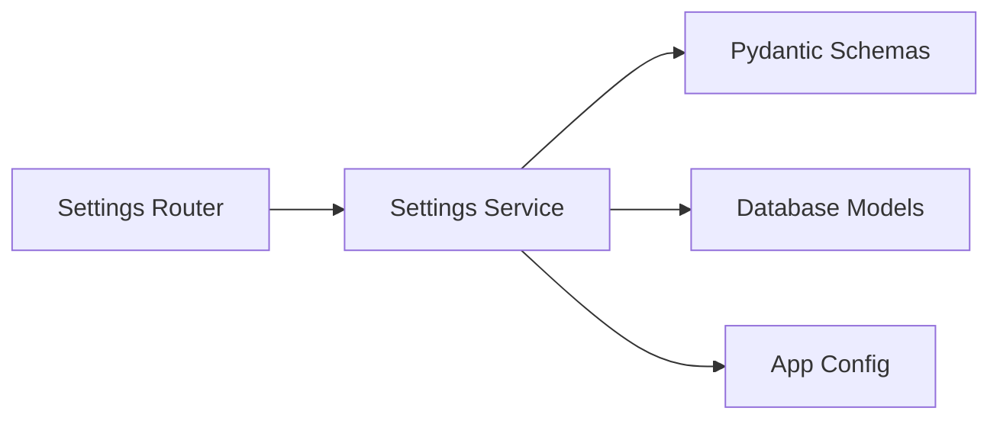

# Settings Management API

<cite>
**Referenced Files in This Document**
- [settings.py](file://backend/app/routers/settings.py)
- [settings_service.py](file://backend/app/services/settings_service.py)
- [settings.py](file://backend/app/schemas/settings.py)
- [settings.py](file://backend/app/models/settings.py)
- [config.py](file://backend/app/config.py)
- [main.py](file://backend/app/main.py)
</cite>

## Table of Contents
1. [Introduction](#introduction)
2. [Project Structure](#project-structure)
3. [Core Components](#core-components)
4. [Architecture Overview](#architecture-overview)
5. [Detailed Component Analysis](#detailed-component-analysis)
6. [Dependency Analysis](#dependency-analysis)
7. [Performance Considerations](#performance-considerations)
8. [Security Considerations](#security-considerations)
9. [Backup and Restore Procedures](#backup-and-restore-procedures)
10. [Troubleshooting Guide](#troubleshooting-guide)
11. [Conclusion](#conclusion)

## Introduction
This document provides comprehensive API documentation for the application settings and configuration endpoints. It covers system-wide configurations, environment-specific settings, and runtime parameters. The guide includes HTTP methods, URL patterns, request/response schemas, validation rules, default values, hot-reloading behavior, security considerations for sensitive data, and backup/restore procedures.

## Project Structure
The settings feature is implemented across routers, services, schemas, models, and application configuration:
- Router layer exposes REST endpoints for settings management.
- Service layer encapsulates business logic for reading, validating, updating, and persisting settings.
- Schemas define Pydantic models for request/response validation.
- Models represent persistent storage structures.
- Application config defines defaults and environment-driven overrides.

**Diagram sources**
- [settings.py](file://backend/app/routers/settings.py)
- [settings_service.py](file://backend/app/services/settings_service.py)
- [settings.py](file://backend/app/schemas/settings.py)
- [settings.py](file://backend/app/models/settings.py)
- [config.py](file://backend/app/config.py)

**Section sources**
- [settings.py](file://backend/app/routers/settings.py)
- [settings_service.py](file://backend/app/services/settings_service.py)
- [settings.py](file://backend/app/schemas/settings.py)
- [settings.py](file://backend/app/models/settings.py)
- [config.py](file://backend/app/config.py)

## Core Components
- Settings Router: Defines HTTP endpoints for retrieving and updating settings.
- Settings Service: Implements validation, persistence, and hot-reload triggers.
- Schemas: Define structured request/response payloads with validation constraints.
- Models: Represent stored settings entities.
- App Config: Provides default values and environment-based overrides.

Key responsibilities:
- Validate incoming requests against schemas.
- Persist changes to the database via models.
- Apply defaults when fields are missing.
- Trigger hot-reload where applicable.
- Return standardized responses.

**Section sources**
- [settings.py](file://backend/app/routers/settings.py)
- [settings_service.py](file://backend/app/services/settings_service.py)
- [settings.py](file://backend/app/schemas/settings.py)
- [settings.py](file://backend/app/models/settings.py)
- [config.py](file://backend/app/config.py)

## Architecture Overview
The settings API follows a layered architecture:
- Clients send HTTP requests to router endpoints.
- Routers delegate to service functions for processing.
- Services validate inputs using Pydantic schemas.
- Services interact with models to read/write settings.
- Defaults and environment overrides are applied from app config.

**Diagram sources**
- [settings.py](file://backend/app/routers/settings.py)
- [settings_service.py](file://backend/app/services/settings_service.py)
- [settings.py](file://backend/app/schemas/settings.py)
- [settings.py](file://backend/app/models/settings.py)
- [config.py](file://backend/app/config.py)

## Detailed Component Analysis

### System Settings Endpoints
- Purpose: Manage system-wide configurations such as approval workflows, notification settings, and cloud provider configurations.
- Methods and URLs:
  - GET /api/v1/settings/system
  - PUT /api/v1/settings/system
- Request/Response Schemas:
  - Request body conforms to the system settings schema defined in the schemas module.
  - Response returns the current system settings after applying defaults and validations.
- Validation Rules:
  - Fields are validated by Pydantic schemas; invalid fields result in 422 Unprocessable Entity.
  - Missing optional fields fall back to defaults from app config.
- Hot-Reload:
  - Certain updates may trigger immediate reload of dependent components without restart.
- Examples:
  - Updating approval workflow: Send a PUT request with the updated workflow configuration.
  - Updating notification settings: Include notification channels and thresholds in the request body.
  - Updating cloud provider configuration: Provide provider credentials and region settings.

**Section sources**
- [settings.py](file://backend/app/routers/settings.py)
- [settings_service.py](file://backend/app/services/settings_service.py)
- [settings.py](file://backend/app/schemas/settings.py)
- [config.py](file://backend/app/config.py)

### Environment-Specific Settings Endpoints
- Purpose: Manage settings that vary per environment (e.g., development, staging, production).
- Methods and URLs:
  - GET /api/v1/settings/environment
  - PUT /api/v1/settings/environment
- Behavior:
  - Values can be overridden by environment variables.
  - Updates persist to the database while respecting env overrides at runtime.

**Section sources**
- [settings.py](file://backend/app/routers/settings.py)
- [settings_service.py](file://backend/app/services/settings_service.py)
- [config.py](file://backend/app/config.py)

### Runtime Parameters Endpoints
- Purpose: Adjust runtime parameters that affect application behavior without restarts.
- Methods and URLs:
  - GET /api/v1/settings/runtime
  - PUT /api/v1/settings/runtime
- Hot-Reload:
  - Changes take effect immediately for supported parameters.

**Section sources**
- [settings.py](file://backend/app/routers/settings.py)
- [settings_service.py](file://backend/app/services/settings_service.py)

### Approval Workflow Configuration
- Scope: Part of system settings.
- Typical fields:
  - Workflow steps, approver roles, escalation rules.
- Validation:
  - Ensures required approvers exist and step ordering is valid.
- Example Update:
  - Add an additional approval step or modify escalation thresholds.

**Section sources**
- [settings.py](file://backend/app/routers/settings.py)
- [settings_service.py](file://backend/app/services/settings_service.py)
- [settings.py](file://backend/app/schemas/settings.py)

### Notification Settings Configuration
- Scope: Part of system settings.
- Typical fields:
  - Channels (email, webhook), templates, retry policies.
- Validation:
  - Checks channel availability and template syntax.
- Example Update:
  - Enable a new webhook endpoint and configure retry limits.

**Section sources**
- [settings.py](file://backend/app/routers/settings.py)
- [settings_service.py](file://backend/app/services/settings_service.py)
- [settings.py](file://backend/app/schemas/settings.py)

### Cloud Provider Configuration
- Scope: Part of system settings.
- Typical fields:
  - Provider type, region, credentials, quotas.
- Security:
  - Credentials are treated as sensitive and should not be logged.
- Example Update:
  - Switch provider region or rotate access keys.

**Section sources**
- [settings.py](file://backend/app/routers/settings.py)
- [settings_service.py](file://backend/app/services/settings_service.py)
- [settings.py](file://backend/app/schemas/settings.py)

### Data Flow and Processing Logic

**Diagram sources**
- [settings_service.py](file://backend/app/services/settings_service.py)
- [settings.py](file://backend/app/schemas/settings.py)
- [settings.py](file://backend/app/models/settings.py)
- [config.py](file://backend/app/config.py)

## Dependency Analysis
The settings subsystem depends on:
- Router-to-service delegation for separation of concerns.
- Schema validation for robust input handling.
- Model persistence for durable configuration storage.
- App config for defaults and environment overrides.

**Diagram sources**
- [settings.py](file://backend/app/routers/settings.py)
- [settings_service.py](file://backend/app/services/settings_service.py)
- [settings.py](file://backend/app/schemas/settings.py)
- [settings.py](file://backend/app/models/settings.py)
- [config.py](file://backend/app/config.py)

**Section sources**
- [settings.py](file://backend/app/routers/settings.py)
- [settings_service.py](file://backend/app/services/settings_service.py)
- [settings.py](file://backend/app/schemas/settings.py)
- [settings.py](file://backend/app/models/settings.py)
- [config.py](file://backend/app/config.py)

## Performance Considerations
- Minimize unnecessary writes: Batch updates where possible.
- Cache frequently read settings in memory to reduce DB calls.
- Use selective field updates to avoid full revalidation when appropriate.
- Avoid heavy operations during hot-reload; offload to background tasks if needed.

[No sources needed since this section provides general guidance]

## Security Considerations
- Sensitive Data Handling:
  - Treat credentials and secrets as sensitive; ensure they are not logged or exposed in error messages.
- Access Control:
  - Restrict settings endpoints to authorized administrators only.
- Input Validation:
  - Enforce strict schema validation to prevent injection or malformed configurations.
- Secrets Rotation:
  - Support secure rotation of cloud provider credentials through dedicated update flows.
- Audit Logging:
  - Log configuration changes with user context for traceability.

**Section sources**
- [settings.py](file://backend/app/routers/settings.py)
- [settings_service.py](file://backend/app/services/settings_service.py)
- [settings.py](file://backend/app/schemas/settings.py)

## Backup and Restore Procedures
- Backup:
  - Export current settings from the database to a secure location.
  - Include metadata such as last modified timestamps and versioning.
- Restore:
  - Import backed-up settings into the database.
  - Validate imported data before applying to avoid corrupt states.
- Versioning:
  - Maintain version tags for settings snapshots to enable rollback.
- Operational Notes:
  - Perform backups during low-traffic windows.
  - Verify restore integrity by running health checks post-import.

[No sources needed since this section provides general guidance]

## Troubleshooting Guide
Common issues and resolutions:
- 422 Unprocessable Entity:
  - Cause: Invalid request body or missing required fields.
  - Resolution: Review schema constraints and correct payload structure.
- 403 Forbidden:
  - Cause: Unauthorized access attempt.
  - Resolution: Ensure caller has administrative privileges.
- 500 Internal Server Error:
  - Cause: Unexpected exceptions during persistence or hot-reload.
  - Resolution: Check server logs and verify database connectivity.
- Hot-Reload Not Applied:
  - Cause: Parameter does not support live reload.
  - Resolution: Restart affected services or use supported runtime parameters.

**Section sources**
- [settings.py](file://backend/app/routers/settings.py)
- [settings_service.py](file://backend/app/services/settings_service.py)

## Conclusion
The Settings Management API provides a robust interface for managing system-wide configurations, environment-specific settings, and runtime parameters. With strong validation, clear defaults, and hot-reload capabilities, it enables dynamic control over application behavior. Adhering to security best practices and maintaining reliable backup/restore procedures ensures safe and resilient configuration management.