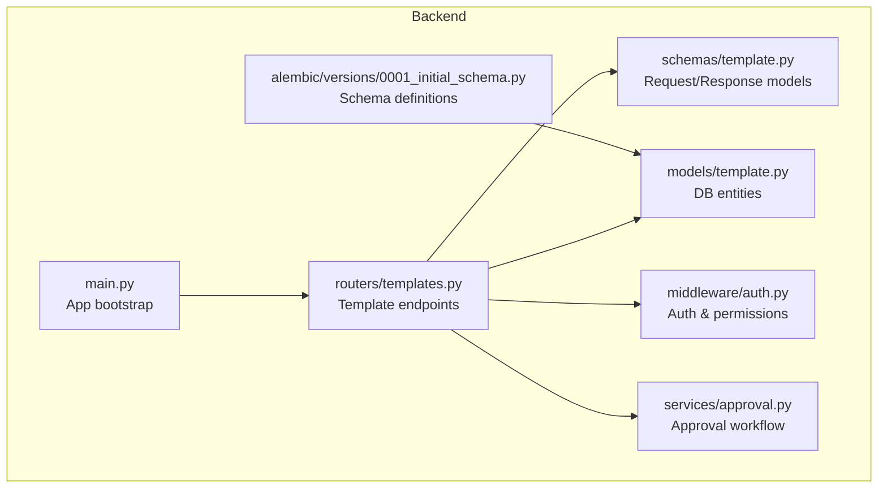
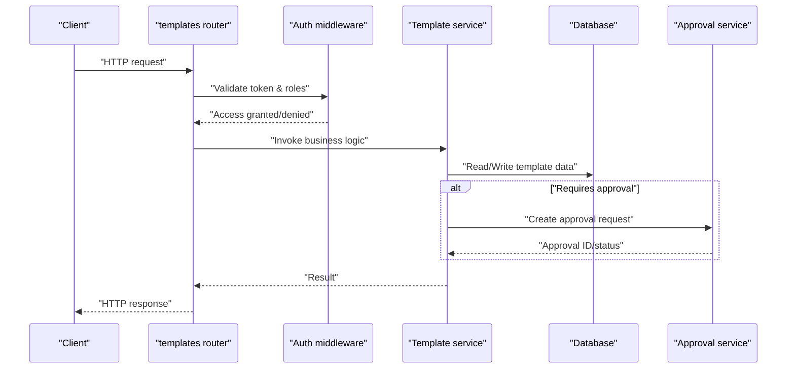
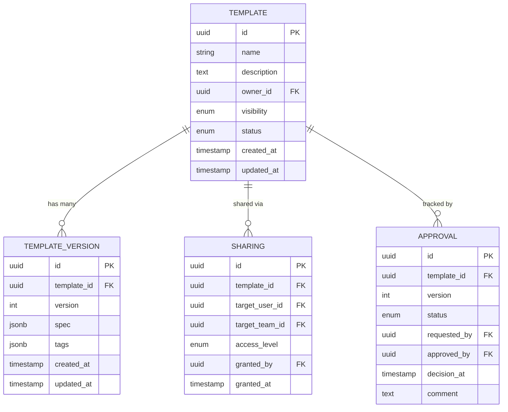
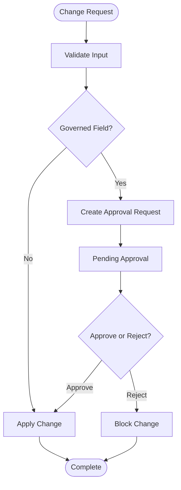
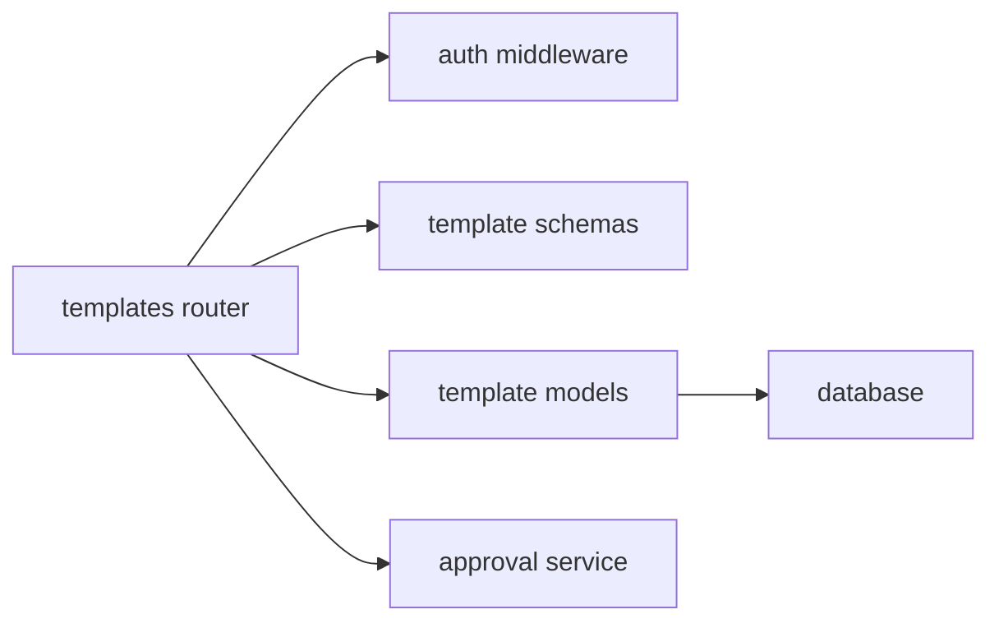

# Template Management API

<cite>
**Referenced Files in This Document**
- [backend/app/routers/templates.py](file://backend/app/routers/templates.py)
- [backend/app/schemas/template.py](file://backend/app/schemas/template.py)
- [backend/app/models/template.py](file://backend/app/models/template.py)
- [backend/app/services/approval.py](file://backend/app/services/approval.py)
- [backend/app/middleware/auth.py](file://backend/app/middleware/auth.py)
- [backend/app/main.py](file://backend/app/main.py)
- [backend/alembic/versions/0001_initial_schema.py](file://backend/alembic/versions/0001_initial_schema.py)
</cite>

## Table of Contents
1. [Introduction](#introduction)
2. [Project Structure](#project-structure)
3. [Core Components](#core-components)
4. [Architecture Overview](#architecture-overview)
5. [Detailed Component Analysis](#detailed-component-analysis)
6. [Dependency Analysis](#dependency-analysis)
7. [Performance Considerations](#performance-considerations)
8. [Troubleshooting Guide](#troubleshooting-guide)
9. [Conclusion](#conclusion)

## Introduction
This document provides detailed API documentation for the template management endpoints used to create, update, delete, and retrieve resource templates. It covers HTTP methods, URL patterns, request/response schemas, validation rules, versioning, sharing mechanisms, permissions, collaboration features, integration with the approval workflow system, and how templates relate to ECS instance provisioning.

## Project Structure
The template management functionality is implemented in the backend application:
- Routers define REST endpoints for templates.
- Schemas define request and response models with validation.
- Models represent database entities and relationships.
- Middleware enforces authentication and authorization.
- Approval service integrates with the approval workflow.
- Alembic migrations define the initial schema including template-related tables.

**Diagram sources**
- [backend/app/main.py](file://backend/app/main.py)
- [backend/app/routers/templates.py](file://backend/app/routers/templates.py)
- [backend/app/schemas/template.py](file://backend/app/schemas/template.py)
- [backend/app/models/template.py](file://backend/app/models/template.py)
- [backend/app/middleware/auth.py](file://backend/app/middleware/auth.py)
- [backend/app/services/approval.py](file://backend/app/services/approval.py)
- [backend/alembic/versions/0001_initial_schema.py](file://backend/alembic/versions/0001_initial_schema.py)

**Section sources**
- [backend/app/main.py](file://backend/app/main.py)
- [backend/app/routers/templates.py](file://backend/app/routers/templates.py)
- [backend/app/schemas/template.py](file://backend/app/schemas/template.py)
- [backend/app/models/template.py](file://backend/app/models/template.py)
- [backend/app/middleware/auth.py](file://backend/app/middleware/auth.py)
- [backend/app/services/approval.py](file://backend/app/services/approval.py)
- [backend/alembic/versions/0001_initial_schema.py](file://backend/alembic/versions/0001_initial_schema.py)

## Core Components
- Router layer exposes REST endpoints for template CRUD operations and related actions (versioning, sharing).
- Schema layer defines strict request/response structures and validation rules.
- Model layer maps to database tables and relationships.
- Auth middleware enforces user identity and role-based access control.
- Approval service integrates with the approval workflow for changes that require governance.

Key responsibilities:
- Templates router: handles all template-related HTTP endpoints.
- Template schemas: validate inputs and serialize outputs.
- Template model: represents template entities and versions.
- Auth middleware: protects endpoints and checks permissions.
- Approval service: triggers approvals for sensitive operations.

**Section sources**
- [backend/app/routers/templates.py](file://backend/app/routers/templates.py)
- [backend/app/schemas/template.py](file://backend/app/schemas/template.py)
- [backend/app/models/template.py](file://backend/app/models/template.py)
- [backend/app/middleware/auth.py](file://backend/app/middleware/auth.py)
- [backend/app/services/approval.py](file://backend/app/services/approval.py)

## Architecture Overview
The template management API follows a layered architecture:
- HTTP requests are routed to endpoint handlers.
- Handlers validate payloads using Pydantic schemas.
- Business logic interacts with the database via ORM models.
- Permission checks are enforced by auth middleware.
- Approval workflows are invoked when required.

**Diagram sources**
- [backend/app/routers/templates.py](file://backend/app/routers/templates.py)
- [backend/app/middleware/auth.py](file://backend/app/middleware/auth.py)
- [backend/app/services/approval.py](file://backend/app/services/approval.py)

## Detailed Component Analysis

### Endpoints Reference
Base path: /api/v1/templates

- Create Template
  - Method: POST
  - Path: /api/v1/templates
  - Description: Creates a new template version. Requires write permission. May trigger an approval workflow depending on policy.
  - Request body: See TemplateCreate schema.
  - Response: See TemplateVersionResponse schema.

- List Templates
  - Method: GET
  - Path: /api/v1/templates
  - Description: Lists templates with optional filters (e.g., owner, tags). Requires read permission.
  - Query parameters: page, page_size, owner_id, tag, status.
  - Response: Paginated list of TemplateSummaryResponse.

- Get Template Version
  - Method: GET
  - Path: /api/v1/templates/{template_id}/versions/{version}
  - Description: Retrieves a specific template version. Requires read permission.
  - Response: TemplateVersionResponse.

- Update Template Version
  - Method: PUT
  - Path: /api/v1/templates/{template_id}/versions/{version}
  - Description: Updates an existing template version. Requires write permission. May trigger approval if fields are governed.
  - Request body: See TemplateUpdate schema.
  - Response: TemplateVersionResponse.

- Delete Template Version
  - Method: DELETE
  - Path: /api/v1/templates/{template_id}/versions/{version}
  - Description: Deletes a specific template version. Requires admin or owner permission.
  - Response: 204 No Content.

- Share Template
  - Method: POST
  - Path: /api/v1/templates/{template_id}/share
  - Description: Shares a template with other users or teams. Requires share permission.
  - Request body: See ShareTemplateRequest schema.
  - Response: ShareResponse.

- Unshare Template
  - Method: DELETE
  - Path: /api/v1/templates/{template_id}/share/{user_or_team_id}
  - Description: Removes sharing for a specific user or team. Requires share permission.
  - Response: 204 No Content.

- Approve Template Change
  - Method: POST
  - Path: /api/v1/templates/{template_id}/approvals/{approval_id}
  - Description: Approves or rejects a pending template change. Requires approver role.
  - Request body: See ApprovalAction schema.
  - Response: ApprovalStatusResponse.

Notes:
- All endpoints require authentication via bearer token.
- Role-based access control applies: Owner, Editor, Viewer, Approver, Admin.
- Pagination uses standard query parameters; default page size may be enforced.

**Section sources**
- [backend/app/routers/templates.py](file://backend/app/routers/templates.py)
- [backend/app/middleware/auth.py](file://backend/app/middleware/auth.py)

### Request and Response Schemas
- TemplateCreate
  - Fields: name, description, spec, tags, owner_id, visibility.
  - Validation: name required and non-empty; spec must conform to template specification schema; tags limited to allowed set; visibility restricted to public/private/team.
  - Example path: [schemas/template.py](file://backend/app/schemas/template.py)

- TemplateUpdate
  - Fields: name, description, spec, tags, visibility.
  - Validation: partial updates allowed; governed fields may require approval.
  - Example path: [schemas/template.py](file://backend/app/schemas/template.py)

- TemplateVersionResponse
  - Fields: id, template_id, version, name, description, spec, tags, owner_id, visibility, created_at, updated_at, status.
  - Example path: [schemas/template.py](file://backend/app/schemas/template.py)

- TemplateSummaryResponse
  - Fields: id, template_id, latest_version, name, tags, visibility, owner_id, status.
  - Example path: [schemas/template.py](file://backend/app/schemas/template.py)

- ShareTemplateRequest
  - Fields: target_user_id or target_team_id, access_level (read/write).
  - Validation: exactly one of target_user_id or target_team_id must be provided; access_level must be valid.
  - Example path: [schemas/template.py](file://backend/app/schemas/template.py)

- ShareResponse
  - Fields: template_id, shared_with_type, shared_with_id, access_level, granted_by, granted_at.
  - Example path: [schemas/template.py](file://backend/app/schemas/template.py)

- ApprovalAction
  - Fields: action (approve/reject), comment.
  - Validation: action must be one of allowed values; comment optional but recommended.
  - Example path: [schemas/template.py](file://backend/app/schemas/template.py)

- ApprovalStatusResponse
  - Fields: approval_id, template_id, status, requested_by, approved_by, decision_at, comment.
  - Example path: [schemas/template.py](file://backend/app/schemas/template.py)

**Section sources**
- [backend/app/schemas/template.py](file://backend/app/schemas/template.py)

### Data Models and Relationships
- Template
  - Represents a logical template entity with metadata and ownership.
  - Attributes include id, name, description, owner_id, visibility, status.
- TemplateVersion
  - Immutable snapshot of a template’s spec at a point in time.
  - Attributes include id, template_id, version, spec, tags, created_at, updated_at.
- Sharing
  - Associates users or teams with templates and access levels.
  - Attributes include template_id, target_user_id, target_team_id, access_level, granted_by, granted_at.
- Approval
  - Tracks approval requests for template changes.
  - Attributes include id, template_id, version, status, requested_by, approved_by, decision_at, comment.

**Diagram sources**
- [backend/app/models/template.py](file://backend/app/models/template.py)
- [backend/alembic/versions/0001_initial_schema.py](file://backend/alembic/versions/0001_initial_schema.py)

**Section sources**
- [backend/app/models/template.py](file://backend/app/models/template.py)
- [backend/alembic/versions/0001_initial_schema.py](file://backend/alembic/versions/0001_initial_schema.py)

### Versioning Rules
- Each creation or update generates a new immutable version.
- Versions are sequential integers per template.
- Latest version can be referenced by special alias “latest”.
- Deletion affects only the specified version; other versions remain intact.
- Rollback is supported by creating a new version from a previous version.

Validation rules:
- Spec must pass schema validation before version creation.
- Name uniqueness constraints may apply per owner or globally depending on configuration.
- Tags must be within allowed sets and length limits.

**Section sources**
- [backend/app/schemas/template.py](file://backend/app/schemas/template.py)
- [backend/app/models/template.py](file://backend/app/models/template.py)

### Sharing and Collaboration
- Templates can be shared with individual users or teams.
- Access levels: read-only or read-write.
- Sharing requires explicit grant by owner or admin.
- Collaborators can propose changes; governed changes may require approval.
- Audit logs record sharing actions.

Permissions:
- Owner: full control over template and versions.
- Editor: can update versions and propose changes.
- Viewer: read-only access.
- Approver: can approve or reject changes.
- Admin: global management capabilities.

**Section sources**
- [backend/app/routers/templates.py](file://backend/app/routers/templates.py)
- [backend/app/middleware/auth.py](file://backend/app/middleware/auth.py)

### Approval Workflow Integration
- Certain operations (e.g., updating governed fields) automatically create approval requests.
- Approvers review and decide to approve or reject.
- Upon approval, the change is applied; upon rejection, the operation is reverted or blocked.
- Status transitions are tracked and exposed via API.

**Diagram sources**
- [backend/app/services/approval.py](file://backend/app/services/approval.py)
- [backend/app/routers/templates.py](file://backend/app/routers/templates.py)

**Section sources**
- [backend/app/services/approval.py](file://backend/app/services/approval.py)
- [backend/app/routers/templates.py](file://backend/app/routers/templates.py)

### Relationship to ECS Instance Provisioning
- Templates encapsulate reusable specifications for ECS instances (e.g., compute, storage, networking).
- Provisioning workflows consume template versions to instantiate resources consistently.
- Changes to templates propagate to future provisioning requests; existing instances are unaffected unless explicitly re-provisioned.
- Approval ensures compliance and risk mitigation before applying template changes to production provisioning.

Integration points:
- Provisioning services reference template IDs and versions.
- Template status influences availability for provisioning.
- Audit trails link provisioning events to template versions.

**Section sources**
- [backend/app/models/template.py](file://backend/app/models/template.py)
- [backend/app/services/approval.py](file://backend/app/services/approval.py)

## Dependency Analysis
The template management module depends on:
- Authentication middleware for access control.
- Database models for persistence.
- Approval service for governance.
- Schemas for validation and serialization.

**Diagram sources**
- [backend/app/routers/templates.py](file://backend/app/routers/templates.py)
- [backend/app/middleware/auth.py](file://backend/app/middleware/auth.py)
- [backend/app/schemas/template.py](file://backend/app/schemas/template.py)
- [backend/app/models/template.py](file://backend/app/models/template.py)
- [backend/app/services/approval.py](file://backend/app/services/approval.py)

**Section sources**
- [backend/app/routers/templates.py](file://backend/app/routers/templates.py)
- [backend/app/middleware/auth.py](file://backend/app/middleware/auth.py)
- [backend/app/schemas/template.py](file://backend/app/schemas/template.py)
- [backend/app/models/template.py](file://backend/app/models/template.py)
- [backend/app/services/approval.py](file://backend/app/services/approval.py)

## Performance Considerations
- Use pagination for listing templates to reduce payload sizes.
- Cache frequently accessed template versions where appropriate.
- Avoid unnecessary joins; fetch only required fields.
- Index common query columns (owner_id, tags, visibility).
- Batch approval notifications to minimize overhead.

[No sources needed since this section provides general guidance]

## Troubleshooting Guide
Common issues and resolutions:
- Authentication failures: ensure bearer token is present and valid; verify user roles.
- Permission denied: confirm user has required role (Owner/Editor/Admin/Approver).
- Validation errors: check request body against schema requirements; ensure spec conforms to template specification.
- Approval pending: review approval status and take action via approval endpoints.
- Version conflicts: use latest version alias or specify exact version to avoid ambiguity.

Error responses:
- 400 Bad Request: validation failure.
- 401 Unauthorized: missing or invalid token.
- 403 Forbidden: insufficient permissions.
- 404 Not Found: template or version not found.
- 409 Conflict: duplicate or conflicting state.
- 500 Internal Server Error: unexpected server error.

**Section sources**
- [backend/app/middleware/auth.py](file://backend/app/middleware/auth.py)
- [backend/app/schemas/template.py](file://backend/app/schemas/template.py)
- [backend/app/routers/templates.py](file://backend/app/routers/templates.py)

## Conclusion
The template management API provides robust capabilities for managing reusable ECS provisioning templates with versioning, sharing, and approval workflows. By enforcing strict validation, role-based access control, and auditability, it ensures consistent and compliant resource provisioning across environments.

[No sources needed since this section summarizes without analyzing specific files]