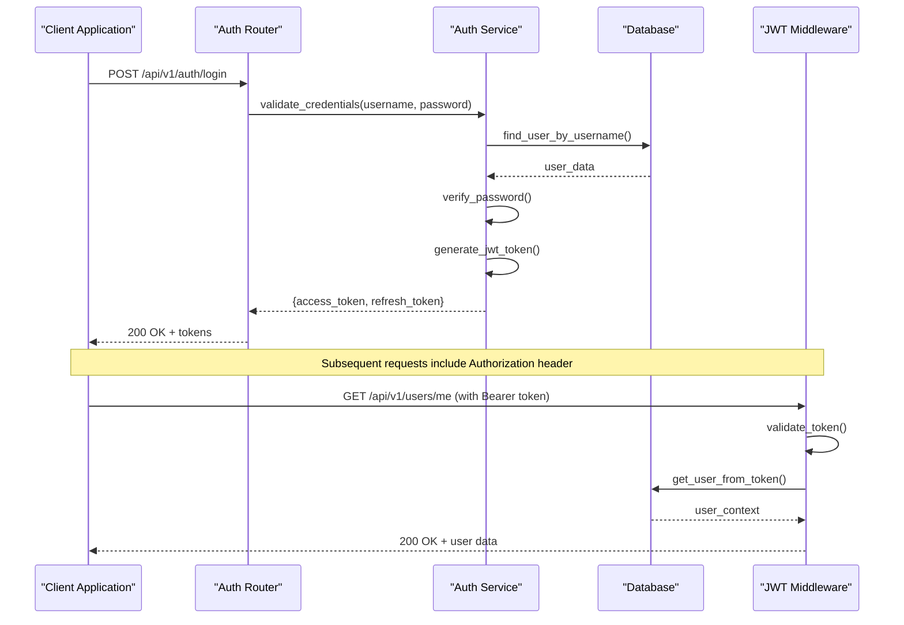
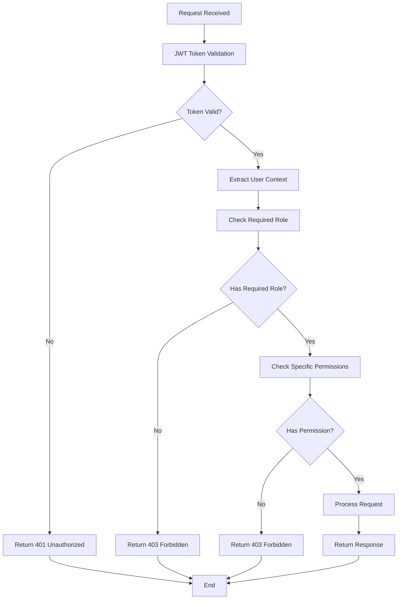

# User Management API

<cite>
**Referenced Files in This Document**
- [users.py](file://backend/app/routers/users.py)
- [auth.py](file://backend/app/routers/auth.py)
- [auth.py](file://backend/app/middleware/auth.py)
- [user.py](file://backend/app/schemas/user.py)
- [user.py](file://backend/app/models/user.py)
- [main.py](file://backend/app/main.py)
</cite>

## Table of Contents
1. [Introduction](#introduction)
2. [Authentication Overview](#authentication-overview)
3. [User Registration](#user-registration)
4. [User Authentication](#user-authentication)
5. [User Profile Management](#user-profile-management)
6. [Administrative User Operations](#administrative-user-operations)
7. [Role-Based Access Control](#role-based-access-control)
8. [Error Handling](#error-handling)
9. [Security Considerations](#security-considerations)
10. [API Reference](#api-reference)

## Introduction

The User Management API provides comprehensive functionality for managing user accounts, authentication, and authorization within the ECS Request System. The API follows RESTful principles and implements JWT-based authentication with role-based access control to ensure secure user operations.

The system supports three primary user roles:
- **Regular Users**: Can manage their own profiles and submit resource requests
- **Administrators**: Can manage all users and system settings
- **System**: Internal service account with elevated privileges

## Authentication Overview

The API uses JWT (JSON Web Token) authentication middleware to protect endpoints. All protected routes require a valid Bearer token in the Authorization header.

### Authentication Flow



**Diagram sources**
- [auth.py](file://backend/app/routers/auth.py)
- [auth.py](file://backend/app/middleware/auth.py)

### Authentication Requirements

All protected endpoints require:
- **Header**: `Authorization: Bearer <jwt_token>`
- **Token Format**: JSON Web Token with expiration
- **Refresh Tokens**: Separate long-lived tokens for session renewal

**Section sources**
- [auth.py](file://backend/app/middleware/auth.py)
- [auth.py](file://backend/app/routers/auth.py)

## User Registration

### Endpoint: Register New User

**HTTP Method**: `POST`
**URL Pattern**: `/api/v1/auth/register`
**Authentication Required**: No
**Content-Type**: `application/json`

#### Request Schema

| Field | Type | Required | Description | Validation Rules |
|-------|------|----------|-------------|------------------|
| username | string | Yes | Unique username | 3-50 characters, alphanumeric and underscores |
| email | string | Yes | Valid email address | Must be unique, valid email format |
| password | string | Yes | User password | Minimum 8 characters, must contain uppercase, lowercase, number, and special character |
| first_name | string | Optional | User's first name | Max 100 characters |
| last_name | string | Optional | User's last name | Max 100 characters |
| phone_number | string | Optional | Contact phone number | E.164 format |

#### Response Schemas

**Success Response (201 Created)**
```json
{
  "id": "uuid-string",
  "username": "string",
  "email": "string", 
  "first_name": "string",
  "last_name": "string",
  "phone_number": "string",
  "is_active": true,
  "created_at": "ISO 8601 timestamp",
  "message": "User registered successfully"
}
```

**Error Responses**
- `400 Bad Request`: Invalid input data
- `409 Conflict`: Username or email already exists
- `422 Unprocessable Entity`: Validation errors

#### Example Request
```http
POST /api/v1/auth/register HTTP/1.1
Host: api.example.com
Content-Type: application/json

{
  "username": "john_doe",
  "email": "john@example.com",
  "password": "SecurePass123!",
  "first_name": "John",
  "last_name": "Doe"
}
```

**Section sources**
- [auth.py](file://backend/app/routers/auth.py)
- [user.py](file://backend/app/schemas/user.py)

## User Authentication

### Endpoint: Login

**HTTP Method**: `POST`
**URL Pattern**: `/api/v1/auth/login`
**Authentication Required**: No
**Content-Type**: `application/json`

#### Request Schema

| Field | Type | Required | Description |
|-------|------|----------|-------------|
| username | string | Yes | User's username or email |
| password | string | Yes | User's password |

#### Response Schemas

**Success Response (200 OK)**
```json
{
  "access_token": "eyJhbGciOiJIUzI1NiIsInR5cCI6IkpXVCJ9...",
  "refresh_token": "dGhpcyBpcyBhIHJlZnJlc2ggdG9rZW4...",
  "token_type": "bearer",
  "expires_in": 3600,
  "user": {
    "id": "uuid-string",
    "username": "john_doe",
    "email": "john@example.com",
    "role": "user",
    "permissions": ["read_profile", "update_profile"]
  }
}
```

**Error Responses**
- `401 Unauthorized`: Invalid credentials
- `400 Bad Request`: Missing required fields
- `403 Forbidden`: Account is disabled

#### Example Request
```http
POST /api/v1/auth/login HTTP/1.1
Host: api.example.com
Content-Type: application/json

{
  "username": "john_doe",
  "password": "SecurePass123!"
}
```

### Endpoint: Refresh Token

**HTTP Method**: `POST`
**URL Pattern**: `/api/v1/auth/refresh`
**Authentication Required**: No
**Content-Type**: `application/json`

#### Request Schema

| Field | Type | Required | Description |
|-------|------|----------|-------------|
| refresh_token | string | Yes | Valid refresh token |

#### Response Schemas

**Success Response (200 OK)**
```json
{
  "access_token": "new_access_token...",
  "token_type": "bearer",
  "expires_in": 3600
}
```

**Error Responses**
- `401 Unauthorized`: Invalid or expired refresh token
- `400 Bad Request`: Missing refresh token

### Endpoint: Logout

**HTTP Method**: `POST`
**URL Pattern**: `/api/v1/auth/logout`
**Authentication Required**: Yes
**Content-Type**: `application/json`

#### Request Headers
- `Authorization: Bearer <access_token>`

#### Response Schemas

**Success Response (200 OK)**
```json
{
  "message": "Successfully logged out"
}
```

**Section sources**
- [auth.py](file://backend/app/routers/auth.py)

## User Profile Management

### Endpoint: Get Current User Profile

**HTTP Method**: `GET`
**URL Pattern**: `/api/v1/users/me`
**Authentication Required**: Yes
**Roles**: All authenticated users

#### Request Headers
- `Authorization: Bearer <access_token>`

#### Response Schemas

**Success Response (200 OK)**
```json
{
  "id": "uuid-string",
  "username": "john_doe",
  "email": "john@example.com",
  "first_name": "John",
  "last_name": "Doe",
  "phone_number": "+1234567890",
  "role": "user",
  "is_active": true,
  "created_at": "2024-01-01T00:00:00Z",
  "updated_at": "2024-01-01T00:00:00Z",
  "last_login": "2024-01-01T00:00:00Z"
}
```

### Endpoint: Update User Profile

**HTTP Method**: `PUT`
**URL Pattern**: `/api/v1/users/me`
**Authentication Required**: Yes
**Roles**: Owner only

#### Request Headers
- `Authorization: Bearer <access_token>`

#### Request Schema

| Field | Type | Required | Description |
|-------|------|----------|-------------|
| first_name | string | Optional | Updated first name |
| last_name | string | Optional | Updated last name |
| phone_number | string | Optional | Updated phone number |
| email | string | Optional | Updated email (requires verification) |

#### Response Schemas

**Success Response (200 OK)**
```json
{
  "id": "uuid-string",
  "username": "john_doe",
  "email": "john@example.com",
  "first_name": "John",
  "last_name": "Updated Name",
  "phone_number": "+1234567890",
  "role": "user",
  "is_active": true,
  "updated_at": "2024-01-01T00:00:00Z"
}
```

### Endpoint: Change Password

**HTTP Method**: `PUT`
**URL Pattern**: `/api/v1/users/me/password`
**Authentication Required**: Yes
**Roles**: Owner only

#### Request Headers
- `Authorization: Bearer <access_token>`

#### Request Schema

| Field | Type | Required | Description | Validation Rules |
|-------|------|----------|-------------|------------------|
| current_password | string | Yes | Current password | Must match current password |
| new_password | string | Yes | New password | Min 8 chars, complexity requirements |
| confirm_password | string | Yes | Password confirmation | Must match new_password |

#### Response Schemas

**Success Response (200 OK)**
```json
{
  "message": "Password updated successfully"
}
```

**Error Responses**
- `400 Bad Request`: Invalid password format
- `401 Unauthorized`: Incorrect current password
- `422 Unprocessable Entity`: Passwords don't match

**Section sources**
- [users.py](file://backend/app/routers/users.py)
- [user.py](file://backend/app/schemas/user.py)

## Administrative User Operations

### Endpoint: Get All Users

**HTTP Method**: `GET`
**URL Pattern**: `/api/v1/users`
**Authentication Required**: Yes
**Roles**: Administrator only

#### Request Headers
- `Authorization: Bearer <admin_access_token>`

#### Query Parameters

| Parameter | Type | Required | Description | Default |
|-----------|------|----------|-------------|---------|
| page | integer | No | Page number | 1 |
| limit | integer | No | Items per page | 20 |
| search | string | No | Search by username or email | - |
| role | string | No | Filter by role | - |
| is_active | boolean | No | Filter by active status | - |

#### Response Schemas

**Success Response (200 OK)**
```json
{
  "users": [
    {
      "id": "uuid-string",
      "username": "john_doe",
      "email": "john@example.com",
      "role": "user",
      "is_active": true,
      "created_at": "2024-01-01T00:00:00Z",
      "last_login": "2024-01-01T00:00:00Z"
    }
  ],
  "total": 100,
  "page": 1,
  "limit": 20,
  "pages": 5
}
```

### Endpoint: Get User by ID

**HTTP Method**: `GET`
**URL Pattern**: `/api/v1/users/{user_id}`
**Authentication Required**: Yes
**Roles**: Administrator only

#### Path Parameters

| Parameter | Type | Required | Description |
|-----------|------|----------|-------------|
| user_id | string | Yes | UUID of the user |

#### Response Schemas

**Success Response (200 OK)**
```json
{
  "id": "uuid-string",
  "username": "john_doe",
  "email": "john@example.com",
  "first_name": "John",
  "last_name": "Doe",
  "phone_number": "+1234567890",
  "role": "user",
  "is_active": true,
  "created_at": "2024-01-01T00:00:00Z",
  "updated_at": "2024-01-01T00:00:00Z",
  "last_login": "2024-01-01T00:00:00Z"
}
```

### Endpoint: Create User (Admin)

**HTTP Method**: `POST`
**URL Pattern**: `/api/v1/users`
**Authentication Required**: Yes
**Roles**: Administrator only

#### Request Headers
- `Authorization: Bearer <admin_access_token>`

#### Request Schema

| Field | Type | Required | Description | Validation Rules |
|-------|------|----------|-------------|------------------|
| username | string | Yes | Unique username | 3-50 characters |
| email | string | Yes | Valid email | Must be unique |
| password | string | Yes | Initial password | Complexity requirements |
| role | string | Optional | User role | user, admin |
| is_active | boolean | Optional | Account status | true/false |
| first_name | string | Optional | First name | Max 100 chars |
| last_name | string | Optional | Last name | Max 100 chars |

#### Response Schemas

**Success Response (201 Created)**
```json
{
  "id": "uuid-string",
  "username": "john_doe",
  "email": "john@example.com",
  "role": "user",
  "is_active": true,
  "created_at": "2024-01-01T00:00:00Z",
  "message": "User created successfully"
}
```

### Endpoint: Update User (Admin)

**HTTP Method**: `PUT`
**URL Pattern**: `/api/v1/users/{user_id}`
**Authentication Required**: Yes
**Roles**: Administrator only

#### Path Parameters

| Parameter | Type | Required | Description |
|-----------|------|----------|-------------|
| user_id | string | Yes | UUID of the user |

#### Request Schema

| Field | Type | Required | Description |
|-------|------|----------|-------------|
| username | string | Optional | Updated username |
| email | string | Optional | Updated email |
| role | string | Optional | Updated role |
| is_active | boolean | Optional | Updated status |
| first_name | string | Optional | Updated first name |
| last_name | string | Optional | Updated last name |

#### Response Schemas

**Success Response (200 OK)**
```json
{
  "id": "uuid-string",
  "username": "john_doe",
  "email": "john@example.com",
  "role": "admin",
  "is_active": true,
  "updated_at": "2024-01-01T00:00:00Z"
}
```

### Endpoint: Delete User (Admin)

**HTTP Method**: `DELETE`
**URL Pattern**: `/api/v1/users/{user_id}`
**Authentication Required**: Yes
**Roles**: Administrator only

#### Path Parameters

| Parameter | Type | Required | Description |
|-----------|------|----------|-------------|
| user_id | string | Yes | UUID of the user |

#### Response Schemas

**Success Response (200 OK)**
```json
{
  "message": "User deleted successfully"
}
```

**Error Responses**
- `404 Not Found`: User not found
- `403 Forbidden`: Cannot delete own account

### Endpoint: Reset User Password (Admin)

**HTTP Method**: `PUT`
**URL Pattern**: `/api/v1/users/{user_id}/password`
**Authentication Required**: Yes
**Roles**: Administrator only

#### Path Parameters

| Parameter | Type | Required | Description |
|-----------|------|----------|-------------|
| user_id | string | Yes | UUID of the user |

#### Request Schema

| Field | Type | Required | Description | Validation Rules |
|-------|------|----------|-------------|------------------|
| new_password | string | Yes | New password | Complexity requirements |

#### Response Schemas

**Success Response (200 OK)**
```json
{
  "message": "Password reset successfully"
}
```

**Section sources**
- [users.py](file://backend/app/routers/users.py)

## Role-Based Access Control

The system implements granular permission-based access control using JWT claims and middleware validation.

### User Roles and Permissions

| Role | Description | Permissions |
|------|-------------|-------------|
| **user** | Regular user | read_profile, update_profile, submit_requests |
| **admin** | System administrator | all_user_permissions, manage_users, system_settings |
| **super_admin** | Super administrator | all_admin_permissions, user_management, system_configuration |

### Permission Validation Flow



**Diagram sources**
- [auth.py](file://backend/app/middleware/auth.py)

### Role Decorators and Middleware

The system uses decorators and middleware to enforce role-based access:

- `@require_role("admin")`: Requires admin role
- `@require_permission("manage_users")`: Requires specific permission
- `@current_user`: Injects current user context into request handlers

**Section sources**
- [auth.py](file://backend/app/middleware/auth.py)
- [user.py](file://backend/app/models/user.py)

## Error Handling

The API implements consistent error handling across all endpoints with standardized response formats.

### Standard Error Response Format

```json
{
  "error": {
    "code": "ERROR_CODE",
    "message": "Human-readable error message",
    "details": {},
    "timestamp": "2024-01-01T00:00:00Z"
  }
}
```

### Common Error Codes

| Code | HTTP Status | Description |
|------|-------------|-------------|
| AUTH_001 | 401 | Authentication failed |
| AUTH_002 | 401 | Token expired |
| AUTH_003 | 401 | Invalid token format |
| AUTH_004 | 403 | Insufficient permissions |
| USER_001 | 400 | Invalid user data |
| USER_002 | 409 | User already exists |
| USER_003 | 404 | User not found |
| USER_004 | 422 | Validation error |
| SYS_001 | 500 | Internal server error |

### Input Validation Errors

Validation errors return detailed field-level information:

```json
{
  "error": {
    "code": "USER_004",
    "message": "Validation failed",
    "details": {
      "fields": {
        "password": ["Must be at least 8 characters"],
        "email": ["Invalid email format"]
      }
    },
    "timestamp": "2024-01-01T00:00:00Z"
  }
}
```

**Section sources**
- [auth.py](file://backend/app/routers/auth.py)
- [users.py](file://backend/app/routers/users.py)

## Security Considerations

### Password Security
- Passwords are hashed using bcrypt with salt rounds
- Password complexity requirements enforced
- Password history prevents reuse of recent passwords
- Secure password reset flow with time-limited tokens

### Token Security
- JWT tokens use strong signing algorithms (HS256/RS256)
- Short-lived access tokens (15 minutes default)
- Long-lived refresh tokens with rotation
- Token blacklisting for logout functionality

### Data Protection
- Sensitive fields excluded from responses
- Audit logging for all user modifications
- Rate limiting on authentication endpoints
- SQL injection prevention through ORM usage

### Input Validation
- Comprehensive input sanitization
- Type validation and constraint checking
- XSS protection headers
- Content-Type validation

**Section sources**
- [auth.py](file://backend/app/middleware/auth.py)
- [user.py](file://backend/app/schemas/user.py)

## API Reference

### Base URL
```
https://api.example.com/api/v1
```

### Authentication Endpoints

| Method | Endpoint | Description | Auth Required |
|--------|----------|-------------|---------------|
| POST | `/auth/register` | Register new user | No |
| POST | `/auth/login` | User login | No |
| POST | `/auth/refresh` | Refresh access token | No |
| POST | `/auth/logout` | User logout | Yes |

### User Management Endpoints

| Method | Endpoint | Description | Auth Required | Roles |
|--------|----------|-------------|---------------|-------|
| GET | `/users/me` | Get current user profile | Yes | All |
| PUT | `/users/me` | Update current user profile | Yes | Owner |
| PUT | `/users/me/password` | Change password | Yes | Owner |
| GET | `/users` | List all users | Yes | Admin |
| GET | `/users/{user_id}` | Get user by ID | Yes | Admin |
| POST | `/users` | Create new user | Yes | Admin |
| PUT | `/users/{user_id}` | Update user | Yes | Admin |
| DELETE | `/users/{user_id}` | Delete user | Yes | Admin |
| PUT | `/users/{user_id}/password` | Reset user password | Yes | Admin |

### Response Headers

All responses include:
- `Content-Type: application/json`
- `X-Request-ID: unique-request-id`
- `X-RateLimit-Remaining: remaining-requests`

### Rate Limiting

| Endpoint | Limit | Window |
|----------|-------|--------|
| `/auth/login` | 5 attempts | 15 minutes |
| `/auth/register` | 3 attempts | 1 hour |
| `/auth/refresh` | 10 attempts | 1 minute |
| Other endpoints | 100 requests | 1 minute |

**Section sources**
- [users.py](file://backend/app/routers/users.py)
- [auth.py](file://backend/app/routers/auth.py)

## Conclusion

The User Management API provides a comprehensive, secure, and well-documented interface for managing user accounts within the ECS Request System. The implementation follows industry best practices for authentication, authorization, and security while maintaining clean separation of concerns and extensible architecture.

Key strengths include:
- Robust JWT-based authentication with refresh token support
- Granular role-based access control
- Comprehensive input validation and error handling
- Security-focused design with proper password hashing and token management
- Consistent API patterns and response formats

The API is designed to scale effectively and maintain backward compatibility while supporting future enhancements to user management capabilities.