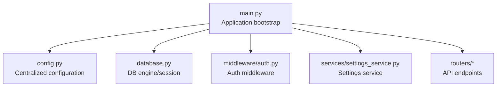
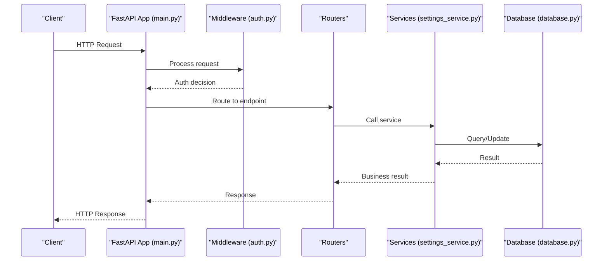
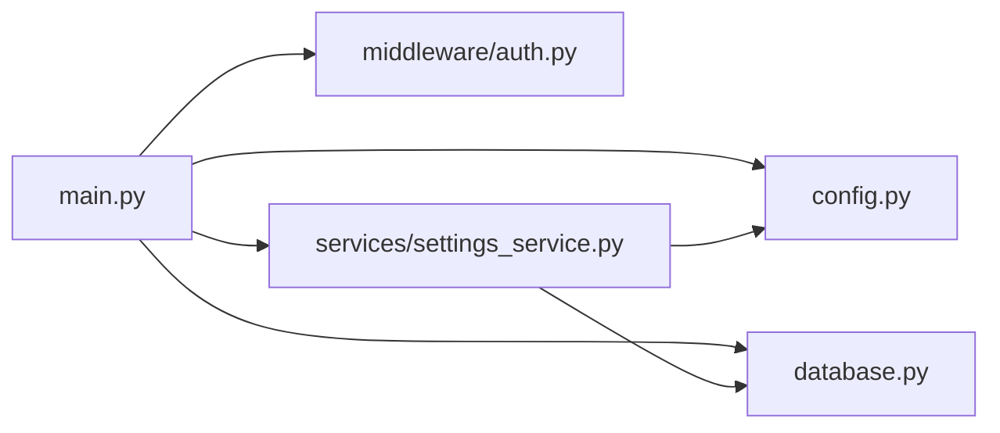

# Application Initialization & Configuration

<cite>
**Referenced Files in This Document**
- [main.py](file://backend/app/main.py)
- [config.py](file://backend/app/config.py)
- [database.py](file://backend/app/database.py)
- [auth.py](file://backend/app/middleware/auth.py)
- [settings_service.py](file://backend/app/services/settings_service.py)
</cite>

## Table of Contents
1. [Introduction](#introduction)
2. [Project Structure](#project-structure)
3. [Core Components](#core-components)
4. [Architecture Overview](#architecture-overview)
5. [Detailed Component Analysis](#detailed-component-analysis)
6. [Dependency Analysis](#dependency-analysis)
7. [Performance Considerations](#performance-considerations)
8. [Troubleshooting Guide](#troubleshooting-guide)
9. [Conclusion](#conclusion)
10. [Appendices](#appendices)

## Introduction
This document explains how the FastAPI application initializes and manages configuration. It focuses on:
- Application startup in main.py, including middleware registration, CORS configuration, exception handlers, and API versioning setup
- Centralized configuration management in config.py covering environment variables, database connection parameters, cloud service credentials, and security settings
- Dependency injection patterns, lifespan events, and graceful shutdown procedures
- Practical examples for adding new middleware, configuring third-party services, and managing environment-specific settings

The goal is to provide a clear, code-grounded guide that helps developers extend and maintain the application’s initialization and configuration reliably.

## Project Structure
At a high level, the backend application is organized under backend/app with modular components:
- Application entrypoint and startup orchestration live in main.py
- Centralized configuration lives in config.py
- Database connectivity and session management are defined in database.py
- Middleware (e.g., authentication) is implemented in middleware/auth.py
- Service modules (e.g., settings_service.py) encapsulate business logic and external integrations

[No sources needed since this diagram shows conceptual structure]

## Core Components
- Application entrypoint (main.py): Creates the FastAPI app, registers middleware, sets up CORS, mounts routers, configures exception handlers, and defines lifespan events for startup/shutdown.
- Configuration (config.py): Loads environment variables into typed settings, exposes database connection parameters, cloud credentials, and security options.
- Database (database.py): Provides SQLAlchemy engine and session factory used by dependency injection.
- Middleware (middleware/auth.py): Implements request/response processing such as authentication checks.
- Settings service (services/settings_service.py): Encapsulates settings-related operations and may interact with persistent storage or external services.

**Section sources**
- [main.py](file://backend/app/main.py)
- [config.py](file://backend/app/config.py)
- [database.py](file://backend/app/database.py)
- [auth.py](file://backend/app/middleware/auth.py)
- [settings_service.py](file://backend/app/services/settings_service.py)

## Architecture Overview
The application follows a layered architecture:
- Entry point orchestrates lifecycle and wiring
- Configuration is centralized and consumed across layers
- Middleware intercepts requests before routing
- Routers expose API endpoints
- Services implement business logic and integrate with external systems
- Database layer provides data access via SQLAlchemy

**Diagram sources**
- [main.py](file://backend/app/main.py)
- [auth.py](file://backend/app/middleware/auth.py)
- [settings_service.py](file://backend/app/services/settings_service.py)
- [database.py](file://backend/app/database.py)

## Detailed Component Analysis

### Application Bootstrap and Startup (main.py)
Responsibilities:
- Create the FastAPI application instance
- Register global middleware (e.g., authentication)
- Configure CORS policies
- Mount API routers and set up versioning
- Register exception handlers for consistent error responses
- Define lifespan events for startup and shutdown tasks

Key behaviors:
- Middleware registration order matters; place auth middleware after logging/tracing if present
- CORS should allow only trusted origins and methods
- Exception handlers should normalize errors and include correlation IDs when available
- Versioning can be achieved via URL prefixing or router tags depending on strategy

Practical example: Adding new middleware
- Implement a new middleware class/function in the middleware directory
- Register it in the application bootstrap before routers
- Ensure it handles exceptions and preserves response headers

Practical example: Configuring third-party services
- Initialize clients during startup using values from config.py
- Store references in app state or dependency providers
- Close connections during shutdown

**Section sources**
- [main.py](file://backend/app/main.py)

### Centralized Configuration (config.py)
Responsibilities:
- Load and validate environment variables
- Provide typed settings for database, cloud services, and security
- Expose constants for defaults and validation rules

Key areas:
- Environment variable handling: required vs optional fields, type coercion, validation
- Database connection parameters: host, port, user, password, database name, pool size, SSL flags
- Cloud service credentials: access keys, regions, endpoints, timeouts
- Security settings: token lifetimes, allowed origins, encryption algorithms

Practical example: Managing environment-specific settings
- Use different .env files per environment and load them at runtime
- Validate critical settings at startup and fail fast if missing
- Provide safe defaults for non-critical settings

**Section sources**
- [config.py](file://backend/app/config.py)

### Database Layer (database.py)
Responsibilities:
- Create SQLAlchemy engine based on configuration
- Provide session factory for dependency injection
- Manage connection pooling and lifecycle

Key behaviors:
- Engine creation uses configuration values from config.py
- Session factory ensures thread-safe sessions scoped to requests
- Graceful shutdown closes engines and sessions

Practical example: Using dependency injection
- Inject sessions into routers and services via FastAPI’s Depends
- Avoid global mutable state; prefer function-scoped dependencies

**Section sources**
- [database.py](file://backend/app/database.py)

### Authentication Middleware (middleware/auth.py)
Responsibilities:
- Intercept requests to enforce authentication and authorization
- Parse tokens or cookies and attach user context to the request
- Return standardized unauthorized responses when needed

Key behaviors:
- Short-circuit unauthenticated requests early
- Preserve request metadata for audit logs
- Integrate with settings for token validation rules

Practical example: Adding custom claims
- Extend token parsing to include roles or permissions
- Propagate claims through request state or dependency injection

**Section sources**
- [auth.py](file://backend/app/middleware/auth.py)

### Settings Service (services/settings_service.py)
Responsibilities:
- Encapsulate settings-related business logic
- Interact with persistent storage or external services to manage runtime settings
- Provide APIs for reading/writing settings safely

Key behaviors:
- Cache frequently accessed settings to reduce I/O
- Validate inputs and outputs
- Handle conflicts and concurrency safely

Practical example: Integrating with external configuration store
- Fetch settings from a remote store at startup
- Refresh settings periodically or on-demand

**Section sources**
- [settings_service.py](file://backend/app/services/settings_service.py)

### Dependency Injection Patterns
Patterns used:
- Function-based dependencies for database sessions
- Class-based dependencies for services requiring multiple collaborators
- App-level state for shared resources initialized at startup

Best practices:
- Keep dependencies pure and testable
- Use Depends() consistently across routers and services
- Avoid global singletons except for immutable configuration

**Section sources**
- [main.py](file://backend/app/main.py)
- [database.py](file://backend/app/database.py)
- [settings_service.py](file://backend/app/services/settings_service.py)

### Lifespan Events and Graceful Shutdown
Startup:
- Initialize external clients (e.g., cloud SDKs)
- Warm caches or perform migrations if necessary
- Validate configuration and log readiness

Shutdown:
- Close database connections and engines
- Flush pending writes and release locks
- Stop background tasks gracefully

Practical example: Background tasks
- Start periodic jobs during startup
- Cancel jobs during shutdown and await completion

**Section sources**
- [main.py](file://backend/app/main.py)

## Dependency Analysis
High-level relationships:
- main.py depends on config.py for settings
- main.py registers middleware from middleware/auth.py
- main.py mounts routers that use services and database dependencies
- services/settings_service.py may depend on database.py and config.py

**Diagram sources**
- [main.py](file://backend/app/main.py)
- [config.py](file://backend/app/config.py)
- [database.py](file://backend/app/database.py)
- [auth.py](file://backend/app/middleware/auth.py)
- [settings_service.py](file://backend/app/services/settings_service.py)

**Section sources**
- [main.py](file://backend/app/main.py)
- [config.py](file://backend/app/config.py)
- [database.py](file://backend/app/database.py)
- [auth.py](file://backend/app/middleware/auth.py)
- [settings_service.py](file://backend/app/services/settings_service.py)

## Performance Considerations
- Connection pooling: Tune pool size and max overflow based on workload
- Middleware overhead: Keep middleware lightweight; defer heavy work to background tasks
- Caching: Cache expensive reads in settings_service.py where appropriate
- CORS: Restrict origins and methods to minimize unnecessary preflight requests
- Startup time: Defer non-critical initialization to lazy loading or background tasks

[No sources needed since this section provides general guidance]

## Troubleshooting Guide
Common issues and resolutions:
- Missing environment variables: Validate required settings at startup and surface clear errors
- Database connection failures: Check credentials, network reachability, and pool limits
- CORS errors: Verify allowed origins, methods, and headers match client requests
- Authentication failures: Inspect token format, expiration, and signing algorithm
- Graceful shutdown hangs: Ensure all background tasks are cancellable and awaited

Operational tips:
- Log startup and shutdown phases with timestamps
- Include correlation IDs in requests for tracing
- Add healthcheck endpoints to verify readiness and liveness

**Section sources**
- [main.py](file://backend/app/main.py)
- [config.py](file://backend/app/config.py)
- [database.py](file://backend/app/database.py)
- [auth.py](file://backend/app/middleware/auth.py)
- [settings_service.py](file://backend/app/services/settings_service.py)

## Conclusion
The application’s initialization and configuration are designed for clarity, extensibility, and reliability. By centralizing configuration, leveraging dependency injection, and defining explicit lifespan events, the system remains maintainable and robust across environments. Following the practical examples provided will help you add middleware, integrate third-party services, and manage environment-specific settings effectively.

[No sources needed since this section summarizes without analyzing specific files]

## Appendices

### Practical Examples

#### Adding New Middleware
- Create a new middleware module under middleware/
- Register it in the application bootstrap before routers
- Ensure it returns proper responses and preserves headers

**Section sources**
- [main.py](file://backend/app/main.py)
- [auth.py](file://backend/app/middleware/auth.py)

#### Configuring Third-Party Services
- Initialize clients during startup using values from config.py
- Store references in app state or dependency providers
- Close connections during shutdown

**Section sources**
- [main.py](file://backend/app/main.py)
- [config.py](file://backend/app/config.py)

#### Managing Environment-Specific Settings
- Use separate .env files per environment
- Validate required settings at startup
- Provide safe defaults for non-critical settings

**Section sources**
- [config.py](file://backend/app/config.py)