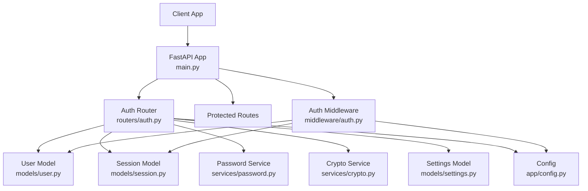
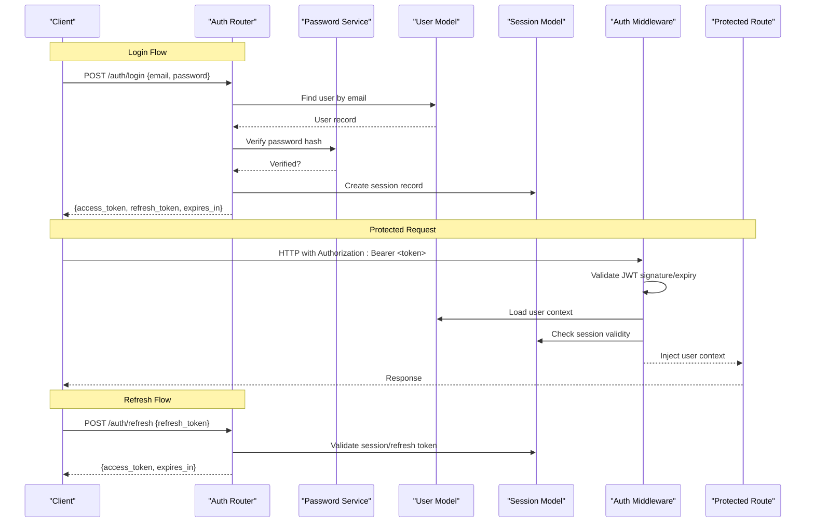
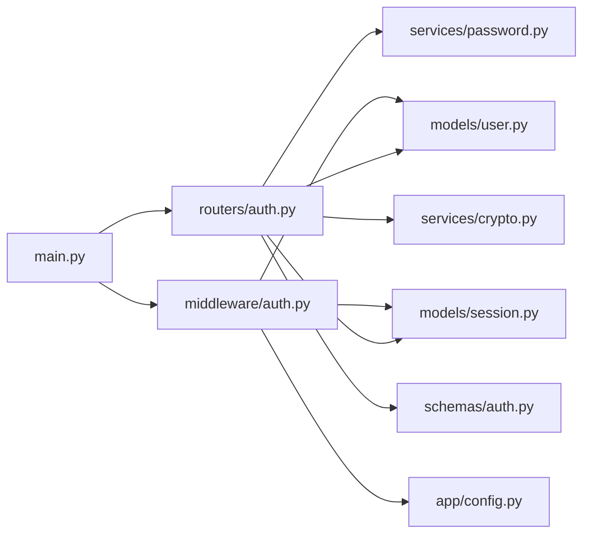

# Authentication & Authorization System

<cite>
**Referenced Files in This Document**
- [main.py](file://backend/app/main.py)
- [auth_middleware.py](file://backend/app/middleware/auth.py)
- [auth_router.py](file://backend/app/routers/auth.py)
- [user_model.py](file://backend/app/models/user.py)
- [session_model.py](file://backend/app/models/session.py)
- [auth_schema.py](file://backend/app/schemas/auth.py)
- [password_service.py](file://backend/app/services/password.py)
- [crypto_service.py](file://backend/app/services/crypto.py)
- [settings_model.py](file://backend/app/models/settings.py)
- [config.py](file://backend/app/config.py)
</cite>

## Table of Contents
1. [Introduction](#introduction)
2. [Project Structure](#project-structure)
3. [Core Components](#core-components)
4. [Architecture Overview](#architecture-overview)
5. [Detailed Component Analysis](#detailed-component-analysis)
6. [Dependency Analysis](#dependency-analysis)
7. [Performance Considerations](#performance-considerations)
8. [Troubleshooting Guide](#troubleshooting-guide)
9. [Conclusion](#conclusion)
10. [Appendices](#appendices)

## Introduction
This document describes the JWT-based authentication and authorization system implemented in the backend application. It explains how tokens are issued, validated, and refreshed; how user context is injected into requests; and how role-based access control (RBAC) is enforced via middleware. It also covers password hashing with bcrypt, cryptographic utilities, security best practices, request/response schemas, error handling strategies, and integration patterns for external authentication providers. Finally, it provides guidance on implementing custom middleware, protecting endpoints, and extending permission systems.

## Project Structure
The authentication and authorization features are implemented across several modules:
- Application entrypoint registers middleware and routers
- Auth router exposes login, refresh, logout, and profile endpoints
- Middleware validates JWTs, injects user context, and enforces RBAC
- Models represent users and sessions
- Schemas define request/response structures
- Services implement password hashing and cryptographic operations
- Configuration centralizes secrets and token settings

**Diagram sources**
- [main.py](file://backend/app/main.py)
- [auth_middleware.py](file://backend/app/middleware/auth.py)
- [auth_router.py](file://backend/app/routers/auth.py)
- [user_model.py](file://backend/app/models/user.py)
- [session_model.py](file://backend/app/models/session.py)
- [auth_schema.py](file://backend/app/schemas/auth.py)
- [password_service.py](file://backend/app/services/password.py)
- [crypto_service.py](file://backend/app/services/crypto.py)
- [settings_model.py](file://backend/app/models/settings.py)
- [config.py](file://backend/app/config.py)

**Section sources**
- [main.py](file://backend/app/main.py)
- [auth_middleware.py](file://backend/app/middleware/auth.py)
- [auth_router.py](file://backend/app/routers/auth.py)
- [user_model.py](file://backend/app/models/user.py)
- [session_model.py](file://backend/app/models/session.py)
- [auth_schema.py](file://backend/app/schemas/auth.py)
- [password_service.py](file://backend/app/services/password.py)
- [crypto_service.py](file://backend/app/services/crypto.py)
- [settings_model.py](file://backend/app/models/settings.py)
- [config.py](file://backend/app/config.py)

## Core Components
- JWT Token Lifecycle: Login issues an access token and a refresh token; refresh endpoint exchanges a valid refresh token for a new access token; logout invalidates the session or revokes tokens.
- Middleware Validation: The auth middleware intercepts protected requests, verifies the JWT signature and expiry, loads user context, and attaches it to the request state for downstream handlers.
- Role-Based Access Control: RBAC policies are enforced by checking roles/permissions attached to the user context against route-level requirements.
- Password Hashing: Passwords are hashed using bcrypt with appropriate cost factors before storage and verified during login.
- Cryptographic Utilities: Secure random generation, signing/verification helpers, and safe configuration loading are provided by crypto utilities.
- Schema Definitions: Pydantic models define strict input/output contracts for authentication endpoints.

Key responsibilities:
- Issue and validate tokens securely
- Maintain session records for auditability and revocation
- Enforce RBAC consistently across routes
- Provide clear error responses and logging

**Section sources**
- [auth_router.py](file://backend/app/routers/auth.py)
- [auth_middleware.py](file://backend/app/middleware/auth.py)
- [password_service.py](file://backend/app/services/password.py)
- [crypto_service.py](file://backend/app/services/crypto.py)
- [auth_schema.py](file://backend/app/schemas/auth.py)
- [user_model.py](file://backend/app/models/user.py)
- [session_model.py](file://backend/app/models/session.py)
- [config.py](file://backend/app/config.py)

## Architecture Overview
The authentication flow integrates FastAPI routing, middleware, services, and data models. Tokens are signed using configured secrets and algorithms, while sessions are persisted for lifecycle management.

**Diagram sources**
- [auth_router.py](file://backend/app/routers/auth.py)
- [auth_middleware.py](file://backend/app/middleware/auth.py)
- [user_model.py](file://backend/app/models/user.py)
- [session_model.py](file://backend/app/models/session.py)
- [password_service.py](file://backend/app/services/password.py)

## Detailed Component Analysis

### Authentication Router
Responsibilities:
- Handle login: authenticate credentials, create session, issue tokens
- Handle refresh: validate refresh token, issue new access token
- Handle logout: invalidate session and optionally revoke tokens
- Expose profile/me endpoint to return current user info

Security considerations:
- Use constant-time comparison for token checks where applicable
- Limit refresh token reuse and enforce rotation
- Bind refresh tokens to sessions and device fingerprints if needed

Error handling:
- Return standardized error codes for invalid credentials, expired tokens, revoked sessions
- Avoid leaking sensitive information in error messages

**Section sources**
- [auth_router.py](file://backend/app/routers/auth.py)
- [auth_schema.py](file://backend/app/schemas/auth.py)
- [session_model.py](file://backend/app/models/session.py)
- [user_model.py](file://backend/app/models/user.py)
- [password_service.py](file://backend/app/services/password.py)

### Auth Middleware
Responsibilities:
- Extract bearer token from Authorization header
- Validate JWT signature, issuer, audience, and expiration
- Load user context and attach to request state
- Enforce RBAC by comparing required roles/permissions against user context
- Short-circuit unauthorized requests with proper status codes

RBAC enforcement:
- Route decorators or dependency injection specify required roles/permissions
- Middleware denies access when user lacks required permissions
- Support fine-grained permissions beyond roles when necessary

Context injection:
- Attach user ID, roles, permissions, and session metadata to request.state
- Downstream handlers consume this context without additional DB calls

**Section sources**
- [auth_middleware.py](file://backend/app/middleware/auth.py)
- [user_model.py](file://backend/app/models/user.py)
- [session_model.py](file://backend/app/models/session.py)
- [config.py](file://backend/app/config.py)

### Password Service
Responsibilities:
- Hash passwords using bcrypt with recommended cost factor
- Verify plaintext passwords against stored hashes
- Ensure consistent encoding and salt handling

Best practices:
- Use a configurable cost factor based on hardware performance
- Never log or expose raw passwords or hashes
- Rotate hashing parameters periodically if policy requires

**Section sources**
- [password_service.py](file://backend/app/services/password.py)
- [user_model.py](file://backend/app/models/user.py)

### Crypto Service
Responsibilities:
- Generate secure random values for tokens and salts
- Provide signing and verification helpers for JWT payloads
- Centralize algorithm selection and key management

Security considerations:
- Use strong algorithms (e.g., RS256 or ES256) for production
- Store private keys securely and rotate them per policy
- Validate all claims strictly (exp, iss, aud)

**Section sources**
- [crypto_service.py](file://backend/app/services/crypto.py)
- [config.py](file://backend/app/config.py)

### Data Models: User and Session
User model:
- Stores identity fields, hashed password, roles, and permissions
- Provides methods to check active status and role membership

Session model:
- Tracks token issuance, refresh token binding, and revocation
- Supports audit trails and device fingerprinting

Integrity:
- Enforce unique constraints on identifiers
- Use timestamps for token lifetimes and session expiry

**Section sources**
- [user_model.py](file://backend/app/models/user.py)
- [session_model.py](file://backend/app/models/session.py)

### Schemas: Auth Requests and Responses
Login request:
- Fields: email, password
- Validation: non-empty, correct format

Login response:
- Fields: access_token, refresh_token, token_type, expires_in

Refresh request:
- Fields: refresh_token

Refresh response:
- Fields: access_token, token_type, expires_in

Logout request:
- Optional fields: refresh_token or session_id

Profile response:
- Fields: user_id, email, roles, permissions

**Section sources**
- [auth_schema.py](file://backend/app/schemas/auth.py)

### Configuration and Secrets
Centralized configuration:
- JWT secret/key paths, algorithm, token lifetimes
- Session store settings and rotation policies
- Feature flags for enabling/disabling optional flows

Security:
- Load secrets from environment variables or secure vaults
- Avoid committing secrets to version control
- Validate configuration at startup and fail fast on invalid values

**Section sources**
- [config.py](file://backend/app/config.py)
- [settings_model.py](file://backend/app/models/settings.py)

## Dependency Analysis
The following diagram shows core dependencies among authentication components:

**Diagram sources**
- [main.py](file://backend/app/main.py)
- [auth_router.py](file://backend/app/routers/auth.py)
- [auth_middleware.py](file://backend/app/middleware/auth.py)
- [user_model.py](file://backend/app/models/user.py)
- [session_model.py](file://backend/app/models/session.py)
- [password_service.py](file://backend/app/services/password.py)
- [crypto_service.py](file://backend/app/services/crypto.py)
- [auth_schema.py](file://backend/app/schemas/auth.py)
- [config.py](file://backend/app/config.py)

**Section sources**
- [main.py](file://backend/app/main.py)
- [auth_router.py](file://backend/app/routers/auth.py)
- [auth_middleware.py](file://backend/app/middleware/auth.py)
- [user_model.py](file://backend/app/models/user.py)
- [session_model.py](file://backend/app/models/session.py)
- [password_service.py](file://backend/app/services/password.py)
- [crypto_service.py](file://backend/app/services/crypto.py)
- [auth_schema.py](file://backend/app/schemas/auth.py)
- [config.py](file://backend/app/config.py)

## Performance Considerations
- Token validation should be lightweight; cache user contexts when appropriate
- Use asynchronous database queries for user and session lookups
- Configure bcrypt cost factor to balance security and latency
- Implement rate limiting on login and refresh endpoints to mitigate brute-force attacks
- Prefer short-lived access tokens and long-lived refresh tokens with rotation

[No sources needed since this section provides general guidance]

## Troubleshooting Guide
Common issues and resolutions:
- Invalid token errors: verify signature, algorithm, and expiration; ensure config matches runtime
- Expired tokens: implement automatic refresh logic on the client side
- Revoked sessions: check session status and re-authenticate
- Permission denied: confirm user roles/permissions match route requirements
- Rate limiting: monitor login attempts and adjust thresholds

Operational tips:
- Log token validation failures with sanitized details
- Add metrics for token issuance, refresh, and rejection rates
- Use structured logs for correlation across middleware and routers

**Section sources**
- [auth_middleware.py](file://backend/app/middleware/auth.py)
- [auth_router.py](file://backend/app/routers/auth.py)
- [config.py](file://backend/app/config.py)

## Conclusion
The authentication and authorization system combines robust JWT handling, session management, and RBAC enforcement through middleware. By leveraging bcrypt for password hashing and centralized cryptographic utilities, the system maintains strong security posture. Clear schema definitions and error handling improve reliability and developer experience. Extensibility points allow custom middleware, additional permission checks, and integration with external identity providers.

[No sources needed since this section summarizes without analyzing specific files]

## Appendices

### Security Best Practices
- Use HTTPS everywhere and set secure cookie flags for any cookies
- Rotate signing keys regularly and support multiple active keys during transitions
- Enforce minimum password complexity and account lockout policies
- Audit token issuance and revocation events
- Validate all JWT claims strictly and reject unknown fields

[No sources needed since this section provides general guidance]

### Custom Middleware Example Pattern
- Create a middleware that inspects request headers
- Validate additional claims or external tokens
- Inject custom context into request.state
- Apply policy checks before delegating to route handlers

[No sources needed since this section provides general guidance]

### Protecting Endpoints
- Decorate routes with required roles/permissions
- Ensure middleware runs before route handlers
- Return consistent error responses for unauthorized access

[No sources needed since this section provides general guidance]

### Extending Permission Systems
- Add fine-grained permissions alongside roles
- Introduce resource-level checks in middleware or dependencies
- Persist permission changes and propagate to token claims or server-side caches

[No sources needed since this section provides general guidance]

### External Authentication Providers Integration
- Support OAuth2/OIDC flows for third-party providers
- Map provider identities to local user records and roles
- Issue internal JWTs after successful external authentication
- Handle provider-specific claims and scopes

[No sources needed since this section provides general guidance]