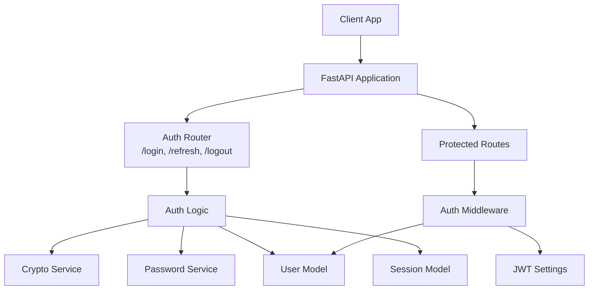
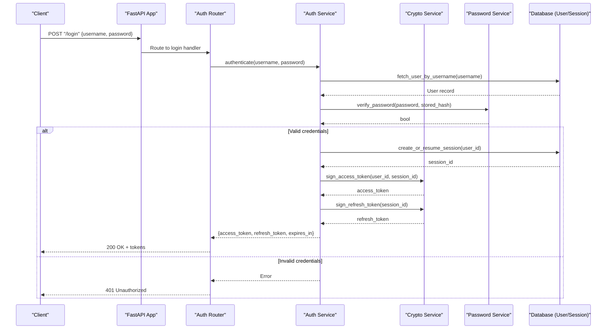
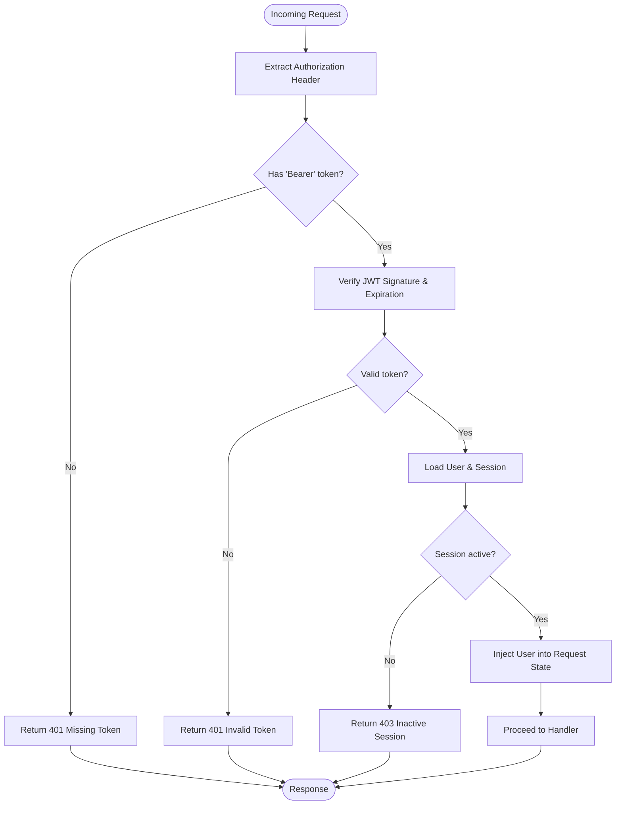
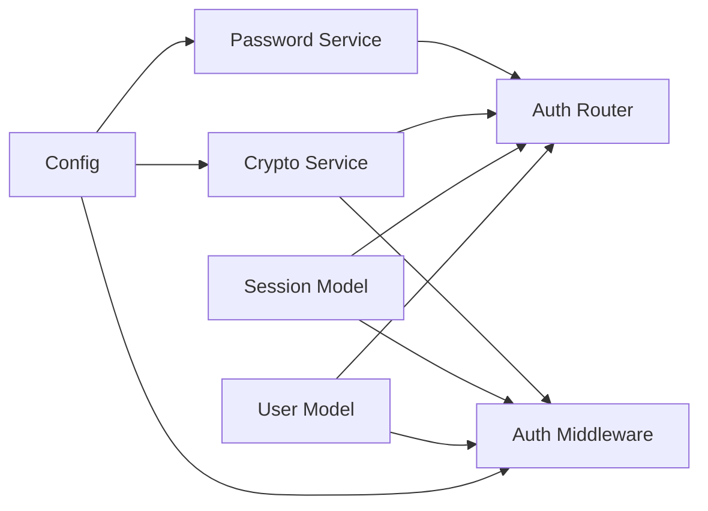

# Authentication Flow & Token Management

<cite>
**Referenced Files in This Document**
- [main.py](file://backend/app/main.py)
- [auth_middleware.py](file://backend/app/middleware/auth.py)
- [auth_router.py](file://backend/app/routers/auth.py)
- [auth_schema.py](file://backend/app/schemas/auth.py)
- [user_model.py](file://backend/app/models/user.py)
- [session_model.py](file://backend/app/models/session.py)
- [crypto_service.py](file://backend/app/services/crypto.py)
- [password_service.py](file://backend/app/services/password.py)
- [config.py](file://backend/app/config.py)
</cite>

## Table of Contents
1. [Introduction](#introduction)
2. [Project Structure](#project-structure)
3. [Core Components](#core-components)
4. [Architecture Overview](#architecture-overview)
5. [Detailed Component Analysis](#detailed-component-analysis)
6. [Dependency Analysis](#dependency-analysis)
7. [Performance Considerations](#performance-considerations)
8. [Troubleshooting Guide](#troubleshooting-guide)
9. [Conclusion](#conclusion)

## Introduction
This document explains the JWT-based authentication flow and token management system implemented in the backend application. It covers the complete lifecycle from user login to token issuance, validation, refresh, and logout. It also documents the middleware that intercepts requests, extracts tokens, validates them, and injects authenticated user context into request scope. Finally, it provides guidance for implementing protected endpoints, custom decorators, and extending the authentication flow with additional providers.

## Project Structure
The authentication-related code is organized across routers, schemas, models, services, and middleware:
- Routers define HTTP endpoints for login, token refresh, and logout.
- Schemas define Pydantic models for request/response payloads.
- Models represent users and sessions in the database.
- Services implement cryptographic operations and password hashing.
- Middleware performs token extraction, validation, and user context injection.
- Configuration centralizes JWT settings and security parameters.

**Diagram sources**
- [main.py](file://backend/app/main.py)
- [auth_middleware.py](file://backend/app/middleware/auth.py)
- [auth_router.py](file://backend/app/routers/auth.py)
- [auth_schema.py](file://backend/app/schemas/auth.py)
- [user_model.py](file://backend/app/models/user.py)
- [session_model.py](file://backend/app/models/session.py)
- [crypto_service.py](file://backend/app/services/crypto.py)
- [password_service.py](file://backend/app/services/password.py)
- [config.py](file://backend/app/config.py)

**Section sources**
- [main.py](file://backend/app/main.py)
- [auth_middleware.py](file://backend/app/middleware/auth.py)
- [auth_router.py](file://backend/app/routers/auth.py)
- [auth_schema.py](file://backend/app/schemas/auth.py)
- [user_model.py](file://backend/app/models/user.py)
- [session_model.py](file://backend/app/models/session.py)
- [crypto_service.py](file://backend/app/services/crypto.py)
- [password_service.py](file://backend/app/services/password.py)
- [config.py](file://backend/app/config.py)

## Core Components
- Authentication router: Provides endpoints for login, token refresh, and logout. It orchestrates credential verification, session management, and token issuance.
- Authentication middleware: Intercepts incoming requests, extracts bearer tokens, validates signatures and expiration, checks session state, and injects the current user into request state.
- Schema definitions: Define input and output structures for authentication requests and responses, including error response formats.
- User and session models: Represent entities persisted in the database; used to verify credentials and manage active sessions.
- Crypto and password services: Provide secure hashing and cryptographic utilities for signing and verifying tokens.
- Configuration: Centralizes JWT secret, algorithm, token lifetimes, and other security settings.

Key responsibilities:
- Login: Validate credentials, create or resume a session, issue access and refresh tokens.
- Refresh: Validate refresh token, ensure session exists and is active, issue new access token.
- Logout: Invalidate session and optionally blacklist tokens.
- Protected endpoints: Require valid access token and active session; inject user context.

**Section sources**
- [auth_router.py](file://backend/app/routers/auth.py)
- [auth_middleware.py](file://backend/app/middleware/auth.py)
- [auth_schema.py](file://backend/app/schemas/auth.py)
- [user_model.py](file://backend/app/models/user.py)
- [session_model.py](file://backend/app/models/session.py)
- [crypto_service.py](file://backend/app/services/crypto.py)
- [password_service.py](file://backend/app/services/password.py)
- [config.py](file://backend/app/config.py)

## Architecture Overview
The authentication architecture follows a layered approach:
- HTTP layer exposes endpoints for authentication operations.
- Service layer handles business logic, including credential verification and token generation/validation.
- Data layer persists user and session information.
- Middleware enforces authentication on protected routes by validating tokens and injecting user context.

**Diagram sources**
- [auth_router.py](file://backend/app/routers/auth.py)
- [auth_middleware.py](file://backend/app/middleware/auth.py)
- [auth_schema.py](file://backend/app/schemas/auth.py)
- [user_model.py](file://backend/app/models/user.py)
- [session_model.py](file://backend/app/models/session.py)
- [crypto_service.py](file://backend/app/services/crypto.py)
- [password_service.py](file://backend/app/services/password.py)
- [config.py](file://backend/app/config.py)

## Detailed Component Analysis

### Authentication Router
Responsibilities:
- Expose login endpoint: Accept username and password, validate via service, return tokens if successful.
- Expose refresh endpoint: Accept refresh token, validate session and signature, issue new access token.
- Expose logout endpoint: Invalidate session and optionally revoke tokens.

Request/response patterns:
- Login request schema includes username and password fields.
- Login response schema includes access token, refresh token, and expiration metadata.
- Refresh request schema includes refresh token.
- Refresh response schema includes new access token and expiration metadata.
- Logout request may include optional token or rely on server-side session invalidation.

Error handling:
- Returns standardized error responses for invalid credentials, expired tokens, missing headers, and internal errors.

**Section sources**
- [auth_router.py](file://backend/app/routers/auth.py)
- [auth_schema.py](file://backend/app/schemas/auth.py)

### Authentication Middleware
Responsibilities:
- Intercept all requests to protected routes.
- Extract bearer token from Authorization header.
- Validate token signature and expiration using configured algorithm and secret.
- Check session validity and status.
- Inject authenticated user into request state for downstream handlers.

Token extraction and validation flow:
- Parse Authorization header for Bearer scheme.
- Decode and verify JWT claims.
- Load user and session records to confirm active state.
- Attach user object to request context.

Error handling:
- Reject requests with missing or malformed tokens.
- Reject requests with expired or revoked tokens.
- Return appropriate HTTP status codes and error messages.

**Diagram sources**
- [auth_middleware.py](file://backend/app/middleware/auth.py)
- [config.py](file://backend/app/config.py)
- [user_model.py](file://backend/app/models/user.py)
- [session_model.py](file://backend/app/models/session.py)

**Section sources**
- [auth_middleware.py](file://backend/app/middleware/auth.py)
- [config.py](file://backend/app/config.py)

### Schema Definitions
Authentication schemas define structured inputs and outputs:
- LoginRequest: username, password.
- LoginResponse: access_token, refresh_token, expires_in.
- RefreshRequest: refresh_token.
- RefreshResponse: access_token, expires_in.
- ErrorResponse: message, code, details.

These schemas enforce validation at the API boundary and provide consistent client-facing contracts.

**Section sources**
- [auth_schema.py](file://backend/app/schemas/auth.py)

### User and Session Models
User model:
- Stores hashed passwords and user attributes.
- Used to retrieve user by username during login.

Session model:
- Tracks active sessions per user.
- Supports creation, lookup, and invalidation.
- Ensures tokens are only issued and accepted for active sessions.

**Section sources**
- [user_model.py](file://backend/app/models/user.py)
- [session_model.py](file://backend/app/models/session.py)

### Crypto and Password Services
Crypto service:
- Signs and verifies JWT tokens using configured algorithm and secret.
- Generates token payloads with user identifiers and session IDs.

Password service:
- Hashes passwords securely.
- Verifies plaintext passwords against stored hashes.

Configuration integration:
- Reads JWT secret, algorithm, and token lifetimes from configuration.

**Section sources**
- [crypto_service.py](file://backend/app/services/crypto.py)
- [password_service.py](file://backend/app/services/password.py)
- [config.py](file://backend/app/config.py)

### Protected Endpoints and Custom Decorators
Implementing protected endpoints:
- Apply authentication middleware to route groups or individual endpoints.
- Access authenticated user from request state within handlers.

Custom decorators:
- Wrap endpoint functions to perform additional checks (e.g., role-based authorization).
- Reuse token extraction and validation logic from middleware.

Extending with additional providers:
- Introduce provider interfaces for alternative authentication mechanisms (e.g., OAuth2).
- Implement provider-specific login flows while reusing common token issuance and validation logic.

**Section sources**
- [auth_middleware.py](file://backend/app/middleware/auth.py)
- [auth_router.py](file://backend/app/routers/auth.py)

## Dependency Analysis
The authentication subsystem depends on configuration, data models, and services:
- Router depends on schemas and services.
- Middleware depends on config, models, and crypto service.
- Services depend on models and configuration.

**Diagram sources**
- [config.py](file://backend/app/config.py)
- [crypto_service.py](file://backend/app/services/crypto.py)
- [password_service.py](file://backend/app/services/password.py)
- [auth_middleware.py](file://backend/app/middleware/auth.py)
- [auth_router.py](file://backend/app/routers/auth.py)
- [user_model.py](file://backend/app/models/user.py)
- [session_model.py](file://backend/app/models/session.py)

**Section sources**
- [config.py](file://backend/app/config.py)
- [crypto_service.py](file://backend/app/services/crypto.py)
- [password_service.py](file://backend/app/services/password.py)
- [auth_middleware.py](file://backend/app/middleware/auth.py)
- [auth_router.py](file://backend/app/routers/auth.py)
- [user_model.py](file://backend/app/models/user.py)
- [session_model.py](file://backend/app/models/session.py)

## Performance Considerations
- Minimize database queries by caching frequently accessed user profiles when safe.
- Use short-lived access tokens and long-lived refresh tokens to reduce validation overhead.
- Ensure efficient indexing on user and session tables for fast lookups.
- Avoid redundant token decoding by leveraging framework-level caching where applicable.

[No sources needed since this section provides general guidance]

## Troubleshooting Guide
Common issues and resolutions:
- Missing Authorization header: Ensure clients send Bearer tokens for protected endpoints.
- Invalid token signature: Verify JWT secret and algorithm configuration matches between issuer and validator.
- Expired tokens: Implement automatic refresh before expiry; handle 401 responses by refreshing tokens.
- Inactive session: Confirm session creation and persistence; check session invalidation logic during logout.

Operational tips:
- Log token validation failures with sanitized details for debugging.
- Monitor session counts and token issuance rates to detect anomalies.
- Use consistent error response schemas to simplify client error handling.

**Section sources**
- [auth_middleware.py](file://backend/app/middleware/auth.py)
- [auth_router.py](file://backend/app/routers/auth.py)
- [auth_schema.py](file://backend/app/schemas/auth.py)

## Conclusion
The authentication system implements a robust JWT-based flow with clear separation of concerns: routers expose APIs, middleware enforces security, services encapsulate logic, and models persist state. By following the documented patterns for protected endpoints, custom decorators, and provider extensions, teams can maintain a secure and extensible authentication architecture.

[No sources needed since this section summarizes without analyzing specific files]