# Authorization & Role-Based Access Control

<cite>
**Referenced Files in This Document**
- [main.py](file://backend/app/main.py)
- [auth_middleware.py](file://backend/app/middleware/auth.py)
- [user_model.py](file://backend/app/models/user.py)
- [auth_router.py](file://backend/app/routers/auth.py)
- [users_router.py](file://backend/app/routers/users.py)
- [settings_service.py](file://backend/app/services/settings_service.py)
- [audit_log_model.py](file://backend/app/models/audit_log.py)
- [database.py](file://backend/app/database.py)
</cite>

## Table of Contents
1. [Introduction](#introduction)
2. [Project Structure](#project-structure)
3. [Core Components](#core-components)
4. [Architecture Overview](#architecture-overview)
5. [Detailed Component Analysis](#detailed-component-analysis)
6. [Dependency Analysis](#dependency-analysis)
7. [Performance Considerations](#performance-considerations)
8. [Troubleshooting Guide](#troubleshooting-guide)
9. [Conclusion](#conclusion)

## Introduction
This document explains the role-based access control (RBAC) and authorization mechanisms implemented in the application. It covers how roles and permissions are defined, stored, validated, and enforced across API endpoints. It also documents middleware-based checks, decorator patterns for endpoint protection, hierarchical role structures, and strategies for custom permission rules, dynamic authorization logic, and integration with external authorization systems. Where applicable, it includes diagrams that map to actual source files and provides guidance on common authorization patterns such as resource-based permissions and contextual access control.

## Project Structure
The RBAC system is primarily implemented in the backend:
- Authentication and session handling live in the auth router and middleware.
- User model defines identity and role attributes.
- Routers apply authorization via middleware and decorators.
- Settings service can provide runtime configuration for authorization behavior.
- Audit logging records authorization-related events.

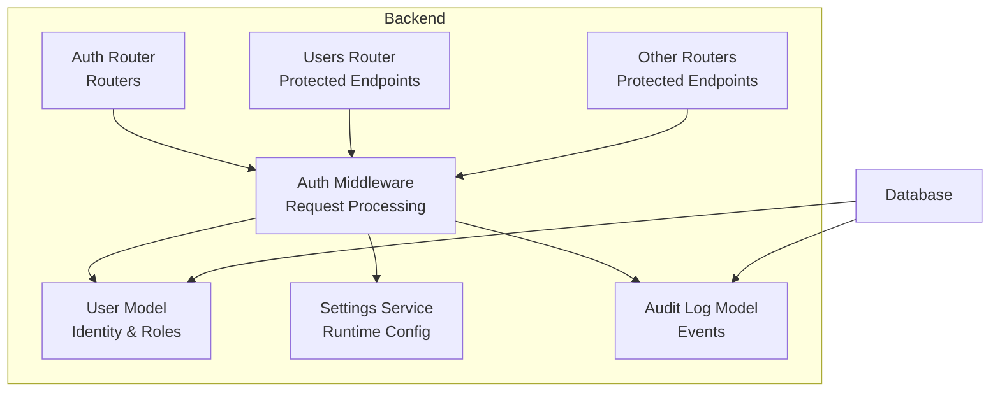

**Diagram sources**
- [main.py:1-200](file://backend/app/main.py#L1-L200)
- [auth_middleware.py:1-200](file://backend/app/middleware/auth.py#L1-L200)
- [user_model.py:1-200](file://backend/app/models/user.py#L1-L200)
- [auth_router.py:1-200](file://backend/app/routers/auth.py#L1-L200)
- [users_router.py:1-200](file://backend/app/routers/users.py#L1-L200)
- [settings_service.py:1-200](file://backend/app/services/settings_service.py#L1-L200)
- [audit_log_model.py:1-200](file://backend/app/models/audit_log.py#L1-L200)
- [database.py:1-200](file://backend/app/database.py#L1-L200)

**Section sources**
- [main.py:1-200](file://backend/app/main.py#L1-L200)
- [auth_middleware.py:1-200](file://backend/app/middleware/auth.py#L1-L200)
- [user_model.py:1-200](file://backend/app/models/user.py#L1-L200)
- [auth_router.py:1-200](file://backend/app/routers/auth.py#L1-L200)
- [users_router.py:1-200](file://backend/app/routers/users.py#L1-L200)
- [settings_service.py:1-200](file://backend/app/services/settings_service.py#L1-L200)
- [audit_log_model.py:1-200](file://backend/app/models/audit_log.py#L1-L200)
- [database.py:1-200](file://backend/app/database.py#L1-L200)

## Core Components
- Auth Router: Handles login, token issuance, and session establishment.
- Auth Middleware: Validates requests, extracts identity, enforces roles/permissions, and attaches context to requests.
- User Model: Stores user identity, roles, and related metadata.
- Protected Routers: Apply authorization guards to restrict access based on roles or permissions.
- Settings Service: Provides runtime configuration for authorization policies.
- Audit Log Model: Records authorization decisions and sensitive actions.

Key responsibilities:
- Define roles and permissions at the data layer.
- Enforce checks at request boundaries using middleware and decorators.
- Provide hooks for custom rules and dynamic evaluation.
- Persist audit trails for compliance and debugging.

**Section sources**
- [auth_router.py:1-200](file://backend/app/routers/auth.py#L1-L200)
- [auth_middleware.py:1-200](file://backend/app/middleware/auth.py#L1-L200)
- [user_model.py:1-200](file://backend/app/models/user.py#L1-L200)
- [users_router.py:1-200](file://backend/app/routers/users.py#L1-L200)
- [settings_service.py:1-200](file://backend/app/services/settings_service.py#L1-L200)
- [audit_log_model.py:1-200](file://backend/app/models/audit_log.py#L1-L200)

## Architecture Overview
The authorization flow integrates authentication, policy evaluation, and auditing:

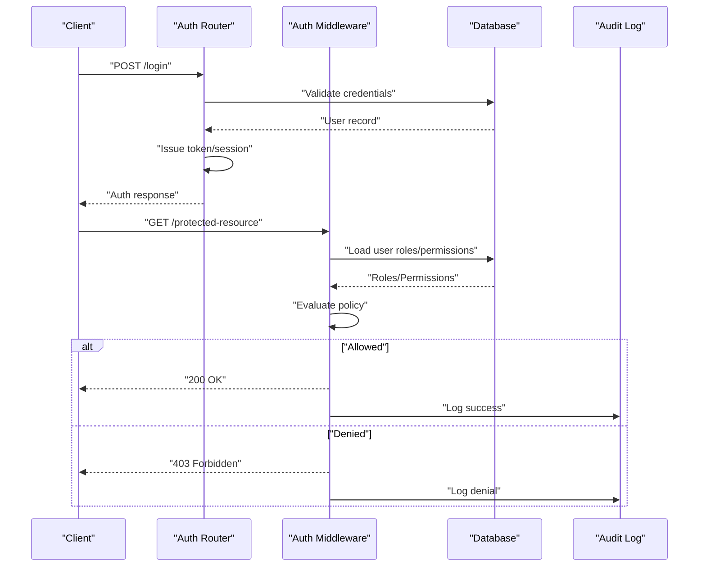

**Diagram sources**
- [auth_router.py:1-200](file://backend/app/routers/auth.py#L1-L200)
- [auth_middleware.py:1-200](file://backend/app/middleware/auth.py#L1-L200)
- [user_model.py:1-200](file://backend/app/models/user.py#L1-L200)
- [audit_log_model.py:1-200](file://backend/app/models/audit_log.py#L1-L200)
- [database.py:1-200](file://backend/app/database.py#L1-L200)

## Detailed Component Analysis

### User Identity and Roles
The user model encapsulates identity and role information used by authorization checks. Roles may be hierarchical, enabling inheritance of permissions from parent roles.

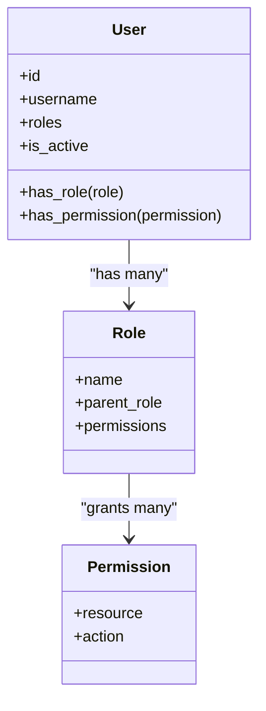

Implementation notes:
- Role hierarchy supports parent-child relationships for permission inheritance.
- Permission checks evaluate both direct assignments and inherited roles.
- Active status gates access even if roles/permissions exist.

**Diagram sources**
- [user_model.py:1-200](file://backend/app/models/user.py#L1-L200)

**Section sources**
- [user_model.py:1-200](file://backend/app/models/user.py#L1-L200)

### Authentication and Session Management
The auth router manages login flows and issues tokens/sessions. The middleware validates subsequent requests using these credentials.

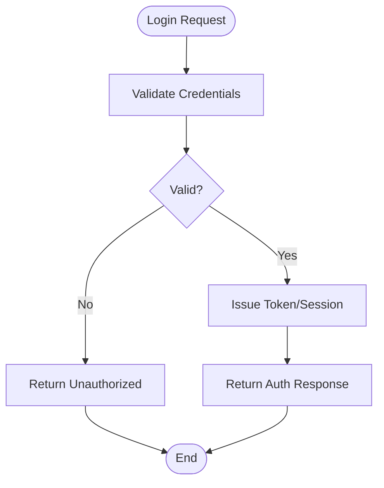

Operational details:
- Tokens include user identity and role claims.
- Sessions persist state securely and expire per policy.
- Refresh mechanisms maintain long-lived sessions safely.

**Diagram sources**
- [auth_router.py:1-200](file://backend/app/routers/auth.py#L1-L200)

**Section sources**
- [auth_router.py:1-200](file://backend/app/routers/auth.py#L1-L200)

### Authorization Middleware
The middleware intercepts requests, loads user context, evaluates policies, and attaches authorization context to the request.

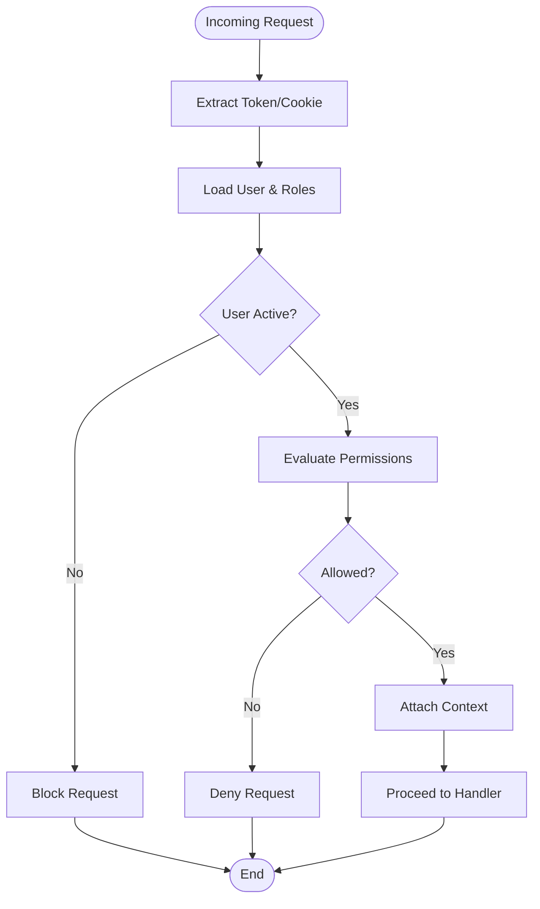

Responsibilities:
- Parse and validate credentials.
- Resolve roles and permissions from storage.
- Apply policy rules and attach context.
- Record audit events for all decisions.

**Diagram sources**
- [auth_middleware.py:1-200](file://backend/app/middleware/auth.py#L1-L200)
- [audit_log_model.py:1-200](file://backend/app/models/audit_log.py#L1-L200)

**Section sources**
- [auth_middleware.py:1-200](file://backend/app/middleware/auth.py#L1-L200)
- [audit_log_model.py:1-200](file://backend/app/models/audit_log.py#L1-L200)

### Endpoint Protection Patterns
Endpoints use decorators and/or route-level guards to enforce authorization. Examples include:
- Role-based guards requiring specific roles.
- Permission-based guards checking resource-action pairs.
- Contextual guards evaluating request-scoped attributes (e.g., ownership).

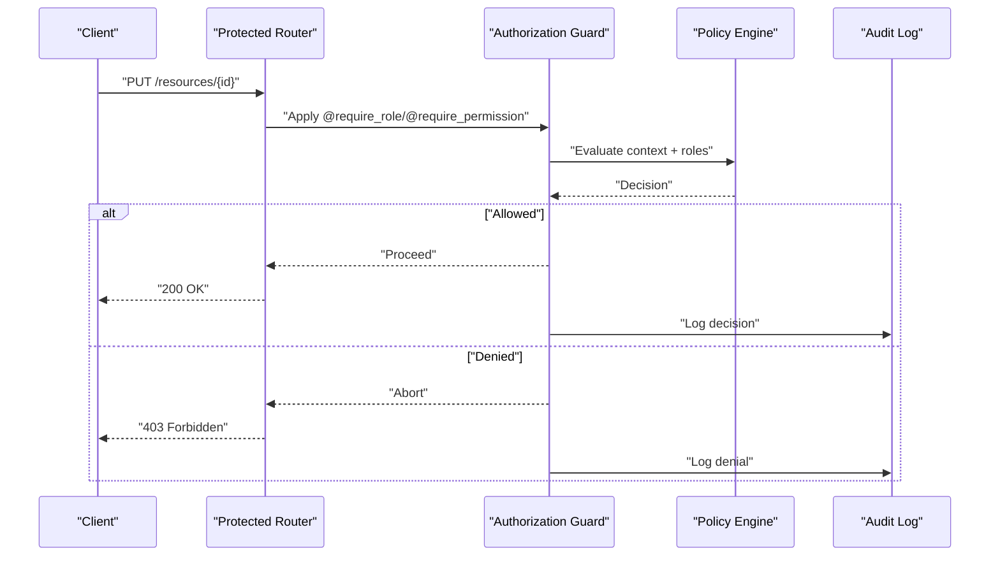

Usage patterns:
- Decorators wrap handlers to enforce checks before business logic runs.
- Guards accept parameters like required roles, permissions, or conditions.
- Handlers remain focused on domain logic without explicit auth code.

**Diagram sources**
- [users_router.py:1-200](file://backend/app/routers/users.py#L1-L200)
- [auth_middleware.py:1-200](file://backend/app/middleware/auth.py#L1-L200)
- [audit_log_model.py:1-200](file://backend/app/models/audit_log.py#L1-L200)

**Section sources**
- [users_router.py:1-200](file://backend/app/routers/users.py#L1-L200)
- [auth_middleware.py:1-200](file://backend/app/middleware/auth.py#L1-L200)
- [audit_log_model.py:1-200](file://backend/app/models/audit_log.py#L1-L200)

### Hierarchical Role Structures
Role hierarchies enable inheritance of permissions through parent-child relationships.

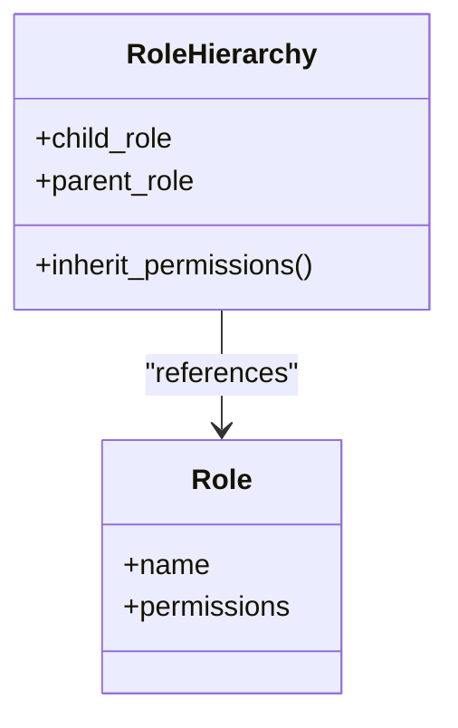

Behavior:
- Child roles inherit all permissions from parents unless explicitly overridden.
- Evaluation traverses up the hierarchy until a decision is reached.
- Overrides allow fine-grained exceptions where necessary.

**Diagram sources**
- [user_model.py:1-200](file://backend/app/models/user.py#L1-L200)

**Section sources**
- [user_model.py:1-200](file://backend/app/models/user.py#L1-L200)

### Custom Permission Rules and Dynamic Authorization
Custom rules can be registered and evaluated dynamically at runtime.

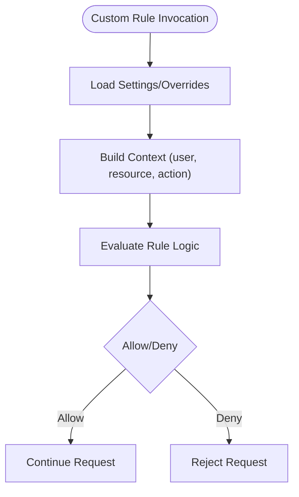

Guidance:
- Use settings service to toggle features or override defaults.
- Implement rule functions that accept context and return boolean decisions.
- Cache expensive computations when safe to do so.

**Diagram sources**
- [settings_service.py:1-200](file://backend/app/services/settings_service.py#L1-L200)
- [auth_middleware.py:1-200](file://backend/app/middleware/auth.py#L1-L200)

**Section sources**
- [settings_service.py:1-200](file://backend/app/services/settings_service.py#L1-L200)
- [auth_middleware.py:1-200](file://backend/app/middleware/auth.py#L1-L200)

### Resource-Based Permissions and Contextual Access Control
Resource-based permissions tie actions to specific resources, while contextual access control considers additional factors such as ownership, tenant, or time windows.

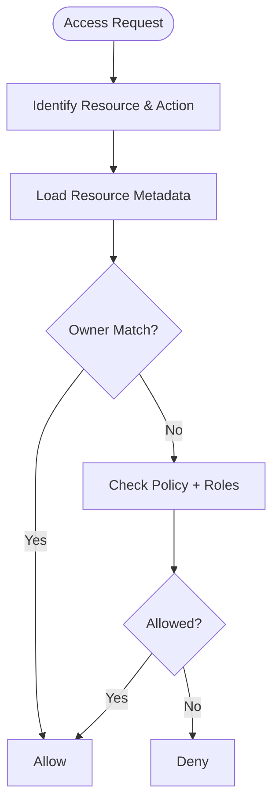

Patterns:
- Ownership checks bypass broad policies for efficiency and safety.
- Policies combine roles, permissions, and contextual attributes.
- Auditing captures decisions for traceability.

**Diagram sources**
- [auth_middleware.py:1-200](file://backend/app/middleware/auth.py#L1-L200)
- [audit_log_model.py:1-200](file://backend/app/models/audit_log.py#L1-L200)

**Section sources**
- [auth_middleware.py:1-200](file://backend/app/middleware/auth.py#L1-L200)
- [audit_log_model.py:1-200](file://backend/app/models/audit_log.py#L1-L200)

### Integration with External Authorization Systems
External systems can be integrated by plugging into the policy evaluation stage.

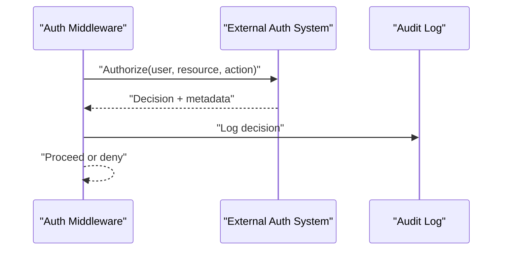

Considerations:
- Use timeouts and fallbacks to avoid blocking requests.
- Cache decisions when appropriate and consistent.
- Normalize responses to internal policy format.

**Diagram sources**
- [auth_middleware.py:1-200](file://backend/app/middleware/auth.py#L1-L200)
- [audit_log_model.py:1-200](file://backend/app/models/audit_log.py#L1-L200)

**Section sources**
- [auth_middleware.py:1-200](file://backend/app/middleware/auth.py#L1-L200)
- [audit_log_model.py:1-200](file://backend/app/models/audit_log.py#L1-L200)

## Dependency Analysis
The following diagram shows key dependencies among components involved in authorization:

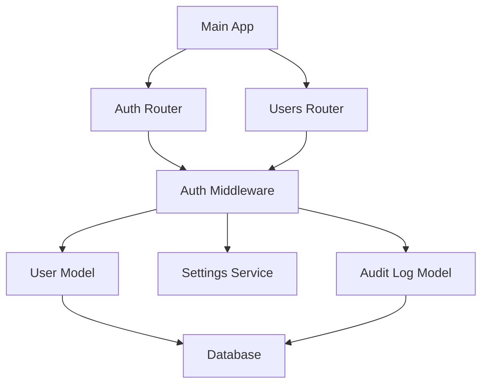

**Diagram sources**
- [main.py:1-200](file://backend/app/main.py#L1-L200)
- [auth_router.py:1-200](file://backend/app/routers/auth.py#L1-L200)
- [users_router.py:1-200](file://backend/app/routers/users.py#L1-L200)
- [auth_middleware.py:1-200](file://backend/app/middleware/auth.py#L1-L200)
- [user_model.py:1-200](file://backend/app/models/user.py#L1-L200)
- [settings_service.py:1-200](file://backend/app/services/settings_service.py#L1-L200)
- [audit_log_model.py:1-200](file://backend/app/models/audit_log.py#L1-L200)
- [database.py:1-200](file://backend/app/database.py#L1-L200)

**Section sources**
- [main.py:1-200](file://backend/app/main.py#L1-L200)
- [auth_router.py:1-200](file://backend/app/routers/auth.py#L1-L200)
- [users_router.py:1-200](file://backend/app/routers/users.py#L1-L200)
- [auth_middleware.py:1-200](file://backend/app/middleware/auth.py#L1-L200)
- [user_model.py:1-200](file://backend/app/models/user.py#L1-L200)
- [settings_service.py:1-200](file://backend/app/services/settings_service.py#L1-L200)
- [audit_log_model.py:1-200](file://backend/app/models/audit_log.py#L1-L200)
- [database.py:1-200](file://backend/app/database.py#L1-L200)

## Performance Considerations
- Minimize database reads by caching user roles and permissions where safe.
- Short-circuit checks with ownership or tenant scoping to reduce policy complexity.
- Use efficient role hierarchy traversal and memoization for repeated evaluations.
- Avoid synchronous calls to external authorization systems; prefer async or cached results.
- Batch audit writes to reduce I/O overhead.

[No sources needed since this section provides general guidance]

## Troubleshooting Guide
Common issues and resolutions:
- Missing or invalid tokens: Ensure proper token issuance and validation in the auth router and middleware.
- Unexpected denials: Review role hierarchy and permission mappings; verify active status.
- Slow authorization: Inspect cache usage and external system latency; add timeouts and fallbacks.
- Inconsistent audit logs: Confirm audit events are emitted for both allow and deny decisions.

Diagnostic steps:
- Enable detailed logging around policy evaluation.
- Inspect audit log entries for denied requests.
- Validate settings overrides affecting authorization behavior.

**Section sources**
- [auth_middleware.py:1-200](file://backend/app/middleware/auth.py#L1-L200)
- [audit_log_model.py:1-200](file://backend/app/models/audit_log.py#L1-L200)
- [settings_service.py:1-200](file://backend/app/services/settings_service.py#L1-L200)

## Conclusion
The RBAC system combines clear role definitions, robust middleware enforcement, and flexible policy evaluation to secure endpoints effectively. By leveraging hierarchical roles, resource-based permissions, and contextual checks, the application maintains strong security while remaining adaptable to evolving requirements. Integrating external authorization systems and maintaining comprehensive audit trails further strengthens governance and observability.

[No sources needed since this section summarizes without analyzing specific files]