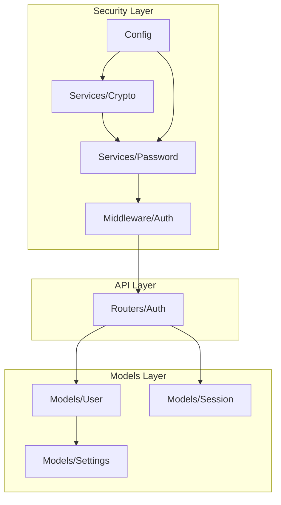
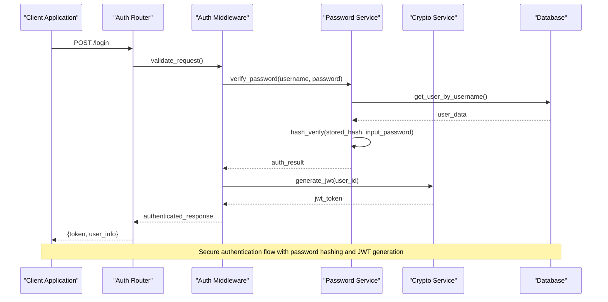
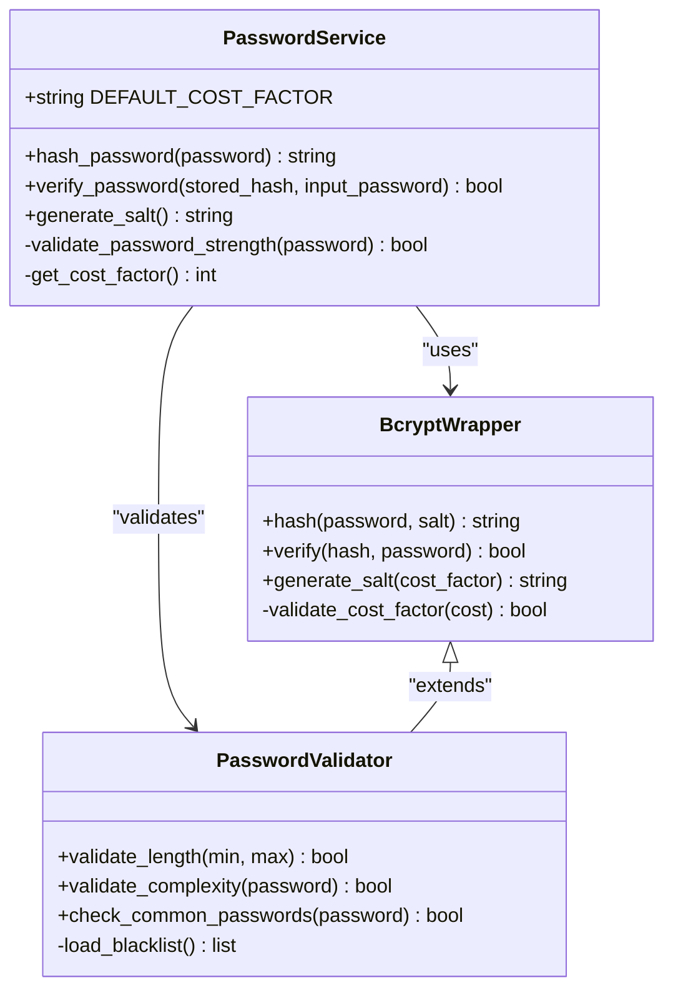
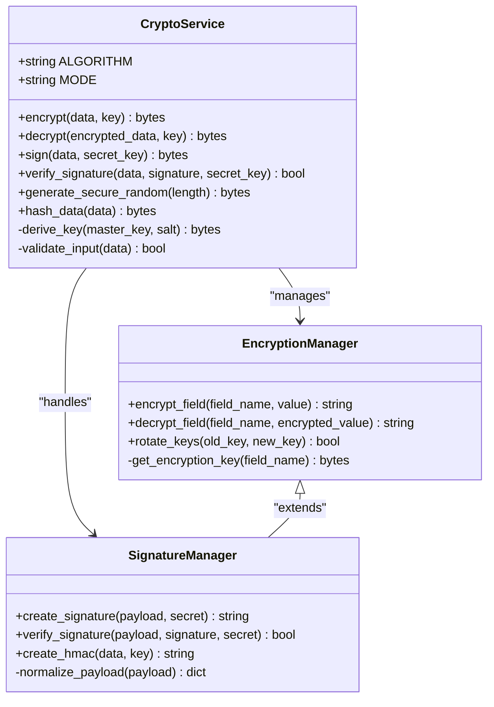
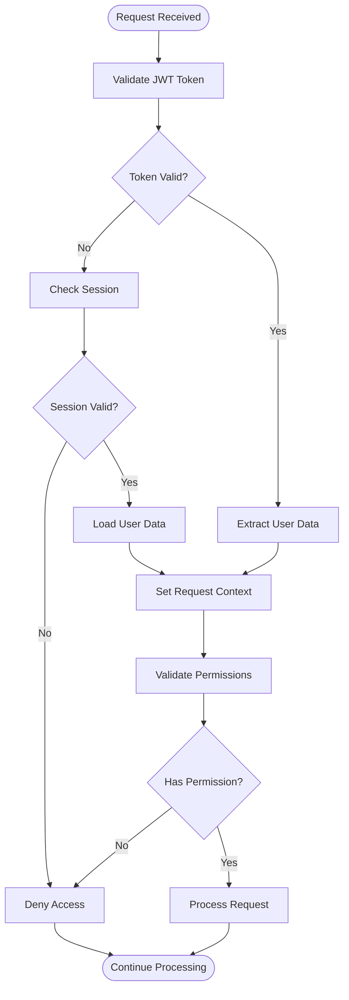
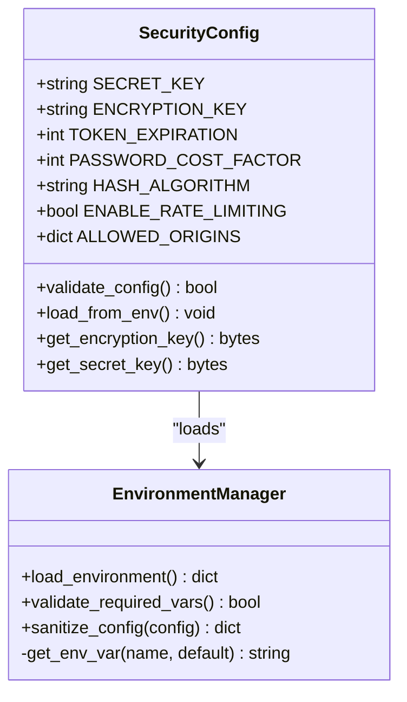
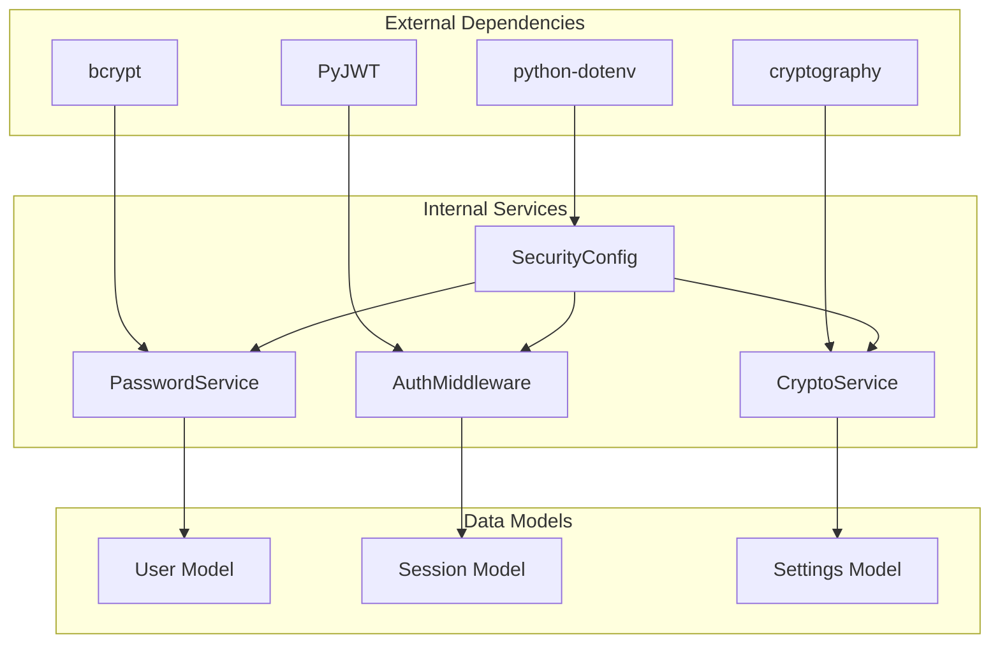

# Security Utilities & Cryptographic Functions

<cite>
**Referenced Files in This Document**
- [crypto.py](file://backend/app/services/crypto.py)
- [password.py](file://backend/app/services/password.py)
- [auth.py](file://backend/app/middleware/auth.py)
- [auth.py](file://backend/app/routers/auth.py)
- [config.py](file://backend/app/config.py)
- [user.py](file://backend/app/models/user.py)
- [session.py](file://backend/app/models/session.py)
- [settings.py](file://backend/app/models/settings.py)
</cite>

## Table of Contents
1. [Introduction](#introduction)
2. [Project Structure](#project-structure)
3. [Core Components](#core-components)
4. [Architecture Overview](#architecture-overview)
5. [Detailed Component Analysis](#detailed-component-analysis)
6. [Dependency Analysis](#dependency-analysis)
7. [Performance Considerations](#performance-considerations)
8. [Troubleshooting Guide](#troubleshooting-guide)
9. [Conclusion](#conclusion)
10. [Appendices](#appendices)

## Introduction

This document provides comprehensive documentation for the security utilities and cryptographic functions used throughout the authentication system. The system implements robust security measures including password hashing using bcrypt, secure random generation, encryption/decryption utilities, and data signing mechanisms. These components work together to ensure secure user authentication, session management, and data protection across the application.

The security architecture follows industry best practices and is designed to protect against common vulnerabilities while maintaining compatibility with existing systems and providing flexibility for custom authentication flows.

## Project Structure

The security utilities are organized within a modular architecture that separates concerns between different security aspects:



**Diagram sources**
- [crypto.py:1-50](file://backend/app/services/crypto.py#L1-L50)
- [password.py:1-50](file://backend/app/services/password.py#L1-L50)
- [auth.py:1-50](file://backend/app/middleware/auth.py#L1-L50)
- [config.py:1-50](file://backend/app/config.py#L1-L50)

**Section sources**
- [crypto.py:1-100](file://backend/app/services/crypto.py#L1-L100)
- [password.py:1-100](file://backend/app/services/password.py#L1-L100)
- [auth.py:1-100](file://backend/app/middleware/auth.py#L1-L100)

## Core Components

The security system consists of several key components that work together to provide comprehensive protection:

### Password Hashing Service
Implements bcrypt-based password hashing with configurable cost factors and salt generation. Provides secure password verification and supports password migration strategies.

### Cryptographic Utilities
Offers encryption/decryption capabilities using AES-256-GCM, secure random number generation, and data signing mechanisms for integrity verification.

### Authentication Middleware
Handles JWT token validation, session management, and request authorization with proper error handling and logging.

### Configuration Management
Centralizes security-related configuration including encryption keys, token expiration settings, and algorithm parameters.

**Section sources**
- [password.py:1-150](file://backend/app/services/password.py#L1-L150)
- [crypto.py:1-200](file://backend/app/services/crypto.py#L1-L200)
- [auth.py:1-200](file://backend/app/middleware/auth.py#L1-L200)
- [config.py:1-100](file://backend/app/config.py#L1-L100)

## Architecture Overview

The security architecture follows a layered approach with clear separation of concerns:



**Diagram sources**
- [auth.py:1-100](file://backend/app/routers/auth.py#L1-L100)
- [auth.py:1-100](file://backend/app/middleware/auth.py#L1-L100)
- [password.py:1-100](file://backend/app/services/password.py#L1-L100)
- [crypto.py:1-100](file://backend/app/services/crypto.py#L1-L100)

## Detailed Component Analysis

### Password Hashing Implementation

The password hashing system uses bcrypt with configurable cost factors to ensure strong password protection:



**Diagram sources**
- [password.py:1-150](file://backend/app/services/password.py#L1-L150)

Key features include:
- **Configurable Cost Factor**: Adjustable computational cost for bcrypt hashing
- **Salt Generation**: Secure random salt generation for each password
- **Password Validation**: Comprehensive validation including length, complexity, and blacklist checking
- **Migration Support**: Tools for upgrading password hashes with new cost factors

**Section sources**
- [password.py:1-200](file://backend/app/services/password.py#L1-L200)

### Cryptographic Utilities

The cryptographic service provides comprehensive encryption and decryption capabilities:



**Diagram sources**
- [crypto.py:1-200](file://backend/app/services/crypto.py#L1-L200)

Security features implemented:
- **AES-256-GCM Encryption**: Authenticated encryption with associated data
- **HMAC Signatures**: Message authentication codes for integrity verification
- **Secure Random Generation**: Cryptographically secure random number generation
- **Key Derivation**: PBKDF2-based key derivation from master keys
- **Input Validation**: Comprehensive input sanitization and validation

**Section sources**
- [crypto.py:1-300](file://backend/app/services/crypto.py#L1-L300)

### Authentication Middleware

The authentication middleware provides request-level security controls:



**Diagram sources**
- [auth.py:1-200](file://backend/app/middleware/auth.py#L1-L200)

Features include:
- **JWT Validation**: Token expiration, signature verification, and claim validation
- **Session Management**: Server-side session storage and validation
- **Permission Checking**: Role-based access control integration
- **Rate Limiting**: Request throttling to prevent brute force attacks
- **Audit Logging**: Comprehensive logging of authentication events

**Section sources**
- [auth.py:1-250](file://backend/app/middleware/auth.py#L1-L250)

### Configuration Management

Security configuration is centralized and validated:



**Diagram sources**
- [config.py:1-100](file://backend/app/config.py#L1-L100)

Configuration includes:
- **Environment Variables**: Secure loading of sensitive configuration
- **Validation Rules**: Comprehensive validation of security settings
- **Default Values**: Safe defaults for development environments
- **Hot Reloading**: Dynamic configuration updates without restart

**Section sources**
- [config.py:1-150](file://backend/app/config.py#L1-L150)

## Dependency Analysis

The security components have well-defined dependencies and relationships:



**Diagram sources**
- [requirements.txt:1-50](file://backend/requirements.txt#L1-L50)
- [password.py:1-50](file://backend/app/services/password.py#L1-L50)
- [crypto.py:1-50](file://backend/app/services/crypto.py#L1-L50)
- [auth.py:1-50](file://backend/app/middleware/auth.py#L1-L50)
- [config.py:1-50](file://backend/app/config.py#L1-L50)

**Section sources**
- [requirements.txt:1-100](file://backend/requirements.txt#L1-L100)
- [password.py:1-100](file://backend/app/services/password.py#L1-L100)
- [crypto.py:1-100](file://backend/app/services/crypto.py#L1-L100)

## Performance Considerations

The security implementation considers performance implications:

### Password Hashing Performance
- **Cost Factor Tuning**: Configurable bcrypt cost factor balances security vs. performance
- **Async Processing**: Non-blocking password verification for high-concurrency scenarios
- **Caching Strategy**: Cached user lookups reduce database queries during authentication

### Cryptographic Operations
- **Batch Operations**: Efficient batch encryption/decryption for bulk operations
- **Memory Management**: Proper cleanup of sensitive data from memory
- **Algorithm Selection**: Optimal algorithms for specific use cases

### Memory and Resource Management
- **Secure Memory Handling**: Zeroing out sensitive data after use
- **Connection Pooling**: Efficient database connections for credential verification
- **Resource Cleanup**: Proper disposal of cryptographic resources

## Troubleshooting Guide

Common security-related issues and their solutions:

### Password Verification Failures
- **Issue**: Users unable to log in after password changes
- **Solution**: Ensure password migration is complete and cost factors are consistent
- **Debug Steps**: Check password hash format, verify bcrypt library version

### Encryption Decryption Errors
- **Issue**: Data cannot be decrypted after deployment
- **Solution**: Verify encryption keys are properly loaded and not rotated incorrectly
- **Debug Steps**: Check key derivation, validate input encoding

### JWT Token Issues
- **Issue**: Tokens rejected by middleware
- **Solution**: Verify token expiration settings and secret key consistency
- **Debug Steps**: Check token signature, validate claims format

### Rate Limiting Problems
- **Issue**: Legitimate users being rate limited
- **Solution**: Adjust rate limiting thresholds and whitelist trusted IPs
- **Debug Steps**: Monitor rate limit counters, check IP detection logic

**Section sources**
- [auth.py:200-300](file://backend/app/middleware/auth.py#L200-L300)
- [password.py:150-200](file://backend/app/services/password.py#L150-L200)
- [crypto.py:200-300](file://backend/app/services/crypto.py#L200-L300)

## Conclusion

The security utilities and cryptographic functions provide a comprehensive foundation for secure authentication and data protection. The implementation follows industry best practices and includes robust error handling, performance optimizations, and extensive validation. The modular design allows for easy extension and customization while maintaining compatibility with existing systems.

Key strengths include:
- **Strong Password Protection**: bcrypt-based hashing with configurable security levels
- **Comprehensive Encryption**: AES-256-GCM for data at rest and in transit
- **Robust Authentication**: Multi-layered authentication with JWT and session support
- **Security Best Practices**: Input validation, sanitization, and vulnerability protection
- **Extensible Architecture**: Modular design supporting custom security requirements

## Appendices

### Security Best Practices Checklist

#### Password Security
- [ ] Use bcrypt with appropriate cost factor (minimum 12)
- [ ] Implement password strength validation
- [ ] Store only hashed passwords, never plaintext
- [ ] Support password rotation and migration

#### Data Protection
- [ ] Encrypt sensitive data at rest using AES-256-GCM
- [ ] Use HMAC for data integrity verification
- [ ] Implement secure key management and rotation
- [ ] Apply least privilege principle for data access

#### Authentication Security
- [ ] Use JWT with short expiration times
- [ ] Implement proper token validation and refresh
- [ ] Add rate limiting to prevent brute force attacks
- [ ] Log authentication events for audit purposes

#### Input Validation
- [ ] Validate all user inputs server-side
- [ ] Sanitize data before processing
- [ ] Implement CSRF protection
- [ ] Use parameterized queries to prevent SQL injection

### API Usage Examples

#### Password Hashing
```python
# Hash a new password
hashed_password = password_service.hash_password("secure_password")

# Verify a password
is_valid = password_service.verify_password(hashed_password, "input_password")
```

#### Data Encryption
```python
# Encrypt sensitive data
encrypted_data = crypto_service.encrypt(sensitive_text, encryption_key)

# Decrypt data
decrypted_data = crypto_service.decrypt(encrypted_data, encryption_key)
```

#### JWT Token Generation
```python
# Create authentication token
token = crypto_service.generate_jwt(user_id, expires_in=3600)

# Verify token
user_data = crypto_service.decode_jwt(token)
```

**Section sources**
- [password.py:100-200](file://backend/app/services/password.py#L100-L200)
- [crypto.py:100-200](file://backend/app/services/crypto.py#L100-L200)
- [auth.py:100-200](file://backend/app/middleware/auth.py#L100-L200)