# Backend Architecture

<cite>
**Referenced Files in This Document**
- [main.py](file://backend/app/main.py)
- [config.py](file://backend/app/config.py)
- [database.py](file://backend/app/database.py)
- [auth.py](file://backend/app/middleware/auth.py)
- [user.py](file://backend/app/models/user.py)
- [request.py](file://backend/app/models/request.py)
- [template.py](file://backend/app/models/template.py)
- [session.py](file://backend/app/models/session.py)
- [audit_log.py](file://backend/app/models/audit_log.py)
- [settings.py](file://backend/app/models/settings.py)
- [users.py](file://backend/app/routers/users.py)
- [requests.py](file://backend/app/routers/requests.py)
- [templates.py](file://backend/app/routers/templates.py)
- [auth.py](file://backend/app/routers/auth.py)
- [approvals.py](file://backend/app/routers/approvals.py)
- [active_resources.py](file://backend/app/routers/active_resources.py)
- [audit.py](file://backend/app/routers/audit.py)
- [settings.py](file://backend/app/routers/settings.py)
- [approval.py](file://backend/app/schemas/approval.py)
- [audit.py](file://backend/app/schemas/audit.py)
- [auth.py](file://backend/app/schemas/auth.py)
- [request.py](file://backend/app/schemas/request.py)
- [settings.py](file://backend/app/schemas/settings.py)
- [template.py](file://backend/app/schemas/template.py)
- [user.py](file://backend/app/schemas/user.py)
- [aliyun_ecs.py](file://backend/app/services/aliyun_ecs.py)
- [aliyun_vpc.py](file://backend/app/services/aliyun_vpc.py)
- [approval.py](file://backend/app/services/approval.py)
- [crypto.py](file://backend/app/services/crypto.py)
- [password.py](file://backend/app/services/password.py)
- [settings_service.py](file://backend/app/services/settings_service.py)
</cite>

## Table of Contents
1. [Introduction](#introduction)
2. [Project Structure](#project-structure)
3. [Core Components](#core-components)
4. [Architecture Overview](#architecture-overview)
5. [Detailed Component Analysis](#detailed-component-analysis)
6. [Dependency Analysis](#dependency-analysis)
7. [Performance Considerations](#performance-considerations)
8. [Troubleshooting Guide](#troubleshooting-guide)
9. [Conclusion](#conclusion)

## Introduction
This document describes the FastAPI backend architecture for an ECS request management system. It explains the modular design with clear separation of concerns across routers, services, models, schemas, middleware, and configuration. It also documents application initialization, configuration management, database connection handling, authentication middleware, request processing flow, service layer abstraction, dependency injection, error handling strategies, and external API integrations.

## Project Structure
The backend follows a layered, feature-oriented layout:
- Routers define HTTP endpoints and route requests to services.
- Services encapsulate business logic and orchestrate data access and external calls.
- Models represent database entities using an ORM.
- Schemas define Pydantic models for request/response validation and serialization.
- Middleware provides cross-cutting concerns such as authentication.
- Configuration centralizes settings and environment variables.
- Database module manages sessions and engine lifecycle.

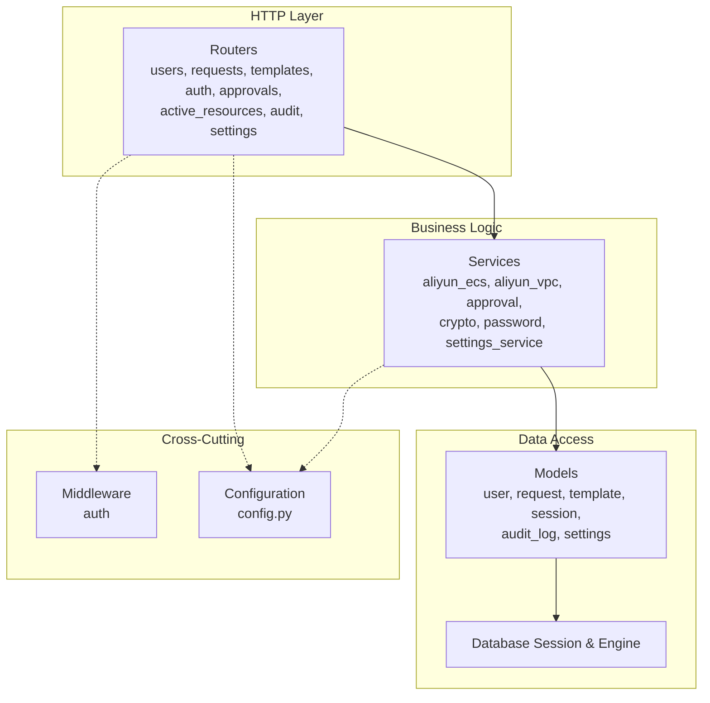

[No sources needed since this diagram shows conceptual workflow, not actual code structure]

## Core Components
- Application entrypoint initializes FastAPI, registers routers, applies middleware, and configures lifespan events (startup/shutdown).
- Configuration loads environment-based settings and exposes typed configuration objects.
- Database module creates and manages SQLAlchemy engine and session factory.
- Authentication middleware validates tokens or sessions and injects user context into requests.
- Routers expose REST endpoints, validate inputs via Pydantic schemas, and delegate to services.
- Services implement business rules, coordinate multiple models, and call external APIs (e.g., Aliyun ECS/VPC).
- Models map to database tables and provide query helpers.
- Schemas enforce input/output contracts and are used for OpenAPI generation.

**Section sources**
- [main.py](file://backend/app/main.py)
- [config.py](file://backend/app/config.py)
- [database.py](file://backend/app/database.py)
- [auth.py](file://backend/app/middleware/auth.py)

## Architecture Overview
The system uses a clean layered architecture:
- HTTP endpoints (routers) receive requests, perform basic validation via schemas, and call services.
- Services contain domain logic, interact with models for persistence, and integrate with external systems.
- Models abstract database operations through an ORM.
- Middleware enforces security and adds request context.
- Configuration drives behavior across layers.

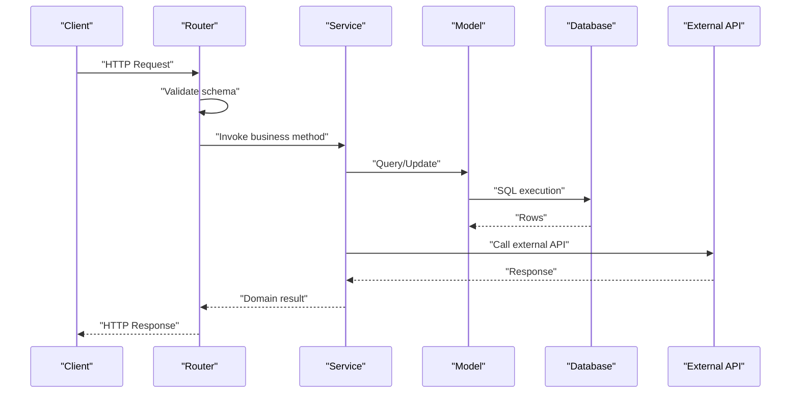

[No sources needed since this diagram shows conceptual workflow, not actual code structure]

## Detailed Component Analysis

### Application Initialization and Lifespan
- The application object is created and configured with CORS, docs, and lifespan hooks.
- Startup hook initializes configuration, logs, and database connections; shutdown hook releases resources.
- Routers are included under versioned prefixes and mounted at the root.
- Global exception handlers register standardized error responses.

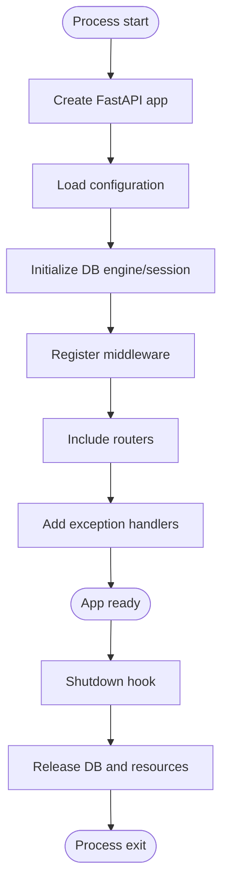

**Section sources**
- [main.py](file://backend/app/main.py)
- [config.py](file://backend/app/config.py)
- [database.py](file://backend/app/database.py)

### Configuration Management
- Centralized configuration class reads environment variables and provides defaults.
- Settings include database URLs, JWT secrets, external API credentials, and feature flags.
- Typed configuration enables IDE support and runtime validation.

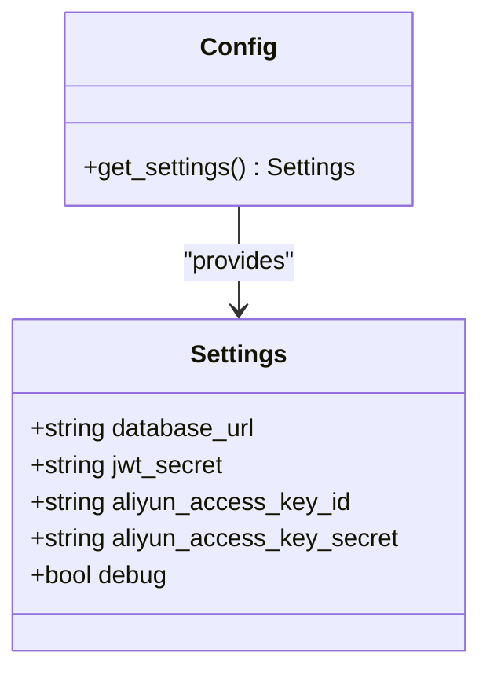

**Section sources**
- [config.py](file://backend/app/config.py)

### Database Connection Handling
- Engine creation uses a connection pool and reflects settings from configuration.
- Session factory ensures scoped sessions per request.
- Base metadata binds to engine for migrations and Alembic compatibility.

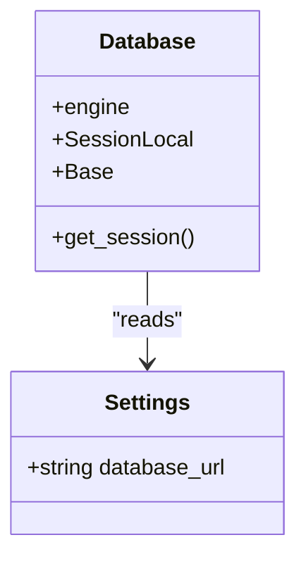

**Section sources**
- [database.py](file://backend/app/database.py)
- [config.py](file://backend/app/config.py)

### Authentication Middleware
- Middleware intercepts requests, extracts token/session, validates signature/expiry, and attaches user context to the request state.
- Public routes bypass checks; protected routes require valid identity.
- On failure, returns standardized error responses.

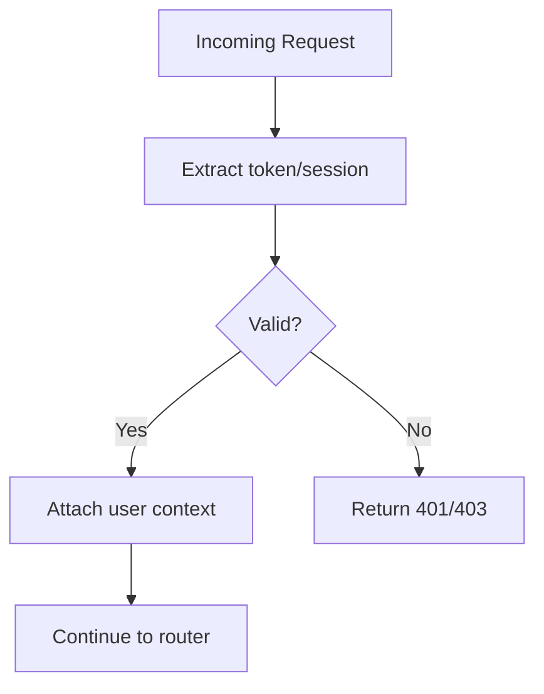

**Section sources**
- [auth.py](file://backend/app/middleware/auth.py)

### Routers and Request Processing Flow
- Each router groups related endpoints and depends on services for business logic.
- Input validation is performed via Pydantic schemas before calling services.
- Responses are serialized using response schemas.

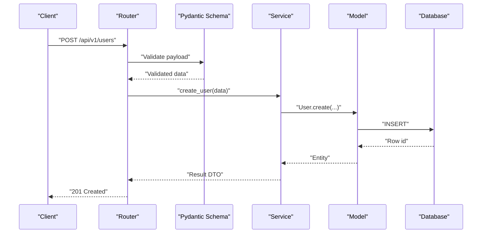

**Section sources**
- [users.py](file://backend/app/routers/users.py)
- [requests.py](file://backend/app/routers/requests.py)
- [templates.py](file://backend/app/routers/templates.py)
- [auth.py](file://backend/app/routers/auth.py)
- [approvals.py](file://backend/app/routers/approvals.py)
- [active_resources.py](file://backend/app/routers/active_resources.py)
- [audit.py](file://backend/app/routers/audit.py)
- [settings.py](file://backend/app/routers/settings.py)

### Service Layer Abstraction and External Integrations
- Services encapsulate domain logic and coordinate multiple models and external APIs.
- Aliyun ECS and VPC services handle provisioning, querying, and lifecycle operations.
- Approval and settings services manage workflows and configuration persistence.
- Utility services provide cryptographic and password hashing capabilities.

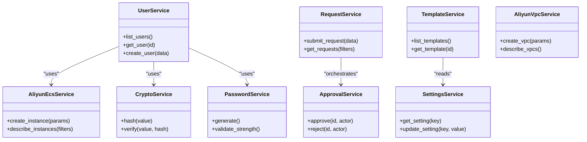

**Section sources**
- [aliyun_ecs.py](file://backend/app/services/aliyun_ecs.py)
- [aliyun_vpc.py](file://backend/app/services/aliyun_vpc.py)
- [approval.py](file://backend/app/services/approval.py)
- [crypto.py](file://backend/app/services/crypto.py)
- [password.py](file://backend/app/services/password.py)
- [settings_service.py](file://backend/app/services/settings_service.py)

### Data Models and Schemas
- Models define ORM entities for users, requests, templates, sessions, audit logs, and settings.
- Schemas define Pydantic models for request payloads and responses, enabling automatic validation and OpenAPI documentation.

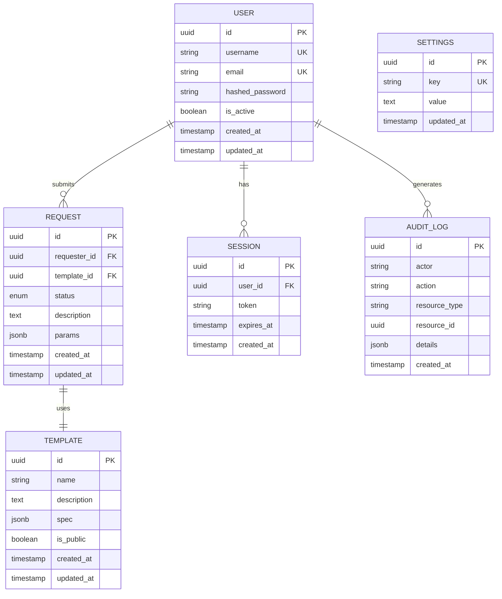

**Section sources**
- [user.py](file://backend/app/models/user.py)
- [request.py](file://backend/app/models/request.py)
- [template.py](file://backend/app/models/template.py)
- [session.py](file://backend/app/models/session.py)
- [audit_log.py](file://backend/app/models/audit_log.py)
- [settings.py](file://backend/app/models/settings.py)
- [user.py](file://backend/app/schemas/user.py)
- [request.py](file://backend/app/schemas/request.py)
- [template.py](file://backend/app/schemas/template.py)
- [approval.py](file://backend/app/schemas/approval.py)
- [audit.py](file://backend/app/schemas/audit.py)
- [auth.py](file://backend/app/schemas/auth.py)
- [settings.py](file://backend/app/schemas/settings.py)

### Dependency Injection Patterns
- Database sessions are injected into routers/services via FastAPI’s dependency injection mechanism.
- Services may accept repositories or model instances to keep tests mockable.
- Configuration is provided as a singleton dependency.

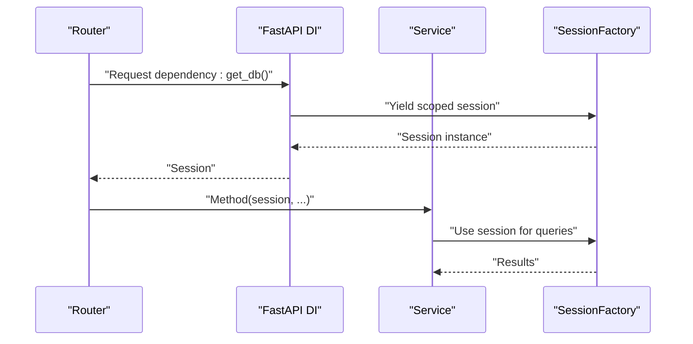

**Section sources**
- [database.py](file://backend/app/database.py)
- [main.py](file://backend/app/main.py)

### Error Handling Strategies
- Global exception handlers convert domain errors into consistent JSON responses with appropriate HTTP codes.
- Validation errors are normalized to a uniform shape for clients.
- Logging captures stack traces and contextual information for debugging.

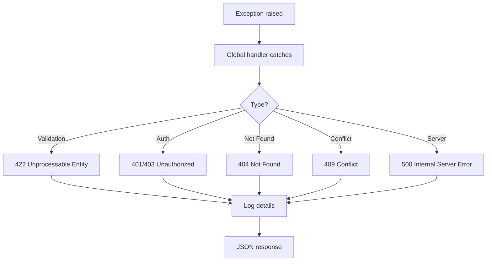

**Section sources**
- [main.py](file://backend/app/main.py)

## Dependency Analysis
High-level dependencies between modules:

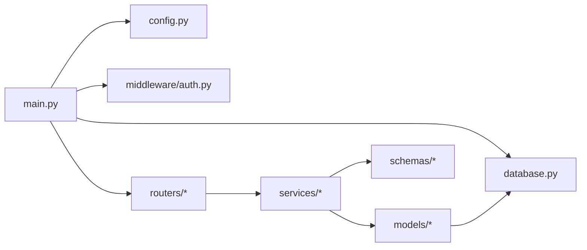

**Section sources**
- [main.py](file://backend/app/main.py)
- [config.py](file://backend/app/config.py)
- [database.py](file://backend/app/database.py)
- [auth.py](file://backend/app/middleware/auth.py)

## Performance Considerations
- Use connection pooling and tune pool size based on workload and database capacity.
- Avoid N+1 queries by using eager loading where appropriate.
- Cache frequently accessed read-only data (e.g., templates, settings) with short TTLs.
- Paginate list endpoints and limit large result sets.
- Offload long-running tasks (e.g., provisioning) to background workers and return async task IDs.
- Profile external API calls and implement retries with backoff and circuit breakers.

[No sources needed since this section provides general guidance]

## Troubleshooting Guide
- Verify environment variables and configuration precedence if endpoints fail to connect to the database or external APIs.
- Inspect global exception logs for stack traces and request context when clients receive 5xx errors.
- Ensure middleware order is correct so authentication runs before authorization checks.
- Validate schema mismatches by checking request bodies against Pydantic models.
- For migration issues, confirm Alembic versions align with current models and run upgrade/downgrade commands carefully.

**Section sources**
- [config.py](file://backend/app/config.py)
- [database.py](file://backend/app/database.py)
- [auth.py](file://backend/app/middleware/auth.py)
- [main.py](file://backend/app/main.py)

## Conclusion
The backend implements a clean, layered FastAPI architecture with clear separation of concerns. Routers focus on HTTP concerns, services encapsulate business logic and external integrations, models abstract persistence, and middleware handles cross-cutting concerns like authentication. Centralized configuration and robust error handling improve reliability and maintainability. The design supports extensibility, testability, and operational observability.