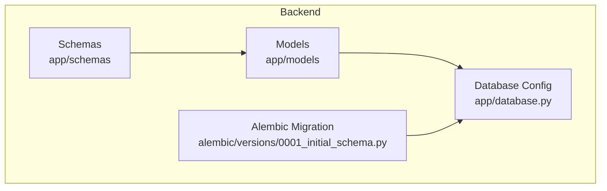
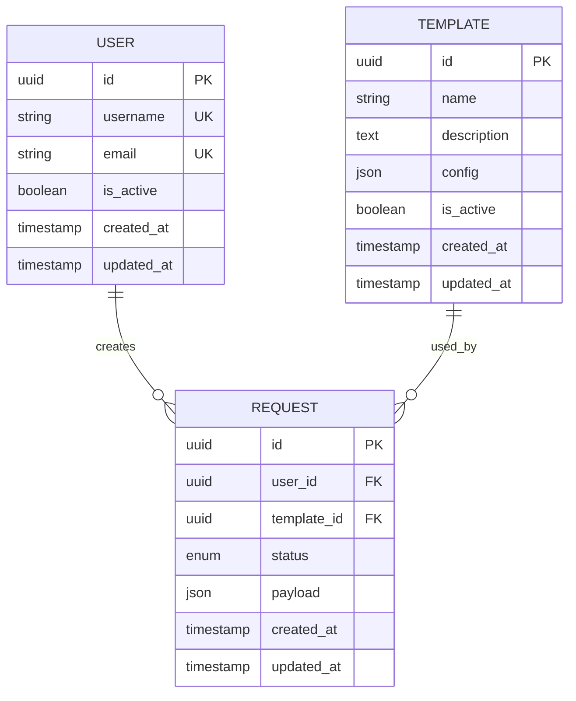
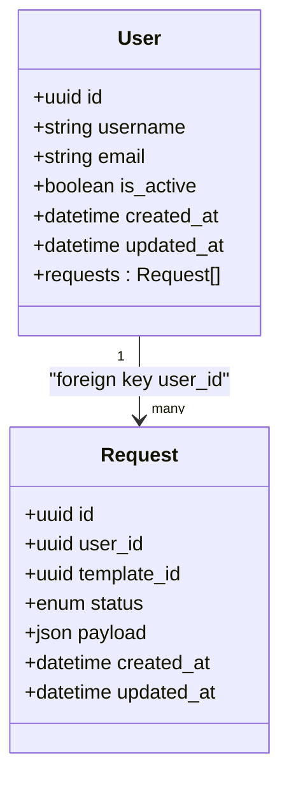
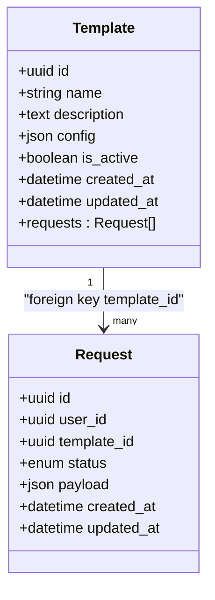
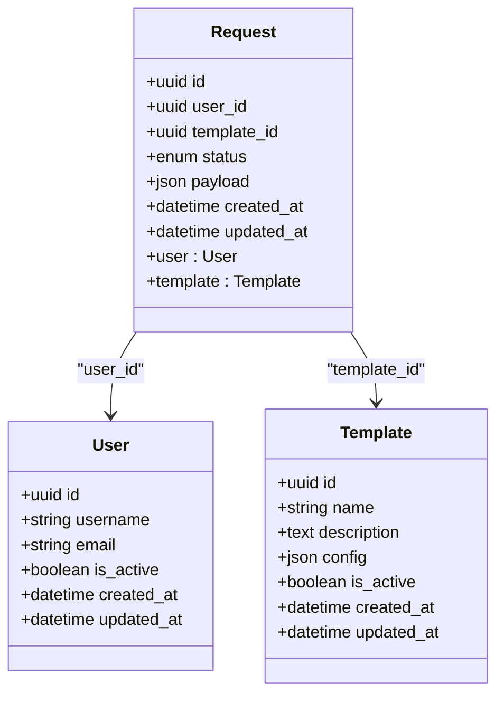
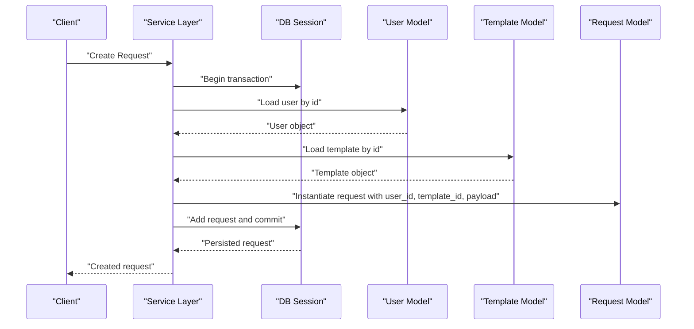
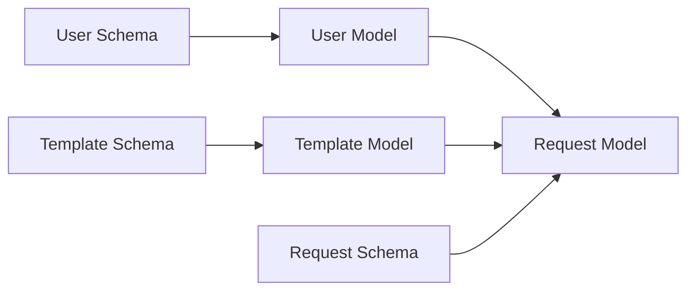

# Core Data Models

<cite>
**Referenced Files in This Document**
- [user.py](file://backend/app/models/user.py)
- [template.py](file://backend/app/models/template.py)
- [request.py](file://backend/app/models/request.py)
- [__init__.py](file://backend/app/models/__init__.py)
- [database.py](file://backend/app/database.py)
- [0001_initial_schema.py](file://backend/alembic/versions/0001_initial_schema.py)
- [user.py](file://backend/app/schemas/user.py)
- [template.py](file://backend/app/schemas/template.py)
- [request.py](file://backend/app/schemas/request.py)
</cite>

## Table of Contents
1. [Introduction](#introduction)
2. [Project Structure](#project-structure)
3. [Core Components](#core-components)
4. [Architecture Overview](#architecture-overview)
5. [Detailed Component Analysis](#detailed-component-analysis)
6. [Dependency Analysis](#dependency-analysis)
7. [Performance Considerations](#performance-considerations)
8. [Troubleshooting Guide](#troubleshooting-guide)
9. [Conclusion](#conclusion)

## Introduction
This document describes the core business data models: User, Template, and Request. It explains schema definitions, field constraints, validation rules, relationships, primary keys, foreign keys, indexes, and database constraints. It also provides examples of model instantiation, relationship navigation, and common query patterns, along with business logic enforcement at the model level and data integrity rules.

## Project Structure
The backend organizes domain entities under app/models, with Pydantic schemas under app/schemas for API input/output validation. Database migrations are managed via Alembic. The base ORM metadata is configured in the database module.

**Diagram sources**
- [database.py](file://backend/app/database.py)
- [0001_initial_schema.py](file://backend/alembic/versions/0001_initial_schema.py)
- [user.py](file://backend/app/models/user.py)
- [template.py](file://backend/app/models/template.py)
- [request.py](file://backend/app/models/request.py)
- [user.py](file://backend/app/schemas/user.py)
- [template.py](file://backend/app/schemas/template.py)
- [request.py](file://backend/app/schemas/request.py)

**Section sources**
- [database.py](file://backend/app/database.py)
- [0001_initial_schema.py](file://backend/alembic/versions/0001_initial_schema.py)
- [user.py](file://backend/app/models/user.py)
- [template.py](file://backend/app/models/template.py)
- [request.py](file://backend/app/models/request.py)
- [user.py](file://backend/app/schemas/user.py)
- [template.py](file://backend/app/schemas/template.py)
- [request.py](file://backend/app/schemas/request.py)

## Core Components
This section summarizes the three core models and their responsibilities:
- User: Represents a system user with authentication and profile fields.
- Template: Encapsulates reusable request configurations or parameters.
- Request: Captures an instance of a resource request tied to a template and a user.

Key aspects covered:
- Primary keys and identifiers
- Foreign key relationships
- Field types and constraints
- Indexes and unique constraints
- Validation rules (Pydantic schemas)
- Business logic enforced at the model layer

**Section sources**
- [user.py](file://backend/app/models/user.py)
- [template.py](file://backend/app/models/template.py)
- [request.py](file://backend/app/models/request.py)
- [user.py](file://backend/app/schemas/user.py)
- [template.py](file://backend/app/schemas/template.py)
- [request.py](file://backend/app/schemas/request.py)

## Architecture Overview
The data layer uses SQLAlchemy ORM mapped to tables defined by Alembic migrations. Pydantic schemas validate API payloads before persistence. Relationships between models are enforced via foreign keys and optional back-populated attributes.

**Diagram sources**
- [user.py](file://backend/app/models/user.py)
- [template.py](file://backend/app/models/template.py)
- [request.py](file://backend/app/models/request.py)
- [0001_initial_schema.py](file://backend/alembic/versions/0001_initial_schema.py)

## Detailed Component Analysis

### User Model
Responsibilities:
- Stores identity and account state for users.
- Provides relationships to requests created by the user.

Schema highlights:
- Primary key: UUID-based identifier.
- Unique constraints on username and email.
- Boolean flag for account activation.
- Timestamps for creation and update.

Relationships:
- One-to-many with Request (a user can create many requests).

Validation (Pydantic):
- Username and email format checks.
- Required fields and length limits.

Common operations:
- Create a new user with validated input.
- Query active users by username or email.
- Navigate from user to related requests.

Example usage patterns:
- Instantiation via session.add(user) followed by commit.
- Relationship navigation: user.requests to list associated requests.
- Filtering: select users where is_active is true.

**Section sources**
- [user.py](file://backend/app/models/user.py)
- [user.py](file://backend/app/schemas/user.py)
- [0001_initial_schema.py](file://backend/alembic/versions/0001_initial_schema.py)

#### Class Diagram

**Diagram sources**
- [user.py](file://backend/app/models/user.py)
- [request.py](file://backend/app/models/request.py)

### Template Model
Responsibilities:
- Defines reusable configuration for requests.
- Holds structured configuration and descriptive metadata.

Schema highlights:
- Primary key: UUID-based identifier.
- Name uniqueness constraint.
- JSON field for flexible configuration storage.
- Boolean flag for enabling/disabling templates.
- Timestamps for creation and update.

Relationships:
- One-to-many with Request (a template can be used by many requests).

Validation (Pydantic):
- Name required and unique within scope.
- Optional description and configuration content validation.

Common operations:
- Create a template with validated configuration.
- Query active templates by name.
- Navigate from template to related requests.

Example usage patterns:
- Instantiate template and persist via session.
- Access template.requests to enumerate requests using it.
- Filter templates by is_active.

**Section sources**
- [template.py](file://backend/app/models/template.py)
- [template.py](file://backend/app/schemas/template.py)
- [0001_initial_schema.py](file://backend/alembic/versions/0001_initial_schema.py)

#### Class Diagram

**Diagram sources**
- [template.py](file://backend/app/models/template.py)
- [request.py](file://backend/app/models/request.py)

### Request Model
Responsibilities:
- Represents a concrete request instance linked to a user and a template.
- Tracks lifecycle status and request-specific payload.

Schema highlights:
- Primary key: UUID-based identifier.
- Foreign keys to User and Template.
- Status enumeration for workflow states.
- JSON payload for request-specific data.
- Timestamps for creation and update.

Relationships:
- Many-to-one with User (via user_id).
- Many-to-one with Template (via template_id).

Validation (Pydantic):
- Required references to user and template.
- Status must be a valid enum value.
- Payload structure validation against expected schema.

Business logic enforcement:
- Ensure referenced user and template exist before creating a request.
- Prevent invalid transitions if status is enforced at the model level.
- Maintain referential integrity through foreign keys.

Common operations:
- Create a request bound to a specific user and template.
- Update status as part of approval workflows.
- Query requests by user, template, or status.

Example usage patterns:
- Instantiate request with user_id and template_id.
- Navigate to request.user and request.template.
- Filter requests by status and date range.

**Section sources**
- [request.py](file://backend/app/models/request.py)
- [request.py](file://backend/app/schemas/request.py)
- [0001_initial_schema.py](file://backend/alembic/versions/0001_initial_schema.py)

#### Class Diagram

**Diagram sources**
- [request.py](file://backend/app/models/request.py)
- [user.py](file://backend/app/models/user.py)
- [template.py](file://backend/app/models/template.py)

### Relationships and Navigation
- User to Request: A user creates multiple requests; navigate via user.requests.
- Template to Request: A template is used by multiple requests; navigate via template.requests.
- Request to User and Template: Each request belongs to one user and one template; access via request.user and request.template.

**Diagram sources**
- [request.py](file://backend/app/models/request.py)
- [user.py](file://backend/app/models/user.py)
- [template.py](file://backend/app/models/template.py)

### Common Query Patterns
- Find user by username or email.
- Retrieve all active templates.
- List requests for a given user filtered by status.
- Count requests per template.
- Join requests with user and template to fetch full context.

These patterns rely on SQLAlchemy queries and filters applied to the models.

**Section sources**
- [user.py](file://backend/app/models/user.py)
- [template.py](file://backend/app/models/template.py)
- [request.py](file://backend/app/models/request.py)

## Dependency Analysis
Model-level dependencies:
- Request depends on User and Template via foreign keys.
- User and Template are independent root entities.
- Schemas depend on models for type hints and validation alignment.

**Diagram sources**
- [user.py](file://backend/app/models/user.py)
- [template.py](file://backend/app/models/template.py)
- [request.py](file://backend/app/models/request.py)
- [user.py](file://backend/app/schemas/user.py)
- [template.py](file://backend/app/schemas/template.py)
- [request.py](file://backend/app/schemas/request.py)

**Section sources**
- [user.py](file://backend/app/models/user.py)
- [template.py](file://backend/app/models/template.py)
- [request.py](file://backend/app/models/request.py)
- [user.py](file://backend/app/schemas/user.py)
- [template.py](file://backend/app/schemas/template.py)
- [request.py](file://backend/app/schemas/request.py)

## Performance Considerations
- Use selective column loading when retrieving large result sets to reduce memory overhead.
- Add appropriate indexes on frequently filtered columns such as status, user_id, and template_id.
- Avoid N+1 queries by eager loading relationships when necessary (e.g., joinedload for user and template when listing requests).
- Keep JSON payloads compact and validate structure early to minimize processing costs.

[No sources needed since this section provides general guidance]

## Troubleshooting Guide
Common issues and resolutions:
- IntegrityError due to missing referenced user or template: ensure both entities exist before creating a request.
- UniqueConstraintViolation on username or email: check existing records and enforce uniqueness at the application layer.
- Invalid enum value for status: validate against allowed values in the schema and model.
- Null reference errors when navigating relationships: verify that foreign keys are set and loaded.

Operational tips:
- Enable logging around transactions to capture failed commits.
- Validate inputs with Pydantic schemas prior to model instantiation.
- Use explicit error handling to translate database exceptions into meaningful API responses.

**Section sources**
- [user.py](file://backend/app/models/user.py)
- [template.py](file://backend/app/models/template.py)
- [request.py](file://backend/app/models/request.py)
- [user.py](file://backend/app/schemas/user.py)
- [template.py](file://backend/app/schemas/template.py)
- [request.py](file://backend/app/schemas/request.py)

## Conclusion
The core data models—User, Template, and Request—form a cohesive foundation for the ECS request system. They define clear identities, enforce referential integrity through foreign keys, and provide robust validation via Pydantic schemas. By following the recommended query patterns and performance practices, applications can reliably manage user accounts, reusable templates, and request lifecycles while maintaining data consistency and operational clarity.