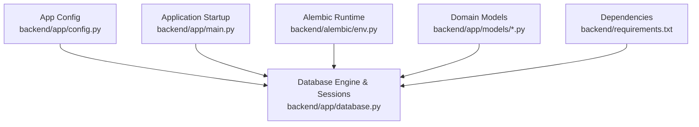
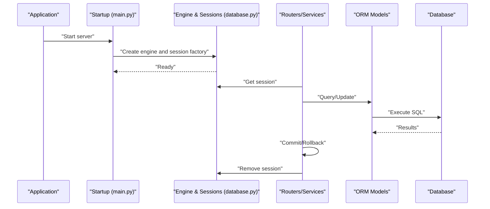
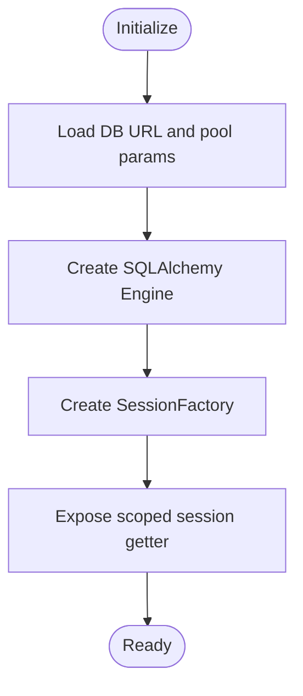
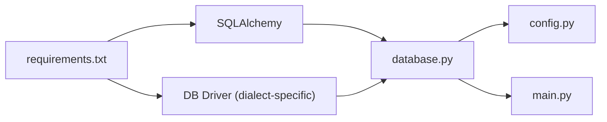

# Database Connection & Session Management

<cite>
**Referenced Files in This Document**
- [database.py](file://backend/app/database.py)
- [config.py](file://backend/app/config.py)
- [main.py](file://backend/app/main.py)
- [env.py](file://backend/alembic/env.py)
- [settings.py](file://backend/app/models/settings.py)
- [session.py](file://backend/app/models/session.py)
- [requirements.txt](file://backend/requirements.txt)
</cite>

## Table of Contents
1. [Introduction](#introduction)
2. [Project Structure](#project-structure)
3. [Core Components](#core-components)
4. [Architecture Overview](#architecture-overview)
5. [Detailed Component Analysis](#detailed-component-analysis)
6. [Dependency Analysis](#dependency-analysis)
7. [Performance Considerations](#performance-considerations)
8. [Troubleshooting Guide](#troubleshooting-guide)
9. [Conclusion](#conclusion)

## Introduction
This document explains the database connection management and session handling system used by the application. It covers SQLAlchemy engine configuration, connection pooling setup, session lifecycle management, database URL configuration, environment-specific settings, transaction management patterns, error handling strategies, connection recycling, timeout configurations, and performance optimization techniques. The goal is to provide both a conceptual overview and code-level guidance for developers working with the data layer.

## Project Structure
The database-related components are primarily located under backend/app and backend/alembic:
- Configuration and startup orchestration live in backend/app/config.py and backend/app/main.py.
- Database engine and session factories are defined in backend/app/database.py.
- Alembic migration runtime configuration is in backend/alembic/env.py.
- Domain models related to sessions and settings are in backend/app/models/session.py and backend/app/models/settings.py.
- Third-party dependencies (including SQLAlchemy and drivers) are declared in backend/requirements.txt.

**Diagram sources**
- [config.py](file://backend/app/config.py)
- [database.py](file://backend/app/database.py)
- [main.py](file://backend/app/main.py)
- [env.py](file://backend/alembic/env.py)
- [settings.py](file://backend/app/models/settings.py)
- [session.py](file://backend/app/models/session.py)
- [requirements.txt](file://backend/requirements.txt)

**Section sources**
- [config.py](file://backend/app/config.py)
- [database.py](file://backend/app/database.py)
- [main.py](file://backend/app/main.py)
- [env.py](file://backend/alembic/env.py)
- [settings.py](file://backend/app/models/settings.py)
- [session.py](file://backend/app/models/session.py)
- [requirements.txt](file://backend/requirements.txt)

## Core Components
- Database engine and session factory: Centralized creation of the SQLAlchemy engine, connection pool parameters, and scoped session factories.
- Configuration module: Loads database URLs and driver-specific options from environment variables or config files.
- Application bootstrap: Initializes the engine and registers dependency injection or context usage for request-scoped sessions.
- Alembic integration: Uses the same engine configuration to run migrations consistently with the application runtime.
- Domain models: Declarative ORM models that bind to tables via the configured metadata.

Key responsibilities:
- Provide a single source of truth for database connectivity.
- Ensure thread-safe session usage per request or task.
- Encapsulate connection pool tuning and timeouts.
- Offer consistent transaction boundaries across services.

**Section sources**
- [database.py](file://backend/app/database.py)
- [config.py](file://backend/app/config.py)
- [main.py](file://backend/app/main.py)
- [env.py](file://backend/alembic/env.py)

## Architecture Overview
The data access architecture follows a layered approach:
- Configuration layer reads environment-specific values (e.g., DATABASE_URL).
- Data layer constructs the SQLAlchemy engine with explicit pool settings and creates session factories.
- Application layer injects sessions into routers/services and manages transactions at service boundaries.
- Migration tooling shares the same engine configuration to ensure parity between runtime and migrations.

**Diagram sources**
- [main.py](file://backend/app/main.py)
- [database.py](file://backend/app/database.py)
- [session.py](file://backend/app/models/session.py)
- [settings.py](file://backend/app/models/settings.py)

## Detailed Component Analysis

### Database Engine and Session Factory
Responsibilities:
- Build the SQLAlchemy engine using a database URL and pool parameters.
- Create a sessionmaker bound to the engine.
- Expose helpers to obtain request-scoped sessions and manage their lifecycle.

Typical implementation patterns:
- Use a global engine instance initialized once at startup.
- Use a scoped session or a context manager to guarantee one session per request/task.
- Configure pool size, max overflow, and recycle to match workload characteristics.

Best practices:
- Avoid creating engines inside request handlers.
- Always close or remove sessions after use to release connections back to the pool.
- Wrap business operations in explicit transactions when needed.

**Diagram sources**
- [database.py](file://backend/app/database.py)
- [config.py](file://backend/app/config.py)

**Section sources**
- [database.py](file://backend/app/database.py)
- [config.py](file://backend/app/config.py)

### Configuration and Environment Settings
Responsibilities:
- Provide database URL and optional driver-specific parameters.
- Support different environments (development, staging, production) via environment variables or config files.
- Centralize secrets and sensitive values.

Common keys:
- DATABASE_URL: Full connection string including dialect, credentials, host, port, and database name.
- Optional pool settings: pool_size, max_overflow, pool_timeout, pool_recycle.
- Optional echo/logging toggles for development.

Environment-specific behavior:
- Development may enable query logging and smaller pools.
- Production should tune pool sizes and timeouts based on expected concurrency and latency targets.

**Section sources**
- [config.py](file://backend/app/config.py)
- [settings.py](file://backend/app/models/settings.py)

### Application Bootstrap and Dependency Wiring
Responsibilities:
- Initialize the engine and session factory during application startup.
- Make sessions available to routers and services through dependency injection or context locals.
- Ensure graceful shutdown by disposing the engine.

Operational notes:
- Do not create multiple engines; reuse the singleton.
- Register middleware or lifespan hooks to handle startup/shutdown.

**Section sources**
- [main.py](file://backend/app/main.py)
- [database.py](file://backend/app/database.py)

### Alembic Integration
Responsibilities:
- Use the same engine configuration as the application to avoid drift between migrations and runtime.
- Bind metadata and configure target schema if necessary.

Integration points:
- Alembic env.py typically imports the app’s engine or builds it from the same configuration.
- Ensures migrations run against the correct database and user.

**Section sources**
- [env.py](file://backend/alembic/env.py)
- [config.py](file://backend/app/config.py)

### Domain Models and Session Usage Patterns
Responsibilities:
- Define ORM classes mapped to tables.
- Demonstrate proper session usage within services/routers.

Recommended patterns:
- Use a session-per-request pattern: open at the start of a request, commit or rollback at the end, then remove/close.
- For long-running tasks, explicitly begin/commit/rollback around unit-of-work blocks.
- Prefer read-only queries where possible to reduce lock contention.

Error handling:
- Catch specific exceptions (e.g., integrity errors, connection errors) and translate them into domain errors.
- Roll back on failures to keep the session consistent.

**Section sources**
- [session.py](file://backend/app/models/session.py)
- [settings.py](file://backend/app/models/settings.py)
- [database.py](file://backend/app/database.py)

## Dependency Analysis
External dependencies relevant to database connectivity include SQLAlchemy and the appropriate database driver (e.g., psycopg2 for PostgreSQL, mysqlclient for MySQL). These are declared in requirements.txt and imported by the database layer.

**Diagram sources**
- [requirements.txt](file://backend/requirements.txt)
- [database.py](file://backend/app/database.py)
- [config.py](file://backend/app/config.py)
- [main.py](file://backend/app/main.py)

**Section sources**
- [requirements.txt](file://backend/requirements.txt)
- [database.py](file://backend/app/database.py)

## Performance Considerations
Connection pooling:
- Tune pool_size and max_overflow to match expected concurrent requests and database capacity.
- Set pool_recycle to prevent stale connections due to server-side timeouts.

Timeouts:
- Adjust pool_timeout to fail fast when no connections are available instead of hanging.
- Use statement-level timeouts if supported by the driver to guard slow queries.

Concurrency:
- Prefer short-lived transactions and minimize work inside critical sections.
- Use read replicas or separate engines for heavy reporting workloads if applicable.

Observability:
- Enable query logging in non-production environments for diagnostics.
- Monitor pool utilization and queue times to detect bottlenecks.

[No sources needed since this section provides general guidance]

## Troubleshooting Guide
Common issues and resolutions:
- Connection refused or authentication failures: Verify DATABASE_URL, credentials, network ACLs, and firewall rules.
- Pool exhaustion: Increase pool_size/max_overflow or optimize queries; monitor active connections.
- Stale connections: Ensure pool_recycle is set below the database’s wait_timeout/interactive_timeout.
- Deadlocks/timeouts: Reduce transaction scope, add indexes, and review locking patterns.
- Slow startup: Avoid repeated engine creation; ensure engine initialization happens once at startup.

Operational checks:
- Confirm the engine is created before any request handler runs.
- Ensure sessions are removed/closed after each request to return connections to the pool.
- Validate Alembic uses the same configuration as the application.

**Section sources**
- [database.py](file://backend/app/database.py)
- [config.py](file://backend/app/config.py)
- [main.py](file://backend/app/main.py)
- [env.py](file://backend/alembic/env.py)

## Conclusion
A robust database layer hinges on centralized engine configuration, well-tuned connection pooling, and disciplined session lifecycle management. By following the patterns outlined here—single engine, request-scoped sessions, explicit transactions, and careful error handling—you can achieve predictable performance and reliability across environments. Continuously monitor pool metrics and adjust parameters to match real-world load patterns.