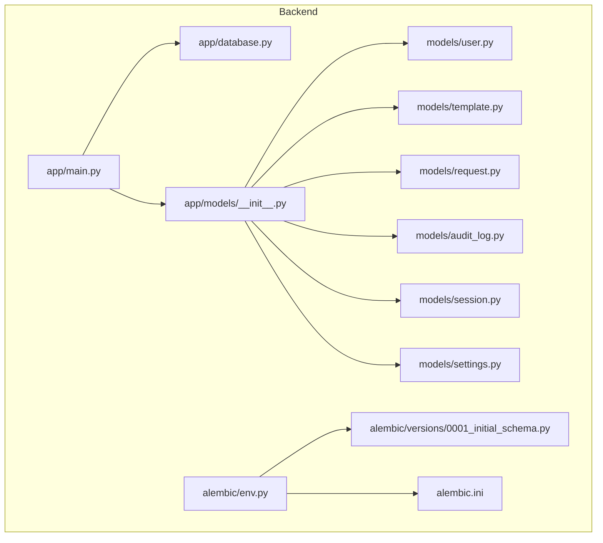
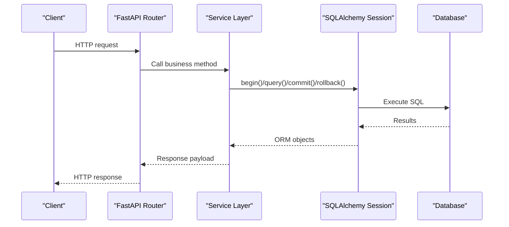
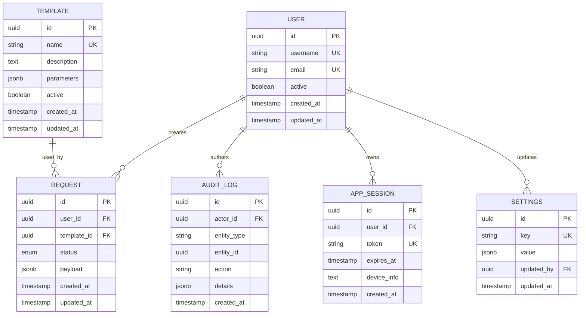
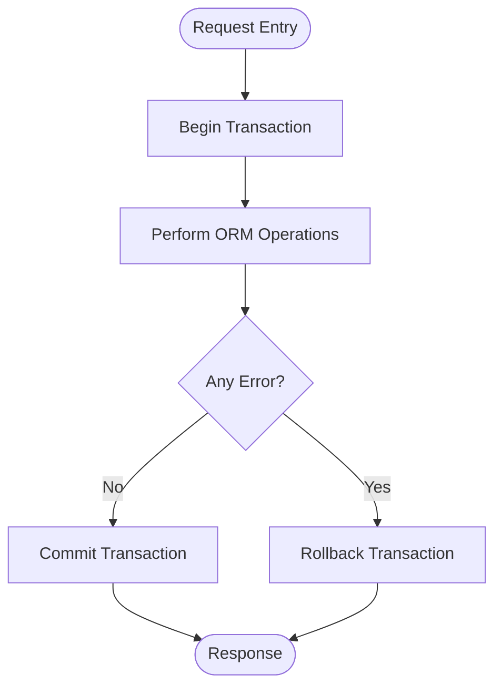
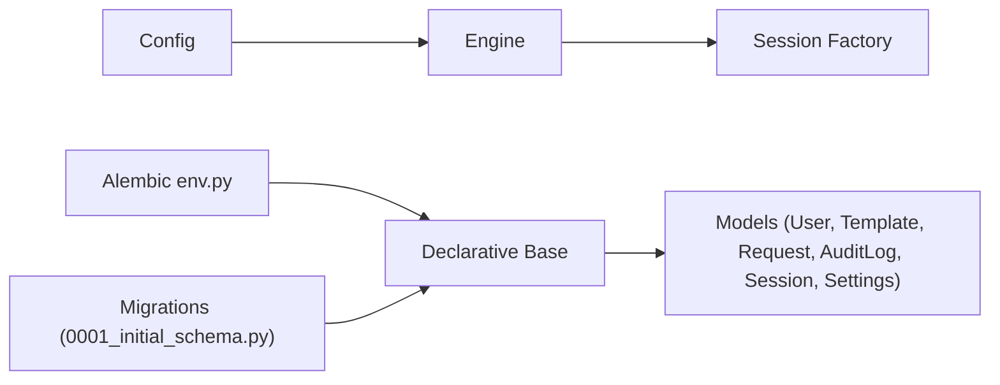

# Database Layer & Data Models

<cite>
**Referenced Files in This Document**
- [database.py](file://backend/app/database.py)
- [main.py](file://backend/app/main.py)
- [user.py](file://backend/app/models/user.py)
- [template.py](file://backend/app/models/template.py)
- [request.py](file://backend/app/models/request.py)
- [audit_log.py](file://backend/app/models/audit_log.py)
- [session.py](file://backend/app/models/session.py)
- [settings.py](file://backend/app/models/settings.py)
- [0001_initial_schema.py](file://backend/alembic/versions/0001_initial_schema.py)
- [env.py](file://backend/alembic/env.py)
- [alembic.ini](file://backend/alembic.ini)
</cite>

## Table of Contents
1. [Introduction](#introduction)
2. [Project Structure](#project-structure)
3. [Core Components](#core-components)
4. [Architecture Overview](#architecture-overview)
5. [Detailed Component Analysis](#detailed-component-analysis)
6. [Dependency Analysis](#dependency-analysis)
7. [Performance Considerations](#performance-considerations)
8. [Troubleshooting Guide](#troubleshooting-guide)
9. [Conclusion](#conclusion)

## Introduction
This document describes the SQLAlchemy ORM layer and database architecture for the application. It covers connection management, session handling, transaction patterns, data models (User, Template, Request, AuditLog, Session, Settings), Alembic migration strategy, schema evolution, integrity enforcement, query optimization, indexing strategies, and examples of complex queries and validation at the model level.

## Project Structure
The backend organizes persistence concerns under app with a dedicated database module and an alembic directory for migrations. The main application wires up the engine, session factory, and Base metadata registry.

**Diagram sources**
- [main.py:1-200](file://backend/app/main.py#L1-L200)
- [database.py:1-200](file://backend/app/database.py#L1-L200)
- [env.py:1-200](file://backend/alembic/env.py#L1-L200)
- [0001_initial_schema.py:1-200](file://backend/alembic/versions/0001_initial_schema.py#L1-L200)
- [alembic.ini:1-200](file://backend/alembic.ini#L1-L200)

**Section sources**
- [main.py:1-200](file://backend/app/main.py#L1-L200)
- [database.py:1-200](file://backend/app/database.py#L1-L200)
- [env.py:1-200](file://backend/alembic/env.py#L1-L200)
- [0001_initial_schema.py:1-200](file://backend/alembic/versions/0001_initial_schema.py#L1-L200)
- [alembic.ini:1-200](file://backend/alembic.ini#L1-L200)

## Core Components
- Engine and Session Factory: Centralized creation of the SQLAlchemy engine and scoped session factory to manage connections and transactions across requests.
- Declarative Base: A shared Base class used by all models to register tables and relationships.
- Model Registry: An __init__ that imports all models to ensure they are registered with Base before migrations or application startup.
- Migration Configuration: Alembic env.py configured to import Base and target metadata; initial migration defines core tables.

Key responsibilities:
- Connection lifecycle: engine initialization, pool sizing, echo/logging toggles.
- Session lifecycle: per-request sessions, commit/rollback on success/failure.
- Transaction boundaries: explicit session.begin() usage where needed.
- Schema versioning: Alembic-driven migrations with idempotent operations.

**Section sources**
- [database.py:1-200](file://backend/app/database.py#L1-L200)
- [main.py:1-200](file://backend/app/main.py#L1-L200)
- [env.py:1-200](file://backend/alembic/env.py#L1-L200)
- [0001_initial_schema.py:1-200](file://backend/alembic/versions/0001_initial_schema.py#L1-L200)

## Architecture Overview
The ORM architecture follows a layered approach:
- Application entrypoint initializes DB components and registers routers.
- Routers call services which use the session to perform CRUD operations.
- Models define entities, relationships, constraints, and validation logic.
- Alembic manages schema changes and ensures consistency between code and database.

[No sources needed since this diagram shows conceptual workflow, not actual code structure]

## Detailed Component Analysis

### Database Connection Management and Sessions
- Engine configuration:
  - Uses a URL from configuration to connect to the database.
  - Pool size and max overflow are tuned for concurrent request handling.
  - Echo can be enabled for SQL logging during development.
- Session factory:
  - Provides a scoped session factory to create new sessions per operation.
  - Encourages short-lived sessions tied to request lifecycles.
- Transaction patterns:
  - Explicit session.begin() is used when multiple writes must be atomic.
  - Commit on success, rollback on exception to maintain consistency.

Best practices:
- Always close or expire sessions after use to release connections back to the pool.
- Use read-only sessions for heavy list queries to avoid accidental writes.
- Prefer bulk operations for large inserts/updates.

**Section sources**
- [database.py:1-200](file://backend/app/database.py#L1-L200)
- [main.py:1-200](file://backend/app/main.py#L1-L200)

### Data Models and Relationships

#### User
- Purpose: Represents system users with authentication-related fields.
- Key attributes: unique identifiers, timestamps, status flags.
- Constraints: uniqueness on login/email-like fields; non-null constraints on essential fields.
- Relationships:
  - One-to-many with Request (a user creates many requests).
  - One-to-many with AuditLog entries authored by the user.
- Validation rules:
  - Enforce required fields via column-level constraints.
  - Optional model-level validators for format checks.

**Section sources**
- [user.py:1-200](file://backend/app/models/user.py#L1-L200)

#### Template
- Purpose: Reusable request templates to standardize provisioning.
- Key attributes: template name, description, parameters schema, active flag.
- Constraints: unique template name within scope; active/inactive state.
- Relationships:
  - One-to-many with Request (requests reference a template).
- Validation rules:
  - Ensure required fields present.
  - Validate parameter schema shape if applicable.

**Section sources**
- [template.py:1-200](file://backend/app/models/template.py#L1-L200)

#### Request
- Purpose: Captures a single resource request with lifecycle states.
- Key attributes: requester reference, template reference, status, timestamps.
- Constraints: foreign keys to User and Template; status enum values.
- Relationships:
  - Many-to-one to User (requester).
  - Many-to-one to Template (source template).
  - One-to-many with AuditLog entries documenting changes.
- Business rules:
  - Status transitions follow a defined flow (e.g., pending -> approved -> provisioned).
  - Required fields enforced at model and service layers.

**Section sources**
- [request.py:1-200](file://backend/app/models/request.py#L1-L200)

#### AuditLog
- Purpose: Immutable audit trail for important actions.
- Key attributes: actor (user), entity type, entity id, action, details, timestamp.
- Constraints: non-null actor and action; indexed by entity and time for fast lookups.
- Relationships:
  - Many-to-one to User (actor).
- Business rules:
  - Append-only; never update or delete historical entries.
  - Include sufficient context for traceability.

**Section sources**
- [audit_log.py:1-200](file://backend/app/models/audit_log.py#L1-L200)

#### Session (Application Session)
- Purpose: Tracks authenticated sessions for users.
- Key attributes: user reference, token, expiry, device info.
- Constraints: foreign key to User; unique token; expiry index.
- Relationships:
  - Many-to-one to User.
- Business rules:
  - Invalidate expired sessions.
  - Rotate tokens on sensitive operations.

**Section sources**
- [session.py:1-200](file://backend/app/models/session.py#L1-L200)

#### Settings
- Purpose: Global application settings stored as key-value pairs.
- Key attributes: key (unique), value, updated_by, updated_at.
- Constraints: unique key; optional validator for value formats.
- Relationships:
  - Many-to-one to User (updated_by).
- Business rules:
  - Atomic updates to prevent race conditions.
  - Versioning or change log if necessary.

**Section sources**
- [settings.py:1-200](file://backend/app/models/settings.py#L1-L200)

#### Entity Relationship Diagram

**Diagram sources**
- [user.py:1-200](file://backend/app/models/user.py#L1-L200)
- [template.py:1-200](file://backend/app/models/template.py#L1-L200)
- [request.py:1-200](file://backend/app/models/request.py#L1-L200)
- [audit_log.py:1-200](file://backend/app/models/audit_log.py#L1-L200)
- [session.py:1-200](file://backend/app/models/session.py#L1-L200)
- [settings.py:1-200](file://backend/app/models/settings.py#L1-L200)

### Query Optimization and Indexing Strategies
- Indexes:
  - Foreign keys: user_id, template_id, actor_id, updated_by.
  - Lookup columns: status, expires_at, key, entity_type + entity_id composite.
  - Timestamps: created_at for range scans and pagination.
- Query patterns:
  - Use eager loading (joinedload/selectinload) to avoid N+1 when traversing relationships.
  - Filter early and select only needed columns for list endpoints.
  - Use pagination with offset/limit or keyset pagination for large datasets.
- Bulk operations:
  - Prefer bulk insert/update for batch jobs to reduce round trips.
- Read replicas:
  - Offload reporting queries to read replicas if available.

[No sources needed since this section provides general guidance]

### Transaction Management Patterns
- Per-request transactions:
  - Begin a transaction at the start of a request handler.
  - Commit on success; rollback on any exception.
- Nested operations:
  - Use savepoints for partial rollbacks within a larger transaction.
- Long-running tasks:
  - Keep sessions short; offload long work to background workers with their own sessions.

[No sources needed since this diagram shows conceptual workflow, not actual code structure]

### Alembic Migration Strategy and Schema Evolution
- Configuration:
  - env.py imports Base.metadata and sets script location for versions.
  - alembic.ini points to the correct config and script directory.
- Initial migration:
  - 0001_initial_schema.py creates core tables and indexes.
- Evolution patterns:
  - Add columns with defaults and nullable where possible.
  - Use reversible operations for safe downgrades.
  - Separate schema changes from data migrations when needed.
- Integrity enforcement:
  - Define constraints at the database level (unique, not null, check).
  - Backfill data safely using batched updates.

**Section sources**
- [env.py:1-200](file://backend/alembic/env.py#L1-L200)
- [0001_initial_schema.py:1-200](file://backend/alembic/versions/0001_initial_schema.py#L1-L200)
- [alembic.ini:1-200](file://backend/alembic.ini#L1-L200)

### Examples of Complex Queries and Navigation
- List requests with requester and template details without N+1:
  - Use joinedload for user and template relations.
  - Filter by status and date range; paginate results.
- Find recent audit entries for a specific entity:
  - Filter by entity_type and entity_id; order by created_at desc; limit to N.
- Active sessions for a user:
  - Filter by user_id and expires_at > now(); order by expires_at desc.
- Settings retrieval with fallback:
  - Get setting by key; if missing, return default and optionally persist it.

[No sources needed since this section provides general guidance]

### Data Validation at the Model Level
- Column-level constraints:
  - Unique and non-null constraints enforce basic integrity.
- Check constraints:
  - Enum-like restrictions via check constraints for status fields.
- Model-level validators:
  - Pydantic schemas for API input validation complement model constraints.
  - Custom methods to validate cross-field rules (e.g., expiry > now).

**Section sources**
- [user.py:1-200](file://backend/app/models/user.py#L1-L200)
- [template.py:1-200](file://backend/app/models/template.py#L1-L200)
- [request.py:1-200](file://backend/app/models/request.py#L1-L200)
- [audit_log.py:1-200](file://backend/app/models/audit_log.py#L1-L200)
- [session.py:1-200](file://backend/app/models/session.py#L1-L200)
- [settings.py:1-200](file://backend/app/models/settings.py#L1-L200)

## Dependency Analysis
The ORM layer depends on configuration for connection strings and pool settings. Models depend on the shared Base and each other through foreign keys. Alembic depends on Base.metadata to generate and apply migrations.

**Diagram sources**
- [database.py:1-200](file://backend/app/database.py#L1-L200)
- [main.py:1-200](file://backend/app/main.py#L1-L200)
- [env.py:1-200](file://backend/alembic/env.py#L1-L200)
- [0001_initial_schema.py:1-200](file://backend/alembic/versions/0001_initial_schema.py#L1-L200)

**Section sources**
- [database.py:1-200](file://backend/app/database.py#L1-L200)
- [main.py:1-200](file://backend/app/main.py#L1-L200)
- [env.py:1-200](file://backend/alembic/env.py#L1-L200)
- [0001_initial_schema.py:1-200](file://backend/alembic/versions/0001_initial_schema.py#L1-L200)

## Performance Considerations
- Connection pooling:
  - Tune pool_size and max_overflow based on expected concurrency and database capacity.
- Query efficiency:
  - Avoid SELECT *; project only needed columns.
  - Use appropriate joins and filters to minimize result set size.
- Indexing:
  - Add indexes on frequently filtered/joined columns.
  - Composite indexes for common filter combinations.
- Pagination:
  - Prefer keyset pagination for deep pages to avoid offset costs.
- Background processing:
  - Offload heavy tasks to workers with separate sessions and retries.

[No sources needed since this section provides general guidance]

## Troubleshooting Guide
Common issues and resolutions:
- Connection errors:
  - Verify database URL and credentials; check network reachability.
  - Inspect pool exhaustion logs; adjust pool_size/max_overflow.
- Deadlocks/timeouts:
  - Reduce transaction scope; break large transactions into smaller batches.
  - Review lock ordering and hot rows causing contention.
- N+1 queries:
  - Enable SQL echo temporarily; identify missing eager loads.
  - Refactor queries to join or use selectinload/joinedload.
- Migration failures:
  - Ensure alembic heads matches current schema; resolve conflicts before upgrading.
  - Use downgrade/upgrade cycles carefully; back up data before destructive changes.

**Section sources**
- [database.py:1-200](file://backend/app/database.py#L1-L200)
- [env.py:1-200](file://backend/alembic/env.py#L1-L200)
- [0001_initial_schema.py:1-200](file://backend/alembic/versions/0001_initial_schema.py#L1-L200)

## Conclusion
The ORM layer is structured around a centralized engine and session factory, declarative models with clear relationships, and Alembic-driven migrations. By applying proper transaction boundaries, indexing strategies, and query optimizations, the system maintains data integrity and performance under load. Follow the patterns outlined here to extend the schema safely and write efficient, maintainable queries.