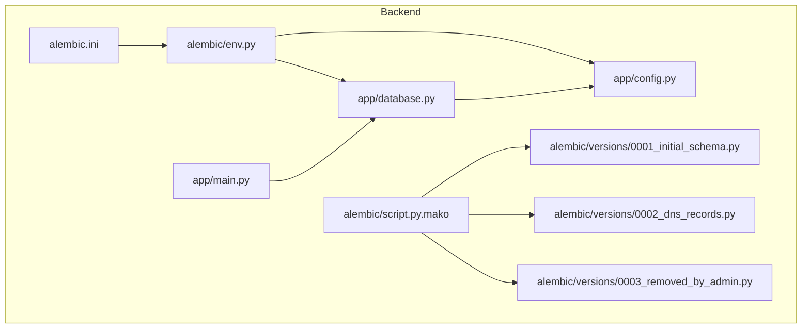
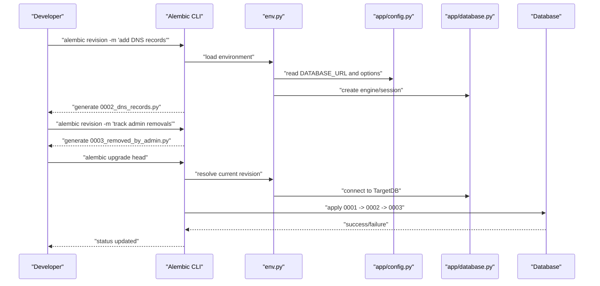
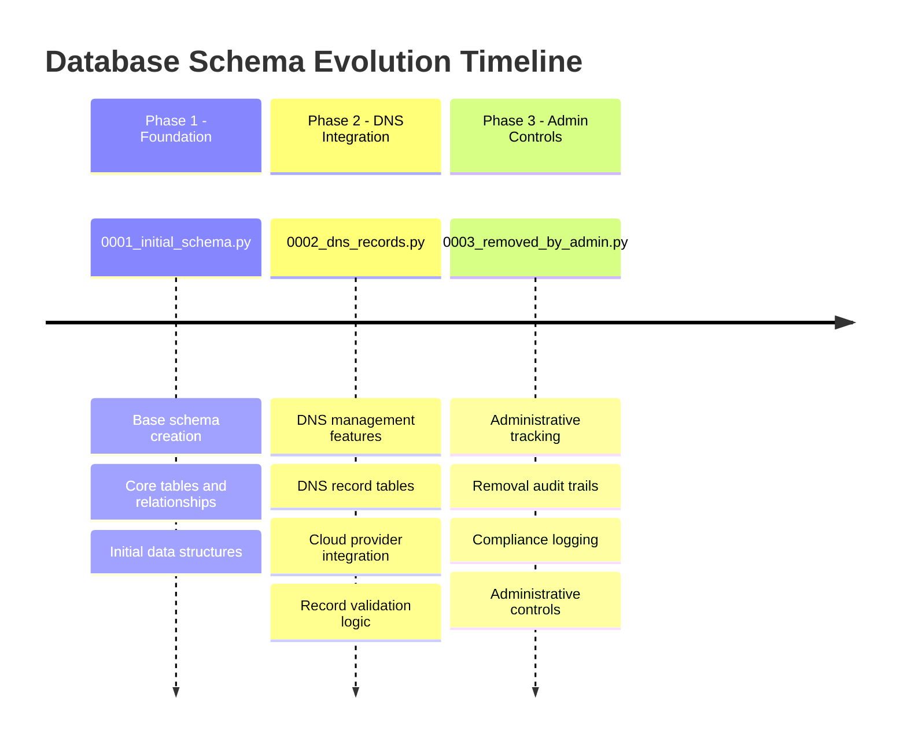
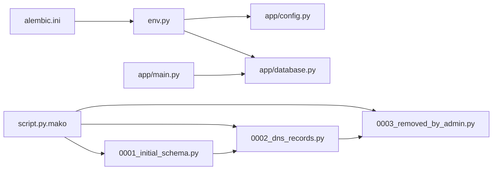

# Database Migrations & Schema Evolution

<cite>
**Referenced Files in This Document**
- [alembic.ini](file://backend/alembic.ini)
- [env.py](file://backend/alembic/env.py)
- [script.py.mako](file://backend/alembic/script.py.mako)
- [0001_initial_schema.py](file://backend/alembic/versions/0001_initial_schema.py)
- [0002_dns_records.py](file://backend/alembic/versions/0002_dns_records.py)
- [0003_removed_by_admin.py](file://backend/alembic/versions/0003_removed_by_admin.py)
- [database.py](file://backend/app/database.py)
- [config.py](file://backend/app/config.py)
- [main.py](file://backend/app/main.py)
</cite>

## Update Summary
**Changes Made**
- Updated project structure section to reflect three migration files instead of one
- Added detailed analysis of DNS records management migration (0002_dns_records.py)
- Added detailed analysis of admin removal tracking migration (0003_removed_by_admin.py)
- Enhanced migration workflow examples to include multiple migration scenarios
- Updated dependency analysis diagram to show all three migrations
- Expanded production deployment checklist for multi-migration environments

## Table of Contents
1. [Introduction](#introduction)
2. [Project Structure](#project-structure)
3. [Core Components](#core-components)
4. [Architecture Overview](#architecture-overview)
5. [Detailed Component Analysis](#detailed-component-analysis)
6. [Migration Evolution Timeline](#migration-evolution-timeline)
7. [Dependency Analysis](#dependency-analysis)
8. [Performance Considerations](#performance-considerations)
9. [Troubleshooting Guide](#troubleshooting-guide)
10. [Conclusion](#conclusion)
11. [Appendices](#appendices)

## Introduction
This document explains the database migration strategy and schema evolution process for the project using Alembic. It covers how migrations are structured, how versions are tracked, rollback procedures, environment configuration, script templates, and end-to-end workflows for generating and applying migrations safely in development and production environments. The system now supports multiple sequential migrations including initial schema setup, DNS records management, and admin removal tracking capabilities.

## Project Structure
The migration tooling is located under backend/alembic with three progressive migration files and standard Alembic configuration files. The application's database connection and settings are configured in the app layer and consumed by Alembic at runtime.

**Diagram sources**
- [alembic.ini:1-200](file://backend/alembic.ini#L1-L200)
- [env.py:1-200](file://backend/alembic/env.py#L1-L200)
- [script.py.mako:1-200](file://backend/alembic/script.py.mako#L1-L200)
- [0001_initial_schema.py:1-200](file://backend/alembic/versions/0001_initial_schema.py#L1-L200)
- [0002_dns_records.py:1-200](file://backend/alembic/versions/0002_dns_records.py#L1-L200)
- [0003_removed_by_admin.py:1-200](file://backend/alembic/versions/0003_removed_by_admin.py#L1-L200)
- [database.py:1-200](file://backend/app/database.py#L1-L200)
- [config.py:1-200](file://backend/app/config.py#L1-L200)
- [main.py:1-200](file://backend/app/main.py#L1-L200)

**Section sources**
- [alembic.ini:1-200](file://backend/alembic.ini#L1-L200)
- [env.py:1-200](file://backend/alembic/env.py#L1-L200)
- [script.py.mako:1-200](file://backend/alembic/script.py.mako#L1-L200)
- [0001_initial_schema.py:1-200](file://backend/alembic/versions/0001_initial_schema.py#L1-L200)
- [0002_dns_records.py:1-200](file://backend/alembic/versions/0002_dns_records.py#L1-L200)
- [0003_removed_by_admin.py:1-200](file://backend/alembic/versions/0003_removed_by_admin.py#L1-L200)
- [database.py:1-200](file://backend/app/database.py#L1-L200)
- [config.py:1-200](file://backend/app/config.py#L1-L200)
- [main.py:1-200](file://backend/app/main.py#L1-L200)

## Core Components
- alembic.ini: Central configuration for Alembic including the target database URL, script locations, and upgrade/downgrade behavior.
- env.py: Runtime environment loader that resolves the SQLAlchemy engine from application config and executes migrations within an isolated context.
- script.py.mako: Template used to generate new migration files; can be customized to include imports or boilerplate.
- versions/0001_initial_schema.py: First migration defining the initial schema foundation.
- versions/0002_dns_records.py: Second migration adding DNS records management capabilities.
- versions/0003_removed_by_admin.py: Third migration implementing admin removal tracking functionality.
- app/database.py: Provides the SQLAlchemy engine and session factory used by both the application and Alembic.
- app/config.py: Loads database credentials and other settings from environment variables.
- app/main.py: Application entry point that wires dependencies and may trigger startup tasks (e.g., health checks).

Key responsibilities:
- Configuration resolution: env.py reads database URLs and options from app.config and passes them to Alembic.
- Migration execution: Alembic uses the engine provided by env.py to apply versioned changes sequentially.
- Version tracking: Alembic maintains a metadata table to track applied revisions across all three migrations.

**Section sources**
- [alembic.ini:1-200](file://backend/alembic.ini#L1-L200)
- [env.py:1-200](file://backend/alembic/env.py#L1-L200)
- [script.py.mako:1-200](file://backend/alembic/script.py.mako#L1-L200)
- [0001_initial_schema.py:1-200](file://backend/alembic/versions/0001_initial_schema.py#L1-L200)
- [0002_dns_records.py:1-200](file://backend/alembic/versions/0002_dns_records.py#L1-L200)
- [0003_removed_by_admin.py:1-200](file://backend/alembic/versions/0003_removed_by_admin.py#L1-L200)
- [database.py:1-200](file://backend/app/database.py#L1-L200)
- [config.py:1-200](file://backend/app/config.py#L1-L200)
- [main.py:1-200](file://backend/app/main.py#L1-L200)

## Architecture Overview
Alembic integrates with the application's database configuration to execute migrations against the same database used by the service, supporting sequential application of multiple schema changes.

**Diagram sources**
- [env.py:1-200](file://backend/alembic/env.py#L1-L200)
- [config.py:1-200](file://backend/app/config.py#L1-L200)
- [database.py:1-200](file://backend/app/database.py#L1-L200)

## Detailed Component Analysis

### Alembic Configuration (alembic.ini)
- Purpose: Defines the migration script directory, target database URL, and upgrade/downgrade behavior.
- Key aspects:
  - Script location points to backend/alembic.
  - Database URL is typically sourced from environment variables via env.py or directly here.
  - Upgrade targets and downgrade strategies are controlled by commands and flags.

Best practices:
- Keep secrets out of version control; use environment variables.
- Pin Alembic and SQLAlchemy versions for reproducibility.

**Section sources**
- [alembic.ini:1-200](file://backend/alembic.ini#L1-L200)

### Environment Loader (env.py)
- Purpose: Bridges Alembic with the application's database configuration.
- Responsibilities:
  - Import app configuration and resolve the database URL.
  - Create the SQLAlchemy engine and configure logging.
  - Provide the MetaData object and run migrations within a transactional context where supported.

Operational notes:
- Ensure the engine is created with appropriate pool settings and timeouts for CI and production.
- Use offline mode only when generating SQL without connecting to a live database.

**Section sources**
- [env.py:1-200](file://backend/alembic/env.py#L1-L200)
- [config.py:1-200](file://backend/app/config.py#L1-L200)
- [database.py:1-200](file://backend/app/database.py#L1-L200)

### Script Template (script.py.mako)
- Purpose: Customizes the boilerplate generated by alembic revision.
- Typical customizations:
  - Include common imports (e.g., models, helpers).
  - Add pre/post hooks or comments guiding safe changes.

Usage:
- Modify this template once to standardize all future migrations.

**Section sources**
- [script.py.mako:1-200](file://backend/alembic/script.py.mako#L1-L200)

### Initial Migration (0001_initial_schema.py)
- Purpose: Establishes the baseline schema for the application.
- Contains:
  - Up() function to create tables and constraints.
  - Down() function to reverse changes.

Guidelines:
- Keep idempotent operations where possible.
- Avoid destructive changes in Down() if data must be preserved.

**Section sources**
- [0001_initial_schema.py:1-200](file://backend/alembic/versions/0001_initial_schema.py#L1-L200)

### DNS Records Management Migration (0002_dns_records.py)
- Purpose: Adds DNS records management capabilities to the database schema.
- Contains:
  - Up() function to create DNS-related tables and relationships.
  - Down() function to remove DNS records infrastructure.

Features:
- DNS record storage and management
- Integration with cloud DNS providers
- Record validation and lifecycle management

**Updated** Added comprehensive DNS records management functionality

**Section sources**
- [0002_dns_records.py:1-200](file://backend/alembic/versions/0002_dns_records.py#L1-L200)

### Admin Removal Tracking Migration (0003_removed_by_admin.py)
- Purpose: Implements administrative removal tracking for audit and compliance purposes.
- Contains:
  - Up() function to add removal tracking fields and audit trails.
  - Down() function to remove tracking columns while preserving data integrity.

Features:
- Administrative action logging
- User removal history tracking
- Audit trail maintenance for compliance

**Updated** Added administrative removal tracking and audit capabilities

**Section sources**
- [0003_removed_by_admin.py:1-200](file://backend/alembic/versions/0003_removed_by_admin.py#L1-L200)

### Database Layer (app/database.py)
- Purpose: Creates and exposes the SQLAlchemy engine and session factory.
- Responsibilities:
  - Build engine from configuration.
  - Provide session-scoped connections.
  - Optionally set pool size, timeout, and echo/logging.

Integration with Alembic:
- env.py consumes this module to obtain a working engine for migrations.

**Section sources**
- [database.py:1-200](file://backend/app/database.py#L1-L200)

### Configuration (app/config.py)
- Purpose: Loads environment-based settings such as database URL, pool sizes, and feature flags.
- Integration:
  - env.py reads these values to construct the engine.
  - main.py may read these values to initialize the application.

Security:
- Never commit secrets; rely on environment injection at runtime.

**Section sources**
- [config.py:1-200](file://backend/app/config.py#L1-L200)

### Application Entry Point (app/main.py)
- Purpose: Wires application components and may perform startup tasks.
- Relevance to migrations:
  - Does not typically run migrations automatically; migrations should be executed explicitly during deployment.
  - Health checks and readiness probes should verify database connectivity post-migration.

**Section sources**
- [main.py:1-200](file://backend/app/main.py#L1-L200)

## Migration Evolution Timeline
The project has evolved through three distinct migration phases, each building upon the previous schema foundation.

**Diagram sources**
- [0001_initial_schema.py:1-200](file://backend/alembic/versions/0001_initial_schema.py#L1-L200)
- [0002_dns_records.py:1-200](file://backend/alembic/versions/0002_dns_records.py#L1-L200)
- [0003_removed_by_admin.py:1-200](file://backend/alembic/versions/0003_removed_by_admin.py#L1-L200)

## Dependency Analysis
The following diagram shows how Alembic depends on application configuration and database modules, with clear separation between the three migration phases.

**Diagram sources**
- [alembic.ini:1-200](file://backend/alembic.ini#L1-L200)
- [env.py:1-200](file://backend/alembic/env.py#L1-L200)
- [config.py:1-200](file://backend/app/config.py#L1-L200)
- [database.py:1-200](file://backend/app/database.py#L1-L200)
- [script.py.mako:1-200](file://backend/alembic/script.py.mako#L1-L200)
- [0001_initial_schema.py:1-200](file://backend/alembic/versions/0001_initial_schema.py#L1-L200)
- [0002_dns_records.py:1-200](file://backend/alembic/versions/0002_dns_records.py#L1-L200)
- [0003_removed_by_admin.py:1-200](file://backend/alembic/versions/0003_removed_by_admin.py#L1-L200)
- [main.py:1-200](file://backend/app/main.py#L1-L200)

**Section sources**
- [alembic.ini:1-200](file://backend/alembic.ini#L1-L200)
- [env.py:1-200](file://backend/alembic/env.py#L1-L200)
- [config.py:1-200](file://backend/app/config.py#L1-L200)
- [database.py:1-200](file://backend/app/database.py#L1-L200)
- [script.py.mako:1-200](file://backend/alembic/script.py.mako#L1-L200)
- [0001_initial_schema.py:1-200](file://backend/alembic/versions/0001_initial_schema.py#L1-L200)
- [0002_dns_records.py:1-200](file://backend/alembic/versions/0002_dns_records.py#L1-L200)
- [0003_removed_by_admin.py:1-200](file://backend/alembic/versions/0003_removed_by_admin.py#L1-L200)
- [main.py:1-200](file://backend/app/main.py#L1-L200)

## Performance Considerations
- Connection pooling: Tune pool size and timeouts in the database engine to handle concurrent migration runs and application load.
- Large migrations: Split large schema changes into multiple small, focused migrations to reduce lock times and improve reliability.
- Offline mode: For CI pipelines, prefer offline generation to avoid connecting to databases during code generation.
- Index management: Add indexes incrementally and consider online index creation strategies supported by your database.
- Multi-migration optimization: With three sequential migrations, ensure each migration is optimized to minimize downtime during upgrades.

## Troubleshooting Guide
Common issues and resolutions:
- Missing or incorrect DATABASE_URL:
  - Verify environment variables and ensure env.py reads them correctly.
- Conflicting migrations:
  - Check current revision and history; do not edit already-applied migrations.
- Lock contention:
  - Run migrations during low-traffic windows; use non-blocking operations where possible.
- Rollback failures:
  - Ensure Down() functions are correct; if necessary, write manual recovery scripts instead of relying solely on Down().
- Multi-migration rollback issues:
  - When rolling back from 0003 to 0001, ensure intermediate migrations have proper Down() implementations.
  - Test rollback paths for each migration individually before attempting full rollbacks.

Operational tips:
- Always test migrations against a staging database mirroring production.
- Use explicit alembic stamp or downgrade only when you understand the implications.
- For multi-migration environments, test upgrade and downgrade paths between specific versions.

**Section sources**
- [env.py:1-200](file://backend/alembic/env.py#L1-L200)
- [0001_initial_schema.py:1-200](file://backend/alembic/versions/0001_initial_schema.py#L1-L200)
- [0002_dns_records.py:1-200](file://backend/alembic/versions/0002_dns_records.py#L1-L200)
- [0003_removed_by_admin.py:1-200](file://backend/alembic/versions/0003_removed_by_admin.py#L1-L200)

## Conclusion
Alembic provides a robust framework for evolving the database schema alongside application code. By centralizing configuration in env.py and config.py, standardizing migration templates, and following disciplined workflows for generation, review, and deployment, teams can maintain reliable, reversible, and safe schema changes across environments. The current three-migration architecture demonstrates progressive enhancement from basic schema to advanced DNS management and administrative controls.

## Appendices

### Workflow: Creating a New Migration
- Generate a migration:
  - Command: alembic revision -m "short description"
  - Result: A new file under versions/ with Up() and Down() stubs.
- Implement changes:
  - Add schema modifications in Up().
  - Provide corresponding Down() logic to revert changes.
- Validate locally:
  - Apply to a local or CI database: alembic upgrade head
  - Test rollback: alembic downgrade -1
- Commit and deploy:
  - Push migration file to version control.
  - Apply in staging and then production using alembic upgrade head.

**Section sources**
- [script.py.mako:1-200](file://backend/alembic/script.py.mako#L1-L200)
- [0001_initial_schema.py:1-200](file://backend/alembic/versions/0001_initial_schema.py#L1-L200)
- [0002_dns_records.py:1-200](file://backend/alembic/versions/0002_dns_records.py#L1-L200)
- [0003_removed_by_admin.py:1-200](file://backend/alembic/versions/0003_removed_by_admin.py#L1-L200)

### Production Deployment Checklist
- Pre-deploy:
  - Back up the database or enable snapshots.
  - Review migration diffs and ensure Down() paths are safe.
  - Test all three migrations in staging environment.
- Deploy:
  - Run alembic upgrade head before starting the application.
  - Monitor logs for errors and long-running operations.
  - Verify DNS records functionality after 0002 migration.
  - Confirm admin removal tracking works after 0003 migration.
- Post-deploy:
  - Verify application health and key features.
  - Confirm no unexpected locks or performance regressions.
  - Test DNS record creation and deletion workflows.
  - Validate administrative removal audit trails.

**Section sources**
- [alembic.ini:1-200](file://backend/alembic.ini#L1-L200)
- [env.py:1-200](file://backend/alembic/env.py#L1-L200)
- [database.py:1-200](file://backend/app/database.py#L1-L200)
- [0002_dns_records.py:1-200](file://backend/alembic/versions/0002_dns_records.py#L1-L200)
- [0003_removed_by_admin.py:1-200](file://backend/alembic/versions/0003_removed_by_admin.py#L1-L200)

### Best Practices for Safe Schema Evolution
- Small, incremental changes:
  - Prefer additive changes (new columns, tables) over destructive ones.
- Data safety:
  - Preserve existing data; avoid dropping columns or constraints without migration plans.
- Idempotency:
  - Where possible, make operations safe to re-run or guard with conditional checks.
- Testing:
  - Test migrations against realistic data volumes in staging.
  - Automate migration tests in CI.
- Rollback planning:
  - Document manual recovery steps if Down() cannot fully restore state.
- Multi-migration coordination:
  - Ensure each migration builds properly on previous ones.
  - Test upgrade paths from any version to the latest.
  - Validate rollback sequences work correctly.

### Migration-Specific Guidelines

#### DNS Records Migration (0002_dns_records.py)
- Ensure DNS provider credentials are properly secured.
- Test DNS record creation and deletion thoroughly.
- Implement proper error handling for DNS API failures.
- Consider rate limiting and retry logic for DNS operations.

#### Admin Removal Tracking Migration (0003_removed_by_admin.py)
- Maintain audit trail integrity and immutability.
- Ensure proper authorization checks for administrative actions.
- Implement data retention policies for audit logs.
- Consider privacy implications of tracking administrative actions.

**Section sources**
- [0002_dns_records.py:1-200](file://backend/alembic/versions/0002_dns_records.py#L1-L200)
- [0003_removed_by_admin.py:1-200](file://backend/alembic/versions/0003_removed_by_admin.py#L1-L200)