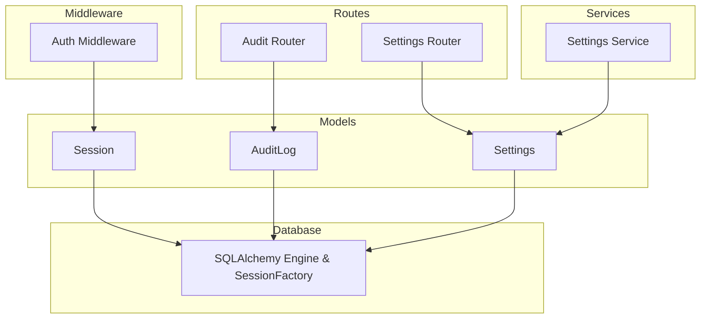
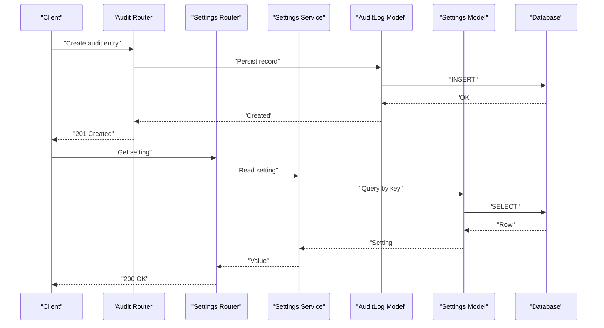
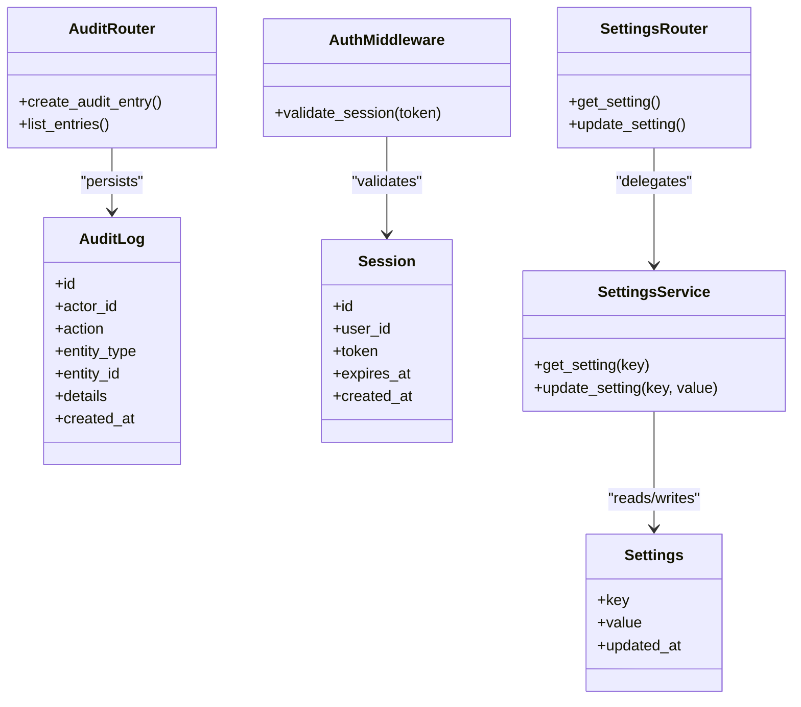
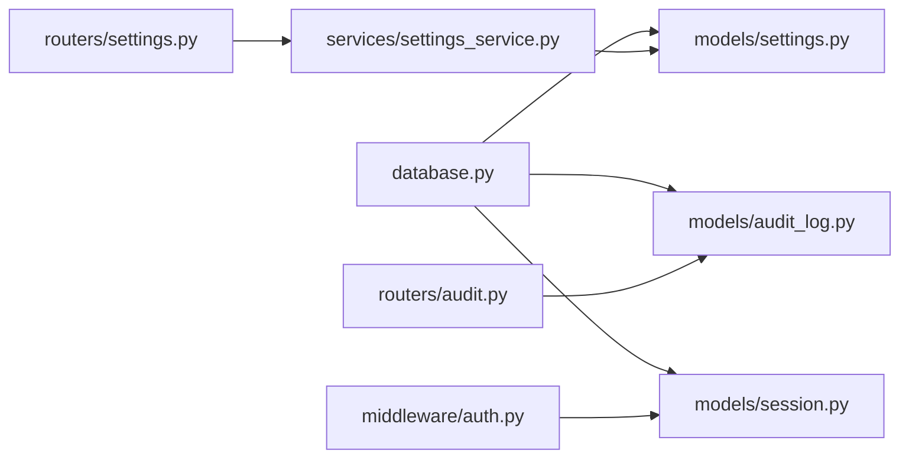

# System Data Models

<cite>
**Referenced Files in This Document**
- [audit_log.py](file://backend/app/models/audit_log.py)
- [session.py](file://backend/app/models/session.py)
- [settings.py](file://backend/app/models/settings.py)
- [audit.py](file://backend/app/routers/audit.py)
- [settings.py](file://backend/app/routers/settings.py)
- [settings_service.py](file://backend/app/services/settings_service.py)
- [auth.py](file://backend/app/middleware/auth.py)
- [database.py](file://backend/app/database.py)
- [0001_initial_schema.py](file://backend/alembic/versions/0001_initial_schema.py)
</cite>

## Table of Contents
1. [Introduction](#introduction)
2. [Project Structure](#project-structure)
3. [Core Components](#core-components)
4. [Architecture Overview](#architecture-overview)
5. [Detailed Component Analysis](#detailed-component-analysis)
6. [Dependency Analysis](#dependency-analysis)
7. [Performance Considerations](#performance-considerations)
8. [Troubleshooting Guide](#troubleshooting-guide)
9. [Conclusion](#conclusion)

## Introduction
This document describes the system-level data models that underpin application infrastructure, security, and configuration management: AuditLog, Session, and Settings. It explains how these entities support audit trails, session persistence, and centralized settings storage. It also provides examples of logging operations, session management, and configuration access patterns, along with guidance on data retention policies and security considerations for sensitive information.

## Project Structure
The relevant backend components are organized as follows:
- Data models: audit_log.py, session.py, settings.py
- API routes: routers/audit.py, routers/settings.py
- Services: services/settings_service.py
- Middleware: middleware/auth.py (uses sessions)
- Database layer: database.py (engine, session factory)
- Schema migrations: alembic/versions/0001_initial_schema.py

**Diagram sources**
- [audit_log.py](file://backend/app/models/audit_log.py)
- [session.py](file://backend/app/models/session.py)
- [settings.py](file://backend/app/models/settings.py)
- [audit.py](file://backend/app/routers/audit.py)
- [settings.py](file://backend/app/routers/settings.py)
- [settings_service.py](file://backend/app/services/settings_service.py)
- [auth.py](file://backend/app/middleware/auth.py)
- [database.py](file://backend/app/database.py)

**Section sources**
- [audit_log.py](file://backend/app/models/audit_log.py)
- [session.py](file://backend/app/models/session.py)
- [settings.py](file://backend/app/models/settings.py)
- [audit.py](file://backend/app/routers/audit.py)
- [settings.py](file://backend/app/routers/settings.py)
- [settings_service.py](file://backend/app/services/settings_service.py)
- [auth.py](file://backend/app/middleware/auth.py)
- [database.py](file://backend/app/database.py)
- [0001_initial_schema.py](file://backend/alembic/versions/0001_initial_schema.py)

## Core Components
- AuditLog: Captures immutable records of important actions for compliance and troubleshooting.
- Session: Represents authenticated user sessions used by authentication middleware to enforce access control.
- Settings: Centralized key-value store for application configuration, including feature flags and runtime parameters.

These models integrate with the database layer via SQLAlchemy and are exposed through dedicated API routes and services.

**Section sources**
- [audit_log.py](file://backend/app/models/audit_log.py)
- [session.py](file://backend/app/models/session.py)
- [settings.py](file://backend/app/models/settings.py)
- [database.py](file://backend/app/database.py)

## Architecture Overview
The following diagram shows how requests flow through routes, services, and models to persist or retrieve data from the database.

**Diagram sources**
- [audit.py](file://backend/app/routers/audit.py)
- [settings.py](file://backend/app/routers/settings.py)
- [settings_service.py](file://backend/app/services/settings_service.py)
- [audit_log.py](file://backend/app/models/audit_log.py)
- [settings.py](file://backend/app/models/settings.py)
- [database.py](file://backend/app/database.py)

## Detailed Component Analysis

### AuditLog Model
Purpose:
- Provides an immutable audit trail for critical operations such as resource provisioning, approvals, and administrative changes.
- Supports querying by actor, action, entity type, and timestamps for compliance and incident response.

Key responsibilities:
- Persist structured event records with metadata.
- Enable efficient filtering and pagination for admin interfaces.

Example usage patterns:
- Logging a successful ECS instance creation:
  - Route handler receives confirmation from the cloud service.
  - Calls the model to insert an audit record with actor, action, entity type, and details.
- Querying recent audit entries:
  - Admin route fetches paginated results ordered by timestamp.

Security considerations:
- Ensure only authorized roles can write audit records.
- Avoid storing secrets; include minimal contextual details.

Data retention policy:
- Implement periodic archival or deletion of old entries based on retention windows.
- Consider partitioning or indexing strategies for large volumes.

**Section sources**
- [audit_log.py](file://backend/app/models/audit_log.py)
- [audit.py](file://backend/app/routers/audit.py)
- [0001_initial_schema.py](file://backend/alembic/versions/0001_initial_schema.py)

### Session Model
Purpose:
- Stores authenticated sessions to maintain user state across requests.
- Used by authentication middleware to validate active sessions and enforce authorization.

Key responsibilities:
- Create, read, update, and expire sessions.
- Associate sessions with users and track expiration times.

Example usage patterns:
- Login flow:
  - On successful authentication, create a session record with an identifier and expiry.
  - Return the session token to the client.
- Middleware enforcement:
  - For protected endpoints, look up the session by token and reject expired or invalid sessions.

Security considerations:
- Store only non-sensitive identifiers; avoid embedding credentials.
- Enforce short lifetimes and rotation where appropriate.
- Secure transport (HTTPS) and secure cookie attributes if using cookies.

Data retention policy:
- Purge expired sessions regularly to prevent unbounded growth.
- Consider TTL-based cleanup jobs.

**Section sources**
- [session.py](file://backend/app/models/session.py)
- [auth.py](file://backend/app/middleware/auth.py)
- [0001_initial_schema.py](file://backend/alembic/versions/0001_initial_schema.py)

### Settings Model
Purpose:
- Centralizes application configuration in a persistent key-value store.
- Enables dynamic updates without redeployments for feature toggles and operational parameters.

Key responsibilities:
- CRUD operations for settings keys and values.
- Provide typed or validated accessors via a service layer.

Example usage patterns:
- Reading a feature flag:
  - Settings router delegates to the settings service, which queries the model by key.
- Updating a setting:
  - Admin route writes a new value after validation and permission checks.

Security considerations:
- Restrict write access to administrators.
- Avoid storing secrets directly; prefer references to secret stores when necessary.
- Validate and sanitize inputs to prevent injection or schema drift.

Data retention policy:
- Maintain a single current value per key; keep history separately if required for auditing.

**Section sources**
- [settings.py](file://backend/app/models/settings.py)
- [settings.py](file://backend/app/routers/settings.py)
- [settings_service.py](file://backend/app/services/settings_service.py)
- [0001_initial_schema.py](file://backend/alembic/versions/0001_initial_schema.py)

### Class Diagram

**Diagram sources**
- [audit_log.py](file://backend/app/models/audit_log.py)
- [session.py](file://backend/app/models/session.py)
- [settings.py](file://backend/app/models/settings.py)
- [auth.py](file://backend/app/middleware/auth.py)
- [settings_service.py](file://backend/app/services/settings_service.py)
- [audit.py](file://backend/app/routers/audit.py)
- [settings.py](file://backend/app/routers/settings.py)

## Dependency Analysis
- Models depend on the database layer for persistence.
- Routes depend on models and services to handle HTTP requests.
- Middleware depends on the Session model to enforce authentication.
- The Settings service encapsulates business logic around reading and updating settings.

**Diagram sources**
- [database.py](file://backend/app/database.py)
- [audit_log.py](file://backend/app/models/audit_log.py)
- [session.py](file://backend/app/models/session.py)
- [settings.py](file://backend/app/models/settings.py)
- [audit.py](file://backend/app/routers/audit.py)
- [settings.py](file://backend/app/routers/settings.py)
- [settings_service.py](file://backend/app/services/settings_service.py)
- [auth.py](file://backend/app/middleware/auth.py)

**Section sources**
- [database.py](file://backend/app/database.py)
- [audit_log.py](file://backend/app/models/audit_log.py)
- [session.py](file://backend/app/models/session.py)
- [settings.py](file://backend/app/models/settings.py)
- [audit.py](file://backend/app/routers/audit.py)
- [settings.py](file://backend/app/routers/settings.py)
- [settings_service.py](file://backend/app/services/settings_service.py)
- [auth.py](file://backend/app/middleware/auth.py)

## Performance Considerations
- Indexing: Add indexes on frequently filtered columns (e.g., created_at for AuditLog, expires_at for Session, key for Settings).
- Pagination: Always paginate audit logs and settings lists to limit payload sizes.
- Caching: Cache frequently accessed settings near the application layer with appropriate invalidation.
- Cleanup: Schedule periodic tasks to purge expired sessions and archive old audit entries.
- Connection pooling: Tune database connection pool size and timeouts according to workload.

[No sources needed since this section provides general guidance]

## Troubleshooting Guide
Common issues and resolutions:
- Missing audit entries:
  - Verify that the audit route is invoked on success paths of critical operations.
  - Check database connectivity and transaction commits.
- Sessions not persisting:
  - Confirm the session token is passed correctly in requests.
  - Ensure the middleware reads the correct header or cookie.
  - Validate that the session exists and has not expired.
- Settings not updating:
  - Ensure the settings service validates inputs and permissions.
  - Check for race conditions when multiple writers update the same key.

Operational checks:
- Inspect database tables for expected rows and constraints.
- Review error logs for exceptions during model operations.
- Validate Alembic migration status to ensure schema consistency.

**Section sources**
- [audit.py](file://backend/app/routers/audit.py)
- [auth.py](file://backend/app/middleware/auth.py)
- [settings_service.py](file://backend/app/services/settings_service.py)
- [0001_initial_schema.py](file://backend/alembic/versions/0001_initial_schema.py)

## Conclusion
AuditLog, Session, and Settings form the backbone of observability, security, and configuration management. By implementing robust persistence, clear access controls, and thoughtful retention policies, the system ensures reliable auditing, secure session handling, and flexible configuration. Following the recommended performance and security practices will help maintain scalability and resilience over time.

[No sources needed since this section summarizes without analyzing specific files]