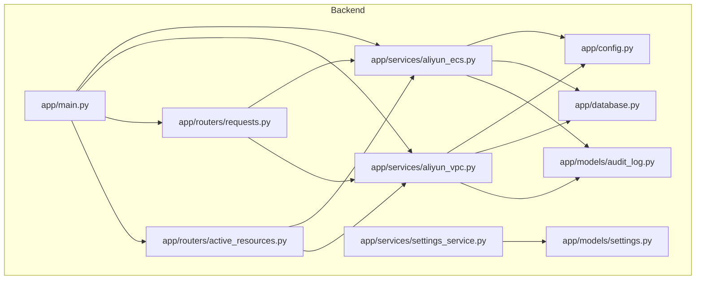
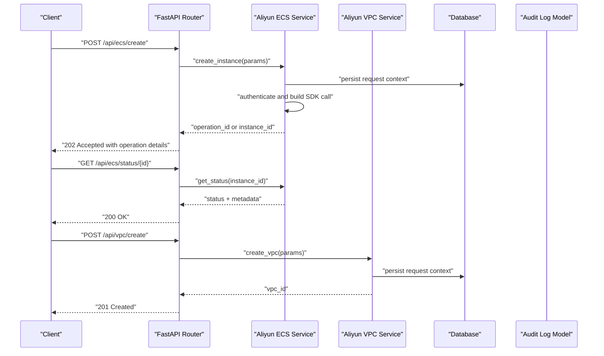
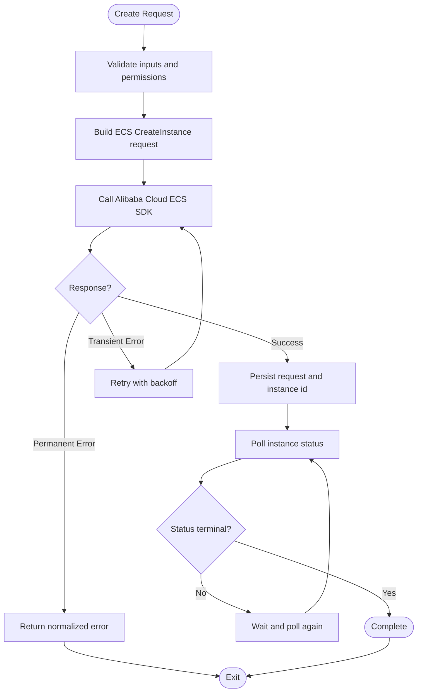
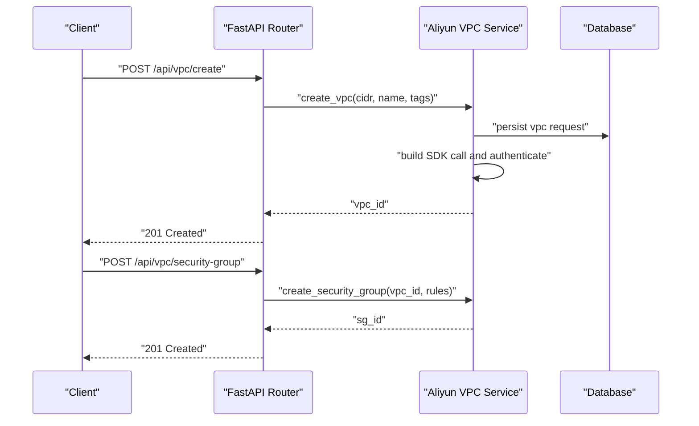
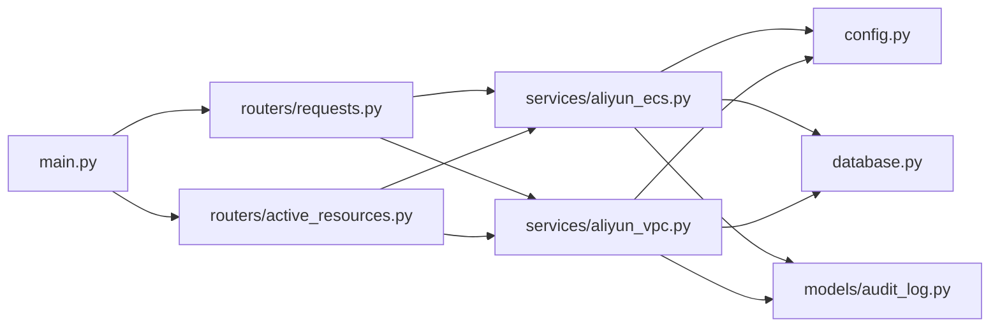

# Cloud Services (ECS & VPC)

<cite>
**Referenced Files in This Document**
- [aliyun_ecs.py](file://backend/app/services/aliyun_ecs.py)
- [aliyun_vpc.py](file://backend/app/services/aliyun_vpc.py)
- [main.py](file://backend/app/main.py)
- [config.py](file://backend/app/config.py)
- [database.py](file://backend/app/database.py)
- [active_resources.py](file://backend/app/routers/active_resources.py)
- [requests.py](file://backend/app/routers/requests.py)
- [settings_service.py](file://backend/app/services/settings_service.py)
- [settings.py](file://backend/app/models/settings.py)
- [audit_log.py](file://backend/app/models/audit_log.py)
- [Dockerfile](file://backend/Dockerfile)
- [requirements.txt](file://backend/requirements.txt)
</cite>

## Table of Contents
1. [Introduction](#introduction)
2. [Project Structure](#project-structure)
3. [Core Components](#core-components)
4. [Architecture Overview](#architecture-overview)
5. [Detailed Component Analysis](#detailed-component-analysis)
6. [Dependency Analysis](#dependency-analysis)
7. [Performance Considerations](#performance-considerations)
8. [Troubleshooting Guide](#troubleshooting-guide)
9. [Conclusion](#conclusion)
10. [Appendices](#appendices)

## Introduction
This document explains the Alibaba Cloud integration services implemented in the backend, focusing on ECS instance management and VPC networking. It covers creation, configuration, monitoring, lifecycle operations, error handling strategies, retry mechanisms, rate limiting, authentication with the Alibaba Cloud SDK, practical usage patterns, performance optimization, connection pooling, and monitoring of cloud service calls. The goal is to help developers understand how the system orchestrates Alibaba Cloud resources through well-defined services and APIs.

## Project Structure
The backend organizes Alibaba Cloud integrations as dedicated services under app/services, with API routes exposing functionality via FastAPI routers. Configuration and database access are centralized for reuse across services.

**Diagram sources**
- [main.py](file://backend/app/main.py)
- [config.py](file://backend/app/config.py)
- [database.py](file://backend/app/database.py)
- [aliyun_ecs.py](file://backend/app/services/aliyun_ecs.py)
- [aliyun_vpc.py](file://backend/app/services/aliyun_vpc.py)
- [requests.py](file://backend/app/routers/requests.py)
- [active_resources.py](file://backend/app/routers/active_resources.py)
- [settings_service.py](file://backend/app/services/settings_service.py)
- [settings.py](file://backend/app/models/settings.py)
- [audit_log.py](file://backend/app/models/audit_log.py)

**Section sources**
- [main.py](file://backend/app/main.py)
- [config.py](file://backend/app/config.py)
- [database.py](file://backend/app/database.py)
- [aliyun_ecs.py](file://backend/app/services/aliyun_ecs.py)
- [aliyun_vpc.py](file://backend/app/services/aliyun_vpc.py)
- [requests.py](file://backend/app/routers/requests.py)
- [active_resources.py](file://backend/app/routers/active_resources.py)
- [settings_service.py](file://backend/app/services/settings_service.py)
- [settings.py](file://backend/app/models/settings.py)
- [audit_log.py](file://backend/app/models/audit_log.py)

## Core Components
- ECS Service: Encapsulates Alibaba Cloud ECS client initialization, instance lifecycle operations (create, start, stop, delete), status polling, and metadata retrieval. It centralizes authentication, request shaping, retries, and error normalization.
- VPC Service: Manages VPC networks, security groups, and related network resources. It provides helpers for creating and configuring VPCs, associating security groups, and querying resource states.
- Routers: Expose HTTP endpoints that orchestrate user requests into service calls, handle validation, and return consistent responses.
- Configuration and Database: Provide shared settings (e.g., credentials, regions) and persistence for audit logs and operational state.

Key responsibilities:
- Authentication with Alibaba Cloud SDK using configured credentials.
- Retry and backoff for transient failures.
- Rate limiting to respect provider quotas.
- Monitoring and logging for observability.
- Error normalization and actionable messages.

**Section sources**
- [aliyun_ecs.py](file://backend/app/services/aliyun_ecs.py)
- [aliyun_vpc.py](file://backend/app/services/aliyun_vpc.py)
- [requests.py](file://backend/app/routers/requests.py)
- [active_resources.py](file://backend/app/routers/active_resources.py)
- [config.py](file://backend/app/config.py)
- [database.py](file://backend/app/database.py)

## Architecture Overview
The application follows a layered architecture:
- Presentation layer: FastAPI routers expose REST endpoints.
- Service layer: Alibaba Cloud integration services encapsulate SDK interactions.
- Infrastructure layer: Configuration and database modules provide shared dependencies.

**Diagram sources**
- [requests.py](file://backend/app/routers/requests.py)
- [active_resources.py](file://backend/app/routers/active_resources.py)
- [aliyun_ecs.py](file://backend/app/services/aliyun_ecs.py)
- [aliyun_vpc.py](file://backend/app/services/aliyun_vpc.py)
- [database.py](file://backend/app/database.py)
- [audit_log.py](file://backend/app/models/audit_log.py)

## Detailed Component Analysis

### ECS Instance Management Service
Responsibilities:
- Initialize Alibaba Cloud ECS client with credentials and region from configuration.
- Create instances based on templates or parameters.
- Poll instance status until terminal state or timeout.
- Stop, start, and delete instances.
- Retrieve instance metadata and tags.
- Normalize errors and implement retries/backoff.
- Emit audit events for lifecycle transitions.

Operational flow for create:

Error handling and retries:
- Transient errors (e.g., throttling, temporary network issues) trigger exponential backoff with jitter.
- Permanent errors (e.g., invalid parameters, quota exceeded) fail fast with actionable messages.
- Timeouts are handled explicitly to avoid hanging operations.

Monitoring and audit:
- Each lifecycle event is recorded with timestamps, caller identity, and outcome.
- Metrics can be exported for success rates, latency percentiles, and failure reasons.

Practical examples:
- Creating an ECS instance by passing image ID, instance type, VPC/subnet IDs, and security group IDs.
- Starting/stopping an existing instance by its ID.
- Deleting an instance after confirming termination.
- Querying instance status and retrieving public/private IPs and tags.

**Section sources**
- [aliyun_ecs.py](file://backend/app/services/aliyun_ecs.py)
- [requests.py](file://backend/app/routers/requests.py)
- [audit_log.py](file://backend/app/models/audit_log.py)

### VPC Networking Service
Responsibilities:
- Create and manage VPCs, CIDR blocks, and associated resources.
- Manage security groups and rules for isolation and access control.
- Associate subnets and route tables where applicable.
- Query resource states and relationships.
- Apply retries/backoff and normalize errors similar to ECS.

Network setup workflow:

Security groups:
- Define ingress/egress rules to restrict traffic.
- Bind security groups to ECS instances during creation or later.

Resource isolation:
- Use separate VPCs per tenant or environment.
- Leverage subnets and routing to segment workloads.

**Section sources**
- [aliyun_vpc.py](file://backend/app/services/aliyun_vpc.py)
- [active_resources.py](file://backend/app/routers/active_resources.py)

### Authentication and Configuration
Authentication:
- Credentials and region are loaded from configuration and passed to the Alibaba Cloud SDK client initialization.
- Secrets should be sourced from environment variables or secret managers.

Configuration:
- Centralized config module exposes settings such as access keys, regions, timeouts, and feature flags.
- Settings model persists configurable options when needed.

**Section sources**
- [config.py](file://backend/app/config.py)
- [settings_service.py](file://backend/app/services/settings_service.py)
- [settings.py](file://backend/app/models/settings.py)

### Database Integration and Auditing
- Database module provides connection management and session handling.
- Audit log model records all significant actions, including ECS/VPC operations, for compliance and troubleshooting.

**Section sources**
- [database.py](file://backend/app/database.py)
- [audit_log.py](file://backend/app/models/audit_log.py)

## Dependency Analysis
High-level dependency graph between core modules:

**Diagram sources**
- [main.py](file://backend/app/main.py)
- [requests.py](file://backend/app/routers/requests.py)
- [active_resources.py](file://backend/app/routers/active_resources.py)
- [aliyun_ecs.py](file://backend/app/services/aliyun_ecs.py)
- [aliyun_vpc.py](file://backend/app/services/aliyun_vpc.py)
- [config.py](file://backend/app/config.py)
- [database.py](file://backend/app/database.py)
- [audit_log.py](file://backend/app/models/audit_log.py)

**Section sources**
- [main.py](file://backend/app/main.py)
- [requests.py](file://backend/app/routers/requests.py)
- [active_resources.py](file://backend/app/routers/active_resources.py)
- [aliyun_ecs.py](file://backend/app/services/aliyun_ecs.py)
- [aliyun_vpc.py](file://backend/app/services/aliyun_vpc.py)
- [config.py](file://backend/app/config.py)
- [database.py](file://backend/app/database.py)
- [audit_log.py](file://backend/app/models/audit_log.py)

## Performance Considerations
- Connection pooling: Reuse SDK clients and database sessions to reduce overhead.
- Concurrency: Use async handlers and background tasks for long-running operations like instance provisioning.
- Backoff and jitter: Implement exponential backoff with randomized jitter for retries to avoid thundering herds.
- Rate limiting: Enforce per-tenant and global rate limits to respect provider quotas and prevent throttling.
- Caching: Cache read-only metadata (e.g., available instance types, images) with short TTLs.
- Pagination: Paginate list operations to minimize payload sizes and memory usage.
- Observability: Track latency histograms, error budgets, and saturation metrics for proactive scaling.

[No sources needed since this section provides general guidance]

## Troubleshooting Guide
Common issues and recovery patterns:
- Authentication failures: Verify credentials, scopes, and region; ensure secrets are correctly injected.
- Quota exceeded: Check ECS/VPC quotas and request increases; implement graceful degradation and queueing.
- Network timeouts: Increase timeouts cautiously; add retries with backoff; inspect DNS and proxy settings.
- Invalid parameters: Validate inputs early; surface clear error messages with remediation steps.
- Orphaned resources: Implement cleanup jobs and idempotent deletion routines.

Operational checks:
- Inspect audit logs for failed operations and their causes.
- Monitor endpoint latency and error rates.
- Review SDK client configurations and retry policies.

**Section sources**
- [audit_log.py](file://backend/app/models/audit_log.py)
- [config.py](file://backend/app/config.py)

## Conclusion
The ECS and VPC services provide robust, observable, and resilient integration with Alibaba Cloud. By centralizing authentication, retries, rate limiting, and auditing, the system ensures reliable resource lifecycle management and secure networking. Following the recommended performance and troubleshooting practices will help maintain high availability and scalability.

[No sources needed since this section summarizes without analyzing specific files]

## Appendices

### Practical Examples

- Create an ECS instance:
  - Endpoint: POST /api/ecs/create
  - Body includes: image_id, instance_type, vpc_id, subnet_id, security_group_ids, tags
  - Response: operation_id and initial status
  - Follow-up: GET /api/ecs/status/{instance_id} to poll completion

- Manage VPC networks:
  - Endpoint: POST /api/vpc/create
  - Body includes: cidr_block, name, tags
  - Response: vpc_id
  - Security group: POST /api/vpc/security-group with vpc_id and rule definitions

- Handle API responses:
  - Success: Return 201/202 with resource identifiers and links to status endpoints.
  - Validation error: Return 400 with field-level messages.
  - Throttling: Return 429 with retry-after hints and backoff policy.
  - Server error: Return 500 with correlation IDs for tracing.

- Implement proper error recovery:
  - Use idempotency keys for create operations.
  - Apply exponential backoff with jitter for transient errors.
  - Record detailed audit entries for every attempt and outcome.

**Section sources**
- [requests.py](file://backend/app/routers/requests.py)
- [active_resources.py](file://backend/app/routers/active_resources.py)
- [aliyun_ecs.py](file://backend/app/services/aliyun_ecs.py)
- [aliyun_vpc.py](file://backend/app/services/aliyun_vpc.py)
- [audit_log.py](file://backend/app/models/audit_log.py)

### Environment and Deployment Notes
- Dockerfile defines the runtime environment and dependencies.
- requirements.txt lists Python packages used by the backend.

**Section sources**
- [Dockerfile](file://backend/Dockerfile)
- [requirements.txt](file://backend/requirements.txt)