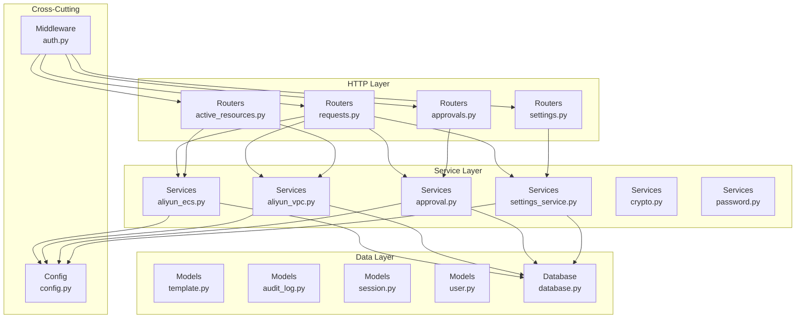
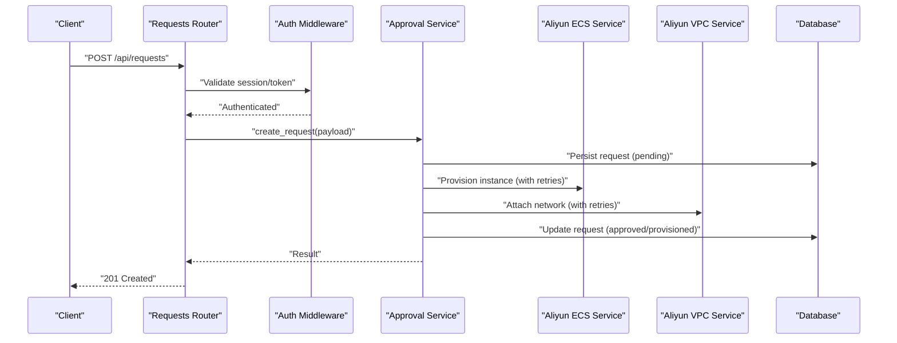
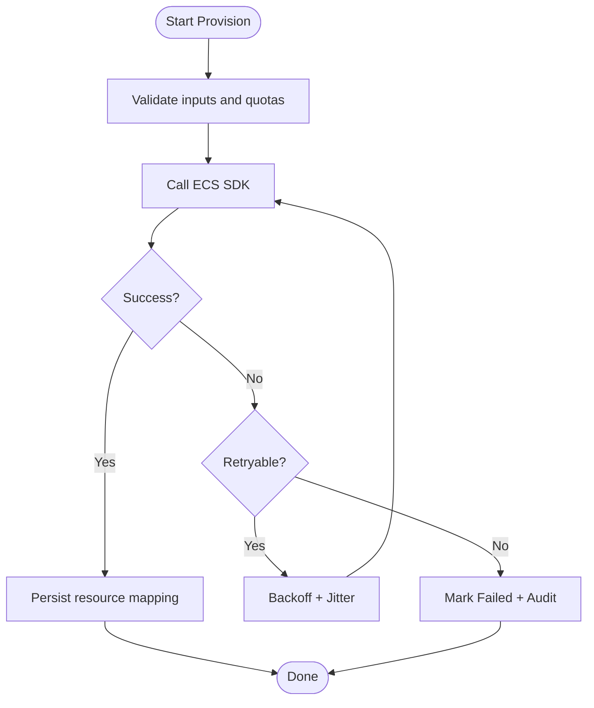
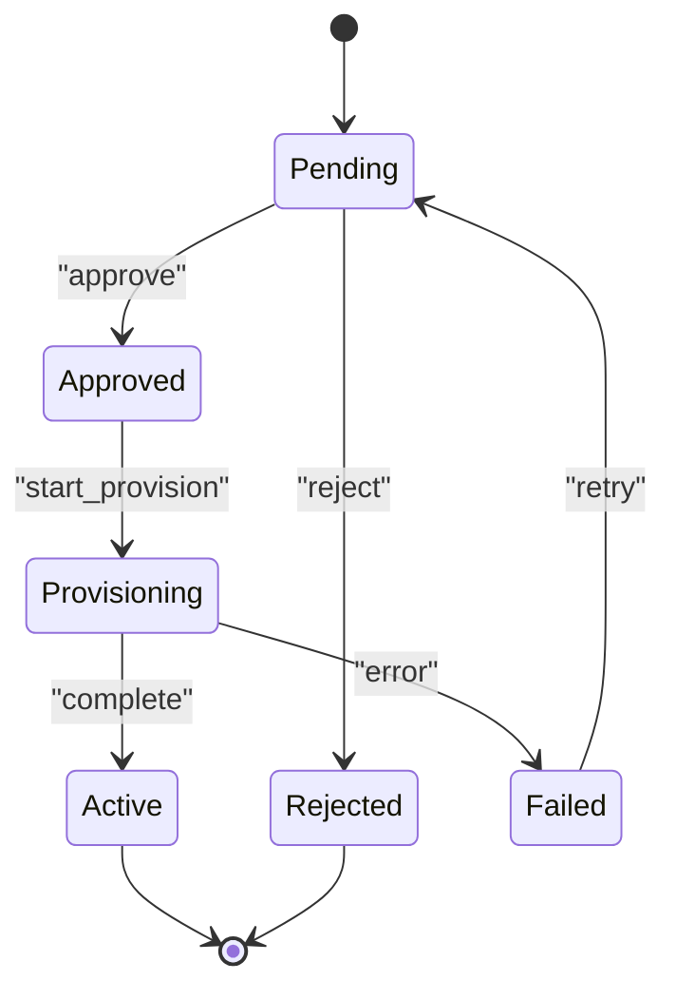
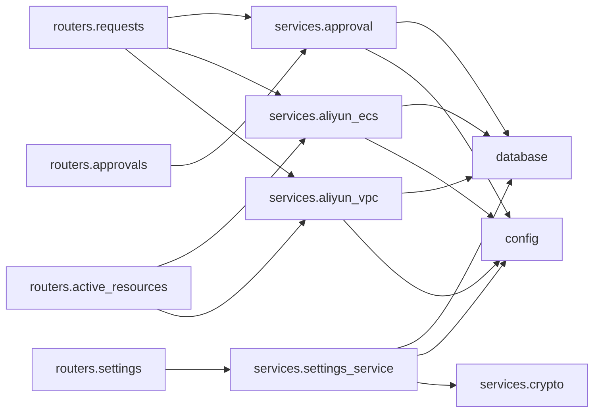

# Service Layer Architecture

<cite>
**Referenced Files in This Document**
- [main.py](file://backend/app/main.py)
- [database.py](file://backend/app/database.py)
- [config.py](file://backend/app/config.py)
- [aliyun_ecs.py](file://backend/app/services/aliyun_ecs.py)
- [aliyun_vpc.py](file://backend/app/services/aliyun_vpc.py)
- [approval.py](file://backend/app/services/approval.py)
- [settings_service.py](file://backend/app/services/settings_service.py)
- [crypto.py](file://backend/app/services/crypto.py)
- [password.py](file://backend/app/services/password.py)
- [requests.py](file://backend/app/routers/requests.py)
- [approvals.py](file://backend/app/routers/approvals.py)
- [settings.py](file://backend/app/routers/settings.py)
- [active_resources.py](file://backend/app/routers/active_resources.py)
- [request.py](file://backend/app/schemas/request.py)
- [approval.py](file://backend/app/schemas/approval.py)
- [settings.py](file://backend/app/schemas/settings.py)
- [template.py](file://backend/app/models/template.py)
- [audit_log.py](file://backend/app/models/audit_log.py)
- [session.py](file://backend/app/models/session.py)
- [user.py](file://backend/app/models/user.py)
- [auth.py](file://backend/app/middleware/auth.py)
</cite>

## Table of Contents
1. [Introduction](#introduction)
2. [Project Structure](#project-structure)
3. [Core Components](#core-components)
4. [Architecture Overview](#architecture-overview)
5. [Detailed Component Analysis](#detailed-component-analysis)
6. [Dependency Analysis](#dependency-analysis)
7. [Performance Considerations](#performance-considerations)
8. [Troubleshooting Guide](#troubleshooting-guide)
9. [Conclusion](#conclusion)

## Introduction
This document explains the service layer abstraction pattern and how business logic is organized in the backend. It focuses on:
- Encapsulation of complex operations within services
- External API integrations (Alibaba Cloud ECS and VPC)
- Transaction boundaries and data consistency
- Approval workflow engine and settings management
- Service composition patterns
- Error handling, retry logic, rate limiting, logging strategies
- Testing approaches with mocks
- Performance optimization techniques

The goal is to provide a clear mental model for developers extending or maintaining the system.

## Project Structure
The backend follows a layered architecture:
- Routers handle HTTP concerns (parsing, validation, response shaping)
- Services encapsulate business logic and external integrations
- Models represent persistent entities
- Schemas define request/response contracts
- Middleware provides cross-cutting concerns like authentication
- Configuration and database access are centralized

**Diagram sources**
- [main.py:1-200](file://backend/app/main.py#L1-L200)
- [requests.py:1-200](file://backend/app/routers/requests.py#L1-L200)
- [approvals.py:1-200](file://backend/app/routers/approvals.py#L1-L200)
- [settings.py:1-200](file://backend/app/routers/settings.py#L1-L200)
- [active_resources.py:1-200](file://backend/app/routers/active_resources.py#L1-L200)
- [aliyun_ecs.py:1-200](file://backend/app/services/aliyun_ecs.py#L1-L200)
- [aliyun_vpc.py:1-200](file://backend/app/services/aliyun_vpc.py#L1-L200)
- [approval.py:1-200](file://backend/app/services/approval.py#L1-L200)
- [settings_service.py:1-200](file://backend/app/services/settings_service.py#L1-L200)
- [database.py:1-200](file://backend/app/database.py#L1-L200)
- [config.py:1-200](file://backend/app/config.py#L1-L200)
- [auth.py:1-200](file://backend/app/middleware/auth.py#L1-L200)

**Section sources**
- [main.py:1-200](file://backend/app/main.py#L1-L200)
- [database.py:1-200](file://backend/app/database.py#L1-L200)
- [config.py:1-200](file://backend/app/config.py#L1-L200)

## Core Components
- Service layer modules encapsulate domain operations and orchestrate calls to external APIs and persistence.
- Routers remain thin, delegating to services after input validation.
- Shared utilities (crypto, password) support secure operations used by multiple services.
- Settings and approval services coordinate multi-step workflows and policy enforcement.

Key responsibilities:
- Aliyun ECS/VPC services: provision, configure, and manage cloud resources with robust error handling and retries.
- Approval service: orchestrates state transitions, notifications, and audit trails.
- Settings service: manages configuration values with versioning and caching hints.
- Crypto/password services: provide consistent hashing and encryption helpers.

**Section sources**
- [aliyun_ecs.py:1-200](file://backend/app/services/aliyun_ecs.py#L1-L200)
- [aliyun_vpc.py:1-200](file://backend/app/services/aliyun_vpc.py#L1-L200)
- [approval.py:1-200](file://backend/app/services/approval.py#L1-L200)
- [settings_service.py:1-200](file://backend/app/services/settings_service.py#L1-L200)
- [crypto.py:1-200](file://backend/app/services/crypto.py#L1-L200)
- [password.py:1-200](file://backend/app/services/password.py#L1-L200)

## Architecture Overview
The service layer sits between routers and data/external layers. It centralizes business rules, transactional boundaries, and integration details.

**Diagram sources**
- [requests.py:1-200](file://backend/app/routers/requests.py#L1-L200)
- [auth.py:1-200](file://backend/app/middleware/auth.py#L1-L200)
- [approval.py:1-200](file://backend/app/services/approval.py#L1-L200)
- [aliyun_ecs.py:1-200](file://backend/app/services/aliyun_ecs.py#L1-L200)
- [aliyun_vpc.py:1-200](file://backend/app/services/aliyun_vpc.py#L1-L200)
- [database.py:1-200](file://backend/app/database.py#L1-L200)

## Detailed Component Analysis

### Aliyun ECS Service
Responsibilities:
- Provision, start, stop, and terminate ECS instances
- Map resource IDs to internal records
- Implement retry/backoff for transient failures
- Enforce rate limits when calling Alibaba Cloud SDK
- Log key lifecycle events and errors

Error handling and resilience:
- Distinguish transient vs permanent errors
- Exponential backoff with jitter for retries
- Circuit breaker hints for sustained failures
- Rate limit awareness via configurable QPS caps

Transaction boundaries:
- Create pending record before external calls
- Update status atomically on success
- Rollback or mark failed on error; ensure idempotency keys where applicable

**Diagram sources**
- [aliyun_ecs.py:1-200](file://backend/app/services/aliyun_ecs.py#L1-L200)
- [database.py:1-200](file://backend/app/database.py#L1-L200)

**Section sources**
- [aliyun_ecs.py:1-200](file://backend/app/services/aliyun_ecs.py#L1-L200)
- [database.py:1-200](file://backend/app/database.py#L1-L200)

### Aliyun VPC Service
Responsibilities:
- Manage VPCs, subnets, security groups, and NAT gateways
- Attach ECS instances to networks
- Ensure idempotent operations using resource tags and existing checks

Error handling and resilience:
- Retries for throttling and temporary network issues
- Fallback strategies when dependent resources are missing
- Clear error categorization for upstream diagnostics

Integration points:
- Uses shared config for credentials and endpoints
- Coordinates with ECS service during provisioning flows

**Section sources**
- [aliyun_vpc.py:1-200](file://backend/app/services/aliyun_vpc.py#L1-L200)
- [config.py:1-200](file://backend/app/config.py#L1-L200)

### Approval Workflow Engine
Responsibilities:
- Orchestrate multi-step approvals for requests
- Enforce policies based on settings and user roles
- Emit audit logs and trigger downstream actions upon approval

State transitions:
- Pending -> Approved -> Provisioning -> Active
- Pending -> Rejected
- Any -> Failed (with recovery options)

Composition:
- Delegates provisioning to ECS/VPC services
- Persists state changes and audit entries
- Notifies stakeholders via configured channels

**Diagram sources**
- [approval.py:1-200](file://backend/app/services/approval.py#L1-L200)
- [audit_log.py:1-200](file://backend/app/models/audit_log.py#L1-L200)

**Section sources**
- [approval.py:1-200](file://backend/app/services/approval.py#L1-L200)
- [audit_log.py:1-200](file://backend/app/models/audit_log.py#L1-L200)

### Settings Management Service
Responsibilities:
- CRUD for application settings
- Versioning and rollback hints
- Validation against schema constraints
- Optional caching for hot paths

Security:
- Encrypt sensitive values using crypto service
- Restrict updates to authorized users

**Section sources**
- [settings_service.py:1-200](file://backend/app/services/settings_service.py#L1-L200)
- [crypto.py:1-200](file://backend/app/services/crypto.py#L1-L200)

### Utility Services
- Crypto service: symmetric/asymmetric encryption primitives and key management helpers
- Password service: hashing, verification, and rotation utilities

These are reused across auth, settings, and other services to ensure consistent security behavior.

**Section sources**
- [crypto.py:1-200](file://backend/app/services/crypto.py#L1-L200)
- [password.py:1-200](file://backend/app/services/password.py#L1-L200)

## Dependency Analysis
High-level dependencies among core modules:

**Diagram sources**
- [requests.py:1-200](file://backend/app/routers/requests.py#L1-L200)
- [approvals.py:1-200](file://backend/app/routers/approvals.py#L1-L200)
- [settings.py:1-200](file://backend/app/routers/settings.py#L1-L200)
- [active_resources.py:1-200](file://backend/app/routers/active_resources.py#L1-L200)
- [approval.py:1-200](file://backend/app/services/approval.py#L1-L200)
- [aliyun_ecs.py:1-200](file://backend/app/services/aliyun_ecs.py#L1-L200)
- [aliyun_vpc.py:1-200](file://backend/app/services/aliyun_vpc.py#L1-L200)
- [settings_service.py:1-200](file://backend/app/services/settings_service.py#L1-L200)
- [database.py:1-200](file://backend/app/database.py#L1-L200)
- [config.py:1-200](file://backend/app/config.py#L1-L200)
- [crypto.py:1-200](file://backend/app/services/crypto.py#L1-L200)

**Section sources**
- [requests.py:1-200](file://backend/app/routers/requests.py#L1-L200)
- [approvals.py:1-200](file://backend/app/routers/approvals.py#L1-L200)
- [settings.py:1-200](file://backend/app/routers/settings.py#L1-L200)
- [active_resources.py:1-200](file://backend/app/routers/active_resources.py#L1-L200)
- [approval.py:1-200](file://backend/app/services/approval.py#L1-L200)
- [aliyun_ecs.py:1-200](file://backend/app/services/aliyun_ecs.py#L1-L200)
- [aliyun_vpc.py:1-200](file://backend/app/services/aliyun_vpc.py#L1-L200)
- [settings_service.py:1-200](file://backend/app/services/settings_service.py#L1-L200)
- [database.py:1-200](file://backend/app/database.py#L1-L200)
- [config.py:1-200](file://backend/app/config.py#L1-L200)
- [crypto.py:1-200](file://backend/app/services/crypto.py#L1-L200)

## Performance Considerations
- Batch operations: group SDK calls where supported to reduce round trips
- Connection reuse: keep SDK clients warm per process
- Idempotency: use stable identifiers to avoid duplicate work
- Pagination: stream large lists instead of loading all at once
- Caching: cache read-heavy settings and templates with invalidation hooks
- Timeouts and deadlines: set explicit timeouts for external calls
- Concurrency control: limit parallel calls to respect provider rate limits
- Database indexing: ensure queries used by active resources and audits are indexed

[No sources needed since this section provides general guidance]

## Troubleshooting Guide
Common issues and strategies:
- External API failures: inspect retry counts, backoff intervals, and error categories
- Rate limiting: monitor QPS usage and adjust concurrency or backoff parameters
- Transaction rollbacks: verify that partial states are recorded and recoverable
- Audit trail gaps: confirm that every state change emits an audit entry
- Secrets exposure: ensure sensitive settings are encrypted and never logged

Operational tips:
- Enable structured logging with correlation IDs
- Add health checks for external dependencies
- Use feature flags to toggle risky operations
- Instrument metrics for latency, error rates, and throughput

**Section sources**
- [approval.py:1-200](file://backend/app/services/approval.py#L1-L200)
- [aliyun_ecs.py:1-200](file://backend/app/services/aliyun_ecs.py#L1-L200)
- [aliyun_vpc.py:1-200](file://backend/app/services/aliyun_vpc.py#L1-L200)
- [settings_service.py:1-200](file://backend/app/services/settings_service.py#L1-L200)

## Conclusion
The service layer cleanly separates business logic from HTTP concerns, encapsulates external integrations, and enforces transactional boundaries. The ECS and VPC services implement resilient patterns such as retries and rate limiting. The approval workflow coordinates multi-step processes with auditability, while the settings service ensures safe configuration management. Following these patterns will help you extend the system safely and maintain high reliability.