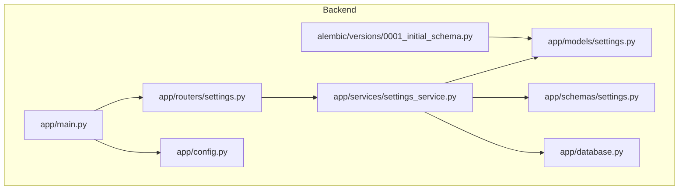
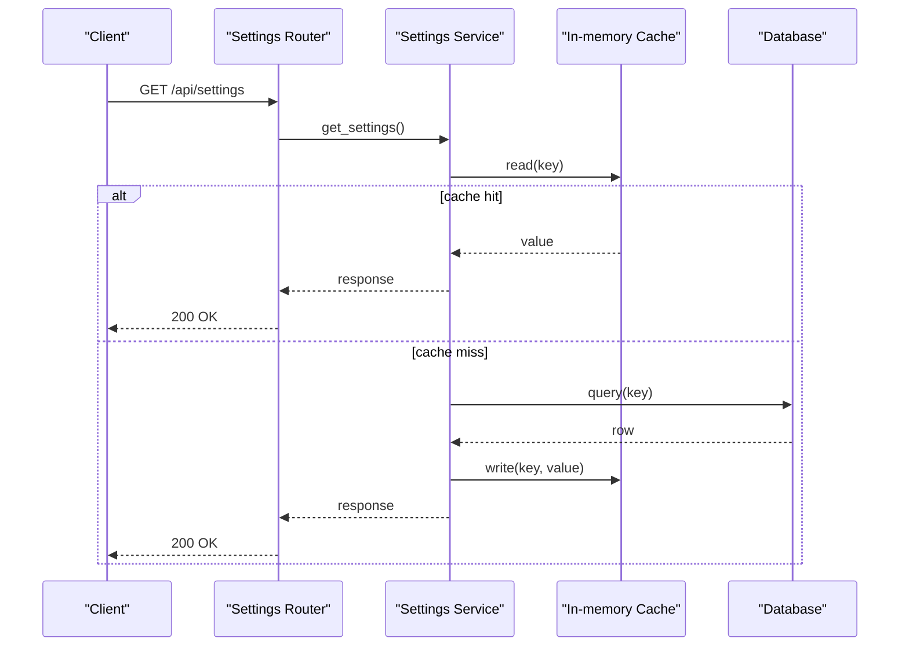
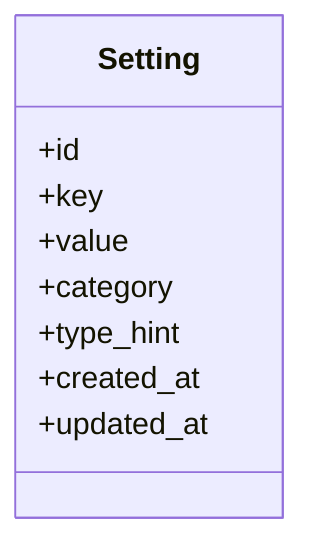
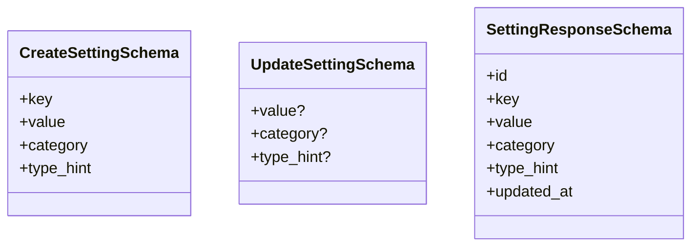
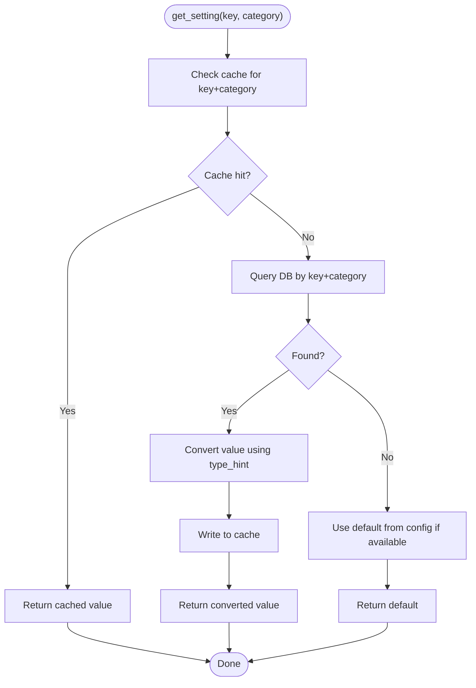
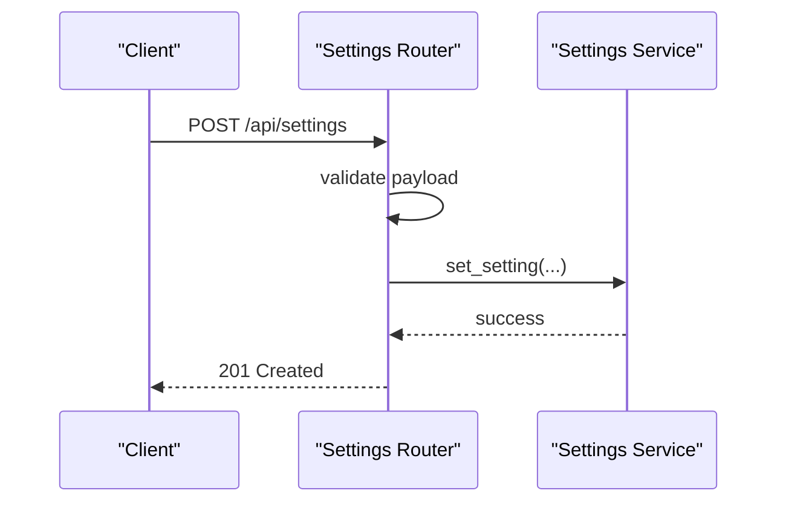
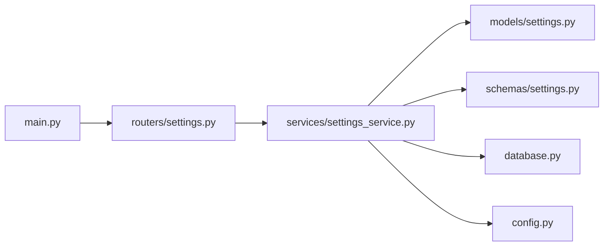

# Settings & Configuration Service

<cite>
**Referenced Files in This Document**
- [settings.py](file://backend/app/models/settings.py)
- [settings_service.py](file://backend/app/services/settings_service.py)
- [settings.py](file://backend/app/schemas/settings.py)
- [settings.py](file://backend/app/routers/settings.py)
- [config.py](file://backend/app/config.py)
- [database.py](file://backend/app/database.py)
- [main.py](file://backend/app/main.py)
- [0001_initial_schema.py](file://backend/alembic/versions/0001_initial_schema.py)
</cite>

## Table of Contents
1. [Introduction](#introduction)
2. [Project Structure](#project-structure)
3. [Core Components](#core-components)
4. [Architecture Overview](#architecture-overview)
5. [Detailed Component Analysis](#detailed-component-analysis)
6. [Dependency Analysis](#dependency-analysis)
7. [Performance Considerations](#performance-considerations)
8. [Security Considerations](#security-considerations)
9. [Troubleshooting Guide](#troubleshooting-guide)
10. [Conclusion](#conclusion)
11. [Appendices](#appendices)

## Introduction
This document explains the application’s settings and configuration service: how system settings are stored, retrieved, validated, cached, versioned, and migrated; how environment-specific configurations are handled; and how settings integrate with other services. It also provides guidance for adding new settings, implementing categories, handling runtime updates, and securing sensitive values.

## Project Structure
The settings subsystem spans models, schemas, a dedicated service, API routes, database migrations, and application configuration. The key files are:
- Data model and persistence mapping
- Pydantic schemas for validation and serialization
- Service layer for business logic, caching, and type conversion
- API router exposing endpoints to manage settings
- Application configuration loader
- Database initialization and migration scripts

**Diagram sources**
- [main.py](file://backend/app/main.py)
- [settings.py](file://backend/app/routers/settings.py)
- [settings_service.py](file://backend/app/services/settings_service.py)
- [settings.py](file://backend/app/models/settings.py)
- [settings.py](file://backend/app/schemas/settings.py)
- [database.py](file://backend/app/database.py)
- [config.py](file://backend/app/config.py)
- [0001_initial_schema.py](file://backend/alembic/versions/0001_initial_schema.py)

**Section sources**
- [settings.py](file://backend/app/models/settings.py)
- [settings_service.py](file://backend/app/services/settings_service.py)
- [settings.py](file://backend/app/schemas/settings.py)
- [settings.py](file://backend/app/routers/settings.py)
- [config.py](file://backend/app/config.py)
- [database.py](file://backend/app/database.py)
- [main.py](file://backend/app/main.py)
- [0001_initial_schema.py](file://backend/alembic/versions/0001_initial_schema.py)

## Core Components
- Model: Defines the persistent representation of settings (keys, values, metadata).
- Schema: Pydantic models that validate incoming requests and serialize responses.
- Service: Encapsulates CRUD operations, validation, type conversion, caching, and category support.
- Router: Exposes REST endpoints for listing, creating, updating, and deleting settings.
- Config: Loads environment-based defaults and secrets at startup.
- Database: Provides session/connection management used by the service.
- Migration: Ensures schema evolution over time.

Key responsibilities:
- Store settings as key-value pairs with optional categories and types.
- Validate inputs against schemas and enforce constraints.
- Convert between string storage and typed Python values.
- Cache frequently accessed settings to reduce DB calls.
- Support runtime updates without restarts where appropriate.

**Section sources**
- [settings.py](file://backend/app/models/settings.py)
- [settings.py](file://backend/app/schemas/settings.py)
- [settings_service.py](file://backend/app/services/settings_service.py)
- [settings.py](file://backend/app/routers/settings.py)
- [config.py](file://backend/app/config.py)
- [database.py](file://backend/app/database.py)

## Architecture Overview
The settings architecture follows a layered design:
- API Layer: FastAPI router handles HTTP requests and returns Pydantic responses.
- Service Layer: Implements business rules, validation, caching, and persistence.
- Persistence Layer: SQLAlchemy model backed by a relational database.
- Configuration Layer: Environment-driven defaults loaded at startup.

**Diagram sources**
- [settings.py](file://backend/app/routers/settings.py)
- [settings_service.py](file://backend/app/services/settings_service.py)
- [settings.py](file://backend/app/models/settings.py)
- [database.py](file://backend/app/database.py)

## Detailed Component Analysis

### Data Model and Persistence
- Purpose: Persist settings as rows with fields such as key, value, category, type hint, and timestamps.
- Constraints: Keys should be unique per category or globally depending on policy; values stored as strings with explicit type hints for conversion.
- Indexing: Key and category columns should be indexed for efficient lookups.

**Diagram sources**
- [settings.py](file://backend/app/models/settings.py)

**Section sources**
- [settings.py](file://backend/app/models/settings.py)
- [0001_initial_schema.py](file://backend/alembic/versions/0001_initial_schema.py)

### Validation Schemas
- Purpose: Define request/response contracts and validation rules for settings.
- Features: Field-level validators, type enforcement, and helpful error messages.
- Usage: Used by both the router and service to ensure data integrity before persistence.

**Diagram sources**
- [settings.py](file://backend/app/schemas/settings.py)

**Section sources**
- [settings.py](file://backend/app/schemas/settings.py)

### Settings Service
Responsibilities:
- Retrieve settings with fallback to defaults from config.
- Validate and convert values based on type hints.
- Maintain an in-memory cache keyed by setting identifiers.
- Provide methods for create, update, delete, and bulk operations.
- Handle categories and scoping.

Typical operations:
- get_setting(key, category=None) -> typed value
- set_setting(key, value, category=None, type_hint=None)
- delete_setting(key, category=None)
- list_settings(category=None)
- reload_cache()

Caching strategy:
- In-process dictionary cache with TTL and invalidation on mutations.
- Optional background refresh for hot keys.

Type conversion:
- Centralized converter registry maps type hints to Python types.
- Supports common primitives and structured JSON-like payloads when needed.

Error handling:
- Clear exceptions for missing keys, invalid formats, and constraint violations.
- Consistent error responses via Pydantic validation errors.

**Diagram sources**
- [settings_service.py](file://backend/app/services/settings_service.py)
- [settings.py](file://backend/app/models/settings.py)
- [config.py](file://backend/app/config.py)

**Section sources**
- [settings_service.py](file://backend/app/services/settings_service.py)

### API Router
Endpoints:
- List settings (optionally filtered by category)
- Get a single setting
- Create a new setting
- Update an existing setting
- Delete a setting

Behavior:
- Validates payloads using Pydantic schemas.
- Delegates to the service for business logic.
- Returns standardized responses.

**Diagram sources**
- [settings.py](file://backend/app/routers/settings.py)
- [settings_service.py](file://backend/app/services/settings_service.py)
- [settings.py](file://backend/app/schemas/settings.py)

**Section sources**
- [settings.py](file://backend/app/routers/settings.py)

### Application Configuration
- Loads environment variables and provides typed accessors.
- Supplies default settings when not present in the database.
- Separates sensitive values (e.g., secrets) from non-sensitive defaults.

Integration points:
- Service reads defaults during cold start and on cache misses.
- Router may expose a subset of non-sensitive configuration for UI.

**Section sources**
- [config.py](file://backend/app/config.py)

### Database Initialization and Migrations
- Database connection/session setup is centralized.
- Alembic manages schema changes; initial migration defines the settings table structure.
- Future migrations add columns or constraints as the schema evolves.

**Section sources**
- [database.py](file://backend/app/database.py)
- [0001_initial_schema.py](file://backend/alembic/versions/0001_initial_schema.py)

## Dependency Analysis
High-level dependencies:
- Router depends on Service and Schemas.
- Service depends on Model, Schemas, Database, and Config.
- Main wires routers and app lifecycle.

**Diagram sources**
- [main.py](file://backend/app/main.py)
- [settings.py](file://backend/app/routers/settings.py)
- [settings_service.py](file://backend/app/services/settings_service.py)
- [settings.py](file://backend/app/models/settings.py)
- [settings.py](file://backend/app/schemas/settings.py)
- [database.py](file://backend/app/database.py)
- [config.py](file://backend/app/config.py)

**Section sources**
- [main.py](file://backend/app/main.py)
- [settings.py](file://backend/app/routers/settings.py)
- [settings_service.py](file://backend/app/services/settings_service.py)
- [settings.py](file://backend/app/models/settings.py)
- [settings.py](file://backend/app/schemas/settings.py)
- [database.py](file://backend/app/database.py)
- [config.py](file://backend/app/config.py)

## Performance Considerations
- Cache hot settings to avoid repeated DB queries.
- Use targeted invalidation on mutations rather than full cache flushes.
- Batch reads/writes where possible.
- Prefer narrow field selection and proper indexing on key/category.
- Avoid heavy conversions on every read; cache converted values when safe.

[No sources needed since this section provides general guidance]

## Security Considerations
- Treat secret-type settings as sensitive; do not log or return them in broad list endpoints.
- Restrict write access to authorized roles.
- Validate and sanitize all inputs strictly using schemas.
- Consider encrypting sensitive values at rest if required by policy.
- Separate public defaults from private secrets in configuration loading.

[No sources needed since this section provides general guidance]

## Troubleshooting Guide
Common issues and resolutions:
- Missing setting key: Ensure defaults exist in config or initialize via admin UI.
- Type mismatch errors: Verify type_hint matches actual value format.
- Cache inconsistencies: Invalidate cache after updates; verify TTL behavior.
- Migration failures: Review Alembic history and apply pending migrations.

Operational checks:
- Confirm database connectivity and schema version.
- Validate environment variables for defaults and secrets.
- Inspect logs around setting retrieval and mutation paths.

**Section sources**
- [settings_service.py](file://backend/app/services/settings_service.py)
- [settings.py](file://backend/app/routers/settings.py)
- [0001_initial_schema.py](file://backend/alembic/versions/0001_initial_schema.py)

## Conclusion
The settings service provides a robust, validated, and cached mechanism for managing application configuration. By separating concerns across model, schema, service, and router layers, it supports extensibility through categories and type hints, while maintaining performance and security. Proper use of migrations and environment-based defaults ensures reliable operation across environments and versions.

[No sources needed since this section summarizes without analyzing specific files]

## Appendices

### Adding a New Setting
Steps:
- Define the key, category, and type_hint in your codebase documentation.
- Add a default in configuration if applicable.
- Optionally seed the database via migration or admin UI.
- Access via the service’s getter; it will handle conversion and caching.

[No sources needed since this section provides general guidance]

### Implementing Setting Categories
- Use a category field to group related settings (e.g., “ecs”, “vpc”, “auth”).
- Filter list endpoints by category.
- Scope permissions per category if needed.

[No sources needed since this section provides general guidance]

### Handling Runtime Updates
- Update via the service’s setter; cache is invalidated for the affected key.
- Consumers relying on cached values should refresh or rely on short TTL.
- For critical settings, consider a reload endpoint to refresh dependent services.

[No sources needed since this section provides general guidance]

### Settings Versioning and Migration Strategies
- Track schema changes with Alembic migrations.
- Introduce backward-compatible changes first (additive), then deprecate old fields.
- Provide migration scripts to transform legacy values into new formats.

**Section sources**
- [0001_initial_schema.py](file://backend/alembic/versions/0001_initial_schema.py)

### Environment-Specific Configurations
- Load environment-specific defaults from configuration.
- Override sensitive values via environment variables.
- Keep non-sensitive defaults in code and sensitive ones out of source control.

**Section sources**
- [config.py](file://backend/app/config.py)