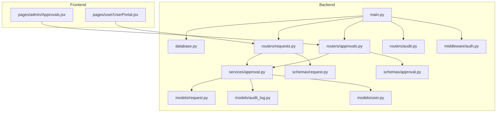
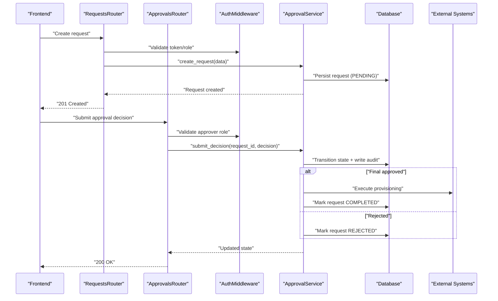
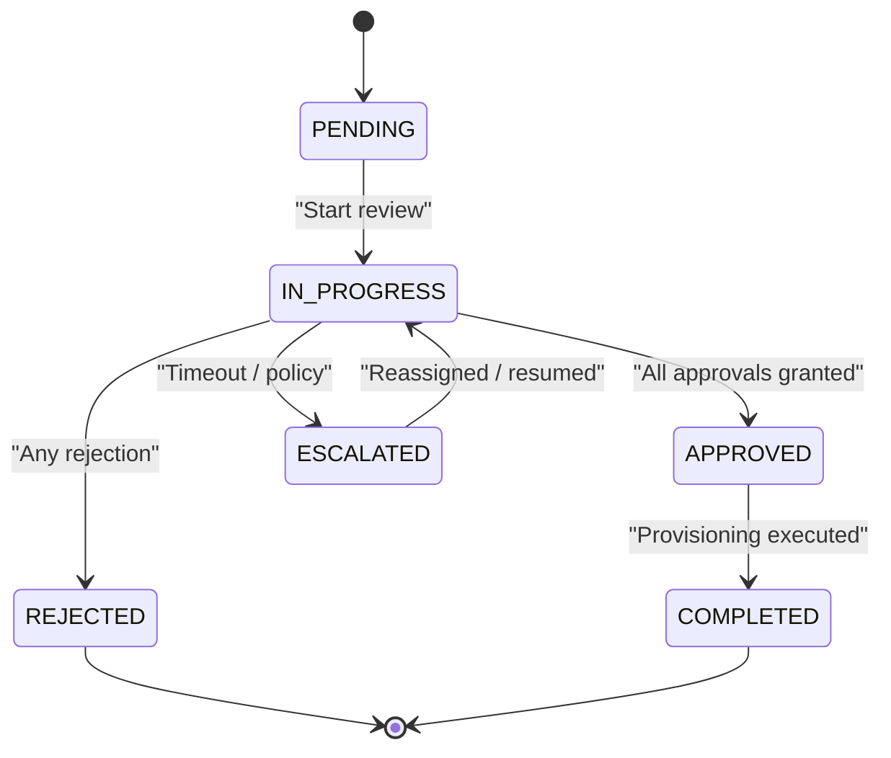
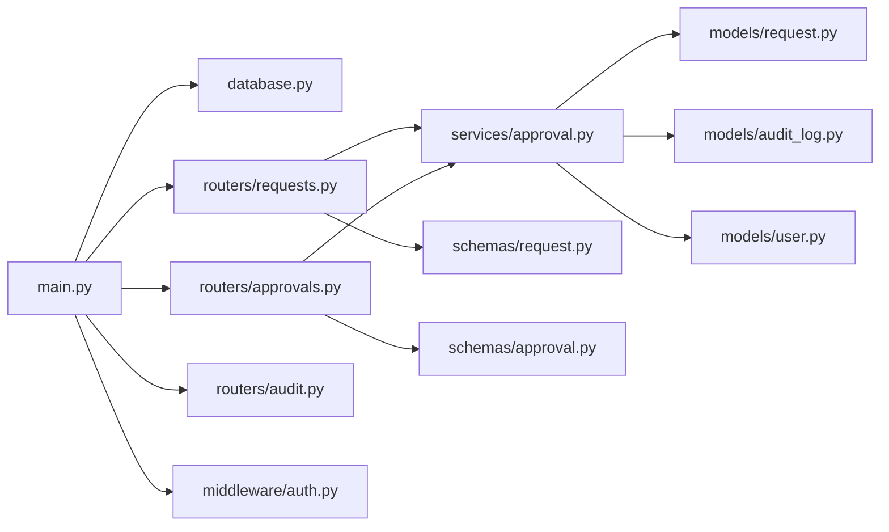

# Workflow & Approval Services

<cite>
**Referenced Files in This Document**
- [backend/app/routers/approvals.py](file://backend/app/routers/approvals.py)
- [backend/app/routers/requests.py](file://backend/app/routers/requests.py)
- [backend/app/services/approval.py](file://backend/app/services/approval.py)
- [backend/app/models/request.py](file://backend/app/models/request.py)
- [backend/app/models/audit_log.py](file://backend/app/models/audit_log.py)
- [backend/app/schemas/approval.py](file://backend/app/schemas/approval.py)
- [backend/app/schemas/request.py](file://backend/app/schemas/request.py)
- [backend/app/routers/audit.py](file://backend/app/routers/audit.py)
- [backend/app/models/user.py](file://backend/app/models/user.py)
- [backend/app/middleware/auth.py](file://backend/app/middleware/auth.py)
- [backend/app/database.py](file://backend/app/database.py)
- [backend/app/main.py](file://backend/app/main.py)
</cite>

## Table of Contents
1. [Introduction](#introduction)
2. [Project Structure](#project-structure)
3. [Core Components](#core-components)
4. [Architecture Overview](#architecture-overview)
5. [Detailed Component Analysis](#detailed-component-analysis)
6. [Dependency Analysis](#dependency-analysis)
7. [Performance Considerations](#performance-considerations)
8. [Troubleshooting Guide](#troubleshooting-guide)
9. [Conclusion](#conclusion)
10. [Appendices](#appendices)

## Introduction
This document explains the approval workflow engine and business process management implemented in the backend. It covers the request lifecycle, approval state machine, routing through approval hierarchies, notifications integration points, escalation rules, exception handling, concurrency considerations, audit trail maintenance, analytics, and extension points for custom workflows. The goal is to provide both a conceptual overview and code-level guidance for developers extending or operating the system.

## Project Structure
The workflow-related functionality is primarily located under backend/app with clear separation between HTTP routes (routers), business logic (services), data models (models), and API schemas (schemas). The frontend exposes administrative and user-facing pages that interact with these endpoints.

**Diagram sources**
- [backend/app/main.py](file://backend/app/main.py)
- [backend/app/database.py](file://backend/app/database.py)
- [backend/app/routers/requests.py](file://backend/app/routers/requests.py)
- [backend/app/routers/approvals.py](file://backend/app/routers/approvals.py)
- [backend/app/routers/audit.py](file://backend/app/routers/audit.py)
- [backend/app/services/approval.py](file://backend/app/services/approval.py)
- [backend/app/models/request.py](file://backend/app/models/request.py)
- [backend/app/models/audit_log.py](file://backend/app/models/audit_log.py)
- [backend/app/models/user.py](file://backend/app/models/user.py)
- [backend/app/schemas/request.py](file://backend/app/schemas/request.py)
- [backend/app/schemas/approval.py](file://backend/app/schemas/approval.py)
- [backend/app/middleware/auth.py](file://backend/app/middleware/auth.py)

**Section sources**
- [backend/app/main.py](file://backend/app/main.py)
- [backend/app/database.py](file://backend/app/database.py)
- [backend/app/routers/requests.py](file://backend/app/routers/requests.py)
- [backend/app/routers/approvals.py](file://backend/app/routers/approvals.py)
- [backend/app/routers/audit.py](file://backend/app/routers/audit.py)
- [backend/app/services/approval.py](file://backend/app/services/approval.py)
- [backend/app/models/request.py](file://backend/app/models/request.py)
- [backend/app/models/audit_log.py](file://backend/app/models/audit_log.py)
- [backend/app/models/user.py](file://backend/app/models/user.py)
- [backend/app/schemas/request.py](file://backend/app/schemas/request.py)
- [backend/app/schemas/approval.py](file://backend/app/schemas/approval.py)
- [backend/app/middleware/auth.py](file://backend/app/middleware/auth.py)

## Core Components
- Request model: Represents a business request and its lifecycle state.
- Audit log model: Records immutable events for compliance and analytics.
- Approval service: Encapsulates workflow transitions, decision handling, escalation, and notification triggers.
- Routers: Expose REST endpoints for creating requests, submitting approvals, querying status, and reading audit logs.
- Schemas: Define input/output contracts for requests and approvals.
- Authentication middleware: Enforces identity and authorization on protected endpoints.

Key responsibilities:
- Create and route requests into the approval pipeline.
- Maintain a deterministic state machine for approvals.
- Persist audit trails for every significant action.
- Provide APIs for querying current state and history.
- Integrate with external systems (e.g., cloud providers) after final approval.

**Section sources**
- [backend/app/models/request.py](file://backend/app/models/request.py)
- [backend/app/models/audit_log.py](file://backend/app/models/audit_log.py)
- [backend/app/services/approval.py](file://backend/app/services/approval.py)
- [backend/app/routers/requests.py](file://backend/app/routers/requests.py)
- [backend/app/routers/approvals.py](file://backend/app/routers/approvals.py)
- [backend/app/schemas/request.py](file://backend/app/schemas/request.py)
- [backend/app/schemas/approval.py](file://backend/app/schemas/approval.py)
- [backend/app/middleware/auth.py](file://backend/app/middleware/auth.py)

## Architecture Overview
The workflow engine follows a layered architecture:
- Presentation layer (frontend) calls backend routers.
- Routers validate inputs via Pydantic schemas and delegate to services.
- Services implement workflow logic, orchestrate state transitions, and persist changes.
- Models represent persistent entities; audit logs capture all relevant actions.
- Middleware enforces authentication and authorization.

**Diagram sources**
- [backend/app/routers/requests.py](file://backend/app/routers/requests.py)
- [backend/app/routers/approvals.py](file://backend/app/routers/approvals.py)
- [backend/app/services/approval.py](file://backend/app/services/approval.py)
- [backend/app/models/request.py](file://backend/app/models/request.py)
- [backend/app/models/audit_log.py](file://backend/app/models/audit_log.py)
- [backend/app/middleware/auth.py](file://backend/app/middleware/auth.py)

## Detailed Component Analysis

### Request Lifecycle and State Machine
The request object drives the workflow. Typical states include:
- PENDING: Initial state after creation.
- IN_PROGRESS: Under active review by one or more approvers.
- APPROVED: All required approvals obtained.
- REJECTED: Denied at any stage.
- ESCALATED: Escalation triggered due to timeout or policy.
- COMPLETED: Finalized after successful execution of downstream actions.

Transitions are enforced by the approval service based on the current state and the submitted decision. Each transition writes an audit entry.

**Diagram sources**
- [backend/app/models/request.py](file://backend/app/models/request.py)
- [backend/app/services/approval.py](file://backend/app/services/approval.py)

**Section sources**
- [backend/app/models/request.py](file://backend/app/models/request.py)
- [backend/app/services/approval.py](file://backend/app/services/approval.py)

### Approval Chain Logic and Routing
- Hierarchical routing: Requests are routed to approvers based on roles, departments, or resource type.
- Parallel vs sequential chains: The service supports multiple approvers per step and can enforce “all must approve” or “any one approves” policies.
- Dynamic assignment: Approvers can be resolved from user attributes or configuration at runtime.
- Reassignment and delegation: Approvals can be reassigned when approvers are unavailable.

Implementation patterns:
- Resolution function maps request context to a list of candidate approvers.
- Decision aggregation evaluates outcomes against configured thresholds.
- Next-step resolution determines subsequent steps or completion.

**Section sources**
- [backend/app/services/approval.py](file://backend/app/services/approval.py)
- [backend/app/models/user.py](file://backend/app/models/user.py)

### Notification System Integration
Notification triggers are invoked upon key state transitions:
- On creation: Notify initial reviewers.
- On escalation: Alert managers or backup approvers.
- On approval/rejection: Inform requesters and stakeholders.
- On completion: Confirm provisioning results.

Integration points:
- Service methods call a notification adapter to send emails, webhooks, or messages.
- Failures are logged and retried according to policy.

**Section sources**
- [backend/app/services/approval.py](file://backend/app/services/approval.py)

### Escalation Rules
Escalation occurs when:
- An approver does not respond within a configured time window.
- A request requires higher authority due to risk or value thresholds.
- Policy dictates automatic escalation paths.

Behavior:
- Timers or scheduled tasks detect overdue approvals.
- Escalation updates the approval chain and notifies new approvers.
- Audit entries record escalation reasons and timestamps.

**Section sources**
- [backend/app/services/approval.py](file://backend/app/services/approval.py)

### Handling Approval Decisions
Endpoints accept decisions (approve/reject) along with optional comments. The service:
- Validates the caller’s authority over the target request.
- Applies the decision to the current step.
- Aggregates decisions across parallel approvers if applicable.
- Transitions the request state accordingly and persists audit records.

Concurrency safeguards:
- Optimistic locking or database constraints prevent duplicate approvals.
- Idempotency keys ensure safe retries.

**Section sources**
- [backend/app/routers/approvals.py](file://backend/app/routers/approvals.py)
- [backend/app/services/approval.py](file://backend/app/services/approval.py)
- [backend/app/models/request.py](file://backend/app/models/request.py)

### Managing Exceptions and Errors
Common exceptions:
- Unauthorized or insufficient permissions.
- Invalid state transitions.
- Duplicate or conflicting decisions.
- External system failures during provisioning.

Handling strategy:
- Return structured error responses with actionable details.
- Log errors and create audit entries for failed transitions.
- Implement retry/backoff for transient external failures.

**Section sources**
- [backend/app/routers/approvals.py](file://backend/app/routers/approvals.py)
- [backend/app/services/approval.py](file://backend/app/services/approval.py)

### Audit Trail Maintenance
Every significant event is recorded:
- Creation, transitions, decisions, escalations, rejections, completions.
- Actor identity, timestamp, and reason/comment.
- Immutable storage ensures compliance and supports analytics.

Access controls:
- Audit logs are readable by authorized users and admins.

**Section sources**
- [backend/app/models/audit_log.py](file://backend/app/models/audit_log.py)
- [backend/app/routers/audit.py](file://backend/app/routers/audit.py)

### Analytics and Reporting
Operational metrics derived from audit logs and request states:
- Average time-to-approval per step.
- Bottleneck identification by approver or department.
- Rejection rates and reasons.
- Throughput and backlog trends.

Suggested queries:
- Count of requests by state over time.
- Duration histograms for each step.
- Top approvers by volume and average latency.

**Section sources**
- [backend/app/models/audit_log.py](file://backend/app/models/audit_log.py)
- [backend/app/routers/audit.py](file://backend/app/routers/audit.py)

### Concurrency and Consistency
- Use database-level constraints to prevent double approvals.
- Apply optimistic versioning on request rows to avoid lost updates.
- Ensure idempotent decision submissions using unique keys.
- Serialize long-running operations (e.g., provisioning) to avoid race conditions.

**Section sources**
- [backend/app/services/approval.py](file://backend/app/services/approval.py)
- [backend/app/models/request.py](file://backend/app/models/request.py)

### Extending the Workflow Engine
To add custom approval processes:
- Extend the approval service with new step definitions and routing rules.
- Add new states and transitions while preserving backward compatibility.
- Implement custom notification adapters for channels like Slack or Teams.
- Introduce new escalation policies tied to request attributes.
- Update schemas and routers to expose new capabilities.
- Add tests covering edge cases and concurrency scenarios.

**Section sources**
- [backend/app/services/approval.py](file://backend/app/services/approval.py)
- [backend/app/schemas/approval.py](file://backend/app/schemas/approval.py)
- [backend/app/routers/approvals.py](file://backend/app/routers/approvals.py)

## Dependency Analysis
The following diagram shows how components depend on each other:

**Diagram sources**
- [backend/app/main.py](file://backend/app/main.py)
- [backend/app/database.py](file://backend/app/database.py)
- [backend/app/routers/requests.py](file://backend/app/routers/requests.py)
- [backend/app/routers/approvals.py](file://backend/app/routers/approvals.py)
- [backend/app/routers/audit.py](file://backend/app/routers/audit.py)
- [backend/app/services/approval.py](file://backend/app/services/approval.py)
- [backend/app/models/request.py](file://backend/app/models/request.py)
- [backend/app/models/audit_log.py](file://backend/app/models/audit_log.py)
- [backend/app/models/user.py](file://backend/app/models/user.py)
- [backend/app/schemas/request.py](file://backend/app/schemas/request.py)
- [backend/app/schemas/approval.py](file://backend/app/schemas/approval.py)
- [backend/app/middleware/auth.py](file://backend/app/middleware/auth.py)

**Section sources**
- [backend/app/main.py](file://backend/app/main.py)
- [backend/app/database.py](file://backend/app/database.py)
- [backend/app/routers/requests.py](file://backend/app/routers/requests.py)
- [backend/app/routers/approvals.py](file://backend/app/routers/approvals.py)
- [backend/app/routers/audit.py](file://backend/app/routers/audit.py)
- [backend/app/services/approval.py](file://backend/app/services/approval.py)
- [backend/app/models/request.py](file://backend/app/models/request.py)
- [backend/app/models/audit_log.py](file://backend/app/models/audit_log.py)
- [backend/app/models/user.py](file://backend/app/models/user.py)
- [backend/app/schemas/request.py](file://backend/app/schemas/request.py)
- [backend/app/schemas/approval.py](file://backend/app/schemas/approval.py)
- [backend/app/middleware/auth.py](file://backend/app/middleware/auth.py)

## Performance Considerations
- Batch operations: When notifying multiple approvers, batch calls to reduce overhead.
- Indexing: Ensure indexes on frequently queried fields (request IDs, statuses, timestamps).
- Pagination: For audit logs and approval queues, use pagination to limit payload sizes.
- Asynchronous processing: Offload long-running provisioning tasks to background workers.
- Connection pooling: Tune database connection pool settings for concurrent workloads.

[No sources needed since this section provides general guidance]

## Troubleshooting Guide
Common issues and resolutions:
- Unauthorized access: Verify tokens and roles; check middleware configuration.
- Stuck requests: Inspect audit logs for missing transitions or pending approvals.
- Duplicate approvals: Ensure idempotency keys and database constraints are applied.
- Notification failures: Check adapter logs and retry policies.
- Slow queries: Analyze query plans and add appropriate indexes.

Useful endpoints:
- List and filter audit events for a given request.
- Retrieve current approval queue and assignees.
- Query request status and history.

**Section sources**
- [backend/app/routers/audit.py](file://backend/app/routers/audit.py)
- [backend/app/routers/approvals.py](file://backend/app/routers/approvals.py)
- [backend/app/middleware/auth.py](file://backend/app/middleware/auth.py)

## Conclusion
The workflow engine provides a robust, auditable, and extensible foundation for managing approval processes. By enforcing a clear state machine, supporting hierarchical and parallel approvals, integrating notifications, and maintaining comprehensive audit trails, it enables reliable business process automation. With careful attention to concurrency, performance, and observability, teams can confidently extend the engine to meet evolving requirements.

[No sources needed since this section summarizes without analyzing specific files]

## Appendices

### Example: Configuring an Approval Workflow
- Define step order and approver selection rules in the service configuration.
- Set escalation timeouts and fallback approvers.
- Configure notification templates and channels.
- Validate with test requests before enabling production flows.

**Section sources**
- [backend/app/services/approval.py](file://backend/app/services/approval.py)

### Example: Handling an Approval Decision
- Call the approval endpoint with request ID, decision, and comment.
- Receive updated state and audit confirmation.
- Monitor downstream execution if the decision leads to provisioning.

**Section sources**
- [backend/app/routers/approvals.py](file://backend/app/routers/approvals.py)
- [backend/app/services/approval.py](file://backend/app/services/approval.py)

### Example: Tracking a Request’s Lifecycle
- Create a request and receive initial state.
- Observe transitions via audit logs and status queries.
- Review final outcome and execution results.

**Section sources**
- [backend/app/routers/requests.py](file://backend/app/routers/requests.py)
- [backend/app/routers/audit.py](file://backend/app/routers/audit.py)