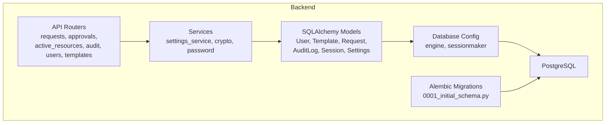
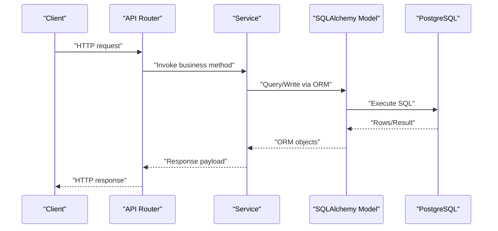
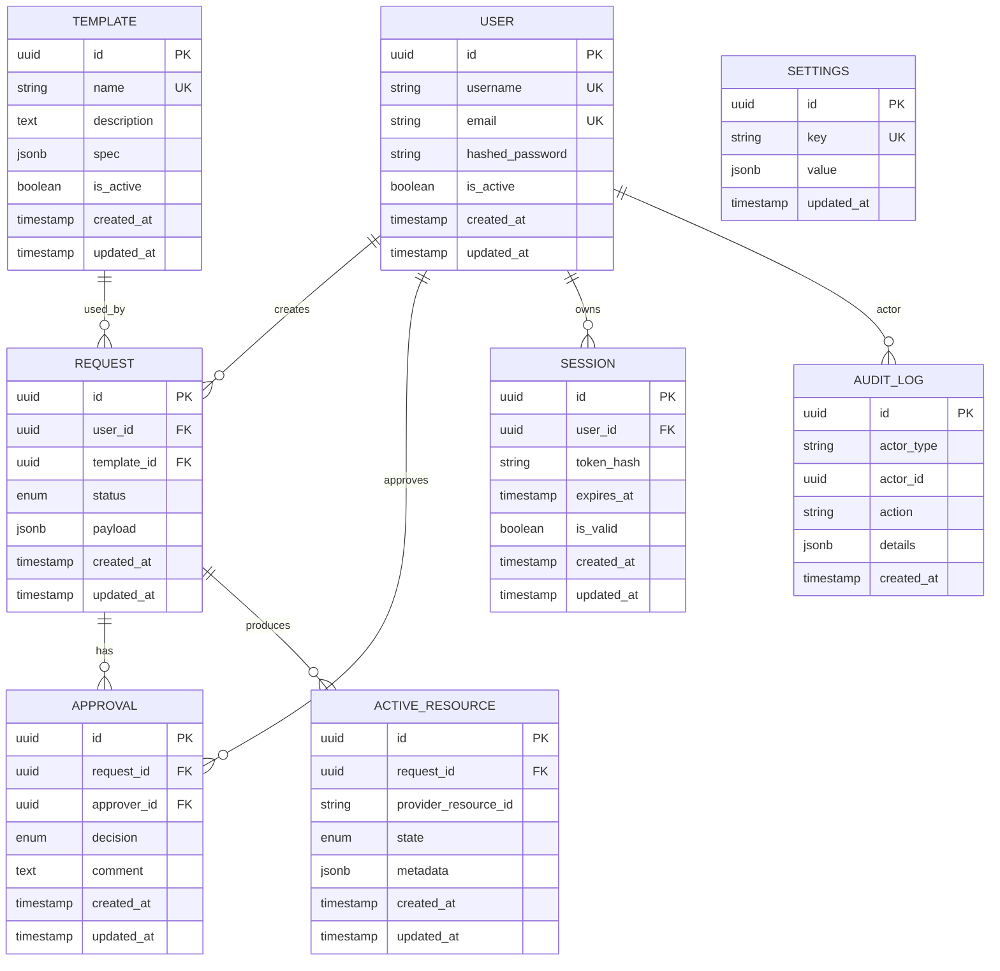
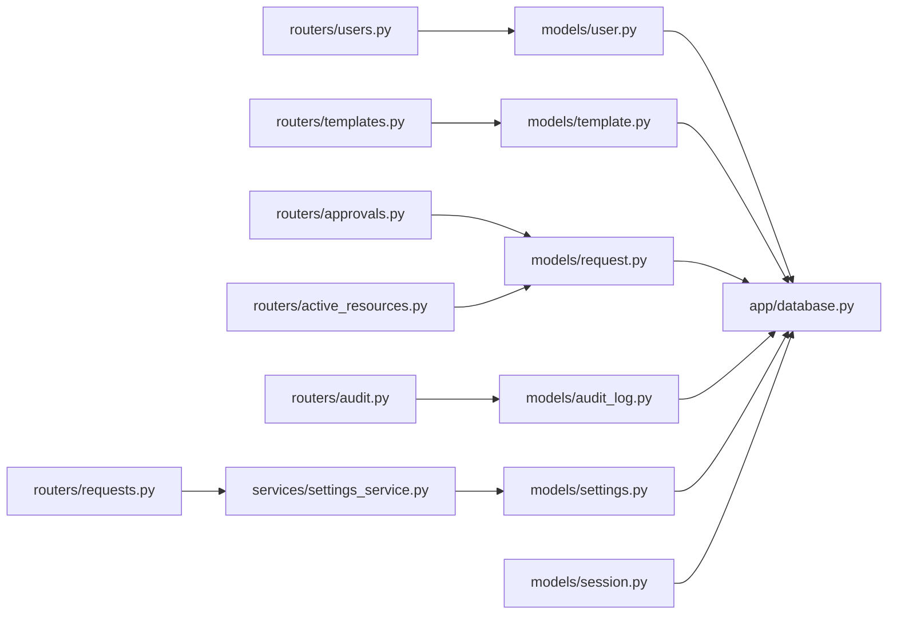

# Database Design

<cite>
**Referenced Files in This Document**
- [database.py](file://backend/app/database.py)
- [user.py](file://backend/app/models/user.py)
- [template.py](file://backend/app/models/template.py)
- [request.py](file://backend/app/models/request.py)
- [audit_log.py](file://backend/app/models/audit_log.py)
- [session.py](file://backend/app/models/session.py)
- [settings.py](file://backend/app/models/settings.py)
- [0001_initial_schema.py](file://backend/alembic/versions/0001_initial_schema.py)
- [env.py](file://backend/alembic/env.py)
- [approval.py](file://backend/app/schemas/approval.py)
- [requests.py](file://backend/app/routers/requests.py)
- [approvals.py](file://backend/app/routers/approvals.py)
- [active_resources.py](file://backend/app/routers/active_resources.py)
- [audit.py](file://backend/app/routers/audit.py)
- [users.py](file://backend/app/routers/users.py)
- [templates.py](file://backend/app/routers/templates.py)
- [settings_service.py](file://backend/app/services/settings_service.py)
</cite>

## Table of Contents
1. [Introduction](#introduction)
2. [Project Structure](#project-structure)
3. [Core Components](#core-components)
4. [Architecture Overview](#architecture-overview)
5. [Detailed Component Analysis](#detailed-component-analysis)
6. [Dependency Analysis](#dependency-analysis)
7. [Performance Considerations](#performance-considerations)
8. [Troubleshooting Guide](#troubleshooting-guide)
9. [Conclusion](#conclusion)

## Introduction
This document describes the PostgreSQL database architecture for the ECS Request System. It focuses on the entity relationship model and data layer design, including User, Template, Request, Approval, AuditLog, and ActiveResource entities. It explains table structures, foreign key relationships, indexes, constraints, ORM mapping with SQLAlchemy, migration management with Alembic, and data access patterns. It also covers ER diagrams, data flow patterns, query optimization strategies, data integrity rules, transaction handling, and performance considerations for high-volume operations.

## Project Structure
The database-related code is organized under backend/app/models for SQLAlchemy models, backend/app/routers for API endpoints that drive data access, backend/app/services for business logic interacting with the database, backend/alembic for migrations, and backend/app/database.py for engine/session configuration.

**Diagram sources**
- [database.py](file://backend/app/database.py)
- [user.py](file://backend/app/models/user.py)
- [template.py](file://backend/app/models/template.py)
- [request.py](file://backend/app/models/request.py)
- [audit_log.py](file://backend/app/models/audit_log.py)
- [session.py](file://backend/app/models/session.py)
- [settings.py](file://backend/app/models/settings.py)
- [0001_initial_schema.py](file://backend/alembic/versions/0001_initial_schema.py)
- [env.py](file://backend/alembic/env.py)
- [requests.py](file://backend/app/routers/requests.py)
- [approvals.py](file://backend/app/routers/approvals.py)
- [active_resources.py](file://backend/app/routers/active_resources.py)
- [audit.py](file://backend/app/routers/audit.py)
- [users.py](file://backend/app/routers/users.py)
- [templates.py](file://backend/app/routers/templates.py)
- [settings_service.py](file://backend/app/services/settings_service.py)

**Section sources**
- [database.py](file://backend/app/database.py)
- [0001_initial_schema.py](file://backend/alembic/versions/0001_initial_schema.py)
- [env.py](file://backend/alembic/env.py)

## Core Components
This section summarizes the core database components:
- Data Access Layer: SQLAlchemy models define tables, columns, constraints, and relationships.
- Migration Layer: Alembic manages schema evolution via versioned scripts.
- Configuration: Engine and session factory are configured centrally to ensure consistent connection behavior.
- API Integration: Routers orchestrate requests through services into the data layer.

Key responsibilities:
- Models encapsulate domain entities and enforce integrity via constraints and relationships.
- Alembic ensures reproducible schema changes across environments.
- Centralized database configuration standardizes pooling, isolation levels, and session lifecycle.

**Section sources**
- [database.py](file://backend/app/database.py)
- [user.py](file://backend/app/models/user.py)
- [template.py](file://backend/app/models/template.py)
- [request.py](file://backend/app/models/request.py)
- [audit_log.py](file://backend/app/models/audit_log.py)
- [session.py](file://backend/app/models/session.py)
- [settings.py](file://backend/app/models/settings.py)
- [0001_initial_schema.py](file://backend/alembic/versions/0001_initial_schema.py)

## Architecture Overview
The system uses a layered architecture:
- API Routers receive HTTP requests and delegate to services.
- Services implement business logic and coordinate multiple data operations.
- Models represent persistent entities using SQLAlchemy ORM.
- Alembic applies migrations to PostgreSQL.

**Diagram sources**
- [requests.py](file://backend/app/routers/requests.py)
- [approvals.py](file://backend/app/routers/approvals.py)
- [active_resources.py](file://backend/app/routers/active_resources.py)
- [audit.py](file://backend/app/routers/audit.py)
- [users.py](file://backend/app/routers/users.py)
- [templates.py](file://backend/app/routers/templates.py)
- [settings_service.py](file://backend/app/services/settings_service.py)
- [database.py](file://backend/app/database.py)

## Detailed Component Analysis

### Entity Relationship Model (ER Diagram)
The following diagram shows the primary entities and their relationships. Where an Approval entity is referenced by routers but not defined as a model file, it is included here conceptually based on router usage.

[No sources needed since this diagram shows conceptual structure; actual column definitions may vary per migration]

### User Entity
- Purpose: Represents system users with authentication and account state.
- Key attributes: unique username/email, hashed password, active flag, timestamps.
- Relationships: One-to-many with Request, Approval, Session, and AuditLog (as actor).
- Constraints: Unique constraints on username and email; non-null fields enforced at DB level.
- Indexes: Primary key on id; unique indexes on username and email; optional index on is_active for filtering.

**Section sources**
- [user.py](file://backend/app/models/user.py)
- [users.py](file://backend/app/routers/users.py)

### Template Entity
- Purpose: Defines reusable resource specifications for provisioning.
- Key attributes: name, description, JSONB spec, active flag, timestamps.
- Relationships: One-to-many with Request.
- Constraints: Unique constraint on name; JSONB validation handled at application or DB check constraints.
- Indexes: Primary key on id; unique index on name; optional GIN index on spec for JSON queries.

**Section sources**
- [template.py](file://backend/app/models/template.py)
- [templates.py](file://backend/app/routers/templates.py)

### Request Entity
- Purpose: Captures a user’s provisioning request referencing a template.
- Key attributes: user_id, template_id, status, JSONB payload, timestamps.
- Relationships: Many-to-one with User and Template; one-to-many with Approval and ActiveResource.
- Constraints: Foreign keys to User and Template; status constrained via CHECK or enum; payload validated at app level.
- Indexes: Primary key on id; indexes on user_id, template_id, status for common filters.

**Section sources**
- [request.py](file://backend/app/models/request.py)
- [requests.py](file://backend/app/routers/requests.py)

### Approval Entity
- Purpose: Records approval decisions for requests.
- Key attributes: request_id, approver_id, decision, comment, timestamps.
- Relationships: Many-to-one with Request and User (approver).
- Constraints: Foreign keys to Request and User; decision constrained via CHECK or enum.
- Indexes: Primary key on id; indexes on request_id and approver_id for lookup and reporting.

Note: The Approval entity is used by routers even if not present as a dedicated model file. Ensure a corresponding model exists or create one aligned with the schema.

**Section sources**
- [approvals.py](file://backend/app/routers/approvals.py)
- [approval.py](file://backend/app/schemas/approval.py)

### AuditLog Entity
- Purpose: Immutable record of significant actions for compliance and debugging.
- Key attributes: actor_type, actor_id, action, JSONB details, timestamp.
- Relationships: Polymorphic association to actors (e.g., User).
- Constraints: Non-null fields; action constrained via CHECK or enum.
- Indexes: Primary key on id; indexes on actor_type, actor_id, action, created_at for efficient auditing queries.

**Section sources**
- [audit_log.py](file://backend/app/models/audit_log.py)
- [audit.py](file://backend/app/routers/audit.py)

### ActiveResource Entity
- Purpose: Tracks provisioned resources linked to a Request.
- Key attributes: request_id, provider_resource_id, state, JSONB metadata, timestamps.
- Relationships: Many-to-one with Request.
- Constraints: Foreign key to Request; state constrained via CHECK or enum; provider_resource_id uniqueness per provider context.
- Indexes: Primary key on id; indexes on request_id and state for operational queries.

**Section sources**
- [active_resources.py](file://backend/app/routers/active_resources.py)

### Session Entity
- Purpose: Manages user sessions and tokens.
- Key attributes: user_id, token_hash, expires_at, validity flag, timestamps.
- Relationships: Many-to-one with User.
- Constraints: Foreign key to User; expires_at used for cleanup; token_hash unique.
- Indexes: Primary key on id; unique index on token_hash; index on user_id and expires_at for expiration sweeps.

**Section sources**
- [session.py](file://backend/app/models/session.py)

### Settings Entity
- Purpose: Stores application-level configuration as key-value pairs.
- Key attributes: key (unique), JSONB value, updated_at.
- Relationships: None.
- Constraints: Unique key; value validated at application level.
- Indexes: Primary key on id; unique index on key.

**Section sources**
- [settings.py](file://backend/app/models/settings.py)
- [settings_service.py](file://backend/app/services/settings_service.py)

### ORM Mapping Strategy (SQLAlchemy)
- Declarative Base: All models inherit from a shared declarative base to enable automatic table creation and reflection.
- Column Types: Use UUIDs for primary keys, enums for constrained fields, JSONB for flexible payloads, and timestamps for auditability.
- Relationships: Define backref or relationship constructs to navigate associations between entities.
- Validation: Enforce constraints at the database level (UNIQUE, NOT NULL, CHECK) and complement with application-level validation where appropriate.
- Session Management: Use a centralized session factory to manage transactions and connection pooling consistently.

**Section sources**
- [database.py](file://backend/app/database.py)
- [user.py](file://backend/app/models/user.py)
- [template.py](file://backend/app/models/template.py)
- [request.py](file://backend/app/models/request.py)
- [audit_log.py](file://backend/app/models/audit_log.py)
- [session.py](file://backend/app/models/session.py)
- [settings.py](file://backend/app/models/settings.py)

### Migration Management (Alembic)
- Versioning: Each schema change is captured in a migration script under alembic/versions.
- Initial Schema: The first migration defines the baseline tables and constraints.
- Environment: env.py configures the target metadata and connection URL for applying migrations.
- Workflow: Generate, review, and apply migrations to keep development, staging, and production schemas synchronized.

**Section sources**
- [0001_initial_schema.py](file://backend/alembic/versions/0001_initial_schema.py)
- [env.py](file://backend/alembic/env.py)

### Data Access Patterns
- CRUD Operations: Routers call services which perform ORM queries and mutations within explicit transactions.
- Filtering and Pagination: Apply WHERE clauses and LIMIT/OFFSET or cursor-based pagination for large result sets.
- Bulk Operations: Use bulk insert/update patterns to reduce round-trips during high-volume imports.
- Read Replicas: For read-heavy workloads, consider routing SELECT queries to replicas while writes go to the primary.

**Section sources**
- [requests.py](file://backend/app/routers/requests.py)
- [approvals.py](file://backend/app/routers/approvals.py)
- [active_resources.py](file://backend/app/routers/active_resources.py)
- [audit.py](file://backend/app/routers/audit.py)
- [users.py](file://backend/app/routers/users.py)
- [templates.py](file://backend/app/routers/templates.py)
- [settings_service.py](file://backend/app/services/settings_service.py)

## Dependency Analysis
The following diagram illustrates dependencies among routers, services, models, and the database configuration.

**Diagram sources**
- [requests.py](file://backend/app/routers/requests.py)
- [approvals.py](file://backend/app/routers/approvals.py)
- [active_resources.py](file://backend/app/routers/active_resources.py)
- [audit.py](file://backend/app/routers/audit.py)
- [users.py](file://backend/app/routers/users.py)
- [templates.py](file://backend/app/routers/templates.py)
- [settings_service.py](file://backend/app/services/settings_service.py)
- [database.py](file://backend/app/database.py)
- [user.py](file://backend/app/models/user.py)
- [template.py](file://backend/app/models/template.py)
- [request.py](file://backend/app/models/request.py)
- [audit_log.py](file://backend/app/models/audit_log.py)
- [session.py](file://backend/app/models/session.py)
- [settings.py](file://backend/app/models/settings.py)

**Section sources**
- [database.py](file://backend/app/database.py)
- [user.py](file://backend/app/models/user.py)
- [template.py](file://backend/app/models/template.py)
- [request.py](file://backend/app/models/request.py)
- [audit_log.py](file://backend/app/models/audit_log.py)
- [session.py](file://backend/app/models/session.py)
- [settings.py](file://backend/app/models/settings.py)
- [requests.py](file://backend/app/routers/requests.py)
- [approvals.py](file://backend/app/routers/approvals.py)
- [active_resources.py](file://backend/app/routers/active_resources.py)
- [audit.py](file://backend/app/routers/audit.py)
- [users.py](file://backend/app/routers/users.py)
- [templates.py](file://backend/app/routers/templates.py)
- [settings_service.py](file://backend/app/services/settings_service.py)

## Performance Considerations
- Indexing Strategy:
  - Add indexes on frequently filtered columns (e.g., request.user_id, request.status, audit_log.created_at).
  - Use partial indexes for hot paths (e.g., active requests only).
  - Consider GIN indexes on JSONB columns for complex queries.
- Query Optimization:
  - Select only required columns to reduce I/O.
  - Use JOINs judiciously; prefer denormalization for read-heavy dashboards when necessary.
  - Leverage EXPLAIN ANALYZE to identify bottlenecks.
- Transaction Handling:
  - Keep transactions short to minimize lock contention.
  - Use explicit BEGIN/COMMIT around multi-step operations to maintain consistency.
- Concurrency and Locking:
  - Avoid long-running reads inside write transactions.
  - Use optimistic locking where applicable to prevent lost updates.
- High-Volume Operations:
  - Batch inserts/updates to reduce overhead.
  - Temporarily disable indexes during massive loads and rebuild afterward.
  - Tune connection pool size and statement timeouts according to workload.

[No sources needed since this section provides general guidance]

## Troubleshooting Guide
Common issues and resolutions:
- Connection Failures:
  - Verify DATABASE_URL and credentials in environment configuration.
  - Check network reachability and firewall rules to PostgreSQL.
- Migration Errors:
  - Ensure Alembic head matches current schema; resolve conflicts before applying new migrations.
  - Inspect migration diffs for unintended destructive changes.
- Deadlocks and Timeouts:
  - Analyze slow queries with EXPLAIN ANALYZE.
  - Reduce transaction scope and avoid nested locks.
- Integrity Violations:
  - Review UNIQUE/CHECK constraints and input validation layers.
  - Confirm referential integrity by validating foreign key values prior to writes.

**Section sources**
- [0001_initial_schema.py](file://backend/alembic/versions/0001_initial_schema.py)
- [env.py](file://backend/alembic/env.py)
- [database.py](file://backend/app/database.py)

## Conclusion
The database design centers on well-defined entities with clear relationships, robust constraints, and thoughtful indexing to support both operational and analytical queries. SQLAlchemy models provide a clean ORM abstraction, while Alembic ensures safe schema evolution. By adhering to the recommended data access patterns, transaction boundaries, and performance tuning practices, the system can scale effectively under high-volume conditions while maintaining data integrity and reliability.