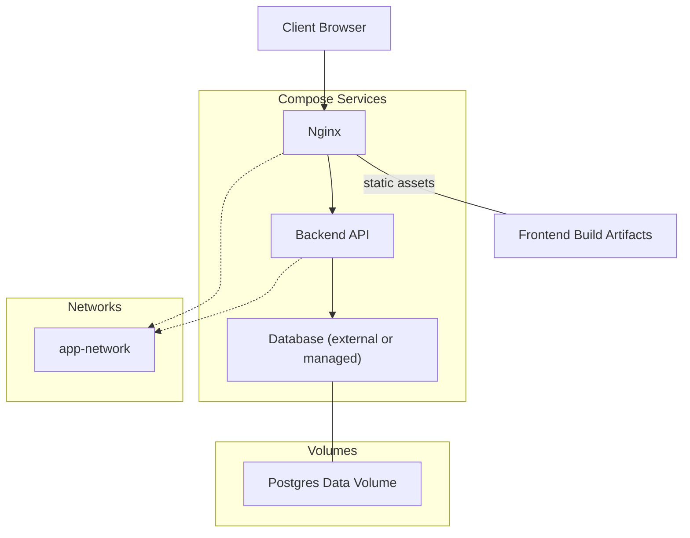
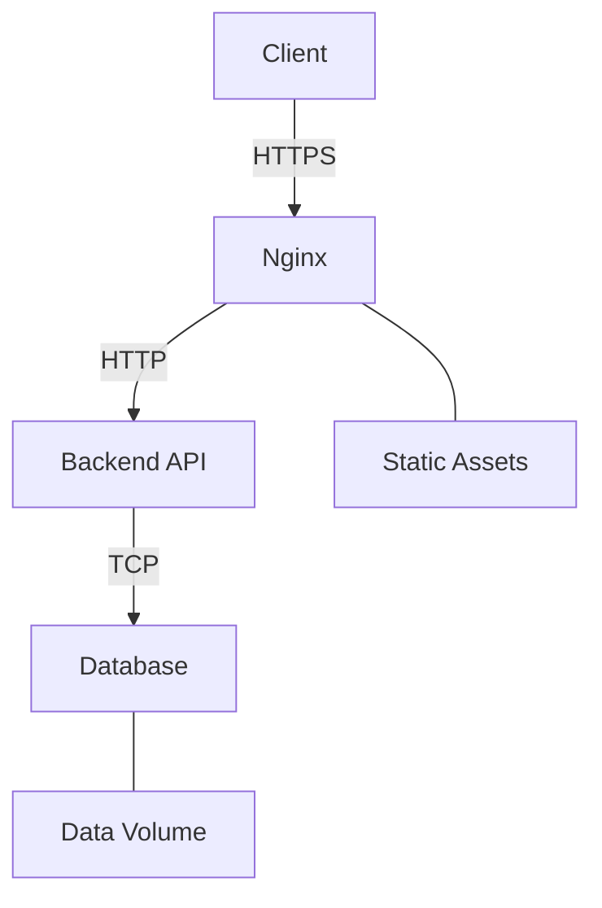
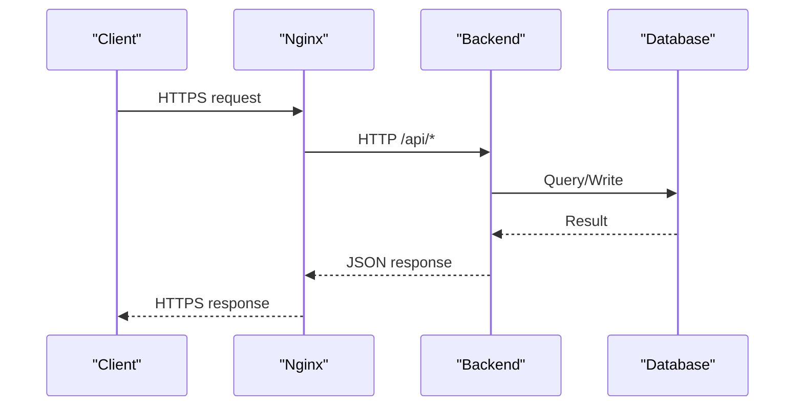
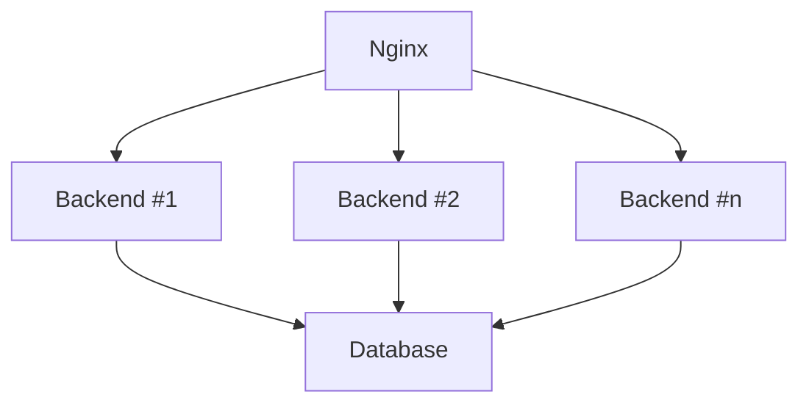

# Deployment Topology

<cite>
**Referenced Files in This Document**
- [docker-compose.yml](file://docker-compose.yml)
- [nginx/nginx.conf](file://nginx/nginx.conf)
- [backend/Dockerfile](file://backend/Dockerfile)
- [backend/entrypoint.sh](file://backend/entrypoint.sh)
- [backend/app/main.py](file://backend/app/main.py)
- [backend/app/config.py](file://backend/app/config.py)
- [backend/app/database.py](file://backend/app/database.py)
- [frontend/Dockerfile](file://frontend/Dockerfile)
- [frontend/vite.config.js](file://frontend/vite.config.js)
</cite>

## Table of Contents
1. [Introduction](#introduction)
2. [Project Structure](#project-structure)
3. [Core Components](#core-components)
4. [Architecture Overview](#architecture-overview)
5. [Detailed Component Analysis](#detailed-component-analysis)
6. [Dependency Analysis](#dependency-analysis)
7. [Performance Considerations](#performance-considerations)
8. [Troubleshooting Guide](#troubleshooting-guide)
9. [Conclusion](#conclusion)
10. [Appendices](#appendices)

## Introduction
This document describes the deployment topology for a containerized microservices setup consisting of a backend API, a frontend web application, and an Nginx reverse proxy. It explains Docker Compose orchestration, service dependencies, network topology, volume management, environment variable handling, health checks, and production considerations including monitoring and disaster recovery.

## Project Structure
The repository is organized into three primary services:
- Backend: Python-based API with database migrations and runtime entrypoint
- Frontend: Static site built by Vite and served via Nginx
- Nginx: Reverse proxy, SSL termination, and static file serving

[No sources needed since this diagram shows conceptual workflow, not actual code structure]

**Section sources**
- [docker-compose.yml](file://docker-compose.yml)
- [nginx/nginx.conf](file://nginx/nginx.conf)
- [backend/Dockerfile](file://backend/Dockerfile)
- [frontend/Dockerfile](file://frontend/Dockerfile)

## Core Components
- Docker Compose orchestrates services, networks, and volumes. It defines the Nginx, Backend, and optional Database services, along with shared networking and persistent storage.
- Nginx acts as the single ingress point, terminating TLS, routing traffic to the backend API, and serving prebuilt frontend assets.
- The Backend exposes REST endpoints, connects to the database, and runs migrations at startup via an entrypoint script.
- The Frontend is built during image creation and served statically by Nginx.

Key responsibilities:
- Service discovery and dependency ordering within Docker networks
- Environment-driven configuration for all services
- Health checks for readiness and liveness
- Persistent data for the database layer

**Section sources**
- [docker-compose.yml](file://docker-compose.yml)
- [nginx/nginx.conf](file://nginx/nginx.conf)
- [backend/entrypoint.sh](file://backend/entrypoint.sh)
- [backend/app/config.py](file://backend/app/config.py)
- [backend/app/database.py](file://backend/app/database.py)
- [frontend/Dockerfile](file://frontend/Dockerfile)

## Architecture Overview
The system follows a classic reverse-proxy pattern:
- Clients connect to Nginx over HTTPS
- Nginx proxies API requests to the Backend service on an internal network
- Nginx serves static frontend files from its own filesystem
- The Backend persists state to a database using a persistent volume

**Diagram sources**
- [docker-compose.yml](file://docker-compose.yml)
- [nginx/nginx.conf](file://nginx/nginx.conf)
- [backend/app/database.py](file://backend/app/database.py)

## Detailed Component Analysis

### Docker Compose Orchestration
- Defines services: Nginx, Backend, and optionally a Database service
- Configures a shared internal network for inter-service communication
- Mounts volumes for database persistence and any required runtime artifacts
- Sets environment variables per service for configuration
- Adds health checks for Nginx and Backend to drive readiness and restart policies

Operational notes:
- Use depends_on to control start order where appropriate
- Expose only Nginx externally; keep Backend and Database internal
- Centralize secrets and sensitive values via environment files or secret managers

**Section sources**
- [docker-compose.yml](file://docker-compose.yml)

### Nginx Reverse Proxy Configuration
Responsibilities:
- Terminate SSL/TLS using provided certificates
- Route /api/* to the Backend service
- Serve static frontend assets from a mounted directory
- Apply load balancing across multiple Backend instances if configured
- Set security headers and timeouts suitable for API and static content

Configuration highlights:
- Upstream definition for Backend pool
- Location blocks for API and static paths
- SSL certificate and key directives
- Proxy headers forwarding client information

**Section sources**
- [nginx/nginx.conf](file://nginx/nginx.conf)

### Backend Containerization Strategy
- Multi-stage build to minimize image size
- Install dependencies and copy application code
- Run database migrations at startup via an entrypoint script
- Expose the HTTP port used by the ASGI server
- Read configuration from environment variables

Runtime behavior:
- Entrypoint waits for the database to be ready before running migrations
- Application reads settings from environment variables
- Health check endpoint can be polled by Nginx or orchestrators

**Section sources**
- [backend/Dockerfile](file://backend/Dockerfile)
- [backend/entrypoint.sh](file://backend/entrypoint.sh)
- [backend/app/config.py](file://backend/app/config.py)
- [backend/app/main.py](file://backend/app/main.py)

### Frontend Containerization Strategy
- Build step compiles assets during image creation
- Final image contains only static files
- Nginx serves these files directly without a Node runtime

Build-time inputs:
- Source code and build configuration
- Optional environment variables injected at build time for asset URLs

**Section sources**
- [frontend/Dockerfile](file://frontend/Dockerfile)
- [frontend/vite.config.js](file://frontend/vite.config.js)

### Environment Variable Management
- Backend settings are loaded from environment variables at runtime
- Database connection strings, credentials, and feature flags are externalized
- Nginx SSL paths and upstream targets are configurable via compose or env files
- Avoid hardcoding secrets in images; use runtime injection

Best practices:
- Separate .env files for development and production
- Validate required variables at startup
- Rotate secrets without rebuilding images

**Section sources**
- [backend/app/config.py](file://backend/app/config.py)
- [docker-compose.yml](file://docker-compose.yml)

### Health Check Implementations
- Backend exposes a health endpoint that verifies connectivity to the database and overall readiness
- Nginx health can be validated by checking its HTTP status
- Compose healthchecks can gate dependent services and trigger restarts

Health flow:
- Orchestrator probes health endpoints
- Unhealthy containers are restarted or removed from rotation
- Readiness gates prevent traffic until services are fully initialized

**Section sources**
- [docker-compose.yml](file://docker-compose.yml)
- [backend/app/main.py](file://backend/app/main.py)

### Network Topology and Service Communication
- All services attach to a shared internal network
- Only Nginx is exposed to clients
- Backend communicates with the database over the internal network
- DNS names correspond to service names defined in Compose

**Diagram sources**
- [docker-compose.yml](file://docker-compose.yml)
- [nginx/nginx.conf](file://nginx/nginx.conf)
- [backend/app/database.py](file://backend/app/database.py)

### Volume Management and Data Persistence
- Database data is persisted to a named volume to survive container restarts
- Any upload directories or caches should be mapped to host or cloud storage
- Backup strategies should target the database volume or logical backups

Considerations:
- Ensure volume permissions align with the database user
- Regularly test restore procedures
- For multi-node setups, use a managed database instead of local volumes

**Section sources**
- [docker-compose.yml](file://docker-compose.yml)

### Scaling Considerations
- Horizontal scaling of Backend behind Nginx upstream
- Stateless design enables easy replication
- Externalize sessions and caches to shared stores
- Use read replicas for database scaling if supported

[No sources needed since this diagram shows conceptual workflow, not actual code structure]

## Dependency Analysis
Service-level dependencies:
- Nginx depends on Backend availability for API routes
- Backend depends on Database availability and schema migration completion
- Frontend assets are baked into the Nginx image; no runtime dependency on the Frontend service

**Diagram sources**
- [docker-compose.yml](file://docker-compose.yml)
- [nginx/nginx.conf](file://nginx/nginx.conf)
- [backend/app/database.py](file://backend/app/database.py)

**Section sources**
- [docker-compose.yml](file://docker-compose.yml)
- [nginx/nginx.conf](file://nginx/nginx.conf)
- [backend/app/database.py](file://backend/app/database.py)

## Performance Considerations
- Enable gzip/brotli compression in Nginx for static assets
- Tune worker processes and connections based on CPU cores
- Use connection pooling for database access in the Backend
- Cache frequently accessed responses at Nginx when safe
- Keep images small to reduce startup latency

[No sources needed since this section provides general guidance]

## Troubleshooting Guide
Common issues and resolutions:
- Nginx cannot reach Backend: verify service name, ports, and network configuration
- Backend fails migrations: ensure database is reachable and credentials are correct
- SSL errors: confirm certificate paths and permissions
- Slow cold starts: optimize image layers and enable caching
- Health check failures: inspect logs and readiness conditions

Operational tips:
- Inspect container logs for each service
- Validate environment variables at runtime
- Test health endpoints manually
- Review Nginx error logs for upstream failures

**Section sources**
- [docker-compose.yml](file://docker-compose.yml)
- [nginx/nginx.conf](file://nginx/nginx.conf)
- [backend/entrypoint.sh](file://backend/entrypoint.sh)
- [backend/app/config.py](file://backend/app/config.py)

## Conclusion
This deployment topology uses Docker Compose to orchestrate Nginx, Backend, and a database-backed API. Nginx terminates TLS, balances traffic, and serves static assets. The Backend is stateless and scalable, while data persistence is handled via volumes or managed databases. With proper health checks, environment management, and monitoring, this setup supports reliable development and production deployments.

[No sources needed since this section summarizes without analyzing specific files]

## Appendices

### Production Deployment Patterns
- Use managed databases and object storage for persistence
- Store secrets in a vault or platform secret store
- Deploy behind a managed load balancer or ingress controller
- Implement structured logging and metrics collection
- Define rollback procedures and blue/green or canary releases

[No sources needed since this section provides general guidance]

### Monitoring Integration
- Export application metrics and expose them to a scraper
- Forward logs to a centralized log aggregator
- Configure alerting on error rates, latency, and resource usage
- Integrate APM tools for distributed tracing

[No sources needed since this section provides general guidance]

### Disaster Recovery Procedures
- Schedule regular database backups and test restores
- Version-control configuration and infrastructure-as-code
- Maintain runbooks for common failure scenarios
- Practice failover drills and measure RTO/RPO

[No sources needed since this section provides general guidance]